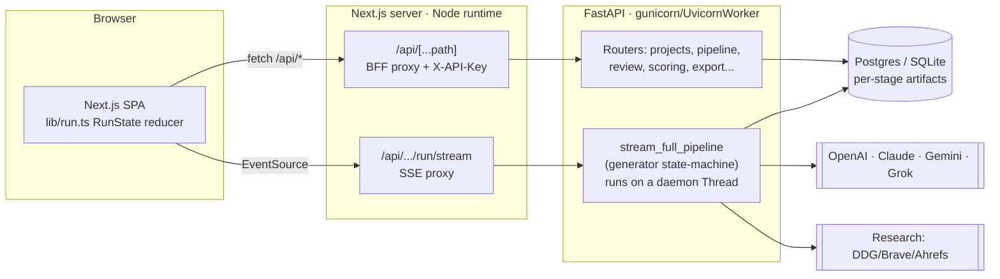
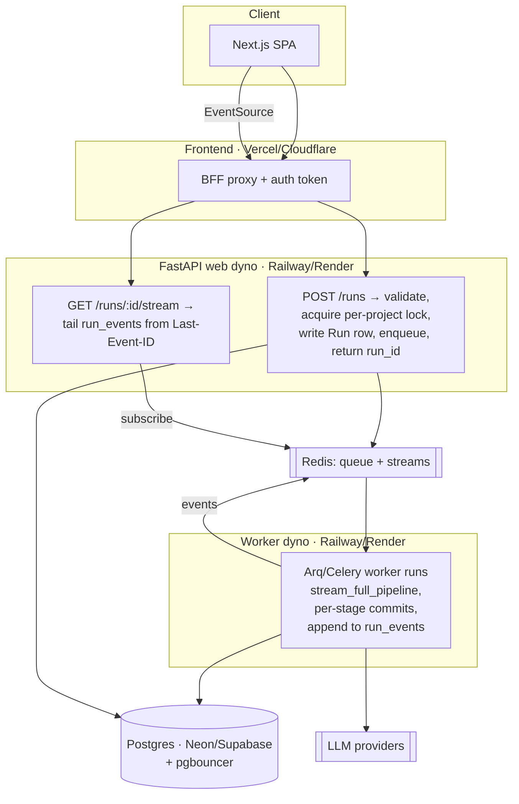
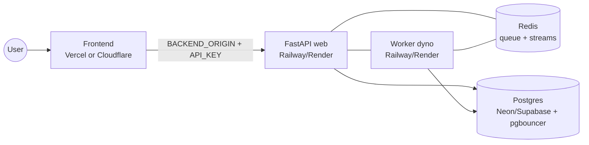

# ContentOS — System Design & Architecture Audit

**Audit date:** 2026‑07‑16
**Method:** Multi‑agent architecture review — 7 specialist agents each deep‑read a subsystem (pipeline runtime, council/providers, data model, frontend, security/tenancy, scalability/ops, integrations), followed by a lead‑architect synthesis. Grounded in the real code, not the PRD.
**Overall grade:** **B‑** — strong local craftsmanship and separation of concerns, undermined by one systemic gap (run state is coupled to the live HTTP/SSE connection) and hard single‑tenancy.

---

## 1. Executive summary

ContentOS is a **thoughtfully engineered MVP**. Individual subsystems show real craft: a deterministic zero‑key mock path (the whole council→judge→draft pipeline runs end‑to‑end with no API keys), per‑stage short transactions, an off‑loop worker‑thread/`asyncio.Queue` bridge that keeps the event loop unblocked, `requestAnimationFrame`‑batched token streaming, clean provider/research adapter ABCs, and a genuinely well‑designed **gated human‑in‑the‑loop** resume flow.

But it rests on **one foundational fault that every reviewer surfaced independently**: a pipeline run is **ephemeral state living in a daemon thread plus an open SSE connection** — there is no durable `Run`/`Job` entity and no queue. **Run lifetime == connection lifetime.** So every deploy, autoscale event, proxy timeout, or network blip destroys minutes of in‑flight, real‑money work with no resume — and the intended serverless frontend host (Vercel/Cloudflare) will itself cut a multi‑minute stream.

Layered on that same missing entity are a cluster of coupled issues: no run‑level concurrency guard, no idempotency (re‑runs silently accumulate orphan rows), cost that is **tracked wrong and never enforced** (~70% of LLM calls uncounted; budget caps are decorative), and connection/threadpool exhaustion under modest concurrency. Security is a competent single‑tenant lock on a building with **no interior walls**: one shared key, zero owner scoping, an SSRF‑able WordPress egress, no rate limiting.

**None of this makes the current single‑operator MVP wrong.** It makes it **un‑shippable as multi‑tenant SaaS and unreliable under real concurrency** until run execution is decoupled from the HTTP connection. This document phases the path from "ship for one operator today" to "reliable multi‑tenant SaaS".

---

## 2. System overview

ContentOS turns one content **brief** into a published, fact‑checked, search‑optimized article by running **four LLMs as a debating council**, reconciling their conflicts with a **Judge**, then drafting, fact‑checking, scoring across 8 surfaces, and gating before publish.

### Pipeline stages
```
Research → Council (4 seats debate + Judge) → Outline → Draft → Fact‑check → Score (8) → Gate → Compliance → Publish/Export
```

### Tech stack
| Layer | Technology |
|-------|-----------|
| Frontend | Next.js 15 (App Router), React 19, client‑rendered SPA, SSE (EventSource) |
| Frontend↔Backend | Next Node‑runtime BFF route handlers (inject `X-API-Key`) |
| Backend | FastAPI, gunicorn + UvicornWorker |
| ORM / DB | SQLAlchemy 2.0 (typed), Alembic migrations, SQLite (dev) / Postgres (prod) |
| LLM providers | OpenAI, Anthropic, Google, xAI — via adapter ABC; blank key → deterministic mock |
| Research | DuckDuckGo / Brave / Ahrefs / hybrid / mock (provider ABC) |
| Integrations | WordPress, Google Docs, DOCX, Markdown, JSON‑LD, LinkedIn, Reddit, OpenAI Images |

### Current high‑level architecture


> **The critical characteristic:** the box `ENG` (a run executing for minutes) lives *inside the request* that opened the stream. Kill the connection or the process and the run is gone.

---

## 3. Current architecture, by subsystem

### 3.1 Pipeline runtime & SSE streaming — `pipeline/service.py`, `pipeline/router.py`
A single generator state‑machine (`stream_full_pipeline`) runs all stages, yields `{event, data}` dicts, and **persists each stage's artifact in its own short transaction**. The SSE endpoint spawns a **daemon `threading.Thread`** with its own `SessionLocal`; an async consumer bridges thread→event‑loop via `loop.call_soon_threadsafe` into an `asyncio.Queue`, formats SSE frames, heartbeats every 15 s, and sets a cancel `Event` on client disconnect. Batch `POST /run` is a **synchronous `def`** that drains the same generator to completion.
**Verdict:** correct off‑loop bridge and partial‑durability persistence — but **no durable run entity**; ungated runs always restart from research; a disconnect/deploy loses the run.

### 3.2 Council, providers & cost — `council/orchestrator.py`, `providers/*`
`run_council_events` fans the 4 seats onto a `ThreadPoolExecutor` for Round 1, runs a **directed‑ring pairwise debate** (rebuttal + reply rounds), then a two‑call **Judge** (streamed deliberation + verdict). Providers sit behind a clean adapter ABC with a data‑driven `REGISTRY` (model, policy tier, cost rate); a **blank key falls back to a deterministic mock**. Two *uncoordinated* substitution mechanisms exist — the factory's key‑fallback and the orchestrator's permissive failover.
**Verdict:** elegant council design and provider abstraction — but cost metering only counts Round‑1 reports (**debate + Judge ≈ 70% of calls uncounted**), and provider substitution can bill the wrong provider at the wrong rate.

### 3.3 Data model & persistence — `models.py`, `db.py`, `migrations/`
Clean SQLAlchemy 2.0 typed schema, ~13 tables rooted at `project`, fanning to research, the council tables (`agent_run` / `debate` / `debate_turn` / `decision`), outline, draft, `usage` (cost), and draft‑scoped `score`/`claim`/`internal_link`. Alembic is properly wired (single linear head, `render_as_batch`, `compare_type`).
**Verdict:** solid, typed foundation — but **no `owner_id` anywhere** (single‑tenant), no `Run` entity, artifacts resolved by "latest" row (re‑runs append duplicates), naive timestamps, and no DB‑level cascade/CHECK constraints.

### 3.4 Frontend — `lib/run.ts`, `lib/api.ts`, `app/**`, BFF routes
A Next.js 15 App Router SPA rendered **almost entirely client‑side** (`"use client"` everywhere, data fetched in `useEffect`). The central runtime concern — a multi‑minute run — is streamed over an `EventSource` and reduced into a single immutable `RunState`, with deltas batched per animation frame. The BFF route handlers inject `X-API-Key` server‑side so it never reaches the browser.
**Verdict:** the `RunState` reducer + rAF batching is the right design — but there are **three separate EventSource implementations** across four run surfaces (drift; two ignore streamed debate/judge), hand‑mirrored API types parsed as `any`, and `es.onerror` gives up (a retry restarts the whole pipeline).

### 3.5 Security, auth & tenancy — `auth.py`, `main.py`, `config.py`, `export/*`
One app‑wide dependency checks a single shared `X-API-Key` (constant‑time compare); unset key = fully open (dev). Prod guards reject SQLite and require the key. **No identity, users, sessions, roles, or ownership exists**; login/signup pages are cosmetic. `wordpress_publish` POSTs Basic‑auth creds to an **arbitrary caller‑supplied `site_url`** with no allow‑list.
**Verdict:** adequate single‑tenant hygiene (constant‑time compare, prod guards, generic 500s) — but **unfit/unsafe for a second tenant**, and an SSRF vector via WordPress egress. No rate limiting.

### 3.6 Scalability & ops — `gunicorn.conf.py`, `db.py`, `config.py`
The signature workload executes **inline with the request** (daemon thread per run, own session). Sync `POST /run` occupies FastAPI's shared anyio threadpool for minutes. Default DB pool is 5 + 10, with each run holding a connection for most of its duration. No background queue, no rate limiting, no metrics/tracing, no structured logs.
**Verdict:** works for one operator; **worker/threadpool/connection‑pool exhaustion and un‑operability** under any real concurrency. This is where the missing `Run`/queue hurts most.

### 3.7 External integrations & I/O — `research/provider.py`, `export/*`, `distribute/*`, `media/*`
Research is the most evolved: a `ResearchProvider` ABC with 5 implementations resolved from settings, all sharing a "degrade to mock" contract. Export/distribute/media share a universal **dry‑run/placeholder** contract.
**Verdict:** good abstraction and sensible fallback layering — but **degradation is silent** (research quietly returns fabricated SERP into the fact‑check gate), no circuit breakers/caching, publishing is synchronous and non‑idempotent.

---

## 4. What's strong — **keep as‑is** (do not over‑engineer)

These are good decisions. Extend them; don't rewrite them.

1. **Adapter ABC + deterministic `MockAdapter` + blank‑key‑to‑mock factory** — the full pipeline runs with zero keys and reproducible output. Invaluable for dev, CI, demos, free runs.
2. **Per‑stage persistence in short transactions** — a mid‑run crash keeps all completed work. This is what makes crash‑resume feasible; the queue should build on it.
3. **The gated human‑in‑the‑loop design** — pauses by *ending* the stream and releasing the worker/connection, persists a checkpoint, resumes by reloading artifacts with server‑enforced approval gates. The one genuinely durable, horizontally‑safe path — and the template for the target model.
4. **Async‑consumer + worker‑thread + `asyncio.Queue` bridge**, plus SSE hygiene (15 s heartbeats, `X-Accel-Buffering: no`, `no-transform`, unbuffered BFF pipe). Correct primitives.
5. **Frontend `lib/run.ts` `RunState` reducer + rAF token batching** — the right fix for a thousands‑of‑deltas stream. Consolidate the *other* surfaces onto it.
6. **BFF `X-API-Key` injection** — the key never reaches the browser bundle; carries over cleanly to real tokens.
7. **Clean SQLAlchemy 2.0 typed models with ORM/wire (Pydantic) separation**, and properly‑wired Alembic (single head, batch, compare_type, settings‑driven URL).
8. **Universal degrade‑to‑mock / dry‑run contract** for outbound I/O and the `ResearchProvider` ABC — real abstraction with sensible fallback. Keep it; just make degradation *observable*.
9. **Data‑driven provider `REGISTRY`** (ModelInfo, PolicyTier, permissive_providers) and the failover‑only‑before‑first‑token invariant (UI never swaps model mid‑text).
10. **Prod config guards** (reject SQLite, require `API_KEY`), `/health` vs `/ready` split, constant‑time key compare, generic 500 handler.

---

## 5. Cross‑cutting weaknesses (the themes)

1. **Run execution is coupled to the HTTP/SSE connection and the accepting process.** No durable `Run`/`Job` row, no queue → runs can't be observed, resumed, retried, or survive a deploy. **This is the root cause behind most reliability & scale findings.**
2. **No concurrency control or idempotency at the run level.** Two runs on one project race the council `delete+reinsert`; every re‑run *appends* new Research/Outline/Draft/Score/Usage rows resolved by "latest".
3. **Cost is tracked wrong and never enforced.** Debate + Judge (~10 of ~14 calls) contribute zero to `usage`; per‑article and monthly caps are read only by analytics — never abort or downgrade.
4. **Hard single‑tenancy with no identity.** One shared key, no `owner_id`, unscoped queries, cosmetic login, SSRF‑able egress, no rate limiting.
5. **Silent degradation with no observability.** Research degrades to fabricated SERP invisibly; failover swaps models silently; no structured logs/metrics/tracing/run‑status surface.
6. **Duplicated, already‑drifting logic.** Council persistence in two places (one omits `cost_cents`); three EventSource clients; dual debate tables; hand‑mirrored API types.
7. **Implicit, unbounded connection/thread budgets.** Default pool, unbounded raw threads, minutes‑long sync `POST /run` on the shared threadpool — no admission control or backpressure.

---

## 6. Risk register

| # | Risk | Likelihood | Impact | Mitigation |
|---|------|:---:|:---:|-----------|
| R1 | Every deploy/autoscale/crash destroys all in‑flight non‑gated runs (minutes, real spend) with no resume | High | High | Durable `Run` + queue + resumable run‑event log (Rec 1); interim: single‑active‑run lock + `failed` status so abandoned runs are reapable |
| R2 | Multi‑minute SSE cut by serverless frontend host's function max‑duration (Vercel/CF BFF) | High | High | Stream on a streaming‑capable runtime, or bypass BFF (direct‑to‑backend with short‑lived signed token); add `Last-Event-ID` resume |
| R3 | Cross‑tenant data exposure the instant a 2nd customer shares the deployment | High | High | Add `owner_id` + owner‑scoped queries + real identity *before* any multi‑tenant exposure |
| R4 | Provider‑cost runaway: caps unenforced, ~70% tokens uncounted, reconnect‑driven duplicate runs | High | High | Central metering of all calls; enforce caps with downgrade/abort; idempotency keys |
| R5 | DB pool exhaustion / sync `POST /run` starving the shared threadpool → whole API stalls | High | High | Explicit pool sizing + pgbouncer; release request session before streaming; enqueue `POST /run`; bound concurrent runs |
| R6 | Two concurrent runs on one project corrupt council/decision state (unguarded delete+reinsert) | Medium | High | Per‑project active‑run lock / optimistic version; idempotency; `run_id`‑scoped artifacts |
| R7 | Research silently degrades to fabricated SERP → non‑real citations feed the fact‑check gate | High | High | Emit a visible "degraded to mock" signal; prefer keyed providers over the scraper; markup‑change detection |
| R8 | SSRF via caller‑supplied WordPress `site_url` reaching internal/cloud‑metadata endpoints | Medium | High | Pre‑registered site config + host allow‑list + private‑IP block + disabled redirects; rate limiting |

---

## 7. Recommendations — prioritized roadmap

Priorities: **P0** = required before real concurrency or a second tenant · **P1** = required for a credible SaaS · **P2** = quality/hardening.

### P0 — decouple the run, make it safe & cost‑bounded
| # | Recommendation | Effort | Why (short) |
|---|---------------|:---:|-------------|
| 1 | **Durable `Run`/`Job` entity + background worker/queue; SSE becomes a read‑only tail of a persisted run‑event log** | High | Keystone. Runs survive deploys, are observable/cancellable cross‑instance, and reconnect via `Last-Event-ID` instead of re‑running. |
| 2 | **Run concurrency control + idempotency** — one active run per project, idempotency key, `run_id`‑scoped artifacts | Medium | Kills the council race and unbounded duplicate rows; cheap safety rails that can land before the full queue. |
| 3 | **Stop minutes‑long work in the shared threadpool; add rate limiting + explicit pool sizing** | Medium | `POST /run` can starve every sync route; one key‑holder can spawn unbounded billed runs; default pool exhausts. |
| 4 | **Meter every LLM call and enforce budget caps** (not just display them) | Medium | ~70% of tokens uncounted; caps never abort/downgrade — a single run can blow past both while the dashboard under‑reports. |

**Rec 1 in detail:** add a `runs` row (`status`, `current_stage`, `started`, `finished`, `error`, `cost`, `idempotency_key`) with an FK from every artifact and from `usage`. `POST /run` enqueues and returns `run_id` immediately; a worker executes `stream_full_pipeline` and appends events to a `run_events` table / Redis Stream keyed by `run_id` with a monotonic id. `/run/stream` becomes a thin subscriber tailing that log from an offset. Reuse the existing gated‑resume reloaders for crash recovery. Use **Arq/Celery/RQ on Redis**, or a Postgres‑backed task table + poller if avoiding Redis.

### P1 — credible SaaS
| # | Recommendation | Effort | Why (short) |
|---|---------------|:---:|-------------|
| 5 | **Unify provider selection** into one resolver returning `(adapter, actual_provider, model, rate)` | Medium | Two uncoordinated substitution paths bill the wrong provider at the wrong rate; any budget logic is built on sand. |
| 6 | **Harden WordPress/egress against SSRF + land baseline identity (`owner_id`) now** | High | SSRF to internal/metadata endpoints; add the owner column while data is tiny to avoid a painful backfill. |
| 7 | **Observability baseline; make silent degradation visible** | Medium | A long‑running‑job system is un‑operable without structured logs/metrics/tracing; emit "degraded to mock" so mock research isn't mistaken for grounding. |
| 8 | **Validate the long‑SSE deploy target; add stream resume + bounded reconnect** | High | Serverless max‑duration cuts the stream regardless of backend correctness; `Last-Event-ID` + backoff avoids re‑running from research. |

### P2 — quality & resilience
| # | Recommendation | Effort | Why (short) |
|---|---------------|:---:|-------------|
| 9 | **Consolidate duplicated run logic** — one council‑persist fn, one frontend stream client, one debate representation, generated TS types | Medium | Every protocol change must currently be made in several already‑drifting places. |
| 10 | **Resilience hardening** — fail loudly on empty council, circuit breakers, research caching, shared pooled httpx client, idempotent publishing | High | A run where all seats fail still "succeeds"; provider outages cost 60 s×retries; research re‑runs 30–75 s of serial I/O each time. |

---

## 8. Target architecture

**Core principle: split run *acceptance* from run *execution*.**



- **Runtime:** a thin endpoint validates, acquires a per‑project active‑run lock, writes a durable `Run` (status=`queued`, `idempotency_key`, `run_id`), enqueues, and returns `run_id` immediately — no minutes‑long work in the request path. A dedicated **worker process/container** executes the existing `stream_full_pipeline`, keeps the per‑stage short‑transaction commits (partial durability + crash‑resume), and appends every event to an **append‑only `run_events` store** keyed by `run_id`.
- **Streaming:** `/runs/:id/stream` is a **stateless read‑only subscriber** tailing `run_events` from a `Last-Event-ID` offset, so any instance can serve any run and a dropped connection **replays** missed events instead of restarting. This removes the serverless max‑duration failure mode (the stream no longer holds the executing work). The gated flow generalizes cleanly onto this.
- **Concurrency & capacity:** one active `Run` per project (unique partial index / advisory lock) + idempotency keys → retries attach rather than duplicate. All artifacts + `usage` FK‑reference `run_id`. A global run semaphore, explicit `pool_size`/`max_overflow` tuned to the Neon/Supabase cap, pgbouncer transaction pooling, and releasing the request session before streaming give predictable backpressure.
- **Data:** keep the typed schema + single‑head Alembic; add `Run`, `owner_id` on root tables (land now, enforce later), `TIMESTAMPTZ`, DB‑level `ON DELETE CASCADE`, enum `CHECK`s, missing composite indexes; collapse the dual debate representation to `DebateTurn`‑canonical.
- **Auth/security:** real identity (users + JWT/OAuth), `get_current_user` filtering every query by owner, per‑tenant integration credentials in a secret store, rate limiting + per‑principal run/cost quotas, SSRF‑hardened pre‑registered egress, nonce‑based CSP.
- **Cost & providers:** one resolver `(adapter, actual_provider, model, rate)`; central metering of *every* call; enforced per‑article/monthly budgets with tier‑downgrade‑or‑abort; circuit breakers on all outbound calls.
- **Observability:** structured JSON logs with `run_id`/`project_id` correlation, Prometheus metrics (runs‑by‑status, per‑stage latency, active‑SSE gauge, provider error rates, queue depth, pool checkouts), OpenTelemetry spans, Sentry.

### Deploy topology (already decided)


| Piece | Host | Notes |
|-------|------|-------|
| Frontend | **Vercel** (easiest) or Cloudflare (via `@opennextjs/cloudflare`) | Streaming works out‑of‑box on Vercel; CF needs the adapter + SSE testing |
| Backend (web + worker) | **Railway / Render** | Runs the existing FastAPI + gunicorn unchanged. **Not** Cloudflare Workers (can't run gunicorn/psycopg/long streams). Python 3.12 pinned. |
| Queue / run‑events | **Redis** (Upstash/Railway/Render addon) | Or a Postgres‑backed task table for a no‑Redis start |
| Database | **Neon** or **Supabase** Postgres | `postgresql+psycopg://…`; Supabase → use the **direct 5432** connection for migrations, not the 6543 transaction pooler |
| Auth | Shared `X-API-Key` now → JWT/OAuth for multi‑tenant | Set the same `API_KEY` on frontend + backend; browser never sees it |

---

## 9. Phased plan

**Phase 0 — Ship for one operator (today).** ✅ Largely done in the deploy‑readiness pass: builds/tests/migrations green, prod auth via BFF verified, Python 3.12 pin, Postgres path. Add only a **single‑active‑run lock** and a `failed` run status as a cheap safety net. Deploy: Vercel + Railway + Neon/Supabase, shared API key.

**Phase 1 — Reliability (P0).** Durable `Run` + queue + `run_events` log; SSE as subscriber with `Last-Event-ID`; concurrency + idempotency; move `POST /run` off the request path; explicit pool sizing + rate limiting; central cost metering + enforced budgets.

**Phase 2 — Multi‑tenant SaaS (P1).** `owner_id` + owner‑scoped queries + real identity (JWT/OAuth); SSRF‑hardened egress; observability baseline (logs/metrics/traces/Sentry); validate/settle the streaming deploy target.

**Phase 3 — Quality & resilience (P2).** Consolidate duplicated run logic + generate TS types; circuit breakers, research caching, idempotent publishing, fail‑loud on empty council.

---

## 10. Appendix — audit method

- 7 subsystem agents (pipeline‑runtime, council‑providers, data‑model, frontend‑arch, security‑tenancy, scalability‑ops, integrations‑io) each deep‑read the real code and returned a structured assessment (overview, components, data flow, strengths, weaknesses, risks, recommendations); a lead‑architect agent synthesized them.
- 8 agents, 0 errors, ~555k tokens, 136 tool calls, ~8 min wall‑clock.
- Every finding is grounded in named files; the synthesis deduplicated overlapping findings across subsystems into the ranked recommendations above.

> **One‑line takeaway:** the parts are well‑built — the missing piece is a **durable, queue‑backed run** so a pipeline execution outlives the connection that started it. Fix that one thing and most reliability, scale, and cost risks fall with it.
