# 01 — System Architecture

**Product:** ContentOS AI — Enterprise Content Intelligence Operating System
**Document Status:** Baseline (v1.0) · Source of Truth
**Owner:** Software Architecture
**Audience:** Founder · Architect · Backend · Frontend · AI Engineer · DevOps · AI Coding Agents
**Supersedes:** —

---

## Document Contract

This document is the **single source of truth** for the ContentOS AI system. Every downstream document — `02_DATABASE.md`, `03_BACKEND.md`, `04_FRONTEND.md`, `05_API.md`, `06_MODULES.md`, `07_DEVELOPER_GUIDE.md` — is derived from and must remain consistent with this one. When a downstream document conflicts with this document, this document wins until it is formally amended through the Architecture Decision Record (ADR) process in §28.

**Reading rules for AI coding agents.** Treat every "Design Decision", "Technology Decision", and "ADR" as binding. Do not introduce alternative frameworks, storage engines, or tenancy models. Where this document says _Open Question_ (§30), stop and request a decision rather than assuming one.

**Terminology.** The word **Engine** in this document means a bounded business capability (§4.2), not an AI agent. AI is a capability _used inside_ engines, never the top-level unit of decomposition.

---

## Table of Contents

1. Executive Summary
2. Product Vision
3. Product Goals
4. Core Design Principles
5. Functional Requirements
6. Non-Functional Requirements
7. High-Level Architecture
8. C4 — Context Diagram
9. C4 — Container Diagram
10. Platform Layer
11. Content Platform
12. AI Platform
13. Knowledge Platform
14. Storage Layer
15. External Integrations
16. Data Flow
17. Request Flow
18. Event Flow
19. Background Jobs
20. Authentication Flow
21. Multi-Tenant Strategy
22. AI Model Routing
23. Caching Strategy
24. Security Overview
25. Deployment Overview
26. Folder Structure
27. Technology Decisions
28. Architecture Decision Records
29. Future Scalability
30. Open Questions

---

## 1. Executive Summary

### 1.1 What This System Is

ContentOS AI is a multi-tenant SaaS platform that operates the **entire content lifecycle** as a single, governed workflow: from a raw idea or seed keyword, through research and planning, to a written, optimized, fact-checked, and published article, and onward into analytics-driven refresh and growth.

It is explicitly **not** an "AI article writer." A writer produces text. ContentOS AI produces _evidence-grounded, quality-gated, publishable content assets_ and the intelligence around them (keyword opportunity, competitive gaps, SEO structure, citations, E-E-A-T posture, performance).

### 1.2 The Architectural Thesis

The system is organized into **five horizontal platforms plus a formal Provider Layer** stacked on a shared storage foundation (ADR-012):

| Layer                  | Responsibility                        | Owns                                                                                                 |
| ---------------------- | ------------------------------------- | ---------------------------------------------------------------------------------------------------- |
| **Platform Layer**     | Tenancy, identity, commerce           | Auth, Workspaces, Projects, Billing, Credits, Notifications                                          |
| **Content Platform**   | Domain business capabilities          | Keyword, SERP, Competitor, Research, Planning, Writing, Review, SEO, Publishing, Analytics engines   |
| **AI Platform**        | Governed access to model intelligence | AI Gateway, Model Router, Prompt Engine, Context Builder, AI Council, Memory                         |
| **Knowledge Platform** | Grounding and provenance              | Evidence Bank, Knowledge Graph, Entity Graph, Citation Engine, Vector Search                         |
| **Provider Layer**     | External provider adapters (ADR-012)  | OpenRouter, DataForSEO, Firecrawl, Exa, Stripe, Google Search Console, Google Analytics, Better Auth |
| **Storage Layer**      | Durable state                         | PostgreSQL, Redis, Vector DB, Object Storage                                                         |

Four architectural commitments make this durable for 5+ years:

1. **Engines, not agents** (§4.2, ADR-001). Business capability is the unit of decomposition. AI is a tool inside an engine, alongside rules, caches, workers, and integrations.
2. **Retrieval-Augmented Generation as default** (§4.3). No factual claim ships without a traceable source in the Evidence Bank.
3. **Quality Gates between every stage** (§4.4). Content cannot advance until it clears configurable thresholds (SEO, readability, factual confidence, citation coverage).
4. **Durable, human-in-the-loop orchestration** (§19, ADR-004). The pipeline is a long-running workflow that survives restarts and pauses cleanly for human approval.

### 1.3 Key Decisions at a Glance

| Concern                    | Decision                                                                                               | Reference |
| -------------------------- | ------------------------------------------------------------------------------------------------------ | --------- |
| Decomposition              | Engines (bounded capabilities), not agent swarm                                                        | ADR-001   |
| Repository                 | Monorepo (Turborepo + pnpm)                                                                            | ADR-002   |
| Backend framework          | NestJS (modular, DI-first)                                                                             | ADR-003   |
| Relational store           | PostgreSQL as system of record                                                                         | ADR-005   |
| Vector store               | pgvector first; Qdrant at scale                                                                        | ADR-006   |
| Long-running orchestration | Temporal (durable workflows)                                                                           | ADR-004   |
| Async jobs                 | BullMQ on Redis                                                                                        | ADR-004   |
| Multi-tenancy              | Shared DB + `tenant_id` + PostgreSQL RLS                                                               | ADR-007   |
| AI access                  | Single AI Gateway; policy-based Model Router                                                           | ADR-008   |
| Quality control            | Configurable Quality Gates + Explainability envelope                                                   | ADR-009   |
| Pipeline modules & order   | Planning + Review first-class; Review precedes SEO                                                     | ADR-011   |
| Provider Layer             | Named providers behind adapters (OpenRouter, DataForSEO, Firecrawl, Exa, Stripe, GSC, GA, Better Auth) | ADR-012   |
| Model matrix               | Claude Sonnet · GPT-5 · Gemini 2.5 Flash · Grok via OpenRouter; DeepSeek excluded                      | ADR-013   |

### 1.4 What This Document Does and Does Not Do

**Does:** define layers, boundaries, responsibilities, data/request/event flows, tenancy, model routing, caching, security posture, deployment topology, repository structure, technology choices, and the decisions behind them.

**Does not:** contain application code, API endpoint definitions, database DDL, or UI screens. Those belong in the derived documents and must conform to this one.

---

## 2. Product Vision

### 2.1 The Operating System Metaphor

An operating system schedules work, manages resources, isolates tenants, and exposes capabilities through a consistent interface. ContentOS AI applies the same idea to content: it **schedules content work**, **manages AI and credit resources**, **isolates customer workspaces**, and exposes content capabilities through a consistent workflow.

### 2.2 The Content Lifecycle

The product manages twelve lifecycle stages. Every feature maps to exactly one stage.

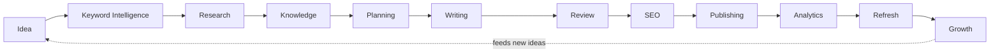

### 2.3 The Single-Workflow Promise

In one workflow, a user receives: keyword research, search intent, competitor analysis, topic clusters, NLP terms, an outline, a humanized article, images, internal links, external references, FAQs, schema, an SEO score, a readability score, an AI-detection estimate, a plagiarism estimate, an E-E-A-T score, and a ready-to-publish package. The architecture's job is to make that promise **repeatable, explainable, and governable at tenant scale**.

---

## 3. Product Goals

### 3.1 Business Goals

- Reduce time-from-idea-to-published-article from days to under an hour for a standard 2,000-word asset.
- Serve agencies, SaaS companies, publishers, and in-house SEO teams from one platform with per-workspace isolation.
- Monetize through subscription tiers plus metered AI **credits**, with predictable per-article unit economics.

### 3.2 Engineering Goals

- **Modularity:** any engine can be modified or replaced without changing others.
- **Groundedness:** all factual output is traceable to stored evidence.
- **Determinism where possible:** prompts, model routes, and gate thresholds are versioned so runs are reproducible and auditable.
- **Cost control:** the majority of AI spend is steerable through routing and caching policy, not code changes.
- **Operability:** every stage emits structured telemetry and can be paused, retried, or resumed.

### 3.3 Explicit Non-Goals (v1)

- Not a general-purpose chat assistant.
- Not a real-time collaborative document editor (single-author with review, not Google-Docs concurrency) — see §30.
- Not an ad/keyword-bidding platform; it _consumes_ keyword data, it does not run campaigns.
- No on-premise/self-hosted distribution in v1 (cloud SaaS only); white-label is a later enterprise feature (§29).

---

## 4. Core Design Principles

### 4.1 Layered Separation of Concerns

The five platforms have strict dependency direction: **Content → AI → Knowledge → Storage**, and the **Platform Layer** is a peer that provides identity and tenancy to all. A lower layer never calls upward. This keeps the AI and Knowledge platforms reusable across every content engine and prevents business logic from leaking into infrastructure.

### 4.2 Engines Over Agents (Foundational)

> **Wrong:** "Keyword Agent."
> **Correct:** "Keyword Intelligence Engine."

An **Engine** is a bounded business capability that may internally contain any of: AI calls, business rules, caching, workers, background jobs, ML models, rule engines, validation, and external API integrations. Modeling capabilities as engines (rather than as autonomous agents) gives us testability, clear ownership, independent scaling, and the ability to swap the AI implementation without rewriting the capability. AI orchestration patterns (including the multi-reviewer "AI Council", §12.5) exist **inside** the AI Platform and are invoked _by_ engines — they are never the system's primary structure. (See ADR-001.)

### 4.3 Retrieval-Augmented Generation by Default

Every article is grounded with retrieved information: trusted external sources, competitor content summaries, the tenant's brand guidelines, and the tenant's prior articles. Generation without grounding is disallowed for factual claims. The Knowledge Platform (§13) is the mechanism; the Citation Engine measures coverage; the Fact Checker flags anything unsupported rather than inventing it.

### 4.4 Quality Gates

No article proceeds to the next stage unless it passes configurable thresholds — SEO score, readability, factual confidence, citation coverage, AI-detection risk, plagiarism similarity. Gates have three outcomes: **pass**, **soft-warn** (advance with a logged warning), and **block** (require human decision). Thresholds are workspace-configurable policy, not hard-coded constants.

### 4.5 Human-in-the-Loop

Critical steps — outline approval, fact validation, final optimization — can optionally require explicit user approval before the workflow continues. The orchestrator (§19) models these as durable wait states so a workflow can pause for minutes or days without consuming compute.

### 4.6 Explainability

Every recommendation ("add this heading", "use this keyword", "raise E-E-A-T here") ships inside a standard **Explainability Envelope**:

```
{ recommendation, reason, evidence[], expected_impact, confidence }
```

This is a cross-cutting contract; no engine returns an opaque suggestion.

### 4.7 Multi-Tenancy First

Tenancy is not retrofitted. Every row, cache key, object path, and vector namespace is tenant-scoped from day one (§21). This is cheaper and safer than adding isolation later.

### 4.8 Cost-Aware Intelligence

Lightweight models handle classification and extraction; premium reasoning models are reserved for planning, synthesis, and final refinement. Intermediate results are cached aggressively, including a **semantic cache** for AI responses (§23). Cost is a first-class routing input (§22).

### 4.9 Event-Driven Where It Reduces Coupling

Engines communicate synchronously for request/response and **asynchronously via domain events** for fan-out (e.g., `ArticleDraftCompleted` triggers SEO analysis, readability scoring, and plagiarism checks in parallel). This decouples producers from consumers and enables new subscribers without touching producers (§18).

### 4.10 Extensibility Through Connectors and Plugins

New capabilities — publishing targets, data providers, output formats (YouTube script, LinkedIn post, newsletter), brand-voice packs, MCP connectors — are added as **adapters behind stable interfaces**, never as edits to the core (§15, §29).

### 4.11 Observability as a Requirement

Every request carries a correlation ID; every AI call records tokens, cost, model, prompt version, and latency; every gate decision is logged with its inputs. OpenTelemetry traces span engine and AI boundaries (§25).

---

## 5. Functional Requirements

Functional requirements are grouped by the owning engine. Each requirement is testable and maps to a lifecycle stage.

### 5.1 Keyword Intelligence

| ID      | Requirement                                                                                               |
| ------- | --------------------------------------------------------------------------------------------------------- |
| FR-KW-1 | Accept a seed keyword or topic and return search volume, difficulty, CPC, and trend.                      |
| FR-KW-2 | Return related keywords, long-tail variants, question keywords, LSI/NLP terms, and People-Also-Ask items. |
| FR-KW-3 | Return search suggestions and competitor-ranking keywords for the seed.                                   |
| FR-KW-4 | Compute an **Opportunity Score** and **Priority Score** per keyword.                                      |

### 5.2 Research & SERP

| ID      | Requirement                                                                                                                                          |
| ------- | ---------------------------------------------------------------------------------------------------------------------------------------------------- |
| FR-RS-1 | Retrieve and analyze the top 20 organic results for a target query.                                                                                  |
| FR-RS-2 | Extract per-result: word count, title, H1–H3, images, videos, internal/external links, backlinks, authority, reading level, freshness, FAQs, schema. |
| FR-RS-3 | Extract entities and candidate subtopics from retrieved sources.                                                                                     |
| FR-RS-4 | Persist every source with provenance and freshness into the Evidence Bank.                                                                           |

### 5.3 Competitor Intelligence

| ID      | Requirement                                                                                                                                               |
| ------- | --------------------------------------------------------------------------------------------------------------------------------------------------------- |
| FR-CI-1 | For each competitor page: strengths, weaknesses, missing topics, unique insights, word count, average paragraph length, keyword density, E-E-A-T signals. |
| FR-CI-2 | Synthesize a "how to outperform this competitor" recommendation set (as Explainability Envelopes).                                                        |

### 5.4 Planning (Intent · Clusters · Outline)

| ID      | Requirement                                                                                                                |
| ------- | -------------------------------------------------------------------------------------------------------------------------- |
| FR-PL-1 | Classify intent: informational, commercial, transactional, navigational, local.                                            |
| FR-PL-2 | Generate user persona, pain points, desired outcome, and content angle.                                                    |
| FR-PL-3 | Generate a topic cluster: main keyword → up to 100 supporting topics → pillar page + cluster pages → internal-linking map. |
| FR-PL-4 | Generate a full outline: H1, intro, H2/H3/H4, tables, statistics, FAQs, CTA, conclusion.                                   |

### 5.5 Writing & Enhancement

| ID      | Requirement                                                                                                                               |
| ------- | ----------------------------------------------------------------------------------------------------------------------------------------- |
| FR-WR-1 | Generate content in selectable modes (human, professional, medical, legal, marketing, technical, conversational, journalistic, academic). |
| FR-WR-2 | Support target lengths (1k/2k/3k/5k/10k) and tones (friendly, expert, professional, sales).                                               |
| FR-WR-3 | Enrich content with examples, statistics, case studies, quotes, tables, checklists, pros/cons, comparisons, FAQs, expert tips.            |
| FR-WR-4 | Generate image prompts, featured-image concepts, infographics/chart specs, alt text, and captions.                                        |

### 5.6 SEO

| ID      | Requirement                                                                                              |
| ------- | -------------------------------------------------------------------------------------------------------- |
| FR-SE-1 | Check title, meta, slug, URL, canonical, OG tags.                                                        |
| FR-SE-2 | Check keyword density, semantic/NLP coverage, heading structure, image alt.                              |
| FR-SE-3 | Suggest internal links (from tenant sitemap) and external links (authoritative sources).                 |
| FR-SE-4 | Generate JSON-LD schema (Article, FAQ, HowTo, Product, Recipe, Organization, LocalBusiness, Breadcrumb). |
| FR-SE-5 | Produce a composite **SEO Score** with per-check explanations.                                           |

### 5.7 Review (Editorial & Quality)

| ID      | Requirement                                                                                                                                     |
| ------- | ----------------------------------------------------------------------------------------------------------------------------------------------- |
| FR-RV-1 | Readability scoring: Flesch, Gunning Fog, SMOG, reading grade, sentence length, passive voice, transitions, paragraph length.                   |
| FR-RV-2 | Grammar, spelling, tone, consistency, word choice, clarity.                                                                                     |
| FR-RV-3 | AI-detection **estimate**: GPT probability, human probability, burstiness, perplexity, variation, sentence diversity — labeled predictive only. |
| FR-RV-4 | Plagiarism check vs internet, knowledge base, and uploaded files: similarity %, duplicate paragraphs, source links.                             |
| FR-RV-5 | E-E-A-T scoring across Experience, Expertise, Authority, Trust, with suggestions.                                                               |
| FR-RV-6 | Fact verification of dates, statistics, claims, names, companies, and medical/legal/finance claims; flag uncertainty rather than fabricate.     |
| FR-RV-7 | Humanization: reduce repetitive AI patterns, increase sentence variation, improve flow and transitions.                                         |

### 5.8 Publishing

| ID      | Requirement                                                                      |
| ------- | -------------------------------------------------------------------------------- |
| FR-PU-1 | One-click publish to WordPress, Webflow, Shopify, Ghost, Notion, Medium, Dev.to. |
| FR-PU-2 | Assemble a publish package: body, media, schema, meta, internal links.           |
| FR-PU-3 | Support scheduled publishing and per-target field mapping.                       |

### 5.9 Analytics & Refresh

| ID      | Requirement                                                                                 |
| ------- | ------------------------------------------------------------------------------------------- |
| FR-AN-1 | Track traffic, CTR, average position, indexed pages, impressions, conversions, content ROI. |
| FR-AN-2 | Detect ranking changes and generate refresh recommendations.                                |

### 5.10 Platform

| ID      | Requirement                                                                           |
| ------- | ------------------------------------------------------------------------------------- |
| FR-PF-1 | Multi-user workspaces with roles/permissions.                                         |
| FR-PF-2 | Project management, credit balances, billing, and notifications.                      |
| FR-PF-3 | Dashboard: projects, credits, recent articles, ranking changes, tasks, notifications. |

---

## 6. Non-Functional Requirements

| Category                     | Requirement                                         | Target (v1)                                       |
| ---------------------------- | --------------------------------------------------- | ------------------------------------------------- |
| **Latency (sync)**           | Dashboard/API reads                                 | p95 < 300 ms                                      |
| **Latency (keyword lookup)** | Cached keyword result                               | p95 < 800 ms                                      |
| **Throughput (pipeline)**    | Concurrent article pipelines per region             | ≥ 500                                             |
| **Article pipeline time**    | Standard 2k-word asset, no human wait               | p50 < 8 min, p95 < 20 min                         |
| **Availability**             | Platform + read paths                               | 99.9% monthly                                     |
| **Durability**               | Content assets and reports                          | No data loss on single-node failure; PITR enabled |
| **Scalability**              | Horizontal for stateless services and workers       | Linear to 10× load without redesign               |
| **Security**                 | Encryption in transit and at rest; tenant isolation | Enforced at DB (RLS) and gateway                  |
| **Compliance direction**     | GDPR data-subject support; SOC 2 readiness          | Audit logs + data export/delete                   |
| **Cost**                     | Steerable AI unit cost per article                  | Adjustable via routing/caching without deploy     |
| **Observability**            | Distributed tracing coverage                        | 100% of engine + AI boundaries                    |
| **Maintainability**          | Engine change blast radius                          | Contained to one engine + its tests               |
| **Recoverability**           | Pipeline resumability after crash                   | Workflow resumes from last durable step           |
| **Data residency**           | Region pinning for enterprise                       | Roadmap (§29); single-region v1                   |

---

## 7. High-Level Architecture

### 7.1 WHY

A layered platform architecture lets each concern evolve independently, keeps AI and knowledge reusable across all content capabilities, and gives a coding agent an unambiguous place to put every piece of logic.

### 7.2 WHAT — The Layered View

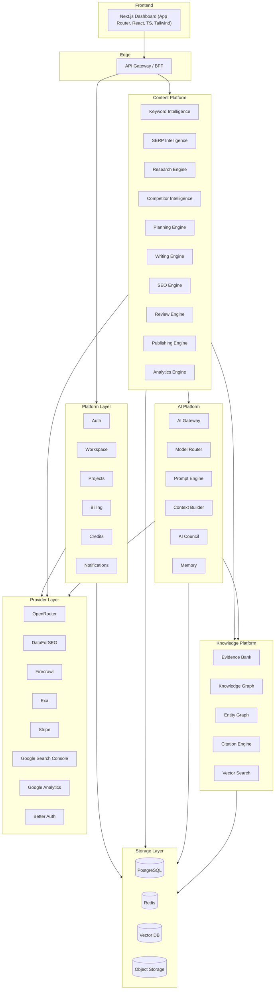

### 7.3 HOW — Layer Responsibilities

- **Frontend** renders the dashboard and streams long-running progress via SSE/WebSockets. It holds no business logic.
- **API Gateway / BFF** authenticates requests, resolves tenant context, enforces rate limits, and routes to platform or content services. It is the only public entry point.
- **Platform Layer** owns identity, tenancy, projects, commerce (billing + credits), and notifications — everything not specific to content production.
- **Content Platform** holds the ten domain engines (ADR-011). Engines call the AI and Knowledge platforms; they never call the Frontend.
- **AI Platform** is the _only_ path to model providers. Engines cannot call providers directly.
- **Knowledge Platform** owns grounding, provenance, entities, citations, and semantic retrieval.
- **Provider Layer** holds every external provider adapter (OpenRouter, DataForSEO, Firecrawl, Exa, Stripe, GSC, GA, Better Auth). Only this layer touches provider SDKs/APIs; it is consumed horizontally by the Platform, Content, and AI platforms (ADR-012; deep docs in `contentos-docs/08-integrations/`).
- **Storage Layer** is durable state, accessed only through the layer that owns each dataset.

### 7.4 Design Decisions & Trade-offs

| Decision                                         | Trade-off Accepted                                                           |
| ------------------------------------------------ | ---------------------------------------------------------------------------- |
| Five explicit platforms                          | More upfront structure vs. long-term clarity and reuse                       |
| AI Platform as sole model egress                 | One indirection hop vs. central cost/routing/guardrail control               |
| Formal Provider Layer                            | One more named layer vs. contained provider churn and a single audit surface |
| Engines depend on AI + Knowledge, not vice-versa | Slightly more wiring vs. reusable, testable AI/Knowledge                     |

### 7.5 Risks

- **Over-layering** could add latency; mitigated by co-locating services and using in-process calls within a service boundary where justified (§26).
- **Shared AI Platform** is a hot path; mitigated by horizontal scaling, semantic caching, and per-tenant rate limits.

---

## 8. C4 — Context Diagram

**WHAT:** ContentOS AI as a black box among its users and external systems.

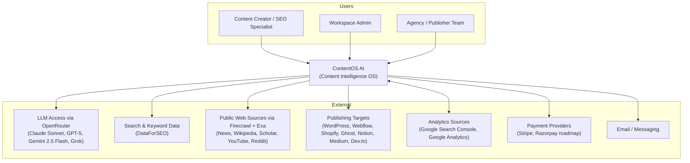

**HOW these relationships work**

| External System         | Direction          | Purpose                                                                    |
| ----------------------- | ------------------ | -------------------------------------------------------------------------- |
| LLM Access (OpenRouter) | Outbound           | Reasoning, drafting, extraction, embeddings (via AI Gateway only; ADR-013) |
| Search & Keyword Data   | Outbound           | Volume, difficulty, SERP results, backlinks                                |
| Public Web Sources      | Outbound           | Evidence retrieval for RAG                                                 |
| Publishing Targets      | Outbound           | One-click publish                                                          |
| Analytics Sources       | Bidirectional      | Pull performance; map published URLs                                       |
| Payment Providers       | Outbound + webhook | Subscriptions and credit purchases                                         |
| Email / Messaging       | Outbound           | Notifications                                                              |

---

## 9. C4 — Container Diagram

**WHAT:** the deployable/runtime units and their communication.

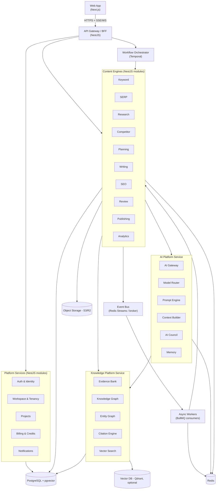

**Container responsibilities**

| Container                  | Responsibility                             | Scaling Unit                        |
| -------------------------- | ------------------------------------------ | ----------------------------------- |
| Web App                    | UI, progress streaming                     | Stateless, CDN-fronted              |
| API Gateway / BFF          | Entry, authN/Z, tenant context, rate limit | Stateless, horizontal               |
| Platform Services          | Identity, tenancy, commerce                | Stateless, horizontal               |
| Content Engines            | Domain capabilities                        | Stateless, horizontal per-engine    |
| AI Platform Service        | Model egress, routing, prompts, context    | Stateless, horizontal (hot path)    |
| Knowledge Platform Service | Grounding, retrieval, citations            | Stateless compute + stateful stores |
| Workflow Orchestrator      | Durable pipeline execution                 | Temporal cluster                    |
| Async Workers              | Background jobs, event handlers            | Horizontal by queue                 |
| Event Bus                  | Decoupled fan-out                          | Managed/broker                      |
| PostgreSQL                 | System of record                           | Primary + read replicas             |
| Redis                      | Cache, queues, rate limits, pub/sub        | Cluster                             |
| Vector DB                  | Semantic index at scale                    | Cluster (when introduced)           |
| Object Storage             | Media, exports, uploads                    | Managed                             |

> **Note on deployment granularity:** engines are separate _modules_ with clear boundaries but are deployed as a small number of services in v1 (a "modular monolith" packaging), then extracted into independent services as load demands (§26.4, §29.2). The boundaries above are logical and stable regardless of packaging.

---

## 10. Platform Layer

The Platform Layer provides identity, tenancy, and commerce to every other layer. It contains no content-production logic.

### 10.1 Auth & Identity

| Field                    | Detail                                                                                                                                                                        |
| ------------------------ | ----------------------------------------------------------------------------------------------------------------------------------------------------------------------------- |
| **Purpose**              | Authenticate users and issue tenant-scoped session context.                                                                                                                   |
| **Responsibilities**     | Login/logout, session/JWT issuance, MFA, service-to-service tokens, mapping user → workspace(s) → role.                                                                       |
| **Inputs**               | Credentials / SSO assertion; provider callbacks.                                                                                                                              |
| **Outputs**              | Signed session token carrying `user_id`, `tenant_id`, `roles`.                                                                                                                |
| **Dependencies**         | External auth provider (§27), PostgreSQL (user/role records), Redis (session/rate state).                                                                                     |
| **Sequence**             | See §20.                                                                                                                                                                      |
| **Error Handling**       | Deny-by-default; lockout on brute force; token rotation on refresh; clock-skew tolerance.                                                                                     |
| **Scalability**          | Stateless; sessions in Redis; horizontal.                                                                                                                                     |
| **Future**               | Enterprise SSO/SAML, SCIM provisioning, per-workspace IdP.                                                                                                                    |
| **Implementation Notes** | Auth provider is pluggable behind an `IdentityProvider` interface (ADR-010, Open Question §30). Tenant context is injected into a request-scoped store consumed by RLS (§21). |

### 10.2 Workspace & Tenancy

| Field                    | Detail                                                                                                                                                 |
| ------------------------ | ------------------------------------------------------------------------------------------------------------------------------------------------------ |
| **Purpose**              | Represent a customer boundary (agency, company, team) and enforce isolation.                                                                           |
| **Responsibilities**     | Workspace CRUD, membership, roles/permissions, per-workspace settings (brand voice, gate thresholds, connectors).                                      |
| **Inputs**               | Admin actions, invitations.                                                                                                                            |
| **Outputs**              | Tenant configuration consumed by all engines.                                                                                                          |
| **Dependencies**         | Auth, PostgreSQL.                                                                                                                                      |
| **Error Handling**       | Membership changes are transactional; last-owner protection.                                                                                           |
| **Scalability**          | Config cached in Redis with tenant-scoped keys.                                                                                                        |
| **Future**               | Nested teams, granular ABAC, white-label branding.                                                                                                     |
| **Implementation Notes** | `tenant_id` is the partition key everywhere (§21). Workspace settings are the source of truth for Quality Gate thresholds and model-routing overrides. |

### 10.3 Projects

| Field                | Detail                                                                                      |
| -------------------- | ------------------------------------------------------------------------------------------- |
| **Purpose**          | Organize content work into projects (e.g., a client site, a topic campaign).                |
| **Responsibilities** | Project CRUD, association of keywords/articles/reports, project-level dashboards and tasks. |
| **Inputs**           | User actions.                                                                               |
| **Outputs**          | Project context threaded through the content pipeline.                                      |
| **Dependencies**     | Workspace, PostgreSQL.                                                                      |
| **Scalability**      | Read-heavy; served from replicas + cache.                                                   |
| **Future**           | Content calendar, planning boards.                                                          |

### 10.4 Billing & Credits

| Field                    | Detail                                                                                                                                                                     |
| ------------------------ | -------------------------------------------------------------------------------------------------------------------------------------------------------------------------- |
| **Purpose**              | Monetize via subscriptions plus metered AI **credits**.                                                                                                                    |
| **Responsibilities**     | Plan management, subscription lifecycle, credit ledger (grant/consume/refund), invoices, webhook reconciliation, usage-based metering.                                     |
| **Inputs**               | Payment-provider webhooks; credit-consumption events from the AI Gateway.                                                                                                  |
| **Outputs**              | Balance and entitlement checks gating expensive operations.                                                                                                                |
| **Dependencies**         | Payment providers (§15), AI Gateway (cost signals), PostgreSQL.                                                                                                            |
| **Sequence**             | AI Gateway emits a `CreditConsumed` event per model call → ledger debits atomically → engine proceeds only if balance ≥ estimate.                                          |
| **Error Handling**       | Ledger is append-only and idempotent (keyed by request id); webhooks deduplicated; failed charges downgrade entitlements, not data.                                        |
| **Scalability**          | Ledger writes are high-volume; batched and idempotent.                                                                                                                     |
| **Future**               | Team budgets, per-project credit caps, prepaid/committed-use discounts.                                                                                                    |
| **Implementation Notes** | Credit pre-authorization ("hold") before long pipelines; settle on completion; refund on failure. Never block a running workflow mid-flight on balance — reserve up front. |

### 10.5 Notifications

| Field                | Detail                                                                                   |
| -------------------- | ---------------------------------------------------------------------------------------- |
| **Purpose**          | Inform users of pipeline progress, approvals needed, ranking changes, and system events. |
| **Responsibilities** | In-app feed, email, and (future) webhook/Slack delivery; user preferences; digesting.    |
| **Inputs**           | Domain events from the Event Bus (§18).                                                  |
| **Outputs**          | Delivered notifications; unread counts for the dashboard.                                |
| **Dependencies**     | Event Bus, Email provider, PostgreSQL, WebSocket/SSE channel.                            |
| **Error Handling**   | At-least-once delivery with dedup; retry with backoff; dead-letter for undeliverable.    |
| **Scalability**      | Worker-based fan-out; horizontal.                                                        |
| **Future**           | Slack/Teams connectors, notification rules engine.                                       |

---

## 11. Content Platform

The Content Platform holds the ten domain engines (ADR-011: SERP Intelligence is carved out of the Research Engine as its own stage; Planning and Review are first-class; the pipeline runs Review **before** SEO). The engine sections below are the v1.0 baseline breakdown — the authoritative twelve-module set and deep specifications live in `contentos-docs/04-modules/`. Each engine follows the same template: **Purpose · Responsibilities · Inputs · Outputs · Dependencies · Sequence · Error Handling · Scalability · Future Enhancements · Implementation Notes.** Every engine returns recommendations inside the Explainability Envelope (§4.6) and respects Quality Gates (§4.4).

### 11.0 Common Engine Anatomy

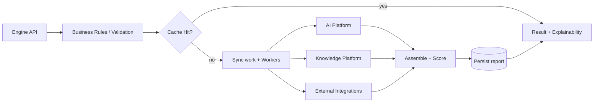

Every engine contains — as needed — an **API surface**, **business rules**, a **cache layer**, **background workers**, calls to the **AI Platform**, calls to the **Knowledge Platform**, and **external integrations**. AI is one component among these, never the whole engine.

### 11.1 Keyword Intelligence Engine

| Field                    | Detail                                                                                                                                                                 |
| ------------------------ | ---------------------------------------------------------------------------------------------------------------------------------------------------------------------- |
| **Purpose**              | Turn a seed keyword/topic into a scored keyword opportunity set.                                                                                                       |
| **Responsibilities**     | Fetch volume/difficulty/CPC/trend; expand to related/long-tail/questions/LSI/NLP/PAA/suggestions; gather competitor keywords; compute Opportunity and Priority scores. |
| **Inputs**               | Seed keyword, locale, project context.                                                                                                                                 |
| **Outputs**              | Ranked keyword set with metrics and Opportunity/Priority scores.                                                                                                       |
| **Dependencies**         | Search & Keyword Data providers (§15), AI Platform (semantic expansion, NLP terms), Redis (cache), PostgreSQL (persist).                                               |
| **Sequence**             | Provider fetch → semantic expansion via AI → scoring via rules → cache → persist.                                                                                      |
| **Error Handling**       | Provider timeout → serve cached/degraded set with a freshness flag; never fail the whole request on one provider.                                                      |
| **Scalability**          | Aggressive TTL cache keyed by `(tenant, keyword, locale)`; provider calls rate-limited and batched.                                                                    |
| **Future**               | Trend forecasting, seasonality, SERP-volatility signals.                                                                                                               |
| **Implementation Notes** | Scoring formula is versioned config, not code, so it can be tuned without deploy. NLP-term extraction uses a cheap model tier (§22).                                   |

### 11.2 Research Engine

| Field                    | Detail                                                                                                                                                                      |
| ------------------------ | --------------------------------------------------------------------------------------------------------------------------------------------------------------------------- |
| **Purpose**              | Retrieve and structure the evidence that grounds every article.                                                                                                             |
| **Responsibilities**     | Retrieve top-20 SERP results; extract structural metrics per result (§5.2); extract entities/subtopics; write sources into the Evidence Bank with provenance and freshness. |
| **Inputs**               | Target query, locale, project.                                                                                                                                              |
| **Outputs**              | Structured SERP dataset + populated Evidence Bank entries.                                                                                                                  |
| **Dependencies**         | SERP APIs, Public Web Sources (§15), Knowledge Platform (Evidence Bank, Entity Graph, Vector Search), AI Platform (extraction/summarization).                               |
| **Sequence**             | Retrieve → fetch/parse pages → extract structure → embed + store evidence → extract entities → link.                                                                        |
| **Error Handling**       | Robust parsing with fallbacks; skip unreachable sources and record the gap; deduplicate near-identical sources.                                                             |
| **Scalability**          | Fan-out fetch via workers; per-domain politeness limits; cache parsed pages.                                                                                                |
| **Future**               | Source-quality scoring, paywall handling, multilingual sources.                                                                                                             |
| **Implementation Notes** | This engine is the entry point of the RAG pipeline (§4.3). Provenance (URL, retrieved_at, snippet offsets) is mandatory for the Citation Engine.                            |

### 11.3 Competitor Intelligence Engine

| Field                    | Detail                                                                                                                                                                                          |
| ------------------------ | ----------------------------------------------------------------------------------------------------------------------------------------------------------------------------------------------- |
| **Purpose**              | Explain how to outperform the ranking competitors.                                                                                                                                              |
| **Responsibilities**     | Per-competitor analysis (strengths, weaknesses, missing topics, unique insights, word count, avg paragraph length, keyword density, E-E-A-T signals); synthesize "how to beat" recommendations. |
| **Inputs**               | Competitor page set (from Research Engine).                                                                                                                                                     |
| **Outputs**              | Competitor profiles + prioritized gap/opportunity recommendations (Explainability Envelopes).                                                                                                   |
| **Dependencies**         | Research Engine output, AI Platform (analysis/synthesis), Knowledge Platform (entities).                                                                                                        |
| **Sequence**             | Load competitor evidence → compute structural metrics (rules) → AI synthesis of qualitative signals → prioritize gaps.                                                                          |
| **Error Handling**       | If a competitor page is thin/unavailable, mark low-confidence rather than guessing.                                                                                                             |
| **Scalability**          | Parallel per-competitor analysis; cache by page fingerprint.                                                                                                                                    |
| **Future**               | Backlink-gap analysis, SERP-feature targeting, historical competitor tracking.                                                                                                                  |
| **Implementation Notes** | Quantitative metrics come from rules; qualitative judgments come from AI and are always labeled with confidence.                                                                                |

### 11.4 Planning Engine

| Field                    | Detail                                                                                                                                                                                                                                                                                                             |
| ------------------------ | ------------------------------------------------------------------------------------------------------------------------------------------------------------------------------------------------------------------------------------------------------------------------------------------------------------------ |
| **Purpose**              | Convert intelligence into a concrete content plan.                                                                                                                                                                                                                                                                 |
| **Responsibilities**     | Detect intent (informational/commercial/transactional/navigational/local); build persona, pain points, desired outcome, angle; generate topic clusters (main → ≤100 supporting → pillar + clusters → internal-linking map); generate the article outline (H1, intro, H2–H4, tables, stats, FAQs, CTA, conclusion). |
| **Inputs**               | Keyword set, research evidence, competitor gaps, tenant brand voice.                                                                                                                                                                                                                                               |
| **Outputs**              | Intent classification, persona, topic-cluster map, and approved-outline candidate.                                                                                                                                                                                                                                 |
| **Dependencies**         | Keyword/Research/Competitor outputs, AI Platform (planning tier), Knowledge Platform (entities/graph).                                                                                                                                                                                                             |
| **Sequence**             | Intent classify (cheap model) → cluster generation (reasoning model) → outline synthesis grounded in evidence → optional human approval gate (§4.5).                                                                                                                                                               |
| **Error Handling**       | Outline must reference available evidence; if coverage is thin, request more research before proceeding.                                                                                                                                                                                                           |
| **Scalability**          | Cluster generation is bounded (≤100 topics); cached per `(topic, locale)`.                                                                                                                                                                                                                                         |
| **Future**               | Content-calendar integration, cluster prioritization by ROI.                                                                                                                                                                                                                                                       |
| **Implementation Notes** | The outline is the pipeline's first natural **human-in-the-loop checkpoint** and a Quality Gate boundary.                                                                                                                                                                                                          |

### 11.5 Writing Engine

| Field                    | Detail                                                                                                                                                                                                                                                       |
| ------------------------ | ------------------------------------------------------------------------------------------------------------------------------------------------------------------------------------------------------------------------------------------------------------ |
| **Purpose**              | Produce a grounded, enriched, humanized draft from an approved outline.                                                                                                                                                                                      |
| **Responsibilities**     | Section-by-section generation in selected mode/tone/length; enrichment (examples, stats, case studies, quotes, tables, checklists, pros/cons, comparisons, FAQs, expert tips); generation of image prompts, alt text, captions, and infographic/chart specs. |
| **Inputs**               | Approved outline, Evidence Bank context, brand voice, mode/tone/length.                                                                                                                                                                                      |
| **Outputs**              | Draft article with inline citation anchors + media specifications.                                                                                                                                                                                           |
| **Dependencies**         | AI Platform (Context Builder assembles RAG context; Model Router selects drafting tier; AI Council optional for section critique), Knowledge Platform (evidence + citations), Object Storage (generated media, when applicable).                             |
| **Sequence**             | For each section: build context (evidence + brand voice + prior sections) → generate → attach citation anchors → enrich → assemble.                                                                                                                          |
| **Error Handling**       | Every factual sentence must map to evidence or be flagged for Fact Check; unsupported claims are marked, not shipped silently.                                                                                                                               |
| **Scalability**          | Section-parallel generation with a coherence pass; semantic cache for repeated sub-prompts.                                                                                                                                                                  |
| **Future**               | Multi-format output (YouTube script, LinkedIn post, newsletter) as plugins; multilingual generation.                                                                                                                                                         |
| **Implementation Notes** | Writing consumes context; it does not fetch evidence itself (that is the Research Engine's job). Media generation is a Writing-Engine responsibility in v1 but is a candidate for extraction into a dedicated Media Engine (§29).                            |

### 11.6 SEO Engine

| Field                    | Detail                                                                                                                                                                                                                                               |
| ------------------------ | ---------------------------------------------------------------------------------------------------------------------------------------------------------------------------------------------------------------------------------------------------- |
| **Purpose**              | Make the draft structurally and semantically optimized, and produce an explainable SEO score.                                                                                                                                                        |
| **Responsibilities**     | Check title/meta/slug/URL/canonical/OG; keyword density, semantic/NLP coverage, heading structure, image alt; suggest internal links (from tenant sitemap) and external links (authoritative); generate JSON-LD schema; compute composite SEO score. |
| **Inputs**               | Draft article, target keywords, tenant sitemap, evidence for external links.                                                                                                                                                                         |
| **Outputs**              | SEO report + score, schema JSON-LD, link suggestions (Explainability Envelopes).                                                                                                                                                                     |
| **Dependencies**         | Knowledge Platform (entities, sitemap index, vector search for internal-link matching), AI Platform (semantic checks), PostgreSQL/Redis.                                                                                                             |
| **Sequence**             | Rule-based checks → semantic coverage via embeddings → internal-link matching via vector search over sitemap → schema generation → score assembly.                                                                                                   |
| **Error Handling**       | Missing sitemap → skip internal-link suggestions with a notice; never fabricate internal URLs.                                                                                                                                                       |
| **Scalability**          | Deterministic checks are cheap; embeddings cached; sitemap indexed per tenant.                                                                                                                                                                       |
| **Future**               | SERP-feature optimization, entity-SEO, automated schema validation against Google requirements.                                                                                                                                                      |
| **Implementation Notes** | Score weights are workspace-configurable policy. Internal-link candidates are ranked by semantic similarity, not string matching.                                                                                                                    |

### 11.7 Review Engine (Editorial & Quality)

| Field                    | Detail                                                                                                                                                                                                                                                                                                                                                                                                                                                                                                                                                                                                    |
| ------------------------ | --------------------------------------------------------------------------------------------------------------------------------------------------------------------------------------------------------------------------------------------------------------------------------------------------------------------------------------------------------------------------------------------------------------------------------------------------------------------------------------------------------------------------------------------------------------------------------------------------------- |
| **Purpose**              | Enforce editorial quality and factual integrity; own the Quality Gates.                                                                                                                                                                                                                                                                                                                                                                                                                                                                                                                                   |
| **Responsibilities**     | Readability (Flesch, Gunning Fog, SMOG, grade, sentence length, passive voice, transitions, paragraph length); grammar/spelling/tone/consistency/clarity; **AI-detection estimate** (probability, burstiness, perplexity, variation, diversity — predictive only); plagiarism vs internet/KB/uploads (similarity %, duplicate paragraphs, sources); E-E-A-T scoring (Experience/Expertise/Authority/Trust) with suggestions; fact verification (dates, stats, claims, names, companies, medical/legal/finance) flagging uncertainty; humanization (reduce AI patterns, increase variation, improve flow). |
| **Inputs**               | Draft + SEO-adjusted article, Evidence Bank, tenant KB, uploaded files.                                                                                                                                                                                                                                                                                                                                                                                                                                                                                                                                   |
| **Outputs**              | Readability/AI-detection/plagiarism/E-E-A-T/fact-check reports; humanized revision; **gate verdicts**.                                                                                                                                                                                                                                                                                                                                                                                                                                                                                                    |
| **Dependencies**         | Knowledge Platform (evidence for fact-check + plagiarism sources), AI Platform (analysis + humanization + AI Council for adversarial review), external plagiarism sources (§15).                                                                                                                                                                                                                                                                                                                                                                                                                          |
| **Sequence**             | Run analyzers in parallel (event fan-out, §18) → aggregate → apply gate thresholds → pass/soft-warn/block.                                                                                                                                                                                                                                                                                                                                                                                                                                                                                                |
| **Error Handling**       | AI-detection and plagiarism outputs are explicitly labeled **estimates**; the Fact Checker flags rather than fabricates; blocking gates route to human review, not silent failure.                                                                                                                                                                                                                                                                                                                                                                                                                        |
| **Scalability**          | Analyzers are independent and horizontally scalable; results cached by content hash.                                                                                                                                                                                                                                                                                                                                                                                                                                                                                                                      |
| **Future**               | Pluggable third-party detectors/plagiarism engines; domain-specific fact-checkers (YMYL).                                                                                                                                                                                                                                                                                                                                                                                                                                                                                                                 |
| **Implementation Notes** | Readability metrics are deterministic library computations (cheap, no AI). E-E-A-T and fact-check use reasoning tiers. This engine is the primary Quality Gate host (§4.4).                                                                                                                                                                                                                                                                                                                                                                                                                               |

### 11.8 Publishing Engine

| Field                    | Detail                                                                                                                                                                                                             |
| ------------------------ | ------------------------------------------------------------------------------------------------------------------------------------------------------------------------------------------------------------------ |
| **Purpose**              | Deliver the finished asset to the tenant's destination(s).                                                                                                                                                         |
| **Responsibilities**     | Assemble the publish package (body, media, schema, meta, internal links); map fields per target; publish (immediate or scheduled) to WordPress/Webflow/Shopify/Ghost/Notion/Medium/Dev.to; record publish history. |
| **Inputs**               | Approved final article + package, target connector credentials.                                                                                                                                                    |
| **Outputs**              | Published URL(s), publish status, history record.                                                                                                                                                                  |
| **Dependencies**         | CMS connectors (§15), Object Storage (media), PostgreSQL (history).                                                                                                                                                |
| **Sequence**             | Validate package → transform to target format → push via connector → verify → record.                                                                                                                              |
| **Error Handling**       | Idempotent publish keyed by `(article_version, target)`; partial-failure across multiple targets is isolated; retries with backoff; credentials failures surface as actionable notifications.                      |
| **Scalability**          | Connector calls via workers; per-target rate limits.                                                                                                                                                               |
| **Future**               | Bulk publishing, update-in-place (re-publish), preview environments, MCP-based CMS connectors.                                                                                                                     |
| **Implementation Notes** | Each CMS is an adapter behind a stable `PublishTarget` interface; adding a target does not change the engine (§4.10).                                                                                              |

### 11.9 Analytics Engine

| Field                    | Detail                                                                                                                                                |
| ------------------------ | ----------------------------------------------------------------------------------------------------------------------------------------------------- |
| **Purpose**              | Measure published performance and drive refresh/growth.                                                                                               |
| **Responsibilities**     | Track traffic, CTR, average position, indexed pages, impressions, conversions, content ROI; detect ranking changes; generate refresh recommendations. |
| **Inputs**               | Analytics sources (GSC), published-URL registry, conversion signals.                                                                                  |
| **Outputs**              | Performance dashboards, ranking-change alerts, refresh recommendations (Explainability Envelopes).                                                    |
| **Dependencies**         | Analytics Sources (§15), PostgreSQL (time-series performance), Event Bus (alerts → Notifications), AI Platform (refresh synthesis).                   |
| **Sequence**             | Scheduled pull (§19) → normalize → compute deltas → detect significant changes → emit alerts + recommendations.                                       |
| **Error Handling**       | Source gaps produce nulls with freshness flags, not zeros; ranking deltas require a minimum confidence window.                                        |
| **Scalability**          | Time-series data partitioned by tenant + time; rollups for dashboards.                                                                                |
| **Future**               | Predictive traffic modeling, automated refresh scheduling, content-decay detection.                                                                   |
| **Implementation Notes** | Analytics closes the lifecycle loop (§2.2): refresh recommendations feed new ideas back into Keyword Intelligence.                                    |

---

## 12. AI Platform

The AI Platform is the **only** path from engines to model providers. It centralizes routing, prompting, context assembly, multi-model review, memory, cost accounting, and safety guardrails.

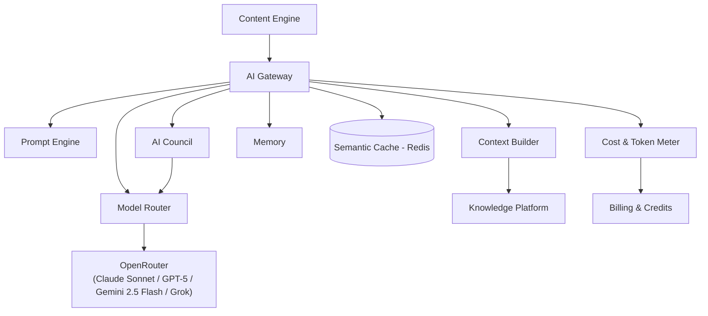

### 12.1 AI Gateway

| Field                    | Detail                                                                                                                                                                          |
| ------------------------ | ------------------------------------------------------------------------------------------------------------------------------------------------------------------------------- |
| **Purpose**              | Single, governed egress to all model providers.                                                                                                                                 |
| **Responsibilities**     | Provider abstraction, retries, timeouts, fallback chains, streaming, rate limiting, token/cost metering, PII redaction, prompt-injection guarding, semantic-cache lookup/store. |
| **Inputs**               | A model request (task type, tier hint, messages, budget/latency policy).                                                                                                        |
| **Outputs**              | Model response + usage metadata (model, tokens, cost, latency, prompt version).                                                                                                 |
| **Dependencies**         | Model Router, Prompt Engine, Context Builder, Redis (cache + limits), Billing (cost events).                                                                                    |
| **Error Handling**       | Provider error → fallback per chain (§22); circuit-breaker per provider; on exhausted fallbacks, return typed error to the engine (never a fabricated success).                 |
| **Scalability**          | Stateless, horizontal; the platform's hottest service.                                                                                                                          |
| **Future**               | Provider health-based routing, response-quality feedback loop, on-prem/self-hosted model support.                                                                               |
| **Implementation Notes** | Emits one `CreditConsumed` event per call for the ledger (§10.4). No engine may bypass the Gateway.                                                                             |

### 12.2 Model Router

Maps `(task, tier, budget, latency SLA)` → concrete model + fallback chain. Policy-driven and versioned (§22). Enables changing cost/quality trade-offs without code changes.

### 12.3 Prompt Engine

Versioned prompt registry: templates are named and versioned so runs are reproducible and A/B-testable. Prompts are data, not inline strings, enabling evaluation and rollback. Each response records the prompt version used.

### 12.4 Context Builder

Assembles the RAG context window for a task: selected Evidence Bank snippets (ranked by relevance and freshness), tenant brand voice/style guide, prior article memory, and task instructions — trimmed to a token budget. This is where grounding is operationalized (§4.3).

### 12.5 AI Council

A **bounded multi-reviewer pattern**, not an autonomous agent swarm. Role-specialized reviewers (e.g., SEO reviewer, fact reviewer, E-E-A-T reviewer) critique and improve a draft; each reviewer refines the previous output rather than regenerating from scratch. The Council is orchestrated as a deterministic step within an engine/workflow, with a fixed set of roles and a hard iteration cap. This realizes the "specialized agents improving each other's output" idea _without_ violating Engines-over-Agents (ADR-001).

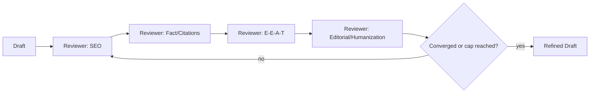

### 12.6 Memory

Three tiers: **short-term** (in-workflow conversation state), **project/brand memory** (durable tenant preferences, voice, prior decisions), and **semantic memory** (embeddings of prior content for reuse/consistency). Memory is tenant-scoped and served through Vector Search (§13.5).

---

## 13. Knowledge Platform

The Knowledge Platform owns grounding, provenance, entities, citations, and semantic retrieval. It is consumed by the AI Platform (context) and by content engines (research, SEO linking, fact-check, plagiarism).

### 13.1 Evidence Bank

Stores every retrieved source with provenance (URL, `retrieved_at`, snippet offsets), extracted claims, and freshness. It is the authoritative pool the Context Builder draws from and the Citation Engine verifies against. Tenant-scoped; deduplicated by content fingerprint.

### 13.2 Knowledge Graph

Represents topics and their relationships (pillar ↔ cluster, related concepts). Supports topic-cluster generation and internal-linking strategy.

### 13.3 Entity Graph

Named entities (people, organizations, products, places) with disambiguation and linking. Supports entity-SEO, fact-check (name/company verification), and citation accuracy.

### 13.4 Citation Engine

Maps each claim in a draft to Evidence Bank sources, generates citations, and computes **citation coverage** — a Quality Gate input. Claims without a source are flagged for the Fact Checker. This is the mechanism that enforces "no ungrounded claims."

### 13.5 Vector Search

Embedding storage and semantic retrieval over evidence, tenant knowledge base, and prior content. Powers RAG context selection, semantic internal-linking, plagiarism similarity, and semantic memory. **pgvector** in v1; **Qdrant** when scale demands (ADR-006). Tenant isolation via namespace/collection or metadata filter (§21).

| Concern   | v1                                | At Scale                                              |
| --------- | --------------------------------- | ----------------------------------------------------- |
| Store     | pgvector (in PostgreSQL)          | Qdrant (dedicated)                                    |
| Isolation | `tenant_id` metadata filter + RLS | Per-tenant collection/namespace                       |
| Trade-off | One fewer system to operate       | Higher recall/throughput at cost of another datastore |

---

## 14. Storage Layer

All durable state lives here and is accessed only through the owning layer.

| Store              | Role                   | Owned Data                                                                                                                                              | Notes                                                           |
| ------------------ | ---------------------- | ------------------------------------------------------------------------------------------------------------------------------------------------------- | --------------------------------------------------------------- |
| **PostgreSQL**     | System of record       | Tenants, users, projects, keywords, articles, outlines, all reports (SEO/readability/E-E-A-T/AI/plagiarism), publishing history, billing, credit ledger | Primary + read replicas; PITR; `tenant_id` + RLS on every table |
| **Redis**          | Cache & coordination   | Sessions, rate limits, semantic cache, BullMQ queues, pub/sub                                                                                           | Cluster; tenant-prefixed keys                                   |
| **Vector DB**      | Semantic index         | Embeddings for evidence, KB, prior content                                                                                                              | pgvector → Qdrant                                               |
| **Object Storage** | Large binary artifacts | Generated images/media, exports, user uploads                                                                                                           | S3-compatible (R2/MinIO); tenant-prefixed keys                  |

**WHY this split:** relational integrity for the system of record; Redis for microsecond coordination and caching; a vector index for semantic recall; object storage for cheap, durable blobs. Each store is used for what it is best at, and none is overloaded.

**Data lifecycle:** hot content in PostgreSQL; cold/large artifacts in object storage; evidence retained per tenant policy; credit ledger append-only and immutable for audit.

---

## 15. External Integrations

All integrations are **adapters behind stable interfaces**. Adding or replacing a provider does not change engine logic (§4.10). Each adapter implements timeout, retry, circuit-breaker, and rate-limit policy.

| Category             | Interface                                | Example Providers                                          | Consumed By                    |
| -------------------- | ---------------------------------------- | ---------------------------------------------------------- | ------------------------------ |
| Keyword & SERP data  | `KeywordDataProvider`, `SerpProvider`    | DataForSEO                                                 | Keyword, SERP Intelligence     |
| Public web sources   | `WebSourceProvider`                      | Firecrawl (fetch/parse), Exa (semantic discovery)          | Research (RAG)                 |
| LLM providers        | `ModelProvider`                          | OpenRouter (Claude Sonnet, GPT-5, Gemini 2.5 Flash, Grok)  | AI Gateway only                |
| Publishing targets   | `PublishTarget`                          | WordPress, Webflow, Shopify, Ghost, Notion, Medium, Dev.to | Publishing                     |
| Analytics sources    | `AnalyticsProvider`                      | Google Search Console, Google Analytics (GA4)              | Analytics                      |
| Payments             | `PaymentProvider`                        | Stripe (Razorpay roadmap, OQ-13)                           | Billing                        |
| Identity             | `IdentityProvider`                       | Better Auth (self-hosted framework)                        | Auth (Platform Layer)          |
| Email/messaging      | `NotificationChannel`                    | Email (SMTP/API), future Slack/Teams                       | Notifications                  |
| Plagiarism/detection | `SimilarityProvider`, `DetectorProvider` | Pluggable third parties                                    | Review                         |
| MCP connectors       | `McpConnector`                           | CMS/docs/knowledge sources                                 | Publishing, Knowledge (future) |

> **Integration risks & mitigations:** third-party rate limits and outages are contained by per-provider circuit breakers and cached fallbacks; credential management is centralized and encrypted (§24); each adapter is independently versioned so a provider change is a localized update.

> **Provider Layer (ADR-012):** these adapters are formalized as the Provider Layer of the stack. Per-provider deep documentation (auth, rate limits, retries, cost, response mapping) lives in `contentos-docs/08-integrations/`.

---

## 16. Data Flow

**WHAT:** how a single article's data moves through the pipeline, and which artifact each stage produces.

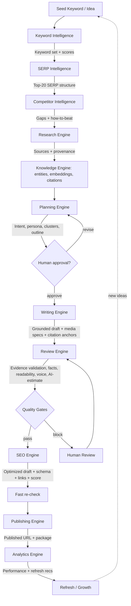

**Artifacts per stage (persisted in PostgreSQL unless noted):**

| Stage                | Primary Artifact                                       | Also Writes                                 |
| -------------------- | ------------------------------------------------------ | ------------------------------------------- |
| Keyword Intelligence | Scored keyword set                                     | Cache (Redis)                               |
| SERP Intelligence    | Top-20 SERP dataset                                    | Cache (Redis)                               |
| Competitor           | Competitor profiles + gaps                             | —                                           |
| Research             | Sources with mandatory provenance                      | Evidence Bank, raw archive → Object Storage |
| Knowledge            | Entities, embeddings, citation index                   | Entity/Knowledge graphs, Vector index       |
| Planning             | Intent, persona, cluster map, approved outline         | —                                           |
| Writing              | Draft + citation anchors                               | Media → Object Storage                      |
| Review               | Quality reports + gate verdicts (+ humanized revision) | —                                           |
| SEO                  | SEO report + score + schema + links                    | Fast re-check trigger                       |
| Publishing           | Publish package + published URL                        | Publishing history                          |
| Analytics            | Performance time-series + refresh recs                 | Alerts → Event Bus                          |

**Grounding invariant:** by the time content reaches Publishing, every factual claim traces to an Evidence Bank source via the Citation Engine, or is explicitly flagged. This invariant is checked at the Quality Gate (§4.4, §13.4).

**Pipeline order (ADR-011):** Review precedes SEO, so structural optimization is applied only to gate-passed content; SEO's structural changes trigger a fast re-validation (readability + citation integrity) before Publishing.

---

## 17. Request Flow

**WHAT:** the synchronous path for a user-initiated action that kicks off the (asynchronous) pipeline.

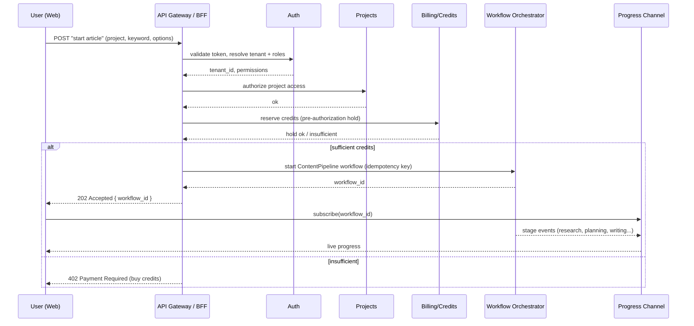

**Principles:** all synchronous requests are authenticated, tenant-resolved, authorized, and (for expensive work) credit-checked _before_ the async pipeline starts. The long-running work is never done inside the request; the request only _starts a workflow_ and returns a handle. Progress streams over SSE/WebSockets.

---

## 18. Event Flow

**WHY:** to decouple producers from consumers and enable parallel fan-out and new subscribers without touching producers.

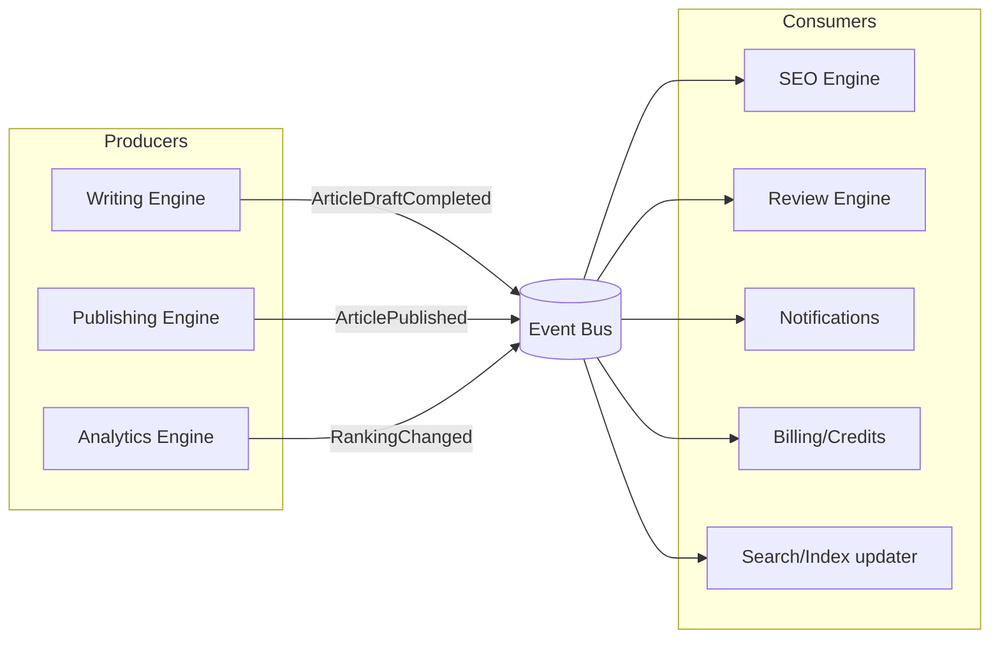

**Representative domain events**

| Event                      | Emitted By                   | Typical Subscribers                |
| -------------------------- | ---------------------------- | ---------------------------------- |
| `KeywordResearchCompleted` | Keyword Engine               | Research Engine, Notifications     |
| `EvidenceStored`           | Research Engine              | Vector indexer, Citation Engine    |
| `OutlineApproved`          | Planning Engine (human gate) | Writing Engine                     |
| `ArticleDraftCompleted`    | Writing Engine               | SEO, Review (parallel)             |
| `QualityGateBlocked`       | Review Engine                | Notifications (human review)       |
| `ArticlePublished`         | Publishing Engine            | Analytics, Notifications           |
| `RankingChanged`           | Analytics Engine             | Notifications, Refresh recommender |
| `CreditConsumed`           | AI Gateway                   | Billing ledger                     |

**Delivery semantics:** at-least-once with idempotent consumers (deduplicated by event id). Ordering is per-aggregate where it matters (e.g., per article). Failed handling routes to a dead-letter queue with alerting.

---

## 19. Background Jobs

**WHY:** content production is long-running, multi-step, and needs durability, retries, human pauses, and scheduling. Two mechanisms with a clear split:

| Mechanism                        | Use For                                                                                                                                              | Why                                                                                 |
| -------------------------------- | ---------------------------------------------------------------------------------------------------------------------------------------------------- | ----------------------------------------------------------------------------------- |
| **Temporal (durable workflows)** | The end-to-end content pipeline; anything with human-in-the-loop waits, multi-minute/day duration, or strict resumability                            | Durable state, automatic retries, timeouts, signals for approval, crash-safe resume |
| **BullMQ (Redis queues)**        | Fire-and-forget/background jobs: SERP fetch fan-out, embedding generation, webhook delivery, cache warming, scheduled analytics pulls, rank tracking | Simple, fast, horizontally scalable async work                                      |

### 19.1 The Content Pipeline as a Durable Workflow

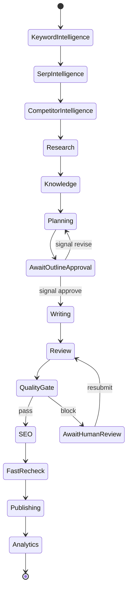

**Job characteristics**

- **Idempotency:** every activity is keyed by `(workflow_id, step)` so retries never double-charge credits or double-publish.
- **Retries:** per-activity retry policy with exponential backoff and a maximum attempt cap; permanent failures surface to the user with context.
- **Human waits:** `AwaitOutlineApproval` and `AwaitHumanReview` are durable timers/signals — a workflow can wait days at zero compute cost.
- **Scheduling:** rank tracking and analytics pulls are cron-style BullMQ jobs; content-refresh scans are scheduled per tenant policy.
- **Backpressure:** worker concurrency and provider rate limits prevent overload; queues absorb spikes.

---

## 20. Authentication Flow

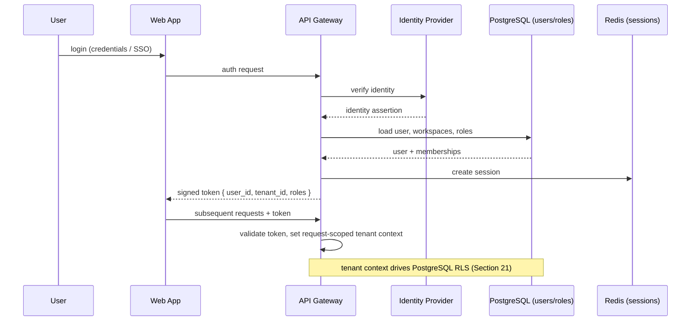

**Rules**

- **Deny by default;** authorization is checked per request against workspace roles/permissions.
- **Tenant context** (`tenant_id`) is derived at the gateway and propagated to every downstream call and to the database session variable that RLS reads (§21).
- **Service-to-service** calls use short-lived internal tokens; no service trusts an unauthenticated caller.
- **Sessions** live in Redis; tokens are rotated on refresh; revocation is immediate via session invalidation.

---

## 21. Multi-Tenant Strategy

**WHY:** B2B customers (agencies, publishers, teams) require strict data isolation, predictable performance, and per-tenant configuration, while keeping infrastructure cost efficient.

### 21.1 Model: Shared Database, Row-Level Isolation

| Aspect         | Approach                                                                                                                             |
| -------------- | ------------------------------------------------------------------------------------------------------------------------------------ |
| Isolation      | Every table carries `tenant_id`; **PostgreSQL Row-Level Security (RLS)** policies enforce that a session only sees its tenant's rows |
| Tenant context | Set from the gateway into a per-request DB session variable; RLS policies key off it                                                 |
| Vectors        | `tenant_id` metadata filter (pgvector) → per-tenant collection/namespace (Qdrant at scale)                                           |
| Redis          | Keys prefixed with `tenant_id`; per-tenant rate-limit buckets                                                                        |
| Object storage | Keys prefixed with `tenant_id/`                                                                                                      |
| Config         | Workspace settings (voice, gate thresholds, routing overrides) scoped per tenant                                                     |

### 21.2 Why Not Schema-per-Tenant or DB-per-Tenant (v1)

| Model             | Pros                                                | Cons                                          | Verdict                      |
| ----------------- | --------------------------------------------------- | --------------------------------------------- | ---------------------------- |
| Shared DB + RLS   | Cheapest, simplest ops, easy cross-tenant analytics | Requires disciplined RLS; noisy-neighbor risk | **Chosen for v1**            |
| Schema-per-tenant | Stronger logical isolation                          | Migration complexity at thousands of tenants  | Enterprise option (§29)      |
| DB-per-tenant     | Strongest isolation, per-tenant residency           | Highest ops cost; heavy at scale              | White-label / regulated only |

### 21.3 Noisy-Neighbor & Fairness

- Per-tenant rate limits at the gateway and AI Gateway.
- Per-tenant credit holds bound worst-case AI spend.
- Worker fair-scheduling so one tenant's large batch cannot starve others.

### 21.4 Risks

- **RLS misconfiguration** is the primary isolation risk; mitigated by default-deny policies, automated tests that assert cross-tenant queries return nothing, and code review gates on any table lacking `tenant_id` + RLS.

---

## 22. AI Model Routing

**WHY:** cost and quality must be tunable as policy, not code. The Model Router maps each task to the cheapest model that meets the quality bar, with fallbacks.

### 22.1 Routing Inputs

`task_type` · `quality_tier` · `budget policy` · `latency SLA` · `tenant overrides` · `provider health`.

### 22.2 Tiered Model Classes

| Tier                  | Use For                                                                                                                 | Characteristics                          |
| --------------------- | ----------------------------------------------------------------------------------------------------------------------- | ---------------------------------------- |
| **Fast/Cheap**        | Classification (intent), extraction (structure/entities), NLP-term expansion, embeddings                                | Low cost, high volume, latency-sensitive |
| **Mid**               | Section drafting, enrichment, routine rewriting                                                                         | Balanced cost/quality                    |
| **Premium/Reasoning** | Planning, topic-cluster synthesis, competitor "how-to-beat", E-E-A-T, fact-check reasoning, final AI-Council refinement | Highest quality, reserved usage          |

### 22.3 Task → Tier Mapping (policy, versioned)

| Task                           | Default Tier    | Fallback                    |
| ------------------------------ | --------------- | --------------------------- |
| Intent classification          | Fast/Cheap      | Mid                         |
| Entity/structure extraction    | Fast/Cheap      | Mid                         |
| Embeddings                     | Embedding model | Alternate embedding model   |
| NLP/LSI expansion              | Fast/Cheap      | Mid                         |
| Topic-cluster generation       | Premium         | Mid                         |
| Outline synthesis              | Premium         | Mid                         |
| Section drafting               | Mid             | Premium (on low-confidence) |
| Enrichment (stats/tables/FAQs) | Mid             | Fast/Cheap                  |
| SEO semantic checks            | Fast/Cheap      | Mid                         |
| Fact verification              | Premium         | Mid                         |
| E-E-A-T analysis               | Premium         | Mid                         |
| Humanization                   | Mid             | Premium                     |
| AI-Council final pass          | Premium         | Mid                         |

**Concrete tier → model mapping (ADR-013, policy-versioned):** Fast/Cheap = **Gemini 2.5 Flash** · Mid = **Claude Sonnet** · Premium/Reasoning = **GPT-5** · Alternative voice = **Grok** — all accessed via OpenRouter under the AI Gateway. **DeepSeek is excluded by policy.** Embeddings model remains open (OQ-11). Full matrix: `contentos-docs/07-ai-platform/model-selection.md`.

### 22.4 Fallback & Health

- **Fallback chains** per tier; on provider error or timeout, the Gateway advances the chain (§12.1).
- **Circuit breakers** isolate an unhealthy provider; the Router deprioritizes it until healthy.
- **Cost guardrails:** per-request and per-tenant budgets; the Router refuses to exceed a hard cap and surfaces an actionable error rather than silently overspending.

### 22.5 Trade-off

Routing indirection adds minor complexity but yields the single biggest lever on unit economics and quality — changeable without deploying code (ADR-008).

---

## 23. Caching Strategy

**WHY:** caching is the primary cost and latency lever, especially for external data and AI responses.

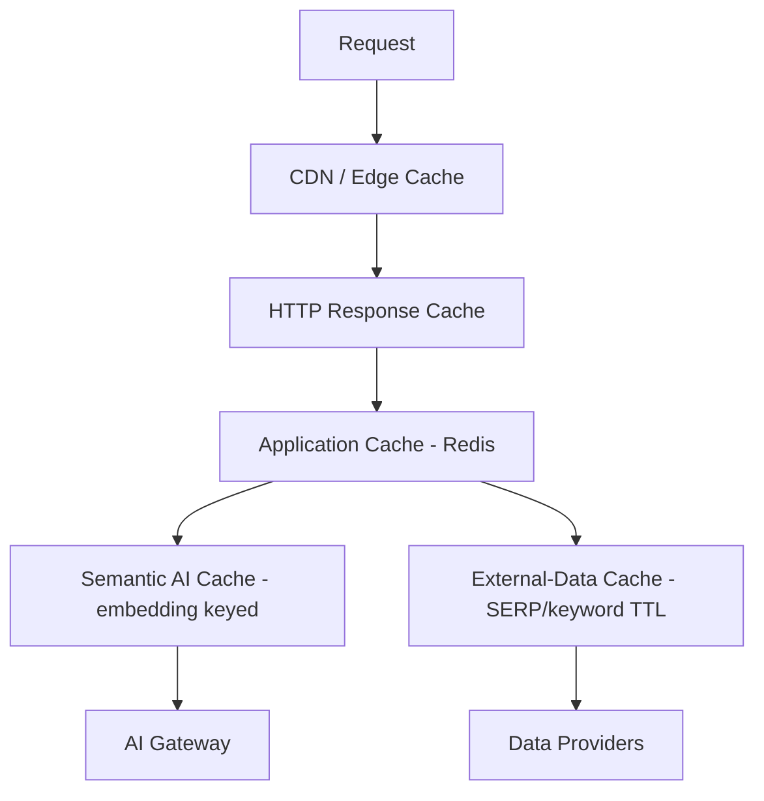

| Layer                   | Caches                         | Key                                                     | Invalidation                 |
| ----------------------- | ------------------------------ | ------------------------------------------------------- | ---------------------------- |
| CDN / Edge              | Static assets, public pages    | URL                                                     | Deploy/version hash          |
| HTTP response           | Idempotent GETs                | Route + params + tenant                                 | TTL + tag purge              |
| Application (Redis)     | Hot entities, config, sitemaps | `tenant:entity:id`                                      | Write-through / event-driven |
| **External-data cache** | SERP results, keyword metrics  | `tenant:keyword:locale`                                 | TTL (data freshness policy)  |
| **Semantic AI cache**   | LLM responses                  | Embedding of normalized prompt + model + prompt-version | TTL + prompt-version bump    |
| Vector query cache      | Frequent retrievals            | Query embedding hash                                    | TTL                          |

**Semantic cache detail:** before calling a model, the AI Gateway looks up a semantically similar prior request; on a hit above a similarity threshold, it returns the cached response and skips the model call — a major token saver for repeated sub-prompts. Cache entries are tenant-scoped and invalidated when the prompt version changes.

**Risks:** stale external data (mitigated by freshness-tagged TTLs and visible freshness indicators); cache poisoning across tenants (mitigated by mandatory tenant-scoped keys).

---

## 24. Security Overview

| Domain                       | Control                                                                                                                                                              |
| ---------------------------- | -------------------------------------------------------------------------------------------------------------------------------------------------------------------- |
| **Authentication**           | Provider-backed identity; MFA; short-lived tokens; session revocation (§20)                                                                                          |
| **Authorization**            | Role/permission checks per request; deny-by-default; workspace-scoped                                                                                                |
| **Tenant isolation**         | `tenant_id` + PostgreSQL RLS; tenant-scoped cache/vector/object keys (§21)                                                                                           |
| **Encryption**               | TLS in transit; encryption at rest for DB, object storage, and secrets                                                                                               |
| **Secrets**                  | Centralized secret manager; no secrets in code or images; rotation supported                                                                                         |
| **Credential storage**       | Third-party connector credentials (CMS, providers) encrypted at rest, scoped per tenant                                                                              |
| **PII handling**             | Minimize; redact PII before sending to model providers at the AI Gateway                                                                                             |
| **Prompt-injection defense** | Untrusted retrieved content is treated as data, not instructions; the Gateway applies guardrails; tool/connector actions require explicit, authenticated user intent |
| **API security**             | Rate limiting, input validation, output encoding, idempotency keys                                                                                                   |
| **Auditability**             | Append-only audit logs for security-relevant actions; immutable credit ledger                                                                                        |
| **Supply chain**             | Pinned dependencies, image scanning, least-privilege service accounts                                                                                                |
| **Compliance direction**     | GDPR data-subject export/delete; SOC 2 readiness (audit logging, access control, change management)                                                                  |

**Explicit stance on untrusted content:** the Research Engine ingests arbitrary web content into the Evidence Bank. That content is **never** interpreted as system instructions. Any action with side effects (publishing, connector calls, spending credits) requires authenticated user intent, not text found in a source.

---

## 25. Deployment Overview

**WHY:** the system must run reliably, scale horizontally, and be observable. v1 optimizes for operational simplicity with a clear path to full orchestration.

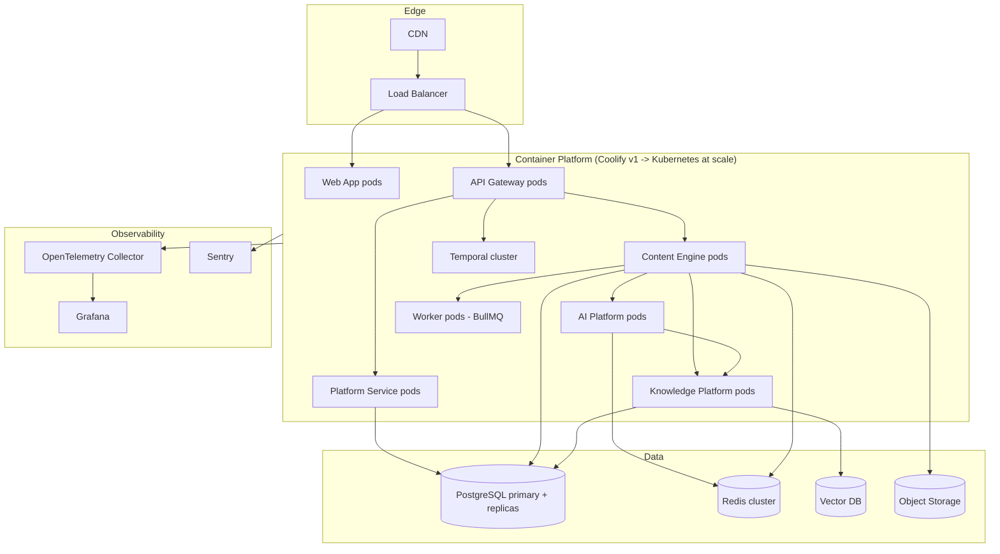

| Concern       | v1                                             | At Scale                                        |
| ------------- | ---------------------------------------------- | ----------------------------------------------- |
| Orchestration | Coolify (Docker) for speed to market           | Kubernetes                                      |
| Environments  | dev · staging · prod                           | + preview per PR                                |
| CI/CD         | Build → test → containerize → deploy           | + progressive delivery (canary/blue-green)      |
| Scaling       | Manual/auto for stateless services and workers | HPA on CPU/queue depth                          |
| Observability | OpenTelemetry + Grafana + Sentry               | + SLO dashboards, alerting                      |
| Data          | Managed PostgreSQL/Redis; PITR backups         | + read replicas, cross-AZ, multi-region roadmap |

---

## 26. Folder Structure

**WHY:** a monorepo with clear package/app boundaries lets multiple engineers (and AI coding agents) work in parallel with shared types and enforced boundaries. This is a _logical_ structure; engines are modules that can be packaged together (modular monolith) or split into services without moving the boundaries.

```
contentos/
├── apps/
│   ├── web/                     # Next.js dashboard (App Router)
│   ├── api-gateway/             # NestJS BFF: authN/Z, tenant context, routing
│   ├── workers/                 # BullMQ consumers (async jobs)
│   └── orchestrator/            # Temporal workflows + activities
│
├── services/                    # Deployable service groupings (v1: few; later: many)
│   ├── platform/                # Auth, Workspace, Projects, Billing, Credits, Notifications
│   ├── content/                 # The nine content engines (see packages/engines)
│   ├── ai/                      # AI Platform (Gateway, Router, Prompt, Context, Council, Memory)
│   └── knowledge/               # Evidence Bank, Graphs, Citation, Vector Search
│
├── packages/
│   ├── engines/                 # One module per engine (keyword, research, competitor,
│   │                            #   planning, writing, seo, review, publishing, analytics)
│   ├── ai-platform/             # Gateway/Router/Prompt/Context/Council/Memory implementations
│   ├── knowledge/               # Knowledge Platform implementations
│   ├── contracts/               # Shared interfaces, DTOs, event schemas, Explainability Envelope
│   ├── integrations/            # Provider adapters (KeywordData, Serp, Model, PublishTarget, ...)
│   ├── db/                      # Data-access layer, RLS helpers, migrations location
│   ├── config/                  # Env, feature flags, routing policy, gate thresholds
│   ├── observability/           # Tracing, logging, metrics wrappers
│   └── ui/                      # Shared React components, design system
│
├── infra/                       # Docker, Coolify/K8s manifests, CI/CD, IaC
├── docs/                        # This architecture doc + derived docs
└── tooling/                     # Lint, test, codegen, scripts
```

**Boundary rules (enforced by lint/imports):**

- `packages/engines/*` may depend on `ai-platform`, `knowledge`, `integrations`, `contracts` — **not** on `apps/web`.
- Engines communicate via `contracts` (interfaces + events), never by importing each other's internals.
- Only `integrations/*` may import provider SDKs; engines depend on the interface, not the SDK.
- Only the AI Gateway may call model providers.

---

## 27. Technology Decisions

Choices resolve the "or" options from the product brief into concrete v1 defaults, with the alternative kept as a documented fallback.

| Layer              | Decision (v1)                                                                        | Alternatives                                | Rationale                                                           |
| ------------------ | ------------------------------------------------------------------------------------ | ------------------------------------------- | ------------------------------------------------------------------- |
| Frontend           | Next.js (App Router) + React + TypeScript + Tailwind                                 | —                                           | SSR/streaming for long jobs; strong ecosystem                       |
| Backend framework  | **NestJS**                                                                           | Node.js + Fastify                           | Modular DI-first structure maps 1:1 to engines; enforces boundaries |
| Language           | TypeScript everywhere                                                                | —                                           | Shared types across web/API/workers via `contracts`                 |
| Relational DB      | PostgreSQL                                                                           | —                                           | Integrity, RLS for tenancy, pgvector for v1 vectors                 |
| Vector search      | **pgvector**                                                                         | Qdrant                                      | One fewer system in v1; Qdrant when recall/scale demands (ADR-006)  |
| Cache/coordination | Redis                                                                                | —                                           | Cache, rate limits, pub/sub, queue backing                          |
| Async queue        | BullMQ                                                                               | —                                           | Simple, Redis-native background jobs                                |
| Workflow engine    | **Temporal**                                                                         | LangGraph                                   | Durable, resumable, human-in-the-loop pipeline (ADR-004)            |
| AI access          | Custom AI Gateway over **OpenRouter** (Claude Sonnet, GPT-5, Gemini 2.5 Flash, Grok) | Direct provider SDKs (fallback path, OQ-11) | Routing, fallback, cost control, guardrails (ADR-008, ADR-013)      |
| Object storage     | S3-compatible (Cloudflare R2 / MinIO)                                                | —                                           | Cheap, durable blobs                                                |
| Search (optional)  | Elasticsearch/OpenSearch                                                             | —                                           | Only if full-text scale requires it (§29)                           |
| Realtime           | SSE (primary) / WebSockets                                                           | —                                           | Stream pipeline progress                                            |
| Auth               | **Better Auth** behind `IdentityProvider`                                            | Enterprise IdP via plugin (later)           | Resolves OQ-1 (ADR-012); interface stays fixed                      |
| Payments           | Stripe                                                                               | Razorpay (India — roadmap, OQ-13)           | Global coverage first                                               |
| Monitoring         | OpenTelemetry + Grafana + Sentry                                                     | —                                           | Traces across engine/AI boundaries                                  |
| Deployment         | Coolify (v1) → Kubernetes (scale)                                                    | —                                           | Speed now, scale later                                              |

---

## 28. Architecture Decision Records

ADRs are immutable once accepted; changes are made by superseding ADRs. Format: **Context · Decision · Consequences · Status.**

### ADR-001 — Engines over Agents

- **Context:** The brief's source material modeled every capability as an AI "agent." Agent-centric decomposition is hard to test, scale, and own.
- **Decision:** Decompose the system by **business capability (Engines)**. AI is a component _inside_ engines, accessed via the AI Platform. Multi-model collaboration is a bounded pattern (AI Council), not the primary structure.
- **Consequences:** Clear ownership, testability, independent scaling, swappable AI. Requires discipline to keep AI subordinate to capability. **Status: Accepted.**

### ADR-002 — Monorepo

- **Context:** Many packages share types, contracts, and events; multiple engineers and AI agents work in parallel.
- **Decision:** Single **monorepo** (Turborepo + pnpm) with enforced import boundaries.
- **Consequences:** Shared contracts, atomic cross-cutting changes, simpler CI; requires boundary linting to prevent coupling. **Status: Accepted.**

### ADR-003 — NestJS Backend

- **Context:** Need a structure that maps to engines and enforces module boundaries.
- **Decision:** **NestJS** with one module per engine/platform capability.
- **Consequences:** DI and module system enforce structure; slightly more ceremony than Fastify. Fastify remains a fallback for ultra-hot standalone services. **Status: Accepted.**

### ADR-004 — Temporal for Pipeline, BullMQ for Jobs

- **Context:** The pipeline is long-running with human waits and strict resumability; other work is simple async.
- **Decision:** **Temporal** for the durable content pipeline; **BullMQ** for background jobs.
- **Consequences:** Crash-safe, resumable pipelines and human-in-the-loop for free; two mechanisms to operate. **Status: Accepted.**

### ADR-005 — PostgreSQL as System of Record

- **Context:** Strong relational integrity and tenant isolation are required.
- **Decision:** **PostgreSQL** for all system-of-record data.
- **Consequences:** Integrity, RLS, PITR, pgvector; must manage replicas/partitioning at scale. **Status: Accepted.**

### ADR-006 — pgvector First, Qdrant at Scale

- **Context:** v1 needs semantic search without over-provisioning infrastructure.
- **Decision:** **pgvector** in v1; migrate/augment with **Qdrant** when recall or throughput requires it.
- **Consequences:** Fewer systems now; a planned migration path later. Vector access is behind a `VectorSearch` interface so the switch is localized. **Status: Accepted.**

### ADR-007 — Multi-Tenancy via Shared DB + RLS

- **Context:** Cost-efficient isolation for many B2B tenants.
- **Decision:** Shared database, `tenant_id` on every row, **PostgreSQL RLS**.
- **Consequences:** Cheap and simple; depends on rigorous RLS and automated isolation tests. Schema/DB-per-tenant reserved for enterprise/white-label. **Status: Accepted.**

### ADR-008 — Central AI Gateway with Policy Router

- **Context:** Multiple providers, cost control, guardrails, and reproducibility are needed.
- **Decision:** All model calls go through one **AI Gateway**; a **policy-based Model Router** selects models; prompts are versioned.
- **Consequences:** Central cost/quality lever and safety enforcement; the Gateway is a hot path that must scale. **Status: Accepted.**

### ADR-009 — Quality Gates + Explainability Envelope

- **Context:** Output must be trustworthy and recommendations must be justified.
- **Decision:** Configurable **Quality Gates** between stages; every recommendation ships in an **Explainability Envelope**.
- **Consequences:** Higher trust and auditability; engines must produce structured, scored output. **Status: Accepted.**

### ADR-010 — Providers Behind Stable Interfaces

- **Context:** Data providers, CMS targets, payment, and auth will change over time.
- **Decision:** Every external dependency is an **adapter behind a stable interface**.
- **Consequences:** Providers are swappable without touching engines; each adapter carries its own resilience policy. **Status: Accepted.**

### ADR-011 — Planning & Review as First-Class Engines; Review Precedes SEO

- **Context:** The initial module breakdown left Planning and Review implicit in places, and the pipeline ran SEO before Review, letting structural optimization touch unvetted content.
- **Decision:** Twelve modules: the AI Gateway (cross-cutting) plus Keyword, SERP, Competitor, Research, Knowledge, Planning, Writing, Review, SEO, Publishing, Analytics. Pipeline order: Keyword → SERP → Competitor → Research → Knowledge → Planning → Writing → **Review → SEO** → Publishing → Analytics. Review hosts the Quality Gates; SEO's structural changes trigger a fast re-validation (readability + citation integrity) before Publishing.
- **Consequences:** Quality is enforced before SEO spends effort on failing drafts; two additional engine boundaries; all pipeline diagrams updated. **Status: Accepted.**

### ADR-012 — Formal Provider Layer with Named Providers

- **Context:** ADR-010 mandated adapters behind interfaces but named no concrete providers and gave them no architectural home.
- **Decision:** A formal **Provider Layer** in the canonical stack (between the Knowledge Platform and Storage), containing OpenRouter, DataForSEO, Firecrawl, Exa, Stripe, Google Search Console, Google Analytics, and Better Auth. Deep documentation: `contentos-docs/08-integrations/`. Resolves OQ-1 (identity → Better Auth) and OQ-2 (keyword/SERP data → DataForSEO, fetch/parse → Firecrawl, semantic discovery → Exa).
- **Consequences:** One audit surface for external dependencies; consumption remains horizontal (Platform, Content, and AI platforms all consume the layer); Razorpay deferred (OQ-13). **Status: Accepted.**

### ADR-013 — Concrete Model Matrix via OpenRouter; DeepSeek Excluded

- **Context:** §22 defined routing tiers but no concrete models; unit economics and reproducibility require pinning.
- **Decision:** Claude Sonnet (Mid/Content), GPT-5 (Premium/Reasoning), Gemini 2.5 Flash (Fast/Cheap), Grok (Alternative voice) — all accessed via OpenRouter under the AI Gateway. **DeepSeek is not used;** any routing configuration referencing it is a defect. The matrix is versioned policy: `contentos-docs/07-ai-platform/model-selection.md`. Embeddings model remains open (OQ-11).
- **Consequences:** Single transport and auditable matrix; cost steerable by policy; OpenRouter availability dependence mitigated by a future direct-SDK fallback (OQ-11). **Status: Accepted.**

---

## 29. Future Scalability

### 29.1 Scaling Each Layer

| Layer                                            | Scaling Path                                                                                        |
| ------------------------------------------------ | --------------------------------------------------------------------------------------------------- |
| Web / Gateway / Engines / AI / Knowledge compute | Stateless horizontal scaling behind the load balancer; autoscale on CPU and queue depth             |
| PostgreSQL                                       | Read replicas → table partitioning by `tenant_id`/time → selective sharding for the largest tenants |
| Vector                                           | pgvector → Qdrant cluster; per-tenant collections                                                   |
| Redis                                            | Cluster mode; separate instances for cache vs queues if contention arises                           |
| Object storage                                   | Inherently scalable; lifecycle policies for cold artifacts                                          |
| Workflows                                        | Scale Temporal workers by task queue; partition high-volume workflows                               |
| Full-text                                        | Introduce Elasticsearch/OpenSearch only when relational full-text is insufficient                   |

### 29.2 Service Extraction

The modular monolith packaging (§9, §26) can be split along existing engine boundaries — the AI Gateway, Research Engine, and Review Engine are the first candidates because they are the hottest and most independently scalable. Because engines already communicate only via `contracts`, extraction is a deployment change, not a redesign.

### 29.3 Extensibility Roadmap (no core changes required)

- **New output formats** (YouTube script, LinkedIn post, newsletter) as Writing-Engine plugins.
- **Media Engine** extracted from the Writing Engine for advanced image/infographic/chart generation.
- **Brand-voice training** from a tenant's existing content (into Memory).
- **Knowledge-base ingestion** (PDFs, Docs, websites) into the Evidence Bank.
- **Multi-language generation and localization.**
- **A/B testing** for titles and meta.
- **Version history with diff viewer.**
- **MCP connectors** for CMSs, documentation systems, and internal knowledge sources.
- **White-label** support and per-tenant data residency (schema/DB-per-tenant).
- **Audit logs and compliance reporting** hardening for SOC 2 / enterprise.

### 29.4 Multi-Region

Region-pinned tenants for residency: region-local compute and data, with a global control plane for identity/billing. Deferred past v1 (§30).

---

## 30. Open Questions

These require explicit decisions before or during implementation. An AI coding agent must **request a decision** rather than assume one.

> **Living tracker:** the active register now lives at `contentos-docs/99-open-questions.md`. The table below is retained as the v1.0 snapshot, with resolutions annotated in place.

| #     | Question                                                                                                | Impact                                       | Owner               |
| ----- | ------------------------------------------------------------------------------------------------------- | -------------------------------------------- | ------------------- |
| OQ-1  | Which identity provider? — **Resolved: Better Auth** (ADR-012)                                          | Auth implementation, enterprise SSO timeline | Architect           |
| OQ-2  | Primary keyword/SERP data provider(s)? — **Resolved: DataForSEO + Firecrawl + Exa** (ADR-012)           | Keyword & Research engine cost and coverage  | Founder + Backend   |
| OQ-3  | Exact model per tier? — **Resolved (partial): matrix per ADR-013;** embeddings + cost caps open (OQ-11) | AI unit economics (§22)                      | AI Engineer         |
| OQ-4  | Default Quality Gate thresholds per content type (e.g., YMYL vs general)?                               | Output quality and throughput                | Content + Architect |
| OQ-5  | Concurrency model: single-author + review vs real-time collaborative editing?                           | Frontend + data model complexity             | Product + Frontend  |
| OQ-6  | Vector store cutover criteria from pgvector to Qdrant (scale thresholds)?                               | Knowledge Platform roadmap                   | Architect + DevOps  |
| OQ-7  | Data residency and multi-region requirements for target enterprise segments?                            | Tenancy model, deployment topology           | Founder             |
| OQ-8  | Which plagiarism/AI-detection providers (and how their scores are surfaced)?                            | Review Engine accuracy and legal framing     | Content + Legal     |
| OQ-9  | Retention policy for Evidence Bank and generated media per plan tier?                                   | Storage cost, compliance                     | DevOps + Legal      |
| OQ-10 | Credit pricing model and per-operation credit costs?                                                    | Billing, unit economics                      | Founder             |

---

_End of `01_SYSTEM_ARCHITECTURE.md`. Downstream documents (`02_DATABASE.md`, `03_BACKEND.md`, `04_FRONTEND.md`, `05_API.md`, `06_MODULES.md`, `07_DEVELOPER_GUIDE.md`) must be derived from and remain consistent with this document. Amend only via the ADR process in §28._
