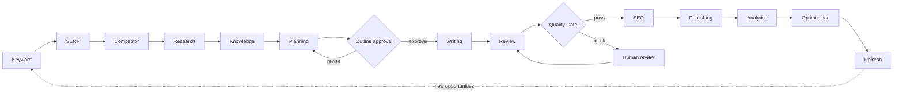
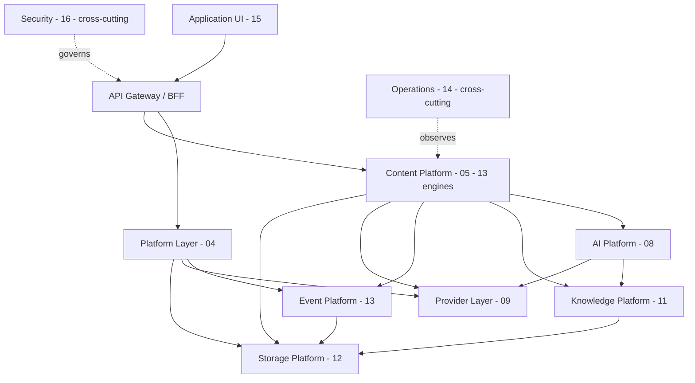

# Executive Summary

> **Status:** v2.0 — complete. Entry point to the canonical documentation. Supersedes `ARCHITECTURE_BASELINE_ARCHIVE.md` §1.
> **Audience:** every engineer and AI coding agent who touches this codebase. Read this before any other document.

## Overview

ContentOS AI is a **Content Intelligence Operating System**: a multi-tenant SaaS platform that takes a topic from idea to published, measured, and continuously refreshed content, with every factual claim traceable to a verified source.

It is not an AI writing tool. An AI writing tool accepts a prompt and returns text. ContentOS runs a governed, thirteen-stage pipeline in which text generation is one stage of thirteen, bounded on one side by intelligence it gathered and on the other by quality it verified. The distinction is architectural, not marketing: it is why the system decomposes into **Engines** rather than agents (ADR-001), why every model call is brokered through a single **AI Gateway** (ADR-008), and why content cannot reach a customer's site without passing a **Quality Gate** (ADR-009).

This document set is the blueprint from which the production application is generated. It supersedes the v1 Python implementation documented in `archive/`; that system's architecture and product model are historical reference only (ADR-016).

### The thirteen stages



## Business Purpose

Content teams stitch together five to eight tools — keyword research, SERP analysis, a research assistant, an AI writer, an SEO grader, a CMS, an analytics dashboard — and carry context between them by hand. Every handoff loses information, and none of the tools can answer the question that actually matters: *did this content earn its position, and what should we do next?*

ContentOS collapses that toolchain into one workflow with one memory. The commercial thesis rests on three properties a competitor cannot copy without rebuilding:

| Property | Commercial consequence |
|---|---|
| **Grounding** | Every claim traces to a source in the Evidence Bank. Enterprise and YMYL buyers can defend published content under audit |
| **Explainability** | Every recommendation ships with its reasoning and evidence, so a specialist can accept or override it instead of trusting a black box |
| **Continuity** | The platform remembers what it researched, published, and measured, so optimization and refresh are ongoing behavior rather than a new project |

Target segments are solo creators, in-house content teams, agencies running many client brands, and enterprises with compliance obligations. The tenancy model (ADR-017) supports the agency and enterprise cases from day one because retrofitting them is a full-schema migration.

## Technical Purpose

Provide a system that:

1. Executes a long-running, human-interruptible pipeline **durably** — a run survives deploys, crashes, and multi-day approval waits (ADR-004). This fixes the v1 system's foundational fault, where run lifetime equalled HTTP connection lifetime.
2. Isolates tenants **at the database** rather than in application code (ADR-007), because v1's application-level scoping leaked five endpoints (`AUDIT.md`).
3. Makes AI cost and quality **steerable as policy, not code** — routing, prompts, and thresholds change without a deploy (ADR-008, ADR-013).
4. Keeps every external dependency **swappable behind a stable interface** (ADR-010, ADR-012).
5. Scales from ten users to a million on one architecture, advancing through pre-decided stages rather than redesigns.

## Responsibilities

**This document MUST:** state what the system is and is not; present the architectural thesis and the durable commitments; index the decisions binding every other document; define the scope of this documentation set.

**This document MUST NOT:** specify components (`03-high-level-architecture.md`), define terminology (`05-glossary.md`), or restate ADR reasoning (`13-adr-log.md`). It is a framing document and an index — the shortest path from "I am new here" to "I know which document I need."

## Architecture

Nine layers plus two cross-cutting concerns. Each maps to exactly one documentation folder, which is how a coding agent knows where code belongs.



**Dependency rule:** dependencies point downward only. The Content Platform calls the AI and Knowledge Platforms; neither calls an engine. No layer calls the Application UI. Only the Provider Layer imports third-party SDKs, and only the AI Gateway invokes a model provider. These are enforced by import-boundary lint in CI, not by convention (`10-testing/testing-strategy.md` §9).

### The four durable commitments

Every architectural argument in this documentation reduces to one of these:

| Commitment | Consequence |
|---|---|
| **Engines, not agents** | Decomposition follows business capability; AI is a component inside an engine. Testable, ownable, independently scalable (ADR-001) |
| **Retrieval-augmented by default** | Generation is grounded in retrieved evidence. Ungrounded generation is a defect, not a mode |
| **Quality gates before delivery** | Content passes measured thresholds — `pass` / `soft-warn` / `block` — before SEO, publishing, or a customer's site (ADR-009) |
| **Durable orchestration** | The pipeline is a Temporal workflow. Human waits cost zero compute; crashes resume from the last durable step (ADR-004) |

## Data Flow

A run moves through the pipeline as a chain of artifacts, each persisted before the next stage begins:

```
Seed idea → scored keyword set → SERP dataset → competitor gaps → evidence with provenance
→ entities + embeddings + citation index → intent, persona, clusters, approved outline
→ grounded draft with citation anchors → quality reports + gate verdict
→ optimized draft + schema + links → publish package + live URL
→ performance time-series → optimization actions → refresh plan → new opportunities
```

**Grounding invariant:** by the time content reaches Publishing, every factual claim resolves to an Evidence Bank source through the Citation Engine, or is explicitly flagged as unsupported. Enforced at the Quality Gate and asserted mechanically in evaluation (`10-testing/ai-evaluation.md` §11).

## Dependencies

| Category | Choice | Reference |
|---|---|---|
| Language / runtime | TypeScript everywhere | ADR-016 |
| Backend framework | NestJS | ADR-003 |
| Frontend | Next.js App Router | `15-application-ui/` |
| Orchestration | Temporal (pipeline) + BullMQ (jobs) | ADR-004 |
| System of record | PostgreSQL with RLS | ADR-005, ADR-007 |
| Vectors | pgvector → Qdrant at scale | ADR-006 |
| Cache / coordination | Redis | `12-storage-platform/redis.md` |
| Object storage | Cloudflare R2 | `12-storage-platform/storage-abstraction.md` |
| Models | Claude Sonnet · GPT-5 · Gemini 2.5 Flash · Grok, via OpenRouter | ADR-013 |
| Identity · Payments | Better Auth · Stripe | ADR-012 |
| Data providers | DataForSEO · Firecrawl · Exa | ADR-012 |
| Analytics sources | Google Search Console · GA4 | ADR-012 |

**DeepSeek is excluded by policy.** Any code path referencing it is a defect.

## Interfaces

The system exposes three external interfaces: the **public REST API** (`06-api/`), the **progress stream** (SSE, for long-running runs), and **inbound webhooks** (Stripe, CMS callbacks). Everything internal — engine to engine, engine to platform — communicates through typed contracts in `packages/contracts` or through domain events. No engine imports another engine's internals.

## Events

The pipeline is event-driven at its seams. Representative events, with the full catalog in `13-event-platform/event-registry.md`: `KeywordResearchCompleted`, `EvidenceStored`, `OutlineReady`, `OutlineApproved`, `ArticleDraftCompleted`, `ReviewCompleted`, `QualityGateBlocked`, `ArticlePublished`, `RankingChanged`, `RefreshRecommended`, `CreditConsumed`. Delivery is at-least-once with idempotent consumers, published through a transactional outbox so a database commit and its event cannot diverge (`10-event-flow.md`).

## Database Impact

This document defines no schema. It fixes two decisions that constrain all of it: **every table carries `tenant_id` and an RLS policy** (ADR-007), and **tenancy is `Organization → Workspace → Project`**, with `tenant_id` bound to the workspace and `organization_id` carried on workspace-owned aggregates (ADR-017). Physical schema lives in `03-database/`.

## Security

Security is owned by `16-security/` and referenced, never duplicated, elsewhere. Its load-bearing positions: deny-by-default authorization; tenant isolation enforced in PostgreSQL via RLS; retrieved web content treated as data and never as instructions; credentials encrypted at rest and never logged; append-only audit log and credit ledger. Three of `AUDIT.md`'s four v1 blockers were security defects — in v2 they are acceptance criteria, not aspirations.

## Performance

| Target (v1) | Value |
|---|---|
| Dashboard / API read latency | p95 < 300 ms |
| Article pipeline duration, excluding human wait | p50 < 8 min · p95 < 20 min |
| Concurrent pipelines per region | ≥ 500 |
| Availability | 99.9% monthly |

The binding constraint at scale is not CPU — it is provider rate limits and AI token throughput (`14-operations/scaling-strategy.md` §3).

## Caching

Six layers, specified once in `12-storage-platform/redis.md`: CDN, HTTP response, application entity cache, external-data cache (SERP and keyword TTL), semantic AI cache (keyed on normalized prompt embedding + model + `prompt_version`), and vector query cache. All keys are tenant-prefixed. The semantic cache is the platform's single largest cost lever.

## Scalability

Four pre-decided stages — S1 (Coolify, modular monolith) through S4 (regional deployments, selective sharding) — each with a trigger metric and threshold (`14-operations/scaling-strategy.md` §3.3). Service extraction along engine boundaries is a deployment change rather than a redesign, because engines already communicate only through contracts.

## Observability

OpenTelemetry traces covering 100% of engine and AI boundaries, with `tenant_id`, `correlation_id`, `workflow_id`, `task_type`, `model`, and `prompt_version` as mandatory span attributes; Grafana dashboards; Sentry for exceptions; cost events persisted to PostgreSQL and reconciled daily against the credit ledger (`14-operations/monitoring.md`).

## Failure Recovery

Pipeline runs resume from the last durable step after any crash or deploy. Provider outages degrade to documented fallbacks rather than failing runs, and never silently produce ungrounded output. Rollback completes within 10 minutes; authoritative data carries RPO 5 minutes and RTO 1 hour (`14-operations/backup-recovery.md`).

## Implementation Notes

For an AI coding agent starting work: read `05-glossary.md` and `04-context-map.md` before writing any code — they fix vocabulary and boundaries. Then read the folder that owns your change. Never invent architecture; if a decision is missing it belongs in `99-open-questions.md`, and you **request a decision rather than assume one**. Architectural changes happen only through ADRs (`12-architecture-decisions.md`).

## Future Roadmap

Multi-language generation, additional output formats as Writing Engine plugins, brand-voice training from a tenant's existing content, MCP connectors for CMSs and internal knowledge sources, white-label and per-tenant data residency, SOC 2 hardening. None require core changes; all are extension points named in the owning documents.

## Cross References

- `02-product-vision.md` — lifecycle, personas, goals, non-goals
- `03-high-level-architecture.md` — layer responsibilities and dependency rules in depth
- `04-context-map.md` · `05-glossary.md` — boundaries and vocabulary (read first)
- `13-adr-log.md` — ADR-001 through ADR-019
- `16-security/threat-model.md` · `15-application-ui/README.md`
- `99-open-questions.md` — everything not yet decided
- `archive/` · `AUDIT.md` — the v1 system and the defects v2 must not repeat

## Open Questions

None specific to this document. Twenty-one platform questions remain open in `99-open-questions.md`; those constraining near-term work are OQ-4 (gate thresholds), OQ-7 (data residency), and OQ-10 (credit pricing).
