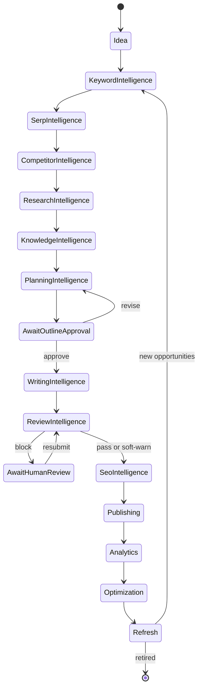
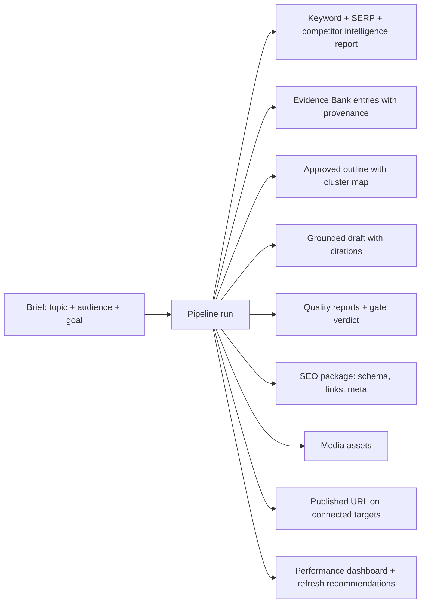

# Product Vision

> **Status:** v2.0 — complete. Supersedes `ARCHITECTURE_BASELINE_ARCHIVE.md` §2–§3 and the v1 PRD in `archive/ContentOS-AI-PRD.md`.
> **Scope:** what the product does for whom, the lifecycle it owns, the promise it makes to a user, and the goals and non-goals that bound v1. This document constrains scope; it does not describe implementation.

## Overview

An operating system does three things: it schedules work, manages scarce resources, and isolates tenants from each other. ContentOS applies that model to content production.

| OS concept | ContentOS equivalent |
|---|---|
| Process scheduling | Durable pipeline runs orchestrated by Temporal, with human-in-the-loop waits as first-class states |
| Resource management | Credits, AI token budgets, provider quota, and per-tenant rate limits, all enforced centrally |
| Memory | The Knowledge Platform: Evidence Bank, entity graph, brand voice, and the tenant's own publishing history |
| Isolation | Organization → Workspace tenancy with PostgreSQL RLS |
| System calls | The AI Gateway and Provider Layer: the only sanctioned paths to external capability |
| Device drivers | Provider adapters — swap DataForSEO for another vendor without touching an engine |

The metaphor is not decoration. It explains why the platform owns scheduling and resource governance itself rather than delegating them to each feature, and why "add an AI feature" never means "add another provider integration."

## Business Purpose

The product exists because content operations are structurally broken in three ways that tools address individually and none address together.

**Fragmentation.** A single article passes through keyword research, SERP analysis, competitor review, source gathering, outlining, drafting, editing, SEO checks, publishing, and measurement. Teams do this across separate tools with manual handoffs, and the context gathered in step one is gone by step six.

**Unverifiability.** Generated content asserts facts. Almost no tool can show where a fact came from. That is an inconvenience for a blog and a blocker for finance, health, and legal content — precisely the segments with budget.

**Amnesia.** Published content decays. Rankings shift, statistics age, competitors publish better pages. Most tools treat publication as the end of the workflow, so refresh work restarts from zero.

ContentOS addresses all three as a single system: one workflow, verifiable output, persistent memory.

### Personas

| Persona | Primary need | What the architecture owes them |
|---|---|---|
| **Solo creator / SEO specialist** | Speed with control | Fast path from keyword to draft; approval gates they can skip when they choose |
| **In-house content team** | Consistency and review | Brand voice enforcement, editorial workflow, role-scoped permissions |
| **Agency lead** | Many client brands, isolated | Organization owns many workspaces; per-client voice, credentials, credits, and reporting (ADR-017) |
| **Enterprise content owner** | Defensibility and compliance | Grounding invariant, audit logs, SSO at organization level, data export and deletion |
| **Platform admin (internal)** | Operate safely | Break-glass access with audit, cost visibility, incident tooling (`14-operations/`) |

## Technical Purpose

Translate the lifecycle into an architecture where every stage is an owned, testable capability rather than a prompt. The vision imposes five hard technical requirements, each traceable to a decision:

1. **Every lifecycle stage must exist as a named engine** — nothing is implicit, nothing is "part of writing" (ADR-001, ADR-011).
2. **Nothing is published that cannot be defended** — grounding and quality gates are pipeline structure, not optional checks (ADR-009).
3. **Runs are long and human-interrupted** — durability is a base requirement, not resilience polish (ADR-004).
4. **Multi-brand isolation is a day-one property** — the tenancy hierarchy is fixed before schema design (ADR-017).
5. **Output quality must be measurable across model and prompt changes** — otherwise cost optimization silently degrades the product (`10-testing/ai-evaluation.md`).

## Responsibilities

**This document MUST:** define the lifecycle and its stages; define personas and the single-workflow promise; state business and engineering goals; state explicit non-goals for v1.

**This document MUST NOT:** describe layers or components (`03-high-level-architecture.md`), specify engine behavior (`05-content-platform/`), or define UI surfaces (`15-application-ui/`).

**Boundary:** this document decides *what the product must do*. Every other document decides *how*.

## Architecture — the lifecycle

The lifecycle is a loop, not a line. Its terminal stages feed its opening stages, which is what turns a content tool into a content operating system.

### Stage responsibilities and deliverables

| # | Stage | Question it answers | Deliverable |
|---|---|---|---|
| 1 | Keyword Intelligence | What is worth writing about? | Scored keyword set with difficulty, volume, intent |
| 2 | SERP Intelligence | What does the results page reward today? | Top-N SERP dataset with structural analysis |
| 3 | Competitor Intelligence | What must we beat, and how? | Competitor profiles, content gaps, how-to-outperform plan |
| 4 | Research Intelligence | What is actually true? | Sources with mandatory provenance in the Evidence Bank |
| 5 | Knowledge Intelligence | What does this mean and how does it connect? | Entities, embeddings, citation index, trust and freshness scores |
| 6 | Planning Intelligence | What exactly are we writing, for whom? | Intent, persona, topic clusters, approval-ready outline |
| 7 | Writing Intelligence | Produce it | Grounded draft with citation anchors and media specs |
| 8 | Review Intelligence | Is it true, readable, and on-brand? | Quality reports and a gate verdict |
| 9 | SEO Intelligence | Will search engines and AI answers surface it? | Optimized structure, internal links, schema, score |
| 10 | Publishing | Get it live, everywhere it belongs | Publish package, live URL, publishing history |
| 11 | Analytics | Did it work? | Performance time-series, ranking movement, ROI signals |
| 12 | Optimization | What single change would help most? | Prioritized, evidence-backed optimization actions |
| 13 | Refresh | What is decaying and what do we do about it? | Refresh plan with re-research scope and effort estimate |

Two stages — Optimization and Refresh — exist as engines rather than as reports because they generate work. Anything that generates work needs its own queue, budget, and quality bar.

## Data Flow — the single-workflow promise

One brief produces, without the user leaving the platform:

The promise is explicit: **the user supplies a brief and approves an outline. Everything else is either automatic or presented as a decision with evidence attached.** Any feature that breaks that promise — an unexplained score, a recommendation without evidence, a stage that requires leaving the product — is a product defect regardless of how well it is engineered.

## Dependencies

The vision depends on capabilities the platform does not own: search and keyword data (DataForSEO), page retrieval (Firecrawl), semantic discovery (Exa), model intelligence (via OpenRouter), performance data (Google Search Console, GA4), payments (Stripe), and identity (Better Auth). Each is behind an interface in the Provider Layer (`09-integrations/`) precisely because the product promise must outlive any one vendor.

## Interfaces

The user-facing surface is a workspace application (`15-application-ui/`) and a public API (`06-api/`) that exposes the same capabilities — the API is not an afterthought, because agencies automate and enterprises integrate. Every long-running operation returns a handle and streams progress rather than blocking (`09-request-flow.md`).

## Events

The lifecycle loop is closed by events, not by polling: `ArticlePublished` starts measurement, `RankingChanged` triggers optimization evaluation, `ContentDecayDetected` triggers refresh planning, and `RefreshRecommended` can open a new pipeline run. Full catalog in `13-event-platform/event-registry.md`.

## Database Impact

The lifecycle dictates that an **Article is a long-lived aggregate with versions**, not a document that is written once: outlines, drafts, revisions, reports, publish attempts, and refresh cycles all attach to it over months. It also dictates that **evidence outlives the article that used it**, since refresh re-uses and re-validates prior research. Both constraints are modeled in `02-domain-design/articles.md` and `02-domain-design/research.md`.

## Security

Two vision-level requirements land in `16-security/`: agencies require that one client's research, voice, and credentials are unreachable from another client's workspace; and enterprises require that everything the platform asserts is auditable — who approved which outline, which evidence supported which claim, who published what and when.

## Performance

The product promise implies a latency contract: interactive surfaces feel immediate (p95 < 300 ms), pipeline runs complete within a working session (p50 < 8 min), and progress is always visible so a long run never feels like a hang. A user who cannot tell whether the system is working will refresh, retry, and duplicate work.

## Caching

Vision-level, not implementation: identical research must not be paid for twice. Keyword and SERP data are cached per `(tenant, keyword, locale)` with freshness-tagged TTLs, and repeated model sub-prompts are served from the semantic cache. Freshness is surfaced to the user rather than hidden, because a stale SERP silently reused is worse than a visibly cached one.

## Scalability

The product must behave identically for a solo creator running two articles a week and an agency running five hundred a month. That requires fair scheduling across tenants rather than FIFO queues (`14-operations/scaling-strategy.md` §9) — a scaling decision that exists purely because of the vision's agency persona.

## Observability

Product-level signals matter as much as system ones: pipeline success rate, gate block rate, time-to-first-published-article for a new workspace, refresh adoption, and cost per article. These are the metrics that indicate whether the promise is being kept, and they are dashboarded alongside infrastructure health.

## Failure Recovery

The vision imposes a rule that overrides convenience: **the platform never silently degrades quality.** If evidence is thin, Planning requests more research rather than outlining unsupported sections. If a provider is down, the run pauses or reports the gap rather than inventing content. If a claim cannot be supported, Review flags it rather than passing it. Degradation is always visible, always explained.

## Implementation Notes

Two anti-patterns are ruled out at vision level and must not resurface in implementation:

1. **Fake collaboration.** Multi-model deliberation must involve genuinely different models with genuine disagreement, or it must not be presented as deliberation (ADR-019). The v1 system presented one model as four; `AUDIT.md` §07 documents it.
2. **Unverified verification.** A fact-checker that accepts a claim because it matches a phrasing pattern is worse than none, because it launders fabrication into apparent verification (`AUDIT.md` §00). Verification resolves against the Evidence Bank or it fails.

## Future Roadmap

Multi-language content and localization; additional output formats (video script, newsletter, social) as Writing Engine plugins; brand-voice training from a tenant's existing corpus; content calendar and portfolio-level planning; A/B testing of titles and meta; MCP connectors for internal knowledge sources; white-label for agencies. Each extends an existing engine or adds a plugin — none require a new layer.

## Cross References

- `01-executive-summary.md` — the thesis and the decisions that follow from this vision
- `03-high-level-architecture.md` — how these stages map to layers
- `05-content-platform/` — one document per stage
- `11-knowledge-platform/evidence-bank.md` — the memory that makes continuity possible
- `15-application-ui/` — how the promise is presented
- `02-domain-design/articles.md` — the article as a long-lived aggregate

## Open Questions

- **OQ-5** — collaboration model: single-author with review, or real-time collaborative editing? This changes the editor and the article data model.
- **OQ-12** — CMS targets beyond the seven v1 adapters.
- **OQ-14** — whether conversion data comes from GA4 alone or supplementary server-side events, which bounds the ROI claim the product can make.

### Explicit non-goals for v1

Recording these prevents scope drift; each is a deliberate deferral, not an oversight.

| Non-goal | Why deferred |
|---|---|
| Real-time collaborative editing | Large frontend and data-model cost; unresolved (OQ-5) |
| Social media management and scheduling | Different product, different lifecycle |
| Full digital-asset management | Media is scoped to content production (ADR-018) |
| Link building and outreach | Adjacent workflow, no shared data model |
| Site auditing / technical SEO crawling | Ahrefs and Screaming Frog territory; ContentOS optimizes pages it produces |
| On-premise deployment | Cloud-native only; enterprise isolation is addressed by tenancy tiers |
| Custom model fine-tuning per tenant | Prompt and context strategies deliver most of the value at a fraction of the cost |
