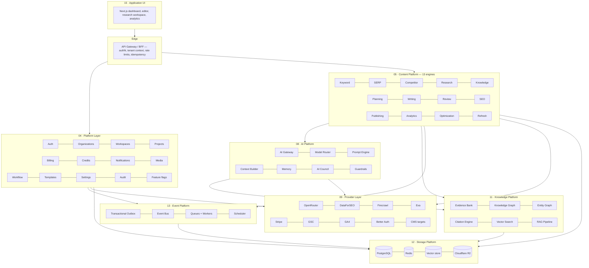
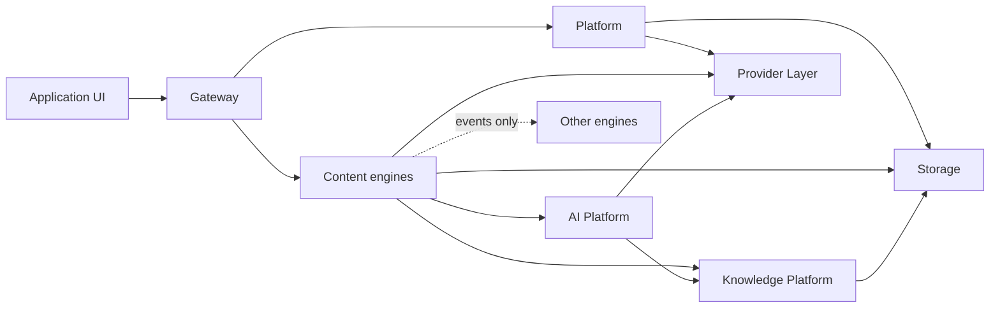
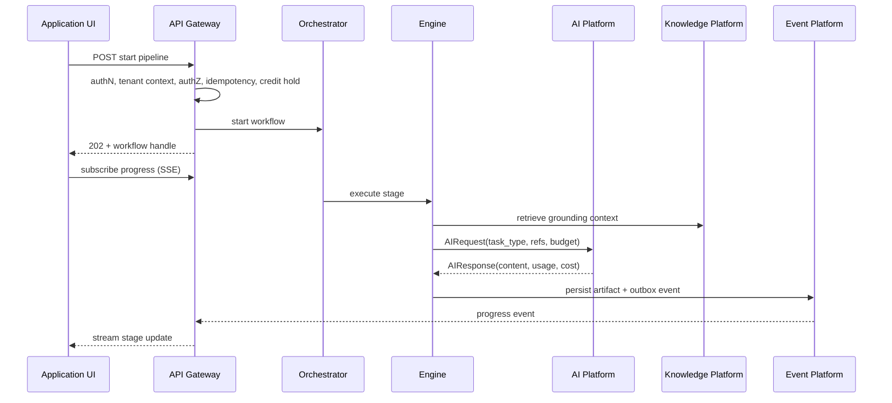

# High-Level Architecture

> **Status:** v2.0 — complete. Supersedes `ARCHITECTURE_BASELINE_ARCHIVE.md` §4 and §7.
> **Scope:** the layered decomposition, what each layer owns, the dependency rules that bind them, the design principles every engine inherits, and the trade-offs accepted. This is the document a coding agent consults to answer "where does this code belong?"

## Overview

ContentOS is a **layered, event-aware modular monolith** that can be decomposed into services along pre-drawn boundaries without redesign. Nine layers, each with a single reason to change, plus two cross-cutting concerns that every layer consumes and none owns.

The alternative — organizing by feature, with each feature owning its own AI calls, provider clients, and storage — was rejected because it makes the two properties this product sells (cost control and grounding) unenforceable. If twelve engines each call a model provider directly, no one can cap spend, redact PII, or guarantee that generation was grounded. Centralizing those concerns is the entire argument for the layering.

## Business Purpose

Layering is what lets the business change one thing at a time: swap a data provider without touching content logic, tune model routing to cut cost without a deploy, add an engine without destabilizing the pipeline, and extract the hottest service when scale demands it. Each of those is a business need — vendor leverage, margin control, feature velocity, and scale headroom — expressed as an architectural constraint.

## Technical Purpose

Give every piece of logic exactly one correct home, and make the wrong home mechanically detectable. A boundary that is documented but not enforced decays within weeks, so every rule in this document has a corresponding lint rule or test (`10-testing/testing-strategy.md` §3.2, `07-development-guide/folder-structure.md`).

## Responsibilities

**This document MUST:** define the layers and their responsibilities; define dependency direction and communication rules; state the design principles that bind all engines; record trade-offs and risks.

**This document MUST NOT:** specify containers or runtime processes (`07-c4-container.md`), specify components inside a layer (`08-c4-component.md`), or specify any individual engine (`05-content-platform/`).

## Architecture

### The layered view

`16 · Security` and `14 · Operations` are cross-cutting: they define policy and instrumentation that every layer applies, and they own no runtime position in this diagram.

### Layer responsibilities

| Layer | Owns | Must never |
|---|---|---|
| **15 · Application UI** | Rendering, interaction, progress streaming, client-side state | Contain business rules or call providers |
| **Edge · API Gateway/BFF** | Authentication, tenant-context resolution, authorization entry, rate limiting, idempotency, error envelope | Contain domain logic; it routes and enforces, it does not decide |
| **04 · Platform** | Identity, organizations, workspaces, projects, commerce, notifications, media storage, editorial workflow, templates, settings, audit, flags | Know anything about content production |
| **05 · Content** | The thirteen engines — the entire content lifecycle | Call model providers directly; import another engine's internals |
| **08 · AI** | Every model interaction: routing, prompts, context, memory, council, guardrails, cost metering | Contain content-domain rules; know what an "outline" means |
| **11 · Knowledge** | Grounding: evidence, provenance, entities, citations, embeddings, retrieval, trust, freshness, dedup | Generate content or make editorial decisions |
| **13 · Event** | Outbox, bus, queues, workers, scheduler, retry, DLQ | Contain business logic inside a handler beyond dispatch |
| **09 · Provider** | Every external API: auth, retries, rate limits, circuit breakers, response mapping | Leak vendor types upward; be imported by anything but its consumer interface |
| **12 · Storage** | Durable state and its access patterns | Be reached except through the layer that owns the dataset |

### Dependency rules

1. Dependencies point **downward and inward** only. Nothing calls upward.
2. Engines communicate with each other **only through `packages/contracts` interfaces or domain events** — never by importing internals. This is what makes service extraction a deployment change.
3. **Only `packages/integrations` imports provider SDKs.**
4. **Only the AI Gateway calls a model provider.** Any other path is an architectural defect (ADR-008).
5. **Every request carries tenant context** from the gateway down to the database session variable that RLS reads.
6. Shared code lives in `packages/contracts`, `packages/config`, or `packages/observability` — never in a "utils" package that becomes a boundary bypass.

Rules 2–4 are enforced by import-boundary lint in CI; rule 5 is enforced by integration tests that assert an unset tenant context returns zero rows.

## Data Flow

Two flows exist, and conflating them is the most common architectural mistake in systems like this:

**Synchronous flow (interactive):** UI → Gateway → Platform or a read model → response in milliseconds. Never touches a model provider. Never starts long work inline.

**Asynchronous flow (production):** Gateway starts a Temporal workflow and returns a handle → the orchestrator drives engines stage by stage → engines call the AI and Knowledge Platforms → artifacts persist → events fan out → progress streams to the UI over SSE.

## Dependencies

Internal dependencies are the layers above. External dependencies are entirely contained in the Provider Layer (`09-integrations/`), which is the system's anti-corruption layer: vendor payloads are mapped to domain types at the boundary, so a provider's schema change never propagates inward.

## Interfaces

Three interface classes, with different stability guarantees:

| Class | Example | Stability |
|---|---|---|
| **Public API** | `POST /v1/articles/{id}/pipeline` | Versioned; breaking changes require `/v2` and a deprecation window (`06-api/`) |
| **Internal contracts** | `KeywordDataProvider`, `AIRequest`, `PlanArtifact` | Changed with the codebase; compile-time enforced across all consumers |
| **Domain events** | `ArticlePublished` | Additive within a major version; consumers ignore unknown fields |

## Events

Layer boundaries are where events are emitted, because that is where coupling would otherwise form. The Content Platform publishes lifecycle events; the Platform Layer publishes commerce and membership events; the AI Platform publishes `CreditConsumed`. Consumers subscribe without producers knowing they exist. Semantics, catalog, and delivery guarantees: `10-event-flow.md` and `13-event-platform/`.

## Database Impact

Layering constrains data access: each dataset has exactly one owning layer, and other layers read it through that layer's interface, not by querying its tables. The Platform Layer owns identity, commerce, and workspace configuration; the Content Platform owns articles, keywords, and reports; the Knowledge Platform owns evidence, entities, and embeddings. Cross-layer reads at the database level are a boundary violation even though PostgreSQL will happily allow them — reviewed at PR time and, where feasible, prevented by schema-level grants. Physical detail: `03-database/`.

## Security

Two structural security properties come from the layering itself: there is **exactly one entry point** (the gateway) where authentication, tenant resolution, and rate limiting are enforced, and **exactly one egress** per external capability (the Provider Layer, and within it the AI Gateway for models). Single entry and single egress are what make policy enforceable at all. Everything else — RBAC, encryption, injection defense, audit — is specified in `16-security/`.

## Performance

The layering costs one to three in-process hops per request, which is negligible against a 300 ms budget and irrelevant against an 8-minute pipeline. It buys the caching layers (§Caching), the semantic cache, and per-tenant rate limiting — all of which are only possible because traffic converges through known points. Where a hop would be genuinely hot, layers are co-located in the same process (modular monolith) rather than dissolved.

## Caching

Cache placement follows layer ownership: the Provider Layer caches external data by freshness policy; the AI Platform owns the semantic cache; the Platform and Content layers cache hot entities; the Edge caches static and idempotent responses. No layer caches another layer's data, because it cannot know when that data becomes invalid. Specification: `12-storage-platform/redis.md`.

## Scalability

Each layer scales on a different signal — the gateway on CPU and latency, engines and workers on queue depth, the AI Platform on in-flight calls bounded by provider quota, PostgreSQL on connections then replicas then partitions. Because the boundaries already exist as contracts, the S3-stage extraction of the AI Gateway, Research Engine, and Review Engine into separate services is a packaging change (`14-operations/scaling-strategy.md` §3.3).

## Observability

Every layer boundary is a span boundary. That is not a convention but a requirement: the NFR of 100% tracing coverage across engine and AI boundaries is asserted by an integration test that fails the build if a boundary emits no span (`10-testing/integration-testing.md` §13).

## Failure Recovery

Failure containment follows the same boundaries. A provider outage is contained by a circuit breaker in the Provider Layer and surfaces as a typed error, not an exception cascade. An engine failure fails one workflow activity, which Temporal retries. A queue failure is contained to one queue with its own DLQ. The layering means no single failure requires understanding the whole system to diagnose.

## Implementation Notes

**Deployment shape.** v1 packages several layers into a small number of deployable services (modular monolith); the layering is logical and enforced by lint, not by network calls. This is deliberate: distributed boundaries add latency and operational cost before there is scale to justify them, and the contracts make extraction cheap later (ADR-002).

**Where new code goes** — the decision table a coding agent should apply:

| If the code… | It belongs in |
|---|---|
| Renders or handles user interaction | `apps/web` (`15-application-ui/`) |
| Authenticates, resolves tenant, limits, or maps errors | `apps/api-gateway` |
| Is about users, orgs, workspaces, money, or notifications | `packages/platform` (`04-platform/`) |
| Is a content lifecycle capability | `packages/engines/<engine>` (`05-content-platform/`) |
| Talks to a model in any way | `packages/ai-platform` (`08-ai-platform/`) |
| Concerns evidence, entities, citations, or retrieval | `packages/knowledge` (`11-knowledge-platform/`) |
| Calls a third-party API | `packages/integrations` (`09-integrations/`) |
| Publishes, consumes, or schedules events and jobs | `packages/events` (`13-event-platform/`) |
| Is a shared type, DTO, or event schema | `packages/contracts` |

## Future Roadmap

Service extraction along engine boundaries at S3; a plugin surface for output formats and CMS adapters; regional deployment with a global control plane; read models for analytics-heavy surfaces as the first CQRS application. All are anticipated by the current boundaries; none require re-layering.

## Cross References

- `01-executive-summary.md` — the thesis this layering serves
- `04-context-map.md` — the domain boundaries beneath these technical layers
- `07-c4-container.md` · `08-c4-component.md` — the runtime and component views
- `07-development-guide/folder-structure.md` — the enforced monorepo mapping
- `16-security/` · `14-operations/` — the cross-cutting concerns
- `13-adr-log.md` — ADR-001, ADR-002, ADR-007, ADR-008, ADR-010, ADR-012

## Open Questions

- Whether analytics read models justify a formal CQRS split before S3 (currently: no — a read replica suffices).
- Whether the Platform Layer's Workflow service and the Temporal orchestrator should share a state representation, or remain deliberately separate (editorial workflow vs execution workflow). Current position: separate; recorded for revisit in `99-open-questions.md`.
