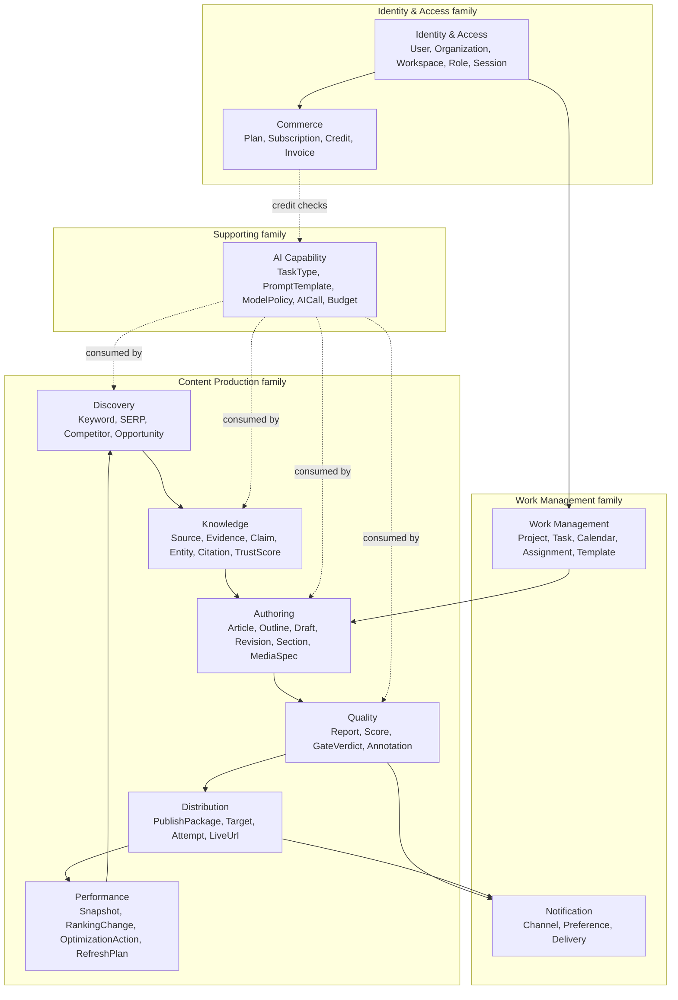
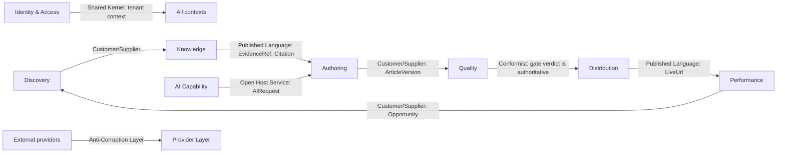

# Context Map

> **Status:** v2.0 — complete. New in v2; no baseline equivalent. Closes the gap identified in `00-architecture-review.md` §W3 (DDD claimed but never applied).
> **Scope:** the bounded contexts of ContentOS, their relationships, integration patterns, and ownership of shared concepts. Read together with `05-glossary.md` before writing any code or any further document.

## Overview

The layered architecture (`03-high-level-architecture.md`) answers "where does code run?" This document answers the prior question: **"where does a concept mean what?"** Two teams can agree that "Article" exists and still build incompatible systems if one means "a row with content" and the other means "a versioned aggregate with reports, citations, and publish history."

A bounded context is a boundary within which a model has one consistent meaning. Across a boundary, the same word may mean something different, and translation is explicit. ContentOS has **eleven bounded contexts** grouped into four families. Every engine, service, and table belongs to exactly one.

## Business Purpose

Boundaries determine what can change independently, which determines delivery speed and blast radius. When Publishing owns its own notion of "publishable article" rather than sharing Writing's model, a CMS adapter change cannot break drafting. When Billing owns "credit" and no one else writes to the ledger, a pricing change touches one context. The context map is therefore an organizational asset as much as a technical one: it defines what one person or agent can own end to end.

## Technical Purpose

Prevent the two failure modes that destroy modular systems: the **shared-model trap** (one giant `Article` type that every module extends until no module can change it) and **chatty coupling** (contexts reaching into each other's data instead of exchanging defined messages). The map fixes ownership, names the translation points, and states which relationship pattern applies at each seam.

## Responsibilities

**This document MUST:** enumerate bounded contexts, their core concepts, and their owners; define every context relationship with its DDD pattern; define which context owns each shared concept and how it is translated; define the anti-corruption boundaries.

**This document MUST NOT:** define entities and invariants in detail (`02-domain-design/`), define physical tables (`03-database/`), or restate layer responsibilities (`03-high-level-architecture.md`).

## Architecture

### The eleven contexts

### Context definitions

| # | Context | Core concepts | Owning folder | Engines / services |
|---|---|---|---|---|
| 1 | **Identity & Access** | User, Organization, Workspace, Membership, Role, Permission, Session | `04-platform/` | auth, organizations, workspace, users, roles-permissions |
| 2 | **Commerce** | Plan, Subscription, CreditLedger, Hold, Invoice, PaymentMethod | `04-platform/` | billing, credits |
| 3 | **Work Management** | Project, Task, CalendarItem, Assignment, WorkflowState, Template | `04-platform/` | projects, workflow, template, settings |
| 4 | **Notification** | Channel, Preference, NotificationEvent, Delivery | `04-platform/` | notifications |
| 5 | **Discovery** | Keyword, KeywordSet, SerpResult, CompetitorProfile, Gap, Opportunity | `05-content-platform/` | keyword-, serp-, competitor-intelligence |
| 6 | **Knowledge** | Source, EvidenceItem, Claim, Entity, Citation, TrustScore, Freshness, Embedding | `11-knowledge-platform/` | research-engine (producer), knowledge-engine (facade) |
| 7 | **Authoring** | Article, Outline, Section, Draft, Revision, MediaSpec, Intent, Persona, Cluster | `05-content-platform/` | planning-, writing-engine |
| 8 | **Quality** | AnalyzerReport, Score, GateVerdict, Annotation, ReviewPackage, SeoReport | `05-content-platform/` | review-, seo-engine |
| 9 | **Distribution** | PublishPackage, PublishTarget, PublishAttempt, LiveUrl, Schedule | `05-content-platform/` | publishing-engine |
| 10 | **Performance** | PerformanceSnapshot, RankingChange, OptimizationAction, DecaySignal, RefreshPlan | `05-content-platform/` | analytics-, optimization-, refresh-engine |
| 11 | **AI Capability** | TaskType, PromptTemplate, ModelPolicy, AIRequest/Response, AICall, Budget, CouncilSession | `08-ai-platform/` | gateway, router, prompt, context, memory, council |

**Media** is deliberately split rather than given a context of its own (ADR-018): `MediaSpec` — what asset is needed and why — belongs to **Authoring**; the stored asset, its transforms, and its delivery URL belong to the **Platform Layer** as an infrastructure capability with no domain model of its own.

## Data Flow — relationships between contexts

Each seam names a DDD relationship pattern, which determines who absorbs change when the other side moves.

| Seam | Pattern | What it means in practice |
|---|---|---|
| Identity & Access → all | **Shared Kernel** | `tenant_id`, `organization_id`, and the actor's role travel with every request and are understood identically everywhere. This is the only shared kernel; it is small and frozen by ADR-017 |
| Discovery → Knowledge | **Customer/Supplier** | Discovery states what must be researched; Knowledge decides how. Discovery cannot dictate Knowledge's internal model |
| Knowledge → Authoring | **Published Language** | Authoring never reads evidence tables. It receives `EvidenceRef` and `Citation` — a stable published contract — so Knowledge can restructure storage freely |
| Authoring → Quality | **Customer/Supplier** | Quality analyzes an immutable `ArticleVersion`. It never mutates content; it returns reports and a verdict, and Authoring executes any required revision (measurement separated from mutation) |
| Quality → Distribution | **Conformist** | Distribution accepts the gate verdict as authoritative and has no opinion about quality. It publishes what passed |
| Distribution → Performance | **Published Language** | `LiveUrl` plus publish metadata is the contract; Performance does not care how publishing worked |
| Performance → Discovery | **Customer/Supplier** | Refresh and optimization produce `Opportunity` records that re-enter Discovery, closing the lifecycle loop |
| AI Capability → all producers | **Open Host Service** | One published interface (`AIRequest`/`AIResponse`) serves every context; no context negotiates a bespoke AI integration |
| Commerce → AI Capability | **Customer/Supplier** | Commerce authorizes spend; AI Capability reports consumption. Neither owns the other's model |
| Provider Layer → external | **Anti-Corruption Layer** | Vendor payloads are translated to domain types at the boundary. No vendor type crosses inward — the single most important translation rule in the system |

## Dependencies

Context dependencies are the arrows above and nothing more. Two rules make them enforceable:

1. **No shared database access across contexts.** A context reads another context's data through its published contract or through an event, never by joining its tables. PostgreSQL will permit the join; review and schema grants will not.
2. **No shared mutable model.** `packages/contracts` holds published-language types (`EvidenceRef`, `ArticleVersion`, `GateVerdict`), not internal entities. An internal entity that appears in `contracts` is a boundary leak.

## Interfaces

Each context publishes exactly one interface style:

| Context | Published interface |
|---|---|
| Identity & Access | Tenant context object + permission checks (shared kernel) |
| Commerce | `authorizeSpend`, `recordConsumption`, `CreditBalance` (read model) |
| Discovery | `KeywordSet`, `SerpDataset`, `CompetitorGaps` artifacts |
| Knowledge | `EvidenceRef[]`, `Citation[]`, `retrieve(query, budget)`, `validateCoverage(outline)` |
| Authoring | `PlanArtifact`, `ArticleVersion` |
| Quality | `ReviewResult { reports, verdict, annotations, explainability }` |
| Distribution | `PublishPackage`, `PublishResult` |
| Performance | `PerformanceSnapshot`, `OptimizationAction`, `RefreshPlan` |
| AI Capability | `AIRequest` → `AIResponse` |

## Events

Events are the preferred integration mechanism wherever the consumer does not need a synchronous answer. Context ownership of events is strict — an event is named and versioned by its producing context, and consumers never redefine it:

| Producer context | Emits |
|---|---|
| Identity & Access | `WorkspaceCreated`, `MembershipChanged`, `OrganizationSuspended` |
| Commerce | `CreditConsumed`, `CreditExhausted`, `SubscriptionChanged` |
| Discovery | `KeywordResearchCompleted`, `OpportunityIdentified` |
| Knowledge | `EvidenceStored`, `KnowledgeIndexed` |
| Authoring | `OutlineReady`, `OutlineApproved`, `ArticleDraftCompleted` |
| Quality | `ReviewCompleted`, `QualityGateBlocked` |
| Distribution | `ArticlePublished`, `PublishFailed` |
| Performance | `RankingChanged`, `ContentDecayDetected`, `RefreshRecommended` |

## Database Impact

The context map determines schema ownership before a single table is designed. Each context owns a set of tables; no table is owned by two. Where a foreign key would cross a context boundary, the rule is: **reference by identifier, do not join across contexts in application queries.** Cross-context reporting happens on read models or a replica, not by dissolving boundaries. The `organization_id` / `tenant_id` pair from the shared kernel appears on every table in every context — that is the only universal column set (`03-database/tables.md`).

## Security

The shared kernel is a security boundary as much as a modeling one: because tenant context is defined once and understood identically everywhere, isolation can be enforced uniformly by RLS instead of per-context logic. The Provider Layer's anti-corruption role is also a security control — untrusted external content is normalized and labeled as data at the boundary, which is where prompt-injection defense begins (`16-security/prompt-injection.md`).

## Performance

Context boundaries influence query shape. Because cross-context joins are prohibited, list views that appear to need them (an article list showing publish status and last-week traffic) are served by **read models** maintained from events rather than by runtime joins. This is the one place CQRS is applied deliberately in v1, and it exists because the boundaries would otherwise be violated for convenience.

## Caching

Cache keys are context-scoped as well as tenant-scoped: `tenant:context:entity:id`. A context never invalidates another context's cache — it emits an event, and the owning context invalidates its own. This prevents the classic failure where a write in one module leaves another module's cache stale in a way no one can trace.

## Scalability

Contexts are the extraction seams. When the platform reaches S3, the first services extracted are those whose contexts have the fewest inbound synchronous dependencies and the highest load: **AI Capability**, **Knowledge**, and **Quality**. Because each already communicates through a published interface, extraction changes deployment topology only.

## Observability

Every span carries the context name alongside `tenant_id`, so latency, error rate, and cost can be attributed per context, not just per service. When one context's p95 degrades, the map immediately shows which downstream contexts are affected and which relationship pattern governs the seam.

## Failure Recovery

Relationship patterns dictate degradation behavior. A Conformist consumer (Distribution) simply stops when its supplier is unavailable. A Customer/Supplier seam degrades with a documented fallback (Discovery serves cached SERP data when Knowledge cannot enrich it). A Published Language seam is the most resilient: consumers hold the contract, so a supplier restart never requires coordinated recovery.

## Implementation Notes

Practical rules for a coding agent:

1. Before adding a field to a type in `packages/contracts`, identify which context owns the concept. If two contexts want the field to mean different things, that is a translation point, not a shared field.
2. If you need data from another context inside a request path, prefer its published interface. If you need it for a list view, prefer a read model. If you need it to make a decision, ask whether the decision belongs in the other context.
3. Never let a provider SDK type appear outside `packages/integrations`. That single rule prevents the most common form of model corruption.
4. `Article` in Authoring, `ArticleVersion` in Quality, and `PublishPackage` in Distribution are **different models of the same thing on purpose**. Do not unify them.

## Future Roadmap

Two contexts are likely to split as the product grows: **Performance** may separate into Measurement and Growth once optimization becomes strategy-driven, and **Work Management** may separate editorial workflow from portfolio planning. Both splits are anticipated by keeping their published languages narrow today. Any split requires an ADR.

## Cross References

- `05-glossary.md` — the vocabulary these contexts own
- `02-domain-design/` — one document per context family, with entities and invariants
- `03-database/tables.md` — schema ownership derived from this map
- `03-high-level-architecture.md` — the technical layers these contexts inhabit
- `13-event-platform/event-registry.md` — the full event contract per producing context
- `09-integrations/README.md` — the anti-corruption layer in detail

## Open Questions

- Whether Optimization and Refresh should eventually form their own context separate from Performance (currently one context, three engines).
- Whether Media warrants a bounded context if generation grows beyond illustration into charts, diagrams, and video (currently: no, per ADR-018).
- Whether the Notification context should own in-app, email, and webhook delivery uniformly, or whether webhooks belong to Distribution. Recorded in `99-open-questions.md`.
