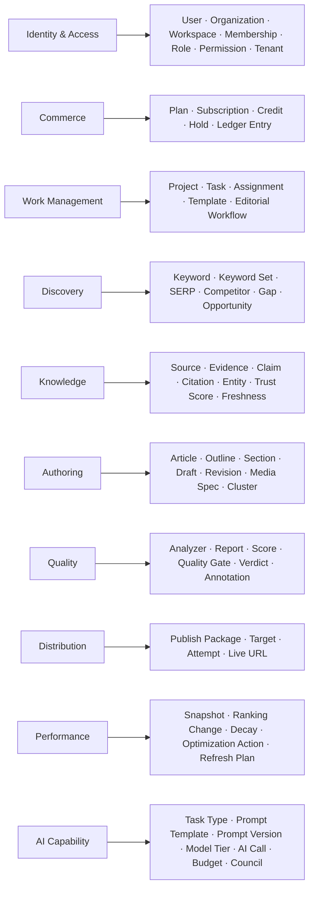

# Glossary

> **Status:** v2.0 — complete. New in v2; no baseline equivalent. The authoritative ubiquitous language for ContentOS AI.
> **Binding rule:** these definitions are normative. A document, type name, table name, API field, or UI label that uses a term differently is a defect. New terms are added here **before** they appear in code.

## Overview

A shared vocabulary is the cheapest defect-prevention mechanism available to a distributed team of humans and AI agents. Most integration bugs in systems of this shape are vocabulary bugs wearing a technical costume: one module's "score" is 0–100, another's is 0–10; one module's "source" is a URL, another's is a parsed document; one module's "tenant" is an organization, another's is a workspace.

This document fixes each term's meaning, its owning context (`04-context-map.md`), and — where the term is commonly abused — what it explicitly is **not**.

## Business Purpose

Terminology consistency is customer-visible. The same concept must carry the same name in the API, the UI, the invoice, the support conversation, and the documentation. A user who reads "credits" in billing, "tokens" in usage, and "units" in the API has been given three mental models for one thing.

## Technical Purpose

Give code generation an unambiguous target. When a specification says "the engine returns a `GateVerdict`", the type, its values, and its semantics must be discoverable in one place. This document is that place.

## Responsibilities

**This document MUST:** define every domain term, its owning context, and its constraints; list deprecated and banned terms with replacements; define naming conventions that follow from the vocabulary.

**This document MUST NOT:** define behavior (that is the owning context's document) or duplicate schema definitions (`03-database/tables.md`).

## Architecture — term ownership

## Data Flow — the terms, defined

### Tenancy and access (Identity & Access)

| Term | Definition | Not to be confused with |
|---|---|---|
| **User** | A person with credentials. Exists once globally; may belong to many organizations and workspaces | An account, a seat, a member |
| **Organization** | The top-level commercial and administrative boundary. Owns billing, SSO configuration, org-level roles, and one or more workspaces (ADR-017) | Workspace. An agency is one organization with many workspaces |
| **Workspace** | The isolation boundary for content work. Owns projects, brand voice, connectors, gate thresholds, and credentials. **`tenant_id` refers to a workspace** | Organization, project |
| **Tenant** | Synonym for workspace when discussing isolation. `tenant_id` is the RLS key on every table | Organization. "Tenant" never means organization in code |
| **Membership** | A user's role within an organization or a workspace | Role — membership is the assignment, role is the capability set |
| **Role** | A named permission set: `owner`, `admin`, `editor`, `viewer` at workspace level; `org_owner`, `org_admin`, `billing_owner` at organization level | Permission — a role is a bundle of permissions |
| **Permission** | An atomic capability, e.g. `article.publish`, `billing.manage` | Scope (an API token concept) |
| **Tenant context** | The `{ user_id, organization_id, tenant_id, roles[] }` object derived at the gateway and propagated to the database session variable RLS reads | Session — a session is authentication state, tenant context is authorization state |

### Commerce

| Term | Definition | Notes |
|---|---|---|
| **Plan** | A commercial tier defining limits, features, and included credits | |
| **Subscription** | An organization's active plan with billing period and status | Held at organization level, not workspace |
| **Credit** | The unit a customer spends on platform work. **One credit is a billing unit, never a token** | The mapping from credits to underlying token/provider cost is policy (OQ-10) |
| **Hold** | A pre-authorization placed before a run starts, bounding its worst-case spend | Released or converted to consumption at run end |
| **Ledger entry** | An append-only record of credit movement. Never updated or deleted; corrections are compensating entries | |
| **Token** | A model provider's unit of consumption. Internal accounting concept only — never shown as the customer-facing unit | Credit |

### Work management

| Term | Definition |
|---|---|
| **Project** | A grouping of content work within a workspace — typically a site, a client campaign, or a content pillar |
| **Task** | A unit of human work tracked in the editorial workflow |
| **Editorial workflow** | The human process — assignment, approval chains, statuses. **Distinct from the execution workflow** (Temporal) |
| **Template** | A reusable configuration for producing content of a given type (brief shape, outline conventions, gate thresholds) |

### Discovery

| Term | Definition | Constraint |
|---|---|---|
| **Keyword** | A search term with metrics (volume, difficulty, CPC, intent) for a locale | Always locale-qualified |
| **Keyword set** | The scored output of a keyword research run, with one primary and supporting terms | |
| **SERP** | A search engine results page dataset for a keyword at a point in time | Always timestamped; freshness is surfaced |
| **Competitor** | A domain or page ranking for a target keyword | Not a business competitor — a SERP competitor |
| **Gap** | A topic, question, or format present in competing content and absent from ours | |
| **Opportunity** | A ranked, actionable recommendation to create or improve content | Carries an Explainability Envelope |

### Knowledge

| Term | Definition | Constraint |
|---|---|---|
| **Source** | An external document retrieved from the web or a tenant upload, with its URL, retrieval time, and raw archive | A source is not evidence until parsed and stored |
| **Evidence** / **Evidence item** | A retained excerpt from a source with mandatory provenance: source ref, retrieved-at, offsets | The atomic unit of grounding |
| **Evidence Bank** | The tenant-scoped store of evidence items | Not a cache — it is durable memory |
| **Claim** | A factual assertion extracted from content that must resolve to evidence | |
| **Citation** | The resolved link between a claim in content and the evidence supporting it | A citation without resolvable evidence is invalid, not "weak" |
| **Entity** | A named thing (person, product, organization, concept) extracted and linked across sources | |
| **Trust score** | A computed measure of a source's reliability | An estimate; always labeled as such |
| **Freshness** | How current a source or dataset is, with an explicit as-of timestamp | Never inferred silently |
| **Grounding** | The property that generated content traces to evidence | Grounding is binary per claim: supported, or flagged |
| **RAG** | Retrieval-augmented generation: the default generation mode | Not a feature — the default |

### Authoring

| Term | Definition | Constraint |
|---|---|---|
| **Article** | The long-lived content aggregate. Owns outlines, drafts, revisions, reports, publish history, and refresh cycles across its whole life | Not a document row |
| **Outline** | The approved structure — H1, sections, planned tables, FAQs, CTA — each mapped to available evidence | Versioned; the contract between Planning and Writing |
| **Section** | A unit of the outline and of the draft, individually generated and individually grounded | |
| **Draft** | Generated content for a given article version | |
| **Revision** | An immutable snapshot of article content at a point in time | Every gate verdict references a specific revision |
| **Article version** | The identifier `(article_id, revision_number)` used across contexts | The unit Quality analyzes |
| **Intent** | Classified search intent: informational, commercial, transactional, navigational, local | |
| **Persona** | The synthesized reader profile driving angle and tone | |
| **Cluster** | A group of related topics forming a pillar-and-supporting-page structure | |
| **Media spec** | A declaration of a needed asset — type, purpose, alt text, placement | Owned by Authoring; the asset itself is owned by the Platform Layer (ADR-018) |
| **Brand voice** | The tenant's tone profile, held in Memory and enforced by Review | |

### Quality

| Term | Definition | Constraint |
|---|---|---|
| **Analyzer** | An independent check producing one report (evidence validation, readability, voice, duplication, fact verification) | Analyzers are parallel and independently cached |
| **Report** | An analyzer's structured output with findings and a score | |
| **Score** | A normalized measure under the **Unified Scoring Contract** (ADR-021, `14-scoring-contract.md`). **Integer 0–100, higher always better, with an orthogonal integer confidence 0–100 and a mandatory explanation** | No module may introduce a differently-scaled score, or produce a category it does not own |
| **Score category** | One of the twelve canonical categories, each with exactly one producing engine | Not a free-form label; the registry is closed |
| **`algorithmVersion`** | A producer's opaque version string, bumped on any change affecting score output | **Never parsed or compared by a consumer**; distinct from `contractVersion` |
| **Quality Gate** | The decision point applying workspace thresholds to aggregated reports | Hosted by the Review Engine |
| **Verdict** | The gate outcome: **`pass`** (advance), **`soft-warn`** (advance, logged), **`block`** (durable human wait) | Exactly three values, everywhere |
| **Annotation** | A located, human-readable finding attached to content for a reviewer | |
| **YMYL** | "Your Money or Your Life" content requiring stricter verification thresholds | |
| **Explainability Envelope** | The mandatory wrapper on every recommendation: `{ recommendation, reason, evidence[], expected_impact, confidence }` | A recommendation without one is a defect |

### Distribution and performance

| Term | Definition |
|---|---|
| **Publish package** | The assembled, target-agnostic payload: content, meta, schema, media references, taxonomy |
| **Target** | A configured destination (WordPress, Webflow, Shopify, Ghost, Notion, Medium, Dev.to) |
| **Attempt** | One publish action against one target, idempotent on `(article_version, target)` |
| **Live URL** | The canonical published address, the join key into Performance |
| **Snapshot** | A point-in-time performance measurement for a live URL |
| **Ranking change** | A detected position movement above a confidence threshold |
| **Decay** | Sustained decline in a live URL's performance |
| **Optimization action** | A specific, evidence-backed change proposed for existing content |
| **Refresh plan** | A scoped plan to re-research and update an existing article |

### AI capability

| Term | Definition | Constraint |
|---|---|---|
| **Task type** | The semantic name of an AI job (`intent.classify`, `outline.synthesize`, `section.draft`) that routing policy keys on | Engines state a task type; they never state a model |
| **Model tier** | Fast/Cheap, Mid, Premium/Reasoning, Alternative | Tiers map to models in `08-ai-platform/model-selection.md` |
| **Prompt template** | A versioned, named prompt artifact in the registry | Prompts are data, never inline strings |
| **Prompt version** | The immutable version identifier recorded on every response | Part of the semantic cache key |
| **Policy version** | The version of routing policy in effect for a call | Recorded for auditability |
| **AI call** | One dispatched model request with its usage, cost, latency, and cache status | |
| **Semantic cache** | Cache keyed on normalized prompt embedding + model + prompt version | Tenant-scoped, always |
| **Budget** | A hard per-request or per-period spend ceiling enforced by the Gateway | Exceeding it returns a typed error, never a silent downgrade |
| **AI Council** | A bounded multi-model deliberation with enforced model diversity, real conflict detection, and user disclosure (ADR-019) | Not the primary decomposition; not simulated |
| **Guardrail** | A pre- or post-dispatch safety control (PII redaction, injection framing, output validation) | |

### Execution and platform

| Term | Definition | Constraint |
|---|---|---|
| **Run** | One execution of the content pipeline for an article | The durable, resumable unit |
| **Workflow** | A Temporal durable execution. **Always means execution workflow**; the human process is "editorial workflow" | |
| **Activity** | One retryable step within a workflow, idempotent on `(workflow_id, step)` | |
| **Signal** | An external input to a running workflow (approve, revise, resubmit) | |
| **Job** | A BullMQ background task — fire-and-forget work outside the durable pipeline | Not a workflow |
| **Engine** | A bounded business capability in the Content Platform. AI is a component inside it | Never an "agent" |
| **Platform** | A horizontal layer of shared capability (AI, Knowledge, Event, Storage, Provider) | |
| **Provider** | An external vendor accessed through an adapter in the Provider Layer | |
| **Adapter** | The implementation translating a provider's API to a domain interface | |
| **Connector** | A tenant-configured integration instance with stored credentials (a WordPress site) | An adapter is code; a connector is tenant configuration |
| **Outbox** | The transactional table guaranteeing a database commit and its event are atomic | |

## Dependencies

This glossary depends on `04-context-map.md` for ownership assignment and is depended on by every other document. It is the only document with no upstream technical dependency.

## Interfaces

Naming conventions derived from the vocabulary, binding on code:

| Artifact | Convention | Example |
|---|---|---|
| Database tables | `snake_case`, plural, context-prefixed where ambiguous | `articles`, `evidence_items`, `credit_ledger_entries` |
| Columns | `snake_case`; identifiers end `_id`; timestamps end `_at` | `tenant_id`, `published_at` |
| TypeScript types | `PascalCase`, singular, matching the glossary term exactly | `EvidenceItem`, `GateVerdict` |
| Events | `PascalCase`, past tense, `<Aggregate><PastTenseVerb>` | `ArticlePublished`, `QualityGateBlocked` |
| Task types | `dot.case`, `<domain>.<action>` | `outline.synthesize` |
| API fields | `snake_case` in JSON | `article_version` |
| Prompt templates | `dot.case` with family prefix | `planning.outline` |

## Events

This document defines no events. It defines the naming rule all events follow, and the term each event name must use.

## Database Impact

Table and column names derive directly from these terms. Two prohibitions follow: no table named for a concept absent from this glossary, and no column reusing a glossary term with a different meaning (a `score` column must be 0–100 with confidence, or be named something else).

## Security

Three terms carry security weight and are defined here to prevent dangerous ambiguity: **tenant** always means workspace, so an isolation control written against "tenant" cannot accidentally be scoped to an organization; **connector** always implies stored credentials, so anything named a connector inherits encryption and audit requirements; **evidence** is always untrusted external content, so it is treated as data and never as instructions (`16-security/prompt-injection.md`).

## Performance

Vocabulary discipline reduces the most expensive class of production defect — the semantic mismatch that passes type checks. A `score` that means 0–10 in one analyzer and 0–100 in another produces a gate that silently passes bad content, and no compiler catches it.

## Caching

Cache key structure follows the vocabulary: `{tenant_id}:{context}:{entity}:{identifier}`. Terms in cache keys must be glossary terms, so a key is self-describing during an incident.

## Scalability

As the team and the agent fleet grow, the glossary is the coordination mechanism that scales without meetings. Adding a term is a small, reviewable change; discovering that two teams built different meanings of "revision" is not.

## Observability

Span attributes, metric labels, and log fields use glossary terms verbatim: `tenant_id`, `article_id`, `task_type`, `prompt_version`, `verdict`. A dashboard is only queryable if its dimensions are named consistently.

## Failure Recovery

During an incident, precise vocabulary is the difference between a five-minute and a fifty-minute diagnosis. "The run is stuck" is ambiguous; "the workflow is waiting on a signal at `AwaitOutlineApproval`" is actionable.

## Implementation Notes

### Deprecated and banned terms

| Banned | Use instead | Why |
|---|---|---|
| **Agent** | Engine, or AI Council session | ADR-001. "Agent" implies autonomous decomposition the architecture rejects |
| **Seat** (as a pipeline role) | Council participant | v1 term from the council implementation; ambiguous with billing seats |
| **Tenant** meaning organization | Organization | `tenant_id` is a workspace id, always |
| **Score** without a scale | A named score with 0–100 and confidence | Ambiguous scales silently break gates |
| **Source** meaning evidence | Evidence item | A source is a document; evidence is a cited excerpt from it |
| **Job** meaning pipeline run | Run, or workflow | Jobs are BullMQ tasks |
| **Prompt** meaning inline string | Prompt template + version | Prompts are registry artifacts |
| **AI writer** | Writing Engine | Product-level framing (`02-product-vision.md`) |
| **Cost** meaning credits | Cost (USD, internal) vs credits (customer-facing) | Never interchangeable |

### Adding a term

1. Confirm the concept is not an existing term under another name.
2. Identify its owning context (`04-context-map.md`).
3. Add it here with definition, owner, and constraints.
4. Only then use it in code, schema, API, or UI.

## Future Roadmap

The glossary grows with the platform; localization will eventually require a mapping from these canonical terms to user-facing labels per language, at which point this document becomes the key of that mapping rather than the display strings themselves.

## Cross References

- `04-context-map.md` — which context owns each term
- `02-domain-design/` — entities and invariants behind these terms
- `03-database/tables.md` — physical names derived here
- `06-api/README.md` — API field naming
- `07-development-guide/coding-standards.md` — enforcement in code review

## Open Questions

- Whether "credit" should be renamed for clarity once pricing is settled (OQ-10) — a customer-facing naming decision with commercial implications.
- Whether "workspace" or "brand" reads better for agency customers. Current position: keep "workspace"; a per-organization display alias is a UI concern, not a model change.
