# C4 — System Context

> **Status:** v2.0 — complete. C4 Level 1. Supersedes `ARCHITECTURE_BASELINE_ARCHIVE.md` §8.
> **Scope:** ContentOS as a black box among its users and external systems — who uses it, what it depends on, what crosses the boundary in each direction, and where trust ends.

## Overview

The context diagram answers three questions that constrain everything below it: **who acts on the system**, **what the system depends on that it does not control**, and **where the trust boundary sits**. The third is the most consequential here. ContentOS ingests arbitrary web content, sends data to model providers, and writes to customers' live websites — three boundaries where a mistake is externally visible and often irreversible.

At this level ContentOS is one box. Its internal decomposition is `07-c4-container.md`.

## Business Purpose

Every external system in this diagram is a cost, a dependency risk, and a negotiation. Naming them explicitly makes three business facts visible: which vendors can raise prices or rate limits and hurt margin; which integrations are table stakes for a segment (an agency without WordPress publishing will not buy); and which capabilities the platform must be able to survive losing.

## Technical Purpose

Fix the system boundary so that every later document can reason about what is inside (owned, testable, changeable) and what is outside (adapted, retried, circuit-broken, and never trusted). Everything outside the boundary is reached through the Provider Layer (`09-integrations/`) — no exceptions.

## Responsibilities

**This document MUST:** identify all human actor types and their goals; identify all external systems, the direction of data flow, and the purpose of each; define the trust boundary and what crosses it.

**This document MUST NOT:** describe internal containers (`07-c4-container.md`), specify provider APIs (`09-integrations/`), or define UI surfaces (`15-application-ui/`).

## Architecture

```mermaid
flowchart TB
    subgraph ACTORS["People"]
        CREATOR["Content creator / SEO specialist<br/>produces and optimizes content"]
        EDITOR["Editor / reviewer<br/>approves outlines, resolves blocked gates"]
        WSADMIN["Workspace admin<br/>brand voice, connectors, thresholds"]
        ORGADMIN["Organization admin<br/>workspaces, SSO, org roles"]
        BILLOWNER["Billing owner<br/>plan, credits, invoices"]
        PLATADMIN["Platform admin (internal)<br/>operations, support, incidents"]
    end

    COS["<b>ContentOS AI</b><br/>Content Intelligence Operating System"]

    subgraph EXT["External systems"]
        ORTR["OpenRouter<br/>model access"]
        DFS["DataForSEO<br/>keyword + SERP data"]
        FC["Firecrawl<br/>page fetch + parse"]
        EXA["Exa<br/>semantic discovery"]
        GSC["Google Search Console<br/>impressions, clicks, position"]
        GA["Google Analytics 4<br/>traffic, engagement, conversions"]
        CMS["CMS targets<br/>WordPress, Webflow, Shopify, Ghost, Notion, Medium, Dev.to"]
        STRIPE["Stripe<br/>subscriptions + payments"]
        BA["Better Auth + identity providers<br/>authentication, SSO"]
        MAIL["Email / messaging<br/>notifications"]
    end

    CREATOR --> COS
    EDITOR --> COS
    WSADMIN --> COS
    ORGADMIN --> COS
    BILLOWNER --> COS
    PLATADMIN --> COS

    COS -->|"task prompts + context"| ORTR
    ORTR -->|"completions + usage"| COS
    COS -->|"keyword + SERP queries"| DFS
    DFS -->|"metrics + results"| COS
    COS -->|"URLs to retrieve"| FC
    FC -->|"clean content"| COS
    COS -->|"semantic queries"| EXA
    EXA -->|"ranked sources"| COS
    GSC -->|"search performance"| COS
    GA -->|"traffic + conversions"| COS
    COS -->|"publish package"| CMS
    CMS -->|"live URL + status"| COS
    COS <-->|"checkout, webhooks"| STRIPE
    COS <-->|"auth assertions"| BA
    COS -->|"notifications"| MAIL
```

### Actors

| Actor | Goal | Primary surfaces | Authority |
|---|---|---|---|
| **Content creator / SEO specialist** | Produce ranking content quickly with control over decisions | Dashboard, brief form, editor, progress stream | Workspace `editor` |
| **Editor / reviewer** | Guarantee quality before publication | Outline approval, blocked-gate review package, annotations | Workspace `editor` or `admin` |
| **Workspace admin** | Configure how the workspace produces content | Settings: brand voice, gate thresholds, connectors, templates | Workspace `admin`/`owner` |
| **Organization admin** | Manage many workspaces and org-level policy | Organization console, SSO configuration, member management | `org_admin`/`org_owner` |
| **Billing owner** | Control spend and plan | Billing, credit balance, invoices, usage by workspace | `billing_owner` |
| **Platform admin (internal)** | Operate and support the platform | Internal admin, break-glass tooling, incident dashboards | `platform_admin`, audited |

The distinction between organization admin and workspace admin exists because of ADR-017: agencies need someone who governs across client workspaces without editing content inside them.

### External systems

| System | Direction | Purpose | If unavailable |
|---|---|---|---|
| **OpenRouter** | Out/in | All model access (Claude Sonnet, GPT-5, Gemini 2.5 Flash, Grok) | Router advances the fallback chain; if the provider is fully down, new runs are paused rather than failed, and in-flight runs wait on durable timers at zero cost |
| **DataForSEO** | Out/in | Keyword metrics, SERP results, backlink data | Cached data with visible staleness; runs continue with a recorded gap |
| **Firecrawl** | Out/in | Page fetch and parse into clean content for the Evidence Bank | Research proceeds with fewer sources; Planning refuses to outline unsupported sections |
| **Exa** | Out/in | Semantic/neural discovery of high-quality sources | Degrades source diversity; recorded as a gap |
| **Google Search Console** | In | Impressions, clicks, CTR, position, index status | Analytics shows gaps as nulls with freshness flags, never zeros |
| **Google Analytics 4** | In | Sessions, engagement, conversions for ROI | As above |
| **CMS targets** | Out/in | Publishing destinations and their responses | Publish attempt fails cleanly and is retryable; partial multi-target failure is isolated per target |
| **Stripe** | Bidirectional | Subscriptions, credit purchases, webhooks | Purchases blocked; existing entitlements continue from local state |
| **Better Auth + IdPs** | Bidirectional | Authentication, OAuth, enterprise SSO | New logins blocked; existing sessions remain valid until expiry |
| **Email / messaging** | Out | Notifications: approvals needed, gates blocked, runs complete | Queued and retried; in-app notifications unaffected |

## Data Flow

Three flows cross the boundary, each with different sensitivity:

1. **Outbound to model providers** — prompts containing tenant content and retrieved evidence. PII is redacted at the AI Gateway before dispatch; the customer's raw credentials never appear.
2. **Inbound from the open web** — arbitrary, untrusted content retrieved by Firecrawl and Exa. Treated as **data, never instructions**, at every downstream step.
3. **Outbound to customer properties** — publish packages written to live sites using tenant-owned credentials. This is the highest-consequence flow in the system: an error here is visible to the customer's audience.

## Dependencies

Every external system is reached through an adapter behind a stable interface (ADR-010, ADR-012): `ModelProvider`, `KeywordDataProvider`, `SerpProvider`, `WebSourceProvider`, `AnalyticsProvider`, `PublishTarget`, `PaymentProvider`, `IdentityProvider`, `NotificationChannel`. Replacing a vendor changes an adapter, never an engine.

## Interfaces

Inbound: the web application, the public REST API, the SSE progress stream, and webhooks (Stripe events, CMS callbacks). Outbound: provider APIs as listed. There is no other ingress — no direct database access, no vendor-specific back door, no unauthenticated endpoint except health checks.

## Events

External systems participate in the event flow at two points: Stripe webhooks are translated into `SubscriptionChanged` / `PaymentSucceeded` integration events at the boundary, and CMS callbacks (where supported) are translated into `PublishConfirmed`. Inbound webhooks are verified, deduplicated, and normalized before any internal event is emitted (`13-event-platform/event-registry.md`).

## Database Impact

Context-level facts that constrain schema: every external identity (Stripe customer, CMS site, GSC property, IdP subject) must be storable as a **tenant-scoped connector record with encrypted credentials**, and every inbound webhook needs a deduplication key. Both are modeled in `03-database/tables.md`.

## Security

The trust boundary is drawn at the Provider Layer, and three rules define it:

1. **Nothing outside the boundary is trusted.** Retrieved web content is data. Provider responses are validated before mapping. Webhooks are signature-verified.
2. **Credentials never leave their scope.** Tenant CMS credentials are encrypted at rest, decrypted only at publish time, never logged, and never returned by any API (a v1 blocker: `AUDIT.md` stored them in plaintext).
3. **No external input can cause a side effect.** Publishing, spending credits, and connector actions require authenticated user intent — never text found in a source.

Detail: `16-security/threat-model.md`.

## Performance

External calls dominate pipeline latency. Two context-level consequences: aggressive caching of external data (freshness-tagged TTLs) and parallel fan-out wherever a stage issues many independent provider calls. The platform's own compute is rarely the bottleneck (`14-operations/scaling-strategy.md` §3).

## Caching

External-data caching is keyed `(tenant, provider, query, locale)` with a per-dataset TTL reflecting how fast that data actually changes — SERP results age in hours, keyword volumes in weeks. Freshness is displayed rather than hidden, because a silently stale SERP produces confidently wrong strategy.

## Scalability

Provider rate limits, not internal capacity, are the first ceiling the platform hits. Each adapter owns a limiter, and per-tenant shares prevent one tenant from consuming the platform's entire external quota. Quota utilization per provider is dashboarded, because contract renegotiation is a scaling action.

## Observability

Every external call is a traced span with provider, endpoint, latency, status, and cost; circuit-breaker state is a gauge per provider. During an incident the first question — "is it us or them?" — is answered from one dashboard (`14-operations/monitoring.md` §13).

## Failure Recovery

External failure never fabricates. A degraded provider produces a recorded gap, a paused run, or a typed error — never invented data that looks like a result. Where a fallback exists it is documented in the owning engine; where none exists the run waits durably, which costs nothing and preserves the customer's paid work.

## Implementation Notes

For implementation, the context diagram defines the mock surface: every external system listed here has a recorded-cassette double for integration tests and a scenario in the vendor stub gateway for E2E (`10-testing/`). If a new external dependency is added, it must appear here, gain an adapter, gain a stub scenario, and gain an entry in the provider quota dashboard — in that order.

## Future Roadmap

Additional CMS targets (OQ-12), regional payment providers such as Razorpay (OQ-13), enterprise IdPs beyond the default identity provider, MCP connectors to customer knowledge sources, and — should OpenRouter degrade — a direct provider SDK fallback path (OQ-11). Each adds a box to this diagram and an adapter behind an existing interface; none changes the boundary.

## Cross References

- `07-c4-container.md` — the next level down
- `09-integrations/` — one document per external system
- `16-security/threat-model.md` — trust boundary analysis
- `04-platform/settings.md` — connector configuration and credential handling
- `05-content-platform/publishing-engine.md` — the highest-consequence outbound flow
- `14-operations/incident-response.md` — provider-outage playbooks P1 and P2

## Open Questions

- **OQ-11** — direct provider SDKs as a fallback if OpenRouter degrades; today OpenRouter is a single point of failure for all model access.
- **OQ-12** — CMS targets beyond the seven v1 adapters.
- **OQ-14** — whether GA4 alone is sufficient for conversion attribution, which bounds the ROI claims the product can make.
