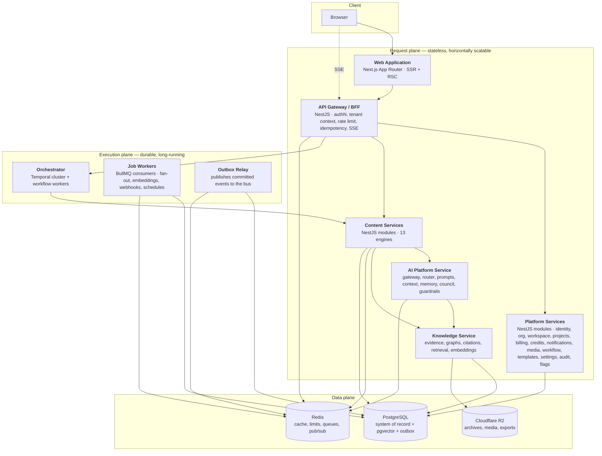
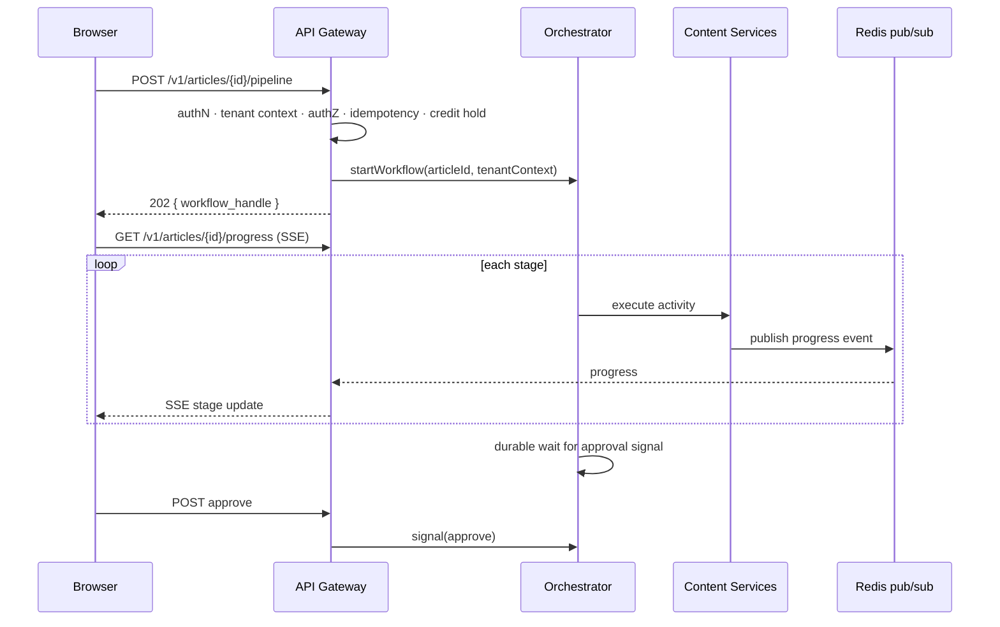

# C4 — Container Diagram

> **Status:** v2.0 — complete. C4 Level 2. Supersedes `ARCHITECTURE_BASELINE_ARCHIVE.md` §9.
> **Scope:** the deployable and runtime units inside the ContentOS boundary, what each owns, how they communicate, and what each scales on. Logical layers become running processes here.

## Overview

A container in C4 is a separately runnable thing: an application, a service, a worker fleet, a datastore. This document maps the nine logical layers (`03-high-level-architecture.md`) onto **eleven containers**, and states the v1 packaging decision explicitly — several layers share a process, because distributed boundaries cost latency and operational burden before there is scale to justify them (ADR-002).

The critical distinction at this level is between the **request plane** (fast, synchronous, stateless) and the **execution plane** (slow, durable, stateful). Conflating them is what killed the v1 system, where a pipeline run lived inside an HTTP connection and died with it.

## Business Purpose

Containers are the unit of cost and of scaling. Knowing that the worker fleet scales on queue depth while the API scales on latency is what lets the platform serve a 500-article agency batch without over-provisioning everything else. It is also what makes the modular monolith commercially correct at v1: one small cluster runs the whole product.

## Technical Purpose

Define runtime boundaries precisely enough that an implementer knows which process a module boots in, how processes talk, what state each holds, and which are safe to restart at any moment.

## Responsibilities

**This document MUST:** enumerate containers with technology, responsibility, state, communication protocol, and scaling signal; define the request/execution plane split; define the v1 packaging and the extraction path.

**This document MUST NOT:** decompose a container into components (`08-c4-component.md`), specify infrastructure topology or environments (`11-deployment-topology.md`), or specify scaling thresholds (`14-operations/scaling-strategy.md`).

## Architecture

### Container inventory

| # | Container | Technology | Owns | State | Scales on |
|---|---|---|---|---|---|
| 1 | **Web Application** | Next.js App Router, React, TypeScript | Rendering, interaction, progress display, client routing | None (session cookie only) | CPU, request latency |
| 2 | **API Gateway / BFF** | NestJS | The only public ingress: authN, tenant-context resolution, authorization entry, rate limiting, idempotency, error envelope, SSE fan-out | None (Redis-backed sessions and limits) | CPU, p95 latency, open SSE connections |
| 3 | **Platform Services** | NestJS modules | Identity, organizations, workspaces, projects, billing, credits, notifications, media, editorial workflow, templates, settings, audit, feature flags | None | CPU |
| 4 | **Content Services** | NestJS modules | The thirteen engines' synchronous surfaces and activity implementations | None | CPU; invoked by orchestrator |
| 5 | **AI Platform Service** | NestJS module | Every model interaction: routing, prompt resolution, context assembly, guardrails, council, cost metering | None (Redis semantic cache) | In-flight AI calls, bounded by provider quota |
| 6 | **Knowledge Service** | NestJS module | Evidence Bank, graphs, citation resolution, vector retrieval, embeddings orchestration | None | Retrieval QPS, embedding backlog |
| 7 | **Orchestrator** | Temporal cluster + workflow/activity workers | Durable pipeline execution, human-wait timers, signals, retries, resumption | **Durable workflow state** | Task-queue backlog |
| 8 | **Job Workers** | BullMQ consumers (Node) | SERP fan-out, page fetch, embedding generation, webhook delivery, cache warming, scheduled analytics pulls, rank tracking, backfills | None (Redis holds queue state) | Queue depth and job age |
| 9 | **Outbox Relay** | Node process | Reads committed outbox rows and publishes them to the bus exactly once per row | Cursor only | Outbox lag |
| 10 | **PostgreSQL** | Managed PostgreSQL + pgvector | System of record, vectors (v1), outbox, credit ledger, audit log | **Authoritative** | Connections → replicas → partitions |
| 11 | **Redis** | Managed Redis | Sessions, rate limits, semantic cache, entity cache, BullMQ queues, pub/sub for SSE | Semi-durable (AOF for queues) | Memory, evictions |
| — | **Cloudflare R2** | S3-compatible | Raw source archives, generated media, exports, uploads | **Authoritative** (versioned) | Inherent |

### Request plane vs execution plane

**Rule:** no request handler performs work that can exceed its timeout. Anything long returns `202` with a handle. This is not a guideline — the gateway has a hard request timeout, and a handler that needs more is a design error (`09-request-flow.md`).

## Data Flow

Containers exchange data three ways, and the choice is prescribed rather than free:

| Mechanism | When | Example |
|---|---|---|
| **In-process call through a contract interface** | Same deployable, synchronous answer needed | Content Service → AI Platform Service |
| **Durable activity invocation** | Work must survive crashes and retries | Orchestrator → Content Services |
| **Event via outbox → bus → consumer** | Producer needs no answer; consumers may be added later | `ArticlePublished` → Analytics, Notifications |

A queue job is used only for work that is genuinely fire-and-forget or schedulable; anything belonging to a pipeline run is a Temporal activity so that its state is part of the run.

## Dependencies

Containers depend downward only, exactly as the layers do. Two dependencies deserve emphasis because they are the platform's hot paths: every Content Service depends on the AI Platform Service (which is why it is the first extraction candidate), and every container depends on PostgreSQL for tenant context validation and persistence.

## Interfaces

| Interface | Between | Protocol | Notes |
|---|---|---|---|
| Public API | Browser/API clients → Gateway | HTTPS/JSON | Versioned `/v1/` (`06-api/`) |
| Progress stream | Gateway → Browser | SSE | Resumable with `Last-Event-ID`; Redis pub/sub fans out across gateway instances |
| Contract calls | Service → Service | In-process TypeScript interfaces | Become gRPC/HTTP on extraction, unchanged in shape |
| Workflow control | Gateway → Orchestrator | Temporal client | Start, signal, query, cancel |
| Activities | Orchestrator → Content Services | Temporal task queues | Idempotent on `(workflow_id, step)` |
| Jobs | Producers → Workers | BullMQ over Redis | At-least-once, idempotent consumers |
| Events | Outbox Relay → consumers | Bus (Redis Streams v1) | `13-event-platform/` |

**SSE across instances:** progress events reach the browser through Redis pub/sub because the gateway is horizontally scaled and the workflow has no idea which instance holds the client's connection. This is why Redis is in the request path and why a Redis outage degrades progress display but not run correctness.

## Events

Two containers are event infrastructure rather than event participants: the **Outbox Relay** guarantees that an event exists if and only if its database transaction committed, and the **Job Workers** host most consumers. No producer publishes directly to the bus — publishing means writing an outbox row inside the same transaction as the state change (`10-event-flow.md`).

## Database Impact

PostgreSQL is shared by all services, which is a deliberate v1 trade (ADR-002, ADR-005): shared schema, enforced context ownership. Three container-level obligations follow: connections are pooled through PgBouncer once worker fleets grow (workers exhaust connections far earlier than CPU); read-heavy containers use replicas explicitly; and the Orchestrator's Temporal persistence is a **separate database** from application data, so a pipeline's execution state and its business data can be scaled and restored independently.

## Security

Container-level controls: only the Gateway is publicly routable — every other container is reachable only within the private network; service-to-service calls carry short-lived internal tokens; the Job Workers and Orchestrator run with the same RLS-enforced database role as request-path services, so background work cannot bypass tenant isolation (a common and severe mistake); and no container holds a superuser database credential except the migration job, which cannot read tenant content (`14-operations/deployment.md` §11).

## Performance

| Container | Budget |
|---|---|
| Web Application | TTFB p95 < 400 ms for authenticated dashboard routes |
| API Gateway | Overhead p95 < 25 ms above downstream time |
| Platform/Content synchronous reads | p95 < 300 ms end to end |
| AI Platform Service | Adds < 50 ms above provider latency, excluding context assembly |
| Orchestrator | Activity dispatch latency p95 < 200 ms |
| Outbox Relay | Event lag p95 < 2 s from commit to publish |

## Caching

Redis serves four container-visible roles — session store, rate-limit buckets, entity and semantic caches, and queue backing — and one architectural warning follows: cache and queue workloads contend, so they are split onto separate Redis instances at the first sign of eviction pressure (`14-operations/scaling-strategy.md` §4).

## Scalability

Each container scales on its own signal (table above), and three are stateless-and-cheap to scale (Web, Gateway, Platform). The two that require care: **Job Workers** must scale in slowly, because terminating a worker mid-activity risks the double-effect interleavings idempotency exists to prevent; and **Orchestrator workers** scale per task queue, so a heavy tenant's batch can be isolated onto its own queue.

**v1 packaging:** containers 2–6 deploy as a small number of NestJS processes sharing a codebase, with boundaries enforced by lint rather than by network. Extraction order at S3 is AI Platform Service → Knowledge Service → Review/Research engines, chosen because they are the hottest and have the fewest inbound synchronous dependencies.

## Observability

Every container emits OpenTelemetry traces, metrics, and structured logs through `packages/observability`, with mandatory attributes (`tenant_id`, `correlation_id`, `workflow_id`). Container-specific signals that matter most: gateway open-SSE-connection count, orchestrator task-queue backlog, worker queue age, outbox lag, and AI in-flight call count. Health endpoints are uniform: `/health/live`, `/health/ready`, `/health/deep`.

## Failure Recovery

| Container fails | Effect | Recovery |
|---|---|---|
| Web Application | UI unavailable; runs continue | Restart; runs unaffected |
| API Gateway | No new requests; in-flight runs continue | Restart; SSE clients reconnect and resume |
| Platform/Content service | Activities fail and are retried by Temporal | Restart; workflow resumes from last durable step |
| AI Platform Service | AI calls fail typed; Router fallback or run pause | Restart; no data loss |
| Orchestrator worker | Activity reassigned after heartbeat timeout | Restart; workflow state is durable |
| Job Worker | Jobs remain queued | Restart; at-least-once redelivery, idempotent consumers |
| Outbox Relay | Events lag; **no events lost** — rows persist | Restart; relay resumes from cursor |
| Redis | Cache misses, progress streaming degraded, queues paused | Restart; queues restored from AOF, cache cold-starts |
| PostgreSQL | Writes fail platform-wide | Managed failover; then verify migration version and orphaned workflows |

The Outbox Relay row is the point of the design: an event can be late, but it cannot be lost or emitted for a transaction that rolled back.

## Implementation Notes

- Boot order matters in local development: PostgreSQL and Redis, then migrations, then Temporal, then services, then workers. The dev harness enforces it.
- A module belongs to the container that owns its layer; if a module needs code from another container's layer, it needs that layer's contract, not its source.
- Workers and the orchestrator import the **same** engine modules the request plane imports. There is no separate "background" implementation of an engine — that duplication is how behavior drifts between foreground and background paths.

## Future Roadmap

Extraction of the AI Platform and Knowledge services into independently deployed services; a dedicated embedding worker fleet with its own scaling profile; per-tenant Temporal task queues for enterprise isolation; and a read-model projector container once analytics list views outgrow replica reads.

## Cross References

- `03-high-level-architecture.md` — the layers these containers realize
- `08-c4-component.md` — inside the AI Platform, an engine, and the Knowledge Service
- `09-request-flow.md` · `10-event-flow.md` — the two planes in detail
- `11-deployment-topology.md` — where these containers run
- `12-storage-platform/` — the data-plane containers in depth
- `07-development-guide/folder-structure.md` — which package maps to which container

## Open Questions

- Whether the Outbox Relay remains a separate process or is embedded in the Job Worker fleet at v1 scale (current position: separate, because its failure mode and lag SLO differ).
- Whether Temporal is self-hosted or managed at launch — affects the deployment topology but not this container model.
