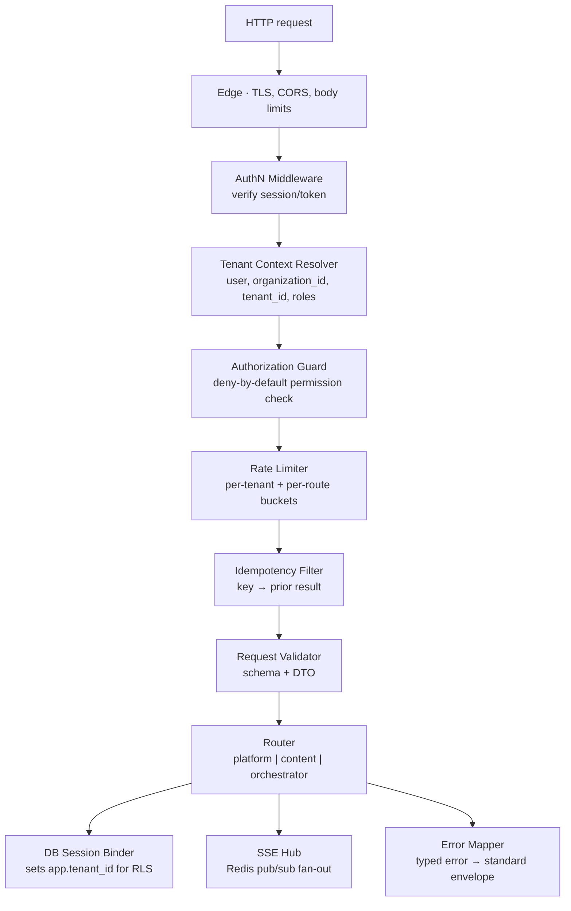
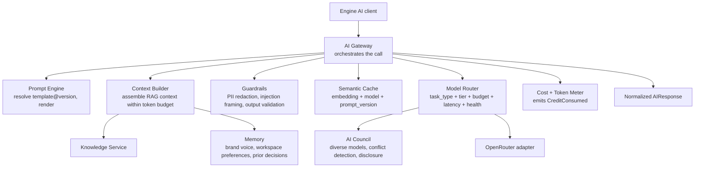
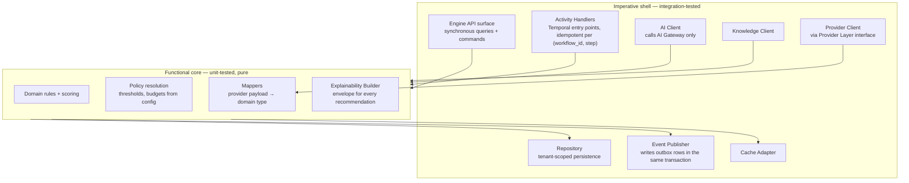
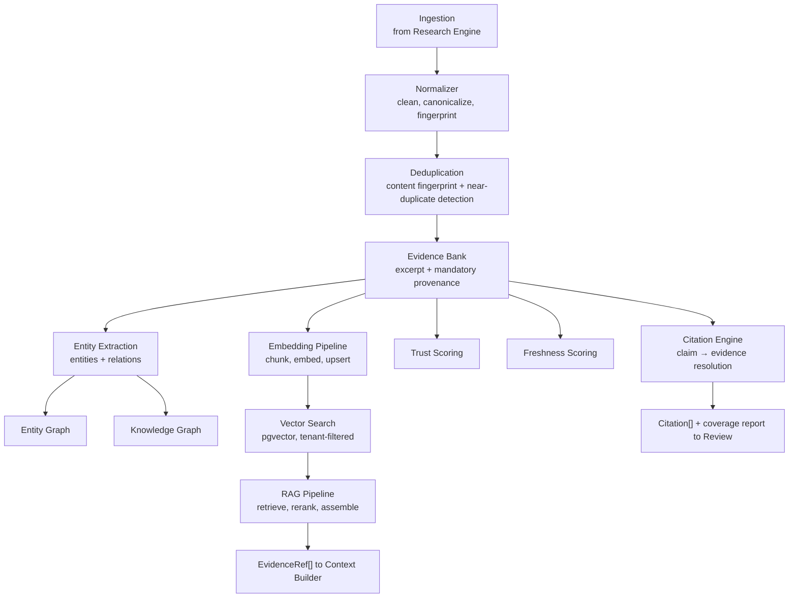
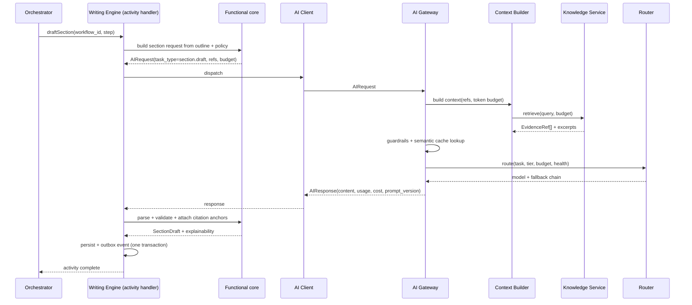

# C4 — Component Diagrams

> **Status:** v2.0 — complete. C4 Level 3. New depth; the baseline stopped at container level.
> **Scope:** the internal component decomposition of the four containers whose structure is load-bearing — the API Gateway, the AI Platform Service, a representative Content Engine, and the Knowledge Service — plus the **common engine anatomy** every engine inherits.

## Overview

Level 3 is where reusable structure appears. Four decompositions are documented here because they are the ones every implementer will touch: the **Gateway** (every request passes through it), the **AI Platform** (every generation passes through it), the **common engine anatomy** (thirteen engines instantiate it), and the **Knowledge Service** (grounding depends on it).

The other containers are deliberately not decomposed here. Platform Services decompose into thirteen conventional CRUD-plus-rules modules specified in `04-platform/`; the Job Workers are consumers whose structure follows the queues they serve (`13-event-platform/workers.md`).

## Business Purpose

The common engine anatomy is the highest-leverage artifact in this document. Thirteen engines built to one internal shape means a reviewer, a new engineer, or a coding agent learns the pattern once. It also means the cost of adding engine fourteen is bounded and predictable — the difference between a platform and a collection of features.

## Technical Purpose

Fix the internal seams that make engines testable: a pure decision core, adapters at the edge, AI access only through a client to the Gateway, and knowledge access only through a retrieval interface. These seams are what the test pyramid depends on (`10-testing/unit-testing.md` §3).

## Responsibilities

**This document MUST:** define components, their responsibilities, and their interfaces for the four decomposed containers; define the common engine anatomy as a binding pattern.

**This document MUST NOT:** specify individual engine behavior (`05-content-platform/`), specify AI Platform component internals in depth (`08-ai-platform/`), or specify Knowledge subsystem algorithms (`11-knowledge-platform/`). This document says what the parts are and how they connect; those folders say how each part works.

## Architecture

### 1 · API Gateway components

| Component | Responsibility | Failure behavior |
|---|---|---|
| AuthN Middleware | Verify session or bearer token; load identity | `401`, no detail leaked |
| Tenant Context Resolver | Derive `{ user_id, organization_id, tenant_id, roles[] }`; reject if the user has no membership in the requested workspace | `403`, or `404` where existence must not be confirmed |
| Authorization Guard | Deny-by-default permission check per route (`16-security/rbac.md`) | `403` |
| Rate Limiter | Per-tenant and per-route token buckets in Redis | `429` with `Retry-After` |
| Idempotency Filter | Replay prior result for a repeated `Idempotency-Key` | Returns original response; never double-executes |
| DB Session Binder | Set the PostgreSQL session variable RLS reads, per request/transaction | Unset context yields zero rows by design |
| SSE Hub | Subscribe a client to a run's progress channel; support `Last-Event-ID` resume | Reconnect resumes; missed events replayed from buffer |
| Error Mapper | Convert typed domain errors to the standard envelope | Never leaks stack traces or provider strings |

The ordering is deliberate: authenticate before resolving tenancy, resolve tenancy before authorizing, authorize before consuming rate-limit budget, and bind the database session only after tenancy is proven.

### 2 · AI Platform Service components

| Component | Interface | Notes |
|---|---|---|
| AI Gateway | `dispatch(AIRequest) → AIResponse` | The single egress; every other component is invoked by it |
| Prompt Engine | `getTemplate(id, version?)`, `render(template, vars)` | Prompts are versioned data (`08-ai-platform/prompt-engine.md`) |
| Context Builder | `build(refs, tokenBudget) → Context` | Wraps retrieved content as data, never instructions |
| Memory | `load(tenant, scope) → MemoryFragment[]` | Brand voice and durable preferences |
| Guardrails | `pre(request)`, `post(response)` | Blocking; a guardrail failure is a typed error, not a warning |
| Semantic Cache | `lookup(key)`, `store(key, response)` | Tenant-scoped; invalidated by `prompt_version` change |
| Model Router | `route(task, tier, budget, latency, health) → model + fallback chain` | Policy, versioned, no hardcoded models |
| AI Council | `deliberate(question, participants) → CouncilResult` | Enforced model diversity; real conflict detection (ADR-019) |
| Cost + Token Meter | `record(call)` | Writes cost events; emits `CreditConsumed` |

Only the Router touches the OpenRouter adapter. An engine that imports the adapter, or a component that calls it around the Gateway, is an architectural defect caught by import lint.

### 3 · Common engine anatomy (binding pattern)

Every one of the thirteen engines has this internal shape. Names differ; structure does not.

**Rules that bind every engine:**

1. The functional core receives and returns plain data. No connections, clients, or framework objects cross into it.
2. Activity handlers are idempotent on `(workflow_id, step)`; retries produce one effect.
3. Every recommendation leaves the engine wrapped in an Explainability Envelope.
4. Thresholds, budgets, and routing hints come from `packages/config` (workspace policy), never from constants in engine code.
5. Persistence and event publication share one transaction, via the outbox.
6. Degraded inputs produce a recorded gap or a typed refusal — never fabricated output.

### 4 · Knowledge Service components

| Component | Interface | Guarantee |
|---|---|---|
| Normalizer + Deduplication | `ingest(source) → EvidenceItem[]` | No duplicate evidence; every item carries URL, `retrieved_at`, offsets |
| Evidence Bank | `store`, `get`, `listByRun` | Provenance is mandatory — an item without it is rejected at write time |
| Embedding Pipeline | `index(evidenceIds)` | Tenant-namespaced vectors |
| Entity / Knowledge Graph | `extract`, `link`, `neighbors` | Entities are linked, not merely extracted |
| Trust / Freshness Scoring | `score(source) → { trust, freshness, asOf }` | Always labeled estimates with an as-of timestamp |
| Vector Search | `search(query, k, filters)` | **Tenant filter is not optional** — asserted by a cross-tenant retrieval test |
| RAG Pipeline | `retrieve(query, budget) → Context` | Returns refs and excerpts, never raw model instructions |
| Citation Engine | `resolve(claims) → Citation[] + coverage` | A citation that does not resolve is invalid, never "weak" |

## Data Flow

A single drafting step, traced through components, shows how the four decompositions interlock:

## Dependencies

Component dependencies never cross container boundaries except through the interfaces named above. The Context Builder's dependency on the Knowledge Service is the one cross-container synchronous call in the AI path, and it is deliberate: context assembly without retrieval would defeat grounding.

## Interfaces

Every interface in this document lives in `packages/contracts`, is implemented once for production and once as an in-memory fake for tests, and both implementations are verified against a shared contract test suite (`10-testing/unit-testing.md` §3.2).

## Events

Components publish events only through the Event Publisher in the engine shell, which writes an outbox row inside the state-changing transaction. No component publishes directly to a bus; no component publishes from the functional core, because a pure function that emits a side effect is neither pure nor testable.

## Database Impact

Only repository components touch the database, and every query is tenant-scoped in addition to RLS enforcement. Query builders are unit-testable (assert the `tenant_id` predicate exists) but that assertion is defense in depth — the database, not the query, is the isolation guarantee (`10-testing/integration-testing.md` §8).

## Security

Component-level security responsibilities are explicit and non-delegable: the Tenant Context Resolver is the only component permitted to derive tenancy; Guardrails is the only component permitted to decide that content is safe to dispatch; the Citation Engine is the only component permitted to declare a claim supported. Concentrating each of these in one component is what makes them auditable — and each maps to a v1 defect where the responsibility was diffuse (`AUDIT.md`).

## Performance

Component-level budgets within the AI path: Context Builder assembly p95 < 300 ms; semantic cache lookup p95 < 20 ms; Router decision p95 < 5 ms (pure policy evaluation, no I/O); guardrail pre-checks p95 < 30 ms. The dominant term is always the provider call, which is why cache hit ratio matters more than any micro-optimization.

## Caching

Two component-owned caches: the **semantic cache** in the AI Gateway (embedding + model + `prompt_version`) and the **retrieval cache** in the RAG pipeline (query embedding hash). Engines additionally cache expensive deterministic results by content hash — analyzer reports, cluster generation — so a resubmit re-runs only what changed.

## Scalability

The common anatomy is what makes engines horizontally scalable: activity handlers are stateless and idempotent, so adding workers adds throughput linearly until an external limit binds. The AI Gateway is the platform's hottest component and is stateless by design; its ceiling is provider quota, not its own capacity.

## Observability

Each component emits a span, giving a per-component latency breakdown inside a single stage — the difference between "drafting is slow" and "context assembly is slow because retrieval is returning 60 chunks." Mandatory attributes are inherited from the request context; AI spans add `task_type`, `model`, `prompt_version`, and `cache_hit`.

## Failure Recovery

| Component fails | Behavior |
|---|---|
| Guardrails | Request blocked with a typed error — fail closed, never dispatch unchecked |
| Semantic Cache | Miss path taken; latency and cost rise, correctness unaffected |
| Context Builder / Knowledge retrieval | Engine receives thin context and must refuse or request more research; never drafts ungrounded |
| Model Router / provider | Fallback chain advances; exhausted chain returns `ProviderUnavailable` |
| Citation Engine | Review cannot pass a gate without citation coverage — gate blocks rather than passes |
| Repository | Activity fails; Temporal retries; no partial state because writes are transactional |

The pattern is uniform: **fail closed on anything that protects grounding or safety, fail open only on performance optimizations.**

## Implementation Notes

When implementing a new engine, generate the shell from the common anatomy first — API surface, activity handlers, repository, AI client, knowledge client, event publisher — then write the functional core. Reversing that order tends to produce logic entangled with I/O, which is the single most common cause of untestable engines.

## Future Roadmap

A generated engine scaffold in `tooling/`; a shared analyzer component framework (Review's analyzers and Evaluation's checkers already share code); pluggable retrieval strategies in the RAG pipeline; and a formal component registry so the AI Council can enumerate available participants dynamically.

## Cross References

- `07-c4-container.md` — the containers these components live in
- `08-ai-platform/` — deep specification of every AI component
- `11-knowledge-platform/` — deep specification of every knowledge component
- `05-content-platform/` — engines instantiating the common anatomy
- `10-testing/unit-testing.md` — the core/shell split as a testing contract
- `06-api/README.md` — the gateway pipeline as an API contract

## Open Questions

- Whether the Explainability Builder should be a shared package component rather than per-engine code (leaning shared, pending the first three engine implementations).
- Whether Memory belongs to the AI Platform or the Knowledge Platform. Current position: AI Platform, because it shapes generation rather than grounding — recorded in `99-open-questions.md`.
