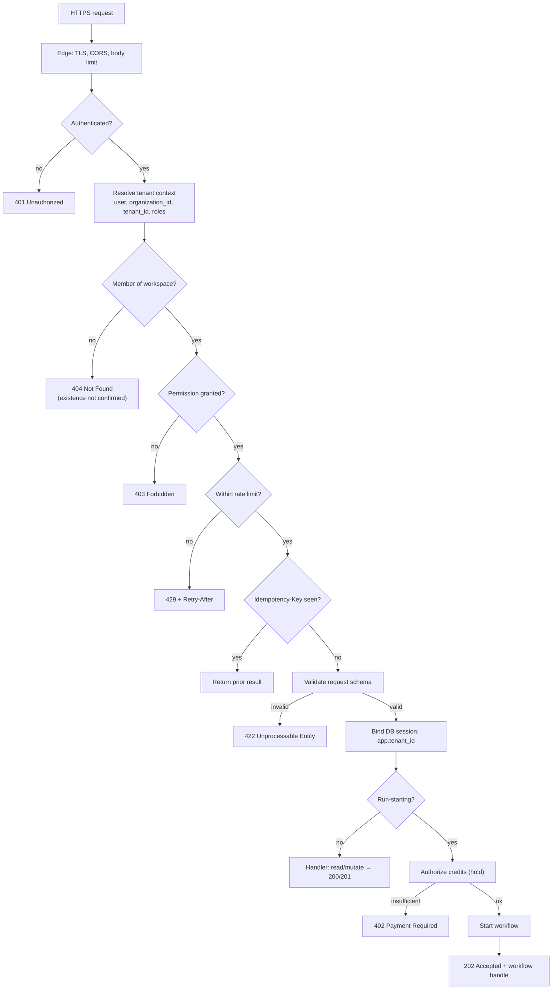
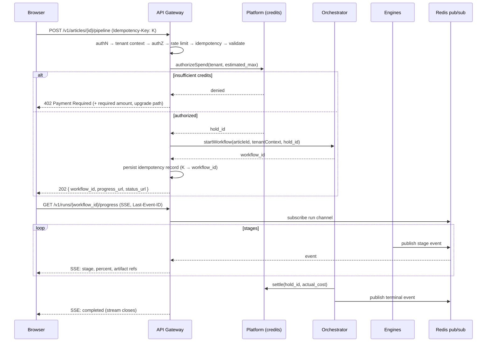

# Request Flow

> **Status:** v2.0 — complete. Supersedes `ARCHITECTURE_BASELINE_ARCHIVE.md` §17 and §20.
> **Scope:** the synchronous request path — authentication, tenant resolution, authorization, idempotency, credit authorization, workflow start, progress streaming, and every error path. This document defines behavior every endpoint in `06-api/` inherits.

## Overview

Two request shapes exist, and every endpoint is one of them:

- **Interactive requests** read or mutate state and return within milliseconds.
- **Run-starting requests** initiate long work, return `202 Accepted` with a handle, and stream progress.

There is no third shape. A request that "usually finishes in a few seconds" is a run-starting request that has not admitted it yet — that ambiguity is exactly how the v1 system ended up with pipeline runs living inside HTTP connections, dying on every deploy and proxy timeout.

## Business Purpose

The request path is where three commercial guarantees are enforced: a customer only sees their own data (isolation), a customer is only charged for work actually performed (credit integrity), and a retry never costs twice (idempotency). Each of these is a refund conversation or a churn event when it fails, so each is enforced structurally at the gateway rather than per endpoint.

## Technical Purpose

Define one pipeline that every request traverses, in a fixed order, so that no endpoint can accidentally skip a control. Endpoint authors write handlers; they do not write authentication, tenancy, limiting, or idempotency.

## Responsibilities

**This document MUST:** define the request pipeline and its ordering; define tenant-context derivation; define the `202` + handle + SSE pattern; define credit authorization; define every standard error path.

**This document MUST NOT:** define endpoint payloads (`06-api/`), define RBAC rules (`16-security/rbac.md`), or define event semantics (`10-event-flow.md`).

## Architecture

### The request pipeline



**Ordering is normative.** Authenticate before resolving tenancy; resolve tenancy before authorizing; authorize before spending rate-limit budget; check idempotency before doing work; bind the database session only after tenancy is proven; take a credit hold only after validation succeeds, so a malformed request never costs a customer anything.

### Tenant context

```ts
interface TenantContext {
  userId: string;
  organizationId: string;     // ADR-017 — billing, SSO, org roles resolve here
  tenantId: string;           // the workspace; the RLS key on every table
  roles: string[];            // effective roles: org-level ∪ workspace-level
  sessionId: string;
  correlationId: string;      // propagated to every span, log, and event
}
```

Derivation: the session or bearer token yields `userId`; the requested resource or an explicit workspace header yields the candidate `tenantId`; membership lookup yields `organizationId` and effective roles. A user with no membership in the requested workspace receives `404`, not `403` — a `403` confirms the workspace exists, which is a cross-tenant information leak.

The resolved `tenantId` is written to the PostgreSQL session variable that RLS policies read, inside the same transaction as the query. **An unset tenant context returns zero rows** — never all rows — and there is an integration test asserting exactly that (`10-testing/integration-testing.md` §8).

## Data Flow

### Run-starting request, end to end



### Credit authorization

Three steps, deliberately separated so no failure mode charges for work not done:

| Step | When | Effect |
|---|---|---|
| **Authorize (hold)** | Before the workflow starts | Reserves the estimated maximum; bounds worst-case spend |
| **Consume** | As each AI call completes | `CreditConsumed` events accumulate against the hold |
| **Settle** | At terminal workflow state | Releases the unused remainder; converts consumption to ledger entries |

If a run fails before producing value, the hold is released in full. If it fails midway, only actual consumption is charged, and the failure reason is recorded on the ledger entries so support can reason about a refund without guessing.

### Progress streaming

SSE is the primary transport (WebSockets are not required — progress is server-to-client only). The contract:

- Each event carries a monotonic `id`, an event name (`stage.started`, `stage.completed`, `approval.required`, `gate.blocked`, `run.completed`, `run.failed`), and a JSON payload.
- Clients reconnect with `Last-Event-ID`; the gateway replays buffered events from Redis so a dropped connection never loses a stage transition. **This is the single most common real-world failure for streamed long jobs** — proxy idle timeouts — and it is tested explicitly (`10-testing/e2e-testing.md` §9).
- Streams are tenant-scoped: subscribing to another tenant's run returns `404`.
- A heartbeat comment every 20 seconds keeps intermediaries from closing an idle connection.

## Dependencies

Redis (sessions, rate-limit buckets, idempotency records, SSE pub/sub and replay buffer), PostgreSQL (identity, membership, credit ledger, idempotency durability), Temporal (workflow start, signal, query), and the Platform Layer's credit service. A Redis outage degrades progress streaming and rate limiting; the status endpoint remains available because run state is durable in Temporal and PostgreSQL.

## Interfaces

| Concern | Contract |
|---|---|
| Auth header | `Authorization: Bearer <token>` or session cookie for the web app |
| Workspace selection | Implicit from the resource, or explicit `X-Workspace-Id` for collection endpoints |
| Idempotency | `Idempotency-Key` header, required on all non-GET run-starting endpoints |
| Correlation | `X-Correlation-Id` accepted and echoed; generated when absent |
| Long-running result | `202` + `{ workflow_id, progress_url, status_url }` |
| Error envelope | `{ error: { code, message, details?, correlation_id } }` — one shape for every failure |

## Events

The request path emits `RunStarted`, `RunApproved`, and `RunCancelled` as application events, and the credit path emits `CreditHeld`, `CreditConsumed`, and `CreditSettled`. Progress events are **transient** — published to Redis pub/sub for streaming, not persisted as domain events — because run state is already durable in Temporal and duplicating it in the event log would create two sources of truth.

## Database Impact

Per request: one membership/permission read (cached), one session-variable bind, the handler's own queries, and — for run-starting requests — one idempotency row and one credit hold row, written in the same transaction as the workflow start record. Idempotency records carry a TTL (24 hours) and a unique constraint on `(tenant_id, endpoint, idempotency_key)`; the unique constraint, not application logic, is what makes concurrent duplicate submissions safe.

## Security

- **Deny by default.** A route without an explicit permission declaration fails closed at startup, not at request time.
- **`404` over `403`** for cross-tenant resource access, so existence is never confirmed.
- **Rate limits** are per tenant and per route, with stricter buckets on auth and run-starting endpoints.
- **Idempotency keys are tenant-scoped**, so one tenant cannot probe another's key space.
- **Service-to-service** calls use short-lived internal tokens; no service trusts an unauthenticated caller.
- **Sessions** live in Redis; revocation is immediate; tokens rotate on refresh.

Full specification: `16-security/authentication.md`, `16-security/authorization.md`.

## Performance

| Stage | Budget (p95) |
|---|---|
| AuthN + tenant context (cached membership) | < 15 ms |
| Authorization check | < 5 ms |
| Rate limit + idempotency lookup | < 10 ms |
| Handler (interactive read) | < 250 ms |
| Total interactive request | **< 300 ms** |
| Run-starting request through `202` | < 500 ms |

Membership and permission lookups are cached per `(user, workspace)` with short TTL and event-driven invalidation on `MembershipChanged`; without that cache, every request would pay two joins before doing any work.

## Caching

The gateway caches idempotently-safe `GET` responses at the HTTP layer keyed on route + params + `tenant_id` (never without tenant, which would be a cross-tenant cache poisoning vector), and caches tenant context per session. Run status is deliberately **not** cached — a user watching a run needs the truth, and the read is cheap.

## Scalability

The gateway is stateless and scales on CPU and open SSE connections. SSE connections are long-lived and are the resource that saturates first: each consumes a socket and a Redis subscription, so connection count is an explicit scaling signal, and streams are closed on run completion rather than left open (`14-operations/scaling-strategy.md` §4).

## Observability

Every request produces one root span carrying `tenant_id`, `organization_id`, `user_id`, `correlation_id`, route, and status; run-starting requests link that span to the workflow, so a support question about a run resolves to the request that started it. Logged per request: method, route, status, duration, tenant, correlation id — never bodies, tokens, or credentials.

## Failure Recovery

| Failure | Behavior |
|---|---|
| Workflow start fails after credit hold | Hold released in the same transaction path; the request returns `503` with a retryable code |
| Client disconnects mid-SSE | Run continues; client resumes with `Last-Event-ID` |
| Redis unavailable | Streaming degrades to polling `status_url`; rate limiting fails closed to a conservative default rather than open |
| Duplicate submission | Idempotency returns the original handle; exactly one workflow, exactly one hold |
| Gateway instance dies mid-stream | Client reconnects to another instance and resumes from Redis-buffered events |

## Implementation Notes

- Implement the pipeline as ordered NestJS middleware/guards/interceptors so ordering is structural, not per-controller convention.
- The credit hold must be released on **every** early-return path after it is taken; implement it as a scoped resource with automatic release rather than as manual cleanup in each branch.
- Never start a Temporal workflow before persisting the idempotency record in the same transaction — the reverse order can produce a duplicate run under concurrent retries.
- Handlers receive `TenantContext` as an injected request-scoped object; a handler that reads tenancy from raw headers is a defect.

## Future Roadmap

Cursor-based pagination standardization across collection endpoints; partial-response field selection for heavy resources; WebSocket upgrade for bidirectional editor collaboration if OQ-5 resolves toward real-time editing; and per-tenant burst allowances tied to plan tier.

## Cross References

- `06-api/README.md` — the conventions this flow implements
- `07-c4-container.md` · `08-c4-component.md` — the gateway's components
- `10-event-flow.md` — what happens after the `202`
- `04-platform/credits.md` — hold, consume, settle in detail
- `16-security/authentication.md` · `16-security/authorization.md`
- `15-application-ui/` — how progress is presented
- `10-testing/e2e-testing.md` — journeys asserting this flow

## Open Questions

- Whether run-starting endpoints should accept a client-supplied budget ceiling per run (currently workspace policy only).
- Whether SSE replay buffers should be per-run or per-tenant, which affects Redis memory at high concurrency.
- **OQ-10** — credit pricing determines the estimate used for holds; today the estimate is a policy constant per article type.
