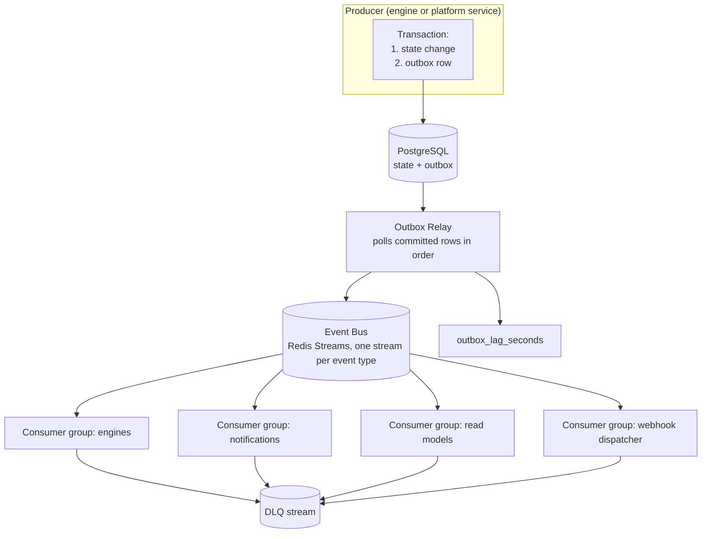
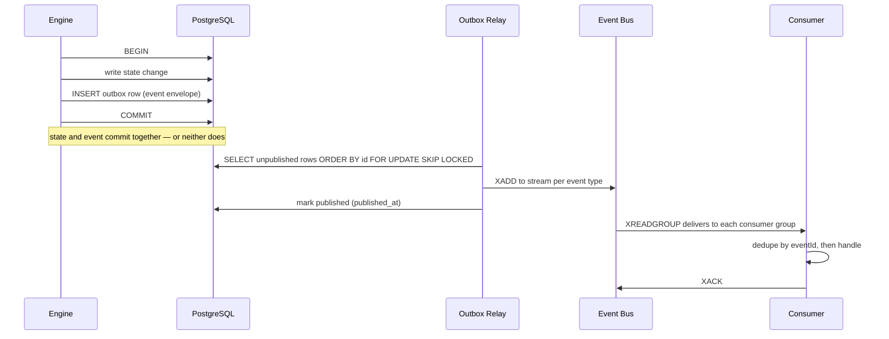
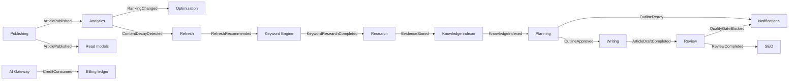

# Event Flow

> **Status:** v2.0 — complete. Supersedes `ARCHITECTURE_BASELINE_ARCHIVE.md` §18–§19. Introduces **ADR-020 (Transactional Outbox + Redis Streams bus)**, proposed here and recorded in `13-adr-log.md`.
> **Scope:** the asynchronous plane — event taxonomy, the outbox mechanism, bus topology, delivery semantics, ordering, idempotent consumption, retries, and dead-lettering. The full event catalog lives in `13-event-platform/event-registry.md`; this document defines the rules that catalog obeys.

## Overview

The baseline asserted at-least-once delivery, per-aggregate ordering, and dead-letter queues — without naming a bus or explaining how a database commit and its event stay consistent. That gap is the most dangerous kind: **the dual-write problem**. If a service writes to PostgreSQL and then publishes to a bus, a crash between the two produces either a state change nobody hears about or an event describing a transaction that rolled back. Both corrupt downstream state silently.

v2 closes it with a **transactional outbox**: an event is written to an outbox table *inside the same transaction* as the state change, and a relay publishes committed rows to the bus. State and event can never diverge; the only variable is latency.

## Business Purpose

The lifecycle loop is the product (`02-product-vision.md`): publishing triggers measurement, measurement triggers optimization, decay triggers refresh. Every link is an event. If events can be lost, the loop silently breaks and a customer's content quietly stops being managed — the failure mode that would most damage the product's core promise, and the hardest to notice.

## Technical Purpose

Decouple producers from consumers so new capabilities subscribe without touching existing engines, while guaranteeing that every committed state change is eventually observed exactly once in effect.

## Responsibilities

**This document MUST:** define the event taxonomy; define the outbox mechanism and bus topology; define delivery, ordering, idempotency, retry, and DLQ semantics; define the event envelope and versioning rules.

**This document MUST NOT:** enumerate every event (`13-event-platform/event-registry.md`), define queue/worker implementation (`13-event-platform/workers.md`, `workers.md`), or define the synchronous path (`09-request-flow.md`).

## Architecture

### Event taxonomy

Three classes, distinguished by who may consume them and what stability they carry:

| Class | Meaning | Consumers | Stability |
|---|---|---|---|
| **Domain event** | Something meaningful happened in a bounded context | Other contexts, within the system | Versioned contract; additive changes only |
| **Application event** | Something happened in the system's operation, not its domain | Internal (notifications, telemetry, read models) | Internal; may change with the codebase |
| **Integration event** | Something happened outside, or must be told to the outside | External systems and webhook subscribers | Public contract; breaking changes require versioning and a deprecation window |

Examples: `ArticlePublished` (domain), `RunStarted` (application), `SubscriptionChanged` from a Stripe webhook (integration).

### Topology



**Bus choice (ADR-020).** Redis Streams with consumer groups, for v1:

| Requirement | Redis Streams | Why not the alternatives |
|---|---|---|
| Durable, replayable log | Yes — entries persist with configurable trimming | Redis pub/sub has no durability or replay; a consumer restart loses events |
| Consumer groups with per-message ack | Yes (`XREADGROUP`, `XACK`) | BullMQ is a job queue, not a topic — fan-out to N independent consumer groups is awkward |
| Operational cost at v1 | Zero new infrastructure — Redis is already required | Kafka or NATS add an operational surface unjustified below S3 scale |
| Migration path | Producer and consumer both sit behind `EventBus` interface | Swapping to Kafka at S3 changes one adapter |

The outbox is what makes this safe: durability of the *event decision* lives in PostgreSQL, not in Redis. If Redis loses stream entries, the relay can republish from the outbox. Redis is transport; PostgreSQL is truth.

### Event envelope

```ts
interface DomainEvent<T> {
  eventId: string;        // uuid v7 — the consumer-side dedupe key
  eventType: string;      // 'ArticlePublished'
  eventVersion: number;   // payload schema version
  occurredAt: string;     // ISO 8601, from the injected Clock
  tenantId: string;       // never optional
  organizationId: string;
  aggregateType: string;  // 'Article'
  aggregateId: string;    // ordering key
  correlationId: string;  // links back to the originating request
  causationId?: string;   // the event or command that caused this one
  payload: T;
}
```

`correlationId` and `causationId` are what make an event chain reconstructable during an incident: from a customer complaint to the request, to every event it caused, in one query.

## Data Flow

### Publication



### Pipeline events in the lifecycle loop



**Events versus workflow control.** The pipeline's *sequencing* is Temporal's job, not the bus's. Events notify interested parties that something happened; they do not drive the next pipeline stage. Mixing the two — using events to advance a workflow — is how systems lose the ability to reason about run state, because the run's position becomes distributed across queues instead of held in one durable execution.

## Dependencies

PostgreSQL (outbox, the durability guarantee), Redis Streams (transport), the Outbox Relay container, and BullMQ for the *work* that consumers schedule (a consumer that must do something expensive enqueues a job rather than doing it inline).

## Interfaces

```ts
interface EventPublisher {                       // used inside a transaction
  publish<T>(tx: Transaction, event: DomainEvent<T>): Promise<void>;
}
interface EventConsumer<T> {
  eventType: string;
  version: number;
  handle(event: DomainEvent<T>, ctx: ConsumerContext): Promise<void>;  // must be idempotent
}
interface EventBus {                              // swappable: Redis Streams → Kafka
  append(streamKey: string, event: DomainEvent<unknown>): Promise<void>;
  readGroup(group: string, streams: string[]): AsyncIterable<DomainEvent<unknown>>;
  ack(group: string, eventId: string): Promise<void>;
}
```

`publish` requires a transaction handle by signature — it is impossible to publish outside a transaction without deliberately subverting the type.

## Events

Delivery semantics, stated normatively:

| Property | Guarantee | Mechanism |
|---|---|---|
| **Delivery** | At-least-once | Outbox + consumer-group ack |
| **Effect** | Exactly-once *in effect* | Consumers dedupe by `eventId` in a processed-events table with a unique constraint |
| **Ordering** | Per aggregate | One stream per event type; relay preserves outbox insertion order; consumers key ordering on `aggregateId` |
| **Global ordering** | Not guaranteed | Deliberately — global ordering costs throughput and is never required here |
| **Latency** | p95 < 2 s from commit to consumer | `outbox_lag_seconds` alerts above 30 s |
| **Retention** | 7 days on the bus; outbox rows pruned after 30 days | Replay from outbox for anything older |

**Schema evolution:** additive only within a major `eventVersion`. Consumers must ignore unknown fields. A breaking change publishes a new version alongside the old until every consumer migrates — asserted by a unit test that validates the previous version's fixture still parses (`10-testing/unit-testing.md` §9).

## Database Impact

```
outbox_events(
  id BIGSERIAL PRIMARY KEY,          -- publication order
  tenant_id, organization_id,
  event_id UUID UNIQUE,
  event_type TEXT, event_version INT,
  aggregate_type TEXT, aggregate_id UUID,
  correlation_id UUID, causation_id UUID,
  payload JSONB,
  occurred_at TIMESTAMPTZ,
  published_at TIMESTAMPTZ NULL      -- NULL = pending
)
processed_events(consumer_group, event_id)  -- PRIMARY KEY (consumer_group, event_id)
```

Index on `(published_at) WHERE published_at IS NULL` keeps the relay's poll cheap regardless of table size. Both tables are tenant-scoped with RLS; the relay runs with a role permitted to read pending rows across tenants, which is an explicitly documented and audited exception (`16-security/rbac.md`). `processed_events` rows are pruned on the same schedule as bus retention.

## Security

Events carry `tenant_id` and `organization_id`, and consumers **must** re-establish tenant context from the event rather than inheriting ambient state — a consumer that processes an event under the wrong tenant context is a cross-tenant write, the platform's worst failure class. Payloads carry identifiers and small scalars, never full content, credentials, or PII: an event says `ArticlePublished { articleId, liveUrl }`, never the article body. Integration events leaving the system are signed and delivered only to tenant-registered endpoints (`13-event-platform/event-registry.md`).

## Performance

The relay batches (default 100 rows per poll, 200 ms interval) and uses `FOR UPDATE SKIP LOCKED` so multiple relay instances can run without duplicating work. Consumers are horizontally scaled per consumer group; a slow consumer group creates backlog only for itself, never for other groups — the property that pub/sub-over-queues designs typically lose.

## Caching

Consumers that maintain read models are, in effect, a durable cache of cross-context data; they are rebuilt by replaying from the outbox rather than by querying across contexts. Cache invalidation is event-driven for the same reason: the owning context emits, and the caching context invalidates its own keys.

## Scalability

Scaling levers in order: more consumers per group; partition high-volume streams by `aggregateId` hash; separate Redis instances for streams and cache; and at S3, swap the `EventBus` adapter for Kafka or NATS with no producer or consumer changes. The outbox itself scales by partitioning on `published_at` and pruning aggressively — a large outbox table slows the relay's poll, which is the first symptom of neglect here.

## Observability

Signals: `outbox_lag_seconds` (commit to publish), `outbox_pending_rows`, consumer group lag per group, `event_processing_duration_seconds{event_type}`, `event_dlq_total{event_type}`, and duplicate-delivery rate. Alerts: outbox lag > 30 s, pending rows growing monotonically for 10 minutes, any DLQ growth, consumer group lag above threshold. Traces link producer span → outbox row → consumer span through `correlationId`, so an event's whole life is one trace.

## Failure Recovery

| Failure | Behavior |
|---|---|
| Relay crashes | Rows stay pending; a restarted relay resumes — **no loss**, only lag |
| Bus loses entries | Republish from the outbox by `event_id` range |
| Consumer throws | Retry with exponential backoff (5 attempts, jittered); then DLQ with the original payload and error |
| Poison event | Isolated in the DLQ; the consumer group continues — one bad event never stalls a stream |
| Duplicate delivery | `processed_events` unique constraint makes the second handling a no-op |
| Consumer deployed with a bug | Pause that consumer group, fix, resume from its pending entry list; other groups are unaffected |
| Cross-tenant handling suspected | Consumer group paused immediately; treated as SEV1 (`14-operations/incident-response.md` P5) |

DLQ replay is a deliberate, tooled operation: inspect, fix the cause, verify idempotency, then replay in batches — never a blind bulk retry.

## Implementation Notes

- `publish()` takes a transaction handle. There is no overload that does not.
- Consumers declare `eventType` and `version` and are registered centrally, so the catalog can be generated from code and drift between documentation and reality is detectable.
- Never advance a Temporal workflow from an event consumer. Signals come from the gateway or from a service that owns the decision.
- Consumers that do real work enqueue a BullMQ job and return quickly; long-running consumers create head-of-line blocking within their group.
- Every consumer is tested for idempotency by delivering the same event twice and asserting one effect (`10-testing/integration-testing.md` §2).

## Future Roadmap

Kafka or NATS at S3 scale behind the same interface; event sourcing for the Article aggregate if revision history outgrows snapshotting; customer-facing webhooks derived from integration events; a schema registry with compatibility checks in CI; and read models for analytics list views as the first formal CQRS application.

## Cross References

- `13-event-platform/` — event catalog, queues, workers, scheduler, retry, DLQ in depth
- `07-c4-container.md` — the Outbox Relay container
- `09-request-flow.md` — the synchronous counterpart
- `03-database/tables.md` — outbox and processed-events schema
- `14-operations/monitoring.md` — lag and DLQ alerting
- `13-adr-log.md` — ADR-020

## Open Questions

- Whether integration (webhook) delivery should be its own consumer group or a separate service once subscriber counts grow.
- Whether per-tenant streams are warranted for enterprise isolation, at the cost of stream proliferation.
- Retention window for `outbox_events` versus the audit value of a permanent event history (interacts with OQ-9).
