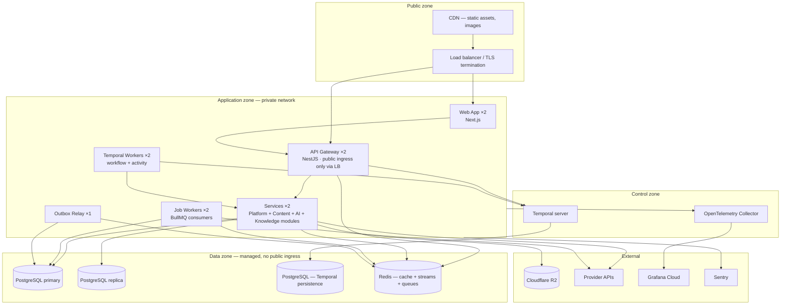
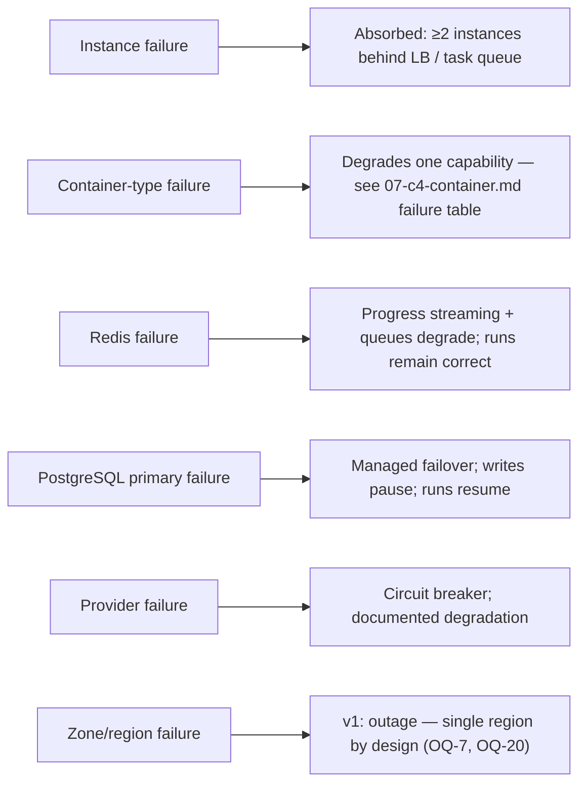

# Deployment Topology

> **Status:** v2.0 — complete. Supersedes `ARCHITECTURE_BASELINE_ARCHIVE.md` §25 (topology portion only).
> **Scope boundary:** this document owns **where things run** — the physical arrangement of containers, network zones, data tier, and the Coolify → Kubernetes evolution. The **process** that acts on this topology (pipeline, migrations, rollback, alerting, backups, scaling triggers, incidents) is owned by `14-operations/` and must not be restated here.

## Overview

The topology is deliberately small at v1: one region, one container platform, managed data services, and a modular-monolith packaging that runs the entire product in a handful of processes. That is not a compromise — it is the correct shape for a system whose bottleneck is external provider quota rather than internal compute, and whose boundaries are already drawn so that splitting later is a packaging change.

Three arrangements matter more than the box count: the **public/private split** (exactly one publicly routable container), the **request/execution plane separation** (they scale and fail differently), and the **data tier** (managed, replicated, with the orchestrator's state deliberately separate from application state).

## Business Purpose

Infrastructure is a fixed cost carried before revenue. The v1 topology is chosen so the whole platform runs at low monthly cost while supporting the NFRs, and so the first scaling steps are configuration changes rather than migrations. It also fixes an enterprise-sales fact early: single-region at launch, with the multi-region path documented rather than improvised when the first residency requirement arrives (OQ-7).

## Technical Purpose

Define the runtime placement of every container from `07-c4-container.md`: which network zone it sits in, what it may reach, what state it holds, how many instances it runs, and how that changes at each scaling stage.

## Responsibilities

**This document MUST:** define network zones and reachability; define the container-to-infrastructure mapping with instance shapes; define environment topology differences; define the v1 → Kubernetes evolution path and its trigger.

**This document MUST NOT:** define CI/CD, migrations, rollback (`14-operations/deployment.md`), SLOs and alerting (`14-operations/monitoring.md`), backup mechanics (`14-operations/backup-recovery.md`), or scaling thresholds (`14-operations/scaling-strategy.md`).

## Architecture

### Production topology (v1, stage S1)

### Zones and reachability

| Zone | Contains | Inbound from | Outbound to |
|---|---|---|---|
| **Public** | CDN, load balancer | Internet | Application zone (gateway and web only) |
| **Application** | All application containers | Load balancer (gateway, web only) | Data zone, control zone, external providers |
| **Control** | Temporal server, OTel collector | Application zone | Data zone, observability vendors |
| **Data** | PostgreSQL (×2 databases), Redis | Application and control zones | Nothing — no egress |

**Exactly one container is publicly routable: the API Gateway** (and the web app's own HTTP surface). Everything else is unreachable from the internet, including admin surfaces. There is no public database port, no direct Temporal exposure, and no bypass path for internal tooling.

### Instance shapes (S1 baseline)

| Container | Instances | Shape | Stateful | Restart safety |
|---|---|---|---|---|
| Web App | 2 | 0.5 vCPU / 1 GB | No | Anytime |
| API Gateway | 2 | 1 vCPU / 1 GB | No (SSE connections drain) | Drain first |
| Services | 2 | 2 vCPU / 4 GB | No | Anytime |
| Temporal Workers | 2 | 2 vCPU / 4 GB | No (state is in Temporal) | Drain in-flight activities |
| Job Workers | 2 | 1 vCPU / 2 GB | No | Drain in-flight jobs |
| Outbox Relay | 1 | 0.25 vCPU / 512 MB | Cursor only | Anytime — resumes from `published_at` |
| Temporal server | managed or 1 | 2 vCPU / 4 GB | Yes (separate DB) | Coordinated |
| PostgreSQL primary | 1 + replica | 4 vCPU / 16 GB | **Authoritative** | Managed failover |
| Redis | 1 | 2 GB | Semi-durable (AOF) | Queues restored from AOF |

Minimum two instances of every stateless container, always — a single instance makes every deploy an outage and every crash a customer-visible incident. The Outbox Relay is the deliberate exception: one instance is sufficient because it is stateless-with-cursor and its worst failure is bounded lag, not loss. It runs multi-instance safe (`FOR UPDATE SKIP LOCKED`) so a second instance can be added without coordination.

### Failure domains

Stating the last row plainly matters: v1 has **no multi-region resilience**. A regional outage is an outage. That is an accepted, documented position with a defined recovery path (`14-operations/backup-recovery.md`), not an oversight — and it is what enterprise prospects must be told rather than allowed to assume.

## Data Flow

Two topology-visible data paths deserve emphasis. **Provider egress** leaves the application zone directly rather than through a proxy at v1; when egress IP allowlisting becomes an enterprise requirement, a NAT gateway with stable IPs is added without changing application code. **Object storage** is reached over the public internet to R2 with credentialed access rather than through the data zone, because R2 is external by nature and its access pattern (large, infrequent, mostly write-once) does not benefit from private networking.

## Dependencies

Container platform (Coolify on Docker at S1, Kubernetes at S2+), managed PostgreSQL with PITR and replicas, managed Redis with AOF, Temporal (self-hosted in the control zone or managed — see Open Questions), Cloudflare R2, Cloudflare CDN, Grafana Cloud, and Sentry. Everything except the container platform is a managed service at v1, deliberately: operating a database is not a differentiator, and the team is small.

## Interfaces

| Boundary | Protocol | Notes |
|---|---|---|
| Internet → LB | HTTPS | TLS terminated at the edge; HSTS; modern ciphers only |
| LB → Gateway/Web | HTTP within private network | Health-checked on `/health/ready` |
| App → Data zone | TLS-enforced database and Redis connections | Credentials from the secret manager, rotated without rebuild |
| App → Temporal | gRPC within the private network | mTLS when Temporal is self-hosted |
| App → Providers | HTTPS egress | Per-provider circuit breakers and limiters |
| App → OTel Collector | OTLP/gRPC | Batched, non-blocking |

## Events

The topology places the Outbox Relay in the application zone with read/write access to PostgreSQL and write access to Redis Streams. Its placement matters: it must be able to reach the primary (not a replica), because reading pending outbox rows from a lagging replica would publish events late and, worse, non-deterministically.

## Database Impact

Two separate PostgreSQL databases, deliberately: **application data** and **Temporal persistence**. They have different growth curves, different backup requirements, and different failure consequences, and co-locating them means a Temporal history spike degrades application queries. Application PostgreSQL runs a primary plus one replica at S1, with reads routed explicitly — analytics, exports, dashboards, and backup jobs on the replica; everything transactional on the primary. `pgvector` runs inside the application database at S1 (ADR-006).

## Security

- No public ingress except the load balancer; the data zone has no internet route.
- Secrets are injected at runtime from the secret manager, never baked into images, and rotation requires no rebuild.
- Service accounts are least-privilege: the migration job may alter schema but cannot read tenant content; the deploy identity may update workloads but holds no database superuser rights.
- All internal traffic stays within the private network; service-to-service calls carry short-lived tokens.
- Images are built from pinned digests, scanned for CVEs, and signed; deployment verifies the signature.

Full controls: `16-security/`. Deployment-time enforcement: `14-operations/deployment.md` §11.

## Performance

Co-location is a performance decision: the gateway, services, and workers run in the same zone as the data tier, keeping database round-trips at sub-millisecond network latency. The CDN serves static assets and generated media from R2 at the edge, keeping the application zone out of the media-serving path entirely. Provider latency dominates everything else, which is why topology optimization beyond this point yields little.

## Caching

Redis sits in the data zone as a single instance at S1, serving cache, rate limits, streams, and queues. The topology anticipates its split: at the first sign of eviction pressure or contention, cache and queue/stream workloads move to separate instances — a configuration change plus a connection-string change, no application code.

## Scalability

| Stage | Topology change | Trigger |
|---|---|---|
| **S1** (< 1k articles/day) | As drawn: Coolify, 2× stateless, single primary + replica | — |
| **S2** (1k–10k) | Kubernetes; HPA/KEDA on queue depth; PgBouncer; Redis split (cache vs streams/queues); per-queue worker pools | Sustained worker saturation or > 60% DB connection use |
| **S3** (10k–100k) | AI Platform, Knowledge, Review extracted as services; table partitioning; Qdrant as a separate data-zone service; dedicated embedding worker pool | p95 pipeline breach at steady state; replica lag > 2 s |
| **S4** (100k+) | Regional deployments with a global control plane for identity and billing; selective sharding | Residency demand or single-region capacity limits |

The Kubernetes move is triggered by need for queue-depth-driven autoscaling, not by a date. Coolify is genuinely adequate at S1, and adopting Kubernetes before autoscaling is required buys operational cost with no benefit.

## Observability

The OpenTelemetry Collector runs in the control zone so that a failure of the observability vendor cannot take down application containers — they emit to a local collector that buffers and drops rather than blocking. Grafana Cloud and Sentry are external. Every container exposes `/health/live` and `/health/ready`; the load balancer routes on readiness only, and readiness deliberately does not call providers, because a provider outage must not mark every instance unready and turn a degraded feature into a total outage.

## Failure Recovery

Topology-level recovery positions: stateless containers are replaced, never repaired. PostgreSQL relies on managed failover, then PITR (`14-operations/backup-recovery.md`). Redis loss costs cache warmth and queued jobs but not run correctness, because runs are Temporal-driven and events survive in the outbox. Temporal's own persistence is backed up on the same PITR policy as application data, because losing workflow history means losing in-flight paid work.

## Implementation Notes

- Infrastructure is defined as code in `infra/` from day one, including Coolify configuration. Recovery time depends on infrastructure reproducibility as much as on data restore speed.
- Local development mirrors the topology with Docker Compose: PostgreSQL, Redis, Temporal, and the services, so environment-shaped bugs surface locally rather than in staging.
- Staging runs the same topology at roughly 25% capacity with provider sandbox accounts. Its purpose is to be *shaped* like production, not sized like it.
- Preview environments per pull request are the first S2-era addition; they are what allow fully isolated E2E runs (`10-testing/e2e-testing.md` §14).

## Future Roadmap

Kubernetes with KEDA; per-PR preview environments; NAT gateway with stable egress IPs for enterprise allowlisting; Qdrant as a separate data-zone service; multi-region with region-pinned tenants and a global control plane; and a warm cross-region standby should OQ-20 resolve toward a lower RTO.

## Cross References

- `07-c4-container.md` — what runs in each box here
- `12-storage-platform/` — the data tier in depth
- `14-operations/deployment.md` — how releases reach this topology
- `14-operations/scaling-strategy.md` — the thresholds that trigger each stage
- `14-operations/backup-recovery.md` — recovery within this topology
- `16-security/` — network and secret controls

## Open Questions

- **Temporal: managed vs self-hosted** at launch. Self-hosted adds a stateful control-zone service and its own database to operate; managed adds cost and a data-residency consideration. Leaning managed for v1; recorded in `99-open-questions.md`.
- **OQ-7** — data residency, which determines when S4's regional topology becomes mandatory rather than optional.
- **OQ-20** — whether a cross-region warm standby is funded before the first enterprise contract requires it.
