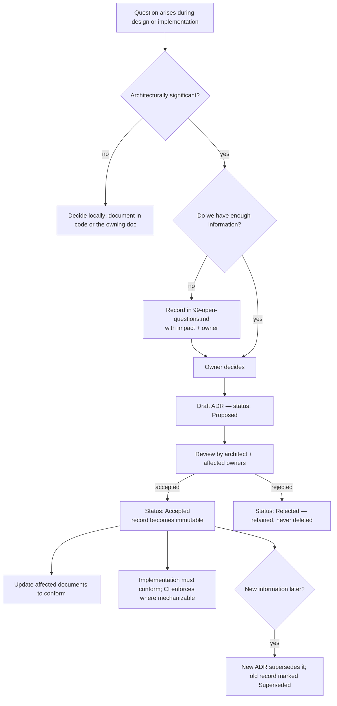
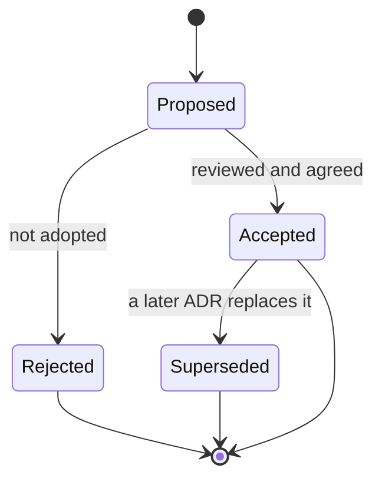

# Architecture Decisions — Process

> **Status:** v2.0 — complete. Governance for architectural decision-making. The decisions themselves live in `13-adr-log.md`.
> **Scope:** what an ADR is, when one is required, the template, the lifecycle, who decides, how ADRs bind implementation, and how they interact with `99-open-questions.md`.

## Overview

An Architecture Decision Record captures one decision, the forces that shaped it, and the consequences accepted — at the moment it is made, before hindsight rewrites the reasoning. Its value is asymmetric across time: worth ten minutes when written, worth days when someone asks eighteen months later why the system routes every model call through one service.

In a codebase generated substantially by AI agents, ADRs carry a second, heavier load. An agent has no institutional memory and no hallway to ask in. The ADR log **is** the memory. An undocumented decision will be re-litigated, and re-litigated differently, on every task that touches it.

## Business Purpose

Architectural churn is expensive and invisible on a roadmap. ADRs make the cost visible by forcing an explicit supersession: changing a decision means writing a new record explaining why the old one no longer holds. That friction is the point — it is cheap for genuinely new information and appropriately expensive for preference.

They also serve due diligence directly. Enterprise buyers and technical acquirers ask why a system is built as it is; a maintained ADR log answers in the system's own words. `AUDIT.md` exists precisely because that answer was previously unavailable for v1.

## Technical Purpose

Give every binding constraint one canonical location, one identifier, and one status, so that documentation, code review, and agent behavior can all reference the same authority.

## Responsibilities

**This document MUST:** define what qualifies as an ADR; define the template and lifecycle; define authority and review; define how ADRs bind implementation and how they relate to open questions.

**This document MUST NOT:** contain any decision record (`13-adr-log.md`), or restate the decisions' content.

## Architecture — the decision system



### What is architecturally significant

An ADR is required when a decision meets **any** of these tests:

| Test | Example |
|---|---|
| **Expensive to reverse** | Choosing shared-DB + RLS over schema-per-tenant (ADR-007) |
| **Crosses boundaries** | Every engine must call models through one gateway (ADR-008) |
| **Constrains the data model** | Organization above Workspace (ADR-017) |
| **Determines an external commitment** | Model matrix and provider exclusions (ADR-013) |
| **Establishes a rule others must follow** | Quality gates and the Explainability Envelope (ADR-009) |
| **Replaces an existing decision** | Any supersession, by definition |

An ADR is **not** required for: library choices with no boundary impact, code structure inside one module, naming (that is `05-glossary.md`), or anything reversible in an afternoon. Over-recording is its own failure — an ADR log of eighty entries, most trivial, is read by nobody.

### Template

Every record uses exactly this shape. Uniformity matters more than expressiveness: it makes the log scannable and diffable.

```markdown
### ADR-0NN — <Short imperative title>

- **Status:** Proposed | Accepted | Superseded by ADR-0MM | Rejected
- **Date:** YYYY-MM-DD
- **Deciders:** <roles>
- **Context:** The forces at play — constraints, requirements, what was true when
  this was decided. Written so a reader who was not present understands the problem.
- **Decision:** What we will do, in the active voice. Unambiguous.
- **Alternatives considered:** What else was viable and why it lost. An ADR with
  no alternatives is a statement, not a decision.
- **Consequences:** What becomes easy, what becomes hard, what we accept.
  Negative consequences are mandatory — an ADR listing only benefits is incomplete.
- **Affects:** Documents and packages that must conform.
```

## Data Flow — lifecycle



**Immutability.** An Accepted record is never edited except to change its status to Superseded and add the superseding identifier. Typos are fixed; reasoning is not. If the reasoning was wrong, that is itself information worth preserving, and the correction belongs in the superseding record.

**Numbering** is monotonic and never reused, including for rejected records — a gap in the sequence is worse than a rejected record, because a gap invites the question of what was removed.

## Dependencies

The ADR log depends on `99-open-questions.md` (its input queue) and is depended on by every other document. Where a document states a rule, it cites the ADR that established it rather than re-arguing it.

## Interfaces

| Consumer | How the log is used |
|---|---|
| Documentation | Cites ADR identifiers instead of restating rationale |
| Code review | "Which ADR permits this?" is a valid and expected review comment |
| CI | Mechanizable ADRs are enforced by lint or test (ADR-008 by import lint, ADR-007 by the RLS coverage gate) |
| AI coding agents | Binding constraints; an agent may not deviate, and may not invent a new decision |
| Onboarding | The log read in order is the system's design history |

## Events

Accepting an ADR triggers three obligations, in order: update every document listed under **Affects**; add or update the enforcement mechanism if the decision is mechanizable; and move the corresponding row in `99-open-questions.md` from Open to Resolved with the ADR reference. An accepted ADR whose affected documents still contradict it is an incident of the documentation, and the conflict is resolved in the ADR's favor.

## Database Impact

Several ADRs constrain the schema directly — ADR-005 (PostgreSQL as system of record), ADR-006 (pgvector then Qdrant), ADR-007 (RLS tenancy), ADR-017 (organization tier), ADR-020 (outbox). `03-database/` implements them and cites them; it never re-decides them. A migration that violates an accepted ADR fails review regardless of its technical merit.

## Security

Security-relevant decisions are ADRs like any other, and several are (ADR-007, ADR-008, ADR-012). Two rules apply specifically: a decision that weakens an existing security property requires explicit acknowledgment of that weakening in **Consequences** — it may not be omitted — and security ADRs name their enforcement mechanism, because a security decision without enforcement is documentation, not a control.

## Performance

Performance trade-offs belong in **Consequences**, stated concretely. "Adds one in-process hop, ~2 ms, against a 300 ms budget" is useful; "may impact performance" is not, and is a sign the decision was not analyzed.

## Caching

Not applicable as infrastructure. The organizational analogue is real, though: the log is a cache of reasoning. Its invalidation policy is supersession, and a stale entry — one whose reasoning no longer matches the system — is worse than none, because it is trusted.

## Scalability

The process scales by staying selective. As the team and agent fleet grow, the pressure will be to record more; the correct response is to hold the significance bar and push everything else into the owning document. A log that grows faster than the architecture changes is being misused.

## Observability

Log health is reviewed quarterly against three signals: records whose **Affects** documents have drifted; Accepted records whose enforcement no longer exists; and Open questions older than one quarter with no owner activity. Each is a concrete, fixable defect rather than a vague sense of documentation rot.

## Failure Recovery

When implementation and an ADR disagree, the ADR wins by default and the implementation is corrected. If the implementation is right and the ADR is wrong, the fix is a superseding ADR — never a silent edit and never an undocumented divergence. During incidents the log is diagnostic: `14-operations/incident-response.md` postmortems name the ADR whose assumption failed, and that naming is what turns an incident into an architectural improvement.

## Implementation Notes

**Rules binding AI coding agents.** These are absolute:

1. **Never invent an architectural decision.** If the answer is not in the documentation, add a row to `99-open-questions.md` and **request a decision**.
2. **Never contradict an Accepted ADR**, including in a way that only appears reasonable in local context.
3. **Never edit an Accepted ADR.** Propose a superseding record.
4. When implementing from a document, cite the ADR your implementation relies on in the pull request description, so the reviewer can verify the chain.

**Writing a good record.** State the context so it stands alone in two years. Name real alternatives — if none existed, this was not a decision. Make the consequences honest, especially the costs. Keep it under a page: an ADR nobody finishes is an ADR nobody follows.

## Future Roadmap

Generate an index from the log's front-matter so status and affected documents can be verified automatically; add a CI check that fails when a document references a Superseded ADR as authority; and publish a curated, redacted subset externally as engineering transparency once the platform is public.

## Cross References

- `13-adr-log.md` — ADR-001 through ADR-020
- `99-open-questions.md` — the input queue and the resolved register
- `07-development-guide/claude-code-rules.md` — agent obligations, restated where agents will read them
- `10-testing/testing-strategy.md` — mechanized enforcement of ADR-007 and ADR-008
- `README.md` — the amendment rule for the whole documentation tree

## Open Questions

- Whether ADRs should carry an explicit review date for time-bound decisions (for example, ADR-006's pgvector choice, which is expected to be superseded at a known scale threshold). Current position: no scheduled expiry — the scaling trigger in `14-operations/scaling-strategy.md` is the signal, and adding review dates invites ritual rather than thought.
- Who holds final authority as the team grows beyond a single architect. Recorded in `99-open-questions.md`.
