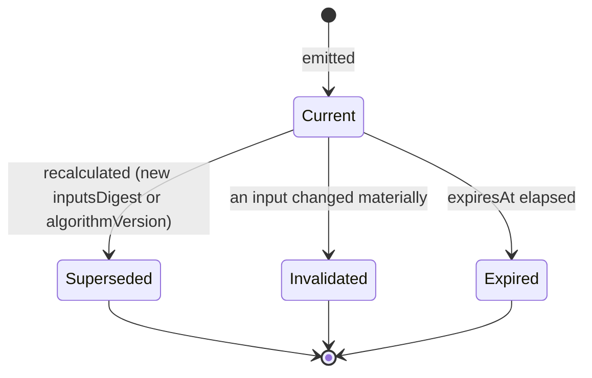

# Unified Scoring Contract

> **Status:** v1.0 — complete. The normative specification behind **ADR-021**. Mandatory for every engine that produces or consumes a quality measure.
> **Scope discipline:** this document defines a **contract**. It contains no formula, no threshold, no weight, no heuristic, and no model reference. Those belong to the engines that implement the contract, and they may change freely without amending it.

## 1 · Overview

Five engines measure content quality — Review, SEO, Optimization, Refresh, and Analytics — and before this contract each could have invented its own score shape. That path is well-travelled and ends predictably: one engine's `score` is 0–10 and another's is 0–100, one carries confidence and another does not, the UI renders three incompatible badges, and the quality gate silently passes content because it compared two numbers that meant different things.

The contract fixes the **shape and semantics** of a quality measure and leaves the measurement itself entirely to producers. Its central mechanism is the separation of two versions:

| Version | Owner | Changes when | Visible to consumers |
|---|---|---|---|
| **`contractVersion`** | This document | The contract's shape changes (rare, additive) | Yes — consumers branch on it |
| **`algorithmVersion`** | The producing engine | Any time the algorithm, prompt, model, or weighting changes | **Opaque** — recorded, never interpreted |

An engine may replace GPT-5 with a future model, rewrite its scoring entirely, and re-tune every weight. It bumps `algorithmVersion`. No API changes, no schema migration, no consumer changes. That is what makes the contract outlive both algorithms and models.

### Reconciliation with the v1 score model

The v1 system carried eight scores — SEO, AEO, GEO, HEO, EEAT, Fact, Spam, Publish — with no home in the v2 architecture (`00-architecture-review.md` §W5, OQ-23). This contract absorbs them: SEO, AEO, GEO, EEAT, Spam Risk, Fact Confidence, and Publishing Readiness become canonical categories; **HEO is superseded by `human_quality`**, which names the same concern without the invented acronym. Four categories are new — Readability, Citation Quality, Brand Voice, Accessibility — reflecting capabilities v1 did not have.

## 2 · The canonical Score object

```ts
/** contractVersion 1 */
interface Score {
  // Identity
  id: string;                     // uuid v7
  tenantId: string;               // workspace — ADR-017
  organizationId: string;

  // What was measured
  subject: ScoreSubject;
  category: ScoreCategory;        // canonical registry value — §3

  // The measure
  value: number;                  // INTEGER 0–100, higher is better, always
  confidence: number;             // INTEGER 0–100 — the producer's certainty in `value`
  verdict: ScoreVerdict;          // 'pass' | 'soft-warn' | 'block' | 'not_applicable'

  // Provenance
  contractVersion: number;        // 1
  algorithmVersion: string;       // opaque to consumers, e.g. 'seo@4.2.0'
  producer: ProducerRef;          // { engine, engineVersion }
  inputsDigest: string;           // hash of the exact inputs measured — §10

  // Lifecycle
  status: ScoreStatus;            // 'current' | 'superseded' | 'invalidated' | 'expired'
  generatedAt: string;            // ISO 8601
  expiresAt: string | null;       // null = does not expire on time alone
  supersededBy: string | null;    // score id

  // Explainability — mandatory, never optional
  explanationId: string;
}

type ScoreSubject =
  | { kind: 'article_version'; articleId: string; revisionNumber: number }
  | { kind: 'section';         articleId: string; revisionNumber: number; sectionId: string }
  | { kind: 'live_url';        urlId: string }
  | { kind: 'outline';         articleId: string; outlineVersion: number };

interface ProducerRef { engine: string; engineVersion: string }

type ScoreVerdict = 'pass' | 'soft-warn' | 'block' | 'not_applicable';
type ScoreStatus  = 'current' | 'superseded' | 'invalidated' | 'expired';
```

### Binding rules

1. **`value` is an integer 0–100 where higher is better, without exception.** A producer whose natural output is "risk" (spam, for example) inverts it before emitting. A consumer must never need to know which direction a category runs.
2. **`confidence` is orthogonal to `value`.** "Confidently poor" (`value` 20, `confidence` 95) and "uncertainly good" (`value` 80, `confidence` 30) are different facts and must be representable separately. Producers must not fold uncertainty into the value.
3. **`not_applicable` is a first-class verdict.** A B2B SaaS article has no meaningful accessibility-of-imagery score if it has no images. `not_applicable` with `value: null` is prohibited — instead the score is emitted with `verdict: 'not_applicable'` and `value` set to the category's neutral point, so aggregation never divides by a missing number.
4. **`explanationId` is mandatory.** A score without an explanation cannot be persisted (§5).
5. **`algorithmVersion` is opaque.** No consumer may parse, compare, or branch on it. It exists for audit, evaluation, and diff tracking only.
6. **A score is immutable.** Recalculation produces a new score; the previous one becomes `superseded` with `supersededBy` set.

## 3 · Canonical score categories

The registry is reference data. Exactly one producer per category — this exclusivity is the contract's most important structural rule.

| Code | Name | Producer | Subject kinds | Expiry |
|---|---|---|---|---|
| `seo` | Search Optimization | **SEO Engine** | article_version, live_url | On revision; 30 d for live_url |
| `aeo` | Answer Engine Optimization | **SEO Engine** | article_version, live_url | On revision; 30 d |
| `geo` | Generative Engine Optimization | **SEO Engine** | article_version, live_url | On revision; 30 d |
| `accessibility` | Accessibility | **SEO Engine** | article_version | On revision |
| `eeat` | Experience, Expertise, Authoritativeness, Trust | **Review Engine** | article_version | On revision |
| `human_quality` | Human Quality | **Review Engine** | article_version | On revision |
| `readability` | Readability | **Review Engine** | article_version, section | On revision |
| `fact_confidence` | Fact Confidence | **Review Engine** | article_version, section | On revision; on evidence change |
| `citation_quality` | Citation Quality | **Review Engine** | article_version | On revision; on evidence change |
| `spam_risk` | Spam Risk (inverted: 100 = no risk) | **Review Engine** | article_version | On revision |
| `brand_voice` | Brand Voice Conformance | **Review Engine** | article_version, section | On revision; on voice profile change |
| `publishing_readiness` | Publishing Readiness | **Review Engine** (composite) | article_version | On any input score change |

**Ownership is exclusive.** The SEO Engine may *read* `eeat`; it may never *produce* it. A second producer for a category is an architectural defect, caught by a startup check against the registry.

**`publishing_readiness` is the only composite category.** It is derived from other scores rather than measured directly, and its producer is the Review Engine because Review hosts the quality gate (ADR-011). Its composition function is the Review Engine's to define; the contract requires only that it declares its input categories in its explanation so the derivation is inspectable.

Categories not listed here do not exist. Adding one is §12.

## 4 · Ownership, storage, and lifecycle

| Aspect | Rule |
|---|---|
| **Producer** | Exactly one engine per category, declared in the registry |
| **Consumers** | Any engine, service, API, or UI — consumers never coordinate with producers |
| **Storage** | One row per score in the score store (§9); explanations in a companion table |
| **Versioning** | `contractVersion` + `algorithmVersion` per §1; category semantics versioned by the registry |
| **Refresh** | §10 |
| **Lifecycle** | `current` → `superseded` \| `invalidated` \| `expired`; terminal states are never reversed |
| **Retention** | Scores follow their subject: article scores live as long as the article's revisions; live-URL scores follow performance retention |

### Producer obligations

A producing engine **must**: emit exactly the categories it owns; emit an explanation with every score; set `inputsDigest` deterministically from the exact inputs measured; bump `algorithmVersion` on any change affecting output; and emit `not_applicable` rather than omitting a category it owns.

A producing engine **must not**: emit a category it does not own; interpret another producer's `algorithmVersion`; read thresholds (that is the gate's concern, §6); or vary output shape by model, tenant, or plan.

### Consumer obligations

A consumer **must**: tolerate unknown categories (forward compatibility, §12); tolerate a missing score by treating it as absent rather than as zero; respect `status` — never render a `superseded` score as current; and surface `confidence` wherever it surfaces `value`.

A consumer **must not**: recompute or adjust a score; compare scores across categories as if commensurable; or persist its own copy of a score.

## 5 · Explainability

Every score carries a structured explanation. This is the contract's implementation of ADR-009 for measurement specifically, and it is what makes a score actionable rather than merely a number.

```ts
interface ScoreExplanation {
  id: string;
  tenantId: string;
  scoreId: string;

  summary: string;                     // one human-readable sentence
  reasonCodes: ReasonCodeInstance[];   // canonical, registry-backed — never free prose
  evidenceRefs: EvidenceRef[];         // Knowledge Platform references
  supportingFacts: SupportingFact[];   // measured observations, not opinions
  affectedSections: SectionRef[];      // where in the content this applies
  recommendedActions: RecommendedAction[];
  confidence: number;                  // mirrors Score.confidence
  inputCategories?: ScoreCategory[];   // composite scores only
}

interface ReasonCodeInstance {
  code: string;                        // registry key, e.g. 'citation.coverage_below_target'
  severity: 'info' | 'warning' | 'critical';
  weight: number | null;               // producer's own contribution indicator; opaque to consumers
  context: Record<string, string | number>;   // scalars only
}

interface SupportingFact {
  metric: string;                      // 'citation_coverage_ratio'
  observed: number | string;
  unit: string | null;
  source: 'measured' | 'derived' | 'external';
}

interface RecommendedAction {
  actionCode: string;                  // registry key — maps to ActionType where applicable
  targetSection: SectionRef | null;
  expectedImpact: 'low' | 'medium' | 'high';
  evidenceRefs: EvidenceRef[];         // MUST be non-empty when the action asserts a fact
}
```

### Binding rules

1. **Reason codes are registry-backed, never free text.** Prose cannot be grouped, counted, trended, or localized. The registry maps each code to a display template per locale, so the same finding is countable in analytics and translatable in the UI.
2. **A recommended action asserting a fact must cite evidence.** `recommendedActions[].evidenceRefs` non-empty is enforced in the schema, consistent with the constraint already applied to optimization actions (`03-database/tables.md` §7).
3. **Evidence references respect tenancy.** An `EvidenceRef` resolves only within the owning workspace; explanations never embed evidence *content*, only references (§14).
4. **Supporting facts are observations, not judgments.** `citation_coverage_ratio: 0.82` is a fact; "citations are weak" is a reason code with a severity.
5. **`affectedSections` makes a score navigable.** A score of 62 with no location is not actionable; the UI must be able to jump to what produced it.

## 6 · Gate contract

The quality gate consumes scores and produces a verdict. **This section defines the interface; it defines no threshold.** Thresholds are workspace policy, resolved by `04-platform/settings.md` and snapshotted at run start (ADR-024).

```ts
interface GateEvaluationRequest {
  subject: ScoreSubject;
  scores: Score[];                     // all current scores for the subject
  thresholdSnapshot: ThresholdSnapshot; // opaque to the contract; supplied by settings
  policy: GatePolicy;
}

interface GatePolicy {
  mandatoryCategories: ScoreCategory[]; // gate cannot conclude without these
  ymyl: boolean;
}

interface GateEvaluationResult {
  verdict: Verdict;                    // 'pass' | 'soft-warn' | 'block'
  reasons: GateReason[];
  contributingScores: Array<{ scoreId: string; category: ScoreCategory; verdict: ScoreVerdict }>;
  thresholdSnapshot: ThresholdSnapshot; // echoed, so the decision is reproducible
  evaluatedAt: string;
}

interface GateReason {
  code: string;                        // reason-code registry
  category: ScoreCategory | null;
  severity: 'warning' | 'critical';
}
```

### Binding rules

1. **The gate consumes scores; it never computes them.** A gate that measures anything has absorbed a producer's responsibility.
2. **Verdict composition is monotonic in severity:** any `block` among mandatory categories yields `block`; otherwise any `soft-warn` yields `soft-warn`; otherwise `pass`. The *thresholds* that make an individual score `block` are policy; this composition rule is contract.
3. **A missing mandatory category cannot pass.** An analyzer failure means the gate cannot conclude, and inconclusive is not permission (`02-domain-design/articles.md` rule 19).
4. **`not_applicable` is excluded from composition**, never treated as `pass` or as a zero.
5. **The threshold snapshot is echoed into the result** and persisted with the verdict, so a decision remains explicable after policy changes (`gate_verdicts.threshold_snapshot`, already in the schema).
6. **The gate's own three-value vocabulary is unchanged** — `pass` / `soft-warn` / `block` (`05-glossary.md`), and remains a database `CHECK`.

## 7 · Versioning

| Change | Contract impact |
|---|---|
| Algorithm, prompt, model, or weighting change | **None.** Bump `algorithmVersion` |
| New score category | **Additive.** Registry entry; `contractVersion` unchanged |
| New optional field on `Score` or `ScoreExplanation` | **Additive.** `contractVersion` unchanged |
| New reason code or action code | **Additive.** Registry only |
| Removing or renaming a field | **Breaking.** New `contractVersion`; both emitted during a deprecation window |
| Changing the meaning of an existing category | **Prohibited.** Introduce a new category and deprecate the old one |
| Changing the 0–100 scale or its direction | **Prohibited.** The scale is foundational |

**Semantic drift is the failure mode this table exists to prevent.** Redefining what `eeat` means while keeping the name silently invalidates every historical comparison and every trend chart. A changed meaning is always a new category.

Consumers must handle a `contractVersion` higher than they know by ignoring unrecognized fields, and one lower by applying documented defaults for fields added since.

## 8 · API contract

### REST

Scores appear as a consistent sub-resource wherever a scored subject is exposed:

```
GET /v1/articles/{id}/revisions/{n}/scores
GET /v1/articles/{id}/revisions/{n}/scores/{category}
GET /v1/articles/{id}/revisions/{n}/scores/{category}/explanation
GET /v1/analytics/urls/{id}/scores
GET /v1/scores/{scoreId}/history        # supersession chain for one subject+category
```

```json
{
  "data": [{
    "id": "01J8...",
    "subject": { "kind": "article_version", "article_id": "01J7...", "revision_number": 4 },
    "category": "citation_quality",
    "value": 82,
    "confidence": 91,
    "verdict": "pass",
    "contract_version": 1,
    "algorithm_version": "review@3.1.0",
    "producer": { "engine": "review-engine", "engine_version": "2.4.1" },
    "status": "current",
    "generated_at": "2026-07-28T10:14:22Z",
    "expires_at": null,
    "explanation_id": "01J8..."
  }],
  "meta": { "contract_version": 1, "as_of": "2026-07-28T10:14:22Z" }
}
```

Conventions follow `06-api/README.md`: `snake_case` fields, cursor pagination, standard error envelope. **`meta.contract_version` appears on every score-bearing response**, so a client can detect a contract upgrade without inspecting individual records.

### Streaming

Score updates flow over the existing SSE progress channel (`09-request-flow.md`) as `score.updated` events carrying the score record without its explanation — explanations are fetched on demand, because streaming them would multiply payload size for information the user has not yet asked for.

### Internal

```ts
interface ScoreService {
  emit(tx: Transaction, score: Score, explanation: ScoreExplanation): Promise<void>;
  current(subject: ScoreSubject, categories?: ScoreCategory[]): Promise<Score[]>;
  history(subject: ScoreSubject, category: ScoreCategory): Promise<Score[]>;
  invalidate(tx: Transaction, subject: ScoreSubject, categories: ScoreCategory[], reason: string): Promise<void>;
}
```

`emit` requires a transaction handle by signature — the score, its explanation, and its outbox event commit together or not at all (ADR-020).

## 9 · Database representation

**No existing table is redesigned.** The contract is realized by extending `analyzer_reports` additively and adding two companion tables.

### Extension of `analyzer_reports` (expand migration `0024_scoring_contract`)

| Column | Type | Notes |
|---|---|---|
| `category` | TEXT | Canonical category; added alongside the existing `analyzer` column |
| `contract_version` | INTEGER NOT NULL DEFAULT 1 | |
| `algorithm_version` | TEXT | Opaque |
| `producer_engine` / `producer_version` | TEXT | |
| `inputs_digest` | TEXT | |
| `verdict` | TEXT | `CHECK (verdict IN ('pass','soft-warn','block','not_applicable'))` |
| `status` | TEXT NOT NULL DEFAULT `'current'` | `CHECK (status IN ('current','superseded','invalidated','expired'))` |
| `expires_at` | TIMESTAMPTZ NULL | |
| `superseded_by` | UUID NULL | Self-reference |
| `explanation_id` | UUID NULL → `score_explanations(id)` | Becomes `NOT NULL` at contract phase |
| `subject_kind` / `subject_ref` | TEXT / JSONB | Supports section and live-URL subjects |

The existing `analyzer` column is retained during expand, backfilled by mapping, and dropped in a later contract migration (`03-database/migrations.md`). Existing constraints — `score BETWEEN 0 AND 100`, `confidence BETWEEN 0 AND 1`, `UNIQUE (article_id, revision_number, analyzer)` — remain; the uniqueness constraint is superseded by `UNIQUE (subject_ref, category, algorithm_version, inputs_digest)` in the same expand.

> **Note on `confidence`:** the existing column is `NUMERIC 0–1`; the contract specifies integer 0–100. The adapter converts at the service boundary and the column is migrated to integer during contract phase. This is recorded rather than glossed over because a silent unit mismatch in a confidence value is exactly the class of defect this contract exists to prevent.

### New tables

| Table | Purpose | Key constraints |
|---|---|---|
| `score_explanations` | One per score | `tenant_id`; `reason_codes JSONB`, `evidence_refs JSONB`, `supporting_facts JSONB`, `affected_sections JSONB`, `recommended_actions JSONB`; `CHECK` requiring non-empty `evidenceRefs` on any action asserting a fact; **append-only** |
| `score_category_registry` | Canonical categories, producers, subject kinds, expiry policy | Global reference data — **ADR-025 exception class** |
| `reason_code_registry` | Reason and action codes with severity and display templates | Global reference data — ADR-025 exception class |

**Indexes:** `(tenant_id, subject_ref, category) WHERE status = 'current'` — the dominant read; `(tenant_id, category, generated_at DESC)` for trends; `(explanation_id)`.

**RLS:** score and explanation tables carry `tenant_id` and the standard policy. Registries are global reference data with read-only grants (ADR-025).

**History:** supersession, not mutation. Every recalculation appends; the chain is the audit trail, and `GET /scores/{id}/history` walks it.

## 10 · Refresh and invalidation



### Validity rule

A score remains valid while **`inputsDigest` matches the current inputs and `algorithmVersion` is unchanged and `expiresAt` has not elapsed.** This single rule makes caching decidable by consumers without any knowledge of the algorithm — the mechanism that lets an engine cache expensive analysis across a revise loop, re-running only what actually changed.

### Invalidation triggers

| Trigger | Effect |
|---|---|
| New article revision | All `article_version` scores for the prior revision become `superseded` on recalculation |
| Evidence retracted or superseded | `fact_confidence` and `citation_quality` **invalidated** — content now rests on different evidence |
| Brand voice profile changed | `brand_voice` invalidated |
| Producer `algorithmVersion` bump | Existing scores remain valid until recalculated; comparisons across versions are flagged in analytics |
| Live-URL scores past `expiresAt` | `expired`; recalculated on next access or scheduled sweep |

### Explicitly **not** an invalidation trigger

**A threshold change does not invalidate a score.** A score is a measurement; a threshold is policy. Changing policy may change the *verdict* on the next gate evaluation, but the measurement of the content is unchanged. Conflating these would discard expensive analysis every time an admin adjusted a setting, and would corrupt trend data.

## 11 · Events

All events use the transactional outbox and `EventBus` (ADR-020).

| Event | Producer | Consumers | Payload | Idempotency key |
|---|---|---|---|---|
| `ScoreCalculated` | Any producing engine | Gate evaluation, Read models, Analytics, Progress stream | `{ scoreId, subject, category, value, confidence, verdict, algorithmVersion }` | `(subject, category, algorithmVersion, inputsDigest)` |
| `ScoreUpdated` | Producing engine | As above | Same, plus `supersededScoreId` | As above |
| `ScoreInvalidated` | Producing engine or Knowledge (via evidence change) | Gate evaluation, Notifications | `{ subject, categories[], reason }` | `(subject, categories, reason, occurredAt)` |
| `ScoreExpired` | Expiry sweep | Recalculation scheduler | `{ subject, categories[] }` | `(subject, categories, expiredAt)` |
| `ScoreApproved` | Review Engine (human override accepting a score) | Audit, Gate evaluation | `{ scoreId, actorId, reason }` | `(scoreId, actorId)` |
| `ScoreRejected` | Review Engine (human override rejecting a score) | Audit, Gate evaluation, Evaluation harness | `{ scoreId, actorId, reason }` | `(scoreId, actorId)` |

**Retry:** standard — 5 attempts with exponential backoff, then DLQ. `ScoreInvalidated` is **critical** and pages on DLQ entry, because a stale `fact_confidence` after an evidence retraction means content may pass a gate on a measurement that is no longer true.

**Payloads carry the measure, never the content.** Explanations, section text, and evidence excerpts are fetched through authorized APIs; events reach far more consumers than the score tables do.

`ScoreApproved` / `ScoreRejected` deserve emphasis: human overrides of a score are the highest-value training signal the platform produces, and they feed the evaluation harness (`10-testing/ai-evaluation.md`) as candidate eval cases.

## 12 · Extensibility

Adding a category requires no contract change:

1. Add a `score_category_registry` entry: code, name, producer, subject kinds, expiry policy.
2. Add reason codes to `reason_code_registry`.
3. Implement the producer.
4. Consumers pick it up automatically — the UI renders from the registry, analytics groups by category, the gate includes it only if workspace policy names it mandatory.

**Consumers must ignore unknown categories.** A consumer that throws on an unrecognized category makes every future category a breaking change, and there is a contract test asserting this tolerance.

Anticipated future categories — none requiring contract changes: multilingual quality, originality, sentiment alignment, compliance (regulated verticals), conversion propensity, engagement prediction.

## 13 · AI independence

The contract references **no model, no provider, and no AI concept anywhere in its schema.** `producer` is an engine; `algorithmVersion` is an opaque string. A score produced by a deterministic library, a statistical model, a hosted LLM, or a human reviewer is indistinguishable at the contract level, and deliberately so.

| Change | Contract impact |
|---|---|
| Claude Sonnet → future model for E-E-A-T reasoning | `algorithmVersion` bump |
| A category moves from model-based to deterministic | `algorithmVersion` bump |
| A new provider enters the model matrix | None |
| The AI Council is used for a category | None — Council usage is a producer implementation detail (ADR-019) |
| Model provider removed entirely | None |

This is the property that makes the contract outlive the models. Any proposal to add a model-aware field to `Score` — `modelUsed`, `tokensConsumed`, `promptVersion` — is refused: that telemetry belongs in `ai_call_costs` and the AI Gateway's spans, correlated by `correlationId`, not in the quality contract.

## 14 · Security

- **Tenant isolation.** Every score and explanation carries `tenant_id` with RLS. There is no cross-tenant score API, no benchmarking against other tenants' scores, and no aggregate that could expose one workspace's quality distribution to another.
- **Explainability respects RLS.** `evidenceRefs` resolve only within the owning workspace; a reference that does not resolve is rendered as unavailable rather than followed across a boundary.
- **Explanations never embed evidence content** — references only, resolved through the Knowledge Platform's authorized path.
- **Score visibility follows content visibility.** A `viewer` who may read an article may read its scores; a user who may not read the article may not read its scores, since a score leaks information about content.
- **Human overrides are audited** with actor, score, and reason (`04-platform/audit-logs.md`).
- **Reason-code context carries scalars only** — no free-form strings that could smuggle content into a lower-privilege surface.

## 15 · Observability

- **Metrics:** `scores_emitted_total{category,verdict}`, `score_value` (histogram per category), `score_confidence` (histogram per category), `score_calculation_duration_seconds{category}`, `score_cache_validity_ratio` (how often `inputsDigest` matched), `scores_invalidated_total{reason}`, `score_overrides_total{decision}`, `gate_evaluations_total{verdict}`.
- **Tracing:** score emission is a span carrying `category`, `algorithmVersion`, and `inputsDigest`, linked to the AI call spans that produced it where applicable — so cost per score is derivable without the contract knowing anything about AI.
- **Diff tracking:** the supersession chain makes score movement across revisions queryable, which is what powers "this revision improved readability by 8 and reduced citation quality by 3."
- **Audit:** human overrides and category-registry changes are audit-logged.
- **Alerts:** `ScoreInvalidated` in the DLQ (**page**); a category's mean value shifting sharply after an `algorithmVersion` bump (an unintended regression — the evaluation harness should have caught it, and this is the backstop); override rate rising for one category, which indicates the measure has stopped being trusted.

## 16 · Cross references

- `13-adr-log.md` — **ADR-021**, the decision record for this contract
- `05-glossary.md` — `Score`, `Verdict`, `Explainability Envelope` definitions
- `02-domain-design/articles.md` — `AnalyzerReport` and `GateVerdict` aggregates realizing this contract
- `02-domain-design/analytics.md` — Optimization consuming scores rather than asserting its own
- `03-database/tables.md` §5 — `analyzer_reports` and `gate_verdicts`, extended additively here
- `03-database/migrations.md` — the expand/contract procedure this extension follows
- `04-platform/settings.md` — threshold resolution and run-start snapshotting (ADR-024)
- `04-platform/templates.md` — template gate overrides, tighten-only
- `05-content-platform/review-engine.md` · `seo-engine.md` · `optimization-engine.md` · `refresh-engine.md` · `analytics-engine.md` — the mandated implementers
- `08-ai-platform/ai-gateway.md` — where model telemetry lives, deliberately outside this contract
- `10-testing/ai-evaluation.md` — evaluation consuming score history and human overrides
- `16-security/rbac.md` — score visibility following content visibility

## 17 · Open questions

Deliberately outside this contract, and owned by the engines:

- Per-category threshold defaults, including YMYL (**OQ-4**) — policy, resolved by `settings.md`.
- Whether `publishing_readiness` composition should be workspace-configurable or fixed — Review Engine's decision in Phase 5.
- Plagiarism and AI-detection providers feeding `spam_risk` and `human_quality` (**OQ-8**) — a provider decision that changes `algorithmVersion` only.
- Whether live-URL scores should be recalculated on a schedule or on access (currently: expiry plus scheduled sweep).
