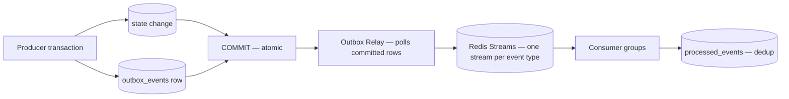

# ADR-020 — Transactional Outbox with a Swappable Event Bus

- **Status:** **Accepted**
- **Date proposed:** 2026-07-28 · **Date accepted:** 2026-07-29
- **Deciders:** Founder (accepted) + Architect
- **Supersedes:** the Proposed record in `13-adr-log.md` §ADR-020
- **Formalizes:** a decision already implemented throughout Phases 8–12

> **This record introduces no new behaviour.** It formalizes the decision that Phases 8 through 12 were written against, and states the trade-offs that acceptance commits the platform to.

## Context

The v1 baseline claimed at-least-once delivery, per-aggregate ordering, and dead-letter queues without naming a bus or addressing the dual-write problem. That gap was the single largest unresolved risk in the tree.

**The dual-write problem.** A producer that writes state to PostgreSQL and then publishes to a bus has two operations that can fail independently:

| Failure | Result |
|---|---|
| Commit succeeds, publish fails | **A state change with no event.** Downstream state silently diverges forever |
| Publish succeeds, transaction rolls back | **An event for a state change that never happened.** Consumers act on fiction |

Neither produces an error anyone sees. Both corrupt downstream state silently, and the content lifecycle that defines the product — research feeding planning feeding writing feeding review feeding publication — depends on events never being lost.

**Why this could not be deferred.** By Phase 8, six platforms already assumed events existed and were reliable. Choosing a mechanism afterwards would have meant retrofitting the guarantee into every producer, and the producers missed would be exactly the ones that lose events.

## Decision

**Producers write an outbox row inside the same transaction as the state change.** A separate relay publishes committed rows to the bus. Consumers deduplicate.

**Five load-bearing elements:**

1. **The outbox row commits with the state change.** An event exists if and only if its transaction committed. This is the entire point, and everything else follows from it.

2. **Publication requires a transaction handle by signature** — `publish(tx, event)`. There is no overload without one, no ambient-transaction variant, and no fire-and-forget path. Publishing outside a transaction is *unrepresentable*, not merely discouraged.

3. **Registry validation runs inside the producer's transaction**, before commit. An unregistered event type or a schema violation throws and rolls back the state change too — a producer that changed state but failed to notify has created exactly the inconsistency the outbox exists to prevent.

4. **The bus sits behind an `EventBus` interface.** Redis Streams today; Kafka or NATS at S3 scale without producer or consumer changes. `entryId` is opaque and is never persisted by a consumer.

5. **Consumers deduplicate against `processed_events`**, with the marker and the handler's effects committing in one transaction. This yields **exactly-once effects** on top of at-least-once delivery.

**Redis is transport; PostgreSQL is truth.** Stream loss is recoverable by republishing from the outbox. That sentence governs every downstream design decision in Phase 8.

## Motivation

**Correctness that does not depend on discipline.** The alternative designs all reduce to "remember to publish correctly." This one makes the correct usage the only representable one — a signature requirement rather than a code review item, in a codebase substantially written by agents.

**A guarantee other platforms can build on.** Once events are never lost, six platforms can treat them as reliable: the Content Platform's pipeline stages, the Knowledge Platform's evidence indexing, the Storage Platform's media availability, the API's asynchronous responses. Without it, every consumer needs its own reconciliation.

**Deferred infrastructure cost.** Kafka is correct at scale and operationally expensive below it. The interface boundary means that cost is paid when scale justifies it, not on day one.

## Alternatives considered

| Alternative | Rejected because |
|---|---|
| **Direct publish after commit** | The dual-write problem, unmitigated. Rejected outright. |
| **Redis pub/sub** | No durability, no replay. A consumer restart loses every event sent while it was down. |
| **BullMQ as the bus** | A job queue, not a topic. Independent fan-out to multiple consumer groups is awkward and ordering is per-queue. |
| **Kafka at v1** | Correct at scale; unjustified operational cost below S3. The `EventBus` interface preserves the option. |
| **Change Data Capture (Debezium)** | Removes the outbox table but couples events to schema shape. A column rename becomes an event contract change, and the payload is a row rather than a domain fact. |
| **Two-phase commit across PostgreSQL and the bus** | Available in principle; operationally fragile, poorly supported by the chosen bus, and a blocked coordinator stalls the database. |

**CDC deserves the fullest explanation, because it is the most credible alternative.** It eliminates the relay and the outbox table, and it is genuinely elegant. It was rejected because it inverts the ownership of the event contract: with CDC, the event *is* the row, so `13-event-platform/event-registry.md`'s payload rules — identifiers not content, no credentials, `additionalProperties: false` — become unenforceable. A schema change would silently reshape a public event.

## Consequences

### Accepted

- An event exists if and only if its transaction committed.
- Redis loss is recoverable by republishing from the outbox.
- Exactly-once *effects*, with at-least-once delivery stated honestly.
- Per-aggregate ordering, preserved through the outbox sequence and aggregate-grouped batch claiming.
- The bus is replaceable without touching a producer or consumer.
- Every event is registry-validated before it can exist.

### Costs

- **Publication latency of up to ~2 seconds** (p95), from relay polling.
- **An outbox table** requiring a partial index, pruning, and vacuum tuning.
- **A relay process** to operate, monitor, and scale.
- **Consumers must implement idempotency** rather than assume it.
- **The relay must read the primary, never a replica** — a replica can return rows whose predecessors have not replicated, inverting order.
- One additive column: `outbox_events.publish_attempts`.

## Trade-offs

| Chosen | Over | Reasoning |
|---|---|---|
| At-least-once + dedup | Exactly-once delivery | Exactly-once delivery is not achievable across a process boundary. Claiming it would be dishonest; systems that claim it are doing this or losing messages. |
| ~2 s publication latency | Synchronous publish | Two seconds of eventual consistency is invisible to users; a lost event is not. |
| **Per-aggregate ordering** | Global ordering | Global ordering requires funnelling all publication through one sequencer, capping throughput and making every tenant's latency a function of every other tenant's volume. Nothing in the platform needs it. |
| Polling relay | LISTEN/NOTIFY | `NOTIFY` payloads are lost if no listener is connected, reintroducing loss. Polling is boring and correct. |
| An outbox table | CDC | Keeps the event contract owned by the domain rather than by the schema. |

**The ordering trade-off is the one most likely to be questioned later.** Per-aggregate ordering means two events about *different* articles have no relative order, and two events of *different types* about the same article are not ordered relative to each other. Consumers must be order-tolerant or use `causationId`. This is documented in `13-event-platform/ordering.md` and is a real constraint, accepted deliberately.

## Cross-platform impact

| Phase | Dependency |
|---|---|
| **Phase 3 — Database** | `outbox_events`, `processed_events`; the partial pending index; monthly partitioning |
| **Phase 8 — Event Platform** | The entire folder implements this ADR |
| **Phase 9 — Security** | Consumers use the RLS-enforced role; `TenantContext` reconstructed and validated per delivery; payloads carry identifiers, never credentials or content |
| **Phase 10 — Storage** | Storage events publish only through the outbox; **provider bucket notifications are deliberately unused** because they bypass the transaction |
| **Phase 11 — Development Guide** | The `publish(tx, event)` signature rule; every durable-side-effect operation takes a `Transaction` |
| **Phase 12 — API** | A `201` and its event cannot diverge; `event-api.md` exposes no broker detail so the swap stays non-breaking |

**Phase 10's refusal of provider bucket notifications is the clearest downstream consequence.** S3, R2, and MinIO all offer them, and using them would be the obvious implementation. They are refused because a provider notification is not in the metadata transaction — an object could be announced without its `media_assets` row, or the reverse.

## Migration notes

**No migration is required.** The platform is greenfield (ADR-016); this ADR describes the design as built.

For implementation sequencing:

1. `outbox_events` and `processed_events` ship in the initial schema, with the partial pending index.
2. `publish_attempts` is included from the start rather than added later — it exists as an expand-migration example in the Phase 8 documentation, not as a pending change.
3. The relay ships before any producer publishes. A producer writing outbox rows nobody relays is invisible until a consumer is expected to have acted.
4. Consumer idempotency is not optional and is verified by test before a consumer is registered.

**If Redis Streams is later replaced**, the migration is: implement the driver, run both buses in parallel with dual consumption, verify delivery parity, cut over reads, retire the old bus. No producer or consumer changes — which is the property the interface was introduced to buy.

## Related ADRs

| ADR | Relationship |
|---|---|
| **ADR-027** | Durable Dead Letter Queue — where events go when delivery fails permanently |
| **ADR-028** | Replay Coordination — how events are re-delivered from the outbox |
| ADR-016 | Greenfield v2 stack; selected Redis and PostgreSQL |
| ADR-017 | Tenancy; `tenantId` and `organizationId` are mandatory envelope fields |
| ADR-021 | Scoring contract; score events carry values and identifiers, never evidence |
| ADR-026 | AI Memory is never a source of truth; memory events are non-authoritative |
| ADR-004 | Temporal for workflows — distinct from events; signals advance, events notify |

## Specification

The implementation specification is `13-event-platform/`, in particular:

- `transactional-outbox.md` — the relay, the claim query, `publish_attempts`, poison quarantine
- `event-bus.md` — the `EventBus` interface and stream topology
- `event-registry.md` — pre-commit validation and payload rules
- `idempotency.md` — exactly-once effects
- `ordering.md` — per-aggregate ordering and its limits
- `event-apis.md` — the frozen envelope

## Governance note

**The index entry in `13-adr-log.md` still records ADR-020 as `Proposed`.** That document is approved and has not been modified by this record. Updating the index status and the "Twenty records" count in its overview is a governance action for the owner; it is reported in the Architecture Governance Review rather than applied here.
