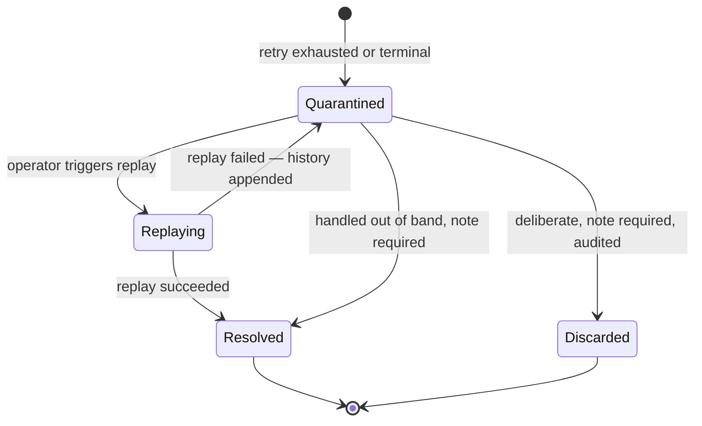

# ADR-027 — Durable Dead Letter Queue

- **Status:** **Accepted**
- **Date:** 2026-07-29
- **Deciders:** Founder (accepted) + Architect
- **Formalizes:** behaviour specified in `13-event-platform/dead-letter-queue.md` and referenced across Phases 8–12

> **This record introduces no new behaviour.** It formalizes a decision that Phase 8 specified and that Phases 9 through 12 were written against.

## Context

ADR-020 guarantees that an event exists if and only if its transaction committed. It does not say what happens when an event that exists cannot be delivered.

**Two failure surfaces produce permanently undeliverable events.**

**Publish-side.** The relay claims outbox rows in `id` order. An event that always fails to append — an oversized payload, an unresolvable stream — blocks its batch, and because claiming is ordered, it blocks everything behind it. One bad row becomes a platform-wide outage.

**Delivery-side.** A consumer's handler fails permanently: a terminal classification such as `SchemaViolation` or `AuthorizationFailure`, retry exhaustion, or budget exhaustion.

**Without a defined destination, both paths reduce to two bad options** — retry forever, which blocks the relay or burns budget indefinitely while hiding the signal; or drop, which violates the platform's hardest rule that no event is silently discarded.

**The decision could not be deferred**, because ADR-020's durability guarantee is only as strong as its weakest terminal path. A guarantee that events are never lost, coupled with an undefined failure destination, is not a guarantee.

## Decision

**Every permanently undeliverable event becomes a durable, inspectable, replayable record in PostgreSQL.**

```mermaid
flowchart TB
    R["Outbox Relay"] -- "publish_attempts exceeded" --> DLQ[("dead_letter_events")]
    C["Consumer"] --> RE["Retry Engine"]
    RE -- "terminal / exhausted / budget" --> DLQ
    DLQ --> I["Inspection"]
    DLQ --> RP["Replay — ADR-028"]
    DLQ --> RS["Resolve / discard — named actor, mandatory note"]
```

**Six load-bearing elements:**

1. **Storage is PostgreSQL, not Redis.** A dead-lettered event may sit for weeks awaiting a fix, must survive Redis eviction entirely, and must be queryable along dimensions a stream cannot support.

2. **Publish-side quarantine keeps the relay alive.** After `publish_attempts` exceeds its threshold the row is quarantined, unblocking the queue while preserving the event.

3. **Every record retains full context** — `correlationId`, producer, consumer group, failure reason, complete retry history, and the **byte-identical payload**.

4. **Discard requires a named actor and a reason**, is audited, and is never automatic.

5. **There is no delete operation.** Removal happens only through retention of already-terminal records.

6. **Quarantined records are never auto-deleted.** Time-based deletion of unresolved entries would be silent discard with extra steps.

## Durable storage

**One additive table: `dead_letter_events`.** Workspace-owned, RLS-enabled under the standard policy, changing nothing in Phase 3's schema.

| Element | Purpose |
|---|---|
| `UNIQUE (event_id, consumer_group)` | Makes duplicate quarantine impossible; publish-side uses a sentinel group |
| `payload JSONB NOT NULL` | **Byte-identical** to what was published |
| `retry_history JSONB NOT NULL` | Captured by the Retry Engine, not reconstructed |
| `CHECK (status IN (...))` | A fifth status cannot be introduced by an application bug |
| `CHECK` on resolution | **A terminal status requires both an actor and a note** |
| `CHECK` on source | Publish-side and delivery-side cannot be confused |
| Partial index on `status = 'quarantined'` | Triage queries scan only open entries |

**The resolution CHECK constraint is the enforcement mechanism, not the service method.** A rule stated only in application code is bypassed by the first migration script or admin query that updates the row directly. As a constraint it is unbypassable — the same discipline as `ck_citation_anchors__grounding` and `CHECK (reference_count >= 0)`.

**The payload is stored byte-identical because replay must reproduce the *same* event**, not a reconstruction. A re-serialised payload is a different event that would defeat idempotency keys derived from content.

**Retry history is captured at each attempt**, because log retention is shorter than DLQ residency — a history assembled from logs would be incomplete exactly when an operator most needs it.

## Quarantine workflow

**Publish-side and delivery-side entries are labelled distinctly and demand different responses.** Publish-side means *no consumer saw the event*, so replay delivers to every subscriber. Delivery-side means one group failed while others may have succeeded, so replay must target that group alone.

**A failed replay appends to the history and returns the entry to `quarantined`.** Replay attempts never overwrite the original failure.

**`Discarded` exists and is deliberately hard to reach.** Some events genuinely should not be replayed — a test-tenant event, a duplicate from a botched migration, an event whose aggregate has since been deleted. Pretending otherwise pushes operators toward deleting rows directly, which loses the record entirely.

## Operator responsibilities

| Responsibility | Mechanism |
|---|---|
| Triage by cause, not by row | Grouped inspection on `(eventType, failureCode)` |
| Determine scope | Query by `correlationId` |
| Fix the underlying defect | The owning domain component — never the DLQ |
| Replay once fixed | ADR-028, eligibility-checked |
| Resolve or discard with a reason | Mandatory note, audited |

**Grouped inspection is the default view** because it turns a 4,000-entry queue into three distinct incidents — the difference between triage and archaeology.

**`correlationId` is the highest-value dimension.** A single failing operation typically dead-letters several events across different groups; querying by correlation reconstructs the whole failure rather than presenting unrelated-looking entries.

**Operators never repair data through the DLQ.** The DLQ records that delivery failed; fixing the cause belongs to the owning component, and the DLQ never interprets an event's business meaning.

## Relationship to replay

**The DLQ owns eligibility; ADR-028 owns execution.**

| Ineligible when | Reason |
|---|---|
| Event type retired | The type no longer exists in the registry |
| Version retired | The payload shape is no longer accepted |
| Payload fails current validation | Schema narrowed since quarantine |
| Not `quarantined` | Already resolved or discarded |
| Handler declares no idempotency | Unsafe to replay |

**Registry validation is re-run at replay time and cannot be bypassed.** An entry that sat for a week may reference a version since retired; replaying it unvalidated would inject a payload into a consumer that no longer accepts its shape.

**Ineligibility is a stable, explained state, not an error.** The reason is surfaced so the correct action is obvious rather than guessed.

## Retention policy

| Status | Retention |
|---|---|
| `quarantined` | **Never auto-deleted** |
| `resolved` | 90 days |
| `discarded` | 90 days |

**Rule 1 is what makes the guarantee real.** Time-based deletion of unresolved entries would be silent discard with extra steps. A quarantined entry persists until a human resolves, discards, or replays it — **growth in that table is a signal, not a storage problem to be trimmed away.**

## Security implications

- `dead_letter_events` is **RLS-enabled**; operators see only tenants they are authorised for.
- **Payloads carry identifiers, not content** by registry rule, which is what makes operator inspection acceptable at all. A DLQ entry is not a content store.
- `failure_message` is **sanitised before storage** — connection strings, tokens, and bearer credentials are redacted, since dependency errors routinely embed them.
- Inspection, replay, resolve, and discard require an explicit **platform-tier capability** (`dlq:read`, `dlq:manage`), never held by a customer role.
- **Cross-tenant DLQ access is available only through a separately audited operator path**, never through the tenant API.

**The payload content rule is load-bearing here in a way it is not elsewhere.** Every other consumer of an event payload is a service; the DLQ's consumer is a human operator looking at another organization's data. Identifiers make that acceptable; content would not.

## Audit requirements

**Every intervention is written to `audit_log` synchronously, in the same transaction as the state change.**

| Action | Recorded |
|---|---|
| Inspect | Actor, entry id, tenant |
| Replay | Actor, entry id, target group |
| **Resolve** | Actor, entry id, **mandatory note** |
| **Discard** | Actor, entry id, **mandatory note** |

**Reads are audited here, inverting the platform's general rule.** An operator inspecting a tenant's dead letters is accessing customer data across the isolation boundary; unaudited reads would let that happen without trace.

**The note is enforced by database constraint as well as by API schema**, so the audit record can never reference a resolution with no stated reason.

## Observability

| Signal | Alert |
|---|---|
| Any entry for a **critical** event type | **Page at depth 1** |
| `dlq_depth{status="quarantined"}` > 100 | **Page** |
| Growth rate > 5/min | **Page** |
| `dlq_oldest_quarantined_age_seconds` > 24 h | Triage backlog |
| **`dlq_entries_total{source="publish"}` > 0** | **Page** — events are not reaching consumers at all |
| `failure_code = "SchemaViolation"` | **Page** — a contract breach |

**Alerting is driven by registry criticality, not by volume.** One dead-lettered `SubscriptionCancelled` matters more than five hundred dead-lettered `SearchIndexRefreshRequested`, and a depth threshold alone inverts that priority.

**Growth rate matters more than absolute depth.** A stable depth of 40 is a known backlog; a depth of 12 climbing by 5 per minute is an active incident.

## Failure recovery

| Failure | Behaviour |
|---|---|
| Quarantine write fails | The delivery is not acknowledged; redelivery retries the quarantine |
| Duplicate quarantine | `ON CONFLICT (event_id, consumer_group) DO UPDATE` — idempotent |
| Replay fails | History appended; entry returns to `quarantined` |
| DLQ table unavailable | **Consumers stop acknowledging** — events remain pending rather than being lost |

**The last row is the important one.** If the DLQ cannot record an exhausted event, the platform declines to acknowledge it rather than dropping it. Availability is traded for durability, deliberately — the same choice made for audit writes.

## Alternatives considered

| Alternative | Rejected because |
|---|---|
| **A Redis DLQ stream** | Entries must survive Redis eviction and sit for weeks; a stream cannot be queried by correlation, code, or age |
| **Drop after N retries** | Violates the platform's hardest rule outright |
| **Retry forever** | Blocks the relay on publish-side; burns budget and hides the signal on delivery-side |
| **A per-consumer-group DLQ stream** | Multiplies topology by group count and still cannot express publish-side failures |
| **Reuse `outbox_events` with a status column** | DLQ state is per-consumer-group; the outbox has no such dimension, and one group failing does not mean the event failed |
| **An external DLQ service** | Adds a dependency to the path that exists because a dependency failed |

**Reusing the outbox was the most tempting alternative** and is the one most likely to be re-proposed. It fails because a dead letter is a `(event, consumer_group)` fact: one group can fail while four succeed. Adding that dimension to `outbox_events` would change the meaning of a row the relay claims in strict order.

## Consequences

### Accepted

- No event is silently discarded, on any path.
- A poison row cannot block the relay.
- Failures are triageable by cause, correlation, and age.
- Replay is possible long after the failure.
- Discard is possible, attributed, and auditable.

### Costs

- **One additive table** with four constraints and three indexes.
- **Operator attention is required** — quarantined entries accumulate until a human acts.
- **A growing DLQ is an incident**, not a capacity problem, which means it cannot be resolved by scaling.
- Consumers stop acknowledging if the DLQ is unavailable, converting a DLQ outage into delivery backpressure.
- Storage grows with unresolved entries, unbounded by policy.

**The operator-attention cost is real and is accepted deliberately.** A platform that auto-expired dead letters would need no triage and would silently lose events, which is the outcome this ADR exists to prevent.

## Related ADRs

| ADR | Relationship |
|---|---|
| **ADR-020** | The durability guarantee this completes |
| **ADR-028** | Replay execution for eligible entries |
| ADR-017 | Tenancy; entries are workspace-owned and RLS-protected |

## Specification

`13-event-platform/dead-letter-queue.md`, with supporting detail in `retry-engine.md` (exhaustion reasons and retry history), `transactional-outbox.md` (publish-side quarantine), and `admin-api.md` (the operator surface).

## Governance note

**`13-adr-log.md` contains no record for ADR-027.** That document is approved and has not been modified. Adding the index entry and record is a governance action for the owner, reported in the Architecture Governance Review.
