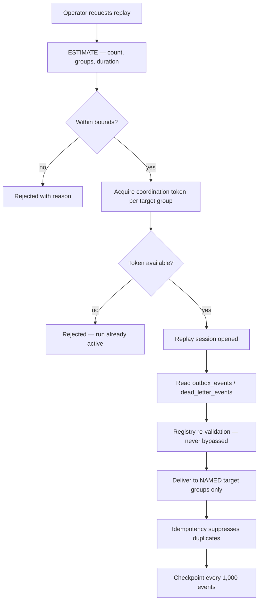
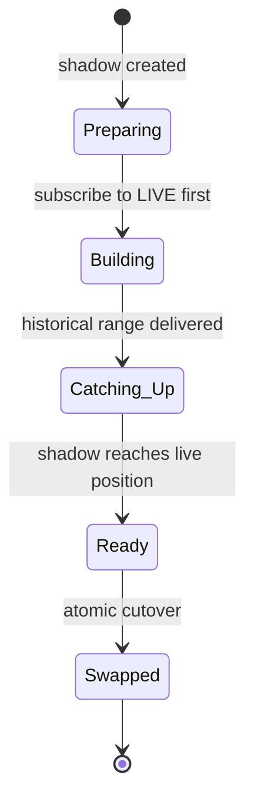

# ADR-028 — Replay Coordination

- **Status:** **Accepted**
- **Date:** 2026-07-29
- **Deciders:** Founder (accepted) + Architect
- **Formalizes:** behaviour specified in `13-event-platform/replay.md` and referenced across Phases 8–12

> **This record introduces no new behaviour.** It formalizes the coordination model Phase 8 specified, using the governance vocabulary — ownership, token, session, barrier — to name mechanisms that already exist.

## Context

ADR-020 makes events durable; ADR-027 makes failures recoverable. Both create the same obligation: if events are kept, something must be able to re-deliver them.

**Four situations require it.** A projection drifts and must be rebuilt. A consumer ships with a bug and its history must be re-processed. A consumer is silently down for a day. A dead-lettered event is fixed and must be delivered.

**Replay is the most dangerous capability in the platform**, and that is why it needs an ADR rather than an implementation note. It re-delivers real events to real consumers with real side effects. Done carelessly it sends customers duplicate emails, double-charges credits, or resurrects data that was deliberately erased.

**The failure mode is not "replay does not work."** It is "replay worked, on more consumers than intended." An operator rebuilding one analytics projection who also re-delivers to the notification consumer sends a week of duplicate emails — an effect no idempotency check can retract once the send has left the platform.

## Decision

**Replay is a privileged, scoped, estimated, checkpointed operation that reads from PostgreSQL and relies entirely on handler idempotency for safety.**



**Six load-bearing elements:**

1. **Replay reads from PostgreSQL, never from Redis.** The bus holds seven days and trims under pressure; `outbox_events` is the durable record. Replaying from a trimmed stream produces a *silently partial* rebuild — worse than none, because it looks like it worked.

2. **`targetGroups` is required and non-empty.** There is no broadcast default and no way to express one.

3. **Estimation precedes execution** and is enforced.

4. **Registry validation is re-run on every replayed event** and cannot be bypassed.

5. **Idempotency is the sole duplicate defence.** Replay adds no special-case suppression.

6. **Runs are checkpointed and resumable.**

## Replay ownership

**Replay is an operator capability, never a customer one.**

| Party | May |
|---|---|
| **Platform operator** (`replay:execute`) | Estimate, start, pause, resume, abort |
| **Customer** | **Observe** that a replay affected their workspace |
| Consumer group owner | Request a replay through an operator |

**Customers get visibility, not control.** `event-api.md` exposes replay notices so a burst of redeliveries is explicable rather than anomalous. It exposes no trigger.

**Operator authority governs *which events* replay, never *what access* the handlers get.** Each delivered event executes under its own original `TenantContext`, reconstructed from the envelope — not the operator's. Otherwise a replay would run every handler with operator-level reach.

## Coordination token

**A replay run holds an exclusive token on each target group for its duration.**

The token is a **partial unique index** on `replay_runs(target_group) WHERE status IN ('pending','running','paused')`. Acquiring it is inserting the run row; releasing it is reaching a terminal status.

| Property | Consequence |
|---|---|
| Enforced by the database | Not by an application check with a race window |
| Held per target group | Two runs against different groups proceed concurrently |
| Released on terminal status | Including `aborted` and `failed` |
| Blocks at insert | The second run fails to start rather than interleaving |

**This is enforced in the database rather than in application code deliberately.** Two concurrent rebuilds of the same projection interleave writes into one shadow and produce a corrupt result that passes every superficial check. An application-level lock has a window; a unique index does not.

## Replay sessions

**A session is a `replay_runs` record — the durable unit of a replay.**

```ts
interface ReplayRun {
  readonly id: string;
  readonly request: ReplayRequest;              // mode, targetGroups, scope
  readonly status: 'pending' | 'running' | 'paused' | 'completed' | 'aborted' | 'failed';
  readonly delivered: number;
  readonly skipped: number;
  readonly skipReasons: Record<string, number>;
  readonly suppressedAsDuplicate: number;
  readonly checkpoint: string | null;
  readonly startedBy: string;
}
```

**Three modes, with different ordering properties:**

| Mode | Selects | Ordering |
|---|---|---|
| **Range** | A time or id window | **Original `outbox_events.id` order** |
| **Consumer** | All history for a group's subscribed types | Original order |
| **Targeted** | Specific DLQ entries | **Out of order by definition** |

**`suppressedAsDuplicate` is a success metric, not a warning.** A high suppression count proves idempotency is working. **Zero suppressions on a run where overlap was expected pages**, because it means duplicate effects may have occurred.

**Skipped events are recorded with reasons**, never dropped quietly. An operator learns "8,412 delivered, 3 skipped: version retired" rather than believing a rebuild was complete.

## Ordering guarantees

| Situation | Guarantee |
|---|---|
| Range or consumer replay | **Original per-aggregate order preserved** — selection is by `outbox_events.id`, the sequence that defined it |
| Targeted replay | **None** — an isolated event delivered after later ones |
| Replay concurrent with live delivery | Both pass the aggregate barrier and are serialized; **relative order is arrival order** |

**Targeted replay cannot preserve order and says so.** Where a DLQ entry carries `orderingGap: true`, the operator is warned, because the correct remedy is often a range replay of that aggregate rather than a single-event replay.

**Strictly-ordered rebuilds use the shadow path**, where history is processed before catching up to live.

## Barrier semantics

**Two barriers govern replay, and they operate at different scopes.**

**The aggregate barrier** (per `(group, aggregateId)`) applies to replayed deliveries exactly as to live ones. A replayed event for an aggregate currently being processed waits; different aggregates proceed in parallel. Replay does not bypass it — bypassing would invert ordering precisely when the platform is doing bulk work.

**The catch-up barrier** governs shadow-then-swap rebuilds:



**The shadow subscribes to live delivery *before* the historical replay begins.** Between the start of a rebuild and the cutover, live events continue arriving; subscribing first means nothing falls into the gap, and overlapping events are suppressed by the same idempotency check that makes replay safe at all.

**The cutover is a single transaction**, so readers never observe a partially-swapped projection.

## Idempotency interaction

**Replay adds no mechanism. It relies entirely on the one that already makes at-least-once delivery safe.**

The replayed event is **byte-identical** to the original, so it derives the same idempotency key, so the conflict fires on `processed_events`, so the handler does not run twice. That is the entire safety argument, and it holds only because events are immutable and payloads are stored exactly as published.

**Two handler obligations make it work:**

**Handlers use `originalOccurredAt`, never wall-clock time.** A handler stamping `now()` while replaying three-week-old events writes a month of history at today's timestamp, silently corrupting every time-series projection it maintains.

**Handlers must not branch business logic on the replay marker.** The marker exists for observability and for the narrow class of handlers that legitimately suppress outbound notifications during a rebuild. A handler that behaves differently on replay has made replay unsafe — which is exactly what idempotency is supposed to rule out.

## Cancellation

| Action | Effect |
|---|---|
| `pause` | Stops delivery; **token retained**; checkpoint held |
| `resume` | Continues from checkpoint |
| `abort` | Terminal; **token released**; already-delivered events are **not** rolled back |

**Pause retains the token** so a paused run cannot be overtaken by a second run against the same group.

**Abort does not undo delivered events.** Handlers already committed their effects, and a compensating replay would be a second uncontrolled operation. The `delivered` count records exactly how far it got.

**Backpressure pauses automatically** when a target group's lag exceeds threshold. Replay yields to live traffic — a rebuild that pushes a consumer past its SLO has converted maintenance into a customer-visible incident.

## Failure recovery

| Failure | Behaviour |
|---|---|
| Worker crash mid-run | Checkpoint persists; run resumes from it, re-delivering at most 1,000 events |
| Target group unhealthy | Backpressure pauses; run does not fail |
| Event fails validation | **Skipped and recorded**, never delivered |
| Tenant erased | **Skipped and recorded** — erased data is never resurrected |
| Token holder dies | Run status transitions to `failed`; token released |
| Estimate exceeded 3× | Alert; operator decides |

**Skipping erased tenants is a compliance property, not an optimization.** Replaying an event belonging to an erased tenant would resurrect data that was deliberately destroyed under a right-to-erasure request.

**Re-delivering up to 1,000 events after a crash is safe and expected** — idempotency suppresses them, and the suppression count reflects it.

## Audit

**Every replay operation is written to `audit_log` synchronously with actor, scope, and target groups.**

| Action | Recorded |
|---|---|
| Estimate | Actor, requested scope, result |
| **Start** | Actor, mode, scope, **target groups**, estimated count |
| Pause, resume | Actor |
| **Abort** | Actor, **reason**, delivered count |
| Completion | Delivered, skipped, suppressed, skip reasons |

**Target groups are audited explicitly** because "which consumers received this" is the question asked after an unintended replay — and it is unanswerable afterwards if only the mode and window were recorded.

**Cross-tenant replay is audited as a cross-tenant operation** and alerts.

## Observability

| Signal | Alert |
|---|---|
| `replay_runs_total{outcome="failed"}` | **Page** — a projection is in an unknown state |
| **Zero suppressions where overlap expected** | **Page** — idempotency may not be holding |
| `replay_events_skipped_total` > 1% of a run | Registry drift |
| `replay_backpressure_pauses_total` sustained > 10 min | Cannot make progress against live load |
| Run exceeding estimate by 3× | Estimation model is wrong |
| `replay_deleted_tenant_skips_total` > 0 | Scoping error — investigated |

**The zero-suppression alert is deliberately counter-intuitive.** It looks like a clean run and is the signature of a suppression path that never engaged — the guarantee untested precisely when bulk redelivery makes it matter most.

## Alternatives considered

| Alternative | Rejected because |
|---|---|
| **Replay from the bus** | Redis trims after 7 days and under pressure; produces a silently partial rebuild |
| **Broadcast replay with per-consumer opt-out** | Fails open. A consumer that forgot to opt out receives duplicates; the safe default must be explicit targeting |
| **Replay-specific duplicate suppression** | A second mechanism alongside idempotency; two mechanisms disagree eventually, and the one exercised less is the one that is wrong |
| **Automatic replay on projection drift** | Removes the human judgement that scopes the operation; drift detection would trigger unbounded redelivery |
| **In-place rebuild (truncate and replay)** | Leaves customers reading empty data for the rebuild's duration; shadow-then-swap keeps reads serving |
| **Application-level run locking** | A race window between check and insert; the partial unique index has none |

**Broadcast-with-opt-out is the alternative most likely to be re-proposed**, because it is more convenient for the common case. It is refused because its failure mode is silent and irreversible: an opt-out that was never configured sends real emails to real customers.

## Consequences

### Accepted

- Projections can be rebuilt without downtime.
- Consumer bugs are recoverable across full history.
- DLQ entries are deliverable long after the failure.
- Replay cannot exceed its named target groups.
- Erased tenants are never resurrected.
- Concurrent rebuilds of one group are impossible.

### Costs

- **Replay requires an operator** — no self-service path exists.
- **`outbox_events` must retain 30 days**, bounding how far back a rebuild can reach.
- Handlers must be idempotent and must use `originalOccurredAt` — obligations that cannot be verified for every handler mechanically.
- One additive table, `replay_runs`.
- Rebuilds are slow by design, yielding to live traffic.
- **Targeted replay is out of order**, and consumers must tolerate it.

**The 30-day retention bound is the sharpest limit.** A projection that drifted 40 days ago cannot be rebuilt from events, and the recovery path becomes a backup restore. That is an accepted consequence of bounded outbox retention rather than an oversight.

## Related ADRs

| ADR | Relationship |
|---|---|
| **ADR-020** | The durable record replay reads from |
| **ADR-027** | Supplies eligible DLQ entries and owns eligibility |
| ADR-017 | Tenant context reconstructed per event, never the operator's |

## Specification

`13-event-platform/replay.md`, with supporting detail in `idempotency.md` (the sole duplicate defence), `ordering.md` (barrier semantics), `dead-letter-queue.md` (eligibility), and `admin-api.md` (the operator surface).

## Governance note

**`13-adr-log.md` contains no record for ADR-028.** That document is approved and has not been modified. Adding the index entry and record is a governance action for the owner, reported in the Architecture Governance Review.
