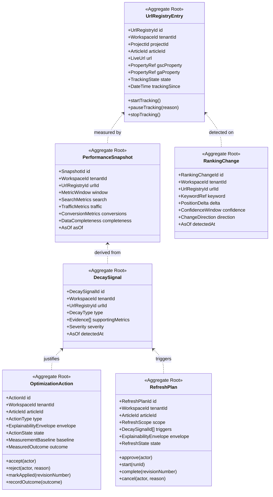
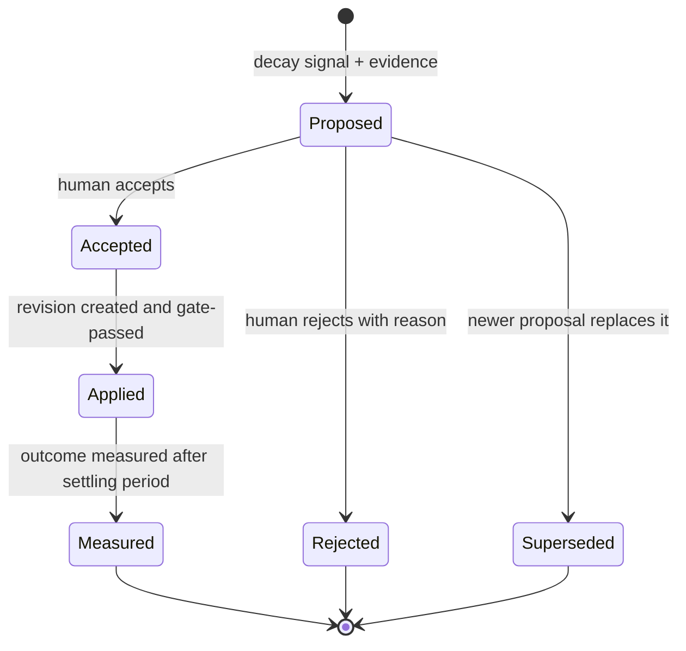
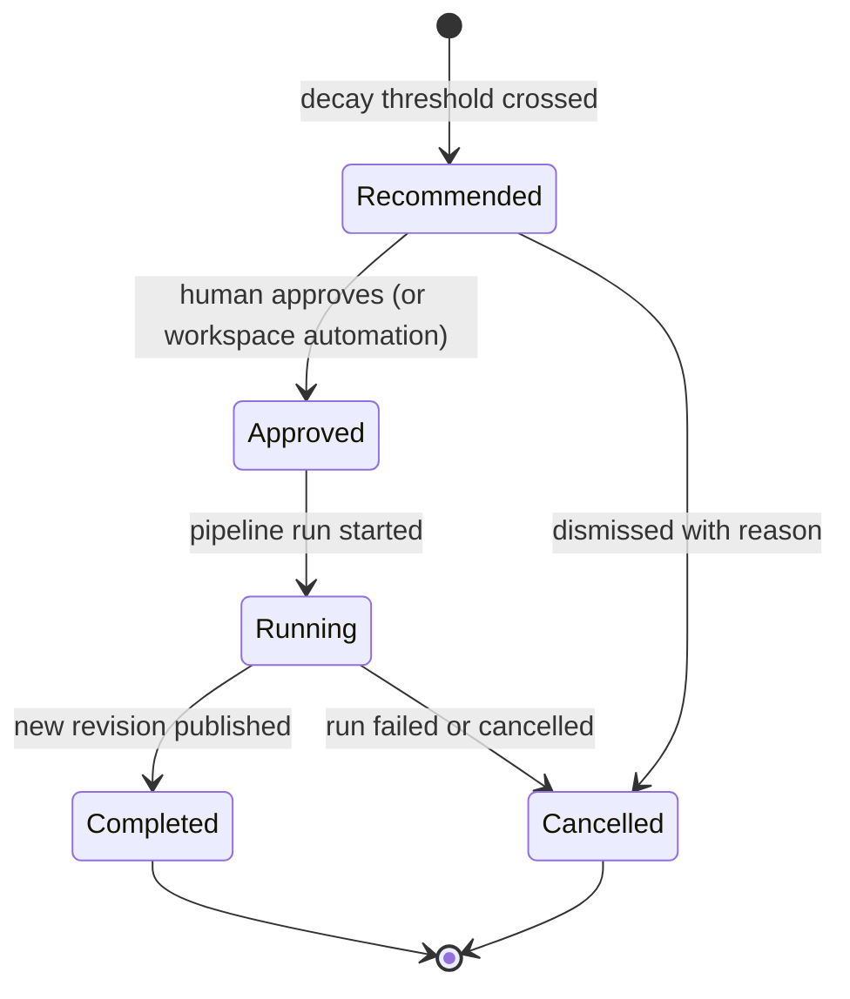
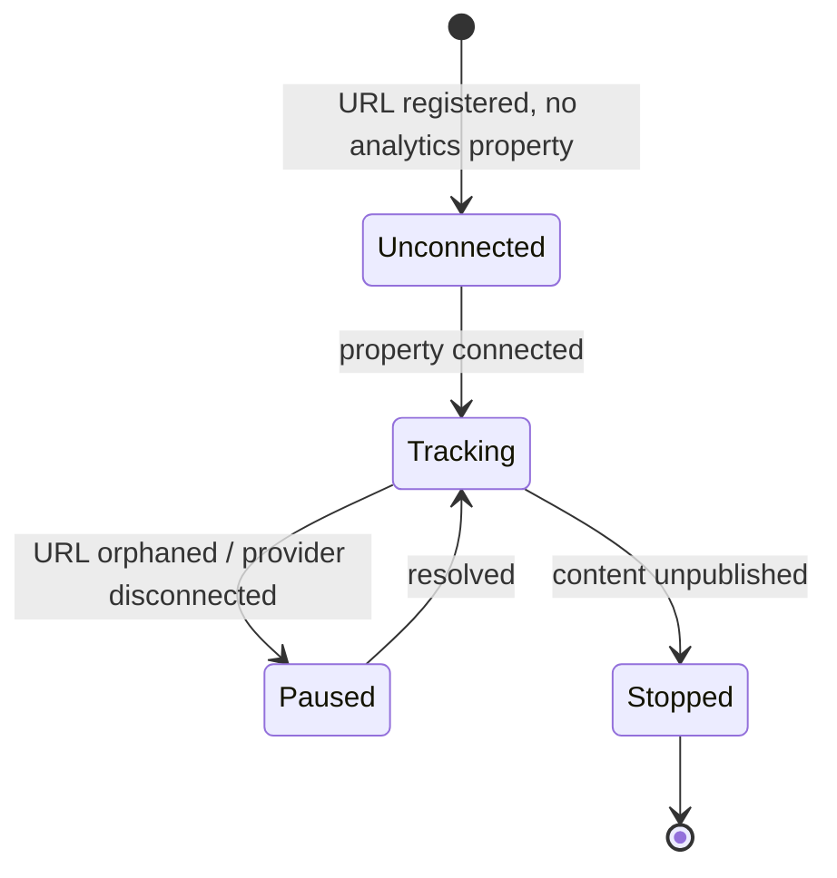

# Analytics Domain

> **Status:** v2.0 — complete. Bounded context: **Performance** — measurement, optimization, and refresh.
> **Position in the hierarchy:** workspace-scoped. Every aggregate carries `tenant_id` and `organization_id` (ADR-017).

## Overview

This domain measures what published content actually did, decides what to do about it, and closes the lifecycle loop by feeding new work back into Discovery. It covers three engines — Analytics, Optimization, and Refresh — that share one context because they share one dataset and one causal chain: measure, diagnose, act.

**Business purpose.** Content decays. Rankings shift, statistics age, competitors publish better pages, and search behaviour changes. Most tools treat publication as the end of the workflow, which means every refresh restarts from zero. ContentOS treats publication as the beginning of measurement, and that is what turns the product from a generator into a system a team keeps paying for. It is also the only place the platform can answer "did this work?" — the question that renews contracts.

**Design posture.** This domain is defined by epistemic honesty. Third-party performance data is incomplete, delayed, sampled, and occasionally wrong. The rules below are mostly about **not lying** with it: a missing metric is `null` and never zero, a ranking change requires a confidence window before it is asserted, and every recommendation carries the evidence it rests on.

## Responsibilities

**This domain owns:**

- The URL registry linking live URLs to articles, and the performance time-series attached to them.
- Ingestion of external performance data (Search Console, GA4) and the freshness and completeness metadata that qualifies it.
- Detection of ranking changes and content decay, with confidence semantics.
- Optimization actions: specific, evidence-backed proposals to improve existing content.
- Refresh plans: scoped commitments to re-research and update an article.
- The loop back into Discovery: converting measured underperformance into `Opportunity` records.

**This domain does NOT own:**

| Not owned | Owner |
|---|---|
| Provider mechanics for GSC and GA4 | `09-integrations/google-search-console.md`, `google-analytics.md` |
| Live URLs and publish state | `publishing.md` |
| Article content, revisions, verdicts | `articles.md` |
| Evidence and re-research execution | `research.md` |
| Scoring algorithms for content quality | The producing engine, under **ADR-021** (`01-system-architecture/14-scoring-contract.md`) |
| Credits and billing for refresh runs | `04-platform/credits.md` |
| Human scheduling of refresh work | `projects.md` |
| Platform operational metrics (latency, cost, errors) | `14-operations/monitoring.md` |

**The last row matters.** "Analytics" here means **content performance for customers**, not system telemetry. They share vocabulary and nothing else; conflating them puts customer-facing measurement in the same code path as SLO monitoring.

## Domain Model

| Aggregate root | Why separate |
|---|---|
| **UrlRegistryEntry** | The join between Distribution and Performance; stable identity for time-series |
| **PerformanceSnapshot** | **Append-only time-series**, the highest-volume table in the platform; must never be nested in a mutable aggregate |
| **RankingChange** | An asserted, confidence-qualified observation with its own audit value |
| **DecaySignal** | A detected condition, distinct from the raw metrics that produced it |
| **OptimizationAction** | A recommendation with a decision lifecycle and a measurable outcome |
| **RefreshPlan** | A commitment to work, with approval, execution, and completion states |

### Value objects

| Value object | Rules |
|---|---|
| `MetricWindow` | `{ start, end, granularity }` — daily, weekly, or monthly; every metric is window-qualified |
| `SearchMetrics` | `{ impressions?, clicks?, ctr?, avgPosition? }` — **all nullable** |
| `TrafficMetrics` | `{ sessions?, users?, engagementRate?, avgDuration? }` — all nullable |
| `ConversionMetrics` | `{ conversions?, conversionRate?, value? }` — all nullable (OQ-14) |
| `DataCompleteness` | `{ sourcesReported[], sourcesMissing[], samplingApplied, asOf }` — **mandatory on every snapshot** |
| `PositionDelta` | `{ from, to, change }`, integer positions |
| `ConfidenceWindow` | `{ observationDays, volatility, confident: bool }` — a change is asserted only when `confident` |
| `ChangeDirection` | `improved` · `declined` · `volatile` |
| `DecayType` | `traffic_decline` · `ranking_decline` · `ctr_decline` · `content_age` · `competitor_displacement` |
| `Severity` | `low` · `medium` · `high` |
| `ActionType` | `update_statistics` · `expand_section` · `improve_title` · `improve_meta` · `add_internal_links` · `restructure` · `merge` · `retire` |
| `ActionState` | `proposed` · `accepted` · `applied` · `measured` · `rejected` · `superseded` |
| `MeasurementBaseline` | The pre-change metric window an outcome is measured against |
| `MeasuredOutcome` | `{ metricDeltas, window, attributable: bool }` — attribution is explicitly qualified, never assumed |
| `RefreshScope` | `{ reResearch: bool, sectionsToUpdate[], keywordRecheck: bool, evidenceMaxAge }` |
| `RefreshState` | `recommended` · `approved` · `running` · `completed` · `cancelled` |
| `ExplainabilityEnvelope` | `{ recommendation, reason, evidence[], expected_impact, confidence }` (ADR-009) |

### Domain services

| Service | Responsibility |
|---|---|
| `IngestionService` | Pulls provider data, normalizes to windows, records completeness; never fabricates missing points |
| `RankingChangeDetector` | Applies the confidence window before asserting a change |
| `DecayDetectionService` | Correlates snapshots against baselines to detect decay types |
| `OptimizationProposalService` | Builds actions with mandatory Explainability Envelopes; deduplicates against open proposals |
| `RefreshPlanningService` | Scopes a refresh from decay signals and evidence age |
| `OutcomeMeasurementService` | Measures a change against its baseline after a settling period; qualifies attribution |

## Business Rules

**Data integrity — the epistemic rules**

1. **A missing metric is `null` with a completeness record, never `0`.** Zero traffic and unknown traffic are different facts, and conflating them produces confidently wrong recommendations.
2. Every snapshot carries `DataCompleteness` naming which sources reported, which are missing, and whether sampling applied.
3. Snapshots are **immutable**. Providers revise historical data (Search Console backfills for ~3 days); a revision is a **new snapshot** for the same window, and the latest by `asOf` wins for reads while history is retained.
4. Every metric is window-qualified. An unqualified number is meaningless and may not be stored or displayed.
5. Data is never presented as more current than it is; the UI shows the `asOf`, and freshness is surfaced rather than implied.

**Ranking and decay**

6. A `RankingChange` is asserted **only** when its `ConfidenceWindow` is satisfied — a minimum observation period and a volatility ceiling. Daily position noise is not a ranking change.
7. Position data is averaged and sampled by the provider; positions are treated as estimates, and single-day movements never trigger action.
8. A `DecaySignal` requires a sustained trend against a baseline, not one bad window.
9. Decay detection is suppressed for content younger than a configurable settling period (default 90 days) — new content has not yet earned a baseline.
10. Seasonality is acknowledged: year-over-year comparison is preferred where at least 12 months of history exists; where it does not, the signal is emitted at reduced confidence and labelled as such.

**Recommendations**

11. Every `OptimizationAction` and `RefreshPlan` **must** carry a complete Explainability Envelope with non-empty `evidence[]` (ADR-009). A recommendation without evidence is a defect, not a lower-quality recommendation.
12. Actions are **proposals**, never auto-applied. Acceptance is a human decision, or an explicitly configured workspace automation with its own audit trail.
13. At most one `proposed` action of a given `ActionType` exists per article; a newer proposal supersedes the older with a recorded reason.
14. An accepted action is applied by the owning engine as a **new article revision**, which re-enters the normal quality gate (`articles.md`). Optimization never writes content directly, and never bypasses the gate.
15. `retire` and `merge` actions require elevated permission and explicit confirmation, because their consequence is unpublication or URL consolidation.
16. Outcomes are measured against `MeasurementBaseline` after a settling period, and `attributable` is `false` whenever confounders — a site migration, an algorithm update, a seasonal shift — cannot be excluded. **The platform states uncertainty rather than claiming credit.**

**Refresh**

17. A refresh plan references the decay signals that triggered it, so a human can see why.
18. Refresh reuses existing evidence, re-validating freshness against `evidenceMaxAge`; stale evidence is re-retrieved rather than reused silently (`research.md` rule 19).
19. A refresh produces a new revision through the standard pipeline: research → planning → writing → **review → gate** → SEO → publish (update). No stage is skipped for refreshes.
20. Only one refresh may be `running` per article at a time.
21. Refresh runs consume credits like any other run and are subject to the same holds and settlement.

**Tracking lifecycle**

22. Tracking begins at `ArticlePublished` and requires an analytics property connection; without one, the URL is registered but `TrackingState` is `unconnected`, and this is surfaced rather than silently producing empty charts.
23. Tracking stops on `ContentUnpublished`; historical snapshots are retained.
24. An orphaned URL (`publishing.md` rule 16) pauses tracking and flags the entry — measuring a URL that no longer exists produces misleading declines.

## Lifecycle

Optimization action:

Refresh plan:

URL tracking:

## Domain Events

Written to the outbox in the state-changing transaction (ADR-020).

| Event | Producer | Consumers | Payload | Retry / failure |
|---|---|---|---|---|
| `UrlRegistered` | UrlRegistryEntry | Ingestion scheduler, Read models | `{ urlId, articleId, url, projectId }` | Standard |
| `TrackingStarted` | UrlRegistryEntry | Ingestion scheduler | `{ urlId, gscProperty, gaProperty, trackingSince }` | Standard |
| `PerformanceSnapshotRecorded` | PerformanceSnapshot | Decay detection, Read models, Dashboards | `{ snapshotId, urlId, window, completeness }` — **metrics not inlined** | Standard |
| `RankingChanged` | RankingChange | Optimization, Notifications, Read models | `{ urlId, keyword, delta, direction, confidence }` | Standard |
| `ContentDecayDetected` | DecaySignal | **Refresh planning**, Optimization, Notifications | `{ urlId, articleId, decayType, severity, supportingMetrics }` | Critical |
| `OptimizationProposed` | OptimizationAction | Notifications, Projects (task), Read models | `{ actionId, articleId, type, envelope }` | Standard |
| `OptimizationAccepted` | OptimizationAction | **Content engines**, Projects | `{ actionId, articleId, type, acceptedBy }` | Critical |
| `OptimizationApplied` | OptimizationAction | Outcome measurement scheduler | `{ actionId, articleId, revisionNumber, baseline }` | Standard |
| `OptimizationOutcomeMeasured` | OptimizationAction | Read models, Notifications | `{ actionId, metricDeltas, attributable }` | Standard |
| `RefreshRecommended` | RefreshPlan | Notifications, Projects (calendar), **Discovery** | `{ planId, articleId, scope, envelope, triggers[] }` | Critical |
| `RefreshStarted` | RefreshPlan | Articles, Orchestrator, Progress stream | `{ planId, articleId, runId, scope }` | Critical |
| `RefreshCompleted` | RefreshPlan | Articles, Notifications, Read models | `{ planId, articleId, revisionNumber }` | Critical |
| `AnalyticsSourceDegraded` | IngestionService | Notifications, Observability, Read models | `{ provider, propertyRef, reason, affectedWindow }` | Standard |
| `OpportunityFromPerformance` | RefreshPlanning | **Discovery**, Projects (backlog) | `{ projectId, envelope, sourceUrlId }` | Standard |

**Consumed events**

| Event | Source | Reaction |
|---|---|---|
| `ArticlePublished` | Publishing | Register the URL; begin tracking if a property is connected |
| `ArticleUpdated` | Publishing | Record a change marker on the time-series so a step change is attributable |
| `ContentUnpublished` | Publishing | Stop tracking; retain history |
| `PublishedContentOrphaned` | Publishing | Pause tracking; flag the entry (rule 24) |
| `ProjectArchived` / `WorkspaceArchived` | Projects / Workspace | Stop ingestion; retain history |
| `EvidenceRetracted` | Research | If the affected article is published, raise a high-severity refresh recommendation |

## Relationships

| Relates to | Nature |
|---|---|
| **Workspace** | Isolation boundary; supplies analytics property connections and automation policy (`workspace.md`) |
| **Organization** | Indirect via `organization_id`; org-level ROI reporting across workspaces |
| **Project** | Aggregation unit; `TargetSite` maps to the analytics property (`projects.md`) |
| **Publishing** | Supplies `LiveUrl` and publish state — the join key for all measurement (`publishing.md`) |
| **Articles** | Refresh and optimization produce new revisions through the standard pipeline and gate (`articles.md`) |
| **Research / Discovery** | Closes the loop: `OpportunityFromPerformance` and `RefreshRecommended` re-enter Discovery (`research.md`) |
| **Knowledge Platform** | Refresh re-validates evidence freshness before reuse (`11-knowledge-platform/freshness-engine.md`) |
| **AI Platform** | Optimization proposals use reasoning-tier models through the AI Gateway; the envelope's `reason` is model-produced but its `evidence[]` is measured data, never generated |
| **Platform Layer** | Credits for refresh runs; notifications for decay and proposals (`04-platform/`) |
| **Storage Platform** | Snapshots in partitioned PostgreSQL tables with rollups; provider raw responses archived to R2 (`12-storage-platform/`) |
| **Event Platform** | All events through the outbox and `EventBus` (ADR-020) |

## Database Impact

| Table | Notes |
|---|---|
| `url_registry` | PK `id`; `tenant_id`, `organization_id`, `project_id`, `article_id`, `url`, `gsc_property`, `ga_property`, `state`, `tracking_since`, audit fields |
| `performance_snapshots` | PK `id`; `tenant_id`, `url_id`, `window_start`, `window_end`, `granularity`, `search JSONB`, `traffic JSONB`, `conversions JSONB`, `completeness JSONB`, `as_of` — **append-only, partitioned** |
| `performance_rollups` | Pre-aggregated weekly/monthly per URL and per project, rebuilt from snapshots |
| `ranking_changes` | PK `id`; `tenant_id`, `url_id`, `keyword`, `delta JSONB`, `confidence JSONB`, `direction`, `detected_at` — **append-only** |
| `decay_signals` | PK `id`; `tenant_id`, `url_id`, `article_id`, `type`, `severity`, `supporting_metrics JSONB`, `detected_at` — **append-only** |
| `optimization_actions` | PK `id`; `tenant_id`, `article_id`, `type`, `envelope JSONB`, `state`, `baseline JSONB`, `outcome JSONB`, audit fields |
| `refresh_plans` | PK `id`; `tenant_id`, `article_id`, `scope JSONB`, `triggers`, `envelope JSONB`, `state`, `run_id`, audit fields |

**Constraints**

- `UNIQUE (url_id, window_start, granularity, as_of)` on snapshots — a provider revision creates a new row rather than colliding (rule 3).
- Partial unique index `(article_id, type) WHERE state = 'proposed'` on actions — rule 13.
- Partial unique index `(article_id) WHERE state = 'running'` on refresh plans — rule 20.
- `CHECK` constraints on every state and enum column.
- `CHECK (envelope ? 'evidence' AND jsonb_array_length(envelope->'evidence') > 0)` on actions and plans — **the Explainability Envelope requirement is a database constraint** (rule 11).
- FKs: `url_id → url_registry(id)` `ON DELETE RESTRICT`; `article_id → articles(id)` `ON DELETE RESTRICT`.

**Indexes:** `(tenant_id, url_id, window_start DESC)` on snapshots (the dominant read); `(tenant_id, project_id)` on the registry for project dashboards; `(tenant_id, state, detected_at)` on decay signals; `(url)` for reverse lookup from Publishing; BRIN on `window_start` for the partitioned time-series.

**RLS.** All seven tables carry `tenant_id` with the standard policy and the mandatory isolation suite.

**Soft delete.** None on time-series or signals — all append-only, removed only by retention policy. `url_registry`, `optimization_actions`, and `refresh_plans` use terminal states rather than deletion, preserving the decision history that explains why content changed.

**Partitioning.** `performance_snapshots` is the platform's highest-volume table and is partitioned by `(tenant_id, window_start)` from the outset — retrofitting partitioning on a large time-series is far more expensive than starting with it. Rollups serve dashboards so charts never scan raw partitions.

## API Impact

| Surface | Operations |
|---|---|
| REST | `GET /v1/analytics/urls`, `GET /v1/analytics/urls/{id}/performance?window=&granularity=`, `GET /v1/analytics/projects/{id}/summary`, `GET /v1/analytics/ranking-changes`, `GET /v1/optimizations`, `POST /v1/optimizations/{id}/accept|reject`, `GET /v1/refresh-plans`, `POST /v1/refresh-plans/{id}/approve|cancel`, `POST /v1/analytics/properties` (connect GSC/GA) |
| Internal | `IngestionService.pull(property, window)`; `DecayDetectionService.evaluate(urlId)`; `OutcomeMeasurementService.measure(actionId)` |
| Events | As tabled above |
| Workers | Scheduled ingestion per property (daily); decay detection sweep; outcome measurement scheduler; rollup builder; ranking-change detector |

Every performance response includes `asOf` and completeness metadata; a client cannot render a chart without knowing what is missing (rule 2).

## Security

Domain-specific rules; controls in `16-security/`.

- Analytics property credentials are OAuth grants held as `CredentialRef` in the Provider Layer; this domain stores property identifiers only, never tokens.
- Connecting a property proves the customer controls it — a property reference alone must never grant data access, since GSC property identifiers are guessable.
- Performance data is competitively sensitive: event payloads carry identifiers and completeness only, never metric values, because events reach notification channels including email.
- `retire` and `merge` actions require elevated permission (rule 15); accepting them can unpublish live content.
- Every action acceptance, rejection, and refresh approval is audit-logged with actor and reason.

## Performance

- **Rollups, not raw scans.** Dashboards read `performance_rollups`; raw snapshots are queried only for detail views over bounded windows.
- Ingestion is batched per property with provider-side pagination, scheduled off-peak, and idempotent per `(property, window, as_of)`.
- Decay detection runs as a scheduled sweep over rollups rather than per-snapshot, so it costs one pass per day rather than one evaluation per data point.
- Time-series reads are cursor-paginated and window-bounded; an unbounded history request is rejected rather than served slowly.
- Read models back project and portfolio dashboards, denormalizing article title, status, and publish date so charts never join into Authoring.
- Snapshot writes use bulk inserts into the current partition; the ingestion worker never writes row-by-row.

## Failure Handling

| Failure | Handling |
|---|---|
| Provider unavailable | Window recorded as missing in `DataCompleteness`; `AnalyticsSourceDegraded` emitted; **never** interpolated or zero-filled (rule 1) |
| Provider revises historical data | New snapshot for the same window with a later `as_of`; reads take the latest; history retained (rule 3) |
| Duplicate ingestion from a retried job | Unique constraint on `(url_id, window, granularity, as_of)`; the handler treats the violation as success |
| OAuth grant expired | Tracking `paused`; customer notified; no misleading gap in charts — the gap is labelled |
| Decay detected on an orphaned URL | Suppressed; the orphan flag is surfaced instead (rule 24) |
| Refresh run fails | Plan returns to `recommended` with the failure recorded; credits released; no partial revision published |
| Outcome measurement inconclusive | `attributable: false` recorded with the confounders named — the platform does not claim credit it cannot support (rule 16) |
| Rollup builder falls behind | Dashboards show a staleness indicator; rollups are rebuildable from append-only snapshots |
| Optimization accepted but gate blocks the revision | Action stays `accepted`, not `applied`; the block surfaces through the normal review path (rule 14) |

## Observability

- **Metrics:** `analytics_ingestion_runs_total{provider,result}`, `ingestion_lag_hours{provider}`, `snapshots_written_total`, `data_completeness_ratio{provider}`, `ranking_changes_detected_total{direction}`, `decay_signals_total{type,severity}`, `optimizations_total{state}`, `optimization_acceptance_rate`, `refresh_plans_total{state}`, `rollup_lag_seconds`.
- **Logs:** every ingestion run with property, window, completeness, and provider status; every action state change with actor and reason. Never metric values at debug volume.
- **Traces:** ingestion runs are traced per property and window, so a slow provider is attributable.
- **Alerts:** `ingestion_lag_hours` above 48 for any active property (customers notice missing data before we do otherwise); `data_completeness_ratio` dropping sharply; `ContentDecayDetected` or `RefreshStarted` in the DLQ; rollup lag above 2 hours; optimization acceptance rate collapsing toward zero, which indicates the recommendations have stopped being useful.

## Future Expansion

- **Portfolio-level intelligence** — cannibalization detection, internal-link opportunity mapping, and cluster-level performance rather than per-URL.
- **Forecasting** — projected traffic from position and volume, enabling prioritization by expected value rather than by decay severity alone.
- **Server-side conversion events** to supplement GA4 (OQ-14), improving the ROI claim the product can defend.
- **Competitor performance tracking** — measuring displacement directly rather than inferring it from our own decline.
- **Automated optimization** under explicit workspace policy, with a mandatory audit trail and a measured-outcome feedback loop.
- **Attribution modelling** beyond last-touch, once conversion data is richer.
- **A/B testing** of titles and meta descriptions, which requires a variant model on `PublishedContent` and a measurement design this domain would own.

## Cross References

- `publishing.md` — `LiveUrl` as the join key; tracking starts and stops from its events
- `articles.md` — refresh and optimization produce revisions that re-enter the quality gate
- `research.md` — the loop back into Discovery; evidence freshness on refresh
- `projects.md` — project-level aggregation and calendar integration for refresh work
- `05-content-platform/analytics-engine.md` · `optimization-engine.md` · `refresh-engine.md` — the three engines implementing this domain
- `09-integrations/google-search-console.md` · `google-analytics.md` — provider adapters
- `03-database/tables.md` · `03-database/indexes.md` — physical schema and partitioning
- `12-storage-platform/postgresql.md` — time-series partitioning and retention
- `14-operations/monitoring.md` — **system** telemetry, deliberately distinct from this domain

## Open Questions

- **OQ-14** — GA4 alone versus supplementary server-side conversion events; this bounds every ROI claim the product can make.
- **OQ-9** — retention for performance snapshots per plan tier; the time-series is the fastest-growing dataset in the platform.
- ~~OQ-23~~ — **resolved by ADR-021.** Optimization consumes scores through the Unified Scoring Contract and may reference them in recommendations; it still produces none of its own, since every category has exactly one producer (`01-system-architecture/14-scoring-contract.md` §3).
- Default confidence-window parameters for ranking-change detection, and the settling period before decay evaluation begins (currently 90 days) — recorded in `99-open-questions.md`.
