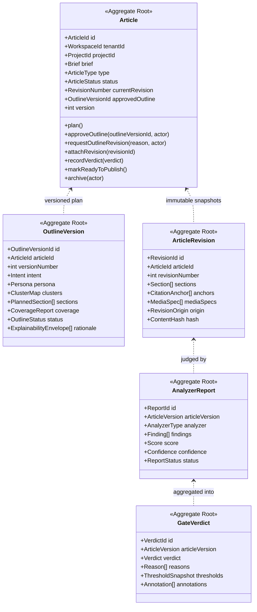
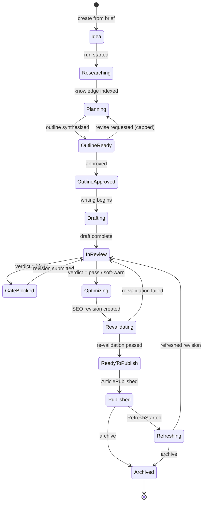
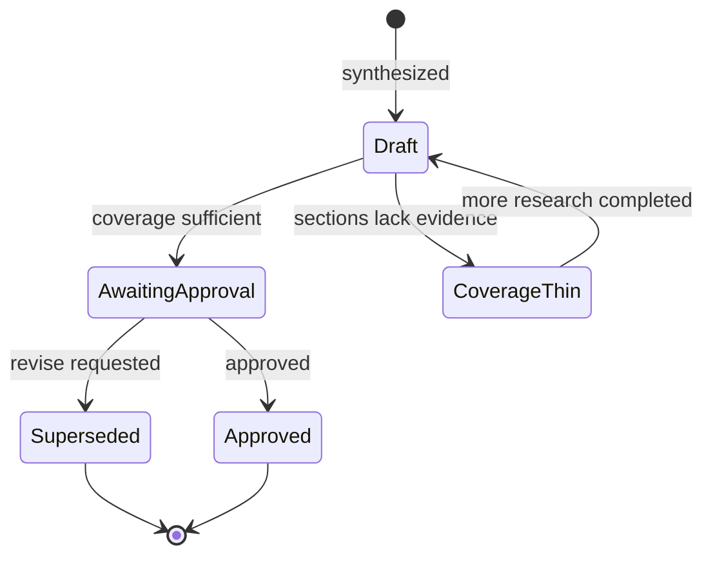

# Articles Domain

> **Status:** v2.0 — complete. Bounded contexts: **Authoring** (article, outline, revisions, media specs) and **Quality** (analyzer reports, gate verdicts, annotations).
> **Position in the hierarchy:** `Organization → Workspace → Project → **Article**` (ADR-017). Every aggregate carries `tenant_id` and `organization_id`.

## Overview

The Article is the platform's central asset and its longest-lived aggregate. It is created as an idea, planned, drafted, reviewed, optimized, published, measured, refreshed, and eventually archived — a life measured in months or years, not in one generation call.

**Business purpose.** Everything the platform sells converges here: the grounding invariant is enforced on this aggregate, quality gates decide whether it may proceed, and its revision history is what makes published content defensible under audit. It is also the unit customers count and pay for.

**Why Authoring and Quality share one document.** They are separate bounded contexts in a Customer/Supplier relationship (`01-system-architecture/04-context-map.md`): Quality analyzes an immutable `ArticleVersion` and returns reports and a verdict; Authoring executes any resulting revision. They share one document because they share one state machine — a gate verdict is a transition in the article's lifecycle — and splitting them would fragment it. Their models remain distinct, and the **measurement/mutation separation** below is the boundary that keeps them honest.

**Scope note on scoring.** Analyzer reports carry scores, and the gate applies thresholds to them. **This document does not define any scoring algorithm, scale weighting, or aggregation formula** — that is **ADR-021**, specified in `01-system-architecture/14-scoring-contract.md`. What is fixed here is the *shape*: where a score attaches, that it is `0–100` with confidence (`01-system-architecture/05-glossary.md`), and what the aggregate does with a verdict.

## Responsibilities

**This domain owns:**

- The Article aggregate: identity, brief, lifecycle, and its pointer to the current revision.
- Outline versions and the approval protocol, including the revise loop and its cap.
- Article revisions: immutable content snapshots with citation anchors and media specs.
- Analyzer reports and gate verdicts, attached to a specific `ArticleVersion`.
- The human-review package produced when a gate blocks.
- The grounding contract *within content*: every factual claim carries a citation anchor or an explicit unsupported flag.

**This domain does NOT own:**

| Not owned | Owner |
|---|---|
| Evidence, sources, provenance, coverage computation | `research.md` |
| Citation *resolution* against the Evidence Bank | `11-knowledge-platform/citation-engine.md` |
| Scoring algorithms, weights, thresholds semantics | The producing engine, under **ADR-021** (`01-system-architecture/14-scoring-contract.md`) |
| Threshold *values* (workspace policy) | `workspace.md` |
| Human assignment, due dates, editorial workflow state | `projects.md` |
| Publish packages, targets, attempts | `publishing.md` |
| Performance measurement and refresh decisions | `analytics.md` |
| Media asset storage, transforms, CDN | `04-platform/media.md` (ADR-018) |
| Prompts, model selection, generation mechanics | `08-ai-platform/` |
| Execution workflow, retries, durable timers | Temporal (`01-system-architecture/07-c4-container.md`) |

**The measurement/mutation rule.** Quality measures and issues verdicts; it never edits content. When Review determines that content must change — humanization, a rewrite, a citation repair — it records the requirement and **Authoring executes it as a new revision**. This separation is why a verdict can always be traced to the exact bytes it judged.

## Domain Model

| Aggregate root | Why separate |
|---|---|
| **Article** | The long-lived identity and lifecycle holder; small and frequently read |
| **OutlineVersion** | Independently versioned with its own approval state; the contract between Planning and Writing |
| **ArticleRevision** | **Immutable and append-only**; nesting revisions inside Article would make the aggregate grow without bound |
| **AnalyzerReport** | Written in parallel by independent analyzers; separate roots avoid write contention during a review fan-out |
| **GateVerdict** | The auditable decision record, immutable and always bound to one `ArticleVersion` |

### Value objects

| Value object | Rules |
|---|---|
| `ArticleVersion` | `(articleId, revisionNumber)` — the unit Quality analyzes and Distribution publishes |
| `Brief` | `{ topic, audience, goal, articleType, wordCountTarget, locale, constraints[] }` — snapshotted at creation from project defaults |
| `ArticleType` | `guide` · `comparison` · `listicle` · `how_to` · `review` · `news` · `pillar` |
| `ArticleStatus` | See the lifecycle state machine below |
| `Intent` | `informational` · `commercial` · `transactional` · `navigational` · `local`, with confidence |
| `Persona` | Reader profile, pain points, desired outcome, content angle |
| `ClusterMap` | Pillar and supporting topics plus the internal-linking plan |
| `PlannedSection` | `{ heading, level, purpose, evidenceRefs[], plannedElements[] }` — each section maps to available evidence |
| `Section` | Rendered content for a planned section, with its anchors |
| `CitationAnchor` | `{ claimText, offsets, evidenceRef, supported }` — the in-content half of the grounding contract |
| `MediaSpec` | `{ kind, purpose, altText, placement, generationHint }` — **intent only**; the asset lives in the Platform Layer (ADR-018) |
| `CoverageReport` | Per-section evidence sufficiency, computed by `research.md`'s `CoverageValidator` |
| `AnalyzerType` | `evidence` · `fact` · `grammar` · `readability` · `voice` · `duplication` · `ai_estimate` · `seo` |
| `Score` | `{ value 0–100, confidence }` — **scale fixed, computation not owned here** |
| `Verdict` | `pass` · `soft-warn` · `block` — exactly three values, platform-wide |
| `ThresholdSnapshot` | The workspace thresholds in force when the verdict was issued |
| `Annotation` | `{ location, severity, message, analyzer }` for human review |
| `RevisionOrigin` | `initial_draft` · `revision_requested` · `seo_optimization` · `human_edit` · `refresh` |
| `ExplainabilityEnvelope` | `{ recommendation, reason, evidence[], expected_impact, confidence }` (ADR-009) |

### Domain services

| Service | Responsibility |
|---|---|
| `OutlineApprovalService` | Applies workspace/project approval policy; enforces the revise-loop cap; records approval |
| `RevisionFactory` | Creates the next immutable revision, assigning a monotonic number and content hash |
| `GateEvaluationService` | Aggregates analyzer reports against the threshold snapshot and issues a verdict. **Applies thresholds; does not compute scores** |
| `GroundingValidator` | Verifies every claim has a resolvable citation anchor or an explicit unsupported flag |
| `ReviewPackageBuilder` | Assembles the annotated package a human reviewer receives on `block` |
| `ArticleArchivalService` | Archives an article while preserving published content and history |

## Business Rules

**Identity and structure**

1. An article belongs to exactly one project, fixed at creation; the project supplies `tenant_id` and `organization_id`.
2. The `Brief` is **snapshotted** at creation from project defaults (`projects.md` rule 6). Later default changes never mutate an existing article.
3. Revisions are numbered monotonically from 1, are **immutable**, and are never deleted. Correction means a new revision.
4. `Article.currentRevision` always points at the highest committed revision.
5. An article cannot be created in a `paused` or `archived` project, or a `suspended` workspace.

**Outline and approval**

6. Writing **cannot begin** without an approved outline. This is the single hardest gate in the pipeline and admits no bypass.
7. Outline versions increment on each revise request; every revision records a reason.
8. The revise loop is capped (default 3, workspace-configurable, OQ-15). Beyond the cap the article routes to a human editorial decision rather than looping.
9. An outline may only be approved by a member with `admin` or `owner`, or automatically when workspace policy permits and planning confidence exceeds the configured threshold (OQ-15).
10. An outline whose `CoverageReport` marks any section as thin **cannot be approved** as-is. Either more research is requested or the section is removed. Planning never outlines what evidence cannot support.
11. Approval pins the outline: Writing executes it and **must not silently restructure it**. Structural change requires a new outline version.

**Grounding**

12. Every factual claim in a revision carries a `CitationAnchor` whose `evidenceRef` resolves in the Evidence Bank, **or** is explicitly flagged `supported = false`.
13. A revision containing an unresolvable citation anchor is invalid and cannot be committed — a dangling anchor is worse than a missing one, because it looks verified.
14. `GroundingValidator` runs on every revision commit, not only at review time.
15. When evidence is retracted (`research.md`), affected articles are re-gated. Published articles resting on retracted evidence raise a notification; the platform never leaves that state silent.

**Quality and gates**

16. An `AnalyzerReport` is always bound to one `ArticleVersion`. A report cannot be reused for a different revision, because the content it judged no longer exists.
17. A `GateVerdict` records the `ThresholdSnapshot` in force. Later threshold changes never retroactively alter a past verdict.
18. Verdict semantics are fixed: **`pass`** advances; **`soft-warn`** advances with a logged warning; **`block`** halts and produces a human-review package.
19. A gate **cannot pass with a mandatory report missing**. A failed analyzer means the gate cannot conclude, and inconclusive is not permission.
20. **Quality never mutates content** (the measurement/mutation rule). Review records required changes; Authoring creates the new revision.
21. SEO optimization produces a new revision, which triggers a **fast re-validation** of readability and citation integrity before Publishing (ADR-011).
22. Only a revision holding a `pass` or `soft-warn` verdict may be published. Distribution treats the verdict as authoritative and has no opinion of its own (Conformist relationship).

**Lifecycle and concurrency**

23. Transitions follow the state machine below; any other transition is refused with a typed error naming both states.
24. Human edits create a revision with origin `human_edit` and **invalidate prior verdicts** — edited content must be re-gated before publishing.
25. An article may have at most one active pipeline run. A second start attempt returns the existing run handle (idempotent).
26. Archiving preserves all revisions, reports, verdicts, and published URLs; it never unpublishes.

## Lifecycle

Outline version:

## Domain Events

Written to the outbox in the state-changing transaction (ADR-020).

| Event | Producer | Consumers | Payload | Retry / failure |
|---|---|---|---|---|
| `ArticleCreated` | Article | Projects (task), Analytics (registry), Read models | `{ articleId, projectId, tenantId, type, brief }` | 5 attempts, backoff, DLQ |
| `OutlineReady` | OutlineVersion | Projects (approve task), Notifications, Research (coverage), Progress stream | `{ articleId, outlineVersionId, versionNumber, coverageSummary }` | Standard |
| `OutlineRevisionRequested` | Article | Planning, Notifications | `{ articleId, outlineVersionId, reason, loopCount }` | Standard |
| `OutlineApproved` | Article | **Writing Engine**, Projects, Progress stream | `{ articleId, outlineVersionId, approvedBy, auto }` | Critical — blocks the pipeline on DLQ |
| `ArticleDraftCompleted` | ArticleRevision | **Review Engine**, Progress stream | `{ articleId, revisionNumber, sectionCount, anchorCount }` | Critical |
| `RevisionCommitted` | ArticleRevision | Read models, Audit | `{ articleId, revisionNumber, origin, hash }` | Standard |
| `AnalyzerReportCompleted` | AnalyzerReport | GateEvaluation, Read models | `{ articleVersion, analyzer, score, findingCount }` | Standard |
| `ReviewCompleted` | GateVerdict | SEO Engine, Projects, Progress stream | `{ articleVersion, verdict, reasons[] }` | Critical |
| `QualityGateBlocked` | GateVerdict | **Notifications**, Projects (review task), Orchestrator (durable wait) | `{ articleVersion, reasons[], annotationCount }` | Critical — pages on DLQ |
| `GroundingViolationDetected` | GroundingValidator | Review, Notifications, Observability | `{ articleVersion, claimCount, unresolvedRefs[] }` | Critical |
| `SeoOptimized` | ArticleRevision | Revalidation, Progress stream | `{ articleId, revisionNumber }` | Standard |
| `ArticleReadyToPublish` | Article | **Publishing**, Projects, Notifications | `{ articleId, revisionNumber, verdictId }` | Critical |
| `ArticleArchived` | Article | Projects, Analytics (stop collection), Read models | `{ articleId, archivedBy }` | Standard |

**Consumed events**

| Event | Source | Reaction |
|---|---|---|
| `KnowledgeIndexed` | Research | Planning may proceed; coverage recomputed |
| `EvidenceRetracted` | Research | Re-gate affected articles; notify if any are published (rule 15) |
| `ArticlePublished` | Publishing | Transition to `Published`; record the live URL reference |
| `RefreshStarted` | Analytics | Transition to `Refreshing`; scope a refresh revision |
| `WorkspaceSettingsUpdated` | Workspace | Invalidate cached thresholds; **never** re-evaluate past verdicts (rule 17) |
| `ProjectArchived` | Projects | Block new runs; existing articles remain readable |

## Relationships

| Relates to | Nature |
|---|---|
| **Workspace** | Supplies gate thresholds, brand voice reference, approval policy (`workspace.md`) |
| **Organization** | Indirect via `organization_id` for reporting |
| **Project** | Parent; supplies creation defaults and holds human tasks (`projects.md`) |
| **Research / Knowledge Platform** | Supplies evidence, coverage reports, and citation resolution; consumes `OutlineReady` (`research.md`, `11-knowledge-platform/citation-engine.md`) |
| **AI Platform** | All generation and review reasoning via the AI Gateway; the AI Council may be invoked for bounded high-value decisions (ADR-019) |
| **Publishing** | Consumes `ArticleReadyToPublish`; treats the verdict as authoritative (`publishing.md`) |
| **Analytics** | Joins on the published URL; triggers refresh (`analytics.md`) |
| **Platform Layer** | Media assets from `MediaSpec` (ADR-018); credits metered per run; notifications on approvals and blocks |
| **Storage Platform** | Revisions and reports in PostgreSQL; media in R2; content hashes for analyzer caching (`12-storage-platform/`) |
| **Event Platform** | All events through the outbox and `EventBus` (ADR-020) |

## Database Impact

| Table | Notes |
|---|---|
| `articles` | PK `id`; `tenant_id`, `organization_id`, `project_id`, `brief JSONB`, `type`, `status`, `current_revision`, `approved_outline_id`, `version`, audit fields, `deleted_at` |
| `outline_versions` | PK `id`; `article_id`, `version_number`, `intent JSONB`, `persona JSONB`, `clusters JSONB`, `sections JSONB`, `coverage JSONB`, `status`, `rationale JSONB` |
| `article_revisions` | PK `id`; `article_id`, `revision_number`, `sections JSONB`, `content_hash`, `origin`, audit fields — **append-only** |
| `citation_anchors` | PK `id`; `revision_id`, `claim_text`, `offsets`, `evidence_id`, `supported` |
| `media_specs` | PK `id`; `revision_id`, `kind`, `purpose`, `alt_text`, `placement`, `asset_ref?` |
| `analyzer_reports` | PK `id`; `article_id`, `revision_number`, `analyzer`, `findings JSONB`, `score`, `confidence`, `status` — **append-only** |
| `gate_verdicts` | PK `id`; `article_id`, `revision_number`, `verdict`, `reasons JSONB`, `threshold_snapshot JSONB`, `annotations JSONB` — **append-only** |

**Constraints**

- `UNIQUE (article_id, revision_number)` and `UNIQUE (article_id, version_number)` on outlines — monotonic numbering enforced by the database.
- `UNIQUE (article_id, revision_number, analyzer)` on reports — one report per analyzer per version (rule 16).
- `CHECK (verdict IN ('pass','soft-warn','block'))` — the three-value vocabulary is a database constraint, so no code path can invent a fourth.
- `CHECK (supported = true AND evidence_id IS NOT NULL) OR (supported = false)` on `citation_anchors` — rule 12 enforced in the schema.
- FK `citation_anchors.evidence_id → evidence_items(id)` `ON DELETE RESTRICT` — evidence in use cannot be deleted (`research.md` retention rule).
- FK `articles.project_id → projects(id)` `ON DELETE RESTRICT`.

**Indexes:** `(tenant_id, project_id, status)` for board and list views; `(article_id, revision_number DESC)` for current-revision lookup; `(tenant_id, updated_at DESC)` for recent activity; `(revision_id)` on anchors; GIN on `articles.brief` for search. Partial index `WHERE deleted_at IS NULL` on the hot paths.

**RLS.** All seven tables carry `tenant_id` with the standard policy and the mandatory isolation suite. Child tables carry `tenant_id` denormalized so policies apply without joining to `articles`.

**Soft delete.** `articles` uses `deleted_at` with a 30-day purge; deletion is refused while the article has live published URLs (unpublish first — `publishing.md`). Revisions, reports, and verdicts are **append-only**: never soft-deleted, never updated, purged only with their parent article after the window.

**Partitioning.** `article_revisions` and `analyzer_reports` are high-growth and partition by `(tenant_id, created_at)` at the S3 threshold.

## API Impact

| Surface | Operations |
|---|---|
| REST | `POST /v1/articles`, `GET/PATCH /v1/articles/{id}`, `POST /v1/articles/{id}/pipeline` (202 + handle), `GET /v1/articles/{id}/progress` (SSE), `GET /v1/articles/{id}/outline`, `POST /v1/articles/{id}/outline/approve|revise`, `GET /v1/articles/{id}/revisions`, `GET /v1/articles/{id}/revisions/{n}`, `GET /v1/articles/{id}/reports`, `GET /v1/articles/{id}/verdict`, `POST /v1/articles/{id}/revisions` (human edit), `POST /v1/articles/{id}/archive` |
| Internal | `GateEvaluationService.evaluate(articleVersion, thresholds)`; `GroundingValidator.validate(revision)`; `RevisionFactory.create(articleId, sections, origin)` |
| Events | As tabled above |
| Workers | Analyzer fan-out consumers; fast re-validation after SEO; re-gate consumer for `EvidenceRetracted` |

Pipeline start is idempotent per `(articleId, Idempotency-Key)` and returns `402` when credits are insufficient (`01-system-architecture/09-request-flow.md`).

## Security

Domain-specific rules; controls in `16-security/`.

- Article content is tenant data of the highest sensitivity — unpublished content is competitively valuable. It never appears in event payloads, logs, or telemetry; events carry identifiers and counts only.
- Approval authority is a domain rule (rule 9), enforced server-side; hiding the approve control in the UI is not sufficient.
- Human edits invalidate verdicts (rule 24) specifically to prevent the "approve then edit then publish" bypass.
- The grounding rules (12–15) are security-relevant, not merely quality-relevant: they are what prevent the v1 defect where fabricated sources passed verification by pattern match (`AUDIT.md` §00).
- Every approval, verdict, and human edit is audit-logged with actor, `ArticleVersion`, and correlation id.

## Performance

- Analyzer reports are **cached by content hash**, so a resubmitted revision re-runs only analyzers whose inputs changed — the dominant cost saving in the revise loop.
- Analyzers fan out in parallel; the aggregator waits only for mandatory reports.
- List views are served by a read model projecting `{ articleId, title, status, verdict, updatedAt, assignee }` so boards never join across revisions and reports.
- Revision bodies are stored as JSONB and fetched by section range; the editor never loads all revisions of a long-lived article.
- Optimistic concurrency (`version`) on `Article` prevents interleaved status transitions between a human action and a pipeline activity.
- Thresholds and brand voice are cached per `tenant_id` and read from cache on the hot path (`workspace.md`).

## Failure Handling

| Failure | Handling |
|---|---|
| Analyzer fails | Other analyzers complete; the missing report is marked; the gate **cannot pass** (rule 19) |
| AI Gateway unavailable during drafting | Activity fails typed; Temporal retries; on exhaustion the run pauses rather than emitting partial content |
| Revision commit fails grounding validation | Commit refused; the activity retries with citation repair; never committed with dangling anchors |
| Crash between revision commit and event publication | Impossible — both are one transaction via the outbox (ADR-020) |
| Concurrent human edit and pipeline revision | Optimistic concurrency rejects the loser with a typed conflict; the UI offers a merge path |
| Revise loop exceeds cap | Routes to human editorial decision; the run waits durably at zero cost |
| Evidence retracted after publication | Article re-gated; workspace notified; publish state untouched until a human decides (rule 15) |
| Duplicate pipeline start | Idempotent — the existing run handle is returned (rule 25) |

## Observability

- **Metrics:** `articles_total{status}`, `pipeline_stage_duration_seconds{stage}`, `gate_verdicts_total{verdict}`, `outline_revise_loops` (histogram), `analyzer_duration_seconds{analyzer}`, `analyzer_cache_hit_ratio`, `citation_coverage_ratio`, `grounding_violations_total`, `time_to_publish_seconds`.
- **Logs:** every state transition, approval, verdict, and human edit with actor and `ArticleVersion` — never content.
- **Traces:** one trace per pipeline run spanning every stage; analyzer fan-out appears as parallel spans.
- **Alerts:** `grounding_violations_total` non-zero (**page** — this is the product's central invariant); gate block rate deviating sharply from baseline (usually a prompt or threshold regression); `QualityGateBlocked` in the DLQ; revise loops hitting the cap frequently, which indicates a planning-quality problem rather than a user problem.

## Future Expansion

- **Revision diffing and a visual history viewer**, enabled by immutable revisions.
- **Multi-format output** — video script, newsletter, social — as additional revision kinds sharing one outline (Writing Engine plugins).
- **Collaborative editing**, pending OQ-5; would require a change to the revision model (operational transforms or CRDTs) and is deliberately excluded today.
- **Per-section regeneration** rather than whole-revision regeneration, reducing cost on targeted fixes.
- **Learning loop** from human overrides of gate verdicts back into threshold recommendations.
- **Multi-language variants** of one article, sharing evidence and cluster map.

## Cross References

- `research.md` — evidence, coverage reports, retraction handling
- `projects.md` — defaults, tasks, and the content/editorial state split
- `publishing.md` — the consumer of `ArticleReadyToPublish`
- `analytics.md` — refresh signals returning articles to `Refreshing`
- `05-content-platform/planning-engine.md` · `writing-engine.md` · `review-engine.md` · `seo-engine.md` — the engines operating on these aggregates
- `11-knowledge-platform/citation-engine.md` — citation resolution
- `04-platform/media.md` — asset side of `MediaSpec` (ADR-018)
- `08-ai-platform/ai-council.md` — bounded deliberation for high-value decisions (ADR-019)
- `03-database/tables.md` · `03-database/indexes.md` — physical schema
- `01-system-architecture/13-adr-log.md` — ADR-009, ADR-011, ADR-018, ADR-019

## Open Questions

- ~~OQ-23~~ — **resolved by ADR-021.** The Unified Scoring Contract fixes categories, producers, versioning, and the gate interface (`01-system-architecture/14-scoring-contract.md`). `AnalyzerReport` and `GateVerdict` realize it; `analyzer_reports` is extended additively in migration `0024`.
- **OQ-4** — default gate thresholds per content type, particularly YMYL.
- **OQ-15** — auto-approval confidence threshold and revise-loop cap defaults.
- **OQ-5** — the concurrency model, which determines whether the revision model must change.
- **OQ-8** — plagiarism and AI-detection providers, which determine whether `duplication` and `ai_estimate` reports are mandatory or advisory at the gate.
