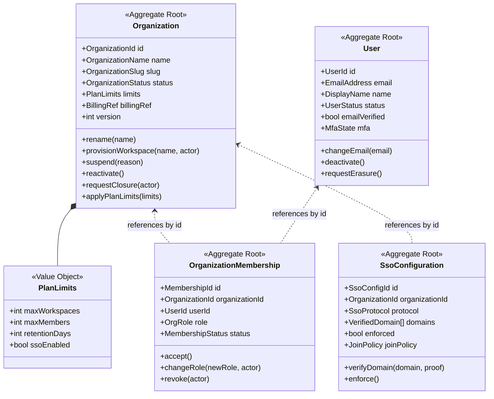
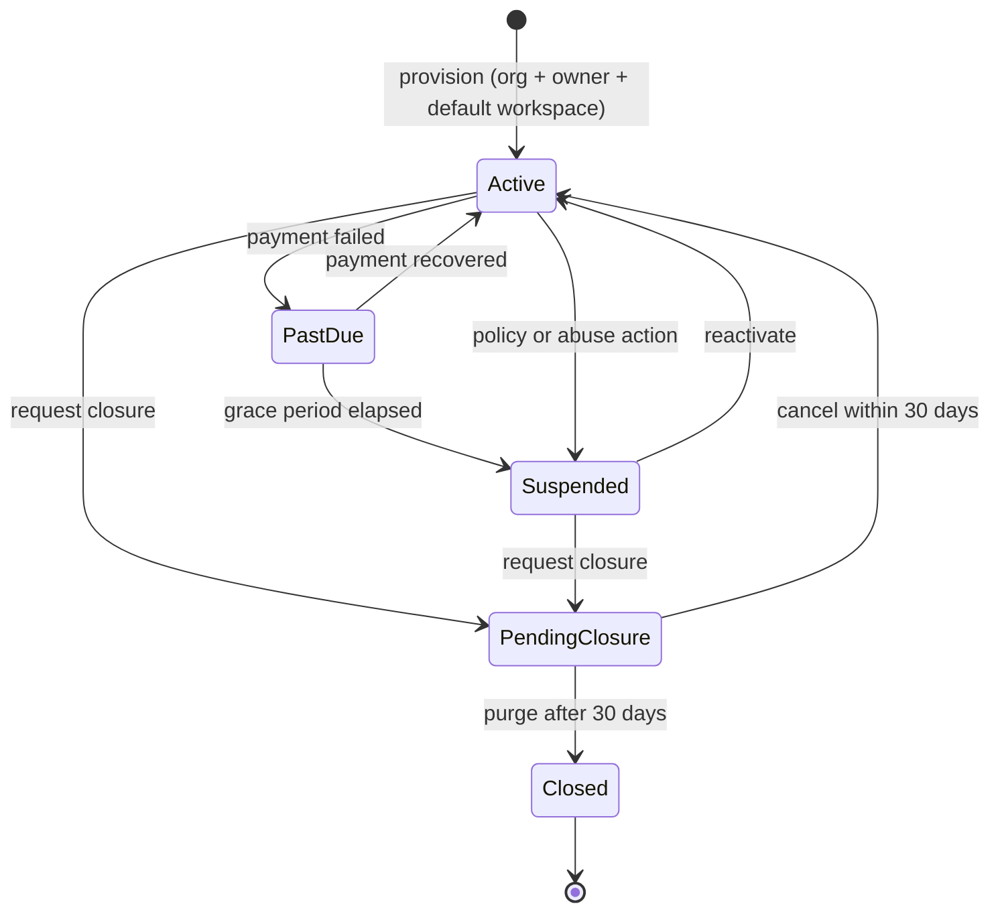
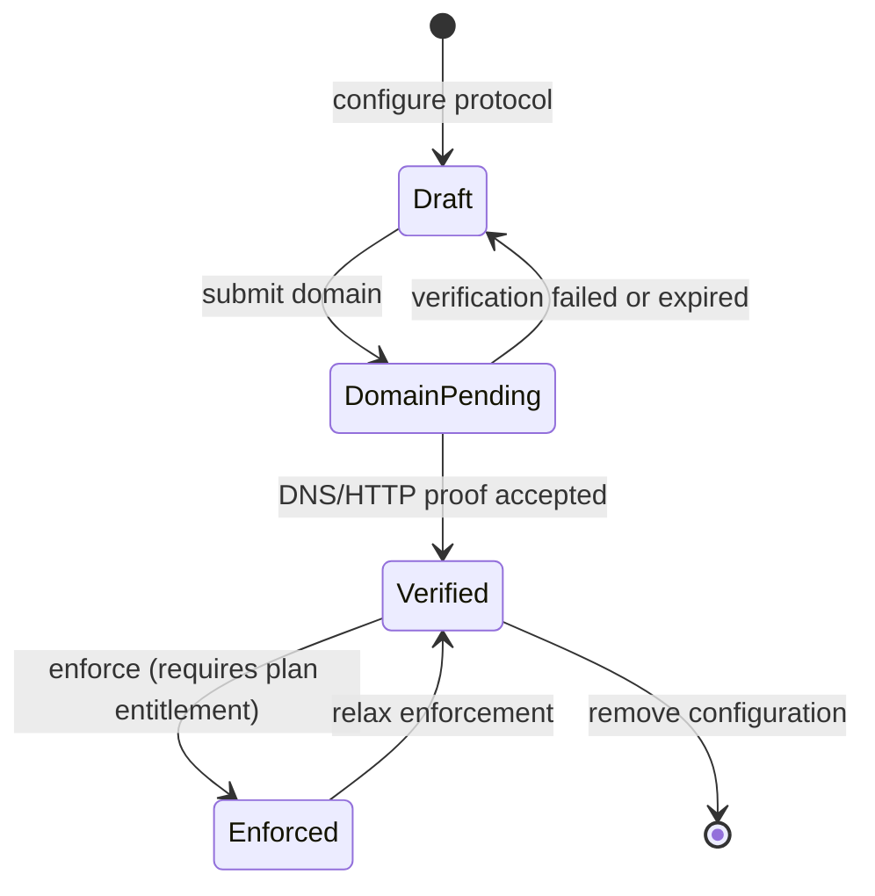

# Organizations Domain

> **Status:** v2.0 — complete. Bounded context: **Identity & Access** (organization half). Introduced by **ADR-017**.
> **Position in the hierarchy:** `User → **Organization** → Workspace → Project → Article`. The organization is the commercial and administrative boundary; it is **not** the isolation boundary.

## Overview

The organization is the customer of record. It holds the commercial relationship, the identity policy, and the administrative span of control over a set of workspaces. A solo creator's organization contains one workspace and is nearly invisible in the UI. An agency's organization contains fifty client workspaces, one subscription, one SSO configuration, and a small group of administrators who govern across all of them without necessarily working inside any of them.

**Business purpose.** Agencies and enterprises buy at the organization level and isolate at the workspace level. Without this tier there is no coherent place to put a subscription that covers many brands, an SSO domain claim that must apply to every brand, or an administrator who can add a client workspace without gaining editorial access to existing ones. ADR-017 records why this was decided before schema design: adding it afterwards means rewriting every table, every RLS policy, and every isolation test.

**Why it is separate from Workspace.** Different rate of change, different authority, different consequences. Organization state changes on commercial events — payment failure, plan change, ownership transfer — and those changes cascade to many workspaces. Workspace state changes on editorial events and cascades to nothing above it. Collapsing them would make a failed payment and a brand-voice edit share a consistency boundary.

## Responsibilities

**This domain owns:**

- The organization aggregate and its lifecycle, including suspension and closure.
- Organization membership and organization-level roles (`org_owner`, `org_admin`, `billing_owner`).
- The **User** aggregate — global identity, since a user exists above and across organizations.
- Identity policy: SSO configuration, verified email domains, and domain-based auto-join rules.
- The workspace quota and the invariants that keep workspace count within the plan's allowance.
- The **boundary contract with Commerce**: what the organization exposes to billing, and what it consumes from it.

**This domain does NOT own:**

| Not owned | Owner |
|---|---|
| Plan, Subscription, Invoice, CreditLedger — the Commerce models | `04-platform/billing.md`, `04-platform/credits.md` |
| Authentication mechanics: password hashing, token issuance, session storage | `04-platform/authentication.md`, `16-security/authentication.md` |
| Workspace membership, settings, or content | `workspace.md` |
| The permission catalogue and its enforcement | `16-security/rbac.md` |
| SSO protocol implementation (SAML/OIDC handshakes) | `09-integrations/better-auth.md` |

The Commerce boundary is the one most often blurred in systems like this. The rule here: **this domain knows an organization has a plan with limits; it does not know what a plan costs, how it is invoiced, or how credits are priced.** It reads limits and reacts to commercial events; it never writes to the ledger.

## Domain Model

| Aggregate root | Why separate |
|---|---|
| **Organization** | Commercial and administrative unit; changes as a whole |
| **OrganizationMembership** | High-frequency independent writes; same reasoning as workspace membership |
| **User** | Exists **above** the tenancy hierarchy — one user, many organizations. Cannot be nested |
| **SsoConfiguration** | Distinct lifecycle (domain verification, enforcement rollout) and distinct authority (`org_owner` only) |

### Value objects

| Value object | Rules |
|---|---|
| `OrganizationId` | UUID v7. Carried as `organization_id` on every workspace-owned row |
| `OrganizationSlug` | Lowercase `[a-z0-9-]`, 3–48 chars, **globally unique**, immutable |
| `OrgRole` | `org_owner` · `org_admin` · `billing_owner` |
| `OrganizationStatus` | `active` · `past_due` · `suspended` · `pending_closure` · `closed` |
| `PlanLimits` | Read-only projection supplied by Commerce: workspace cap, member cap, retention days, SSO entitlement |
| `BillingRef` | Opaque pointer to the Commerce customer record — never a Stripe identifier used directly by this domain |
| `EmailAddress` | Normalized lowercase, RFC-validated, globally unique per user |
| `VerifiedDomain` | Domain plus verification method and timestamp; unverified domains grant nothing |
| `JoinPolicy` | `invite_only` · `domain_auto_join` · `domain_request` |
| `MfaState` | Enrollment status and factor type; mechanics owned by `16-security/authentication.md` |

### Domain services

| Service | Responsibility |
|---|---|
| `OrganizationProvisioningService` | Creates organization, first `org_owner` membership, and the default workspace in one transaction |
| `OrgMembershipPolicyService` | Last-owner protection at org level; role-change authority; `billing_owner` separation of duties |
| `DomainVerificationService` | Verifies domain ownership (DNS TXT or HTTP), enforces global uniqueness of a verified domain claim |
| `WorkspaceQuotaService` | Evaluates whether a new workspace is permitted under current `PlanLimits` |
| `OrganizationClosureService` | Sequences closure: block work, settle commercial state via Commerce, archive workspaces, schedule purge |

## Business Rules

**Structure and ownership**

1. Every workspace belongs to exactly one organization; every organization has **at least one** workspace. Provisioning creates the first one atomically.
2. An organization always has at least one `active` membership with role `org_owner` (**last-owner protection**). Demotion or revocation of the final owner is refused.
3. `org_owner` may grant any org role. `org_admin` may manage `org_admin` and members but **not** `org_owner`, and **not** `billing_owner`. `billing_owner` grants no content or membership authority whatsoever — it is a pure separation-of-duties role.
4. A user may belong to many organizations; identity and email are global, memberships are scoped.
5. Organization slug is globally unique and immutable; renaming changes the display name only.

**Quota and limits**

6. Workspace creation is refused when it would exceed `PlanLimits.maxWorkspaces`, evaluated inside the creating transaction.
7. A plan **downgrade that puts an organization over quota never deletes anything.** Over-quota workspaces become read-only, the organization is notified, and an administrator chooses what to archive. Automatic deletion on downgrade is prohibited.
8. `PlanLimits` are applied, never authored, here. They arrive via `SubscriptionChanged` from Commerce and are stored as a projection.

**Identity policy**

9. A domain may be verified by **at most one** organization globally; a second claim is refused, since domain-based auto-join across organizations would be an account-takeover vector.
10. SSO can only be enforced when at least one domain is verified and `PlanLimits.ssoEnabled` is true.
11. When SSO is `enforced`, password authentication is refused for users whose email matches a verified domain — **except** for `org_owner` accounts, which retain a break-glass path so a misconfigured SSO cannot lock an organization out of itself.
12. `domain_auto_join` grants membership at the **organization** level only, never workspace membership. New members see no content until a workspace admin adds them somewhere.

**Status and cascade**

13. `past_due` is a warning state: full function, persistent notification, no new workspaces.
14. `suspended` blocks all runs and publishing across every workspace; reads remain available so customers can export their data.
15. Suspension and reactivation **cascade to workspaces**, and reactivation restores each workspace to its recorded prior status rather than forcing `active` (`workspace.md` rule 19).
16. `pending_closure` opens a 30-day window: read-only, export available, cancellable. After it, workspaces are purged and the erasure is recorded in the erasure log.
17. Closure is refused while commercial state is unsettled; the check is delegated to Commerce, which owns the answer.

**Users**

18. A user cannot be hard-deleted while holding memberships; erasure deactivates the account, anonymizes personal fields, and preserves authorship references as an anonymized actor so audit and revision history stay intact.
19. Email changes require re-verification and do not alter existing memberships.
20. Deactivating a user revokes every session immediately across all organizations.

## Lifecycle

SSO configuration lifecycle:

## Domain Events

Emitted through the outbox in the state-changing transaction (ADR-020).

| Event | Producer | Consumers | Payload | Retry / failure |
|---|---|---|---|---|
| `OrganizationCreated` | Organization | Workspace (default provisioning), Commerce, Notifications | `{ organizationId, name, slug, createdBy }` | 5 attempts, backoff, DLQ |
| `OrganizationRenamed` | Organization | Read models | `{ organizationId, name, previousName }` | As above |
| `OrganizationSuspended` | Organization | **Workspace (cascade)**, Orchestrator, Credits, Notifications | `{ organizationId, reason, suspendedAt }` | Critical — DLQ entry pages |
| `OrganizationReactivated` | Organization | Workspace (cascade), Notifications | `{ organizationId }` | Critical |
| `OrganizationClosureRequested` | Organization | Workspace, Retention worker, Commerce, Notifications | `{ organizationId, purgeAfter }` | Critical |
| `OrganizationClosed` | Closure service | Audit, Storage cleanup, Erasure log | `{ organizationId, closedAt }` | Critical |
| `WorkspaceProvisioned` | Organization | Workspace, Read models | `{ organizationId, workspaceId, name }` | Standard |
| `OrgMembershipInvited` | OrgMembership | Notifications | `{ organizationId, inviteeEmail, role, invitedBy, expiresAt }` | Standard |
| `OrgMembershipAccepted` | OrgMembership | Permission cache invalidation, Read models | `{ organizationId, userId, role }` | Standard |
| `OrgMembershipRoleChanged` | OrgMembership | Permission cache invalidation, Audit | `{ organizationId, userId, previousRole, role, changedBy }` | Critical |
| `OrgMembershipRevoked` | OrgMembership | **Workspace (revoke all)**, Permission cache, Sessions, Audit | `{ organizationId, userId, revokedBy }` | Critical — stale permissions are a security issue |
| `SsoConfigured` | SsoConfiguration | Audit, Notifications | `{ organizationId, protocol, domains[] }` | Standard |
| `SsoEnforced` | SsoConfiguration | Authentication, Sessions, Notifications | `{ organizationId, domains[] }` | Critical |
| `DomainVerified` | SsoConfiguration | Audit, Join policy evaluation | `{ organizationId, domain, method }` | Standard |
| `UserRegistered` | User | Notifications, Analytics | `{ userId, emailHash }` — **hash, not address** | Standard |
| `UserDeactivated` | User | Sessions (revoke all), Memberships, Audit | `{ userId }` | Critical |
| `UserErasureRequested` | User | Retention worker, Erasure log, Audit | `{ userId, requestedAt }` | Critical |

**Consumed events**

| Event | Source | Reaction |
|---|---|---|
| `SubscriptionChanged` | Commerce | Update `PlanLimits` projection; re-evaluate quota; mark over-quota workspaces read-only, never delete |
| `PaymentFailed` | Commerce | Transition to `past_due`; start the grace timer |
| `PaymentRecovered` | Commerce | Return to `active`; clear the timer |
| `SubscriptionCancelled` | Commerce | Begin closure sequence at period end |

## Relationships

| Relates to | Nature |
|---|---|
| **Workspace** | Owns many; cascades suspension, reactivation, and closure (`workspace.md`) |
| **Project / Article / all content** | Indirect — every workspace-owned row carries `organization_id` so org-scoped reporting never joins across tenants |
| **Platform Layer / Commerce** | Customer-of-record relationship. This domain exposes `BillingRef` and consumes `PlanLimits`; it never writes commercial state (`04-platform/billing.md`) |
| **AI Platform** | Indirect — AI spend is metered per workspace and aggregated per organization for reporting (`04-platform/credits.md`) |
| **Knowledge Platform** | No direct relationship; knowledge is workspace-scoped by design, and this is deliberate — an agency's clients must not share an Evidence Bank |
| **Storage Platform** | `organization_id` participates in reporting indexes; it is **never** part of an isolation key, which is always `tenant_id` |
| **Event Platform** | All events above flow through the outbox and `EventBus` (ADR-020) |

## Database Impact

| Table | Notes |
|---|---|
| `users` | PK `id`; `email` (citext, unique), `name`, `status`, `email_verified`, `mfa_state`, audit fields, `deleted_at` |
| `organizations` | PK `id`; `slug` (unique), `name`, `status`, `plan_limits JSONB`, `billing_ref`, `version`, audit fields, `deleted_at` |
| `organization_memberships` | PK `id`; FKs `organization_id`, `user_id`; `role`, `status`, `expires_at`, audit fields |
| `sso_configurations` | PK `id`; FK `organization_id`; `protocol`, `config JSONB` (secrets by reference only), `enforced` |
| `verified_domains` | PK `id`; FK `organization_id`; `domain` (**globally unique**), `verified_at`, `method` |

**Constraints:** `UNIQUE (organization_id, user_id)` on org memberships; `UNIQUE (domain)` on `verified_domains` — the database enforces the one-organization-per-domain rule, not application code; `CHECK` constraints on all status columns; FKs with `ON DELETE RESTRICT` throughout.

**Indexes:** `(user_id, status)` for "my organizations"; `(organization_id, role)` for admin consoles; `(status)` partial index for the past-due and pending-closure sweeps.

**RLS — the documented exception.** `users`, `organizations`, `organization_memberships`, `sso_configurations`, and `verified_domains` sit **above** the workspace boundary and therefore cannot carry `tenant_id`. They are the only tables in `public` exempt from the standard `tenant_id` policy, and the exemption is explicit: each is registered in the RLS-coverage allowlist with a written justification, and each carries an alternative policy keyed on organization membership (`10-testing/integration-testing.md` §8). A user may read only organizations they belong to; `verified_domains` is readable only by that organization's admins. No other table may claim this exemption.

**Soft delete.** `users` and `organizations` use `deleted_at` with a 30-day window; memberships use `revoked` status; `verified_domains` are hard-deleted on removal so the global uniqueness constraint frees immediately.

## API Impact

| Surface | Operations |
|---|---|
| REST | `GET/POST /v1/organizations`, `GET/PATCH /v1/organizations/{id}`, `POST /v1/organizations/{id}/suspend|reactivate|close`, `GET/POST /v1/organizations/{id}/members`, `PATCH/DELETE .../members/{userId}`, `GET/PUT /v1/organizations/{id}/sso`, `POST /v1/organizations/{id}/domains/{domain}/verify`, `GET/PATCH /v1/users/me` |
| Internal | `WorkspaceQuotaService.check(orgId)`; `EffectivePermissionResolver` reads org role as one input (`workspace.md`) |
| Events | As tabled above |
| Workers | Past-due grace-timer sweep; closure purge worker; domain-verification retry; invitation expiry |

## Security

Domain-specific rules; controls in `16-security/`.

- **`billing_owner` is a pure separation-of-duties role** — no content access, no membership authority. It exists so finance staff need not be granted editorial power.
- **Break-glass:** `org_owner` accounts retain password authentication even under enforced SSO, preventing a misconfigured identity provider from locking an organization out permanently. This is a deliberate, documented trade-off and those accounts must have MFA enrolled.
- **Domain verification is a privilege escalation surface.** Verification proof is checked server-side, is globally unique, and every verification is audit-logged.
- Organization-level actions — suspension, closure, SSO enforcement, role changes — are always audit-logged with actor and reason.
- `UserRegistered` carries a hashed email, never the address, because event payloads reach more consumers than the user record does.
- Cross-organization access attempts return `404`, consistent with the workspace rule.

## Performance

- `PlanLimits` are a stored projection, so quota checks are a single row read rather than a call into Commerce on every workspace create.
- The organization's workspace list is a read model projecting `{ workspaceId, name, status, memberCount, articleCount }`, maintained from workspace events — the agency console must not fan out queries across fifty tenants.
- Org membership and role are cached alongside workspace permissions under one `(user_id, workspace_id)` key, since effective permission is their union; both invalidate on either role-change event.
- Suspension cascade is processed asynchronously per workspace with idempotent handlers, so an organization with hundreds of workspaces does not block the request that triggered it.
- Optimistic concurrency on `Organization` prevents concurrent plan-limit application and manual edits from interleaving incorrectly.

## Failure Handling

| Failure | Handling |
|---|---|
| Provisioning fails after organization insert | One transaction covers organization + owner membership + default workspace + outbox event; partial organizations cannot exist |
| Cascade suspension partially applied | Handlers idempotent per `workspaceId`; retried to completion; DLQ entry pages because an active workspace under a suspended organization is a revenue-integrity failure |
| `SubscriptionChanged` arrives out of order | Payload carries the subscription's own version; older versions are ignored rather than applied |
| Domain verification race between two organizations | Database unique constraint decides; the loser receives a typed `DomainAlreadyClaimed` |
| SSO misconfiguration locks users out | Break-glass owner path (rule 11) plus a support-initiated `relax enforcement` action, both audit-logged |
| Closure requested with unsettled commercial state | Refused with a typed error citing Commerce as the authority; never partially executed |
| Erasure request for a user with active memberships | Memberships revoked first, then anonymization; authorship references survive as an anonymized actor |

## Observability

- **Metrics:** `organizations_total{status}`, `workspaces_per_organization` (histogram), `quota_rejections_total`, `sso_enforced_total`, `domain_verifications_total{result}`, `cascade_duration_seconds`, `past_due_organizations`.
- **Logs:** every status transition, role change, SSO change, and domain verification, with actor, organization, correlation id, and reason.
- **Traces:** provisioning and cascade operations are traced end to end, so a slow agency-wide suspension is diagnosable per workspace.
- **Alerts:** any critical event in the DLQ (page); organizations stuck in `past_due` beyond the grace period; `pending_closure` past its purge date; a spike in `quota_rejections_total`, which usually signals a plan-limit projection that failed to update.

## Future Expansion

- **Nested organizations / business units** for enterprises that need a hierarchy above workspace but below organization. Deliberately excluded from v1 — a third tier multiplies permission-resolution complexity and is not required by any current segment.
- **SCIM provisioning** for enterprise directory sync, layering on `OrgMembership` without changing it.
- **Organization-level data residency** once multi-region ships (OQ-7); the organization is the natural pinning unit because it is the commercial entity.
- **Workspace transfer between organizations** (see `workspace.md` Future Expansion) — requires a consent and ownership-transfer protocol defined here.
- **Cross-workspace roles** — for example a reviewer with access to a defined subset of an agency's workspaces, once the permission catalogue supports composition.

## Cross References

- `workspace.md` — the child aggregate and the cascade rules
- `01-system-architecture/13-adr-log.md` — ADR-017, which established this tier
- `01-system-architecture/04-context-map.md` — Identity & Access as the shared kernel; the Commerce seam
- `04-platform/billing.md` · `04-platform/credits.md` — the Commerce models this domain bounds
- `04-platform/authentication.md` · `09-integrations/better-auth.md` — authentication and SSO mechanics
- `16-security/rbac.md` · `16-security/authentication.md` — permission catalogue, MFA, session policy
- `03-database/tables.md` — physical schema, including the documented RLS exemption
- `14-operations/backup-recovery.md` — erasure-log replay on restore

## Open Questions

- **OQ-7** — data residency; the organization is the intended pinning unit.
- **OQ-10** — credit pricing determines how usage aggregates from workspaces to the organization's invoice.
- **OQ-26** — ADR authority as the team grows; recorded here because organization-level governance and documentation governance are answered by the same person today.
