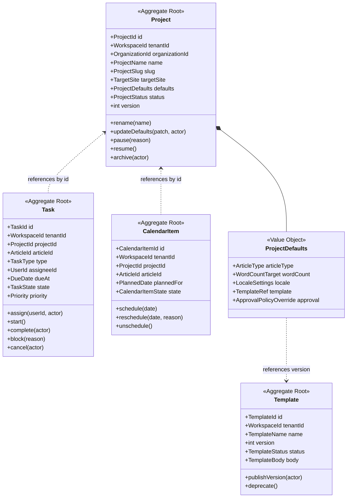
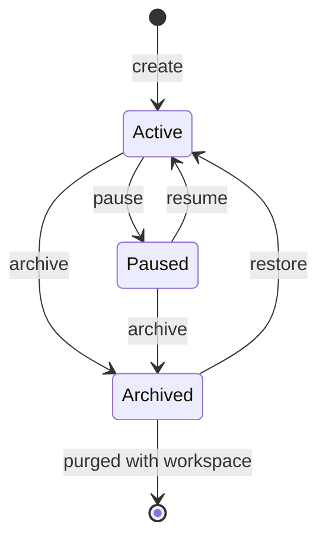
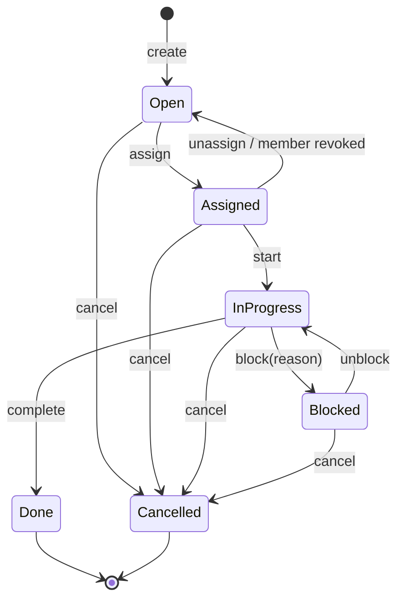
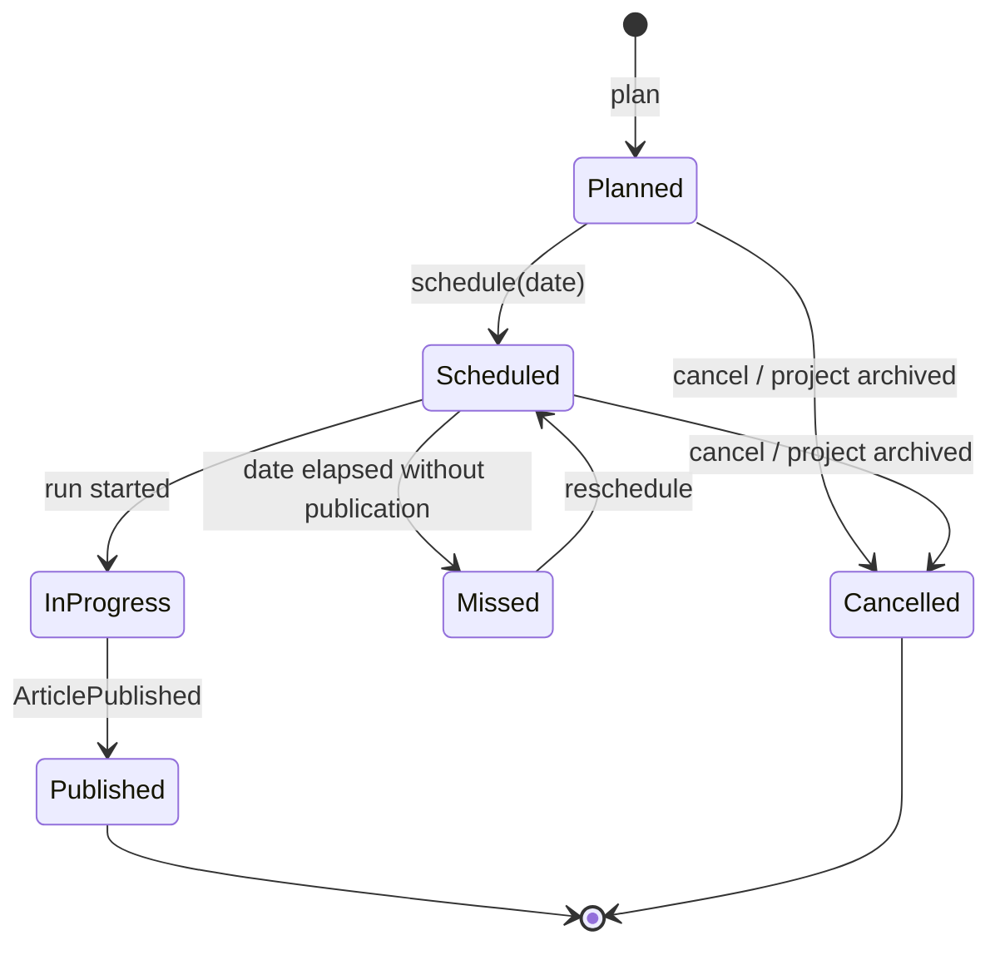

# Projects Domain

> **Status:** v2.0 — complete. Bounded context: **Work Management**.
> **Position in the hierarchy:** `User → Organization → Workspace → **Project** → Article` (ADR-017). Every project carries `tenant_id` (its workspace) and `organization_id`.

## Overview

A project is how content work is organized, scheduled, and assigned inside a workspace. In practice it maps to a site, a client campaign, or a content pillar: a target domain, a set of defaults every article inherits, a backlog of planned work, and a calendar.

**Business purpose.** Content teams do not think in individual articles; they think in campaigns with deadlines, owners, and a shared strategy. Without a project layer, a workspace with four hundred articles is an undifferentiated list, defaults must be re-entered per article, and there is nowhere to answer "what is this quarter's pillar and who is behind on it." The project is also the natural reporting unit — performance is judged per site or campaign, not per workspace.

**Why this domain is separate from Articles.** Work Management concerns *human process*: who is assigned, what is due, what is planned. Authoring concerns *content state*: outline approved, draft complete, gate passed. These change independently — reassigning an article does not alter its content state, and passing a quality gate does not change who owns it. Keeping them apart also prevents the editorial workflow from being confused with the execution workflow (Temporal), a distinction `01-system-architecture/05-glossary.md` makes normative.

## Responsibilities

**This domain owns:**

- The project aggregate: identity, target site, defaults, status, and lifecycle.
- Project-level defaults that articles inherit at creation: article type, target length, locale, template, approval policy override.
- Tasks: human work items with an assignee, due date, and state.
- The content calendar: planned and scheduled items.
- Templates: reusable production configurations, versioned.
- Assignment rules and the editorial workflow states an article moves through *as human work*.

**This domain does NOT own:**

| Not owned | Owner |
|---|---|
| Article content, outlines, revisions, quality reports | `articles.md` |
| The article's content lifecycle state machine | `articles.md` |
| Execution workflow, activities, retries, durable timers | `01-system-architecture/10-event-flow.md`, Temporal |
| Keyword and SERP data | `research.md` |
| Publish targets and attempts | `publishing.md` |
| Performance measurement | `analytics.md` |
| Workspace settings and membership | `workspace.md` |
| Notification delivery | `04-platform/notifications.md` |

**Boundary rule:** a task *references* an article; it never contains one. An article's editorial state (`assigned`, `in_progress`, `needs_review`) lives on the Task; its content state (`drafting`, `in_review`, `published`) lives on the Article. Both exist, they are not duplicates, and neither may be derived from the other.

## Domain Model

| Aggregate root | Why separate |
|---|---|
| **Project** | The organizing unit and defaults holder; low write frequency |
| **Task** | High-frequency independent writes (assign, start, complete); a backlog of thousands must not contend on one project row |
| **CalendarItem** | Distinct lifecycle from Task — an item can be planned before any work item exists, and rescheduling is a different act from reassigning |
| **Template** | Versioned and immutable once published; shared across projects within a workspace |

### Value objects

| Value object | Rules |
|---|---|
| `ProjectSlug` | Lowercase `[a-z0-9-]`, 3–48 chars, unique **within the workspace**, immutable |
| `TargetSite` | Canonical domain plus optional path prefix; validated as a hostname; used to join Analytics and to scope publish targets |
| `ProjectStatus` | `active` · `paused` · `archived` |
| `TaskType` | `write` · `review` · `approve` · `optimize` · `refresh` · `custom` |
| `TaskState` | `open` · `assigned` · `in_progress` · `blocked` · `done` · `cancelled` |
| `Priority` | `low` · `normal` · `high` · `urgent` — ordering only; it confers no scheduling privilege in the execution plane |
| `DueDate` | Date in the workspace's locale timezone; stored UTC |
| `CalendarItemState` | `planned` · `scheduled` · `in_progress` · `published` · `missed` · `cancelled` |
| `ProjectDefaults` | Inherited by articles **at creation only**; later changes never mutate existing articles |
| `TemplateRef` | `(templateId, version)` — always version-pinned, never "latest" |
| `TemplateStatus` | `draft` · `published` · `deprecated` |

### Domain services

| Service | Responsibility |
|---|---|
| `ProjectProvisioningService` | Creates a project with defaults; enforces slug uniqueness and workspace status |
| `AssignmentPolicyService` | Validates that an assignee is an active workspace member with a role permitting the task type |
| `CalendarSchedulingService` | Enforces scheduling rules: no scheduling into an archived project, no duplicate active item per article |
| `TemplateVersioningService` | Publishes an immutable template version; resolves a `TemplateRef` for inheritance |
| `WorkloadProjectionService` | Builds per-assignee workload views from task events (read model, not an aggregate) |

## Business Rules

**Ownership and structure**

1. A project belongs to **exactly one** workspace, fixed at creation. `tenant_id` is that workspace; `organization_id` is denormalized from it.
2. `slug` is unique per workspace and immutable.
3. A project cannot be created in a workspace that is `suspended`, `archived`, or `pending_deletion`.
4. Every article belongs to exactly one project. An article cannot exist without one; workspaces therefore always have at least a default project, created with the workspace (`workspace.md` event `WorkspaceCreated`).
5. Articles **cannot move between projects** in v1. Project defaults, target site, and performance history all key on the project, so a move is a data migration rather than a field update.

**Defaults and templates**

6. `ProjectDefaults` are inherited by an article **at creation time only**. Changing defaults never retroactively alters existing articles — a rule that keeps in-flight and completed work reproducible.
7. `TemplateRef` is always version-pinned. A published template version is **immutable**; corrections ship as a new version.
8. A template may only be deprecated, never deleted, while any project or article references a version of it.
9. A project's `ApprovalPolicyOverride` may make approval **stricter** than the workspace policy, never weaker. Loosening happens at workspace level, where the authority sits (`workspace.md` rule 15).

**Tasks**

10. A task references exactly one article and one project, and the article must belong to that project.
11. An assignee must be an **active workspace member** whose role permits the task type: `approve` requires `admin` or `owner`; `write`, `review`, `optimize`, `refresh` require `editor` or above; `viewer` can hold no task.
12. An article has **at most one open task per task type** at a time. A second `review` task for the same article is refused; reassignment mutates the existing task.
13. `done` and `cancelled` are terminal. Reopening creates a new task, preserving history.
14. When a workspace membership is revoked, that user's non-terminal tasks move to `open` with the assignee cleared, and the project's administrators are notified. Tasks are never silently deleted.
15. A task may be `blocked` with a reason; blocked tasks are excluded from workload capacity but remain in the backlog.
16. Tasks do not drive the pipeline. Completing a `write` task does not start drafting, and drafting does not complete the task — the two planes are linked by events, not by control flow.

**Calendar**

17. An article has at most one **active** calendar item (`planned`, `scheduled`, or `in_progress`); historical items remain for audit.
18. Scheduling into the past is refused; rescheduling requires a reason and is recorded.
19. A `scheduled` item whose date passes without publication transitions to `missed` by a scheduled sweep, and notifies the project's administrators. `missed` is a signal, not a failure state — the item may still be rescheduled.
20. Archiving a project cancels its `planned` and `scheduled` items; `in_progress` items are allowed to complete.

**Status**

21. `paused` blocks new runs and new tasks; existing runs finish; the backlog remains readable.
22. `archived` is read-only: no new articles, tasks, or calendar items. Existing articles remain readable and their published content remains live — archiving a project never unpublishes anything.

## Lifecycle

Project:

Task:

Calendar item:

## Domain Events

Written to the outbox in the state-changing transaction (ADR-020).

| Event | Producer | Consumers | Payload | Retry / failure |
|---|---|---|---|---|
| `ProjectCreated` | Project | Read models, Analytics (site registry), Notifications | `{ projectId, tenantId, organizationId, name, slug, targetSite }` | 5 attempts, backoff, DLQ |
| `ProjectDefaultsUpdated` | Project | Read models, Audit | `{ projectId, changedKeys[], changedBy }` | Standard |
| `ProjectPaused` / `ProjectResumed` | Project | Orchestrator (block/allow new runs), Notifications | `{ projectId, reason? }` | Standard |
| `ProjectArchived` | Project | Orchestrator, Calendar (cancel items), Analytics (stop collection) | `{ projectId, archivedBy }` | Standard |
| `TaskCreated` | Task | Notifications, Workload read model | `{ taskId, projectId, articleId, type, priority, dueAt }` | Standard |
| `TaskAssigned` | Task | Notifications (assignee), Workload read model | `{ taskId, assigneeId, assignedBy }` | Standard |
| `TaskStarted` | Task | Workload read model | `{ taskId, startedAt }` | Standard |
| `TaskBlocked` | Task | Notifications, Workload read model | `{ taskId, reason }` | Standard |
| `TaskCompleted` | Task | Workload read model, Calendar, Notifications | `{ taskId, completedBy, completedAt }` | Standard |
| `TaskCancelled` | Task | Workload read model | `{ taskId, cancelledBy, reason }` | Standard |
| `CalendarItemScheduled` | CalendarItem | Scheduler worker, Notifications, Read models | `{ calendarItemId, articleId, plannedFor }` | Standard |
| `CalendarItemRescheduled` | CalendarItem | Scheduler worker, Notifications | `{ calendarItemId, previousDate, plannedFor, reason }` | Standard |
| `CalendarItemMissed` | Calendar sweep | Notifications, Read models | `{ calendarItemId, articleId, plannedFor }` | Standard |
| `TemplateVersionPublished` | Template | Read models, Audit | `{ templateId, version, publishedBy }` | Standard |
| `TemplateDeprecated` | Template | Read models, Notifications | `{ templateId, version }` | Standard |

**Consumed events**

| Event | Source | Reaction |
|---|---|---|
| `WorkspaceCreated` | Workspace | Provision the default project |
| `WorkspaceArchived` / `WorkspaceSuspended` | Workspace | Archive or pause all projects in that workspace |
| `MembershipRevoked` | Workspace | Unassign that user's non-terminal tasks; notify project administrators |
| `ArticleCreated` | Articles | Optionally create the initial `write` task per project policy |
| `OutlineReady` | Articles | Create an `approve` task when the project's approval policy requires human approval |
| `QualityGateBlocked` | Articles | Create a `review` task assigned per project policy |
| `ArticlePublished` | Publishing | Transition the article's active calendar item to `published`; complete the open `write` task |

## Relationships

| Relates to | Nature |
|---|---|
| **Workspace** | Parent. Supplies defaults ceiling, membership for assignment validation, and cascade on suspension/archival (`workspace.md`) |
| **Organization** | Indirect via `organization_id`, carried for org-level reporting (`organizations.md`) |
| **Articles** | Children by reference. Project supplies creation-time defaults; article content state is not owned here (`articles.md`) |
| **Research** | Project's `TargetSite` and locale scope keyword and SERP work (`research.md`) |
| **Publishing** | Publish targets are configured per project, since a project maps to a site (`publishing.md`) |
| **Analytics** | Performance aggregates at project level; `TargetSite` is the join key to GSC/GA properties (`analytics.md`) |
| **AI Platform** | Indirect — project defaults feed the brief, which the Context Builder consumes (`08-ai-platform/context-builder.md`) |
| **Knowledge Platform** | No direct ownership; evidence is workspace-scoped and shared across projects within a workspace |
| **Platform Layer** | Notifications delivers task and calendar alerts (`04-platform/notifications.md`); Workflow service surfaces editorial state (`04-platform/workflow.md`) |
| **Event Platform** | All events flow through the outbox and `EventBus` (ADR-020) |

## Database Impact

| Table | Notes |
|---|---|
| `projects` | PK `id`; `tenant_id`, `organization_id`, `name`, `slug`, `target_site`, `defaults JSONB`, `status`, `version`, audit fields, `deleted_at` |
| `tasks` | PK `id`; `tenant_id`, `project_id`, `article_id`, `type`, `assignee_id`, `state`, `priority`, `due_at`, `blocked_reason`, audit fields |
| `calendar_items` | PK `id`; `tenant_id`, `project_id`, `article_id`, `planned_for`, `state`, audit fields |
| `templates` | PK `id`; `tenant_id`, `name`, `status`, audit fields |
| `template_versions` | PK `(template_id, version)`; `body JSONB`, `published_at`, `published_by` — **append-only, immutable** |

**Constraints**

- `UNIQUE (tenant_id, slug)` on projects.
- Partial unique index `(article_id, type) WHERE state NOT IN ('done','cancelled')` — enforces "one open task per type per article" in the database (rule 12).
- Partial unique index `(article_id) WHERE state IN ('planned','scheduled','in_progress')` on calendar items — enforces rule 17.
- `CHECK` constraints on every enum column; `CHECK (planned_for >= created_at::date)` on new calendar items.
- FKs: `project_id → projects(id)` `ON DELETE RESTRICT`; `article_id → articles(id)` `ON DELETE RESTRICT`; `assignee_id → users(id)` `ON DELETE SET NULL` (a deleted user must not delete task history).

**Indexes:** `(tenant_id, project_id, state)` on tasks for backlog views; `(assignee_id, state, due_at)` for "my work"; `(tenant_id, planned_for)` on calendar items for month views; `(tenant_id, status)` on projects.

**RLS.** All five tables carry `tenant_id` and the standard workspace policy; all are covered by the mandatory isolation suite. `template_versions` inherits `tenant_id` through its parent and carries it denormalized so the policy applies without a join.

**Soft delete.** `projects` and `templates` use `deleted_at` with 30-day purge. `tasks` and `calendar_items` use terminal states (`cancelled`) rather than deletion, preserving history. `template_versions` are append-only and never deleted while referenced.

## API Impact

| Surface | Operations |
|---|---|
| REST | `GET/POST /v1/projects`, `GET/PATCH /v1/projects/{id}`, `POST /v1/projects/{id}/pause|resume|archive`, `GET/POST /v1/projects/{id}/tasks`, `PATCH /v1/tasks/{id}` (assign, start, block, complete, cancel), `GET/POST /v1/projects/{id}/calendar`, `PATCH /v1/calendar/{id}`, `GET/POST /v1/templates`, `POST /v1/templates/{id}/versions` |
| Internal | `ProjectDefaults.resolve(projectId)` — called by article creation; `AssignmentPolicyService.validate(assignee, taskType)` |
| Events | As tabled above |
| Workers | Calendar sweep (missed detection, due-date reminders); task reminder notifier; workload read-model projector |

Collection endpoints are cursor-paginated and filterable by `state`, `assigneeId`, `dueAt` range, and `projectId`, per `06-api/README.md` conventions.

## Security

Domain-specific rules; controls in `16-security/rbac.md`.

- Assignment is an authorization decision: assigning an `approve` task to a `viewer` is refused at the domain level, not merely hidden in the UI.
- A project's `ApprovalPolicyOverride` may only tighten workspace policy (rule 9), so a project admin cannot weaken a workspace-level compliance control.
- Task and calendar payloads carry identifiers and dates only — never article content or brief text, since these events reach notification channels including email.
- Archiving a project never unpublishes live content; unpublishing is an explicit Distribution action with its own permission (`publishing.md`).
- Every project defaults change, template publication, and archival is audit-logged with actor.

## Performance

- **Backlog and calendar views are read models** projected from task and calendar events, denormalizing article title and status so the board renders without joining into Authoring.
- Cursor pagination throughout; a workspace with 400 articles and 1,200 tasks must never load unbounded lists.
- `ProjectDefaults` are cached per `projectId` and invalidated on `ProjectDefaultsUpdated`; article creation reads from cache.
- Template versions are immutable and therefore cached indefinitely by `(templateId, version)`.
- Optimistic concurrency on `Project` and `Task`; concurrent assignment attempts resolve deterministically, with the loser receiving a typed conflict rather than silently overwriting.
- The calendar sweep runs as a scheduled BullMQ job per workspace, batched, so a large tenant does not create a thundering herd at midnight.

## Failure Handling

| Failure | Handling |
|---|---|
| Assignment to a revoked member | Refused at the domain level; if the revocation event arrives after assignment, the consumer unassigns and notifies |
| Duplicate task creation from a retried event | Partial unique index rejects the duplicate; the consumer treats the constraint violation as success (idempotent) |
| Calendar sweep misses a run | Idempotent by `calendarItemId`; the next sweep detects and transitions the item |
| `ArticlePublished` arrives with no matching calendar item | No-op, logged at `info` — publishing outside the calendar is legitimate |
| Project archived with in-flight runs | Runs continue to completion; new runs refused; calendar items cancelled |
| Template version referenced after deprecation | Existing references continue to resolve — deprecation blocks new adoption only |
| Workload projection falls behind | Read model is rebuildable by replaying task events from the outbox; the board shows a staleness indicator rather than wrong data |

## Observability

- **Metrics:** `projects_total{status}`, `tasks_total{type,state}`, `task_cycle_time_seconds{type}`, `tasks_overdue`, `calendar_items_missed_total`, `assignment_rejections_total`, `workload_projection_lag_seconds`.
- **Logs:** every task state transition and calendar reschedule with actor, reason, article, and correlation id.
- **Traces:** article creation spans include project-defaults resolution, so a slow create is attributable.
- **Alerts:** workload projection lag above 60 s; `calendar_items_missed_total` rising sharply (usually a paused project nobody noticed); tasks stuck `in_progress` beyond a workspace-configured threshold; DLQ entries on `MembershipRevoked` consumption, since orphaned assignments are a permissions concern.

## Future Expansion

- **Portfolio planning above projects** — quarterly strategy across projects, likely the point at which Work Management splits (`01-system-architecture/04-context-map.md` Future Roadmap).
- **Dependencies between tasks** (blocked-by relationships) and critical-path views.
- **Capacity planning** from historical cycle time, feeding realistic due dates.
- **Recurring calendar items** for programmatic content and scheduled refresh cycles.
- **Article movement between projects**, once a migration path for defaults and performance history exists.
- **Client-visible project views** for agencies — read-only external access scoped to one project (related to the guest-membership idea in `workspace.md`).

## Cross References

- `workspace.md` — parent aggregate, membership used for assignment
- `organizations.md` — org-level reporting via `organization_id`
- `articles.md` — the content aggregate this domain organizes; the content/editorial state split
- `research.md` — how `TargetSite` and locale scope discovery
- `publishing.md` — publish targets configured per project
- `analytics.md` — project-level performance aggregation
- `04-platform/workflow.md` — the editorial workflow service implementing this domain
- `04-platform/notifications.md` — delivery of task and calendar alerts
- `03-database/tables.md` · `03-database/indexes.md` — physical schema
- `06-api/README.md` — pagination, filtering, and error conventions

## Open Questions

- **OQ-5** — the collaboration model affects whether tasks need sub-assignments and concurrent editing semantics.
- **OQ-15** — default approval policy shapes whether `approve` tasks are created automatically per project.
- Whether `Task` and `CalendarItem` should merge once recurring scheduling arrives; they are deliberately separate today because planning and assignment are different acts. Recorded in `99-open-questions.md`.
