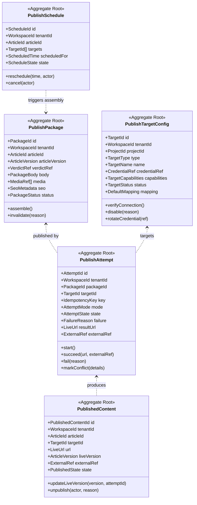
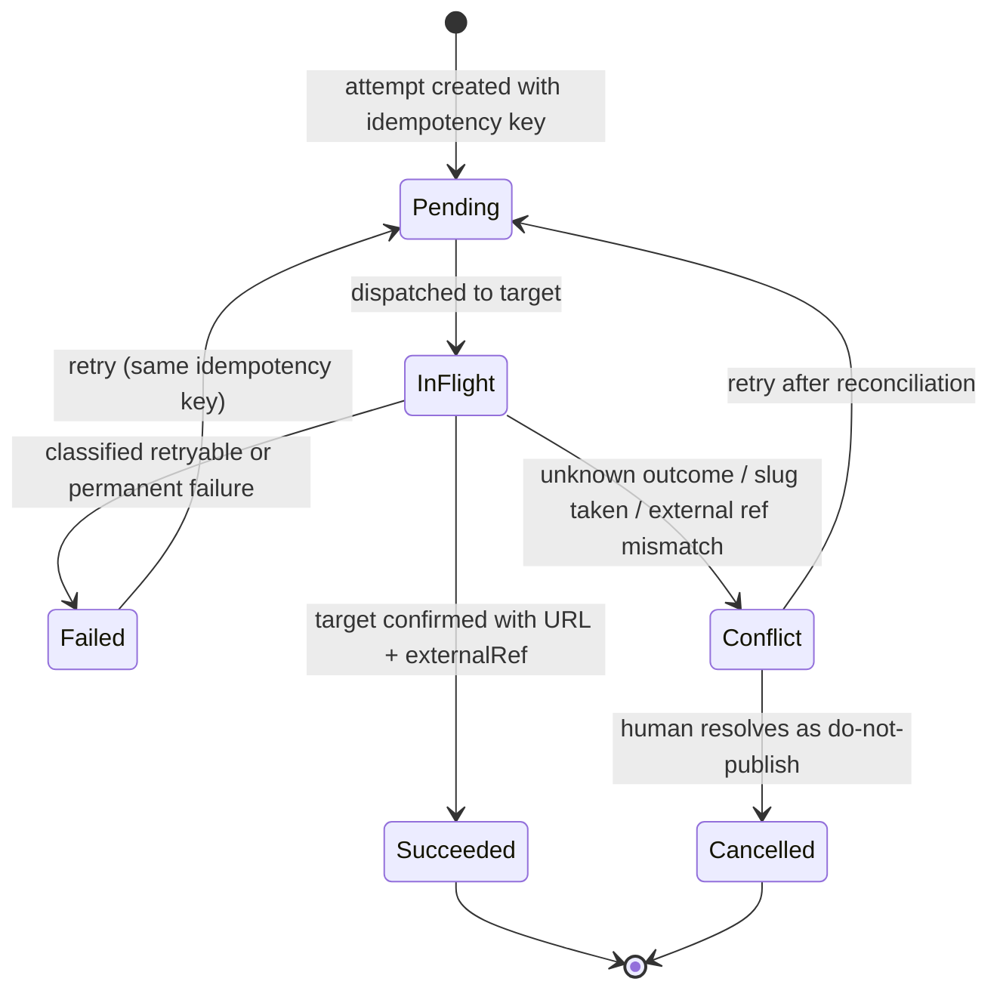
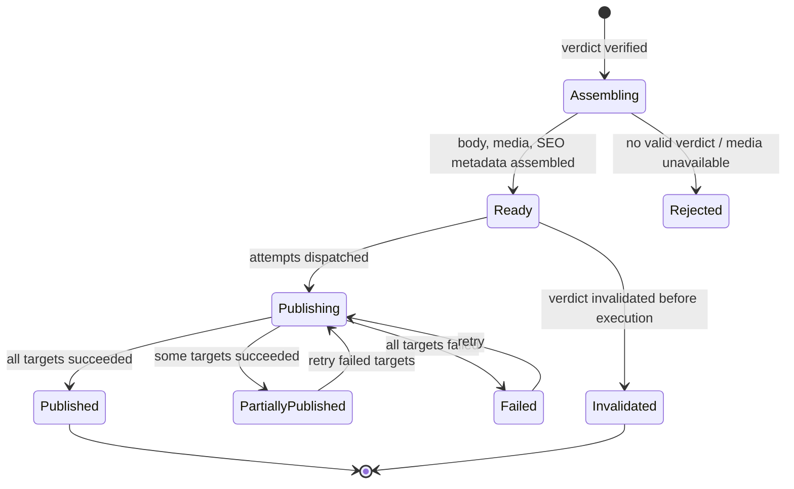
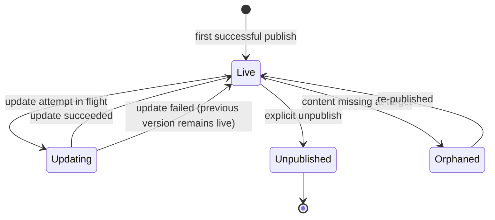

# Publishing Domain

> **Status:** v2.0 — complete. Bounded context: **Distribution**.
> **Position in the hierarchy:** workspace-scoped. Every aggregate carries `tenant_id` and `organization_id` (ADR-017).

## Overview

Publishing writes content to systems the platform does not own, using credentials the customer supplied, onto sites their audience reads. It is the highest-consequence operation in ContentOS: an error here is externally visible, sometimes indexed by search engines within minutes, and never fully reversible.

**Business purpose.** Publishing is where the workflow's value is realized — content that stays in the platform earned nothing. It is also the single most common integration demand in sales conversations: an agency without WordPress publishing will not buy, regardless of the quality of everything upstream.

**Design posture.** This domain is deliberately the most conservative in the platform. It has **no opinion about content quality** — it treats the Quality context's verdict as authoritative (a Conformist relationship, `01-system-architecture/04-context-map.md`) — and it never retries in a way that could produce a duplicate on a customer's live site. Given a choice between publishing twice and not publishing, it does not publish, and it says so.

## Responsibilities

**This domain owns:**

- Publish target configuration: the tenant-configured connectors that represent a destination (a WordPress site, a Webflow collection).
- The publish package: the target-agnostic assembled payload derived from an approved article revision.
- Publish attempts: every individual write to a target, with its outcome, as an immutable record.
- The live URL registry: the canonical record of what content exists at what address, and from which `ArticleVersion`.
- Scheduling of future publication and the semantics of update, republish, and unpublish.
- Idempotency of external writes.

**This domain does NOT own:**

| Not owned | Owner |
|---|---|
| Content, revisions, quality verdicts | `articles.md` |
| Whether content is *good enough* to publish | `articles.md` (verdict), OQ-23 (scoring) |
| CMS protocol mechanics, auth flows, API quirks | `09-integrations/` adapters |
| Credential encryption and key management | `16-security/`, `04-platform/settings.md` |
| Performance of published content | `analytics.md` |
| Media asset storage and CDN delivery | `04-platform/media.md` (ADR-018) |
| Human scheduling intent (the editorial calendar) | `projects.md` |

**On scheduling.** `projects.md` owns the *calendar* — a human's plan that an article should go live on a date. This domain owns the *scheduled publish* — a durable commitment to execute at a time. The calendar item is intent; the schedule is execution. They are linked by events, not merged.

## Domain Model

| Aggregate root | Why separate |
|---|---|
| **PublishTargetConfig** | Tenant configuration with its own lifecycle (credential rotation, capability discovery, disablement) |
| **PublishPackage** | The assembled artifact for one `ArticleVersion`; reused across multiple targets in one publish action |
| **PublishAttempt** | **Immutable, append-only** record of one external write; the audit trail of everything the platform did to a customer's site |
| **PublishedContent** | The current live-state registry — what exists where, right now. Mutable, one row per `(target, url)` |
| **PublishSchedule** | Future commitment with its own state; separate because it exists before any package does |

### Value objects

| Value object | Rules |
|---|---|
| `TargetType` | `wordpress` · `webflow` · `shopify` · `ghost` · `notion` · `medium` · `devto` (v1 set; OQ-12) |
| `TargetCapabilities` | What the target supports: scheduling, taxonomy, custom fields, canonical tags, media upload, update-in-place. **Discovered at connection, not assumed** |
| `CredentialRef` | Pointer to an encrypted credential record. **The credential value never enters this domain** |
| `TargetStatus` | `unverified` · `active` · `degraded` · `disabled` |
| `DefaultMapping` | How platform fields map to target fields (category, tags, author, custom fields) |
| `PackageBody` | Target-agnostic content: rendered sections, headings, internal links, media references |
| `SeoMetadata` | Title, meta description, canonical URL, schema markup, slug |
| `IdempotencyKey` | **`(articleVersion, targetId, mode)`** — the invariant that makes external writes safe |
| `AttemptMode` | `create` · `update` · `unpublish` |
| `AttemptState` | `pending` · `in_flight` · `succeeded` · `failed` · `conflict` |
| `FailureReason` | `{ code, message, retryable, providerDetail }` — classified, never a raw provider string |
| `LiveUrl` | Absolute canonical URL; the join key into `analytics.md` |
| `ExternalRef` | The target's own identifier (WordPress post ID) — required for update-in-place |
| `PublishedState` | `live` · `updating` · `unpublished` · `orphaned` |
| `ScheduleState` | `scheduled` · `executing` · `completed` · `cancelled` · `missed` |

### Domain services

| Service | Responsibility |
|---|---|
| `PackageAssemblyService` | Builds a `PublishPackage` from an approved revision; refuses if no valid verdict exists |
| `TargetCapabilityService` | Verifies a connection and discovers capabilities; degrades mapping to what the target actually supports |
| `PublishExecutionService` | Executes an attempt against one target with idempotency; classifies failures |
| `ConflictResolutionService` | Detects slug and external-reference conflicts and surfaces resolution options; never resolves destructively |
| `UnpublishService` | Removes or de-lists content, honouring target semantics; records the action |

## Business Rules

**Authorization to publish**

1. A package may only be assembled from a revision holding a `pass` or `soft-warn` `GateVerdict` (`articles.md` rule 22). A `block` verdict, a missing verdict, or a verdict bound to a different revision refuses assembly.
2. The package records `verdictRef`. If the article is later re-gated and the verdict invalidated (for example by evidence retraction), an unexecuted package is **invalidated** rather than published.
3. Publishing requires the `article.publish` permission; it is never implied by editorial roles (`16-security/rbac.md`).
4. A workspace or project that is `suspended`, `paused`, or `archived` cannot publish. Existing live content is unaffected — archiving never unpublishes (`projects.md` rule 22).

**Idempotency — the core invariant**

5. Every attempt carries `IdempotencyKey = (articleVersion, targetId, mode)`, enforced by a database unique constraint. A retry of the same logical publish **cannot** produce a second write.
6. Where the target supports it, the key is also passed to the provider, so idempotency holds even if the platform's record of the attempt is lost mid-flight.
7. An attempt whose outcome is **unknown** (timeout, connection lost after send) is `conflict`, **not** `failed`. It is never blindly retried; reconciliation checks the target's actual state first. This rule exists because a blind retry on an unknown outcome is precisely how duplicate posts appear on a customer's site.
8. Publishing the same `ArticleVersion` to a target twice is a no-op returning the original result. Publishing a **new** revision to the same target is an `update`, not a `create`.

**Multi-target isolation**

9. One publish action may target many destinations. Each attempt is **independent**: one failure never blocks or rolls back another.
10. A partially successful action reports `partially_published` with per-target outcomes. There is no all-or-nothing rollback, because unpublishing from a live site to satisfy transactional neatness is worse than a partial success.
11. Retrying a partial failure retries **only** the failed targets, by idempotency key.

**Live state**

12. `PublishedContent` is unique per `(targetId, url)`. Two articles cannot claim one live URL; the second attempt is a `conflict`.
13. `PublishedContent.liveVersion` always reflects the `ArticleVersion` currently live, updated only by a succeeded attempt.
14. Update-in-place requires `ExternalRef` and `capabilities.updateInPlace`. Where a target lacks it, the platform surfaces the limitation rather than creating a duplicate post.
15. Unpublishing is explicit, permissioned, and audited. It never happens as a side effect of archiving, deletion, or a downgrade.
16. If the platform detects that live content no longer exists at its recorded URL (deleted at the target), the record becomes `orphaned` and is surfaced — never silently deleted, since the customer needs to know their content vanished.

**Targets and credentials**

17. A target belongs to exactly one project, since a project maps to a site (`projects.md`).
18. A target is `unverified` until a successful connection test; unverified targets cannot publish.
19. Repeated authentication failure moves a target to `degraded`, then `disabled`, with notification. The platform stops retrying against broken credentials rather than locking the customer's account at the target.
20. Credentials are referenced, never held: this domain stores `CredentialRef` only, and the value is decrypted at execution time inside the Provider Layer (`16-security/`). This directly closes the v1 defect where CMS passwords were stored in plaintext (`AUDIT.md`).

**Scheduling**

21. A schedule may only execute if, at execution time, the article still holds a valid verdict. A schedule created before a re-gate does not publish stale-approved content.
22. A schedule whose time passes without execution becomes `missed` and notifies; it never auto-executes late without a human decision, because "late" can mean an embargo was broken.
23. Cancelling a schedule never affects already-published content.

## Lifecycle

Publish attempt — the critical state machine:

Publish package:

Published content:

## Domain Events

Written to the outbox in the state-changing transaction (ADR-020).

| Event | Producer | Consumers | Payload | Retry / failure |
|---|---|---|---|---|
| `PublishTargetConnected` | PublishTargetConfig | Read models, Notifications | `{ targetId, projectId, type, capabilities }` | Standard |
| `PublishTargetDegraded` | PublishTargetConfig | Notifications, Observability | `{ targetId, reason, consecutiveFailures }` | Standard |
| `PublishTargetDisabled` | PublishTargetConfig | Notifications, Scheduler (cancel pending) | `{ targetId, reason }` | Critical |
| `PublishPackageAssembled` | PublishPackage | Progress stream, Read models | `{ packageId, articleId, articleVersion, targetCount }` | Standard |
| `PublishPackageInvalidated` | PublishPackage | Notifications, Scheduler | `{ packageId, reason }` | Critical |
| `PublishScheduled` | PublishSchedule | Scheduler worker, Projects (calendar), Notifications | `{ scheduleId, articleId, targetIds[], scheduledFor }` | Standard |
| `PublishScheduleMissed` | Scheduler sweep | Notifications, Projects | `{ scheduleId, scheduledFor }` | Standard |
| `ArticlePublished` | PublishAttempt | **Analytics**, Articles, Projects (calendar), Notifications, Read models | `{ articleId, articleVersion, targetId, liveUrl, externalRef, publishedAt }` | **Critical** — pages on DLQ; measurement never starts without it |
| `PublishFailed` | PublishAttempt | Notifications, Projects, Observability | `{ attemptId, articleId, targetId, reason, retryable }` | Critical |
| `PublishConflictDetected` | PublishAttempt | Notifications, Read models | `{ attemptId, targetId, conflictType, details }` | Critical |
| `ArticleUpdated` | PublishAttempt | Analytics, Read models | `{ articleId, articleVersion, targetId, liveUrl }` | Critical |
| `ContentUnpublished` | PublishedContent | Analytics (stop collection), Notifications, Audit | `{ articleId, targetId, liveUrl, actor, reason }` | Critical |
| `PublishedContentOrphaned` | Reconciliation worker | Notifications, Read models | `{ articleId, targetId, liveUrl, detectedAt }` | Standard |

**Consumed events**

| Event | Source | Reaction |
|---|---|---|
| `ArticleReadyToPublish` | Articles | Assemble a package if a publish action or schedule exists |
| `EvidenceRetracted` → re-gate → verdict invalidated | Research → Articles | Invalidate unexecuted packages and pending schedules (rules 2, 21) |
| `ProjectArchived` / `WorkspaceSuspended` | Projects / Workspace | Cancel pending schedules; **never** unpublish live content |
| `CalendarItemScheduled` | Projects | Create a `PublishSchedule` when the calendar item requests automatic publication |

## Relationships

| Relates to | Nature |
|---|---|
| **Workspace** | Isolation boundary; supplies publish permissions and connector configuration (`workspace.md`) |
| **Organization** | Indirect via `organization_id` for reporting |
| **Project** | Targets are configured per project; calendar intent originates here (`projects.md`) |
| **Articles** | Conformist consumer: accepts the gate verdict as authoritative, never re-judges content (`articles.md`) |
| **Analytics** | Supplies `LiveUrl` as the join key; `ArticlePublished` starts measurement (`analytics.md`) |
| **Knowledge Platform** | None directly. Grounding was settled before this domain acts |
| **AI Platform** | None directly. Publishing performs no generation — a deliberate boundary keeping the highest-consequence operation fully deterministic |
| **Platform Layer** | Media assets resolved to public URLs (`04-platform/media.md`); credentials from settings; notifications on failure |
| **Storage Platform** | Packages and attempts in PostgreSQL; media served from R2/CDN (`12-storage-platform/`) |
| **Event Platform** | All events through the outbox and `EventBus` (ADR-020) |

## Database Impact

| Table | Notes |
|---|---|
| `publish_targets` | PK `id`; `tenant_id`, `organization_id`, `project_id`, `type`, `name`, `credential_ref`, `capabilities JSONB`, `mapping JSONB`, `status`, audit fields, `deleted_at` |
| `publish_packages` | PK `id`; `tenant_id`, `article_id`, `revision_number`, `verdict_id`, `body JSONB`, `seo JSONB`, `media JSONB`, `status`, audit fields |
| `publish_attempts` | PK `id`; `tenant_id`, `package_id`, `target_id`, `idempotency_key`, `mode`, `state`, `failure JSONB`, `result_url`, `external_ref`, timestamps — **append-only** |
| `published_content` | PK `id`; `tenant_id`, `article_id`, `target_id`, `url`, `live_revision`, `external_ref`, `state`, audit fields |
| `publish_schedules` | PK `id`; `tenant_id`, `article_id`, `target_ids`, `scheduled_for`, `state`, audit fields |

**Constraints**

- `UNIQUE (idempotency_key)` on `publish_attempts` — **the single most important constraint in this domain**. It is what makes duplicate publication impossible at the database level rather than by application care (rule 5).
- `UNIQUE (target_id, url)` on `published_content` — rule 12.
- `UNIQUE (article_id, target_id) WHERE state IN ('live','updating')` — one live record per article per target.
- `CHECK (state IN (...))` on every state column.
- FKs: `package_id → publish_packages(id)` `ON DELETE RESTRICT`; `target_id → publish_targets(id)` `ON DELETE RESTRICT` — a target with publish history cannot be deleted, only disabled.

**Indexes:** `(tenant_id, article_id)` on attempts and published content; `(tenant_id, state, scheduled_for)` for the scheduler sweep; `(tenant_id, target_id, state)` for target health views; `(url)` for reverse lookup from Analytics.

**RLS.** All five tables carry `tenant_id` with the standard policy and the mandatory isolation suite. Credentials are **not** in these tables — only `credential_ref` — so an RLS bug here cannot expose a customer's CMS password.

**Soft delete.** `publish_targets` uses `deleted_at` (refused while live content references it). `publish_attempts` are **append-only and never deleted** — they are the audit trail of everything written to customer systems. `published_content` uses state transitions (`unpublished`), never deletion, so history of what was once live survives.

## API Impact

| Surface | Operations |
|---|---|
| REST | `GET/POST /v1/publish-targets`, `POST /v1/publish-targets/{id}/verify`, `PATCH/DELETE /v1/publish-targets/{id}`, `POST /v1/articles/{id}/publish` (202 + handle, `Idempotency-Key` required), `POST /v1/articles/{id}/schedule`, `DELETE /v1/schedules/{id}`, `GET /v1/articles/{id}/publish-history`, `POST /v1/articles/{id}/unpublish`, `GET /v1/publish-attempts/{id}` |
| Internal | `PackageAssemblyService.assemble(articleVersion)`; `PublishExecutionService.execute(attempt)`; `TargetCapabilityService.discover(targetId)` |
| Events | As tabled above |
| Workers | Scheduler sweep; attempt executor (BullMQ, per-target concurrency limits); reconciliation worker (orphan detection); credential-health checker |

Publishing is long-running and returns `202` with a handle; `Idempotency-Key` is **required** on publish and unpublish (`01-system-architecture/09-request-flow.md`).

## Security

Domain-specific rules; controls in `16-security/`.

- **Credentials are never in this domain.** Only `CredentialRef`; decryption happens in the Provider Layer at execution and never enters an aggregate, a log, an event, or an API response (rule 20).
- Target URLs are validated against SSRF protections before any request — a customer-supplied endpoint is untrusted input.
- `article.publish` and `article.unpublish` are distinct permissions; unpublishing is destructive from the customer's perspective and requires elevated authority.
- Every attempt, unpublish, and credential rotation is audit-logged with actor, target, `ArticleVersion`, and outcome.
- `FailureReason` is classified before storage — raw provider errors can echo credentials or internal endpoints and are never persisted or surfaced verbatim.
- Publishing performs no AI generation, so no prompt-injection surface exists in the highest-consequence operation. This is deliberate.

## Performance

- Multi-target publication fans out in parallel, bounded by per-target concurrency limits; a slow CMS never blocks a fast one.
- Package assembly is cached by `(articleVersion, targetType)`; publishing one revision to five WordPress sites assembles the target-agnostic body once.
- Media are uploaded once per target and referenced by external id on subsequent publishes.
- Attempt records are written before dispatch, so an unknown outcome always has a record to reconcile against.
- The scheduler sweep is a batched job over `(state, scheduled_for)` with a covering index; it must not scan history.
- Publish history paginates by cursor; a long-lived article can accumulate hundreds of attempts.

## Failure Handling

| Failure | Handling |
|---|---|
| Target returns retryable error (429, 5xx) | Retry with exponential backoff under the same idempotency key; circuit breaker per target |
| Target returns permanent error (400, 403) | `failed`, not retried; classified reason surfaced with an actionable message |
| **Unknown outcome** (timeout after send) | `conflict` — reconciliation queries the target for the idempotency key or slug before any retry (rule 7) |
| Slug or URL already taken | `conflict` with resolution options; **never** overwritten automatically |
| Credentials invalid | Target `degraded` then `disabled` after threshold; pending schedules cancelled; customer notified (rule 19) |
| Partial multi-target failure | Reported per target; retry targets only the failures (rules 9–11) |
| Media unavailable at assembly | Assembly fails cleanly; content is never published with broken image references |
| Verdict invalidated between assembly and execution | Package invalidated; publication refused (rules 2, 21) |
| Content deleted at target | Reconciliation marks `orphaned` and notifies; nothing is silently re-created |
| Crash mid-attempt | Attempt row exists in `in_flight`; the reconciliation worker resolves it against the target's true state |

**Compensation.** There is no distributed rollback. The compensating action for a wrong publish is an explicit, permissioned, audited `unpublish` or `update` — a human decision, not an automatic one.

## Observability

- **Metrics:** `publish_attempts_total{target_type,state}`, `publish_success_ratio`, `publish_duration_seconds{target_type}`, `publish_conflicts_total{conflict_type}`, `targets_total{status}`, `scheduled_publishes_missed_total`, `orphaned_content_total`, `credential_failures_total{target_type}`.
- **Logs:** every attempt with target, mode, idempotency key, outcome, and correlation id — never credentials or raw provider payloads.
- **Traces:** publish actions trace across assembly, per-target dispatch, and provider call, so a slow publish is attributable to a specific CMS.
- **Alerts:** `ArticlePublished` in the DLQ (**page** — analytics never starts, and the customer's content is live but untracked); publish success ratio below 99% over an hour (`14-operations/monitoring.md` SLO); any conflict of type `duplicate_detected` (**page** — potential duplicate on a customer site); `orphaned_content_total` rising; a target transitioning to `disabled`.

## Future Expansion

- **Additional targets** beyond the v1 seven (OQ-12): Wix, Squarespace, Framer, headless CMSs, and generic webhook publishing.
- **Bulk publishing** with per-tenant rate shaping for programmatic content.
- **Publish previews** — render the exact target payload for approval before dispatch.
- **Two-way sync** detecting edits made at the target and surfacing divergence from the platform's revision, an extension of orphan reconciliation.
- **Content syndication** — one article to multiple destinations with canonical-tag management, which requires capability-aware canonical handling already modeled in `TargetCapabilities`.
- **Staged rollout** — publish to a staging site first, then production, as a target-pair concept.

## Cross References

- `articles.md` — the source of packages and the authoritative verdict
- `projects.md` — targets scoped per project; calendar intent versus execution schedule
- `analytics.md` — `LiveUrl` as the join key; measurement begins at `ArticlePublished`
- `05-content-platform/publishing-engine.md` — the engine implementing this domain
- `09-integrations/` — per-target adapters, auth, rate limits, retries
- `04-platform/media.md` — asset resolution for package assembly (ADR-018)
- `04-platform/settings.md` · `16-security/` — credential storage and encryption
- `03-database/tables.md` · `03-database/indexes.md` — physical schema
- `14-operations/incident-response.md` — playbook P7 (publishing incidents, duplicate publication)

## Open Questions

- **OQ-12** — CMS targets beyond the v1 seven.
- Update-in-place versus republish semantics for targets lacking `updateInPlace`: today the limitation is surfaced to the user, but whether the platform should offer a "delete and recreate" option — with its SEO consequences — is undecided and recorded in `99-open-questions.md`.
- Whether scheduled publishing should honour a target's own native scheduling where available, or always execute from the platform. Current position: always from the platform, so one execution model applies everywhere.
