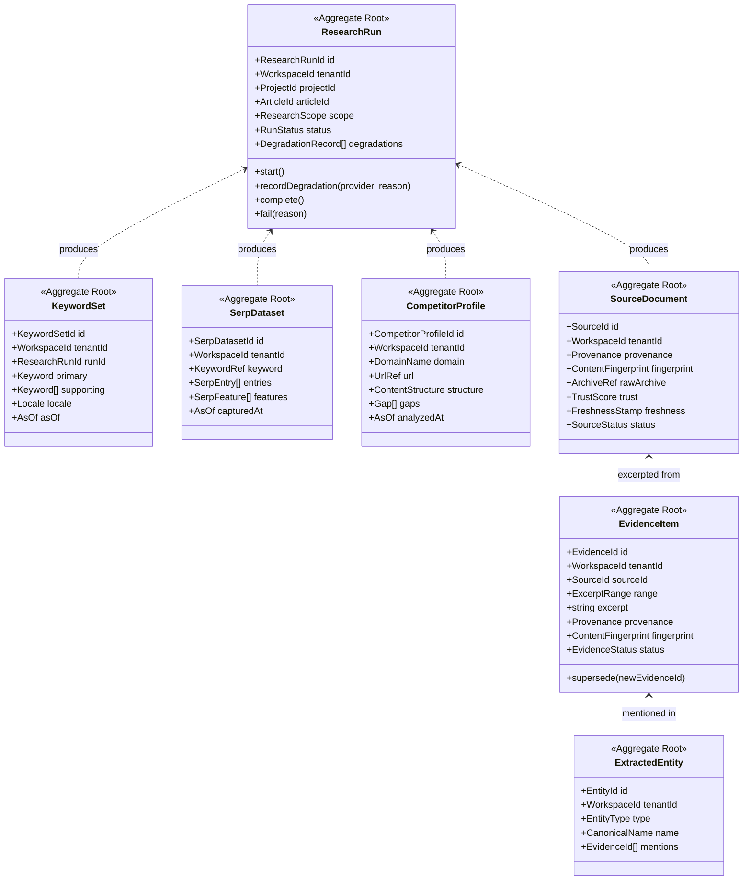
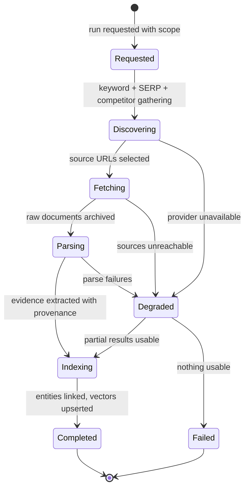
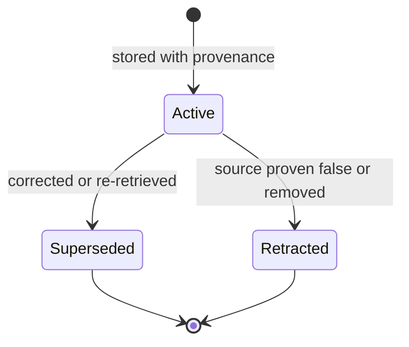
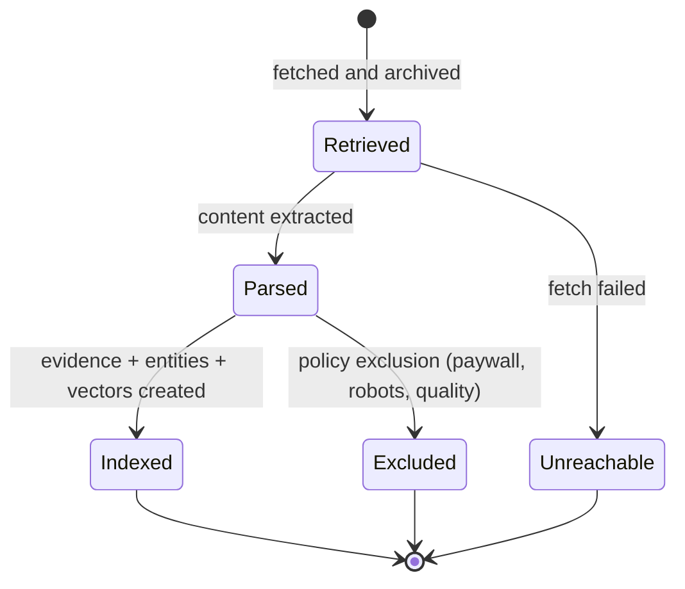

# Research Domain

> **Status:** v2.0 — complete. Bounded contexts: **Discovery** (keywords, SERP, competitors) and **Knowledge** (sources, evidence, entities).
> **Position in the hierarchy:** workspace-scoped. Every aggregate carries `tenant_id` and `organization_id` (ADR-017).

## Overview

This domain produces the raw material the rest of the platform reasons over: what to write about (Discovery) and what is true (Knowledge). It is the origin of the **grounding invariant** — by the time content reaches Publishing, every factual claim resolves to an Evidence Bank source or is explicitly flagged (ADR-009).

**Business purpose.** Two of the product's three defensible properties originate here. *Grounding* is only possible because evidence is stored with mandatory provenance at retrieval time — provenance cannot be reconstructed later. *Continuity* is only possible because evidence outlives the article that consumed it, so a refresh twelve months later starts from what was already known rather than from zero.

**Why Discovery and Knowledge share one document.** They are separate bounded contexts with a Customer/Supplier relationship (`01-system-architecture/04-context-map.md`), but they are produced by one pipeline segment and share one lifecycle: a research run. Documenting them apart would split a single state machine across two files. Their models remain distinct — Discovery artifacts are *market observations*, Knowledge artifacts are *facts with provenance* — and the boundary between them is stated explicitly below.

**Scope note.** This document defines the domain model. The algorithms behind trust scoring, freshness decay, deduplication, entity linking, embedding, and retrieval are specified in `11-knowledge-platform/`. This document says what an `EvidenceItem` *is* and what invariants hold; that folder says how it is scored, indexed, and retrieved.

## Responsibilities

**This domain owns:**

- The research run as a unit of work: what was requested, what was gathered, what degraded.
- Discovery artifacts: keyword sets, SERP datasets, competitor profiles, gaps, opportunities.
- Knowledge artifacts: source documents, evidence items with provenance, extracted entities.
- The provenance contract: what must be true for a piece of retrieved text to be storable as evidence.
- Deduplication identity: what makes two pieces of evidence the same.
- The published language the Authoring and Quality contexts consume: `EvidenceRef`, `Citation` inputs, coverage reports.

**This domain does NOT own:**

| Not owned | Owner |
|---|---|
| Retrieval algorithms, ranking, reranking, embeddings, graph traversal | `11-knowledge-platform/` |
| Trust and freshness scoring **algorithms** (this domain owns that the values exist and are labeled estimates) | `11-knowledge-platform/evidence-bank.md`, `freshness-engine.md` |
| Provider mechanics: DataForSEO, Firecrawl, Exa auth, limits, retries | `09-integrations/` |
| Outlines, drafts, claims *in content* | `articles.md` |
| Citation *resolution* against content | `11-knowledge-platform/citation-engine.md` (this domain supplies the evidence it resolves against) |
| Any scoring that grades content | OQ-23 / ADR-021 |
| Prompt construction or model selection | `08-ai-platform/` |

## Domain Model

| Aggregate root | Why separate |
|---|---|
| **ResearchRun** | The unit of work and degradation record; short-lived |
| **KeywordSet / SerpDataset / CompetitorProfile** | Immutable market observations, each timestamped and independently cacheable and reusable across runs |
| **SourceDocument** | A retrieved document with its own trust and freshness lifecycle; reused by many runs |
| **EvidenceItem** | **Outlives every run and article that used it** — the atomic unit of grounding. Nesting it under a run would tie its lifetime to work rather than to knowledge |
| **ExtractedEntity** | Linked across many evidence items and articles; a workspace-level knowledge asset |

### Value objects

| Value object | Rules |
|---|---|
| `Provenance` | `{ url, retrievedAt, method, contentHash, offsets }`. **Mandatory and immutable.** Evidence without complete provenance cannot be created |
| `Keyword` | `{ term, locale, volume?, difficulty?, cpc?, intent?, asOf }` — metrics are optional (a provider may be degraded) but `asOf` never is |
| `SerpEntry` | `{ position, url, title, snippet, contentType, structuralSummary }` |
| `SerpFeature` | Featured snippet, People Also Ask, video pack, etc., with presence and position |
| `Gap` | `{ topic, evidence[], gapType, observedIn[] }` — a competitor observation, never a recommendation |
| `Opportunity` | A ranked recommendation carrying the **Explainability Envelope** (ADR-009) |
| `ContentFingerprint` | Normalized-content hash used for deduplication identity |
| `ExcerptRange` | Character offsets into the archived source, so an excerpt is verifiable against the original |
| `TrustScore` / `FreshnessStamp` | `{ value, method, computedAt }` — always labeled estimates with an `asOf` |
| `AsOf` | The observation timestamp. Every Discovery artifact carries one; nothing is presented as "current" |
| `ResearchScope` | `{ seedKeywords[], locale, depth, competitorCount, evidenceTarget }` |
| `DegradationRecord` | `{ provider, reason, occurredAt, impact }` — what was **not** gathered and why |
| `EvidenceStatus` | `active` · `superseded` · `retracted` |
| `SourceStatus` | `retrieved` · `parsed` · `indexed` · `unreachable` · `excluded` |

### Domain services

| Service | Responsibility |
|---|---|
| `ProvenanceValidator` | Refuses any evidence write lacking complete, well-formed provenance |
| `DeduplicationService` | Resolves fingerprint collisions to an existing evidence item rather than creating a duplicate |
| `CoverageValidator` | Answers "is there sufficient evidence for this outline section?" — consumed by Planning, computed here |
| `EvidenceRetentionService` | Applies plan-tier retention (OQ-9); retracts rather than deletes where a citation still references an item |
| `OpportunitySynthesisService` | Builds `Opportunity` records with mandatory Explainability Envelopes from gaps and keyword data |

## Business Rules

**Provenance and evidence integrity — the core of the domain**

1. **Evidence cannot exist without complete provenance.** URL, `retrievedAt`, retrieval method, content hash, and excerpt offsets are all mandatory. A partial-provenance write is refused at the aggregate, not filtered later.
2. **Evidence is immutable.** Corrections create a new item and mark the old `superseded` with a pointer. Retraction (a source proven false or removed) marks `retracted`; neither ever mutates the original text.
3. Every excerpt must be verifiable against its archived source via `ExcerptRange`. An excerpt whose offsets do not resolve is invalid.
4. **Evidence outlives runs and articles.** Deleting an article never deletes evidence; retention is governed independently.
5. Deduplication is per workspace by `ContentFingerprint`. Identical content retrieved twice yields one evidence item with two provenance observations, not two items.
6. Evidence is **never** treated as instructions. It is data at every downstream step (`16-security/prompt-injection.md`); this is a domain rule because the aggregate is where retrieved text enters the system.
7. Trust and freshness are **labeled estimates**, always carrying method and `computedAt`. No rule anywhere may treat them as facts.

**Discovery artifacts**

8. Every Discovery artifact carries `asOf`. A SERP dataset without a capture timestamp is invalid — SERP data is worthless without knowing when it was observed.
9. Discovery artifacts are **immutable once captured**. A refreshed observation is a new artifact; comparing versions is how change is detected.
10. Keyword metrics may be absent when a provider degrades; absence is `null` with a degradation record, **never zero**. A zero volume and an unknown volume are different facts, and conflating them produces confidently wrong strategy.
11. A `Gap` is an observation about competitor content; an `Opportunity` is a recommendation and therefore **must** carry an Explainability Envelope. The two must never be conflated.
12. Competitor profiles record structure and gaps, never copied content beyond fair excerpt lengths retained as evidence with provenance.

**Research runs**

13. A run belongs to exactly one workspace and references at most one article. Runs without an article (standalone research) are permitted and belong to a project.
14. A run **completes with degradations** rather than failing, whenever partial results are usable. Degradations are recorded on the run and propagate to any artifact derived from it.
15. A run fails only when it produced nothing usable. A failed run releases its credit hold in full.
16. **Runs never fabricate.** If a provider returns nothing, the run records a gap. There is no default, inferred, or placeholder evidence, ever.
17. Evidence created by a run is committed **before** the run is marked complete, so a crash between the two cannot orphan knowledge.

**Coverage and reuse**

18. `CoverageValidator` reports evidence sufficiency per outline section; it never edits an outline. Planning decides what to do with a thin-coverage report (`articles.md`).
19. Evidence is reusable across articles within a workspace. Reuse re-checks freshness and may trigger re-retrieval, but never silently substitutes stale evidence for fresh.
20. Evidence is **never** shared across workspaces, even within one organization. An agency's clients do not share an Evidence Bank — a rule that follows directly from ADR-017's isolation boundary.

## Lifecycle

Research run:

Evidence item:

Source document:

## Domain Events

Written to the outbox in the state-changing transaction (ADR-020).

| Event | Producer | Consumers | Payload | Retry / failure |
|---|---|---|---|---|
| `ResearchStarted` | ResearchRun | Progress stream, Read models | `{ runId, articleId?, projectId, scope }` | 5 attempts, backoff, DLQ |
| `KeywordResearchCompleted` | KeywordSet | Planning, Projects, Read models | `{ runId, keywordSetId, primaryTerm, supportingCount, locale, asOf }` | Standard |
| `SerpCaptured` | SerpDataset | Competitor analysis, Planning | `{ datasetId, keywordRef, entryCount, features[], capturedAt }` | Standard |
| `CompetitorAnalyzed` | CompetitorProfile | Planning, Read models | `{ profileId, domain, gapCount, analyzedAt }` | Standard |
| `SourceRetrieved` | SourceDocument | Parsing worker, Archive | `{ sourceId, url, retrievedAt, method }` | Standard |
| `EvidenceStored` | EvidenceItem | **Vector indexer**, Entity extraction, Citation Engine | `{ evidenceId, sourceId, fingerprint, runId }` — **no excerpt text** | Standard; DLQ blocks grounding, so alert |
| `KnowledgeIndexed` | ResearchRun | Planning (coverage gate), Progress stream | `{ runId, evidenceCount, entityCount, vectorCount }` | Standard |
| `EvidenceSuperseded` | EvidenceItem | Citation Engine (re-resolve), Analytics | `{ evidenceId, supersededBy, reason }` | Critical — stale citations affect grounding |
| `EvidenceRetracted` | EvidenceItem | Citation Engine, **Review** (re-gate affected articles), Notifications | `{ evidenceId, reason, affectedArticleIds[] }` | Critical — pages on DLQ |
| `ResearchDegraded` | ResearchRun | Progress stream, Notifications, Observability | `{ runId, provider, reason, impact }` | Standard |
| `ResearchCompleted` | ResearchRun | Orchestrator, Planning, Credits (settle) | `{ runId, evidenceCount, degradations[] }` | Standard |
| `ResearchFailed` | ResearchRun | Orchestrator, Credits (release hold), Notifications | `{ runId, reason }` | Critical |
| `OpportunityIdentified` | OpportunitySynthesis | Projects (backlog), Notifications, Read models | `{ opportunityId, projectId, envelope }` | Standard |

**Consumed events**

| Event | Source | Reaction |
|---|---|---|
| `OutlineReady` | Articles | Run `CoverageValidator` against the outline; report sufficiency |
| `RefreshRecommended` | Analytics | Scope a re-research run against existing evidence, re-checking freshness |
| `WorkspaceArchived` | Workspace | Stop ingestion; mark the knowledge namespace read-only |
| `SubscriptionChanged` | Commerce | Re-evaluate retention ceilings for evidence and archives (OQ-9) |

## Relationships

| Relates to | Nature |
|---|---|
| **Workspace** | Isolation boundary. Evidence is never shared across workspaces (rule 20) |
| **Organization** | Indirect via `organization_id`, for cost and volume reporting only |
| **Project** | A run belongs to a project; `TargetSite` and locale scope Discovery (`projects.md`) |
| **Articles** | Supplies evidence and coverage reports; consumes `OutlineReady`. Never edits content (`articles.md`) |
| **Knowledge Platform** | This domain defines the aggregates; `11-knowledge-platform/` implements storage, scoring, indexing, and retrieval over them |
| **AI Platform** | Evidence reaches models only through the Context Builder, wrapped as data (`08-ai-platform/context-builder.md`) |
| **Platform Layer** | Credits meter provider and AI spend per run (`04-platform/credits.md`) |
| **Storage Platform** | Raw archives in R2 under `tenant_id/` prefixes; vectors in pgvector namespaced by tenant; metadata in PostgreSQL (`12-storage-platform/`) |
| **Event Platform** | All events through the outbox and `EventBus` (ADR-020) |

## Database Impact

| Table | Notes |
|---|---|
| `research_runs` | PK `id`; `tenant_id`, `organization_id`, `project_id`, `article_id?`, `scope JSONB`, `status`, `degradations JSONB`, audit fields |
| `keyword_sets` / `keywords` | Set header plus rows: `term`, `locale`, `volume?`, `difficulty?`, `cpc?`, `intent?`, `as_of` — **immutable** |
| `serp_datasets` / `serp_entries` | Dataset header with `captured_at`; entries with position, url, structural summary — **immutable** |
| `competitor_profiles` | `domain`, `url`, `structure JSONB`, `gaps JSONB`, `analyzed_at` — **immutable** |
| `source_documents` | `provenance JSONB`, `fingerprint`, `archive_ref`, `trust JSONB`, `freshness JSONB`, `status` |
| `evidence_items` | `source_id`, `range`, `excerpt`, `provenance JSONB`, `fingerprint`, `status`, `superseded_by?` — **append-only** |
| `evidence_embeddings` | `evidence_id`, `chunk_index`, `embedding vector`, `tenant_id` — pgvector |
| `extracted_entities` / `entity_mentions` | Canonical entity plus mention links to evidence |

**Constraints**

- `NOT NULL` on every provenance component, plus a `CHECK` that `retrieved_at` is present and not in the future — rule 1 enforced by the database, not only by the aggregate.
- `UNIQUE (tenant_id, fingerprint)` on `evidence_items` — deduplication identity is a database constraint (rule 5).
- `UNIQUE (tenant_id, source_id, range)` — the same excerpt cannot be stored twice from one source.
- `CHECK (status IN (...))` on all status columns.
- FKs `evidence_items.source_id → source_documents(id)` `ON DELETE RESTRICT`; `evidence_embeddings.evidence_id → evidence_items(id)` `ON DELETE CASCADE` (embeddings are derived and rebuildable).

**Indexes:** `(tenant_id, fingerprint)`; `(tenant_id, created_at)` on evidence for retention sweeps; `(tenant_id, keyword_term, locale)` on keywords for cache lookup; `(tenant_id, domain)` on competitor profiles; HNSW index on `evidence_embeddings.embedding` with a **mandatory `tenant_id` filter** — the cross-tenant retrieval test exists specifically because a missing vector filter is the leak RLS cannot catch (`10-testing/integration-testing.md` §8).

**RLS.** Every table carries `tenant_id` with the standard policy and the mandatory isolation suite. `evidence_embeddings` carries `tenant_id` denormalized so vector queries filter without a join.

**Soft delete.** None on evidence — it is append-only with status transitions (`superseded`, `retracted`). Retention removes evidence by hard delete only after the retention window and only when no active citation references it; otherwise it is retracted and retained. `research_runs` use `deleted_at`. Raw archives in R2 follow object lifecycle policy, not soft delete.

**Partitioning.** `evidence_items` and `serp_entries` are the highest-growth tables and are partitioned by `(tenant_id, created_at)` at the S3 threshold (`14-operations/scaling-strategy.md` §8).

## API Impact

| Surface | Operations |
|---|---|
| REST | `POST /v1/research/runs` (202 + handle), `GET /v1/research/runs/{id}`, `GET /v1/research/runs/{id}/evidence`, `GET /v1/keywords?term=&locale=`, `GET /v1/serp/{keywordRef}`, `GET /v1/competitors?projectId=`, `GET /v1/evidence/{id}`, `POST /v1/evidence/{id}/retract` |
| Internal | `CoverageValidator.validate(outline) → CoverageReport`; `EvidenceRepository.retrieve(query, budget) → EvidenceRef[]` (via Knowledge Platform); `DeduplicationService.resolve(fingerprint)` |
| Events | As tabled above |
| Workers | Fetch/parse fan-out; embedding generation; entity extraction; freshness re-evaluation sweep; retention sweep |

Research runs are long-running and therefore follow the `202` + handle + SSE pattern (`01-system-architecture/09-request-flow.md`).

## Security

Domain-specific rules; controls in `16-security/`.

- **Retrieved content is untrusted input.** Evidence is stored and passed as data; no evidence text may be interpreted as an instruction, and no side effect may be triggered by content found in a source (rule 6).
- Evidence excerpts can contain third-party copyrighted text; excerpt length is bounded by policy, full raw archives are retained separately with restricted access, and neither is exposed in event payloads.
- `EvidenceStored` carries identifiers and fingerprints only — never excerpt text — because events fan out more widely than the evidence table does.
- Vector search **must** filter by `tenant_id`; this is the one isolation path RLS does not protect, and it has a dedicated cross-tenant test.
- Retraction is an auditable action with a reason, since it can invalidate published claims.
- Fetching is subject to SSRF protections and robots/paywall policy in the Provider Layer (`09-integrations/firecrawl.md`) — a v1 defect this domain's boundary now contains.

## Performance

- **External-data cache** keyed `(tenant_id, provider, query, locale)` with per-dataset TTLs: SERP hours, keyword metrics weeks. Freshness is surfaced to the user, never hidden (rule 8).
- Fetch and parse fan out as parallel BullMQ jobs bounded by per-provider limiters; the run gathers results as they land.
- Evidence writes are batched per source to avoid per-excerpt transaction overhead.
- Embedding generation is asynchronous and idempotent per `(evidence_id, chunk_index)`; a run completes when evidence is committed, and vector availability follows shortly after (`KnowledgeIndexed`).
- Retrieval is bounded by a token budget supplied by the Context Builder, so a large Evidence Bank never produces an unbounded context.
- Coverage validation reads counts and vector similarity, not full excerpts — it must stay cheap because Planning calls it repeatedly across a revise loop.

## Failure Handling

| Failure | Handling |
|---|---|
| Provider unavailable | Record `DegradationRecord`; continue with cached or fewer sources; run completes degraded rather than failing (rule 14) |
| Source unreachable | Mark `unreachable`; recorded as a gap; never substituted with a similar source |
| Parse failure | Source stays `retrieved` with the raw archive intact; reparse is retryable without re-fetching |
| Duplicate evidence from a retried job | Unique fingerprint constraint rejects it; the handler treats the violation as success (idempotent) |
| Embedding job fails | Evidence remains valid but unretrievable by vector; a repair sweep re-embeds; retrieval degrades to keyword search with the gap recorded |
| Crash between evidence write and run completion | Evidence is committed first (rule 17); the run resumes and re-derives completion state |
| Retraction of evidence used in published content | `EvidenceRetracted` carries `affectedArticleIds[]`; Review re-gates those articles and Notifications alerts the workspace — the platform must never leave a published claim resting on retracted evidence |
| Retention sweep meets an evidence item with active citations | Retracts and retains rather than deleting; deletion would break the grounding chain of published content |

## Observability

- **Metrics:** `research_runs_total{status}`, `research_run_duration_seconds`, `evidence_items_total`, `evidence_per_run` (histogram), `deduplication_hit_ratio`, `provider_degradations_total{provider}`, `coverage_validation_result{sufficient|thin}`, `embedding_backlog`, `vector_query_duration_seconds`.
- **Logs:** every degradation with provider, reason, and impact; every retraction with actor and reason; never full excerpts.
- **Traces:** a run is one trace spanning discovery, fetch fan-out, parse, evidence write, and indexing, so slow stages are attributable per provider.
- **Alerts:** `EvidenceRetracted` or `ResearchFailed` in the DLQ (page); embedding backlog above threshold (grounding degrades silently otherwise); deduplication ratio collapsing (usually a fingerprint-normalization regression); coverage `thin` rate rising, which usually means a data provider is quietly degraded.

## Future Expansion

- **Tenant knowledge ingestion** — PDFs, internal documents, and site content into the Evidence Bank, reusing the same provenance contract.
- **Source trust learning** from human overrides, feeding `11-knowledge-platform/evidence-bank.md`.
- **Cross-workspace evidence sharing for public sources**, an explicit cost saving with a genuine isolation risk; requires an ADR and is deliberately excluded today (rule 20).
- **Claim-level evidence graphs** — linking contradictory evidence so Review can surface disagreement between sources rather than picking one.
- **Multi-language research**, extending `Locale` through Discovery and entity linking.
- **Continuous evidence freshness monitoring** with proactive re-retrieval for statistics that age predictably.

## Cross References

- `articles.md` — the consumer of evidence and coverage reports
- `analytics.md` — refresh signals that trigger re-research
- `projects.md` — project scope and locale for Discovery
- `11-knowledge-platform/` — Evidence Bank, graphs, citations, vector search, RAG, trust, freshness, deduplication implementations
- `05-content-platform/research-engine.md` · `keyword-intelligence.md` · `serp-intelligence.md` · `competitor-intelligence.md` — the engines producing these aggregates
- `09-integrations/dataforseo.md` · `firecrawl.md` · `exa.md` — provider adapters
- `03-database/tables.md` · `03-database/indexes.md` — physical schema and vector indexing
- `16-security/prompt-injection.md` — why evidence is data, never instructions

## Open Questions

- **OQ-9** — retention policy per plan tier for evidence and raw archives; today retention is bounded but the tier values are unset.
- **OQ-6** — pgvector to Qdrant cutover affects where `evidence_embeddings` lives, not what it means.
- **OQ-11** — the embeddings model choice, which determines chunking strategy and re-embedding cost on change.
