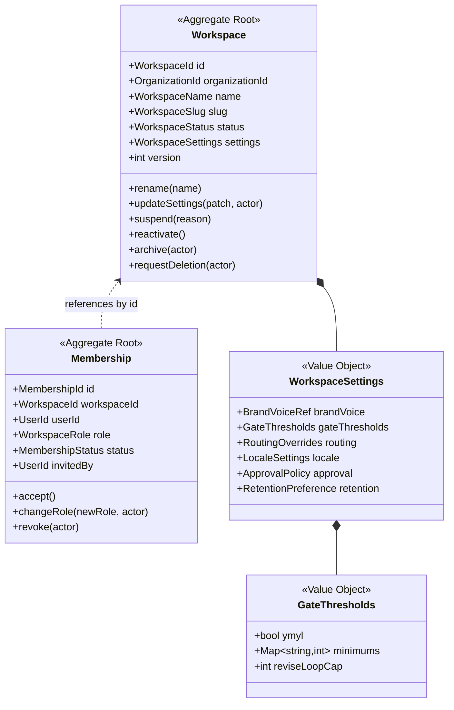
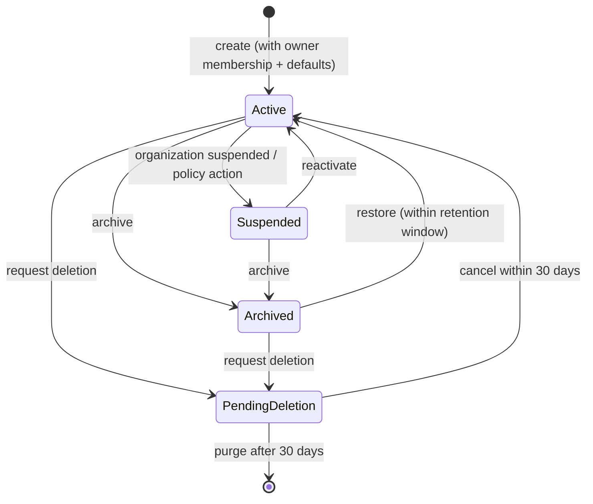
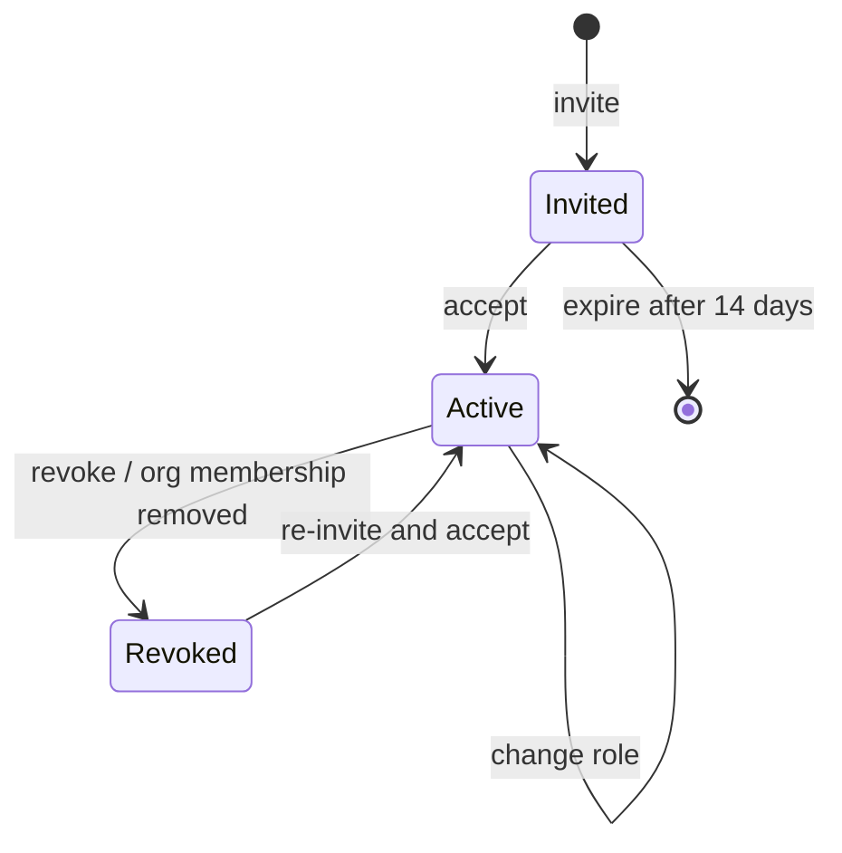

# Workspace Domain

> **Status:** v2.0 — complete. Bounded context: **Identity & Access** (workspace half). Organization half: `organizations.md`.
> **Position in the hierarchy:** `User → Organization → **Workspace** → Project → Article` (ADR-017). The workspace is the isolation boundary — `tenant_id` *is* the workspace identifier.

## Overview

The workspace is the unit of content isolation. Everything a team produces — projects, articles, evidence, connectors, brand voice, thresholds — lives inside exactly one workspace and is invisible outside it. For a solo creator there is one workspace; for an agency there is one per client brand; for an enterprise there is one per business unit or market.

**Business purpose.** Agencies and enterprises will not buy a platform where one client's competitive research can surface in another client's dashboard. The workspace is how that promise is kept, and because it is also the configuration boundary, it is how the same platform produces a compliance-grade medical article for one client and a conversational product review for another without either configuration leaking.

**Why this domain exists separately from Organization.** They change for different reasons and at different rates. An organization changes when a commercial relationship changes — plan, SSO, ownership. A workspace changes constantly: members join, settings tune, projects come and go. Modeling them as one aggregate would put a billing concern and an editorial setting in the same consistency boundary, and would make the agency case (one commercial entity, many isolated content boundaries) inexpressible.

## Responsibilities

**This domain owns:**

- The workspace as an identity and isolation boundary, and its lifecycle.
- Workspace membership: who belongs, in what role, and how that changes.
- Workspace-scoped configuration: brand voice reference, quality gate thresholds, routing overrides, locale and market defaults, approval policy, retention preferences.
- The derivation of a workspace's effective permission set for a user, combining organization-level and workspace-level roles.
- Provisioning and de-provisioning: what must exist when a workspace is created, and what happens to its content when it is archived.

**This domain does NOT own:**

| Not owned | Owner |
|---|---|
| Users, authentication, sessions, SSO | `organizations.md`, `04-platform/authentication.md` |
| Plans, subscriptions, credit balances | `04-platform/billing.md`, `04-platform/credits.md` |
| Permission *enforcement* and the permission catalogue | `16-security/rbac.md` |
| Projects, tasks, calendar | `projects.md` |
| Any content aggregate | `research.md`, `articles.md`, `publishing.md`, `analytics.md` |
| Connector credential storage and encryption | `04-platform/settings.md`, `16-security/` |
| The *meaning* of a gate threshold | `articles.md` (applies it), OQ-23 (defines the scale) |

The distinction on that last row is deliberate and load-bearing: this domain owns the *value* of a threshold as workspace policy; the Quality context owns what happens when content crosses it.

## Domain Model

### Aggregates

| Aggregate root | Why it is its own root |
|---|---|
| **Workspace** | The isolation and configuration boundary; changes as a unit |
| **Membership** | Written independently and frequently (invite, accept, role change, revoke); nesting it inside Workspace would serialize unrelated writes and make a 200-member workspace a contention point |

### Value objects

| Value object | Rules |
|---|---|
| `WorkspaceId` | UUID v7. **Equals `tenant_id` everywhere in the system** |
| `WorkspaceName` | 1–80 characters, trimmed, non-empty after trimming |
| `WorkspaceSlug` | Lowercase, `[a-z0-9-]`, 3–48 chars, unique **within the organization**, immutable after creation |
| `WorkspaceRole` | `owner` · `admin` · `editor` · `viewer` |
| `WorkspaceStatus` | `active` · `suspended` · `archived` · `pending_deletion` |
| `MembershipStatus` | `invited` · `active` · `revoked` |
| `BrandVoiceRef` | Pointer to a voice profile held in AI Platform Memory; the profile content is not owned here |
| `GateThresholds` | Per-measure minimums plus the YMYL flag and revise-loop cap. **Values are opaque to this domain** (OQ-23) |
| `RoutingOverrides` | Optional per-task-type tier hints, validated against known task types; never contains a model identifier |
| `LocaleSettings` | Default language, market, and measurement locale for keyword and SERP work |
| `ApprovalPolicy` | Whether outline approval is required, auto-approval confidence threshold (OQ-15), approval timeout |
| `RetentionPreference` | Requested retention for evidence and media, bounded by the plan's limit (OQ-9) |

### Domain services

| Service | Responsibility |
|---|---|
| `WorkspaceProvisioningService` | Creates a workspace with its owner membership and default settings atomically; enforces the organization's workspace quota |
| `MembershipPolicyService` | Enforces last-owner protection, role-change authority, and invitation validity |
| `EffectivePermissionResolver` | Computes a user's effective roles for a workspace as the union of their organization role and workspace membership role. **Resolution only** — enforcement is `16-security/rbac.md` |
| `WorkspaceArchivalService` | Orchestrates archival: blocks new runs, allows in-flight runs to finish, retains content read-only |

## Business Rules

**Ownership and structure**

1. A workspace belongs to **exactly one** organization, fixed at creation. Moving a workspace between organizations is not supported in v1 (a data-ownership transfer, not a rename).
2. `WorkspaceId` is `tenant_id`. Every workspace-owned row in every context carries it, plus the denormalized `organization_id`.
3. `slug` is unique per organization and immutable; renaming changes `name` only, so external references never break.
4. A workspace cannot be created if the organization is `suspended` or `closed`, or if it would exceed the plan's workspace quota (quota value owned by Commerce).

**Membership**

5. **Last-owner protection:** a workspace always has at least one `active` membership with role `owner`. Revoking or demoting the final owner is refused, with an error naming the constraint.
6. Only `owner` may grant or revoke `owner`. `admin` may manage `editor` and `viewer`. `editor` and `viewer` may manage nobody.
7. A user has **at most one** membership per workspace. Re-inviting an existing member is a role change, not a second membership.
8. An invitation expires after 14 days; an expired invitation cannot be accepted and must be reissued.
9. A user must have an active organization membership to hold a workspace membership. Removing someone from the organization revokes every workspace membership they hold within it, in one transaction.
10. Revoking a membership does not delete that user's authored content; authorship attribution is historical and survives.

**Settings**

11. Settings are the single source of truth for gate thresholds, routing overrides, approval policy, and locale. **No engine hardcodes any of these values** (ADR-008, ADR-009).
12. A settings change applies to runs started *after* the change. In-flight runs pin the settings snapshot taken at start, so a mid-run policy edit cannot alter a run's behaviour or its verdict.
13. `RetentionPreference` may only request retention **within** the plan's allowance; a request beyond it is rejected rather than silently clamped.
14. `RoutingOverrides` may express a tier preference, never a model identifier — model selection remains routing policy (ADR-013).
15. Only `owner` and `admin` may change settings. Every change is audit-logged with actor, before-value, and after-value.

**Status**

16. A `suspended` workspace: reads allowed, no new runs, no publishing, in-flight runs are cancelled at the next durable checkpoint with credits released.
17. An `archived` workspace: read-only permanently, retained for the organization's retention window; it does not count against the workspace quota.
18. `pending_deletion` starts a 30-day recovery window; deletion is irreversible after it, and the erasure is recorded in the erasure log so any future restore re-applies it (`14-operations/backup-recovery.md` §11).
19. Suspension of the parent organization cascades to every workspace it owns; reactivation restores each workspace to its own prior status, not blindly to `active`.

## Lifecycle

Membership lifecycle:

## Domain Events

All events are written to the outbox in the same transaction as the state change (ADR-020) and carry the standard envelope with `tenantId` (the workspace) and `organizationId`.

| Event | Producer | Consumers | Payload | Retry / failure |
|---|---|---|---|---|
| `WorkspaceCreated` | Workspace | Projects (default project), Notifications, Analytics (registry), Read models | `{ workspaceId, organizationId, name, slug, createdBy }` | 5 attempts, exponential backoff, then DLQ |
| `WorkspaceRenamed` | Workspace | Read models, Notifications | `{ workspaceId, name, previousName }` | As above |
| `WorkspaceSettingsUpdated` | Workspace | Content engines (cache invalidation), AI Platform (routing overrides), Audit | `{ workspaceId, changedKeys[], changedBy }` — **values excluded**, keys only | As above |
| `WorkspaceSuspended` | Workspace | Orchestrator (cancel in-flight runs), Credits (release holds), Notifications | `{ workspaceId, reason, suspendedAt }` | Critical: alert on DLQ entry |
| `WorkspaceReactivated` | Workspace | Notifications, Read models | `{ workspaceId, previousStatus }` | As above |
| `WorkspaceArchived` | Workspace | Orchestrator, Projects, Analytics (stop collection) | `{ workspaceId, archivedBy }` | As above |
| `WorkspaceDeletionRequested` | Workspace | Retention worker, Notifications, Audit | `{ workspaceId, purgeAfter }` | As above |
| `WorkspacePurged` | Retention worker | Audit, Storage cleanup, Erasure log | `{ workspaceId, purgedAt }` | Critical: alert on DLQ entry |
| `MembershipInvited` | Membership | Notifications (email) | `{ workspaceId, inviteeEmail, role, invitedBy, expiresAt }` | As above |
| `MembershipAccepted` | Membership | Read models, Permission cache invalidation, Notifications | `{ workspaceId, userId, role }` | As above |
| `MembershipRoleChanged` | Membership | Permission cache invalidation, Audit | `{ workspaceId, userId, previousRole, role, changedBy }` | As above |
| `MembershipRevoked` | Membership | Permission cache invalidation, Orchestrator (reassign tasks), Audit | `{ workspaceId, userId, revokedBy }` | Critical — a stale permission cache is a security issue; DLQ entry pages |

**Consumed events**

| Event | Source | Reaction |
|---|---|---|
| `OrganizationSuspended` | Organizations | Suspend every workspace owned by that organization |
| `OrganizationReactivated` | Organizations | Restore each workspace to its recorded prior status |
| `OrgMembershipRevoked` | Organizations | Revoke that user's memberships in all workspaces of the organization |
| `SubscriptionChanged` | Commerce | Re-evaluate workspace quota and retention ceilings; never auto-delete on downgrade — mark over-quota workspaces read-only and notify |

## Relationships

| Relates to | Nature |
|---|---|
| **Organization** | Parent. Owns the workspace commercially; supplies quota, SSO, and org roles (`organizations.md`) |
| **Project** | Children. A project belongs to exactly one workspace (`projects.md`) |
| **Knowledge Platform** | Evidence, entities, and vectors are namespaced by `tenant_id`; workspace archival stops ingestion and marks the namespace read-only (`11-knowledge-platform/`) |
| **AI Platform** | Consumes `RoutingOverrides` and `BrandVoiceRef`; Memory stores the voice profile the reference points at (`08-ai-platform/`) |
| **Platform Layer** | Credits and billing resolve at organization level but are *consumed* per workspace, so usage attribution carries `tenant_id` (`04-platform/credits.md`) |
| **Storage Platform** | `tenant_id` prefixes every cache key, object-storage path, and vector namespace (`12-storage-platform/`) |
| **Event Platform** | All events above flow through the outbox and `EventBus` (ADR-020) |

## Database Impact

| Table | Notes |
|---|---|
| `workspaces` | PK `id`; FK `organization_id`; `slug`, `name`, `status`, `settings JSONB`, `version`, audit fields, `deleted_at` |
| `workspace_memberships` | PK `id`; FKs `workspace_id`, `user_id`; `role`, `status`, `invited_by`, `expires_at`, audit fields |
| `workspace_settings_history` | **Append-only** audit of settings changes: actor, changed keys, before/after, timestamp |

**Constraints**

- `UNIQUE (organization_id, slug)` — slug uniqueness is per organization, not global.
- `UNIQUE (workspace_id, user_id)` on memberships — enforces at most one membership per user per workspace at the database level, not in application logic.
- `CHECK (status IN (...))` on both status columns.
- FK `workspace_id → workspaces(id)` with `ON DELETE RESTRICT` — purging is an explicit, ordered process, never a cascade that could silently destroy content.

**Indexes:** `(organization_id, status)` for org consoles; `(user_id, status)` on memberships for "my workspaces"; partial index `WHERE deleted_at IS NULL` on the primary lookup paths.

**RLS.** `workspaces` is the one table whose policy keys on `id = current_setting('app.tenant_id')` rather than on a `tenant_id` column, plus an organization-scoped read policy so an org admin can list workspaces they administer without entering each one. `workspace_memberships` carries `tenant_id` (= `workspace_id`) and follows the standard policy. Both are covered by the mandatory per-table isolation suite (`10-testing/integration-testing.md` §3.2).

**Soft delete.** `workspaces` uses `deleted_at` with a 30-day purge. `workspace_memberships` uses status `revoked` rather than deletion, so historical attribution and audit remain intact. `workspace_settings_history` is append-only and never soft-deleted.

## API Impact

| Surface | Operations |
|---|---|
| REST (`06-api/`) | `GET/POST /v1/workspaces`, `GET/PATCH /v1/workspaces/{id}`, `POST /v1/workspaces/{id}/suspend|archive|delete`, `GET/POST /v1/workspaces/{id}/members`, `PATCH/DELETE .../members/{userId}`, `GET/PATCH /v1/workspaces/{id}/settings` |
| Internal | `EffectivePermissionResolver.resolve(userId, workspaceId)` — called by the gateway's Tenant Context Resolver on every request |
| Events | As tabled above |
| Workers | Retention purge worker; invitation-expiry sweep; permission-cache invalidation consumer |

Workspace selection at the API is implicit from the resource, or explicit via `X-Workspace-Id` on collection endpoints (`01-system-architecture/09-request-flow.md`).

## Security

Domain-specific rules only; controls and the permission catalogue are `16-security/rbac.md`.

- Cross-workspace access attempts return `404`, never `403` — a `403` confirms the workspace exists, which is itself a cross-tenant leak.
- Role changes and settings changes are always audit-logged with actor and before/after values.
- `WorkspaceSettingsUpdated` carries **changed keys only**, never values, because settings can include competitively sensitive configuration.
- Permission caches must be invalidated synchronously on `MembershipRevoked`; a DLQ entry for that event pages on-call.
- The last-owner rule is a security control, not a convenience: a workspace with no owner is unadministrable and its data unreachable through normal paths.

## Performance

- **Effective permission resolution is on every request**, so it is cached per `(user_id, workspace_id)` with a 5-minute TTL and event-driven invalidation. Without it, every request pays two joins before doing any work.
- Workspace settings are cached per `tenant_id` and invalidated on `WorkspaceSettingsUpdated`; engines read from cache, never from the database, on the hot path.
- Member lists paginate by cursor, ordered by `(role, created_at)`; a 500-member enterprise workspace must not load in one page.
- Optimistic concurrency (`version`) on both roots: concurrent settings edits fail the loser rather than silently overwriting.
- A workspace read model backs the switcher UI, projecting `{ workspaceId, name, role, articleCount, lastActivityAt }` from events.

## Failure Handling

| Failure | Handling |
|---|---|
| Provisioning partially completes | Whole provisioning is one transaction (workspace + owner membership + defaults + outbox event); no partial workspace can exist |
| Quota check races two concurrent creates | Database-level count check inside the transaction plus a unique slug constraint; the loser receives a typed `QuotaExceeded` |
| Suspension cascade fails midway | Consumer is idempotent per `workspaceId`; retried until success; DLQ entry pages, since a workspace left active under a suspended organization is a billing-integrity failure |
| Permission cache invalidation lost | TTL bounds exposure to 5 minutes; the DLQ alert is treated as a security event |
| Deletion requested for a workspace with in-flight runs | Runs are cancelled at their next durable checkpoint and credit holds released before the purge timer starts |
| Restore after purge window | Not possible by design; the API returns a typed error naming the elapsed window rather than attempting a partial recovery |

Compensation: workspace creation, suspension, and archival are all idempotent by `workspaceId`, so any retry converges on the same state.

## Observability

- **Metrics:** `workspaces_total{status}`, `workspace_members_total`, `membership_changes_total{action}`, `permission_resolution_duration_seconds`, `permission_cache_hit_ratio`, `settings_updates_total`.
- **Logs:** every membership and settings mutation logs actor, workspace, organization, and correlation id — never settings values.
- **Traces:** permission resolution is a span on every request, so its cost is visible in the p95 budget rather than hidden inside authentication.
- **Alerts:** `MembershipRevoked` or `WorkspaceSuspended` in the DLQ (page); permission cache hit ratio below 90% (investigate — usually an invalidation storm); any workspace in `pending_deletion` past its purge date (retention worker failure).

## Future Expansion

- **Workspace transfer between organizations** — an agency selling a client account. Requires a data-ownership transfer protocol and a consent record, not a foreign-key update.
- **Workspace templates** — provision a new client workspace with pre-set voice, thresholds, and project structure; a natural extension of `WorkspaceProvisioningService`.
- **Custom roles** beyond the four fixed roles, once the permission catalogue in `16-security/rbac.md` supports composition.
- **Per-workspace data residency**, dependent on OQ-7 and the multi-region topology.
- **Guest memberships** — external reviewers scoped to a single article rather than the whole workspace.

## Cross References

- `organizations.md` — the parent aggregate, org roles, and the Commerce boundary
- `projects.md` — the child aggregate
- `01-system-architecture/04-context-map.md` — Identity & Access as the shared kernel
- `01-system-architecture/09-request-flow.md` — where tenant context is derived and bound to RLS
- `03-database/tables.md` · `03-database/indexes.md` — physical schema
- `04-platform/workspaces.md` — the service implementing this domain
- `04-platform/billing.md` · `04-platform/credits.md` — quota and usage attribution
- `16-security/rbac.md` — permission catalogue and enforcement
- `10-testing/integration-testing.md` — the isolation suite covering these tables

## Open Questions

- **OQ-9** — retention ceilings per plan tier bound `RetentionPreference`.
- **OQ-15** — default auto-approval confidence threshold and revise-loop cap carried in `ApprovalPolicy`.
- **OQ-23** — the scoring contract determines what `GateThresholds.minimums` keys are and how they are validated; until it resolves, thresholds are stored opaquely and validated only for range.
