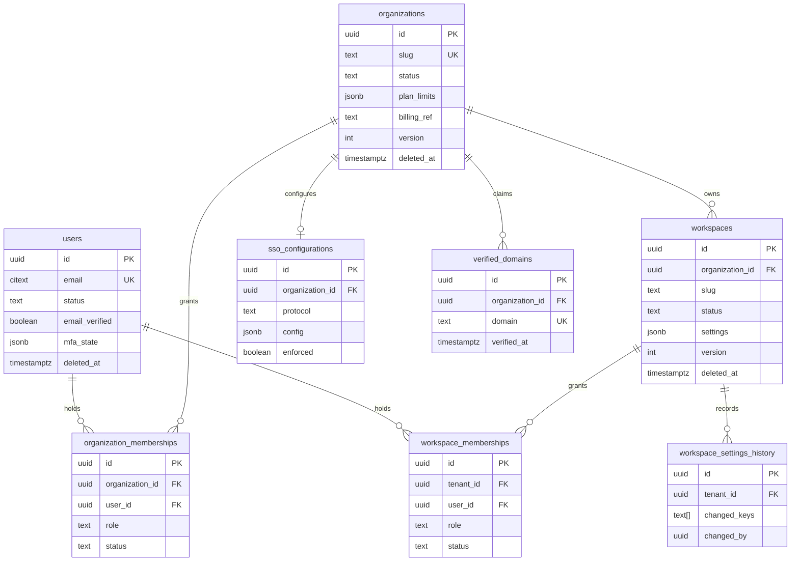
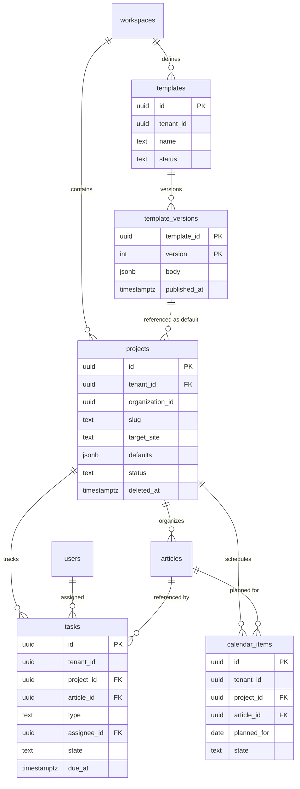
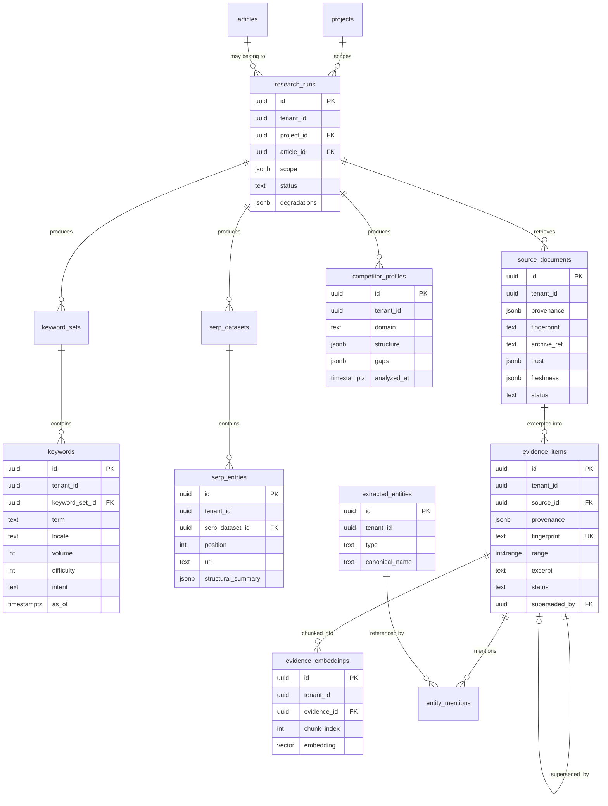
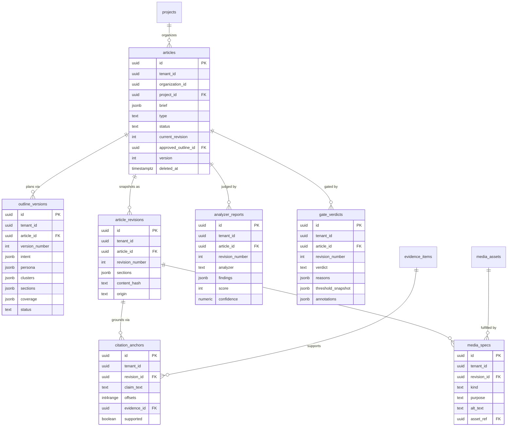
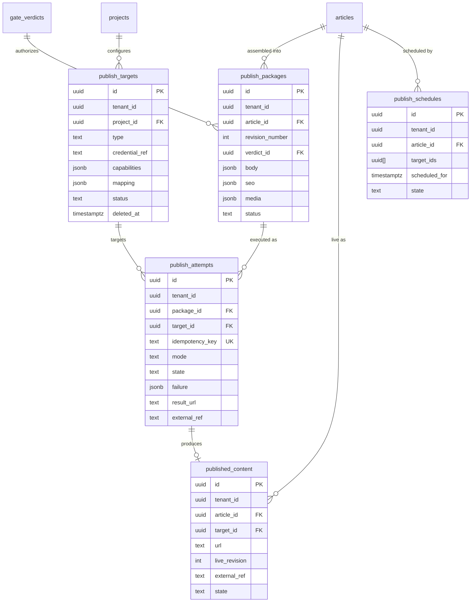
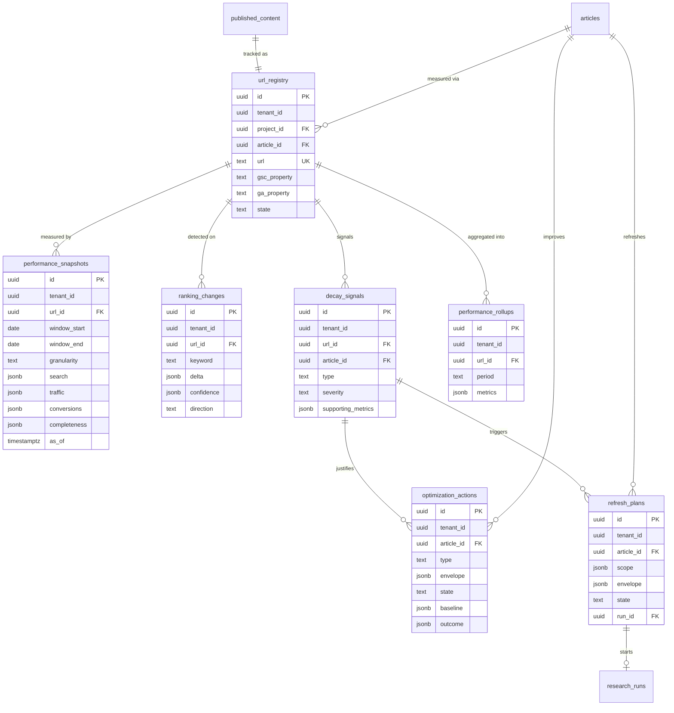
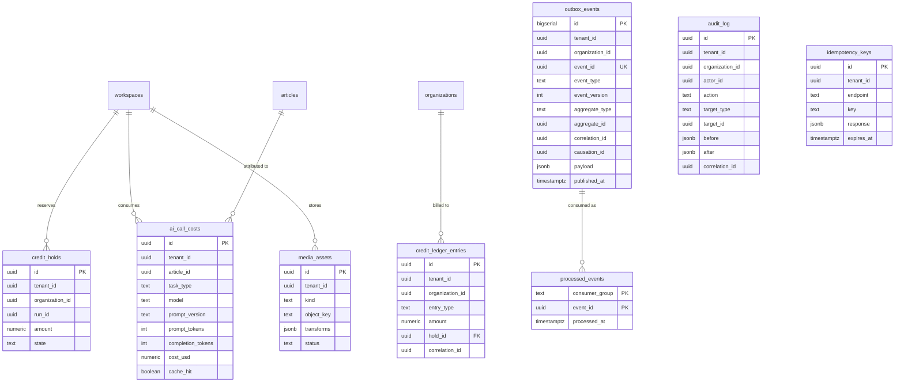
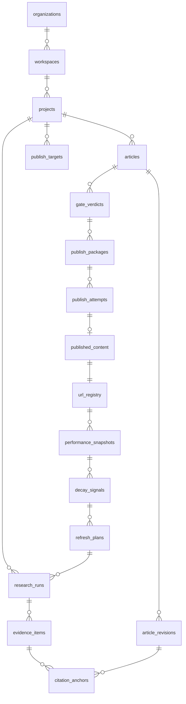

# ER Diagrams

> **Status:** v2.0 — complete. Entity-relationship view of the schema specified in `tables.md`, organized by domain area with aggregate boundaries marked.
> **Authority:** `02-domain-design/`. These diagrams show *relationships and cardinality*; column-level detail, constraints, and traffic profiles are in `tables.md`.

## Overview

Six domain diagrams plus one cross-area overview. Each corresponds to a Phase 2 domain document, and each marks aggregate boundaries explicitly, because the boundary — not the foreign key — is what determines transactional scope and write path.

**Reading the diagrams**

| Notation | Meaning |
|---|---|
| `||--o{` | One to zero-or-many |
| `||--||` | One to one |
| `}o--o{` | Many to many (always via a join table) |
| **AR** in a comment | Aggregate root |
| Dashed grouping in prose | Aggregate boundary — rows inside are written only through the root's repository |

**Two rules visible in every diagram**

1. A foreign key crossing an aggregate boundary is a **reference**, not a composition. It is enforced (`ON DELETE RESTRICT`) but never traversed transactionally: writing an article never writes a revision row in the same aggregate operation.
2. A foreign key crossing a **bounded context** boundary carries no application-level join. `citation_anchors.evidence_id` references Knowledge from Authoring; the constraint protects integrity, while retrieval happens through the Knowledge Platform's published interface.

## 1 · Identity and tenancy

The five tables above the workspace boundary, plus the workspace itself. These are the RLS exceptions documented in `02-domain-design/organizations.md`.

**Aggregate boundaries:** `User`, `Organization`, `OrganizationMembership`, `SsoConfiguration`, `Workspace`, and `WorkspaceMembership` are each their own root. Memberships are separate roots because they are written far more frequently than their parents, and nesting them would serialize unrelated writes on a 200-member workspace.

**The tenancy pivot:** `workspaces.id` **is** `tenant_id` everywhere downstream. Every table in every diagram below carries it, plus `organization_id` denormalized from this table.

## 2 · Work management

**Cardinality note:** an article has *at most one open task per type* and *at most one active calendar item* — enforced by partial unique indexes rather than by cardinality in the diagram, since both constraints are state-dependent (`tables.md`).

## 3 · Research: Discovery and Knowledge

**The lifetime asymmetry that shapes this diagram:** `research_runs` are short-lived work records; `evidence_items` outlive every run and article that used them. That is why evidence is its own aggregate root with its own retention policy and why the FK from runs to evidence is `RESTRICT`, not `CASCADE`. Deleting a run must never delete knowledge.

**`evidence_embeddings` is the only `CASCADE` in the schema** because embeddings are derived data, fully rebuildable from evidence plus the R2 archive.

## 4 · Articles: Authoring and Quality

**Three structural decisions visible here:**

`analyzer_reports` and `gate_verdicts` reference `(article_id, revision_number)` rather than `revision_id` — the composite is the `ArticleVersion` value object from the glossary, and using it directly makes "this verdict judged exactly these bytes" enforceable and readable.

`citation_anchors.evidence_id` is the **grounding chain in physical form**: it crosses from Authoring into Knowledge with `ON DELETE RESTRICT`, so evidence in use by published content cannot be deleted. This single constraint is what makes the grounding invariant durable rather than aspirational.

`media_specs.asset_ref` implements the ADR-018 split: the spec (intent) belongs to Authoring, the asset belongs to the Platform Layer, and the FK is nullable because a spec legitimately exists before its asset does.

## 5 · Publishing

**`publish_packages.verdict_id` is the authorization chain in physical form.** A package cannot exist without a verdict row, and the verdict row carries the threshold snapshot in force when it was issued. Together they make "what authorized this publication?" answerable from the database alone, months later.

**`ux_publish_attempts__idempotency_key`** is the single most consequential constraint in the schema. `idempotency_key = (article_version, target_id, mode)` means a retried publish physically cannot write twice to a customer's live site.

## 6 · Analytics and performance

**`refresh_plans.run_id → research_runs.id` closes the lifecycle loop physically.** Measurement produces a refresh plan, which starts a research run, which produces evidence, which produces a new revision — the same tables the original article used. The loop in `01-system-architecture/02-product-vision.md` is not a metaphor; it is a cycle in this graph.

`performance_snapshots` is the highest-volume table in the platform and is partitioned by `(tenant_id, window_start)` from day one (`indexes.md`).

## 7 · Platform and infrastructure

**`outbox_events` has no foreign keys by design.** It must be writable in the same transaction as any state change in any table without creating a dependency cycle, and it must survive the deletion of the aggregate it describes — an `ArticlePurged` event referencing a deleted article is exactly the case that matters.

**`credit_ledger_entries` carries both `tenant_id` and `organization_id`**: consumption is attributed per workspace, billing resolves per organization (ADR-017). Commerce's full schema — plans, subscriptions, invoices — is owned by `04-platform/billing.md` and specified in Phase 5; only the tables Phase 1 and Phase 2 already depend on appear here.

## 8 · Cross-area overview

Aggregate roots only, with the pipeline path highlighted.

Read clockwise from `projects`: research produces evidence, evidence grounds revisions, revisions earn verdicts, verdicts authorize packages, packages become live URLs, URLs produce measurements, measurements trigger refresh, refresh starts research. **Every arrow in that cycle is a foreign key**, which is what makes the lifecycle auditable end to end: given a live URL, the chain back to the evidence supporting each claim is a series of joins, not a reconstruction.

## Cardinality summary

| Relationship | Cardinality | Enforcement |
|---|---|---|
| organization → workspaces | 1 : 1..N | FK; organization must have ≥1 workspace (application invariant) |
| workspace → projects | 1 : 1..N | FK; default project created with workspace |
| project → articles | 1 : 0..N | FK `RESTRICT` |
| article → revisions | 1 : 0..N | FK; `UNIQUE (article_id, revision_number)` |
| article → outline versions | 1 : 0..N | FK; `UNIQUE (article_id, version_number)` |
| (article, revision) → analyzer report | 1 : 0..1 per analyzer | `UNIQUE (article_id, revision_number, analyzer)` |
| (article, revision) → gate verdict | 1 : 0..N (re-gates) | Append-only; latest by `created_at` is current |
| package → attempts | 1 : 1..N (one per target) | FK; `UNIQUE (idempotency_key)` |
| (article, target) → published content | 1 : 0..1 live | Partial unique `WHERE state IN ('live','updating')` |
| published content → url registry | 1 : 1 | `UNIQUE (url)` |
| url → snapshots | 1 : 0..N | Partitioned; `UNIQUE (url_id, window_start, granularity, as_of)` |
| article → open task per type | 1 : 0..1 | Partial unique `WHERE state NOT IN ('done','cancelled')` |
| article → active calendar item | 1 : 0..1 | Partial unique `WHERE state IN ('planned','scheduled','in_progress')` |
| evidence → embeddings | 1 : 1..N chunks | FK `CASCADE` (only cascade in the schema) |

## Cross References

- `tables.md` — column-level specification, constraints, traffic profiles, and the invariant traceability matrix
- `indexes.md` — index strategy, partitioning, pgvector configuration
- `migrations.md` — the order in which these tables are created
- `02-domain-design/` — the aggregates these entities implement
- `01-system-architecture/04-context-map.md` — the context boundaries the cross-context FKs cross
- `11-knowledge-platform/` — subsystems operating over the evidence and embedding tables
