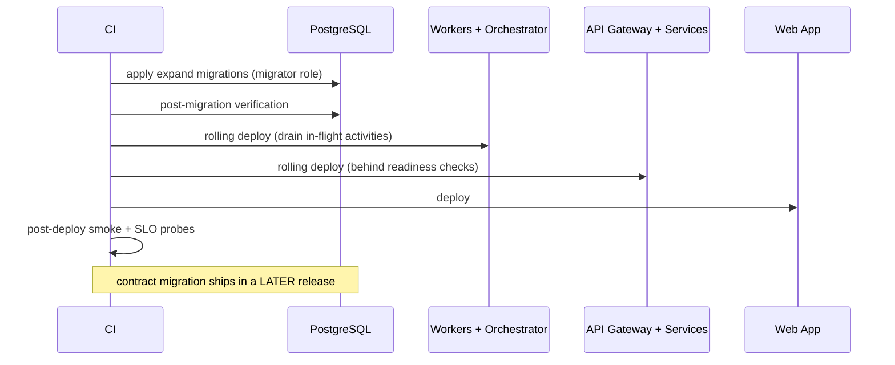

# Migrations

> **Status:** v2.0 — complete. Migration tooling, ordering, and zero-downtime procedure for the schema in `tables.md`.
> **Scope boundary:** this document owns *how the schema changes*. The release pipeline that executes migrations — build, promote, verify, roll back — is `14-operations/deployment.md` (ADR-015). Neither restates the other.

## Overview

Migrations run against a database that is simultaneously serving requests, holding Temporal workflows that may be days into execution, and feeding an outbox relay. The previous application version must keep working against the new schema, because rollback is only possible if it does.

Everything below follows from one rule: **the schema at version N must be compatible with application versions N−1 and N.** A migration that breaks that is not a fast migration — it is an unrecoverable one.

## Tooling

| Concern | Choice |
|---|---|
| Migration tool | **Drizzle Kit** (proposed ADR-022) |
| Format | **SQL-first.** Generated SQL is reviewed, edited, and committed — never applied unread |
| Location | `packages/db/migrations/` |
| Naming | `NNNN_snake_case_description.sql` — zero-padded, monotonic, never renumbered |
| Journal | `packages/db/migrations/meta/_journal.json`, committed |
| Applied by | A dedicated pipeline step with the `migrator` role — **never** by application containers at boot |

**Why not auto-apply at boot.** Multiple application instances start simultaneously; concurrent migration attempts race, and the loser either crashes or applies a partial migration. Migration is a deployment step with its own identity and its own failure handling.

**Why SQL-first.** The features this schema depends on most — RLS policies, partitioning, partial unique indexes, `CHECK` constraints over JSONB, `CREATE INDEX CONCURRENTLY` — are not expressible in the ORM schema. Generating SQL and then editing it keeps the ORM schema as the type source and the SQL as the truth.

### What lives where

| Artifact | Location | Reason |
|---|---|---|
| Table and column definitions | Drizzle schema (`packages/db/schema/`) | Type inference for the application |
| Constraints, indexes, RLS, partitions, triggers | Raw SQL migrations | Not expressible in the ORM; also where the invariants live |
| Seed and reference data | `packages/db/seed/` | Versioned, idempotent |
| Rollback notes | Header comment in each migration | Explicit, per migration |

## Migration ordering

Creation order follows foreign-key dependency, and is fixed:

```
0001  extensions            -- pgcrypto, vector, citext, btree_gin
0002  roles_and_grants      -- app_user, migrator, relay, analytics_reader
0003  identity              -- users, organizations, org_memberships, sso, verified_domains
0004  tenancy               -- workspaces, workspace_memberships, settings_history
0005  rls_identity_tenancy  -- policies + the five documented exceptions
0006  work_management       -- projects, tasks, calendar_items, templates, template_versions
0007  research_discovery    -- research_runs, keyword_sets, keywords, serp_*, competitor_profiles
0008  knowledge             -- source_documents, evidence_items, entities, mentions
0009  articles              -- articles, outline_versions, article_revisions
0010  articles_quality      -- citation_anchors, media_specs, analyzer_reports, gate_verdicts
0011  publishing            -- publish_targets, packages, attempts, published_content, schedules
0012  analytics             -- url_registry, performance_snapshots (partitioned), rollups, signals
0013  optimization_refresh  -- optimization_actions, refresh_plans
0014  platform              -- credit_holds, credit_ledger_entries, ai_call_costs, media_assets
0015  infrastructure        -- outbox_events, processed_events, audit_log, idempotency_keys
0016  read_models           -- article_list_view, project_board_view, workspace_switcher_view
0017  triggers              -- set_updated_at, last_owner_protection, append_only_guards
0018  indexes_hot_paths     -- all indexes from indexes.md
0019  vector                -- evidence_embeddings + HNSW (deferred until OQ-11 resolves)
0020  partitions_initial    -- first 3 months of performance_snapshots partitions
```

**`0002` before everything.** Roles and grants come first because RLS is meaningless without a non-superuser application role, and creating tables before the role that will be denied by policy invites a window where policies are declared but unenforced.

**`0019` is deliberately deferred.** `VECTOR(n)` requires a fixed dimension, which requires the embedding model decision (OQ-11). Creating the column with a guessed dimension would force a full-table rewrite later.

## The expand → migrate → contract procedure

Every schema change that is not purely additive spans **three releases** (ADR-015):

| Release | Phase | Schema | Application |
|---|---|---|---|
| N | **Expand** | Add nullable column / new table / new index `CONCURRENTLY` | Writes both shapes; reads the old |
| N+1 | **Migrate** | Backfill in batches; add constraints as `NOT VALID` then `VALIDATE` | Reads new with fallback to old |
| N+2 | **Contract** | Drop the old column / constraint | Reads and writes new only |

### Worked example — adding `articles.locale`

```sql
-- 0042_expand_articles_locale.sql   (release N)
ALTER TABLE articles ADD COLUMN locale TEXT;          -- nullable, no default, no rewrite
CREATE INDEX CONCURRENTLY ix_articles__tenant_locale
  ON articles (tenant_id, locale) WHERE deleted_at IS NULL;

-- 0043_migrate_articles_locale.sql  (release N+1) — run as a resumable job, not inline
--   UPDATE articles SET locale = brief->>'locale'
--   WHERE locale IS NULL AND id IN (SELECT id FROM articles WHERE locale IS NULL LIMIT 5000);
ALTER TABLE articles
  ADD CONSTRAINT ck_articles__locale_present CHECK (locale IS NOT NULL) NOT VALID;

-- 0044_contract_articles_locale.sql (release N+2)
ALTER TABLE articles VALIDATE CONSTRAINT ck_articles__locale_present;
ALTER TABLE articles ALTER COLUMN locale SET NOT NULL;
```

Three details carry the whole pattern:

1. **`ADD COLUMN` without a default does not rewrite the table.** With a volatile default it would, locking a 10⁷-row table.
2. **`NOT VALID` then `VALIDATE`** adds the constraint without an `ACCESS EXCLUSIVE` scan; `VALIDATE` takes only `SHARE UPDATE EXCLUSIVE` and permits concurrent writes.
3. **The backfill is a job, not a migration statement.** A migration holding a transaction over millions of rows blocks vacuum, inflates WAL, and cannot resume.

### Prohibited operations

| Operation | Why | Instead |
|---|---|---|
| `ALTER COLUMN ... TYPE` on a large table | Full rewrite under `ACCESS EXCLUSIVE` | New column, backfill, contract |
| `ADD COLUMN ... NOT NULL DEFAULT <volatile>` | Full rewrite | Nullable, backfill, then `SET NOT NULL` via `NOT VALID` |
| `CREATE INDEX` without `CONCURRENTLY` | Blocks writes for the build | Always `CONCURRENTLY` |
| `DROP COLUMN` in the same release that stops using it | Breaks rollback to N−1 | Contract in a later release |
| Renaming a column or table | Instantly breaks the previous version | Add new, dual-write, contract |
| `REINDEX` without `CONCURRENTLY` | `ACCESS EXCLUSIVE` | `REINDEX CONCURRENTLY` |
| Any `DELETE` or `UPDATE` over an unbounded set | Long transaction, WAL spike, replication lag | Batched, resumable job |

**Lint enforces these.** A migration containing a prohibited pattern fails the `migration_lint` gate before it reaches staging (`10-testing/testing-strategy.md` §9).

## Safety settings

Every migration session sets:

```sql
SET lock_timeout = '3s';         -- fail fast rather than queue behind a long query
SET statement_timeout = '30s';   -- excludes CONCURRENTLY operations, run separately
SET idle_in_transaction_session_timeout = '10s';
```

A blocked `ALTER TABLE` waiting on `ACCESS EXCLUSIVE` queues **every subsequent query on that table**, turning a slow migration into a full outage. `lock_timeout` converts that into a clean, retryable failure.

`CREATE INDEX CONCURRENTLY` cannot run inside a transaction block and is therefore isolated in its own migration file, marked in the header. It can leave an `INVALID` index on failure; the verification step detects those and the fix is `DROP INDEX CONCURRENTLY` then retry — never a plain `DROP`.

## RLS in every migration

**A new table's migration must include, in the same file:** the table, `tenant_id`, `ENABLE` + `FORCE ROW LEVEL SECURITY`, its policy, and its grants. A table that lands without them creates a window in which tenant data is unprotected.

```sql
CREATE TABLE example (
  id UUID PRIMARY KEY DEFAULT uuidv7(),
  tenant_id UUID NOT NULL,
  organization_id UUID NOT NULL,
  -- ...
  created_at TIMESTAMPTZ NOT NULL DEFAULT now()
);
ALTER TABLE example ENABLE ROW LEVEL SECURITY;
ALTER TABLE example FORCE ROW LEVEL SECURITY;
CREATE POLICY example_tenant_isolation ON example
  USING      (tenant_id = current_setting('app.tenant_id', true)::uuid)
  WITH CHECK (tenant_id = current_setting('app.tenant_id', true)::uuid);
GRANT SELECT, INSERT, UPDATE, DELETE ON example TO app_user;
```

The `rls_coverage` CI gate reflects over `information_schema` after applying migrations and fails the merge if any table lacks `tenant_id`, a policy, or a named isolation test — the five documented exceptions excluded by allowlist (`10-testing/integration-testing.md` §8).

Append-only tables additionally revoke mutation:

```sql
REVOKE UPDATE, DELETE ON credit_ledger_entries, audit_log,
  article_revisions, gate_verdicts, publish_attempts, evidence_items FROM app_user;
```

## Data migrations

Distinct from schema migrations and handled differently:

| Property | Rule |
|---|---|
| Execution | BullMQ job, not a migration statement |
| Batching | 1,000–5,000 rows per batch, tuned to keep replication lag under one second |
| Resumability | Cursor persisted; a deploy interrupting a backfill must not restart it from zero |
| Idempotency | Re-running produces the same result — always `WHERE <target> IS NULL`-style guards |
| Throttling | Pauses when replication lag exceeds threshold |
| Observability | Progress metric and completion event; a stalled backfill alerts |
| Verification | Row counts and spot checks before the contract migration proceeds |

A contract migration **must not run until its backfill is verified complete**. The deployment pipeline blocks on the backfill's completion marker.

## Rollback strategy

| Scenario | Response |
|---|---|
| Migration fails mid-transaction | Transactional DDL rolls back automatically — PostgreSQL supports this, and it is why most migrations are single-transaction |
| `CONCURRENTLY` operation fails | Leaves an `INVALID` index; drop concurrently and retry. No data impact |
| Application bug after a successful expand | **Roll back the application only.** The expanded schema is compatible with N−1 by construction |
| Bug discovered after contract | Schema rollback is not available; recover forward with a hotfix, or restore from PITR as a last resort (`14-operations/backup-recovery.md`) |
| Backfill produced wrong data | Corrective backfill; never a restore, since a restore would lose all writes since the migration |

**The asymmetry is the point.** Expand and migrate are reversible; contract is not. That is precisely why contract ships alone, in its own release, after the expanded shape has run in production for a full release cycle.

Every migration file carries a rollback note in its header:

```sql
-- Rollback: safe. Drop column `locale`; no data loss (release N still ignores it).
-- Rollback: NOT SAFE after this migration — see 0044 contract notes.
```

## Feature flags and schema

Flags decouple schema availability from feature exposure. The sequence for a user-visible feature requiring schema change:

1. Release N: expand migration ships; feature flag **off**; new columns written but unread.
2. Release N+1: backfill completes; flag enabled for internal tenants; behaviour verified against real data.
3. Release N+2: flag enabled progressively; contract migration ships once no code path reads the old shape.

A flag never gates a *migration* — flags gate reads and writes in the application. Conditional DDL would produce environment-dependent schemas, which is precisely the drift this process exists to prevent.

## Seed and reference data

| Class | Content | Applied |
|---|---|---|
| **Reference data** | Prompt template families, task-type catalogue, analyzer registry, publish target-type capabilities | Every environment; idempotent `INSERT ... ON CONFLICT DO UPDATE`; version-controlled |
| **Seed data (non-production)** | Synthetic organizations, workspaces, projects, articles, evidence at production-like volume | `local`, `e2e`, `staging` only |
| **Bootstrap** | The platform organization used for evaluation runs and internal tooling | Production, once, idempotent |

Seed data is **synthetic and generated by the same factories the tests use** — never a production extract, which would place customer data in lower environments (`10-testing/testing-strategy.md` §11, OQ-18). The seed job refuses to run when `ENVIRONMENT = production`, and that check is a startup assertion, not a runtime branch.

## Verification

After every migration, before the deployment proceeds:

| Check | Failure action |
|---|---|
| Schema version matches expectation | Abort; roll back application |
| Every table has `tenant_id` + policy (exceptions allowlisted) | **Abort** — an unprotected table is a security incident, not a defect |
| Append-only tables have `UPDATE`/`DELETE` revoked | Abort |
| No `INVALID` indexes | Warn; scheduled repair |
| Row counts on affected tables within expected bounds | Abort if outside tolerance |
| Constraint validity (no lingering `NOT VALID` beyond its planned window) | Report |
| Replication lag returned to baseline | Hold the deployment until it does |
| Partition coverage extends ≥ 3 months ahead | Abort — a missing future partition is a scheduled write outage |

These run as an automated post-migration job whose result is attached to the release record (`14-operations/deployment.md` §5).

## Deployment sequence

Order is normative, and follows from schema-compatibility (`01-system-architecture/07-c4-container.md` §3.3):



Workers deploy before the API because they must handle any job the new API can enqueue. The web app deploys last so no user sees a UI calling an endpoint that is not yet live.

## Environment differences

| Environment | PITR window | Seed | Migration policy |
|---|---|---|---|
| `local` | none | Full synthetic | Reset and re-apply freely |
| `e2e` | none | Per-run tenants | Applied from scratch each run; the real chain, never a snapshot |
| `staging` | 3 days | Production-like synthetic volume | Full dry-run before production; migration timing measured here |
| `production` | 14 days | Bootstrap only | Expand/contract, verified, monitored |

Staging is where migration *duration* is measured. A migration that takes 40 seconds against staging's 25% data volume will take minutes in production, and that estimate is attached to the deployment plan before it runs.

## Versioning

- Migrations are numbered monotonically and **never renumbered**, even when a pull request is rebased — renumbering breaks the applied-migrations journal in every environment that already ran it.
- A migration is **immutable once merged to `main`**. Corrections are new migrations, exactly as ADRs are corrected by superseding records.
- Two concurrent branches adding migrations create a numbering conflict, resolved at merge by renumbering **the unmerged branch only**.
- The journal is committed, so drift between environments is visible in a diff rather than discovered during an incident.

## Cross References

- `tables.md` — the schema these migrations create
- `indexes.md` — index and partition creation, `CONCURRENTLY` requirements
- `README.md` — migration philosophy and naming conventions
- `14-operations/deployment.md` — the pipeline executing this procedure (ADR-015)
- `14-operations/backup-recovery.md` — PITR as the last-resort recovery path
- `10-testing/testing-strategy.md` §9 — `migration_dryrun`, `migration_lint`, and `rls_coverage` gates
- `10-testing/integration-testing.md` §8 — migrations tested forward against the previous application version
- `01-system-architecture/13-adr-log.md` — ADR-015, ADR-020, proposed ADR-022

## Open Questions

- **OQ-11** — migration `0019` (vector column and HNSW index) is blocked on the embedding model decision.
- **Proposed ADR-022** — Drizzle Kit as the migration tool, pending acceptance.
- Whether backfill jobs should be expressible as migration files with a job-runner marker, rather than living in the worker codebase. Current position: worker codebase, since they need retries, throttling, and observability that a migration runner does not provide.
