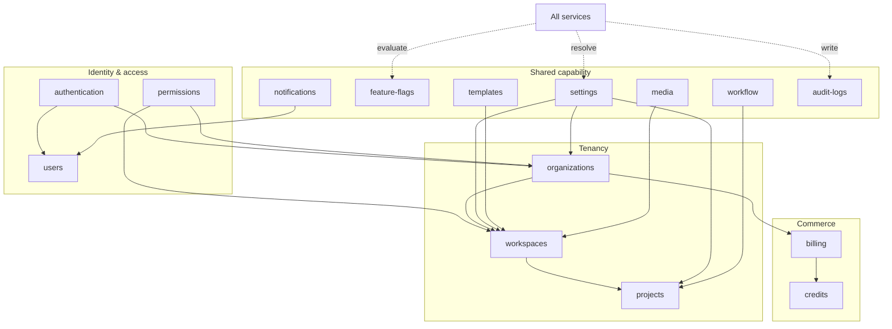

# 04 — Platform Layer

The shared capabilities every other layer consumes: identity, tenancy, commerce, notification, media, editorial workflow, configuration, audit, flags, and permissions. Nothing here knows what an article is.

## The defining rule

**The Platform Layer is content-agnostic.** If a capability would change because ContentOS wrote video scripts instead of articles, it does not belong here. A workspace, a credit, a notification, an audit entry, and a permission check are identical whatever the product produces — that is the test for membership in this folder.

Five prohibitions follow, and they are absolute:

| Prohibition | Why |
|---|---|
| **Never call an AI model directly** | Only the AI Gateway may reach a model provider (ADR-008). Where a platform service needs generation — media, for example — it issues an `AIRequest` through the Gateway like any engine |
| **Never contain SEO, research, or content-generation logic** | That is `05-content-platform/` |
| **Never own Knowledge Platform responsibilities** | Evidence, entities, citations, and retrieval belong to `11-knowledge-platform/` |
| **Never bypass the EventBus** | Every event is written to the transactional outbox inside the state-changing transaction (ADR-020) |
| **Never violate tenancy** | `tenant_id` is the workspace; `organization_id` is the commercial boundary (ADR-017) |

## Services

| # | Document | Owns |
|---|---|---|
| 1 | `authentication.md` | Credential verification, sessions, tokens, MFA, SSO handoff, service-to-service auth |
| 2 | `organizations.md` | Organization lifecycle, quota, plan-limit projection, suspension cascade, closure |
| 3 | `users.md` | Global identity, profile, verification, deactivation, erasure orchestration |
| 4 | `workspaces.md` | Workspace lifecycle, membership, provisioning, archival |
| 5 | `projects.md` | Project lifecycle, defaults, calendar |
| 6 | `billing.md` | Plans, subscriptions, invoices, payment methods, dunning |
| 7 | `credits.md` | Ledger, holds, consumption, settlement, balance |
| 8 | `notifications.md` | Channels, preferences, delivery, digests |
| 9 | `media.md` | Asset storage, transforms, CDN delivery, generation dispatch |
| 10 | `workflow.md` | Editorial workflow: tasks, assignment, approval chains, reminders |
| 11 | `templates.md` | Content production templates, versioned |
| 12 | `settings.md` | Hierarchical configuration resolution |
| 13 | `audit-logs.md` | Append-only audit trail and compliance export |
| 14 | `feature-flags.md` | Flag definition, targeting, evaluation, kill switches |
| 15 | `permissions.md` | Permission catalogue, role mapping, effective-permission resolution |

## Boundary with folders 02 and 16

Three folders describe overlapping subject matter and must not duplicate each other:

| Folder | Answers |
|---|---|
| `02-domain-design/` | **What the model is** — aggregates, invariants, lifecycle state machines, domain events |
| `04-platform/` (here) | **What the service does** — APIs, orchestration, caching, integration, failure handling, operations |
| `16-security/` | **How it is defended** — threat model, controls, compliance, attack surface |

A rule stated in Phase 2 is *referenced* here, never restated. `workspaces.md` does not re-list the last-owner invariant; it specifies the service that enforces it. Where this document set and Phase 2 disagree, **Phase 2 wins**.

The same applies to `permissions.md` and `16-security/rbac.md`: permissions owns the *catalogue and the resolution service*; security owns the *threat analysis and the controls that verify it*.

## Service dependency map

Dependencies point downward and never cycle. `settings`, `feature-flags`, and `audit-logs` are consumed by everything and depend on almost nothing — they are the base of the layer.

## Shared conventions

| Concern | Convention |
|---|---|
| Tenancy | Every service resolves `TenantContext` from the request; no service derives tenancy itself except the gateway's resolver |
| Events | Outbox in the state-changing transaction; consumers idempotent by `eventId` (ADR-020) |
| Errors | Typed and mapped to the standard envelope; no service returns a raw provider error |
| Idempotency | Every mutating operation reachable from a public endpoint is idempotent by `Idempotency-Key` |
| Caching | Tenant-prefixed keys, event-driven invalidation, TTL as a backstop — never TTL alone for authorization data |
| Audit | Security-relevant actions write an audit row in the same transaction as the change |
| Providers | External systems reached only through `09-integrations/` adapters |

## Where new platform code goes

| If the capability… | Belongs in |
|---|---|
| Verifies who someone is | `authentication.md` |
| Decides what they may do | `permissions.md` |
| Determines what a workspace is configured to do | `settings.md` |
| Determines whether a capability is switched on | `feature-flags.md` |
| Moves money or entitlement | `billing.md` / `credits.md` |
| Tells a human something happened | `notifications.md` |
| Records that something happened, permanently | `audit-logs.md` |
| Stores or transforms a binary | `media.md` |
| Tracks human work | `workflow.md` |
| Concerns what the product *produces* | **Not here** — `05-content-platform/` |

## Proposed ADRs raised in this phase

| ADR | Subject | Raised in |
|---|---|---|
| **ADR-023** | Feature flags built in-house, config-backed, rather than a vendor SDK | `feature-flags.md` |
| **ADR-024** | Hierarchical settings resolution: organization → workspace → project, with run-time snapshotting | `settings.md` |

Both are **Proposed**, recorded in `01-system-architecture/13-adr-log.md`, and tracked as open questions pending acceptance.

## Cross References

- `01-system-architecture/03-high-level-architecture.md` — the layer this folder implements
- `01-system-architecture/04-context-map.md` — Identity & Access, Commerce, Work Management, Notification contexts
- `02-domain-design/` — the aggregates these services operate on
- `03-database/tables.md` — physical schema
- `05-content-platform/` — the consumer of nearly everything here
- `13-event-platform/` — outbox, bus, consumer groups
- `16-security/` — threat model and controls
- `09-integrations/` — Better Auth, Stripe, and every other external dependency
