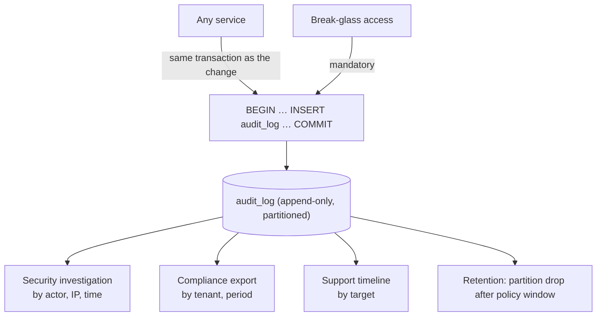

# Audit Logs Service

> **Status:** v2.0 — complete. Platform Layer service. Schema: `03-database/tables.md` §8 (`audit_log`, append-only).

## Purpose

Answer "who did what, when, and to what?" — permanently, and in a form that survives the deletion of everything it describes.

Audit exists for three distinct consumers with different needs, and conflating them produces a log useful to none: **security** needs it during an investigation, **compliance** needs it for SOC 2 and GDPR evidence, and **support** needs it to explain to a customer why their article changed. One record set, three access paths.

## Responsibilities

- Append-only recording of security- and business-relevant actions.
- A canonical action catalogue: what is auditable and what each action means.
- Query APIs scoped by tenant, actor, target, and time.
- Retention enforcement, deliberately longer than operational logging.
- Compliance export in a defensible format.
- Recording **break-glass** and privileged access as first-class events.

## Non-responsibilities

| Not owned | Owner |
|---|---|
| Operational logs, traces, metrics | `14-operations/monitoring.md` |
| Domain events | `13-event-platform/` |
| The `audit_*` columns on every table (`created_by`, `updated_by`) | Each owning service |
| Content revision history | `02-domain-design/articles.md` |
| Credit ledger | `credits.md` |
| Security alerting and detection | `16-security/` |

**Audit versus logs versus events — a distinction worth stating precisely:**

| | Purpose | Retention | Mutable | Consumer |
|---|---|---|---|---|
| **Operational logs** | Debugging | 30 days | Sampled, droppable | Engineers |
| **Domain events** | Integration | 7–30 days | Pruned after consumption | Services |
| **Audit log** | Accountability | **Years** | **Never** | Security, compliance, support |

An event says "a thing happened so you can react." An audit row says "a person did a thing and we can prove it." A domain event may be dropped under load; an audit row may not.

## Domain boundaries

Cross-cutting infrastructure, no bounded context. Every service writes to it; only this service reads it back.

Audit rows carry `tenant_id` and `organization_id` where the action is tenant-scoped, and organization-only where it is not (a role change at organization level). Platform-admin actions carry neither and are readable only by platform admins.

## Architecture



**The write is in the same transaction as the change it describes.** Not an event, not a background job. If the change commits and the audit row does not, the record is a lie — and the failure mode of an async audit write (silently missing rows under load) is precisely the failure mode a security investigation cannot tolerate.

### What must be audited

| Category | Actions |
|---|---|
| **Identity** | Login success and failure, MFA enrollment and removal, password change, email change, session revocation, SSO enforcement, domain verification |
| **Access** | Role grants and revocations at both scopes, membership invitations and acceptances, permission changes |
| **Tenancy** | Workspace and organization creation, suspension, archival, deletion request, purge |
| **Commerce** | Subscription changes, payment-method changes, credit adjustments, refunds |
| **Content authorization** | Outline approvals, gate verdict overrides, publish, unpublish, schedule changes |
| **Configuration** | Settings changes (with before/after), template publication, feature-flag changes, connector credential rotation |
| **Data** | Exports, erasure requests and completions, tenant-level restores |
| **Privileged** | **Break-glass elevation, cross-tenant reads by platform admins, direct data repair** |

The last row is the one that matters most during an incident: privileged access is recorded with the same rigour as customer actions, and reviewed after every incident (`14-operations/incident-response.md` §11).

### Record shape

```ts
interface AuditRecord {
  id: string;
  tenantId?: string;          // absent for platform-level actions
  organizationId?: string;
  actorId?: string;           // absent for system actions
  actorType: 'user' | 'system' | 'platform_admin' | 'service';
  action: string;             // 'workspace.member.role_changed' — dot.case catalogue
  targetType: string;
  targetId: string;
  before?: unknown;           // redacted per key policy
  after?: unknown;
  reason?: string;            // mandatory for privileged and destructive actions
  correlationId: string;
  ipHash?: string;
  occurredAt: string;
}
```

## APIs

| Endpoint | Purpose | Authority |
|---|---|---|
| `GET /v1/workspaces/{id}/audit` | Workspace audit trail, filterable by action, actor, target, time | `admin` |
| `GET /v1/organizations/{id}/audit` | Organization-level trail | `org_admin` |
| `GET /v1/audit/targets/{type}/{id}` | Everything that happened to one object | `admin` |
| `POST /v1/organizations/{id}/audit/export` | Compliance export (202 + handle) | `org_owner` |
| `GET /v1/admin/audit` | Cross-tenant view for incident response | Platform admin — **itself audited** |

**Internal:** `AuditWriter.record(tx, AuditRecord)` — requires a transaction handle by signature, exactly like the event publisher. There is no overload that writes outside a transaction.

There is **no delete or update endpoint**, at any authority level.

## Events

Emits nothing routinely — an audit log that emits events would create a feedback loop and double the write volume of the platform's busiest write path. **The audit write itself is not an event**: it is a synchronous insert in the caller's transaction, deliberately, for the reasons in Architecture. The two exceptions below are ordinary events and use the transactional outbox and `EventBus` like everything else (ADR-020).

Two exceptions, both about the log itself rather than its contents:

| Emitted | Consumers | Purpose |
|---|---|---|
| `AuditExportCompleted` | Notifications | Export is ready |
| `AuditWriteFailed` | Observability, Security | **Never fires in normal operation** — a failure here means a change committed without its record |

Consumes nothing. Services write directly, synchronously, in their own transaction.

## Database impact

Owns `audit_log` (`03-database/tables.md` §8).

| Property | Value |
|---|---|
| Immutability | **`UPDATE` and `DELETE` revoked at the role level** — no code path can alter a row |
| Partitioning | RANGE on `created_at`, monthly, from S2 |
| Retention | **7 years** for compliance categories; 2 years for the rest. Enforced by partition drop |
| Indexes | `(tenant_id, created_at DESC)`, `(target_type, target_id, created_at DESC)`, `(actor_id, created_at DESC)` |
| RLS | Standard tenant policy; platform-level rows readable only by the platform-admin role |
| Volume | 10⁹ — one of the largest tables |

Retention deliberately exceeds operational log retention by years. It is also stored **separately from operational logs** so that an operational retention change cannot shorten an audit trail — a mistake that is easy to make and impossible to undo.

**Redaction at write time.** `before`/`after` pass through a key-based redaction policy: credential references, tokens, and settings values marked sensitive are replaced with `"[redacted]"`. Redaction happens on write, not on read, because a secret stored in an immutable table cannot later be removed.

## Security

- **Immutability is the security property.** Role-level revocation means a compromised application role cannot tamper with history; altering it requires database-superuser access, which no application service holds.
- **Break-glass access is audited by the same mechanism it might be used to investigate.** Platform-admin cross-tenant reads write audit rows, and those rows are reviewed after every incident.
- Reading another tenant's audit trail is itself a privileged action producing its own record.
- IP addresses are stored hashed; audit is for accountability, not surveillance, and a hash supports "same source?" without retaining personal data unnecessarily.
- **User erasure does not delete audit rows.** The actor reference remains, pointing at an anonymized user record — which is why `users.md` anonymizes rather than deletes. Regulatory obligations to retain security records and to erase personal data are reconciled by anonymizing the subject while preserving the event.
- Export is `org_owner`-only, rate-limited, and audited — a full audit export is a high-value target.

## Performance

- Writing is one insert on a partitioned append-only table with no unique constraints beyond the primary key — the cheapest possible write shape, which matters because it is in the transaction of every auditable action.
- Query paths are covered by the three indexes above; an audit query that is not by tenant, target, or actor is not supported, and adding a fourth access pattern requires an index decision rather than a scan.
- Exports run as background jobs against a **replica**, streaming to R2. A seven-year export must never touch the primary.
- Partition pruning means a "last 30 days" query reads one partition regardless of total history.
- No read model is maintained — audit reads are rare compared to writes, and a projection would add write cost to the hottest path for no benefit.

## Failure handling

| Failure | Behaviour |
|---|---|
| Audit insert fails | **The whole transaction fails.** The change does not commit either. An unrecorded privileged action is worse than a failed one |
| Partition missing for the current month | Write fails, taking the business transaction with it — which is why partition pre-creation is a deploy-verification check (`03-database/migrations.md`) |
| Export job fails | Retried; partial exports are discarded rather than delivered, since a partial compliance export is misleading |
| Retention job fails to drop a partition | Alerts; over-retention is a compliance concern (data kept beyond policy) as much as under-retention |
| Redaction policy misses a sensitive key | Cannot be repaired in place — the row is immutable. Mitigated by an allowlist approach (record only known-safe keys in `before`/`after`) rather than a denylist |
| Very high write volume during an incident | Audit writes are never sampled or dropped. If they become a bottleneck, the fix is partitioning and hardware, not sampling |

The allowlist choice deserves emphasis: a denylist redaction policy fails open when a new sensitive key is added, and in an immutable table that failure is permanent.

## Observability

- **Metrics:** `audit_records_total{action_category}`, `audit_write_duration_seconds`, `audit_write_failures_total`, `privileged_access_total{actor}`, `audit_exports_total`, `audit_partition_coverage_days`.
- **Logs:** this service logs about itself sparingly — the audit trail is the record, and duplicating it into operational logs would double sensitive-data exposure.
- **Alerts:** any `audit_write_failures_total` (**page** — changes may be committing unrecorded); `privileged_access_total` spike; partition coverage below 30 days ahead; retention job failure.

## Implementation notes

- `AuditWriter.record` takes a transaction handle by signature. This is the single most important design detail in the service: it makes writing outside a transaction impossible rather than merely discouraged.
- The **action catalogue is reference data**, not free strings. A new action is registered before use, so filters and compliance mappings stay complete. Ad-hoc action names produce an unqueryable log.
- Never make audit writes asynchronous "for performance". The moment they are, they become droppable under exactly the load conditions where they matter most.
- `reason` is mandatory for privileged and destructive actions, enforced at the service boundary — a break-glass read with no stated reason is refused.
- Do not add a "delete my audit history" capability. GDPR erasure is satisfied by anonymizing the subject, and this is the documented position (`16-security/compliance.md`).

## Cross references

- `03-database/tables.md` §8 — `audit_log` schema and role-level immutability
- `users.md` — anonymization preserving audit references
- `settings.md` — before/after values recorded on configuration change
- `workflow.md` — approval decisions, the human half of publication authorization
- `credits.md` — adjustments audited alongside ledger entries
- `14-operations/incident-response.md` — break-glass procedure and post-incident review
- `16-security/compliance.md` — retention obligations and GDPR reconciliation
- `13-event-platform/` — the deliberately different concept
