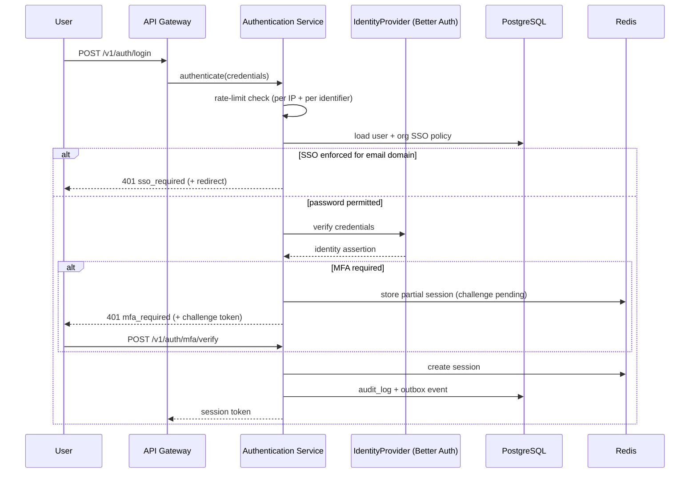
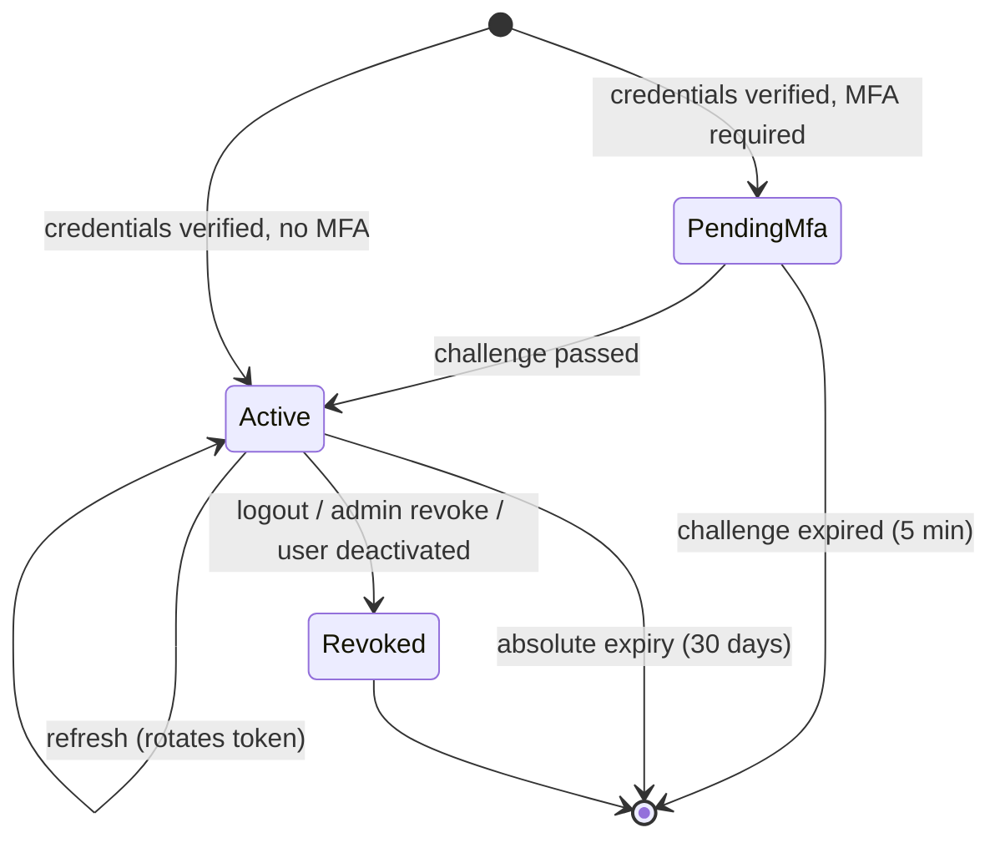

# Authentication Service

> **Status:** v2.0 — complete. Platform Layer service. Domain model: `02-domain-design/organizations.md` (User, SsoConfiguration). Controls and threat analysis: `16-security/authentication.md`.

## Purpose

Establish *who is making a request*, and nothing more. Authentication answers identity; it never answers authority — that is `permissions.md`. Keeping the two apart is what allows a single identity to hold different authority in twelve workspaces without the authentication path knowing anything about workspaces.

The service wraps **Better Auth** behind the `IdentityProvider` interface (ADR-012). Better Auth is a framework, not a hosted service: it runs in our process, stores its state in our PostgreSQL, and can be replaced without touching any consumer, because consumers depend on the interface.

## Responsibilities

- Verify credentials: password, OAuth, and enterprise SSO (SAML/OIDC).
- Issue, refresh, and revoke sessions and tokens.
- Enforce MFA enrollment and challenge where policy requires it.
- Enforce SSO where an organization has it enforced, including the documented break-glass path.
- Issue and verify short-lived service-to-service tokens.
- Rate-limit and lock out credential-stuffing attempts.
- Emit authentication events for audit and notification.

## Non-responsibilities

| Not owned | Owner |
|---|---|
| Authorization, roles, permission checks | `permissions.md` |
| Tenant context resolution | API Gateway's Tenant Context Resolver (`01-system-architecture/08-c4-component.md`) |
| User profile, lifecycle, erasure | `users.md` |
| Organization SSO *configuration* and domain verification | `organizations.md` |
| SAML/OIDC protocol mechanics | `09-integrations/better-auth.md` |
| Password storage algorithm choice, MFA cryptography | `16-security/authentication.md` |
| Session storage infrastructure | `12-storage-platform/redis.md` |

**The sharpest boundary:** this service says "this is user `U`, session `S`, authenticated at `T`, via method `M`." It does **not** say which workspace they are in. A successful authentication grants access to nothing until permissions resolve.

## Domain boundaries

Bounded context: **Identity & Access**. Aggregates touched: `User` (read), `SsoConfiguration` (read), `Session` (owned here, not a Phase 2 aggregate because it is infrastructure state with a TTL, not business state).

Upstream: `organizations.md` supplies SSO configuration and verified domains. Downstream: every request path consumes the authenticated identity.

## Architecture

### Session model

| Property | Value |
|---|---|
| Session store | Redis, key `session:{sessionId}`, tenant-agnostic |
| Idle timeout | 24 hours |
| Absolute expiry | 30 days |
| Token rotation | On every refresh; the previous token is invalidated immediately |
| Revocation | Immediate — Redis delete plus a revocation event for other instances |
| Cookie flags | `HttpOnly`, `Secure`, `SameSite=Lax`, asserted by an E2E test |

**Sessions live in Redis, not PostgreSQL.** They are high-churn, short-lived, and their loss is recoverable by re-login. Placing them in PostgreSQL would put authentication traffic on the transactional primary for no durability benefit.

## APIs

| Endpoint | Purpose | Notes |
|---|---|---|
| `POST /v1/auth/register` | Create an account | Emits verification email; no session until verified |
| `POST /v1/auth/login` | Password or OAuth | `401 sso_required` when SSO is enforced for the domain |
| `POST /v1/auth/mfa/verify` | Complete an MFA challenge | Challenge token valid 5 minutes |
| `POST /v1/auth/refresh` | Rotate the session token | Old token invalid immediately |
| `POST /v1/auth/logout` | Revoke the current session | |
| `POST /v1/auth/logout-all` | Revoke every session for the user | Also triggered by password change |
| `GET /v1/auth/sso/{orgSlug}/start` | Begin an SSO flow | Redirects to the IdP |
| `POST /v1/auth/sso/callback` | IdP assertion handler | Validates signature and audience |
| `POST /v1/auth/password/reset` | Request or complete a reset | Same response whether the account exists |
| `GET /v1/auth/session` | Current identity | Used by the web app on load |

**Internal:** `IdentityProvider.verify(credentials) → IdentityAssertion`; `SessionService.create/refresh/revoke`; `ServiceTokenIssuer.issue(audience, ttl)` for service-to-service calls.

## Events

| Event | Consumers | Payload |
|---|---|---|
| `UserAuthenticated` | Audit, Notifications (new-device alert) | `{ userId, method, ipHash, userAgentHash }` |
| `AuthenticationFailed` | Security monitoring, Audit | `{ identifierHash, reason, ipHash }` |
| `SessionRevoked` | All gateway instances (cache purge), Audit | `{ sessionId, userId, reason }` |
| `MfaEnrolled` / `MfaRemoved` | Audit, Notifications | `{ userId, factorType }` |
| `SsoLoginSucceeded` | Audit | `{ userId, organizationId, protocol }` |
| `AccountLocked` | Notifications, Security monitoring | `{ userId, until, reason }` |

All emitted through the outbox (ADR-020). **Payloads carry hashed identifiers only** — never raw IP addresses, emails, or user agents, because these events reach broader consumers than the auth tables do.

Consumed: `UserDeactivated` and `OrgMembershipRevoked` → revoke all sessions; `SsoEnforced` → invalidate password sessions for matching domains.

## Database impact

Owns `users` (read/write of auth-relevant columns only: `email_verified`, `mfa_state`), plus Better Auth's own tables (`auth_accounts`, `auth_verifications`) which live in the same database and inherit the identity-table RLS exception.

Writes `audit_log` on every authentication event. Reads `organizations.plan_limits` (SSO entitlement) and `sso_configurations`/`verified_domains` for policy. Session state is Redis-only.

**No new tables beyond Better Auth's.** Authentication deliberately adds no schema of its own; identity is `users.md`'s, policy is `organizations.md`'s.

## Security

Domain-specific here; full controls in `16-security/authentication.md`.

- **Uniform responses.** Login failure, unknown account, and unverified account return the same shape and timing. Password reset always responds identically whether the address exists.
- **Rate limiting** is layered: per IP, per identifier, and per organization. Lockout is exponential and time-boxed, never permanent — permanent lockout is a denial-of-service vector against a legitimate user.
- **SSO enforcement with break-glass** (`02-domain-design/organizations.md` rule 11): when SSO is enforced, password auth is refused for matching domains **except** for `org_owner` accounts, which must have MFA enrolled. Without this, a misconfigured IdP locks an organization out permanently.
- **Assertion validation:** SAML/OIDC assertions are validated for signature, audience, issuer, expiry, and replay (`jti` cache) before any identity is established.
- **Session fixation:** a new session identifier is issued on every privilege change — login, MFA completion, password change.
- **Service tokens** are short-lived (5 minutes), audience-scoped, and never long-lived API keys.

## Performance

| Path | Budget (p95) |
|---|---|
| Session validation (Redis) | < 5 ms |
| Login (password verification) | < 300 ms — deliberately slow; hashing cost is a security control |
| Token refresh | < 20 ms |
| SSO callback | < 500 ms (IdP round-trip dominates) |

Session validation is on **every authenticated request**, so it is a single Redis `GET` with no database access. The gateway caches nothing about sessions beyond the request scope — a revoked session must stop working immediately, and a cache with a TTL would not honour that.

Password hashing cost is tuned so verification takes ~250 ms on production hardware, and is reviewed annually.

## Failure handling

| Failure | Behaviour |
|---|---|
| Redis unavailable | **Fail closed** — existing sessions cannot be validated, so requests return `503`. Authentication is not a capability that may degrade open |
| IdP (SSO) unavailable | SSO login fails with a typed error; password fallback only for break-glass accounts; existing sessions remain valid |
| Better Auth error | Typed `AuthenticationUnavailable`; never a generic 500 leaking internals |
| Session revocation event lost | Absolute and idle expiry bound exposure; a DLQ entry on `SessionRevoked` pages, because a live revoked session is a security incident |
| Clock skew on assertion validation | 60-second tolerance; beyond that, rejected |
| Partial MFA state | Challenge tokens expire in 5 minutes and are single-use; an abandoned challenge leaves no session |

## Observability

- **Metrics:** `auth_attempts_total{method,result}`, `auth_duration_seconds{method}`, `sessions_active`, `session_validation_duration_seconds`, `mfa_challenges_total{result}`, `account_lockouts_total`, `sso_logins_total{organization}`, `service_tokens_issued_total`.
- **Logs:** every attempt with hashed identifier, method, result, correlation id — **never** passwords, tokens, or raw addresses.
- **Traces:** authentication is a span on every request; the login path traces into the IdP.
- **Alerts:** authentication failure rate above baseline for a single organization (credential stuffing); `SessionRevoked` in the DLQ (**page**); SSO callback failure rate above 5%; lockout spike.

## Implementation notes

- Better Auth is instantiated once and accessed only through `IdentityProvider`. No consumer imports the Better Auth SDK — enforced by import lint.
- Session validation is middleware, not per-controller code, so no endpoint can omit it. The single exception is the health-check route.
- `logout-all` is triggered automatically on password change and on MFA factor removal; forgetting this is a common and serious omission.
- The break-glass path must be tested explicitly: an integration test asserts an `org_owner` can authenticate with a password while SSO is enforced, and that a non-owner on the same domain cannot.
- Authentication never reads or writes `tenant_id`. If a code path here needs a workspace, the boundary has been crossed incorrectly.

## Cross references

- `02-domain-design/organizations.md` — User and SsoConfiguration aggregates, break-glass rule
- `permissions.md` — what happens after identity is established
- `users.md` — account lifecycle and erasure
- `organizations.md` — SSO configuration and domain verification
- `09-integrations/better-auth.md` — provider adapter, protocol mechanics
- `16-security/authentication.md` — password policy, MFA cryptography, threat model
- `01-system-architecture/09-request-flow.md` — where authentication sits in the request pipeline
- `12-storage-platform/redis.md` — session store configuration
