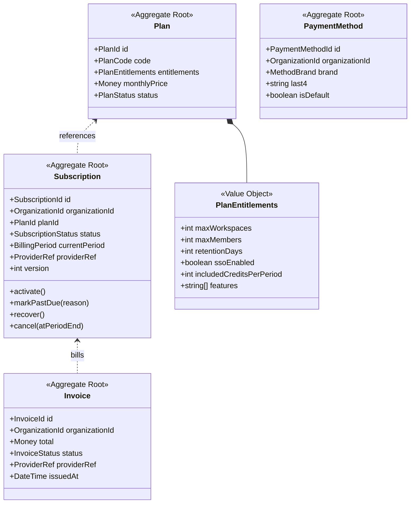
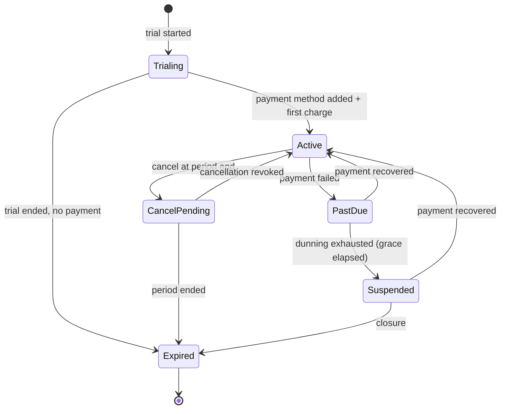
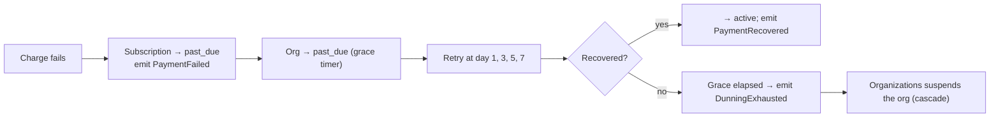

# Billing Service

> **Status:** v2.0 — complete. Platform Layer service. Bounded context: **Commerce** — modelled here rather than in Phase 2, because its model is inseparable from the service and its provider (`02-domain-design/README.md`).
> **Provider:** Stripe behind the `PaymentProvider` interface (ADR-012).

## Purpose

Own the commercial relationship: what a customer has bought, whether they are paid up, and what they are therefore entitled to. Billing is the **supplier of entitlement** to the rest of the platform — it publishes `PlanLimits`, and everything else applies them.

It resolves at the **organization** level (ADR-017). A workspace is never billed; an agency has one subscription covering fifty client workspaces, and usage is attributed per workspace for reporting while the invoice is singular.

## Responsibilities

- Plans and their entitlements: workspace cap, member cap, retention days, SSO availability, included credits.
- Subscription lifecycle: trial, active, past due, cancelled, expired.
- Payment methods, invoices, and receipts — as records; the money itself moves through Stripe.
- Dunning: retry schedule, grace period, and the transition into `past_due`.
- Publishing `SubscriptionChanged` so `organizations.md` can project `PlanLimits`.
- Answering "is this organization's commercial state settled?" for closure.
- Reconciling Stripe's state with ours.

## Non-responsibilities

| Not owned | Owner |
|---|---|
| Credit ledger, holds, consumption, settlement | `credits.md` |
| Organization lifecycle and the suspension cascade | `organizations.md` |
| Enforcing limits at request time | `organizations.md` (quota), `credits.md` (spend), `feature-flags.md` (capability) |
| Card data, PCI scope | Stripe — **no card data ever enters this system** |
| Stripe API mechanics, webhook signature verification | `09-integrations/stripe.md` |
| Pricing strategy | Founder decision, OQ-10 |

**The credits boundary:** Billing sells credits and records the purchase; `credits.md` owns the ledger that spends them. Billing answers "how many did they buy?"; Credits answers "how many are left?"

## Domain boundaries

Bounded context: **Commerce**. Relationship to Identity & Access is **Customer/Supplier** — Commerce supplies entitlement, Identity applies it. This service sits **above** the workspace boundary alongside `organizations`, so its tables key on `organization_id`.

Commerce tables were deliberately excluded from `03-database/tables.md` §8 pending this document; they are specified below and land in migration `0021_commerce`.

## Domain model

`Plan` is **reference data**, not tenant data: seeded, versioned, and identical for every customer. `Subscription`, `Invoice`, and `PaymentMethod` are organization-scoped.

### Subscription lifecycle

### Dunning

Billing **never suspends anything itself.** It reports commercial facts; `organizations.md` decides and executes the cascade. This keeps one service in charge of tenancy state transitions.

## APIs

| Endpoint | Purpose | Authority |
|---|---|---|
| `GET /v1/plans` | Public plan catalogue | Public |
| `GET /v1/organizations/{id}/subscription` | Current subscription and entitlements | `billing_owner`, `org_admin` |
| `POST /v1/organizations/{id}/subscription` | Start or change plan (checkout session) | `billing_owner` |
| `POST /v1/organizations/{id}/subscription/cancel` | Cancel at period end | `billing_owner` |
| `DELETE /v1/organizations/{id}/subscription/cancel` | Revoke cancellation | `billing_owner` |
| `GET /v1/organizations/{id}/invoices` | Invoice history | `billing_owner` |
| `GET /v1/organizations/{id}/invoices/{invoiceId}` | Invoice detail + hosted URL | `billing_owner` |
| `GET/POST /v1/organizations/{id}/payment-methods` | List / add (via provider session) | `billing_owner` |
| `POST /v1/organizations/{id}/credits/purchase` | Buy a credit pack | `billing_owner` |
| `GET /v1/organizations/{id}/billing-portal` | Provider-hosted portal session | `billing_owner` |
| `POST /webhooks/stripe` | Provider webhook receiver | Signature-verified, unauthenticated |

**Internal:** `EntitlementService.limits(orgId) → PlanEntitlements`; `CommercialStateService.isSettled(orgId) → boolean` (consumed by closure); `CreditPurchaseHandler` (bridges to `credits.md`).

Plan changes go through **provider-hosted checkout and portal sessions**, so card entry happens on Stripe's surface. This is the single largest PCI-scope reduction available and is non-negotiable.

## Events

All events below are written to the transactional outbox **in the same transaction as the state change** and published through the `EventBus` (ADR-020). No path in this service publishes directly to a bus.

| Emitted | Consumers | Criticality |
|---|---|---|
| `SubscriptionChanged` | **Organizations (PlanLimits projection)**, Credits (included allowance), Notifications | **Critical** |
| `PaymentFailed` | Organizations (→ past_due), Notifications | Critical |
| `PaymentRecovered` | Organizations (→ active), Notifications | Critical |
| `DunningExhausted` | Organizations (suspend), Notifications | **Critical — pages on DLQ** |
| `SubscriptionCancelled` | Organizations (closure sequence at period end), Notifications | Critical |
| `InvoiceIssued` / `InvoicePaid` | Notifications, Read models | Standard |
| `CreditPackPurchased` | **Credits (grant)**, Notifications | **Critical — a paid purchase that never grants is a refund event** |
| `PaymentMethodAdded` / `Removed` | Notifications, Audit | Standard |

| Consumed | From | Reaction |
|---|---|---|
| `OrganizationCreated` | Organizations | Create the trial subscription |
| `OrganizationClosureRequested` | Organizations | Verify settlement; cancel subscription at period end |
| `CreditsExhausted` | Credits | Notify billing owner with an upgrade path |

Every `SubscriptionChanged` payload carries a **monotonic subscription version**, so an out-of-order delivery is ignored rather than applied (`organizations.md` failure handling).

## Database impact

New tables, landing in migration `0021_commerce`:

| Table | Key columns | Constraints |
|---|---|---|
| `plans` | `code`, `entitlements JSONB`, `monthly_price NUMERIC(12,4)`, `status` | `UNIQUE (code)`; reference data, **no `tenant_id`** — RLS exception requiring an ADR note (see Implementation notes) |
| `subscriptions` | `organization_id`, `plan_id`, `status`, `current_period_start/end`, `provider_ref`, `version` | `UNIQUE (organization_id) WHERE status <> 'expired'` — one active subscription per organization; `CHECK` on status |
| `invoices` | `organization_id`, `total`, `currency`, `status`, `provider_ref`, `issued_at`, `paid_at` | `UNIQUE (provider_ref)` — webhook idempotency; append-only |
| `payment_methods` | `organization_id`, `brand`, `last4`, `is_default`, `provider_ref` | Partial unique `(organization_id) WHERE is_default`; **no card data** |
| `provider_webhook_events` | `provider`, `provider_event_id`, `type`, `payload JSONB`, `processed_at` | `UNIQUE (provider, provider_event_id)` — the webhook dedupe guarantee |

All organization-scoped tables sit above the workspace boundary and use organization-membership policies, consistent with the four existing identity exceptions. `plans` is global reference data with a read-only-to-all policy.

## Security

- **No card data ever enters this system.** Only provider references, brand, and last four digits. Checkout and portal are provider-hosted; PCI scope is SAQ-A.
- **Webhooks are signature-verified** before any processing, deduplicated by `(provider, provider_event_id)`, and processed idempotently. An unverified webhook is a forged-payment vector.
- `billing_owner` grants **no content or membership authority** — separation of duties (`organizations.md`).
- Invoice URLs are provider-hosted, short-lived, and generated per request; they are never stored or emailed as permanent links.
- Every subscription change, cancellation, and payment-method change is audit-logged with actor.
- Amounts are `NUMERIC`, never floating point — a rounding error in money is a compliance problem, not a bug.

## Performance

- `PlanEntitlements` is read constantly and is cached per `organizationId` with event-driven invalidation on `SubscriptionChanged`; quota checks never call this service synchronously.
- Webhook processing is **fast-ack, async-process**: verify signature, persist the raw event, return `200`, then process from the queue. A slow handler causes provider retries and duplicate delivery.
- Invoice lists are cursor-paginated and fetched from our records, not from the provider, so a provider outage does not break the billing page.
- Reconciliation runs nightly rather than on read; the customer-facing path never waits on Stripe.

## Failure handling

| Failure | Behaviour |
|---|---|
| Stripe unavailable | Purchases and plan changes fail with a typed retryable error; **existing entitlements continue from local state** — a provider outage must never suspend a paying customer |
| Webhook arrives twice | Unique constraint on `provider_event_id`; second processing is a no-op |
| Webhook never arrives | Nightly reconciliation compares provider state to ours and repairs; discrepancies alert |
| Webhook arrives out of order | Subscription version comparison; stale events ignored |
| `CreditPackPurchased` consumer fails | **Pages.** The customer has paid and holds no credits; retried aggressively, then manual grant with audit |
| Charge succeeds, our record fails | Reconciliation detects and repairs; the provider is the source of truth for money, we are the source of truth for entitlement |
| Downgrade puts organization over quota | Over-quota workspaces become read-only; **never deleted** (`organizations.md` rule 7) |
| Closure requested with an open invoice | `CommercialStateService.isSettled` returns false; closure refused with a typed error |

## Observability

- **Metrics:** `subscriptions_total{status,plan}`, `mrr_cents` (gauge), `payment_failures_total`, `dunning_recoveries_total`, `webhook_events_total{type,result}`, `webhook_processing_lag_seconds`, `reconciliation_discrepancies_total`, `credit_purchases_total`.
- **Logs:** every subscription transition and webhook with provider event id, organization, correlation id — never payloads containing customer PII.
- **Alerts:** `CreditPackPurchased` or `DunningExhausted` in the DLQ (**page**); `reconciliation_discrepancies_total` non-zero (**page** — money and entitlement have diverged); webhook lag above 5 minutes; payment failure rate above baseline.

## Implementation notes

- **Stripe is the source of truth for money; we are the source of truth for entitlement.** When they disagree about a charge, Stripe wins and we repair. When they disagree about what a plan grants, we win — entitlements are our product decision.
- `plans` as a global table without `tenant_id` is a **sixth RLS exception**. Reference data with no tenant dimension genuinely cannot carry one, and the rule requires an ADR rather than a silent addition — raised as part of Proposed **ADR-025** in `13-adr-log.md`. Until accepted, `plans` is allowlisted with a written justification identical in form to the identity exceptions.
- Never call Stripe on a read path. Every customer-facing billing screen reads our tables.
- Trial expiry, dunning retries, and period rollovers are scheduled jobs driven by our own timers, not by provider callbacks alone — relying solely on webhooks means a missed webhook silently extends a trial forever.
- Plan entitlement changes are **reference-data migrations**, applied idempotently, and never edited per customer. A bespoke limit for one enterprise customer is a new plan code, not a mutated row.

## Cross references

- `credits.md` — the ledger this service funds
- `organizations.md` — the consumer of `PlanLimits` and the executor of every cascade
- `09-integrations/stripe.md` — provider adapter, webhook mechanics, retry policy
- `feature-flags.md` — feature entitlements versus operational flags
- `notifications.md` — dunning and receipt delivery
- `03-database/tables.md` — schema conventions these tables follow
- `16-security/compliance.md` — PCI scope and financial record retention
- `99-open-questions.md` — OQ-10 (pricing), OQ-13 (regional payment providers)
