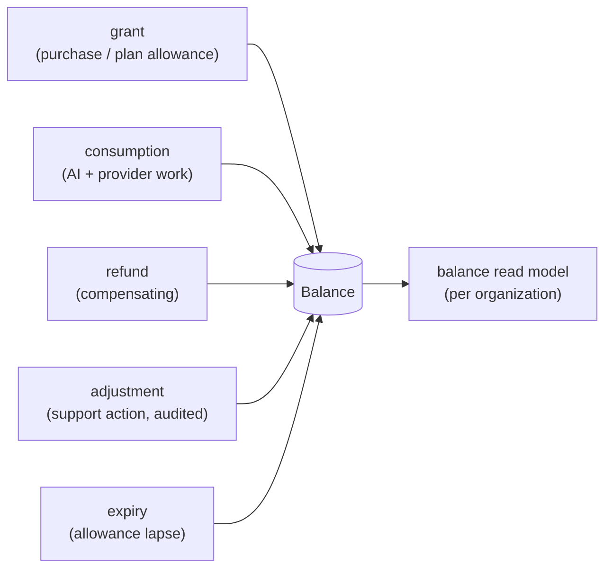
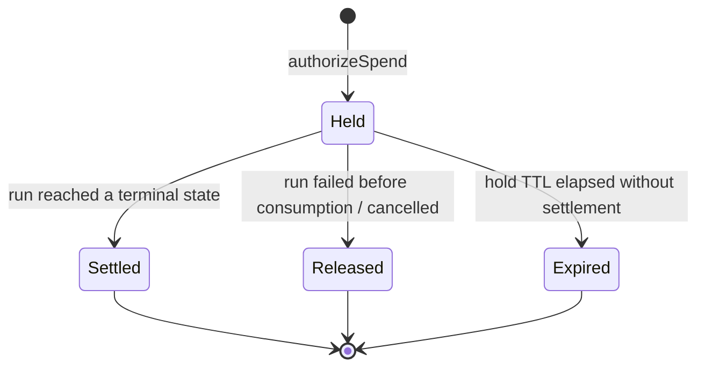

# Credits Service

> **Status:** v2.0 — complete. Platform Layer service. Bounded context: **Commerce** (ledger half). Funded by `billing.md`, consumed by every run-starting path.

## Purpose

Meter and control consumption. A credit is the customer-facing unit of platform work; the ledger that tracks it is an **immutable financial record** that must reconcile exactly with metered AI and provider cost.

The service exists because AI spend is unbounded by nature. Without a hold placed before work begins, a single runaway pipeline could consume a month of margin, and a customer could be charged for work that never completed. The hold–consume–settle protocol is the mechanism that makes spend bounded and refundable.

## Responsibilities

- The append-only credit ledger: grants, consumption, refunds, adjustments, expiry.
- **Hold → consume → settle** for every run that spends.
- Balance calculation and the balance read model.
- Enforcing insufficiency: returning `402` before any provider spend occurs.
- Attributing consumption per workspace while resolving balance per organization.
- Daily reconciliation of the ledger against `ai_call_costs` and provider invoices.

## Non-responsibilities

| Not owned | Owner |
|---|---|
| Selling credits, invoicing, payment | `billing.md` |
| Credit **pricing** — what a credit costs, what an operation costs | Founder decision, OQ-10 |
| AI cost measurement | `08-ai-platform/ai-gateway.md` emits `CreditConsumed`; this service records it |
| Provider cost | `09-integrations/` adapters |
| Organization lifecycle | `organizations.md` |

**On pricing:** this service applies a **cost policy** — a versioned mapping from operation to credit cost — that it reads from configuration. It does not author that mapping. Until OQ-10 resolves, the policy is a placeholder table with a single default, and the service is written so that resolving OQ-10 is a data change, not a code change.

## Domain boundaries

Bounded context: **Commerce** (ledger). Balance resolves at the **organization** level, because that is what was purchased; consumption is attributed at the **workspace** level, because that is where the work happened (ADR-017). Both identifiers are on every ledger row, which is what makes per-client reporting possible for agencies without a cross-tenant join.

## Architecture

### Hold → consume → settle

```mermaid
sequenceDiagram
    participant GW as API Gateway
    participant CR as Credits Service
    participant ORCH as Orchestrator
    participant AIGW as AI Gateway
    participant PG as PostgreSQL

    GW->>CR: authorizeSpend(org, tenant, estimatedMax, runId)
    CR->>PG: balance check + INSERT credit_hold (state=held)
    alt insufficient
        CR-->>GW: InsufficientCredits → 402 (+ required, upgrade path)
    else authorized
        CR-->>GW: holdId
        GW->>ORCH: start workflow
        loop each AI call
            AIGW->>CR: CreditConsumed(cost, holdId)
            CR->>PG: INSERT ledger entry (consumption)
        end
        ORCH->>CR: settle(holdId, outcome)
        CR->>PG: hold → settled; release unused remainder
    end
```

| Step | Guarantee |
|---|---|
| **Authorize** | Reserves the estimated maximum. Bounds worst-case spend before any provider is called |
| **Consume** | Each AI call appends a ledger entry referencing the hold. Never mutates a prior row |
| **Settle** | Converts actual consumption, releases the remainder, closes the hold |

**A run that fails before producing value releases its hold in full.** A run that fails midway charges only actual consumption, and the failure reason is recorded on the ledger entries so support can reason about a refund without guessing.

### Ledger



**Corrections are compensating entries, never edits.** The ledger has no `UPDATE` path — `UPDATE` and `DELETE` are revoked at the role level (`03-database/tables.md` §8). A mistaken charge is reversed by a `refund` row referencing the original, which is what makes the balance auditable to any point in time.

### Hold lifecycle



The **hold TTL** (24 hours by default, longer than the p99 pipeline) exists because a crashed orchestrator could otherwise strand a hold forever, silently reducing a customer's available balance. A sweep expires stale holds and alerts, since an expired hold usually indicates a lost workflow.

## APIs

| Endpoint | Purpose | Authority |
|---|---|---|
| `GET /v1/organizations/{id}/credits/balance` | Current balance, held, available | `billing_owner`, `org_admin` |
| `GET /v1/organizations/{id}/credits/ledger` | Ledger history, cursor-paginated, filterable | `billing_owner` |
| `GET /v1/workspaces/{id}/credits/usage` | Consumption attributed to one workspace | `admin` |
| `GET /v1/organizations/{id}/credits/forecast` | Projected exhaustion from recent burn | `billing_owner` |
| `POST /v1/admin/credits/adjust` | Support adjustment with mandatory reason | Platform admin, audited |

**Internal:** `authorizeSpend(orgId, tenantId, estimatedMax, runId) → HoldId | InsufficientCredits`; `recordConsumption(holdId, amount, metadata)`; `settle(holdId, outcome)`; `release(holdId, reason)`; `CostPolicy.estimate(operation, params) → credits`.

There is **no public endpoint that spends credits.** Spending is always a side effect of starting real work, which is what prevents a credit balance from being manipulable through the API.

## Events

All events below are written to the transactional outbox **in the same transaction as the state change** and published through the `EventBus` (ADR-020). No path in this service publishes directly to a bus.

| Emitted | Consumers | Criticality |
|---|---|---|
| `CreditHeld` | Read models | Standard |
| `CreditConsumed` | Balance read model, Cost monitoring | Standard — high volume |
| `CreditSettled` | Read models, Notifications (run receipt) | Standard |
| `CreditReleased` | Read models | Standard |
| `CreditsLow` | **Notifications** (threshold crossed), Billing | Critical |
| `CreditsExhausted` | Notifications, Billing (upgrade prompt), Orchestrator | **Critical** |
| `CreditAdjusted` | Audit, Notifications | Critical |
| `ReconciliationDiscrepancyDetected` | Observability, Notifications (internal) | **Critical — pages** |

| Consumed | From | Reaction |
|---|---|---|
| `CreditPackPurchased` | Billing | Append a `grant` entry |
| `SubscriptionChanged` | Billing | Grant the period's included allowance; schedule expiry of the previous one |
| `WorkspaceSuspended` / `OrganizationSuspended` | Workspaces / Organizations | Release all open holds |
| `RunFailed` / `RunCancelled` | Orchestrator | Settle or release as appropriate |

Note that `CreditConsumed` is **emitted by the AI Gateway** and consumed here (ADR-008); this service also re-emits a normalized form for read models. The Gateway measures, the ledger records.

## Database impact

Owns `credit_holds` and `credit_ledger_entries` (`03-database/tables.md` §8), plus `credit_cost_policy` (versioned reference data, added with this document).

| Constraint | Purpose |
|---|---|
| `CHECK (entry_type IN ('grant','consumption','refund','adjustment','expiry'))` | Fixed vocabulary |
| `CHECK (amount >= 0)` — sign carried by `entry_type` | Prevents a negative grant masquerading as a charge |
| `UNIQUE (run_id)` on holds | One hold per run |
| **`UPDATE`/`DELETE` revoked** on ledger | Immutability enforced at the role level, not by convention |
| `UNIQUE (idempotency_key)` on consumption entries | A retried AI call cannot double-charge |

Both tables carry `tenant_id` and `organization_id`; the ledger is indexed `(organization_id, created_at DESC)` for reconciliation and `(tenant_id, created_at)` for per-workspace attribution.

**Balance is never stored as a mutable column.** It is computed from the ledger and cached in a read model with a watermark; a stored balance would eventually drift from its own history, and the drift would be undetectable.

## Security

- **The ledger is append-only at the database role level.** No application code path can update or delete a row, including an administrative one.
- Adjustments require platform-admin authority, a mandatory free-text reason, and produce both a ledger row and an audit row in one transaction.
- Balance and ledger endpoints are `billing_owner`-scoped; workspace usage is `admin`-scoped and shows only that workspace's attribution.
- Consumption entries carry an idempotency key derived from `(workflow_id, step, attempt-invariant)` so a Temporal retry cannot double-charge — the guarantee `01-system-architecture/09-request-flow.md` depends on.
- Reconciliation discrepancies are a security-relevant signal, not merely an accounting one: a divergence between metered cost and ledger can indicate a bypassed Gateway path.

## Performance

- **Balance is a read model**, updated by the consumption consumer, with the ledger as the rebuild source. Computing balance by aggregating a 10⁹-row ledger on every request is not viable, and caching an aggregate without a rebuild path is worse.
- `authorizeSpend` is on the critical path of every run start and must complete in **under 25 ms p95**: one balance-read-model lookup plus one insert.
- Consumption entries are written in batch by the Gateway's meter where a stage produces many calls, reducing write amplification on the highest-volume ledger path.
- Ledger reads are cursor-paginated and window-bounded; an unbounded history request is refused rather than served slowly.
- Reconciliation runs nightly against a replica, never the primary.

## Failure handling

| Failure | Behaviour |
|---|---|
| Hold placed, workflow start fails | Hold released in the same request's error path; implemented as a scoped resource with automatic release, not manual cleanup per branch |
| Orchestrator crashes mid-run | Hold TTL expires it; a sweep releases and alerts, since a stranded hold reduces available balance invisibly |
| `CreditConsumed` lost | Reconciliation against `ai_call_costs` detects under-charging; a compensating entry is created with an audit reference |
| Duplicate `CreditConsumed` | Idempotency key rejects it; handler treats the violation as success |
| Balance read model stale | Authorization falls back to a **direct ledger aggregate** for that organization — slower but correct. Never authorize from a known-stale model |
| Insufficient credits mid-run | Run pauses at the next durable checkpoint rather than failing; the customer can top up and resume, and no partial article is discarded |
| Reconciliation discrepancy | **Pages.** Charge path is flagged; compensating entries only after human review |

The mid-run insufficiency behaviour matters commercially: killing a run at 80% completion destroys work the customer already paid for.

## Observability

- **Metrics:** `credits_balance{organization}` (gauge, top-N only), `credit_holds_total{state}`, `credit_consumption_total`, `authorize_spend_duration_seconds`, `insufficient_credit_rejections_total`, `holds_expired_total`, `reconciliation_discrepancy_amount`, `cost_per_article_credits`.
- **Logs:** every hold, settlement, release, and adjustment with run id, organization, workspace, correlation id.
- **Traces:** `authorizeSpend` is a span on every run start; consumption entries link to the AI call span that produced them.
- **Alerts:** any reconciliation discrepancy (**page**); `holds_expired_total` non-zero (indicates lost workflows); `CreditsExhausted` DLQ entries; `authorize_spend_duration_seconds` p95 above 50 ms (it gates every run start).

## Implementation notes

- **Never compute balance by summing the ledger on a request path.** Use the read model; fall back to aggregation only when the model is known stale, and alert when that fallback fires.
- `authorizeSpend` and `settle` must be idempotent by `runId` — Temporal will retry both.
- The estimated maximum for a hold comes from `CostPolicy.estimate`, which is versioned; the policy version is recorded on the hold so a later pricing change cannot retroactively alter a completed run's arithmetic.
- Do not implement "negative balance". Insufficiency is refused before spend, and mid-run insufficiency pauses. A negative balance is a debt-collection problem the product does not want.
- Every code path that spends must hold a valid hold id. An AI call arriving at the Gateway without one is a defect and is rejected — this is what keeps the metering complete.

## Cross references

- `billing.md` — grants, purchases, and included allowances
- `organizations.md` — balance resolves per organization
- `08-ai-platform/ai-gateway.md` — the emitter of `CreditConsumed` and the enforcer of per-request budgets
- `01-system-architecture/09-request-flow.md` — where the hold is taken in the request pipeline
- `14-operations/monitoring.md` — cost dashboards and the daily reconciliation job
- `14-operations/incident-response.md` — playbook P6 (credit/billing inconsistency, automatic SEV1)
- `03-database/tables.md` §8 — ledger schema and immutability
- `99-open-questions.md` — OQ-10 (pricing model and per-operation credit costs)
