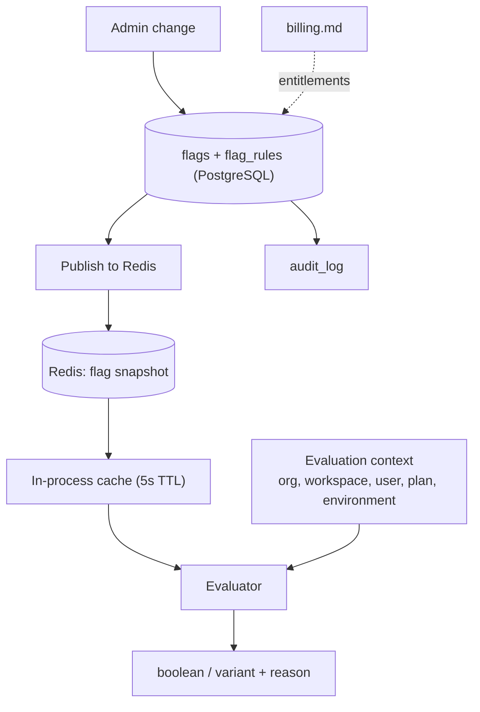
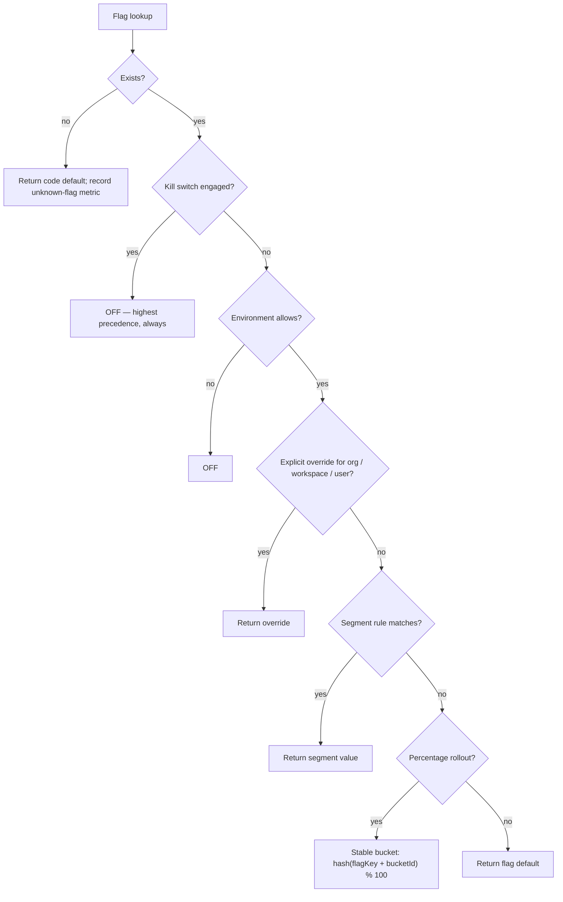

# Feature Flags Service

> **Status:** v2.0 — complete. Platform Layer service. Raises **Proposed ADR-023 — Feature flags built in-house, config-backed**.
> **Consumed by:** `14-operations/deployment.md` (ADR-015), which decouples deploy from release and disables a bad feature in seconds rather than rolling back.

## Purpose

Separate *shipping code* from *exposing behaviour*. A flag lets a change reach production dark, be enabled for one workspace, expanded to a percentage, and switched off in seconds when it misbehaves — without a deploy.

Three distinct needs are served, and keeping them named apart prevents the flag set from becoming unmanageable:

| Kind | Purpose | Lifetime | Owner |
|---|---|---|---|
| **Release flag** | Progressive rollout of a new capability | Weeks — deleted after full rollout | Engineering |
| **Operational flag** | Kill switch for an expensive or risky path | Permanent | Engineering / on-call |
| **Entitlement flag** | Plan-gated capability | Permanent | Derived from `billing.md`, never set by hand |

## Responsibilities

- Flag definition, targeting rules, and evaluation.
- Deterministic percentage rollout with stable bucketing.
- Kill switches with immediate global effect.
- Exposing plan entitlements as evaluable flags, derived from `billing.md`.
- Evaluation caching, audit of every change, and flag lifecycle hygiene.

## Non-responsibilities

| Not owned | Owner |
|---|---|
| Customer-configurable behaviour | `settings.md` — the distinction is stated below |
| Plan entitlement *authority* | `billing.md`; this service projects, never authors |
| A/B experiment analysis | Out of scope for v1; see Future |
| Deployment or rollback mechanics | `14-operations/deployment.md` |
| Permission checks | `permissions.md` — a flag is never an authorization control |

**Flags versus settings, restated because it is the most common confusion:** settings answer *"how should this behave?"* and are changed by customers; flags answer *"is this capability on?"* and are changed by us. A flag that a customer configures is a setting misfiled. A setting that only we ever change and that will one day be permanently on is a flag misfiled.

**A flag is never a security control.** Hiding an endpoint behind a flag does not authorize it. Permission checks run regardless of flag state — a disabled flag that is the only thing preventing access is a vulnerability.

## Domain boundaries

Cross-cutting infrastructure with no bounded context. Targeting can reference organization, workspace, user, and plan, so it reads identity and commerce projections but owns none of them.

## Architecture — Proposed ADR-023

**Decision: build, do not buy.** Flag evaluation is on every request path, and the alternatives were weighed as follows:

| Option | Assessment |
|---|---|
| **In-house, config-backed (chosen)** | Flags live in PostgreSQL, cached in Redis and in-process. No external dependency on a request path, no per-seat cost, no customer data leaving the platform, and full audit in our own log. Costs: we build targeting and the admin UI |
| Vendor SDK (LaunchDarkly, Flagsmith) | Mature targeting and UI, but adds a third-party dependency to every request, sends tenant identifiers to an external service, and prices per seat as the platform grows |
| Environment variables | No runtime change without a deploy, which defeats the purpose |

The deciding factor is the request path: an outage or latency spike in a flag vendor would degrade every request, and the flag system exists partly to mitigate outages.

### Evaluation order

**Kill switch beats everything.** During an incident, one operator action disables a capability platform-wide regardless of overrides and rollouts, and it takes effect within seconds.

**Bucketing is deterministic** on `hash(flagKey + bucketId)` where `bucketId` is the workspace (default) or user. The same workspace always lands in the same bucket for a given flag, so a 25% rollout is a stable 25% rather than a coin flip per request — which would produce a user seeing the feature appear and vanish between page loads.

## APIs

| Endpoint | Purpose | Authority |
|---|---|---|
| `GET /v1/flags/evaluate` | Evaluate all client-visible flags for the current context | Authenticated |
| `GET /v1/admin/flags` | List with rules and rollout state | Platform admin |
| `POST /v1/admin/flags` | Create | Platform admin |
| `PATCH /v1/admin/flags/{key}` | Update rules, rollout percentage, default | Platform admin |
| `POST /v1/admin/flags/{key}/kill` · `/unkill` | Kill switch | Platform admin, **audited, reason required** |
| `POST /v1/admin/flags/{key}/overrides` | Per-org/workspace/user override | Platform admin |
| `GET /v1/admin/flags/{key}/exposure` | Who currently evaluates true | Platform admin |
| `DELETE /v1/admin/flags/{key}` | Retire a flag | Platform admin; refused while referenced in code |

**Internal:** `FlagEvaluator.isEnabled(key, context) → boolean`; `variant(key, context) → string`; `evaluateAll(context) → Record<string, boolean|string>`.

`GET /v1/flags/evaluate` returns only **client-visible** flags. Server-only flags — kill switches, internal rollouts — are never exposed, because the flag set is a roadmap and a probe map for anyone reading it.

## Events

All events below are written to the transactional outbox **in the same transaction as the state change** and published through the `EventBus` (ADR-020). No path in this service publishes directly to a bus.

| Emitted | Consumers | Criticality |
|---|---|---|
| `FlagChanged` | All instances (cache purge), Audit, Deployment markers | **Critical — a stale cache means inconsistent behaviour across instances** |
| `FlagKilled` | All instances (immediate purge), Notifications (on-call), Observability | **Critical** |
| `FlagCreated` / `FlagRetired` | Audit, Read models | Standard |

| Consumed | From | Reaction |
|---|---|---|
| `SubscriptionChanged` | Billing | Refresh entitlement flags for that organization |
| `OrganizationSuspended` | Organizations | Entitlement flags evaluate false for suspended organizations |

Flag changes also emit a **deployment marker** onto dashboards, alongside deploys — during an incident, "did we just change a flag?" is as important as "did we just deploy?", and both must be visible on the same timeline (`14-operations/monitoring.md`).

## Database impact

New tables, landing in migration `0023_feature_flags`:

| Table | Key columns | Constraints |
|---|---|---|
| `flags` | `key`, `description`, `kind`, `default_value`, `killed`, `environments TEXT[]`, `owner`, `retire_by DATE` | `UNIQUE (key)`; `CHECK (kind IN ('release','operational','entitlement'))`; **global reference data, no `tenant_id`** |
| `flag_rules` | `flag_id`, `rule_type`, `target_id`, `value`, `priority` | `CHECK (rule_type IN ('override_org','override_workspace','override_user','segment','percentage'))` |
| `flag_exposures` | `flag_id`, `bucket_id`, `evaluated_value`, `last_seen_at` | Sampled, for the exposure report; pruned aggressively |

`flags` and `flag_rules` are **global reference data with no tenant dimension** — the same class as `plans` and `settings_registry`, covered by Proposed **ADR-025**. `flag_rules` rows reference tenants as *targets*, which is not the same as being tenant-owned; reads are platform-admin only.

Every change writes an `audit_log` row in the same transaction (`audit-logs.md`).

## Security

- **Flags are not authorization.** Permission checks run regardless of flag state. A flag hides a capability; it does not protect it.
- Client-visible flags are an explicit allowlist. Leaking the full flag set reveals unreleased features and internal kill switches.
- Kill-switch operations require platform-admin authority and a mandatory reason, and page the on-call channel — a kill switch used without anyone noticing is a kill switch that will be forgotten in the on position.
- Targeting rules reference tenant identifiers; the admin API is platform-admin only, since exposure data reveals customer identities.
- Entitlement flags are **derived**, never hand-set. A manually enabled entitlement diverges from what the customer pays for, and the API refuses direct writes to `kind = 'entitlement'`.

## Performance

| Layer | Behaviour |
|---|---|
| In-process cache | 5-second TTL, refreshed asynchronously — evaluation is a map lookup, sub-microsecond |
| Redis snapshot | Full flag set as one key; instances refresh on `FlagChanged` or TTL |
| PostgreSQL | Read only on snapshot rebuild, never per evaluation |

**Evaluation never performs I/O.** A flag check appears in hot loops and per-request paths; if it could block, it would become a latency source and, worse, a failure source in exactly the code paths flags exist to protect.

Propagation: a change reaches all instances within **5 seconds** (Redis publish plus in-process TTL). Kill switches propagate immediately via the pub/sub purge, with the TTL as backstop.

## Failure handling

| Failure | Behaviour |
|---|---|
| Redis unavailable | Instances serve the last in-process snapshot; flags are **stale but functional**. Evaluation never fails |
| PostgreSQL unavailable | Same — flags are read from cache; changes are impossible but evaluation continues |
| Unknown flag key | Returns the **code default** and records a metric. A missing flag never throws, because a flag check in a hot path must not become an exception source |
| Snapshot corrupt or unparseable | Falls back to code defaults for all flags and alerts loudly |
| `FlagChanged` event lost | 5-second TTL bounds inconsistency; DLQ alert |
| Instances disagree during propagation | Bounded by the TTL window; deterministic bucketing means a user does not flip between values *within* an instance |

**The universal rule: flags fail to their code default, never to an exception.** Every call site supplies a default, and that default is what runs when the flag system is degraded.

## Observability

- **Metrics:** `flag_evaluations_total{key,result}` (sampled — full cardinality would be enormous), `flag_cache_age_seconds`, `unknown_flag_evaluations_total`, `flags_total{kind}`, `flags_past_retire_by`, `kill_switches_active`.
- **Logs:** every flag change with actor, key, before/after, reason, correlation id.
- **Traces:** flag state that materially alters a request path is recorded as a span attribute, so a trace explains which code path ran.
- **Alerts:** `kill_switches_active` non-zero for more than 24 hours (a kill switch is an incident state, not a configuration); `flags_past_retire_by` above threshold (flag debt); `unknown_flag_evaluations_total` non-zero (code references a deleted flag); cache age above 60 s.

## Implementation notes

- **Every flag has an owner and a `retire_by` date at creation.** Release flags that outlive their rollout become permanent conditional branches, and a codebase of stale flags is unreadable and untestable. The `flags_past_retire_by` alert exists to make that debt visible.
- Flag keys are `dot.case` and namespaced by area — `writing.parallel_sections`, `ops.disable_council`.
- A flag check must never gate a database migration or schema behaviour (`03-database/migrations.md`) — conditional DDL produces environment-dependent schemas.
- Delete the flag **and** the branch together. Removing a flag while the branch remains leaves dead code that evaluates the code default forever.
- Operational kill switches should exist ahead of need for the expensive paths — the AI Council, media generation, refresh scans. Creating a kill switch during an incident is too late.
- Testing runs with flags at their code defaults; a test that depends on a flag sets it explicitly, so behaviour is never accidentally coupled to production flag state.

## Cross references

- `01-system-architecture/13-adr-log.md` — Proposed ADR-023 (this decision), Proposed ADR-025 (reference-data RLS exception)
- `settings.md` — the deliberately separate concept
- `billing.md` — entitlement source
- `permissions.md` — authorization, which flags never replace
- `14-operations/deployment.md` — deploy/release decoupling and flag-first mitigation (ADR-015)
- `14-operations/incident-response.md` — "disable the flag" as the first mitigation step
- `14-operations/monitoring.md` — flag changes as dashboard markers
- `audit-logs.md` — every change recorded
