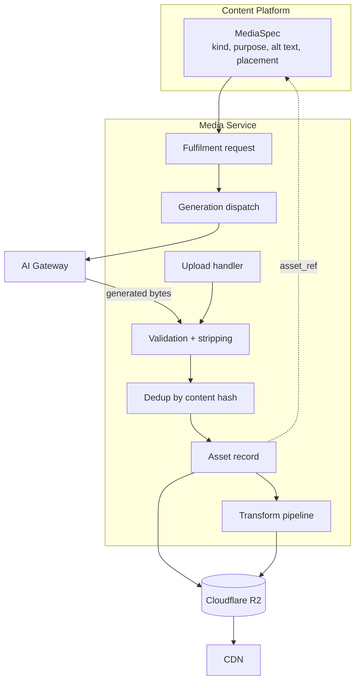
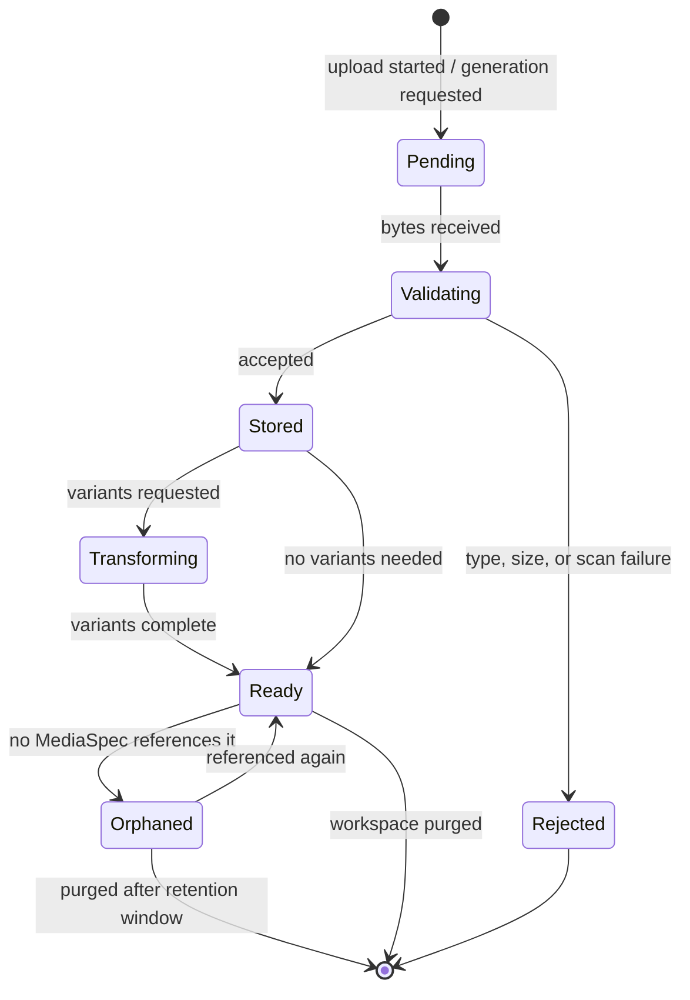

# Media Service

> **Status:** v2.0 — complete. Platform Layer service. Authority: **ADR-018** — the Writing Engine owns generation *intent* (`MediaSpec`); this service owns the *asset*.

## Purpose

Store, transform, and deliver every binary the platform handles: generated illustrations, charts and diagrams, user uploads, avatars, and exports. Assets are content-agnostic — the service knows an image is 1200×630 and referenced by three revisions; it does not know what the article says.

ADR-018 exists because three owners were claiming media: the Writing Engine (specs), a platform service (storage), and a hypothetical future Media Engine. The split is by concern, and this document is the storage half.

## Responsibilities

- Asset storage in Cloudflare R2 under a tenant-prefixed key scheme.
- Transformation: resize, format conversion (WebP/AVIF), compression, thumbnail generation.
- CDN delivery and signed-URL issuance.
- **Generation dispatch** — requesting an image from a model **through the AI Gateway**, never from a provider directly.
- Upload handling: validation, content-type verification, malware posture, metadata stripping.
- Deduplication by content hash, and lifecycle/retention enforcement.
- Fulfilling a `MediaSpec` by binding a generated or uploaded asset to it.

## Non-responsibilities

| Not owned | Owner |
|---|---|
| **What image is needed and why** — purpose, placement, alt text | `05-content-platform/writing-engine.md` (`MediaSpec`) |
| Model selection, prompt construction for generation | `08-ai-platform/` |
| Editorial judgment about whether an asset is appropriate | Review Engine |
| Object storage infrastructure and lifecycle policy configuration | `12-storage-platform/storage-abstraction.md` |
| CDN configuration | `11-deployment-topology.md` |

**On AI:** the Platform Layer never calls a model provider (`README.md`). When this service generates an image it issues an `AIRequest` with `task_type = media.generate` through the AI Gateway, exactly as an engine would. It receives an asset, meters cost through the same path, and stores the result. No provider SDK is imported here.

## Domain boundaries

No bounded context of its own — deliberately. ADR-018 records that media has no domain model worth a context: `MediaSpec` belongs to Authoring, and the asset is an infrastructure concern. This service is a capability, not a domain.

Assets are workspace-scoped (`tenant_id`) and referenced by `media_specs.asset_ref` from Authoring.

## Architecture



### Key scheme

```
{tenant_id}/{yyyy}/{mm}/{asset_id}/original.{ext}
{tenant_id}/{yyyy}/{mm}/{asset_id}/{variant}.{ext}    -- w800, w1200, thumb
```

Tenant prefix first, always — it makes per-tenant lifecycle rules, bulk export, and purge on workspace deletion straightforward prefix operations rather than key-by-key work. Date segments keep any single prefix from growing unbounded.

### Asset lifecycle



**Orphan detection matters commercially.** Generated images that no revision references still cost storage. A sweep marks unreferenced assets and purges them after a grace period, which is long enough that a revision rollback does not lose its imagery.

## APIs

| Endpoint | Purpose | Authority |
|---|---|---|
| `POST /v1/media/uploads` | Request a direct-upload URL | `editor` |
| `POST /v1/media/uploads/{id}/complete` | Finalize after direct upload | `editor` |
| `POST /v1/media/generate` | Request generation for a `MediaSpec` (202 + handle) | `editor` |
| `GET /v1/media/{id}` | Asset metadata | `viewer` |
| `GET /v1/media/{id}/url?variant=` | Signed or CDN delivery URL | `viewer` |
| `DELETE /v1/media/{id}` | Soft-delete an asset | `editor`; refused while referenced |
| `GET /v1/workspaces/{id}/media` | Library, cursor-paginated, filterable | `viewer` |
| `GET /v1/workspaces/{id}/media/usage` | Storage consumed against the plan allowance | `admin` |

**Internal:** `MediaFulfilment.fulfil(mediaSpecId, source) → AssetRef`; `AssetResolver.publicUrl(assetId, variant)` used by publish-package assembly; `TransformPipeline.ensure(assetId, variants[])`.

**Direct upload to R2 via presigned URL** — bytes never transit the API. Proxying uploads through the application would put multi-megabyte payloads on the request path and make the gateway a bandwidth bottleneck.

## Events

All events below are written to the transactional outbox **in the same transaction as the state change** and published through the `EventBus` (ADR-020). No path in this service publishes directly to a bus.

| Emitted | Consumers | Criticality |
|---|---|---|
| `MediaAssetStored` | Authoring (bind to spec), Read models | Standard |
| `MediaGenerationRequested` | Progress stream | Standard |
| `MediaGenerationCompleted` | Authoring, Progress stream | Standard |
| `MediaGenerationFailed` | Authoring (spec remains unfulfilled), Notifications | Standard |
| `MediaAssetRejected` | Notifications, Observability | Standard — carries the rejection reason |
| `MediaAssetOrphaned` | Retention worker | Standard |
| `MediaAssetPurged` | Audit, Storage accounting | Standard |

| Consumed | From | Reaction |
|---|---|---|
| `RevisionCommitted` | Authoring | Recount references; clear orphan marks |
| `ArticleArchived` / `WorkspaceArchived` | Content / Workspaces | Stop generating; retain assets |
| `WorkspacePurged` | Workspaces | Delete the entire `{tenant_id}/` prefix |
| `SubscriptionChanged` | Billing | Re-evaluate the storage allowance |

## Database impact

Owns `media_assets` (`03-database/tables.md` §8), plus `media_variants` added with this document.

| Table | Key columns | Constraints |
|---|---|---|
| `media_assets` | `tenant_id`, `kind`, `object_key`, `content_hash`, `bytes`, `width`, `height`, `mime_type`, `source`, `status` | `UNIQUE (tenant_id, object_key)`; `UNIQUE (tenant_id, content_hash)` — dedup; `CHECK (kind IN ('image','chart','diagram','infographic','upload','avatar','export'))` |
| `media_variants` | `asset_id`, `variant`, `object_key`, `bytes` | `UNIQUE (asset_id, variant)` |

Both carry `tenant_id` with the standard RLS policy. `media_specs.asset_ref → media_assets(id)` is `RESTRICT` — an asset in use cannot be deleted, only orphaned when the reference goes away.

**Deduplication by `content_hash` per tenant, not globally.** Cross-tenant deduplication would leak the existence of one customer's assets to another through timing and storage accounting, and is prohibited for the same reason cross-tenant caching is.

## Security

- **Uploads are untrusted input.** Content type is verified from magic bytes, not the declared header; SVG is rejected by default (it is an XSS vector); size is capped per plan; and EXIF metadata is stripped, which removes GPS coordinates users are usually unaware they are sharing.
- Presigned upload URLs are short-lived (10 minutes), single-use, size-constrained, and content-type-constrained.
- Delivery URLs for private assets are signed and expiring; only assets attached to published content are served through the public CDN path.
- Purge on workspace deletion is a **prefix delete** and is verified — an orphaned R2 prefix after a tenant purge is a data-retention violation.
- Alt text originates from the `MediaSpec` (Authoring) and is rendered as text, never interpolated into markup unescaped.
- Generation runs through the AI Gateway, inheriting its guardrails; generated bytes are validated on the same path as uploads before storage.

## Performance

| Concern | Approach |
|---|---|
| Upload path | Direct to R2 via presigned URL; the API handles only metadata |
| Transforms | Asynchronous BullMQ jobs; the asset is usable at `stored` before variants exist |
| Delivery | CDN-fronted with long cache TTLs; keys are immutable so cache invalidation is never required |
| Dedup | Content-hash lookup before storing; a regenerated identical image costs nothing |
| Generation | Async with a progress handle; typically the slowest media operation |
| Library views | Cursor-paginated with variant thumbnails, never full assets |

**Immutable keys are the whole caching strategy.** A changed asset gets a new id and a new key, so CDN objects never need purging — the most common source of stale-image bugs is eliminated by construction.

## Failure handling

| Failure | Behaviour |
|---|---|
| Upload abandoned mid-flight | Pending asset expires after 24 hours; a sweep removes the record and any partial object |
| Generation fails at the AI Gateway | `MediaGenerationFailed`; the `MediaSpec` remains unfulfilled; **the article is never published with a broken reference** — package assembly refuses (`02-domain-design/publishing.md`) |
| Transform job fails | Original remains served; variants retried; delivery falls back to the original with a warning metric |
| R2 unavailable | Uploads and generation fail with a typed retryable error; **already-delivered assets continue serving from CDN**, so published content stays intact |
| Content-hash collision across different bytes | Practically impossible with SHA-256; the unique constraint would surface it as an error rather than silently aliasing |
| Asset deleted while a revision references it | Refused by FK `RESTRICT` |
| Orphan sweep misidentifies a referenced asset | Grace period before purge, plus a reference recount on `RevisionCommitted`, make a false positive recoverable |

## Observability

- **Metrics:** `media_assets_total{kind}`, `media_bytes_stored{tenant}` (top-N), `uploads_total{result}`, `generations_total{result}`, `generation_duration_seconds`, `transform_duration_seconds`, `dedup_hit_ratio`, `orphaned_assets_total`, `rejected_uploads_total{reason}`.
- **Logs:** every upload, generation, rejection, and purge with asset id, tenant, correlation id — never bytes or signed URLs.
- **Traces:** generation traces through the AI Gateway, so media cost appears in the same cost telemetry as text generation.
- **Alerts:** rejection rate spiking (usually a client bug or an attack); `orphaned_assets_total` growing (storage waste); generation failure rate above 10%; R2 error rate.

## Implementation notes

- **Never import an image-generation provider SDK.** Generation goes through the AI Gateway with `task_type = media.generate`; this is what keeps media cost inside the platform's cost model and guardrails.
- Store the `MediaSpec` id on the asset only as a **fulfilment record**, not as ownership. One asset may fulfil several specs (a chart reused across revisions), and the spec's lifecycle belongs to Authoring.
- Variants are generated lazily on first request for uncommon sizes, and eagerly for the standard set (`w800`, `w1200`, `thumb`). Eagerly generating every size for every asset wastes both compute and storage.
- The orphan sweep must run **after** a grace period longer than the revision-rollback window; purging too eagerly loses imagery a rollback still needs.
- Export bundles (workspace export, `workspaces.md`) are assets too, with a short retention — they are large, contain everything, and must not linger.

## Cross references

- `01-system-architecture/13-adr-log.md` — ADR-018, the media split
- `05-content-platform/writing-engine.md` — `MediaSpec`, the intent half
- `08-ai-platform/ai-gateway.md` — the only path to generation
- `12-storage-platform/storage-abstraction.md` — bucket configuration, lifecycle, replication
- `02-domain-design/publishing.md` — package assembly refuses on unavailable media
- `users.md` — avatar storage
- `16-security/` — upload validation, SSRF, signed-URL policy
- `99-open-questions.md` — OQ-9 (media retention per plan tier)
