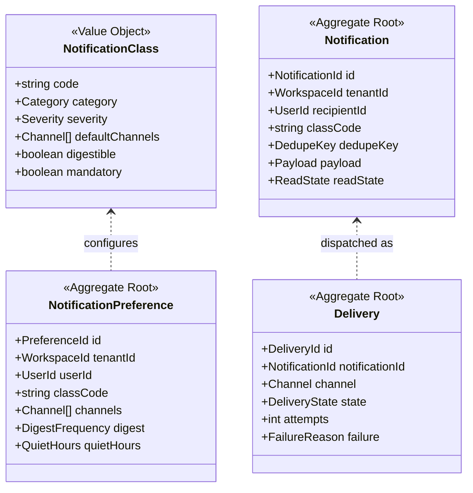
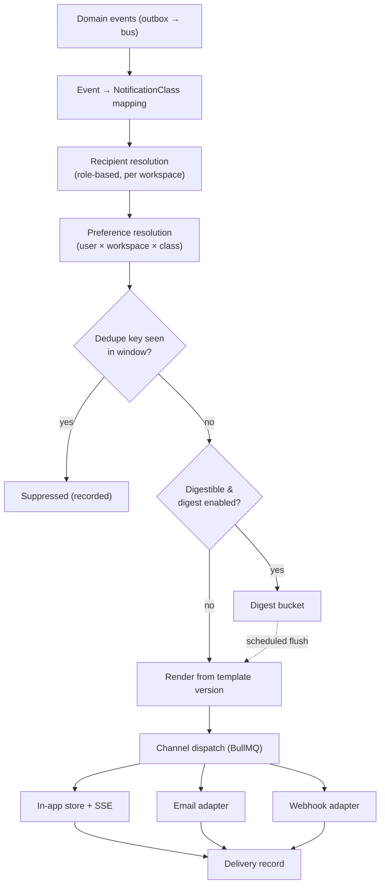
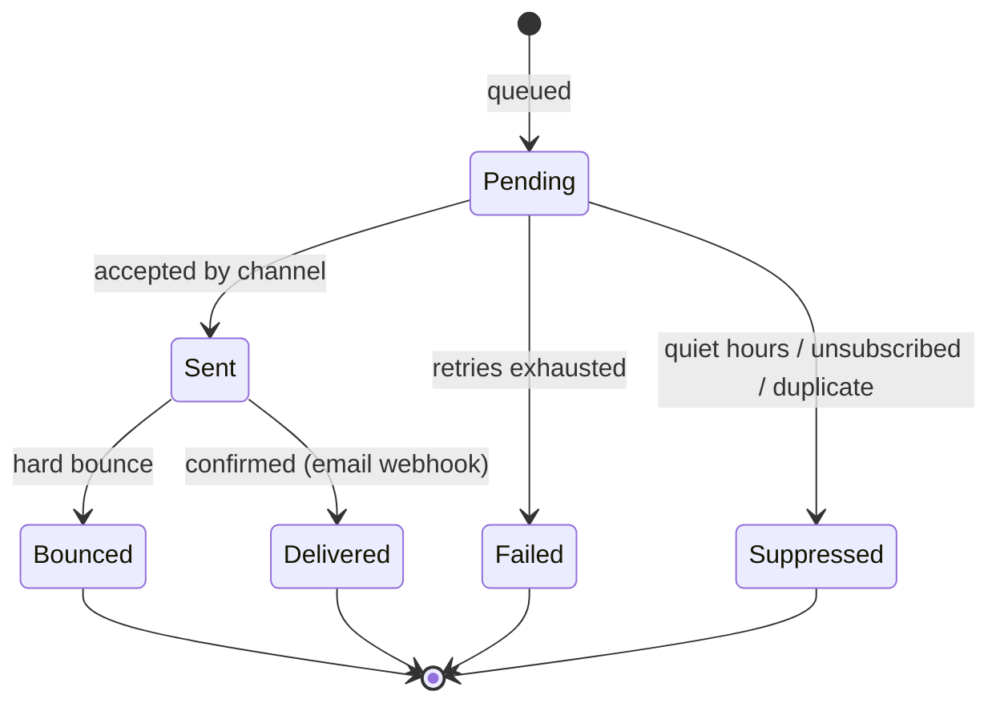

# Notifications Service

> **Status:** v2.0 — complete. Platform Layer service. Bounded context: **Notification** — modelled here rather than in Phase 2, because its model is inseparable from the delivery service (`02-domain-design/README.md`).

## Purpose

Tell a human that something happened, through the channel they chose, exactly once.

The service exists because the alternative — each engine sending its own email — produces duplicate messages, inconsistent formatting, no preference control, no delivery record, and a content engine that suddenly needs an SMTP client. Notification is a platform capability precisely so that thirteen engines can announce things without any of them knowing how a person is reached.

## Responsibilities

- Channel abstraction: in-app, email, webhook (Slack and Teams as future channels).
- Per-user and per-workspace notification preferences, including digest scheduling and quiet hours.
- Rendering notification content from versioned message templates.
- Delivery with retry, deduplication, and a permanent delivery record.
- Digest aggregation — collapsing many events into one message.
- Unsubscribe and preference management, including regulatory-compliant unsubscribe on marketing-adjacent classes.

## Non-responsibilities

| Not owned | Owner |
|---|---|
| Deciding *that* something noteworthy happened | The producing service, via its domain event |
| Email transport mechanics, SMTP, deliverability | `09-integrations/` notification channel adapter |
| User identity, locale, timezone | `users.md` (this service reads them) |
| Content generation of any kind — copy is templated, never model-written | `05-content-platform/` |
| Outbound webhooks to *customer* systems for integration purposes | `13-event-platform/event-registry.md` |
| In-app real-time transport (SSE) | API Gateway's SSE hub |

**The sharpest boundary:** this service never decides what is worth notifying about. It consumes domain events and maps them to notification classes. A service that wants a user informed emits its event; it does not call Notifications directly.

## Domain boundaries

Bounded context: **Notification**. Consumes events from every other context, owns no business state, and produces no domain events of its own beyond delivery outcomes.

Preferences are workspace-scoped per user — the same person can want every gate-block alert in their agency's own workspace and none in a client's.

## Domain model

| Value | Rules |
|---|---|
| `Category` | `security` · `billing` · `workflow` · `quality` · `performance` · `system` |
| `Severity` | `info` · `warning` · `critical` |
| `Channel` | `in_app` · `email` · `webhook` |
| `DigestFrequency` | `immediate` · `hourly` · `daily` · `off` |
| `DeliveryState` | `pending` · `sent` · `delivered` · `bounced` · `failed` · `suppressed` |
| `mandatory` | Classes a user **cannot** disable — security alerts, billing failures, legal notices |

## Architecture

### Delivery lifecycle

**Recipient resolution is role-based, never identity-based.** A gate-block notification goes to "workspace members holding `article.review`", resolved at send time through `permissions.md`. Storing recipient lists would go stale the moment someone changed role.

## APIs

| Endpoint | Purpose | Authority |
|---|---|---|
| `GET /v1/notifications` | In-app inbox, cursor-paginated | Self |
| `POST /v1/notifications/{id}/read` · `/read-all` | Mark read | Self |
| `GET /v1/notifications/unread-count` | Badge count | Self |
| `GET/PATCH /v1/workspaces/{id}/notification-preferences` | Per-workspace preferences | Self |
| `GET /v1/notification-classes` | Catalogue with defaults and mandatory flags | Authenticated |
| `POST /v1/notifications/unsubscribe/{token}` | One-click unsubscribe | Token-bearer, no session |
| `GET /v1/admin/deliveries` | Delivery diagnostics | Platform admin |

**Internal:** `NotificationDispatcher.dispatch(classCode, context)` — used only by this service's own event consumers; `PreferenceResolver.resolve(userId, tenantId, classCode)`.

There is **no public "send notification" endpoint.** Notifications originate from domain events only, which is what keeps them consistent and auditable.

## Events

| Consumed | Class produced |
|---|---|
| `OutlineReady` | `workflow.outline_approval_required` |
| `QualityGateBlocked` | `quality.gate_blocked` |
| `ArticlePublished` | `workflow.article_published` |
| `PublishFailed` / `PublishConflictDetected` | `workflow.publish_failed` (severity `warning`/`critical`) |
| `ContentDecayDetected` / `RefreshRecommended` | `performance.refresh_recommended` (digestible) |
| `CreditsLow` / `CreditsExhausted` | `billing.credits_low` — **mandatory** |
| `PaymentFailed` / `DunningExhausted` | `billing.payment_failed` — **mandatory** |
| `MembershipInvited` | `workflow.invitation` |
| `UserAuthenticated` (new device) | `security.new_device` — **mandatory** |
| `MfaEnrolled` / `UserEmailChanged` | `security.account_changed` — **mandatory** |
| `WorkspaceSuspended` / `OrganizationSuspended` | `system.workspace_suspended` — **mandatory** |
| `TaskAssigned` / `CalendarItemMissed` | `workflow.task_assigned` / `workflow.calendar_missed` (digestible) |
| `EvidenceRetracted` (published article affected) | `quality.evidence_retracted` — **mandatory, critical** |

| Emitted | Consumers |
|---|---|
| `NotificationDelivered` | Read models, analytics |
| `NotificationBounced` | Users (address health), Observability |
| `NotificationSuppressed` | Observability — a high suppression rate is a preference-configuration smell |

## Database impact

New tables, landing in migration `0022_notifications`:

| Table | Key columns | Constraints |
|---|---|---|
| `notification_preferences` | `tenant_id`, `user_id`, `class_code`, `channels TEXT[]`, `digest`, `quiet_hours JSONB` | `UNIQUE (tenant_id, user_id, class_code)` |
| `notifications` | `tenant_id`, `recipient_id`, `class_code`, `dedupe_key`, `payload JSONB`, `read_at` | `UNIQUE (tenant_id, recipient_id, dedupe_key)` — **the exactly-once guarantee** |
| `notification_deliveries` | `notification_id`, `channel`, `state`, `attempts`, `failure JSONB`, `provider_ref` | Append-only per attempt; `CHECK` on state |
| `notification_digest_buckets` | `tenant_id`, `user_id`, `frequency`, `items JSONB`, `flush_at` | `UNIQUE (tenant_id, user_id, frequency)` |

All carry `tenant_id` with the standard RLS policy. `notifications` is high-volume (10⁹) and partitioned by `created_at` from S2; read notifications are purged after 90 days, unread after 180.

**Payloads carry identifiers and short scalars only** — never article content, evidence text, metric values, or settings values. A notification says "the quality gate blocked article X with 3 issues"; the detail is behind a link requiring authorization.

## Security

- **Mandatory classes cannot be disabled.** Security, billing-failure, and legal notices ignore preferences by design; the preference API rejects attempts to disable them rather than silently accepting and ignoring.
- Recipient resolution goes through `permissions.md` **at send time**, so a revoked member stops receiving workspace notifications immediately.
- Email content is escaped and templated; no user-supplied string is interpolated unescaped, and no notification renders model output.
- Unsubscribe tokens are signed, single-purpose, class-scoped, and cannot be used to enumerate accounts or alter other preferences.
- Webhook channel targets are validated against SSRF protections and require a verified endpoint, since a user-supplied URL is untrusted.
- Delivery records are audit evidence for "were they told?", which matters for security alerts and billing notices; they are retained accordingly.

## Performance

- Dispatch is **fully asynchronous** via BullMQ. No producing service ever waits on notification delivery, and a notification failure never fails the operation that triggered it.
- Digest bucketing collapses high-volume classes: a workspace publishing forty articles produces one daily digest rather than forty emails.
- The unread-count badge is a counter in Redis, invalidated on read, rather than a `COUNT(*)` on every page load.
- In-app notifications reach the browser over the existing SSE channel; there is no second real-time transport.
- Preference resolution is cached per `(userId, tenantId)` with invalidation on preference change.
- Per-recipient rate limiting caps notifications per hour per class, so an event storm cannot mailbomb a customer.

## Failure handling

| Failure | Behaviour |
|---|---|
| Email provider unavailable | Retry with exponential backoff (5 attempts over ~1 hour); in-app delivery unaffected; failed after exhaustion with a delivery record |
| Hard bounce | Marked `bounced`; address health recorded; repeated bounces suppress that channel for the user and notify them in-app |
| Duplicate event delivery | `UNIQUE (tenant_id, recipient_id, dedupe_key)` makes the second a no-op |
| Recipient list empty | Recorded, not an error — a workspace may legitimately have nobody holding the relevant permission, and that is worth observing |
| Quiet hours during a `critical` severity | **Quiet hours are overridden for `critical`**; a blocked publish at 2am is worth waking someone for, a digest is not |
| Digest flush fails | Bucket retained; next flush includes it; buckets never silently drop items |
| Template render error | Falls back to a plain-text minimal form containing the class and a link — a notification that fails to render must still be delivered |

## Observability

- **Metrics:** `notifications_created_total{class}`, `deliveries_total{channel,state}`, `delivery_duration_seconds{channel}`, `bounce_rate{channel}`, `suppressed_total{reason}`, `digest_items_per_flush`, `unread_count` (histogram).
- **Logs:** every delivery attempt with class, channel, recipient id, result, correlation id — never payload content or addresses.
- **Traces:** the chain from domain event → class mapping → dispatch → provider is one trace, so "why didn't I get an email?" is answerable in one query.
- **Alerts:** bounce rate above 5% (deliverability at risk); mandatory-class delivery failures (**page** — a customer not told their payment failed is a support and revenue problem); digest flush lag; suppression rate spiking, which usually means a misconfigured dedupe key.

## Implementation notes

- **Dedupe key design is the whole game.** It must include the logical subject and the meaningful state — `gate_blocked:{articleId}:{revisionNumber}` — so a re-gate of the same revision does not re-notify, while a new revision does.
- Message templates are versioned reference data with the same discipline as prompt templates, but they are **not** prompt templates and do not live in the AI Platform. No notification copy is model-generated.
- Never call this service synchronously from a request path. If a caller needs to know a notification was sent, they are modelling the problem wrong.
- Recipient resolution must be **role-based at send time**. Materializing recipient lists at event time is the most common source of notifications reaching people who have left a workspace.
- Quiet hours use the user's timezone from `users.md`, not the workspace's — the person is in a timezone, the workspace is not.

## Cross references

- `users.md` — recipient identity, locale, timezone
- `permissions.md` — role-based recipient resolution
- `workspaces.md` · `organizations.md` — the events driving most workflow and system classes
- `billing.md` · `credits.md` — mandatory financial classes
- `13-event-platform/event-registry.md` — customer-facing webhooks, deliberately distinct from user notifications
- `09-integrations/` — email and messaging channel adapters
- `15-application-ui/` — the in-app inbox surface
- `16-security/` — unsubscribe token signing, SSRF validation for webhook targets
