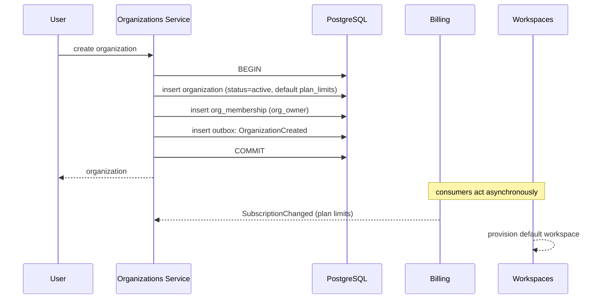
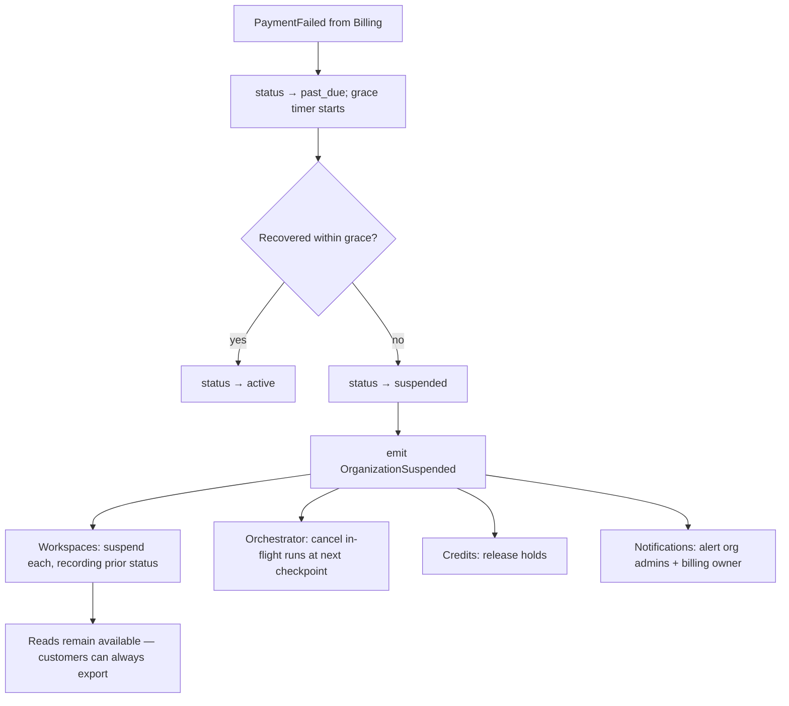
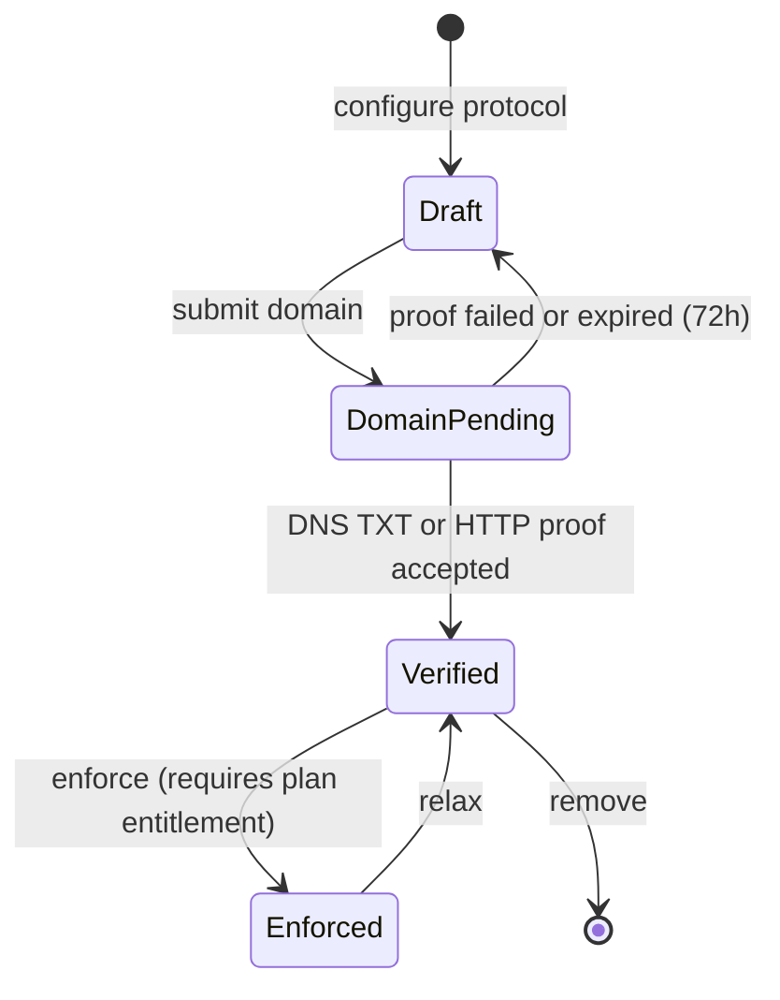

# Organizations Service

> **Status:** v2.0 — complete. Platform Layer service. Domain model: `02-domain-design/organizations.md` (Organization, OrganizationMembership, SsoConfiguration, VerifiedDomain). Tenancy authority: ADR-017.

## Purpose

Operate the commercial and administrative boundary. The organization is the customer of record: it holds the subscription, the identity policy, the administrative span over a set of workspaces, and the cascade authority when a commercial event — a failed payment, a closure request — must propagate to everything the customer owns.

This service exists so that a single commercial relationship can govern fifty isolated client workspaces without any of them being able to see each other.

## Responsibilities

- Organization lifecycle: provisioning, rename, suspension, reactivation, closure.
- Organization membership and org-level roles (`org_owner`, `org_admin`, `billing_owner`).
- Maintaining the `PlanLimits` projection received from `billing.md`, and enforcing workspace quota against it.
- Orchestrating the **suspension and closure cascades** across all owned workspaces.
- SSO configuration management and domain-ownership verification.
- Publishing organization events that other services react to.

## Non-responsibilities

| Not owned | Owner |
|---|---|
| Plans, subscriptions, invoices, payment | `billing.md` |
| Credential verification, sessions, SSO protocol handshakes | `authentication.md`, `09-integrations/better-auth.md` |
| User accounts and profile | `users.md` |
| Workspace internals: settings, membership, content | `workspaces.md` |
| Permission catalogue and checks | `permissions.md` |
| Any content capability | `05-content-platform/` |

**The Commerce boundary, stated precisely:** this service knows an organization *has* limits; it does not know what a plan costs, how it is invoiced, or how credits are priced. It **reads** `PlanLimits` and **reacts** to commercial events. It never writes to the ledger or to a subscription.

## Domain boundaries

Bounded context: **Identity & Access** (organization half). This service sits **above** the workspace tenancy boundary, which is why its tables are four of the five documented RLS exceptions (`03-database/tables.md` §2).

Relationship to Commerce is **Customer/Supplier**: Commerce is the supplier of entitlement, this service is the customer that applies it.

## Architecture

### Provisioning

Organization, first owner membership, and the outbox event commit together. A partial organization — one with no owner — cannot exist.

### Suspension cascade

The cascade is **asynchronous and idempotent per workspace**. An organization with three hundred workspaces must not block the request that triggered suspension, and a retried cascade must converge on the same state.

**Reactivation restores each workspace to its recorded prior status**, not blindly to `active` — a workspace archived before the organization was suspended stays archived.

### SSO and domain verification

Domain verification is a **privilege-escalation surface**: a verified domain enables auto-join and SSO enforcement for every address at that domain. Proof is checked server-side, the claim is globally unique (`UNIQUE (domain)`), and every verification is audit-logged.

## APIs

| Endpoint | Purpose | Authority |
|---|---|---|
| `POST /v1/organizations` | Provision organization + owner + default workspace | Authenticated user |
| `GET /v1/organizations` | List the caller's organizations | Member |
| `GET/PATCH /v1/organizations/{id}` | Read / rename | `org_admin` |
| `POST /v1/organizations/{id}/suspend` | Administrative suspension | Platform admin |
| `POST /v1/organizations/{id}/reactivate` | Lift suspension | Platform admin |
| `POST /v1/organizations/{id}/close` | Request closure (30-day window) | `org_owner` |
| `DELETE /v1/organizations/{id}/close` | Cancel closure | `org_owner` |
| `GET/POST /v1/organizations/{id}/members` | List / invite | `org_admin` |
| `PATCH/DELETE /v1/organizations/{id}/members/{userId}` | Role change / revoke | `org_owner` for owner changes |
| `GET/PUT /v1/organizations/{id}/sso` | SSO configuration | `org_owner` |
| `POST /v1/organizations/{id}/domains` | Claim a domain | `org_owner` |
| `POST /v1/organizations/{id}/domains/{domain}/verify` | Submit proof | `org_owner` |
| `GET /v1/organizations/{id}/usage` | Workspace count vs quota, member count | `org_admin`, `billing_owner` |

**Internal:** `WorkspaceQuotaService.check(orgId) → { allowed, current, limit }`; `OrganizationPolicy.effectiveOrgRole(userId, orgId)` consumed by `permissions.md`.

## Events

| Emitted | Consumers | Criticality |
|---|---|---|
| `OrganizationCreated` | Workspaces (default provisioning), Billing, Notifications | Standard |
| `OrganizationRenamed` | Read models | Standard |
| `OrganizationSuspended` | **Workspaces (cascade)**, Orchestrator, Credits, Notifications | **Critical — DLQ pages** |
| `OrganizationReactivated` | Workspaces (cascade), Notifications | Critical |
| `OrganizationClosureRequested` | Workspaces, Retention worker, Billing, Notifications | Critical |
| `OrganizationClosed` | Audit, Storage cleanup, Erasure log | Critical |
| `WorkspaceProvisioned` | Workspaces, Read models | Standard |
| `OrgMembershipInvited` / `Accepted` / `RoleChanged` | Notifications, Permission cache invalidation, Audit | Role change is critical |
| `OrgMembershipRevoked` | **Workspaces (revoke all)**, Sessions, Permission cache, Audit | **Critical** |
| `SsoConfigured` / `SsoEnforced` / `DomainVerified` | Authentication, Audit, Notifications | `SsoEnforced` is critical |

| Consumed | From | Reaction |
|---|---|---|
| `SubscriptionChanged` | Billing | Update `PlanLimits`; re-evaluate quota; mark over-quota workspaces read-only — **never delete** |
| `PaymentFailed` | Billing | → `past_due`, start grace timer |
| `PaymentRecovered` | Billing | → `active`, clear timer |
| `SubscriptionCancelled` | Billing | Begin closure sequence at period end |

## Database impact

Owns `organizations`, `organization_memberships`, `sso_configurations`, `verified_domains` — four of the five RLS exceptions. Each carries an alternative membership-keyed policy rather than a `tenant_id` policy, and each is registered in the RLS-coverage allowlist (`03-database/tables.md` §2).

**Critical constraints relied upon:** `UNIQUE (organization_id, user_id)`; `UNIQUE (domain)` globally; `CHECK` on role and status vocabularies. Last-owner protection is a trigger (`ORG_LAST_OWNER`), because it is a cross-row count over a filtered set and cannot be declarative.

Quota enforcement uses an **advisory lock on `organization_id`** inside the creating transaction, closing the race where two concurrent workspace creations both pass a count check.

## Security

Domain-specific; controls in `16-security/`.

- **`billing_owner` is separation of duties** — no content access, no membership authority. Finance staff need not be granted editorial power.
- **Domain verification** is the highest-risk operation here; global uniqueness is enforced by the database, proof is server-side, and every attempt is audited.
- **Cross-organization access returns `404`**, never `403`, consistent with the workspace rule.
- Suspension, closure, SSO enforcement, and role changes are always audit-logged with actor and reason.
- Closure is refused while commercial state is unsettled; the check is delegated to Billing, which owns the answer.

## Performance

- `PlanLimits` is a **stored projection**, so quota checks are one row read rather than a call into Billing on every workspace create.
- The organization's workspace list is a read model (`workspace_switcher_view`) projected from workspace events; an agency console must not fan out queries across fifty tenants.
- Org role is cached alongside workspace role under the effective-permission key; both invalidate on either role-change event.
- Cascades run as batched, per-workspace jobs; the triggering request returns immediately.
- Optimistic concurrency (`version`) prevents an operator edit and an incoming `SubscriptionChanged` from interleaving incorrectly.

## Failure handling

| Failure | Behaviour |
|---|---|
| Provisioning fails partway | Single transaction — no partial organization exists |
| Cascade partially applied | Handlers idempotent per `workspaceId`; retried to completion; DLQ entry **pages**, since an active workspace under a suspended organization is a revenue-integrity failure |
| `SubscriptionChanged` arrives out of order | Payload carries the subscription version; stale versions are ignored, not applied |
| Two organizations claim one domain | Database unique constraint decides; loser receives typed `DomainAlreadyClaimed` |
| SSO misconfiguration locks users out | Break-glass owner path (`authentication.md`) plus a support-initiated relax action, both audited |
| Closure requested with unsettled billing | Refused with a typed error naming Billing as the authority; never partially executed |
| Quota check races | Advisory lock plus in-transaction count |

## Observability

- **Metrics:** `organizations_total{status}`, `workspaces_per_organization` (histogram), `quota_rejections_total`, `cascade_duration_seconds`, `past_due_organizations`, `domain_verifications_total{result}`, `sso_enforced_total`.
- **Logs:** every status transition, role change, SSO change, and verification with actor, organization, correlation id, and reason.
- **Traces:** provisioning and cascade traced end to end; a slow agency-wide suspension is attributable per workspace.
- **Alerts:** critical events in the DLQ (**page**); organizations stuck `past_due` beyond grace; `pending_closure` past its purge date; `quota_rejections_total` spiking, which usually means a stale `PlanLimits` projection.

## Implementation notes

- Provisioning, suspension, and closure are all **idempotent by `organizationId`**, so any retry converges.
- The cascade consumer must re-establish tenant context **from the event**, never from ambient state — processing a workspace under the wrong tenant context is a cross-tenant write.
- Never auto-delete on downgrade. Over-quota workspaces become read-only and the customer chooses what to archive; automatic deletion on a plan change is prohibited (`02-domain-design/organizations.md` rule 7).
- `PlanLimits` is written **only** by the `SubscriptionChanged` consumer. No API mutates it directly — an operator changing limits by hand would silently diverge from what the customer pays for.

## Cross references

- `02-domain-design/organizations.md` — aggregates, invariants, lifecycle
- `workspaces.md` — the cascade target
- `billing.md` — the supplier of `PlanLimits` and commercial events
- `authentication.md` — SSO enforcement and break-glass
- `permissions.md` — org roles as one input to effective permission
- `users.md` — membership revocation on user deactivation
- `03-database/tables.md` §2 — the four RLS exceptions owned here
- `16-security/rbac.md` — role semantics and separation of duties
