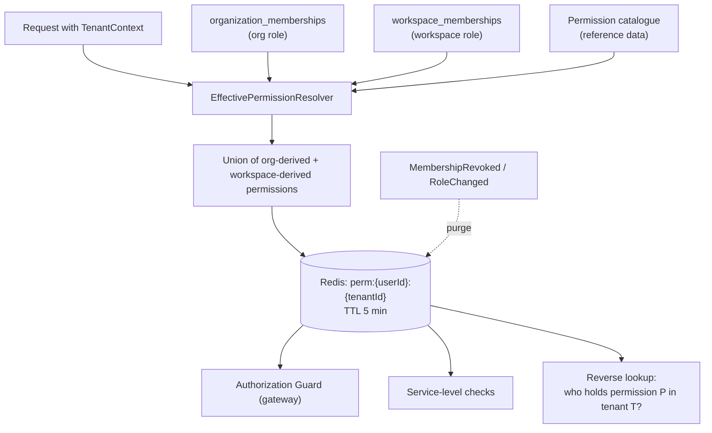
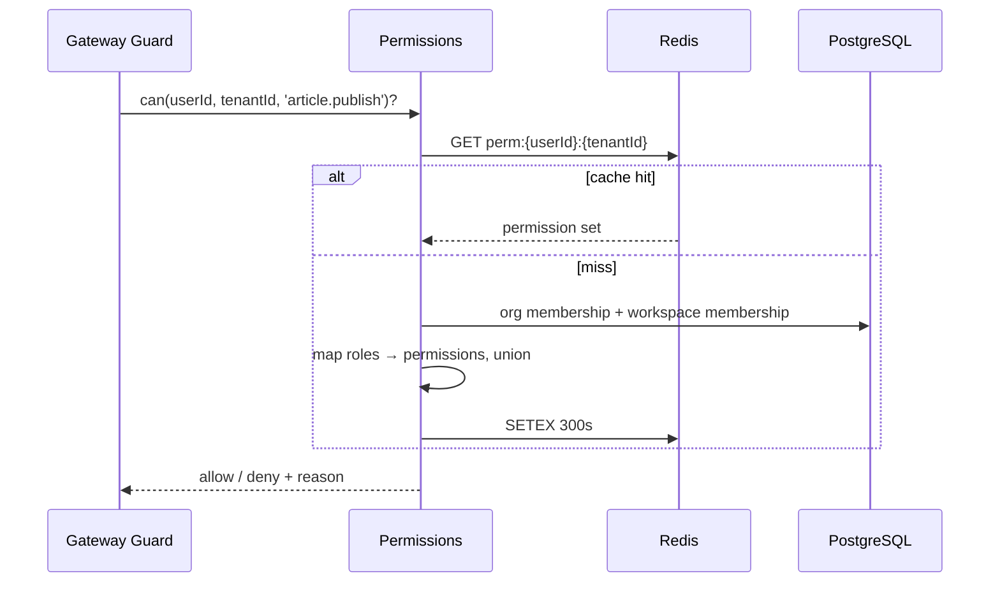

# Permissions Service

> **Status:** v2.0 — complete. Platform Layer service. Domain rules: `02-domain-design/organizations.md`, `02-domain-design/workspace.md`. Threat analysis and controls: `16-security/rbac.md`.

## Purpose

Decide what an authenticated identity may do. Authentication establishes *who*; this service establishes *what they may do, where*.

It exists as a service rather than as scattered checks because authorization is the platform's most safety-critical cross-cutting concern and the one v1 got wrong: five endpoints shipped without owner scoping and leaked every tenant's data (`AUDIT.md`). Centralizing the catalogue, the role mapping, and the resolution makes "which endpoints check what?" an answerable question rather than an audit of every controller.

## Responsibilities

- The **permission catalogue**: every atomic capability, named and documented.
- Role definitions and the role → permission mapping at both scopes.
- **Effective permission resolution**: the union of organization-level and workspace-level authority for a user in a workspace.
- Resolution caching and event-driven invalidation.
- Supplying reverse lookups — "who holds `article.approve` here?" — to `workflow.md` and `notifications.md`.
- Providing the enforcement primitives that guards and services call.

## Non-responsibilities

| Not owned | Owner |
|---|---|
| Identity, credentials, sessions | `authentication.md` |
| Membership records | `organizations.md`, `workspaces.md` |
| Tenant context derivation | API Gateway's Tenant Context Resolver |
| Threat model, attack surface, security review of the model | `16-security/rbac.md` |
| Feature availability | `feature-flags.md` — **a flag is never an authorization control** |
| Plan entitlements | `billing.md` |

**The boundary with `16-security/rbac.md`, precisely:** this document specifies the catalogue and the resolution service — the mechanism. That document analyses whether the mechanism is sufficient, what an attacker could do with it, and which controls verify it. Neither restates the other.

## Domain boundaries

Bounded context: **Identity & Access**, and part of its **shared kernel** — every context understands `{ userId, organizationId, tenantId, roles[] }` identically (`01-system-architecture/04-context-map.md`).

Owns no aggregates. It reads memberships from two services and the catalogue from reference data, and it produces decisions.

## Architecture



### The two-scope model

An organization role grants authority **across** the organization's workspaces; a workspace role grants authority **within** one. Effective permission is their **union**.

| Org role | Grants across all workspaces | Notably does not grant |
|---|---|---|
| `org_owner` | Full administrative authority, including workspace administration | — |
| `org_admin` | Workspace creation and administration, membership management | `org_owner` grants |
| `billing_owner` | Billing and credits only | **No content access, no membership authority** |

| Workspace role | Grants within one workspace |
|---|---|
| `owner` | Everything, including workspace deletion and owner grants |
| `admin` | Settings, members, targets, approvals, publishing |
| `editor` | Create and edit content, run pipelines, resolve reviews |
| `viewer` | Read only |

`billing_owner` granting no content access is **separation of duties**, not an oversight: finance staff should not need editorial power to pay an invoice.

### Permission catalogue

Permissions are atomic and `dot.case`, namespaced by resource:

| Namespace | Examples |
|---|---|
| `workspace.*` | `workspace.read`, `workspace.settings.write`, `workspace.member.manage`, `workspace.delete`, `workspace.export` |
| `project.*` | `project.create`, `project.archive`, `project.defaults.write` |
| `article.*` | `article.read`, `article.create`, `article.edit`, `article.run_pipeline`, **`article.approve`**, `article.review`, **`article.publish`**, **`article.unpublish`** |
| `research.*` | `research.run`, `research.evidence.read`, `research.evidence.retract` |
| `publishing.*` | `publishing.target.manage`, `publishing.schedule` |
| `analytics.*` | `analytics.read`, `analytics.optimization.accept`, `analytics.refresh.approve` |
| `billing.*` | `billing.read`, `billing.manage`, `billing.credits.purchase` |
| `org.*` | `org.read`, `org.member.manage`, `org.sso.manage`, `org.close` |
| `platform.*` | `platform.admin`, `platform.audit.read`, `platform.impersonate` |

`article.publish` and `article.unpublish` are **separate permissions**, and neither is implied by editorial roles. Publishing writes to a customer's live site; unpublishing removes content their audience is reading. Both deserve explicit grants.

### Resolution



**Deny by default.** A route without an explicit permission declaration fails closed **at startup**, not at request time — the application refuses to boot with an undeclared route, which converts a forgotten check from a runtime vulnerability into a build failure.

## APIs

| Endpoint | Purpose | Authority |
|---|---|---|
| `GET /v1/permissions/catalogue` | Full catalogue with role mappings | Authenticated |
| `GET /v1/workspaces/{id}/permissions/mine` | The caller's effective permissions here | Self |
| `GET /v1/workspaces/{id}/permissions/members` | Effective permissions per member | `admin` |
| `POST /v1/permissions/check` | Batch check for UI rendering | Self |

**Internal (the primary surface):**

```ts
interface PermissionService {
  can(userId, tenantId, permission): Promise<boolean>;
  canAll(userId, tenantId, permissions[]): Promise<boolean>;
  require(ctx, permission): void;                    // throws Forbidden
  holders(tenantId, permission): Promise<UserId[]>;  // reverse lookup
  effective(userId, tenantId): Promise<Set<Permission>>;
}
```

`POST /v1/permissions/check` exists so the UI can render correctly without probing endpoints — but **UI state is never the enforcement point**. The server checks on every call regardless of what the client rendered.

## Events

All events below are written to the transactional outbox **in the same transaction as the state change** and published through the `EventBus` (ADR-020). No path in this service publishes directly to a bus.

| Emitted | Consumers | Criticality |
|---|---|---|
| `PermissionsCacheInvalidated` | All instances | **Critical** |
| `AuthorizationDenied` | Security monitoring, Observability | Standard — a spike indicates probing or a broken client |
| `PermissionCatalogueChanged` | All instances (catalogue reload) | Standard — deploy-time only |

| Consumed | From | Reaction |
|---|---|---|
| `MembershipRevoked` / `MembershipRoleChanged` | Workspaces | **Purge that user's cache for that tenant** |
| `OrgMembershipRevoked` / `OrgMembershipRoleChanged` | Organizations | Purge that user's cache for **all** tenants in the organization |
| `UserDeactivated` | Users | Purge all caches for the user |
| `WorkspaceSuspended` / `OrganizationSuspended` | Workspaces / Organizations | Write permissions evaluate false while suspended; reads remain |

**Cache invalidation is synchronous in the request path** that caused it (`workspaces.md`); the event drives invalidation on *other* instances. A revocation must not depend on event delivery to take effect where it was issued.

## Database impact

Owns `permission_catalogue` and `role_permissions` — global reference data seeded by migration, no `tenant_id`, same class as `plans`, `settings_registry`, and `flags` (Proposed **ADR-025**).

Reads `organization_memberships` and `workspace_memberships`, both indexed for exactly this access pattern: `ux_org_memberships__org_user` and `ux_workspace_memberships__tenant_user` (`03-database/indexes.md` §2). These two unique-index probes are the hottest authorization lookups in the platform.

The reverse lookup (`holders`) reads `workspace_memberships` filtered by the roles granting a permission, and is cached per `(tenantId, permission)` because `workflow.md` and `notifications.md` call it per event.

**No permission state is stored per user.** Permissions are always derived from roles. Per-user grants would create an unauditable authorization surface and make "who can publish here?" unanswerable without scanning.

## Security

- **Deny by default, enforced at startup.** An undeclared route fails the boot check.
- **Cross-tenant access returns `404`, never `403`** — a `403` confirms existence and is itself a leak.
- Authorization is checked **server-side on every request**. The batch check API is a rendering convenience with no security value.
- **Cache TTL is a bounded-exposure decision:** 5 minutes is the maximum window in which a revoked permission could still be honoured if invalidation failed, and it is deliberately short. Invalidation failures alert as security events.
- The reverse lookup must respect suspension: a suspended workspace's members are not returned as approvers.
- `platform.impersonate` is the most dangerous permission in the catalogue. It requires break-glass elevation, writes an audit row per impersonated session, and is reviewed after every incident (`audit-logs.md`).
- Role changes and catalogue changes are always audit-logged.

## Performance

| Path | Budget |
|---|---|
| Cached check | **< 2 ms** — a Redis `GET` plus a set membership test |
| Cold resolution | < 25 ms — two indexed lookups plus mapping |
| Batch check (N permissions) | Same as one — the whole set is resolved together |
| Reverse lookup (cached) | < 5 ms |

Resolution happens on **every authenticated request**, so the cache is not an optimization but a design requirement. The cache key is `perm:{userId}:{tenantId}` and stores the whole resolved set, because resolving one permission costs the same as resolving all of them and per-permission keys would multiply invalidation work.

Cache hit ratio is monitored; below 90% usually means an invalidation storm rather than genuine misses.

## Failure handling

| Failure | Behaviour |
|---|---|
| Redis unavailable | **Resolve directly from PostgreSQL.** Slower, always correct. Authorization **never** fails open, and never serves a default permission set |
| PostgreSQL unavailable | Authorization fails closed — requests return `503`. An unauthorized action is worse than an unavailable one |
| Invalidation event lost | 5-minute TTL bounds exposure; DLQ entry is treated as a **security incident**, not an operational one |
| Unknown permission requested | Denied, and recorded — usually a code path referencing a removed permission, which is a bug worth surfacing loudly |
| Undeclared route | Startup failure |
| Membership row missing during resolution | Denied; treated as no membership |
| Role in the catalogue with no mapping | Startup validation failure — the catalogue must be total |

## Observability

- **Metrics:** `permission_checks_total{permission,result}`, `permission_resolution_duration_seconds`, `permission_cache_hit_ratio`, `authorization_denials_total{permission}`, `permission_invalidations_total`, `undeclared_route_checks_total`, `impersonation_sessions_total`.
- **Logs:** every denial with user, tenant, permission, route, correlation id. Denials are logged at `warn` — they are either a client bug or a probe, and both deserve attention.
- **Traces:** permission resolution is a span on every request, so its cost is visible in the p95 rather than buried in middleware.
- **Alerts:** invalidation events in the DLQ (**page — security**); cache hit ratio below 90%; denial spikes for one user or IP (probing); any `platform.impersonate` use (notify the security channel immediately).

## Implementation notes

- **Never check roles directly.** `if (role === 'admin')` scattered through services is how permission models rot. Always `can(user, tenant, permission)`; the mapping lives in exactly one place.
- Route declarations are **data**: each route names its required permission, and a startup check verifies every route has one and that every named permission exists in the catalogue.
- Adding a permission means: add to the catalogue, map it to roles, declare it on routes, and add an authorization test asserting allow/deny per role. The Phase 2 rule that every endpoint has an authorization spec is enforced here (`10-testing/integration-testing.md` §11).
- Invalidate synchronously where the change happens; use events for other instances. Relying solely on events makes revocation eventually-consistent, which is not acceptable for authorization.
- Do not add per-user permission grants. Every request for one is a request for a new role, and the answer is composable roles (see Future) rather than an unauditable exception list.
- **A feature flag is never a substitute for a permission check.** Both may apply, in that order: authorize first, then check availability.

## Cross references

- `16-security/rbac.md` — threat model, controls, and review of this mechanism
- `authentication.md` — identity, which this service consumes and never re-establishes
- `organizations.md` · `workspaces.md` — the membership sources and invalidation triggers
- `workflow.md` · `notifications.md` — reverse-lookup consumers
- `feature-flags.md` — availability, deliberately distinct from authorization
- `01-system-architecture/09-request-flow.md` — where the guard sits in the pipeline
- `03-database/indexes.md` §2 — the two indexes carrying every authorization lookup
- `10-testing/integration-testing.md` §11 — the per-endpoint authorization matrix
