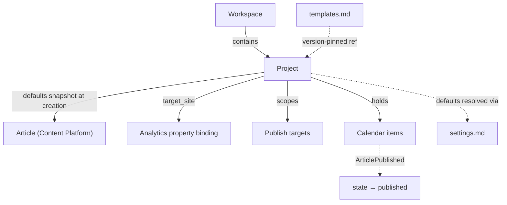
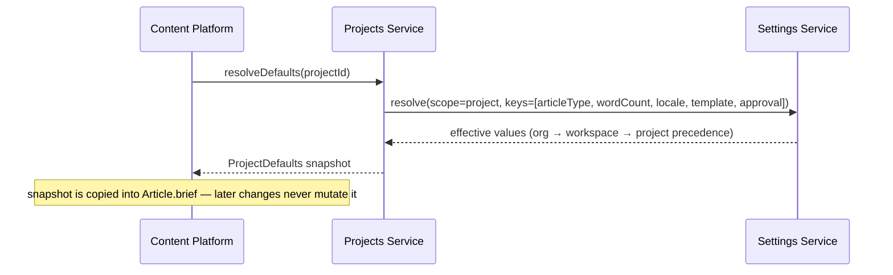
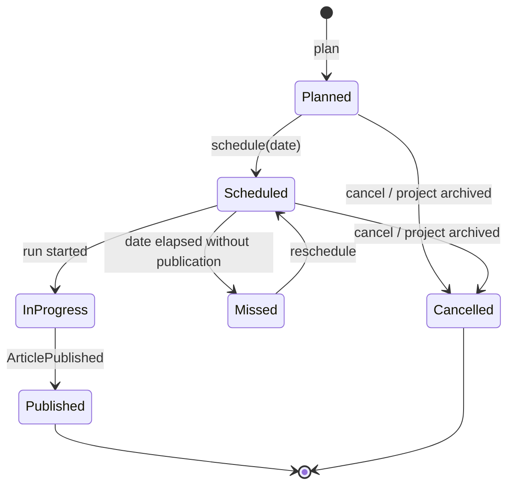

# Projects Service

> **Status:** v2.0 — complete. Platform Layer service. Domain model: `02-domain-design/projects.md` (Project, CalendarItem; Task and Template are operated by `workflow.md` and `templates.md`).

## Purpose

Organize content work inside a workspace. A project maps to a site, a client campaign, or a content pillar: a target domain, a set of defaults every article inherits at creation, and a calendar of planned work.

The project is also the reporting unit. Performance is judged per site or campaign, not per workspace, so `target_site` is the join key that connects published content to analytics properties.

## Responsibilities

- Project lifecycle: creation, rename, defaults management, pause, resume, archive.
- `ProjectDefaults` — the values an article snapshots at creation.
- `target_site` registration and validation, and its binding to analytics properties.
- The content calendar: planning, scheduling intent, rescheduling, missed detection.
- Supplying project-scoped context to content engines without knowing what they do with it.

## Non-responsibilities

| Not owned | Owner |
|---|---|
| Tasks, assignment, approval chains, editorial state | `workflow.md` |
| Template bodies and versioning | `templates.md` |
| Articles and every content aggregate | `05-content-platform/`, `02-domain-design/articles.md` |
| Publish targets and credentials | `05-content-platform/publishing-engine.md` |
| Performance measurement | `05-content-platform/analytics-engine.md` |
| Settings precedence | `settings.md` |
| Workspace lifecycle | `workspaces.md` |

**The calendar/task split, precisely:** this service owns the **calendar** — a human's plan that an article should go live on a date. `workflow.md` owns the **task** — who is doing the work and what state it is in. They are different acts (planning versus assignment), have different lifecycles, and are linked by events rather than merged.

## Domain boundaries

Bounded context: **Work Management**. Every project carries `tenant_id` (its workspace) and `organization_id`. A project belongs to exactly one workspace, fixed at creation.

This service is the **supplier** to Authoring: it provides defaults at article creation and never dictates content behaviour afterwards.

## Architecture

### Defaults inheritance

**Defaults are inherited at creation only.** A change to project defaults never retroactively alters existing articles — the rule that keeps in-flight and completed work reproducible (`02-domain-design/projects.md` rule 6).

### Calendar item lifecycle

`missed` is a signal, not a failure state — the sweep transitions it and notifies, but the item remains reschedulable.

## APIs

| Endpoint | Purpose | Authority |
|---|---|---|
| `POST /v1/projects` | Create | `admin` |
| `GET /v1/projects` | List (cursor-paginated, filter by status) | `viewer` |
| `GET/PATCH /v1/projects/{id}` | Read / rename | `editor` read, `admin` write |
| `GET/PATCH /v1/projects/{id}/defaults` | Read / update defaults | `admin` |
| `POST /v1/projects/{id}/pause` · `/resume` | Pause or resume production | `admin` |
| `POST /v1/projects/{id}/archive` · `/restore` | Archive lifecycle | `owner` |
| `GET/POST /v1/projects/{id}/calendar` | List / plan calendar items | `editor` |
| `PATCH /v1/calendar/{id}` | Reschedule (reason required) | `editor` |
| `DELETE /v1/calendar/{id}` | Cancel | `editor` |
| `GET /v1/projects/{id}/summary` | Article counts by status, upcoming calendar, performance headline | `viewer` |

**Internal:** `ProjectDefaults.resolve(projectId) → ProjectDefaults` (called on every article creation); `ProjectDirectory.get(projectId)` (cached); `CalendarSchedulingService.schedule(articleId, date)`.

## Events

All events below are written to the transactional outbox **in the same transaction as the state change** and published through the `EventBus` (ADR-020). No path in this service publishes directly to a bus.

| Emitted | Consumers | Criticality |
|---|---|---|
| `ProjectCreated` | Analytics (site registry), Read models, Notifications | Standard |
| `ProjectDefaultsUpdated` | Defaults cache purge, Audit | Standard — **changed keys only** |
| `ProjectPaused` / `ProjectResumed` | Orchestrator (block/allow new runs), Notifications | Standard |
| `ProjectArchived` | Orchestrator, Calendar (cancel items), Analytics (stop collection), Publishing (cancel schedules) | Critical |
| `CalendarItemScheduled` | Publishing (create publish schedule if automatic), Notifications | Standard |
| `CalendarItemRescheduled` | Publishing, Notifications | Standard |
| `CalendarItemMissed` | Notifications, Read models | Standard |

| Consumed | From | Reaction |
|---|---|---|
| `WorkspaceCreated` | Workspaces | Provision the default project |
| `WorkspaceArchived` / `WorkspaceSuspended` | Workspaces | Archive or pause all projects |
| `ArticlePublished` | Publishing | Transition the active calendar item to `published` |
| `ArticleCreated` | Content Platform | Optionally create the initial calendar item per project policy |

## Database impact

Owns `projects` and `calendar_items`. Both carry `tenant_id` + `organization_id` with the standard RLS policy.

Constraints relied upon: `UNIQUE (tenant_id, slug)`; `CHECK` on `target_site` format; partial unique index `(article_id) WHERE state IN ('planned','scheduled','in_progress')` enforcing one active calendar item per article; `CHECK (planned_for >= created_at::date)` blocking scheduling into the past.

`projects` uses soft delete with a 30-day purge; `calendar_items` use terminal state (`cancelled`) so history survives. FK `articles.project_id → projects(id)` is `RESTRICT` — a project with articles cannot be deleted, only archived.

**Articles cannot move between projects** (`02-domain-design/projects.md` rule 5). Defaults, target site, and performance history all key on the project, so a move is a data migration, not a field update. The API exposes no such operation.

## Security

- Project-level `ApprovalPolicyOverride` may only make approval **stricter** than the workspace policy, never weaker. Validation is in this service, using the resolved workspace value from `settings.md`.
- Archiving a project **never unpublishes live content**; unpublishing is an explicit Distribution action with its own permission.
- Calendar and project events carry identifiers and dates only — never brief text or article content, since notification channels include email.
- Every defaults change, archival, and reschedule is audit-logged with actor and reason.
- `target_site` is validated as a hostname and used only as a join key and display value — it is never fetched by this service, which would be an SSRF surface.

## Performance

- `ProjectDefaults` cached per `projectId`, invalidated on `ProjectDefaultsUpdated`; article creation reads from cache, never from the database.
- Project lists and calendar views are cursor-paginated; a workspace with 400 articles must never load an unbounded list.
- The calendar month view is served by a read model denormalizing article title and status, so the board renders without joining into Authoring.
- The **missed-item sweep** is a scheduled BullMQ job, batched per workspace, so a large tenant does not create a thundering herd at midnight.
- Optimistic concurrency on `Project` prevents interleaved defaults edits.

## Failure handling

| Failure | Behaviour |
|---|---|
| Default project provisioning fails after `WorkspaceCreated` | Consumer is idempotent by `tenantId`; retried; a workspace without a project blocks article creation, so this alerts |
| Calendar sweep misses a run | Idempotent by `calendarItemId`; the next sweep transitions it |
| `ArticlePublished` with no matching calendar item | No-op, logged at info — publishing outside the calendar is legitimate |
| Project archived with in-flight runs | Runs complete; new runs refused; calendar items cancelled |
| Reschedule into the past | Rejected by `CHECK` constraint with a typed error |
| Defaults reference a deprecated template version | Existing references continue to resolve; only new adoption is blocked (`templates.md`) |

## Observability

- **Metrics:** `projects_total{status}`, `calendar_items_total{state}`, `calendar_items_missed_total`, `defaults_resolution_duration_seconds`, `defaults_cache_hit_ratio`, `articles_per_project` (histogram).
- **Logs:** lifecycle transitions and reschedules with actor, reason, correlation id.
- **Traces:** article creation includes a defaults-resolution span, so a slow create is attributable.
- **Alerts:** `calendar_items_missed_total` rising sharply (usually a paused project nobody noticed); default-project provisioning failures; defaults cache hit ratio below 90%.

## Implementation notes

- `ProjectDefaults.resolve` is the **only** path by which an article inherits configuration. A content engine reading `projects.defaults` directly bypasses settings precedence and is a boundary violation.
- The defaults snapshot is copied by value into `Article.brief`; it is never a reference. This is what makes a completed article reproducible years later.
- The calendar sweep must be idempotent and must not transition items belonging to paused or archived projects.
- Do not add task fields to `calendar_items`. Every time planning and assignment are merged, rescheduling starts mutating assignment and the two lifecycles corrupt each other.

## Cross references

- `02-domain-design/projects.md` — aggregates, invariants, lifecycle
- `workspaces.md` — parent aggregate
- `workflow.md` — tasks, assignment, approval chains
- `templates.md` — version-pinned template references in defaults
- `settings.md` — precedence behind defaults resolution
- `05-content-platform/analytics-engine.md` — `target_site` binding to analytics properties
- `05-content-platform/publishing-engine.md` — publish targets scoped per project
- `03-database/tables.md` §3 — physical schema
