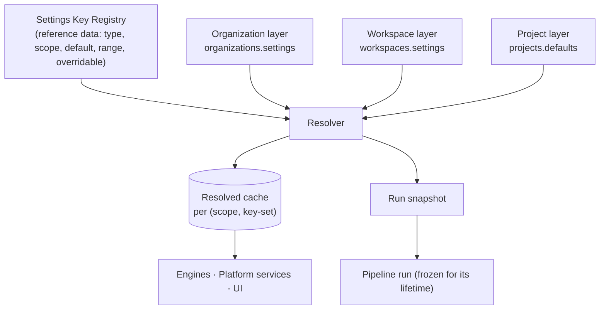
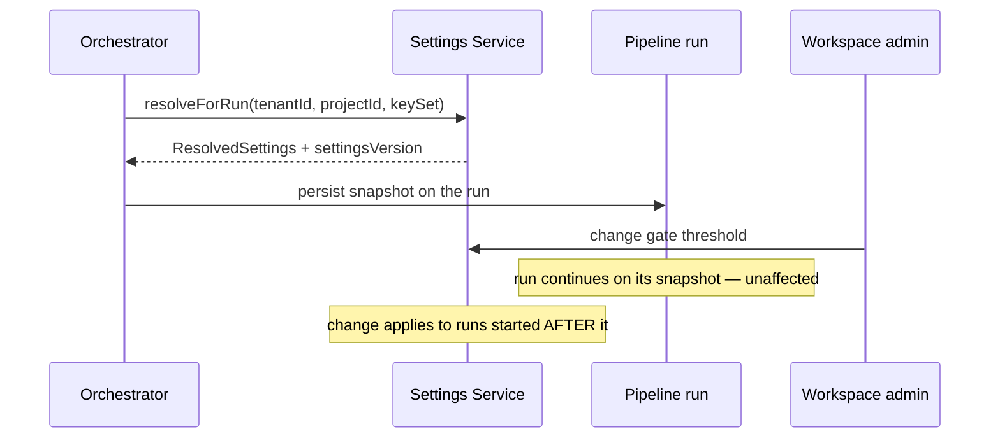

# Settings Service

> **Status:** v2.0 — complete. Platform Layer service. Raises **Proposed ADR-024 — Hierarchical Settings Resolution**.
> **Storage boundary:** `organizations.md`, `workspaces.md`, and `projects.md` each store their own settings layer. This service owns **precedence, validation, and resolution across them**. Nothing else may implement precedence.

## Purpose

Answer one question consistently, everywhere: *what is the effective value of setting X for this scope, right now?*

The tenancy hierarchy makes this non-trivial. An agency sets a default reading grade at the organization; a client workspace tightens it; a project for that client's technical blog tightens it further. Without one service owning resolution, each consumer would reimplement precedence, and three implementations would disagree the moment an edge case appeared — which is exactly how gate thresholds silently diverge between the pipeline and the UI that displays them.

## Responsibilities

- **Precedence resolution** across organization → workspace → project.
- The **settings key registry**: every known key, its type, scope, default, allowed range, and whether lower scopes may override it.
- Validation of writes against the registry, including tighten-only rules.
- Resolution caching and event-driven invalidation.
- **Run-time snapshotting** — freezing resolved settings at pipeline start so a mid-run change cannot alter behaviour.
- Change history and audit.

## Non-responsibilities

| Not owned | Owner |
|---|---|
| Storage of each layer | `organizations.md`, `workspaces.md`, `projects.md` |
| What a setting *means* semantically | The consuming service (a gate threshold's meaning is Review's) |
| Feature availability | `feature-flags.md` — different concept, see below |
| Plan entitlements | `billing.md` |
| Connector credentials | `16-security/`; this service stores references only |
| Prompt or routing policy | `08-ai-platform/` |

**Settings versus flags — the distinction that keeps both useful:**

| | Settings | Feature flags |
|---|---|---|
| Answers | "How should this behave?" | "Is this capability on?" |
| Changed by | Customers | Us |
| Lifetime | Permanent | Temporary (mostly) |
| Example | Reading grade 8–10, approval required | New editor rollout at 25% |

A customer-configurable behaviour is a setting. An operational or rollout toggle is a flag. Anything that becomes permanently on for everyone was a setting misfiled as a flag.

## Domain boundaries

No bounded context of its own — it is cross-cutting infrastructure over the Identity & Access and Work Management contexts. It reads three storage layers and writes only its own registry, cache, and history.

## Architecture — Proposed ADR-024

### Precedence rules

1. **Most specific wins.** Project overrides workspace, workspace overrides organization, organization overrides the registry default.
2. **A key declares whether it is overridable at all.** Some keys are organization-only — data residency, retention ceiling, SSO enforcement — and a lower scope may not set them.
3. **Tighten-only keys may be narrowed but never loosened.** Gate thresholds and approval requirements are tighten-only: a project may require *more* review than its workspace, never less. Validation compares against the resolved parent value at write time, not against the raw stored one.
4. **Absence is not zero.** An unset value falls through to the next scope. Storing an explicit `null` to mean "no constraint" is prohibited; the registry expresses that with an explicit sentinel where it is meaningful.
5. **Resolution is deterministic and total.** Every registered key resolves to a value for every scope, because the registry default is the floor.

### Run snapshotting

This implements `02-domain-design/workspace.md` rule 12. A verdict must be explainable in terms of the thresholds in force when it was issued, which is also why `gate_verdicts` stores its own `threshold_snapshot`.

## APIs

| Endpoint | Purpose | Authority |
|---|---|---|
| `GET /v1/settings/registry` | The key catalogue: types, scopes, defaults, ranges | Authenticated |
| `GET /v1/organizations/{id}/settings` | Organization layer, raw | `org_admin` |
| `PATCH /v1/organizations/{id}/settings` | Update organization layer | `org_admin` |
| `GET/PATCH /v1/workspaces/{id}/settings` | Workspace layer, raw | `admin` |
| `GET/PATCH /v1/projects/{id}/settings` | Project layer, raw | `admin` |
| `GET /v1/workspaces/{id}/settings/resolved` | **Effective values with provenance** | `editor` |
| `GET /v1/projects/{id}/settings/resolved` | Effective values with provenance | `editor` |
| `GET /v1/workspaces/{id}/settings/history` | Change history | `admin` |

**Internal:** `SettingsResolver.resolve(scope, keys[]) → ResolvedSettings`; `resolveForRun(tenantId, projectId, keySet) → snapshot`; `SettingsValidator.validate(scope, patch)`.

**The `resolved` endpoints return provenance** — for each key, the value *and* which scope supplied it. Without provenance, "why is this article requiring approval?" is unanswerable, and support tickets become archaeology.

## Events

All events below are written to the transactional outbox **in the same transaction as the state change** and published through the `EventBus` (ADR-020). No path in this service publishes directly to a bus.

| Emitted | Consumers | Criticality |
|---|---|---|
| `SettingsUpdated` | Resolution cache invalidation (all scopes below), Audit, Content engines | **Critical — a stale threshold means wrong gate behaviour** |
| `SettingsRegistryChanged` | All services (registry cache purge) | Standard — deploy-time only |
| `SettingsValidationRejected` | Observability | Standard — a spike indicates a UI mismatch |

Payloads carry **changed keys and scope, never values** (`02-domain-design/workspace.md`): settings can include competitively sensitive configuration, and events reach more consumers than the tables do.

| Consumed | From | Reaction |
|---|---|---|
| `SubscriptionChanged` | Billing | Re-validate settings against new plan ceilings; retention above the new limit is clamped **with notification**, never silently |
| `WorkspaceCreated` / `ProjectCreated` | Workspaces / Projects | Initialize empty layers (all inherited) |

## Database impact

Owns `settings_registry` (reference data) and `settings_history`; reads `organizations.settings`, `workspaces.settings`, `projects.defaults`.

| Table | Purpose | Notes |
|---|---|---|
| `settings_registry` | Key catalogue: `key`, `type`, `scope_min`, `overridable`, `tighten_only`, `default_value JSONB`, `constraints JSONB` | Global reference data, seeded by migration; no `tenant_id` — same class as `plans` (see Implementation notes) |
| `settings_history` | Append-only: `scope_type`, `scope_id`, `tenant_id`, `changed_keys`, `before`, `after`, `changed_by` | Supersedes `workspace_settings_history`, generalized to all three scopes |

Layer storage stays JSONB on each owner's table — the alternative, a normalized key-value table per scope, would turn one settings read into three joins on a path that is on every pipeline start.

**Validation is service-side, not a database constraint.** Precedence and tighten-only rules compare across tables, and a `CHECK` cannot reference another row. This is a documented case of a non-declarable invariant with an integration test (`03-database/tables.md` §9).

## Security

- **Tighten-only enforcement is a security control**, not a convenience: it prevents a project admin from weakening a workspace or organization compliance requirement such as YMYL thresholds or mandatory approval.
- Organization-only keys — retention ceiling, data residency, SSO enforcement — cannot be set at lower scopes, so a workspace admin cannot extend their own retention beyond what the organization bought.
- Settings values never appear in events, logs, or telemetry; only keys.
- Every write is audit-logged with actor, scope, changed keys, and before/after — the before/after lives in `settings_history` and `audit_log`, both restricted.
- Connector credential settings hold **references only**; the credential value never enters this service (`workspaces.md`, `16-security/`).

## Performance

| Path | Approach |
|---|---|
| Resolution (very hot — every run start, every engine) | Cached per `(scopeType, scopeId, keySetHash)`, invalidated on `SettingsUpdated` for that scope **and all scopes below it** |
| Registry | Cached process-wide; changes only at deploy |
| Run snapshot | Resolved once at run start, persisted on the run, never re-resolved |
| UI resolved view | Same cache; provenance computed alongside values, not in a second pass |

**Cascade invalidation is the subtle part.** Changing an organization value must invalidate every workspace and project cache beneath it. The implementation invalidates by scope prefix rather than enumerating children, so an organization with 500 workspaces does not produce 500 invalidation messages.

Budget: resolution p95 **< 10 ms** cached, < 50 ms cold.

## Failure handling

| Failure | Behaviour |
|---|---|
| Cache unavailable | Resolve directly from the three layers — slower, always correct. Settings **never** fail open to defaults, because defaults are usually more permissive than a customer's configured policy |
| Unknown key in a stored layer | Ignored at resolution, reported as a metric; usually a removed key from an older release |
| Stored value outside the registry's range | Clamped to range **and flagged**; resolution never returns an invalid value to an engine |
| Registry and stored layer disagree on type | Registry wins; the stored value is ignored and reported |
| Invalidation event lost | TTL backstop (5 minutes) bounds staleness; DLQ entry alerts, because stale gate thresholds affect quality decisions |
| Concurrent writes to one layer | Optimistic concurrency on the owning table rejects the loser |
| Plan downgrade below a configured retention | Clamped to the new ceiling **with notification** — never silently, since the customer must know their retention changed |

## Observability

- **Metrics:** `settings_resolution_duration_seconds`, `settings_cache_hit_ratio`, `settings_updates_total{scope}`, `settings_validation_rejections_total{reason}`, `settings_unknown_keys_total`, `settings_clamped_total`.
- **Logs:** every write with actor, scope, changed keys — never values.
- **Traces:** resolution is a span on run start, so its cost is visible rather than hidden.
- **Alerts:** cache hit ratio below 90%; `settings_clamped_total` non-zero (indicates a UI allowing invalid input); `SettingsUpdated` in the DLQ (**page** — engines may be running on stale policy).

## Implementation notes

- **No service may implement precedence itself.** A consumer reading `workspaces.settings` directly is a boundary violation and is caught in review; the resolved endpoint and internal resolver are the only sanctioned paths.
- Snapshot at run start, always. The run carries its settings; a stage re-resolving mid-run reintroduces exactly the inconsistency snapshotting exists to prevent.
- The registry is the contract. Adding a setting means adding a registry entry with type, scope, default, range, and overridability — then using it. Reversing that order produces settings nobody can discover.
- Provenance is not optional in the resolved response; it is what makes settings supportable.
- `settings_registry` carries no `tenant_id` — global reference data, the same class as `plans` in `billing.md`. Both are covered by Proposed **ADR-025** (reference-data tables as a bounded RLS exception class) rather than by silent allowlisting.

## Cross references

- `01-system-architecture/13-adr-log.md` — Proposed ADR-024 (this resolution model), Proposed ADR-025 (reference-data exception)
- `organizations.md` · `workspaces.md` · `projects.md` — the three storage layers
- `feature-flags.md` — the deliberately separate concept
- `templates.md` — gate overrides validated against resolved policy
- `workflow.md` — approval mode and timeout come from here
- `02-domain-design/workspace.md` — rules 11–14, the settings invariants
- `05-content-platform/review-engine.md` — the largest consumer, via run snapshots
- `03-database/tables.md` §9 — non-declarable invariants
