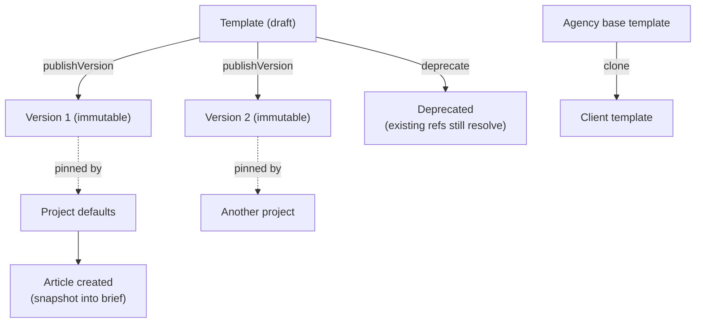
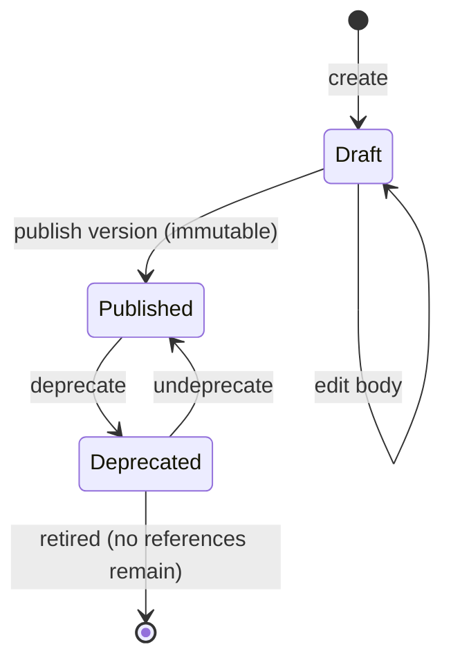

# Templates Service

> **Status:** v2.0 — complete. Platform Layer service. Domain model: `02-domain-design/projects.md` (Template, TemplateVersion).
> **Naming discipline:** these are **content production templates** — reusable configurations for how a workspace produces a kind of content. They are **not** prompt templates, which belong to `08-ai-platform/prompt-engine.md` and are a different artifact with a different lifecycle.

## Purpose

Let a workspace codify "how we produce a product comparison" once and reuse it. A template captures brief structure, outline conventions, required sections, tone constraints, gate threshold overrides, and default publish targets — the repeatable scaffolding around content production.

Without templates, every article restates the same configuration, agencies re-enter client conventions per piece, and consistency depends on memory. With them, a workspace's editorial standards become a versioned artifact.

## Responsibilities

- Template lifecycle: draft, publish a version, deprecate.
- Immutable version publication and version-pinned resolution.
- Template body schema validation.
- Resolution of a template's contribution to article defaults, in cooperation with `settings.md`.
- Cloning and derivation — a client template based on an agency standard.
- Usage tracking, so deprecation is an informed decision.

## Non-responsibilities

| Not owned | Owner |
|---|---|
| **Prompt templates, model hints, prompt versions** | `08-ai-platform/prompt-engine.md` |
| Notification message templates | `notifications.md` |
| Settings precedence across org/workspace/project | `settings.md` |
| Article content or outlines | `05-content-platform/`, `02-domain-design/articles.md` |
| Publish target configuration | `05-content-platform/publishing-engine.md` |
| What a gate threshold *means* | **ADR-021** (`01-system-architecture/14-scoring-contract.md`) and `05-content-platform/review-engine.md` |

**The prompt-template boundary is the one people get wrong.** A content template says "a comparison article has an intro, a criteria table, three product sections, and a verdict." A prompt template says "here is how to instruct a model to draft a section." One is editorial configuration owned by the customer; the other is platform engineering owned by us and gated by evaluation. They are versioned separately and must never merge.

## Domain boundaries

Bounded context: **Work Management**. Templates are workspace-scoped (`tenant_id`) and referenced by projects and articles as `(templateId, version)` — always version-pinned, never "latest".

## Architecture



### Version lifecycle



**A published version is immutable.** Corrections ship as a new version — the same discipline as ADRs, migrations, and prompt templates, and for the same reason: an article produced last quarter must remain explainable in terms of the configuration that produced it.

### Template body

```ts
interface TemplateBody {
  articleType: ArticleType;
  briefSchema: { requiredFields: string[]; defaults: Record<string, unknown> };
  outlineConventions: {
    requiredSections: Array<{ heading: string; purpose: string; minWords?: number }>;
    headingDepth: number;
    requireFaq: boolean;
    requireComparisonTable: boolean;
  };
  toneConstraints: { voiceProfileRef?: string; readingGrade?: [number, number] };
  gateOverrides?: Record<string, number>;   // may only TIGHTEN workspace thresholds
  defaultPublishTargets?: string[];
  wordCountTarget?: [number, number];
}
```

The body is validated against a **versioned schema**; an unknown field is rejected at publish time rather than silently ignored, because a silently-ignored template field is indistinguishable from a template that does not work.

## APIs

| Endpoint | Purpose | Authority |
|---|---|---|
| `GET /v1/templates` | List workspace templates | `viewer` |
| `POST /v1/templates` | Create a draft | `admin` |
| `GET /v1/templates/{id}` | Detail with version history | `viewer` |
| `PATCH /v1/templates/{id}` | Edit draft body | `admin` |
| `POST /v1/templates/{id}/versions` | Publish an immutable version | `admin` |
| `GET /v1/templates/{id}/versions/{version}` | Fetch a pinned version | `viewer` |
| `POST /v1/templates/{id}/deprecate` · `/undeprecate` | Deprecation | `admin` |
| `POST /v1/templates/{id}/clone` | Derive a new template | `admin` |
| `GET /v1/templates/{id}/usage` | Projects and articles referencing each version | `admin` |

**Internal:** `TemplateResolver.resolve(templateRef) → TemplateBody` (cached indefinitely — versions are immutable); `TemplateValidator.validate(body, schemaVersion)`.

## Events

All events below are written to the transactional outbox **in the same transaction as the state change** and published through the `EventBus` (ADR-020). No path in this service publishes directly to a bus.

| Emitted | Consumers | Criticality |
|---|---|---|
| `TemplateCreated` | Read models | Standard |
| `TemplateVersionPublished` | Projects (defaults may re-pin), Read models, Audit | Standard |
| `TemplateDeprecated` / `TemplateUndeprecated` | Projects (warn on new adoption), Notifications | Standard |
| `TemplateCloned` | Read models, Audit | Standard |

| Consumed | From | Reaction |
|---|---|---|
| `WorkspaceCreated` | Workspaces | Seed the workspace's starter templates from platform reference data |
| `ProjectDefaultsUpdated` | Projects | Recount usage per version |
| `WorkspaceArchived` | Workspaces | Templates become read-only |

## Database impact

Owns `templates` and `template_versions` (`03-database/tables.md` §3).

| Table | Constraints |
|---|---|
| `templates` | `UNIQUE (tenant_id, name)`; `CHECK (status IN ('draft','published','deprecated'))`; soft delete |
| `template_versions` | PK `(template_id, version)`; `body JSONB NOT NULL`; **append-only, immutable**; `UPDATE`/`DELETE` revoked |

Both carry `tenant_id` with the standard RLS policy. `template_versions` carries `tenant_id` denormalized so the policy applies without a join to its parent.

**Deletion is refused while any project or article references a version** — enforced in the service by a usage check, since a reference from `projects.defaults` lives inside a JSONB column and cannot be a foreign key. This is one of the documented cases where an invariant is service-enforced rather than declarative, and it has an integration test.

Starter templates are **platform reference data**, seeded per workspace at creation rather than shared globally — a workspace must be able to edit its starting point without affecting anyone else.

## Security

- Template bodies can carry gate overrides. **Overrides may only tighten workspace thresholds, never loosen them** — validated at publish time against the workspace's resolved policy, so a project admin cannot weaken a compliance control by publishing a permissive template.
- Only `admin` may publish or deprecate; publication is audit-logged with actor and version.
- Template bodies are structured data validated against a schema; no free-form content is interpolated anywhere without escaping, and no field is executed or evaluated.
- Cloning across workspaces is permitted **only within one organization** and only for members holding `admin` in both — this is the agency use case, and the cross-workspace boundary is checked explicitly rather than assumed.

## Performance

- Published versions are **immutable and therefore cached indefinitely** by `(templateId, version)`; there is no invalidation path because there is nothing to invalidate.
- Template resolution happens at article creation only, not per pipeline stage, so it is never on a hot path.
- Usage counts are maintained by a read model rather than computed by scanning `articles.brief` JSONB, which would be an expensive query on the largest table.
- Template lists are small (tens per workspace) and fully cacheable.

## Failure handling

| Failure | Behaviour |
|---|---|
| Publish with an invalid body | Rejected with field-level validation errors; the draft is unchanged |
| Referenced version missing | Typed `TemplateVersionNotFound` — **never** a silent fallback to latest, which would change how existing projects produce content |
| Deprecated version referenced | Resolves normally; only new adoption is blocked and a warning surfaces |
| Delete attempted while in use | Refused with the referencing projects listed |
| Gate override attempts to loosen thresholds | Rejected at publish with the specific keys named |
| Starter-template seeding fails at workspace creation | Retried idempotently; the workspace is usable without templates, so this never blocks provisioning |

## Observability

- **Metrics:** `templates_total{status}`, `template_versions_published_total`, `template_resolution_duration_seconds`, `template_usage{templateId}` (top-N), `template_validation_failures_total{reason}`.
- **Logs:** publication, deprecation, and cloning with actor, template, version, correlation id.
- **Alerts:** validation failure rate spiking (usually a schema-version mismatch after a deploy); resolution failures, which indicate a dangling pinned reference.

## Implementation notes

- **Always resolve by pinned version.** A code path that falls back to "latest" silently changes production behaviour for every project using that template, which is the exact failure the immutability rule exists to prevent.
- Template body schema is itself versioned; a body written against schema v1 must still validate after v2 ships, so schema changes are additive with the same discipline as event schemas.
- Do not merge with prompt templates, even though both are versioned registries. Prompt templates are gated by evaluation (`10-testing/ai-evaluation.md`) and owned by us; content templates are customer configuration with no evaluation gate.
- Gate overrides are validated against the **resolved** workspace policy from `settings.md`, not against raw stored values — otherwise a project could tighten against a stale baseline.

## Cross references

- `02-domain-design/projects.md` — Template aggregate and version rules
- `projects.md` — defaults referencing pinned template versions
- `settings.md` — precedence and the resolved policy templates validate against
- `08-ai-platform/prompt-engine.md` — the *other* template registry, deliberately separate
- `05-content-platform/planning-engine.md` — the consumer of outline conventions
- `03-database/tables.md` §3 — schema
- `10-testing/integration-testing.md` — the service-enforced deletion-guard test
