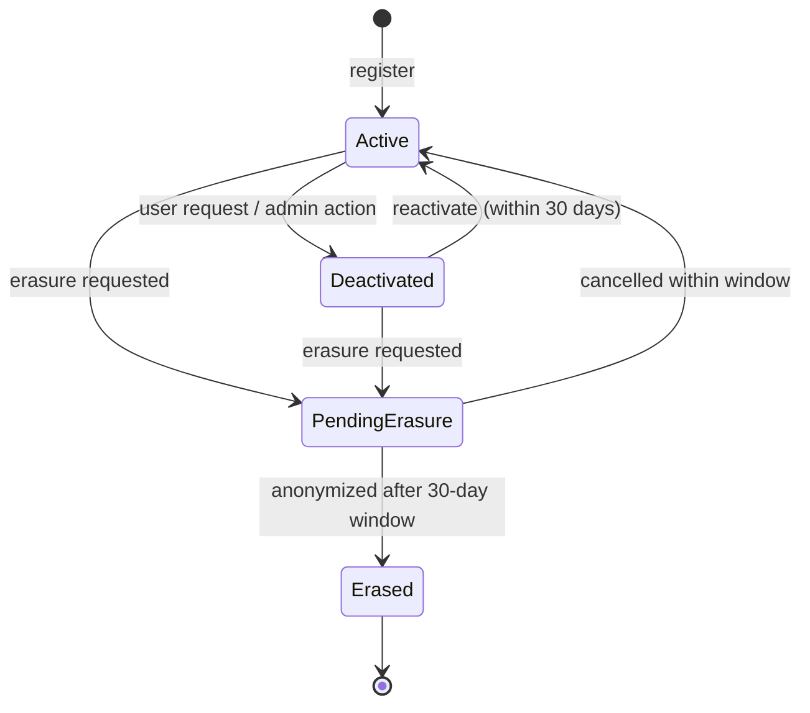
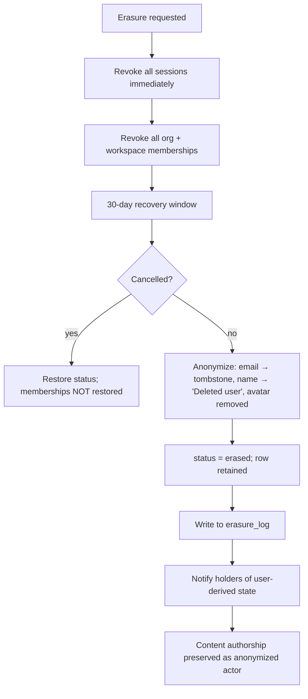

# Users Service

> **Status:** v2.0 — complete. Platform Layer service. Domain model: `02-domain-design/organizations.md` (User aggregate).

## Purpose

Own the global identity record. A user exists **above** the tenancy hierarchy: one person, one account, many organizations and workspaces. This service owns the account's lifecycle — creation, verification, profile, deactivation, and erasure — and nothing about what that account may do anywhere.

It is separated from `authentication.md` because identity outlives credentials. A user may change password, add MFA, move from password to SSO, and have every session revoked, without the identity record changing at all.

## Responsibilities

- User account lifecycle: registration, email verification, deactivation, reactivation.
- Profile: display name, avatar reference, locale, timezone, notification defaults.
- Email change with re-verification.
- **GDPR erasure orchestration**: anonymization that preserves referential integrity and authorship history.
- Propagating deactivation and erasure to every service holding user-derived state.
- Supplying user summaries to consumers that display authorship or assignment.

## Non-responsibilities

| Not owned | Owner |
|---|---|
| Credentials, sessions, MFA, tokens | `authentication.md` |
| Organization or workspace membership | `organizations.md`, `workspaces.md` |
| Roles and permissions | `permissions.md` |
| Notification delivery and channel preferences | `notifications.md` (this service holds only the user's default locale/timezone) |
| Anything content-related | `05-content-platform/` |

**On erasure:** this service *orchestrates* it and owns the anonymization of the user record. It does not delete tenant content — an article authored by an erased user remains, attributed to an anonymized actor, because the workspace owns that content and the erasure of one member must not destroy a team's work.

## Domain boundaries

Bounded context: **Identity & Access**. Aggregate: `User` (root). Sits above the workspace boundary; `users` is one of the five documented RLS exceptions, with a policy allowing a user to read their own row and organization admins to read rows of their members.

## Architecture

### Registration and verification

```mermaid
sequenceDiagram
    participant U as Person
    participant USR as Users Service
    participant PG as PostgreSQL
    participant NOTIF as Notifications
    participant ORG as Organizations

    U->>USR: register(email, name)
    USR->>PG: BEGIN
    USR->>PG: insert user (email_verified=false, status=active)
    USR->>PG: outbox: UserRegistered
    USR->>PG: COMMIT
    USR->>NOTIF: verification email (via event)
    U->>USR: verify(token)
    USR->>PG: email_verified = true; outbox: UserEmailVerified
    alt email domain matches a verified domain with auto-join
        ORG-->>ORG: create org membership
    end
```

An unverified account may authenticate but is blocked from accepting invitations and from creating an organization — this prevents a typo'd address from claiming a domain-based auto-join.

### Lifecycle



### Erasure



**The row is never deleted.** Foreign keys from `audit_log`, `article_revisions.created_by`, `tasks.assignee_id`, and `gate_verdicts` all reference `users(id)`. Deleting the row would either cascade-destroy audit history or leave dangling references — both unacceptable. Anonymization satisfies erasure obligations while preserving the integrity of records the organization is separately obliged to keep.

The **erasure log** is what makes this durable across restores: any database restore replays it so an erased subject is re-erased (`14-operations/backup-recovery.md` §11).

## APIs

| Endpoint | Purpose | Authority |
|---|---|---|
| `POST /v1/users` | Register | Public |
| `POST /v1/users/verify` | Complete email verification | Token-bearer |
| `POST /v1/users/verify/resend` | Resend verification | Self, rate-limited |
| `GET /v1/users/me` | Current profile | Self |
| `PATCH /v1/users/me` | Update name, locale, timezone, avatar | Self |
| `POST /v1/users/me/email` | Request email change | Self; requires re-verification |
| `POST /v1/users/me/deactivate` | Self-deactivation | Self |
| `POST /v1/users/me/erase` | GDPR erasure request | Self |
| `DELETE /v1/users/me/erase` | Cancel erasure within window | Self |
| `GET /v1/users/me/export` | **Data portability export** | Self |
| `GET /v1/users/{id}` | Public profile summary | Any member sharing a workspace |
| `POST /v1/admin/users/{id}/deactivate` | Administrative deactivation | Platform admin, audited |

**Internal:** `UserDirectory.summaries(userIds[]) → UserSummary[]` — a batch endpoint consumed by every surface displaying authorship or assignment, deliberately batch-only to prevent N+1 lookups.

`GET /v1/users/me/export` returns the user's own identity data. Workspace *content* export is a separate, workspace-scoped operation (`workspaces.md`) because the content belongs to the organization, not the individual.

## Events

| Emitted | Consumers | Criticality |
|---|---|---|
| `UserRegistered` | Notifications, Analytics | Standard — payload carries `emailHash`, never the address |
| `UserEmailVerified` | Organizations (auto-join evaluation), Notifications | Standard |
| `UserProfileUpdated` | Read models, user-summary caches | Standard |
| `UserEmailChanged` | Authentication (revoke sessions), Audit, Notifications | Critical |
| `UserDeactivated` | **Authentication (revoke all sessions)**, Organizations, Workspaces, Workflow (unassign) | **Critical — DLQ pages** |
| `UserReactivated` | Read models, Notifications | Standard |
| `UserErasureRequested` | Retention worker, Audit | Critical |
| `UserErased` | All holders of user-derived state, Erasure log, Audit | **Critical** |

| Consumed | From | Reaction |
|---|---|---|
| `OrgMembershipRevoked` | Organizations | If the user holds no remaining memberships, notify (account is now orphaned but not deleted) |
| `MembershipRevoked` | Workspaces | Update the user's workspace summary cache |

## Database impact

Owns `users`. **RLS exception** with a policy permitting self-read plus organization-admin read of members. `UNIQUE (email)` on a `CITEXT` column enforces case-insensitive global uniqueness.

FKs pointing at `users(id)` use `ON DELETE SET NULL` (`tasks.assignee_id`) or `RESTRICT` (`audit_log.actor_id`) — never `CASCADE`. That choice is what makes anonymization the only viable erasure strategy, and it is deliberate.

Anonymization writes: `email` → `erased+{uuid}@tombstone.invalid` (preserving the unique constraint), `name` → `'Deleted user'`, avatar reference cleared, `mfa_state` cleared, `status = 'erased'`.

## Security

- **Enumeration resistance:** registration, verification-resend, and profile lookup return uniform responses whether or not an account exists.
- **Email change is a takeover vector:** it requires an authenticated session, re-verification of the new address, notification to the *old* address, and revocation of all sessions on completion.
- Avatar uploads go through `media.md`, inheriting its content-type validation and stripping — a user-supplied image is untrusted input.
- `UserRegistered` carries a hashed email because events reach far more consumers than the `users` table does.
- Administrative deactivation requires platform-admin authority and is audit-logged with actor and reason.
- Erasure is irreversible after the window; the API states the deadline explicitly rather than allowing a silent point of no return.

## Performance

- **User summaries are the hottest read**, appearing on every article, task, and audit row in the UI. They are cached per `userId` with a 15-minute TTL, invalidated on `UserProfileUpdated`, and always fetched in batch.
- Profile reads are single-row primary-key lookups.
- The `users` table is small (10⁵–10⁶) and almost entirely cached at the application layer; it is never a scaling concern.
- Erasure runs as a background job because it fans out to many services; the API returns immediately with the scheduled completion time.

## Failure handling

| Failure | Behaviour |
|---|---|
| Verification email undeliverable | Account remains unverified; resend is rate-limited; the user can change the address before verification |
| `UserDeactivated` consumer fails | Sessions are revoked **synchronously** in the same request; the event drives secondary cleanup, so a lost event never leaves a live session |
| Erasure partially applied | Each consumer is idempotent by `userId`; the erasure log records completion per consumer; incomplete erasure alerts |
| Email change race (two requests) | Optimistic concurrency on the user row rejects the loser |
| Anonymization collides with the unique index | The tombstone address embeds a UUID, so collision is impossible by construction |
| Reactivation after memberships revoked | Account is restored; memberships are **not** — they must be re-granted deliberately |

## Observability

- **Metrics:** `users_total{status}`, `registrations_total`, `email_verifications_total{result}`, `user_summary_cache_hit_ratio`, `erasure_requests_total`, `erasure_completion_duration_seconds`.
- **Logs:** lifecycle transitions with actor and correlation id; never email addresses at info level.
- **Alerts:** `UserDeactivated` or `UserErased` in the DLQ (**page** — an incomplete erasure is a compliance exposure); erasure jobs incomplete past their deadline; verification success rate dropping (usually a deliverability problem, not a product one).

## Implementation notes

- **Never hard-delete a user row.** The anonymization path is the only deletion path, and integration tests assert that referential integrity survives it.
- The erasure fan-out must be enumerable: a registry lists every service holding user-derived state, and adding a new one without registering it is caught by a test that compares the registry against services subscribing to `UserErased`.
- `UserDirectory.summaries` is batch-only by design; there is no single-user internal lookup, which prevents N+1 patterns from being written accidentally.
- Session revocation on deactivation is **synchronous**, not event-driven. Events are for secondary effects; a security-relevant revocation must not depend on delivery.

## Cross references

- `02-domain-design/organizations.md` — the User aggregate and its rules
- `authentication.md` — credentials, sessions, MFA
- `organizations.md` · `workspaces.md` — membership revocation on deactivation
- `notifications.md` — verification and change-alert delivery
- `media.md` — avatar storage
- `audit-logs.md` — the record erasure must preserve
- `14-operations/backup-recovery.md` §11 — erasure-log replay on restore
- `16-security/compliance.md` — GDPR obligations this service implements
