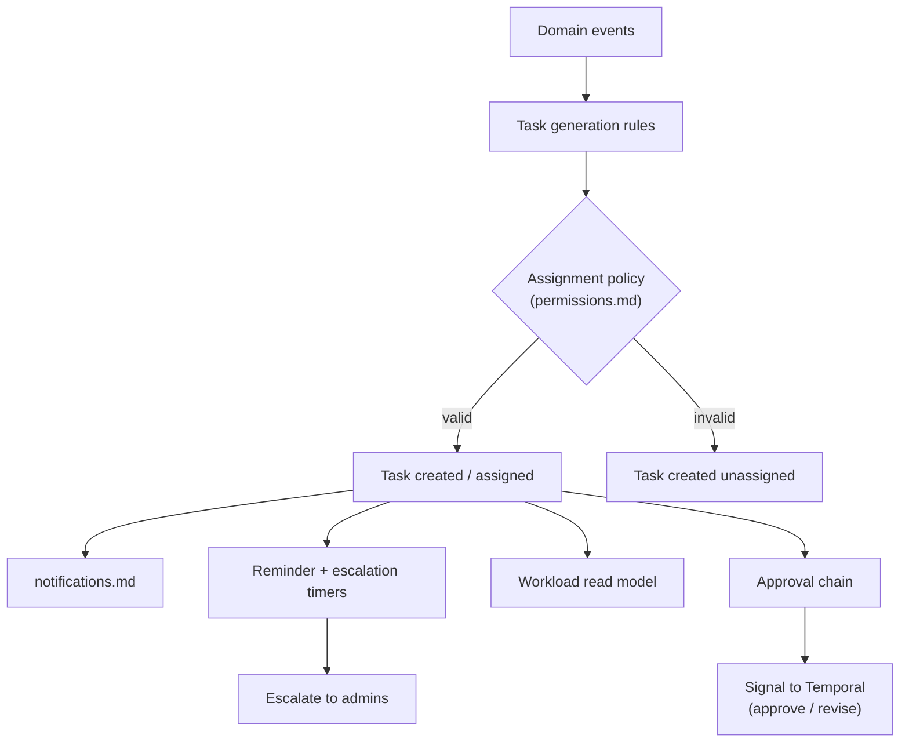
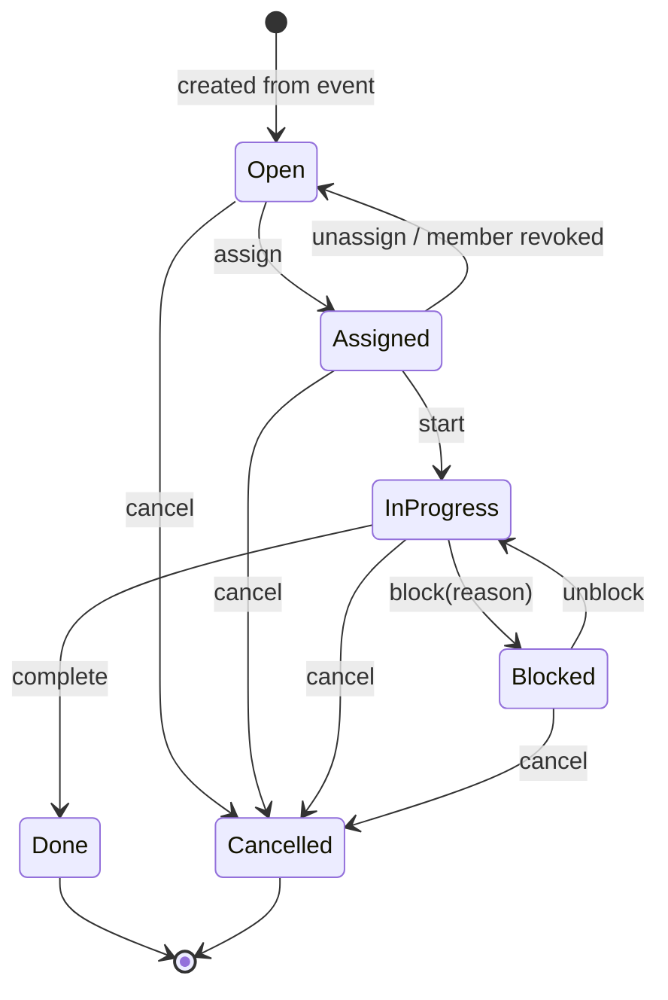
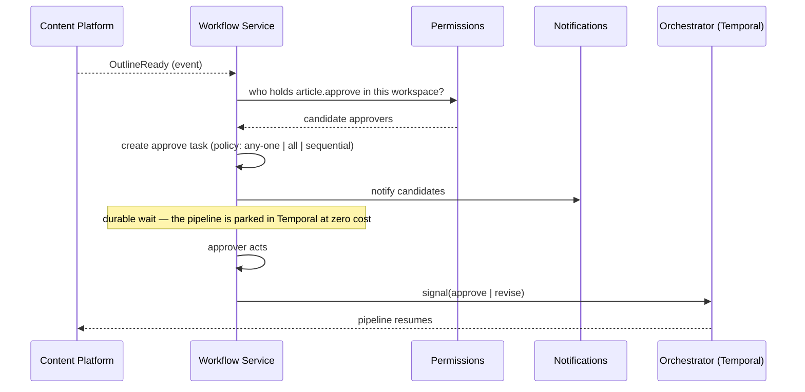

# Workflow Service

> **Status:** v2.0 — complete. Platform Layer service. Domain model: `02-domain-design/projects.md` (Task aggregate).
> **Naming discipline:** this service owns the **editorial workflow** — human process. The **execution workflow** is Temporal (`01-system-architecture/05-glossary.md`). The words are not interchangeable and this document never uses "workflow" without a qualifier.

## Purpose

Track who is doing what, by when, and with whose approval. Content production is a team activity with hand-offs: someone writes, someone reviews, someone approves an outline, someone resolves a blocked gate. Without a service owning that, editorial state gets smuggled into article status and the two lifecycles corrupt each other.

The separation is the point. An article's **content state** (`drafting`, `in_review`, `published`) is what the pipeline did. Its **editorial state** (`assigned`, `in_progress`, `blocked`) is what a human is doing. Reassigning an article does not change its content state; passing a quality gate does not change who owns it.

## Responsibilities

- Task lifecycle: creation, assignment, start, block, completion, cancellation.
- Assignment policy: validating that an assignee may hold a task of that type.
- Approval chains: who must approve, in what order, and what happens on timeout.
- Reminders, escalation, and overdue detection.
- Reassignment when a member is revoked, and workload visibility.
- Converting domain events into human work items.

## Non-responsibilities

| Not owned | Owner |
|---|---|
| Durable pipeline execution, activities, retries, signals | Temporal (`01-system-architecture/07-c4-container.md`) |
| Article content state | `02-domain-design/articles.md` |
| Calendar and scheduling intent | `projects.md` |
| Permission catalogue | `permissions.md` (this service *consumes* it) |
| Notification delivery | `notifications.md` |
| Approval **thresholds and policy values** | `settings.md` |
| Any content capability | `05-content-platform/` |

**The hardest boundary to hold:** completing a `write` task does **not** start drafting, and drafting does **not** complete the task. Tasks and pipeline runs are linked by events, never by control flow. If a task transition could trigger a pipeline stage, editorial state would become load-bearing for execution and a mis-click would corrupt a run.

## Domain boundaries

Bounded context: **Work Management** (task half). Every task carries `tenant_id`, references exactly one project and one article, and is subject to the invariant that an article has at most one open task per type — enforced by a partial unique index (`03-database/tables.md` §3).

## Architecture

### Task lifecycle

`Done` and `Cancelled` are terminal. Reopening creates a **new** task, preserving history — a task that oscillates between done and open destroys cycle-time measurement.

### Approval chains

**The approval decision is recorded here; the pipeline resumes there.** This service sends a Temporal **signal** — it never advances a run itself. That keeps run position in exactly one place.

| Chain mode | Behaviour |
|---|---|
| `any_one` | First eligible approver decides (default) |
| `all` | Every named approver must approve |
| `sequential` | Ordered; each stage unlocks the next |

Mode and timeout come from `settings.md` (workspace policy, project may tighten). On timeout, policy chooses: remind, escalate to admins, or auto-cancel the run.

## APIs

| Endpoint | Purpose | Authority |
|---|---|---|
| `GET /v1/tasks` | Filterable list: assignee, project, state, type, due window | `viewer` |
| `GET /v1/tasks/mine` | Personal queue, sorted by due date and priority | Self |
| `POST /v1/tasks` | Create a manual task | `editor` |
| `PATCH /v1/tasks/{id}/assign` | Assign or reassign | `admin`, or self-claim from `open` |
| `POST /v1/tasks/{id}/start` · `/block` · `/unblock` · `/complete` · `/cancel` | Transitions | Assignee or `admin` |
| `POST /v1/articles/{id}/approve` · `/revise` | Approval decision (sends the Temporal signal) | `article.approve` |
| `GET /v1/workspaces/{id}/workload` | Per-assignee open counts and overdue | `admin` |
| `GET /v1/projects/{id}/board` | Kanban board read model | `viewer` |

**Internal:** `TaskGenerator.onEvent(event)`; `AssignmentPolicyService.validate(userId, tenantId, taskType)`; `ApprovalChain.resolve(articleId) → chain`.

## Events

All events below are written to the transactional outbox **in the same transaction as the state change** and published through the `EventBus` (ADR-020). No path in this service publishes directly to a bus.

| Emitted | Consumers | Criticality |
|---|---|---|
| `TaskCreated` | Notifications, Workload read model | Standard |
| `TaskAssigned` | Notifications (assignee), Workload | Standard |
| `TaskStarted` / `TaskBlocked` / `TaskCompleted` / `TaskCancelled` | Workload, Read models, Notifications | Standard |
| `TaskOverdue` | Notifications, Escalation | Standard |
| `ApprovalRequested` | Notifications | Standard |
| `ApprovalGranted` / `ApprovalRejected` | **Orchestrator (signal)**, Audit, Read models | **Critical — a lost approval parks a paid run indefinitely** |
| `ApprovalTimedOut` | Notifications, Orchestrator (per policy) | Critical |

| Consumed | From | Reaction |
|---|---|---|
| `ArticleCreated` | Content Platform | Create a `write` task if project policy requires |
| `OutlineReady` | Content Platform | Create an `approve` task and start the chain |
| `QualityGateBlocked` | Content Platform | Create a `review` task with the annotated package link |
| `ArticleReadyToPublish` | Content Platform | Complete the open `write` task |
| `OptimizationProposed` / `RefreshRecommended` | Analytics | Create `optimize` / `refresh` tasks |
| `MembershipRevoked` | Workspaces | **Unassign** that user's non-terminal tasks; notify admins |
| `ProjectArchived` | Projects | Cancel open tasks |

## Database impact

Owns `tasks` (`03-database/tables.md` §3), plus `approval_chains` and `approval_decisions` added with this document.

| Table | Key columns | Constraints |
|---|---|---|
| `tasks` | `tenant_id`, `project_id`, `article_id`, `type`, `assignee_id`, `state`, `priority`, `due_at`, `blocked_reason` | Partial unique `(article_id, type) WHERE state NOT IN ('done','cancelled')`; `CHECK ((state='blocked') = (blocked_reason IS NOT NULL))`; `assignee_id` FK `ON DELETE SET NULL` |
| `approval_chains` | `tenant_id`, `article_id`, `mode`, `stage`, `state`, `timeout_at` | Partial unique `(article_id) WHERE state = 'pending'` |
| `approval_decisions` | `chain_id`, `approver_id`, `decision`, `reason`, `decided_at` | **Append-only**; `UNIQUE (chain_id, approver_id, stage)` |

Approval decisions are append-only because they are the record of who authorized publication — required for the same audit reasons as gate verdicts.

`tasks` uses terminal state rather than deletion; the workload read model is projected from task events and rebuildable by replay.

## Security

- **Assignment is an authorization decision.** Assigning an `approve` task to a `viewer` is refused at the domain level, not merely hidden in the UI.
- Approval requires the `article.approve` permission at decision time, re-checked then rather than trusted from task creation — a demoted user must not be able to approve via a stale task link.
- Approval decisions are audit-logged with actor, article version, and reason. This is the human half of the publication authorization chain that `gate_verdicts` and `publish_packages` complete.
- Task payloads and notifications carry identifiers and titles only — never brief text, draft content, or gate annotations.
- Self-claim from `open` is permitted for eligible roles; self-assignment of an `approve` task by the same person who wrote the article is refused when workspace policy requires separation of duties.

## Performance

- Boards and personal queues are served by the **workload read model**, denormalizing article title, status, and project so no board query joins into Authoring.
- Task lists are cursor-paginated with covering indexes on `(assignee_id, state, due_at)` and `(tenant_id, project_id, state)`, both partial on non-terminal states — usually a small fraction of all rows.
- Overdue and reminder sweeps are scheduled batch jobs per workspace, not per-task timers.
- Approval chain resolution caches the candidate-approver set per `(tenantId, permission)` with invalidation on membership change; resolving it per event would hammer permissions.
- Optimistic concurrency on `Task` resolves concurrent assignment attempts deterministically.

## Failure handling

| Failure | Behaviour |
|---|---|
| Duplicate task from a retried event | Partial unique index rejects it; the handler treats the violation as success |
| Assignment to a revoked member | Refused; if the revocation event arrives later, the consumer unassigns and notifies |
| Approval signal lost | **Pages.** A paid run parked indefinitely is the worst failure this service can produce; the signal is retried, and a reconciliation sweep detects chains marked approved whose runs are still waiting |
| Approval timeout | Policy-driven: remind, escalate, or auto-cancel with credits released |
| Task references a deleted article | Impossible — FK `RESTRICT`; article deletion is refused while non-terminal tasks exist |
| Workload projection lags | Board shows a staleness indicator; rebuilt by replay |
| Member revoked mid-task | Task returns to `open`, assignee cleared, admins notified; the task is never silently deleted |

## Observability

- **Metrics:** `tasks_total{type,state}`, `task_cycle_time_seconds{type}`, `tasks_overdue`, `approval_duration_seconds`, `approval_timeouts_total`, `assignment_rejections_total`, `workload_projection_lag_seconds`.
- **Logs:** every transition and approval decision with actor, task, article, correlation id, reason.
- **Traces:** approval spans link the human decision to the Temporal signal, so "the run is stuck" resolves to either "nobody approved" or "the signal failed" without guesswork.
- **Alerts:** `ApprovalGranted` in the DLQ (**page**); approval chains pending beyond their timeout without escalation; tasks `in_progress` beyond a workspace threshold; workload projection lag above 60 s.

## Implementation notes

- **Never advance a pipeline from this service.** Send a Temporal signal and let the orchestrator own run position.
- Task generation rules are configuration, not code branches: an event-to-task mapping table makes "create a review task on gate block" a data change per workspace policy.
- The reconciliation sweep between approval decisions and waiting Temporal workflows is not optional. Approval is the one place where a lost message strands paid work indefinitely, and only a sweep catches it.
- Do not add content fields to `tasks`. Every attempt to denormalize "just the article title" for convenience eventually becomes a second, stale copy of article state.
- Cycle-time measurement depends on terminal states being terminal. Reopening must create a new task.

## Cross references

- `02-domain-design/projects.md` — Task aggregate, invariants, lifecycle
- `projects.md` — calendar (planning) versus tasks (assignment)
- `permissions.md` — assignment validation and approver resolution
- `notifications.md` — assignment, reminder, and approval notifications
- `settings.md` — approval mode, timeout, separation-of-duties policy
- `02-domain-design/articles.md` — the content state machine this service deliberately does not touch
- `01-system-architecture/07-c4-container.md` — Temporal as the execution plane
- `15-application-ui/` — board and queue surfaces
