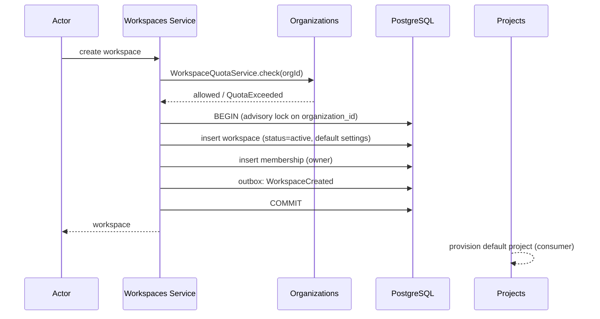
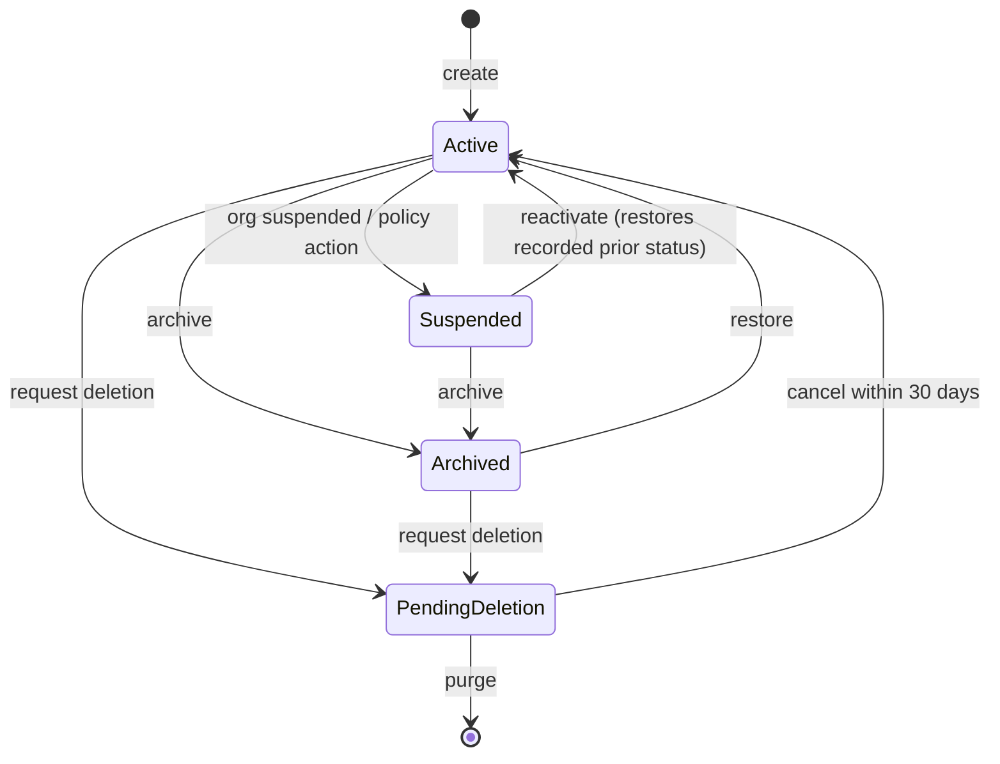
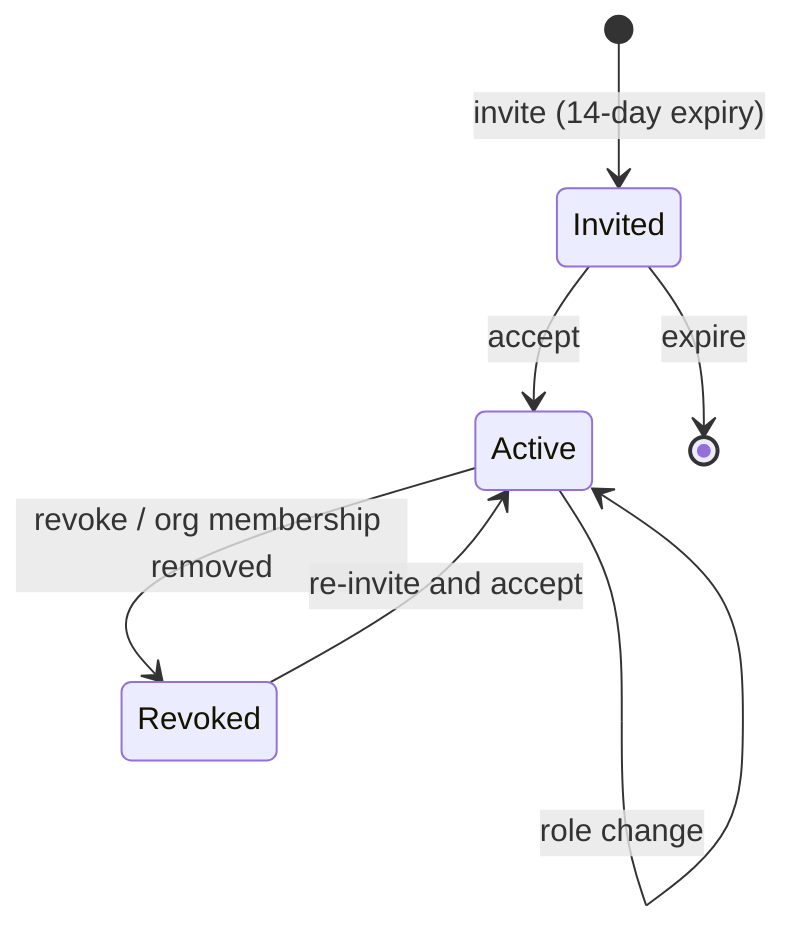

# Workspaces Service

> **Status:** v2.0 — complete. Platform Layer service. Domain model: `02-domain-design/workspace.md` (Workspace, Membership). Tenancy authority: ADR-017.

## Purpose

Operate the isolation boundary. `workspaces.id` **is** `tenant_id` — the key every Row-Level Security policy in the platform reads. This service provisions workspaces, manages who belongs to them, holds their configuration, and executes their lifecycle transitions.

Everything a team produces lives inside exactly one workspace and is invisible outside it. That single property is what makes the agency and enterprise segments addressable, and this service is where it is operated.

## Responsibilities

- Workspace lifecycle: provisioning, rename, suspension, archival, deletion request, purge scheduling.
- Membership: invitation, acceptance, role change, revocation, expiry sweeps.
- Storing workspace configuration (resolution and precedence belong to `settings.md`).
- Consuming organization cascades and applying them, recording prior status for correct restoration.
- Supplying the workspace half of effective-permission resolution.
- Workspace-scoped data export.

## Non-responsibilities

| Not owned | Owner |
|---|---|
| Organization lifecycle, quota authority, plan limits | `organizations.md` |
| User accounts, authentication | `users.md`, `authentication.md` |
| Permission catalogue and enforcement | `permissions.md` |
| **Settings resolution and precedence** | `settings.md` — this service stores the workspace layer, it does not resolve the hierarchy |
| Projects, tasks, calendar | `projects.md`, `workflow.md` |
| Any content aggregate | `05-content-platform/` |
| Credential encryption for connectors | `settings.md`, `16-security/` |

**On settings:** this service owns the `workspaces.settings` column as *storage*. It does not decide how a workspace value combines with an organization default or a project override — that is `settings.md` and Proposed ADR-024. Splitting them prevents every service from reimplementing precedence.

## Domain boundaries

Bounded context: **Identity & Access** (workspace half). The workspace is the **shared kernel** referenced by every other context: `tenant_id` travels with every request and is understood identically everywhere (`01-system-architecture/04-context-map.md`).

`workspaces` is the fifth RLS exception — its policy keys on `id = current_setting('app.tenant_id')` rather than on a `tenant_id` column, plus an organization-scoped read policy so an org admin can list workspaces without entering them.

## Architecture

### Provisioning

Workspace, owner membership, default settings, and the outbox event are one transaction. An advisory lock on `organization_id` closes the quota race that a bare count check would leave open.

### Lifecycle

| State | Reads | New runs | Publishing | Quota |
|---|---|---|---|---|
| `active` | yes | yes | yes | counts |
| `suspended` | yes | no | no | counts |
| `archived` | yes | no | no | **does not count** |
| `pending_deletion` | yes | no | no | does not count |

**Reads always remain available.** A suspended customer must be able to export their data — withholding it is both bad practice and, in several jurisdictions, unlawful.

### Membership

Revocation triggers three synchronous effects — permission cache purge, task unassignment (`workflow.md`), and audit — and one asynchronous effect: notification.

## APIs

| Endpoint | Purpose | Authority |
|---|---|---|
| `POST /v1/workspaces` | Provision | `org_admin` |
| `GET /v1/workspaces` | List the caller's workspaces | Member |
| `GET/PATCH /v1/workspaces/{id}` | Read / rename | `admin` |
| `POST /v1/workspaces/{id}/archive` | Archive | `owner` |
| `POST /v1/workspaces/{id}/restore` | Restore from archive | `owner`, `org_admin` |
| `POST /v1/workspaces/{id}/delete` | Request deletion (30-day window) | `owner` |
| `DELETE /v1/workspaces/{id}/delete` | Cancel deletion | `owner` |
| `GET/POST /v1/workspaces/{id}/members` | List / invite | `admin` |
| `PATCH /v1/workspaces/{id}/members/{userId}` | Change role | `admin`; `owner` for owner grants |
| `DELETE /v1/workspaces/{id}/members/{userId}` | Revoke | `admin` |
| `POST /v1/workspaces/{id}/members/invitations/{id}/resend` | Resend invitation | `admin` |
| `GET/PATCH /v1/workspaces/{id}/settings` | Read / update workspace settings layer | `admin` |
| `POST /v1/workspaces/{id}/export` | Full workspace export (202 + handle) | `owner` |

**Internal:** `WorkspaceDirectory.get(tenantId)` (cached); `MembershipResolver.roleFor(userId, tenantId)` consumed by `permissions.md`; `WorkspaceProvisioningService.provision(orgId, name, ownerId)`.

## Events

| Emitted | Consumers | Criticality |
|---|---|---|
| `WorkspaceCreated` | Projects (default project), Analytics registry, Notifications | Standard |
| `WorkspaceRenamed` | Read models | Standard |
| `WorkspaceSettingsUpdated` | Content engines (cache purge), AI Platform, Settings, Audit | Standard — **changed keys only, never values** |
| `WorkspaceSuspended` | Orchestrator (cancel runs), Credits (release holds), Notifications | **Critical** |
| `WorkspaceReactivated` | Read models, Notifications | Critical |
| `WorkspaceArchived` | Orchestrator, Projects, Analytics (stop collection), Knowledge (read-only namespace) | Critical |
| `WorkspaceDeletionRequested` | Retention worker, Notifications, Audit | Critical |
| `WorkspacePurged` | Audit, Storage cleanup, Erasure log | **Critical** |
| `MembershipInvited` / `Accepted` / `RoleChanged` | Notifications, Permission cache, Audit | Role change critical |
| `MembershipRevoked` | **Permission cache**, Workflow (unassign), Audit | **Critical — a stale permission cache is a security issue** |

| Consumed | From | Reaction |
|---|---|---|
| `OrganizationSuspended` / `Reactivated` | Organizations | Cascade, recording and restoring prior status |
| `OrgMembershipRevoked` | Organizations | Revoke that user's memberships in all workspaces of the organization |
| `SubscriptionChanged` | Billing (via Organizations) | Re-evaluate retention ceilings; mark over-quota workspaces read-only |
| `UserDeactivated` | Users | Revoke memberships |

## Database impact

Owns `workspaces` (RLS exception, dual policy), `workspace_memberships`, `workspace_settings_history` (append-only).

Constraints relied upon: `UNIQUE (organization_id, slug)`; `UNIQUE (tenant_id, user_id)` on memberships; `CHECK` on role and status vocabularies. **Last-owner protection is a trigger** (`WS_LAST_OWNER`) — a cross-row count over a filtered set, not declarable.

Soft delete on `workspaces` with a 30-day purge; memberships use `revoked` status rather than deletion so authorship attribution and audit survive.

Purge is ordered and explicit — never a foreign-key cascade. FKs into workspace-owned tables are `RESTRICT` precisely so that a mis-issued delete cannot silently destroy a customer's content.

## Security

- **Cross-workspace access returns `404`**, never `403`.
- `WorkspaceSettingsUpdated` carries changed **keys** only; settings can include competitively sensitive configuration.
- **Permission cache invalidation on `MembershipRevoked` is synchronous** in the request path; the event drives secondary cleanup. A DLQ entry on that event is treated as a security incident.
- Last-owner protection is a security control: a workspace with no owner is unadministrable and its data unreachable through normal paths.
- Export is `owner`-only, rate-limited, and audit-logged — a full workspace export is the highest-value exfiltration target in the product.
- Every role change, settings change, and lifecycle transition is audit-logged with actor and before/after.

## Performance

| Path | Approach |
|---|---|
| Effective permission (every request) | Cached per `(userId, tenantId)`, 5-minute TTL, event-driven invalidation |
| Workspace settings (hot path for engines) | Cached per `tenant_id`, invalidated on update; engines never read the database directly |
| Workspace switcher | Read model `workspace_switcher_view`, projected from events |
| Member list | Cursor-paginated, ordered `(role, created_at)` — a 500-member enterprise workspace must not load in one page |
| Concurrency | Optimistic (`version`) on both roots; concurrent settings edits fail the loser rather than silently overwriting |

## Failure handling

| Failure | Behaviour |
|---|---|
| Provisioning partially completes | One transaction; impossible |
| Quota race | Advisory lock + in-transaction count; loser gets typed `QuotaExceeded` |
| Cascade suspension fails midway | Idempotent per `workspaceId`; retried; DLQ **pages** |
| Permission cache invalidation lost | 5-minute TTL bounds exposure; DLQ alert treated as a security event |
| Deletion requested with in-flight runs | Runs cancelled at next durable checkpoint, credit holds released, **then** the purge timer starts |
| Restore after purge | Not possible; the API returns a typed error naming the elapsed window rather than attempting partial recovery |
| Invitation to an already-member | Treated as a role change, not a second membership (database unique constraint enforces it) |

## Observability

- **Metrics:** `workspaces_total{status}`, `workspace_members_total`, `membership_changes_total{action}`, `permission_resolution_duration_seconds`, `permission_cache_hit_ratio`, `settings_updates_total`, `workspace_exports_total`.
- **Logs:** every membership and settings mutation with actor, workspace, organization, correlation id — never settings values.
- **Traces:** permission resolution is a span on every request, keeping its cost visible in the p95 rather than hidden inside authentication.
- **Alerts:** `MembershipRevoked` or `WorkspaceSuspended` in the DLQ (**page**); permission cache hit ratio below 90%; workspaces in `pending_deletion` past their purge date.

## Implementation notes

- `WorkspaceId` and `tenant_id` are the same value. Code that converts between them, or holds both, indicates a modelling error.
- The cascade consumer must set tenant context **from the event**, never inherit it.
- Reactivation restores the **recorded prior status**; a workspace archived before an organization suspension stays archived.
- Purge order is fixed and explicit: content tables, then knowledge, then object storage, then the workspace row, then the erasure-log entry. Reversing it strands objects in R2 with no reference.
- No engine reads `workspaces.settings` directly — everything goes through `settings.md`, so precedence exists in exactly one place.

## Cross references

- `02-domain-design/workspace.md` — aggregates, invariants, lifecycle
- `organizations.md` — parent, quota authority, cascade source
- `settings.md` — resolution and precedence over the layer stored here
- `permissions.md` — the workspace half of effective permission
- `projects.md` — child aggregate provisioned on creation
- `03-database/tables.md` §2 — the fifth RLS exception and its dual policy
- `16-security/rbac.md` — role semantics
- `14-operations/backup-recovery.md` — tenant-level restore procedure
