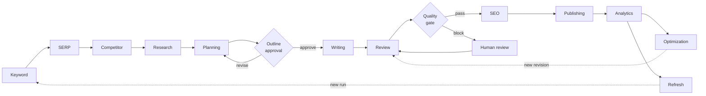

# 05 — Content Platform

The thirteen engines that transform a keyword into a continuously improving published content asset, plus the control plane that coordinates them.

This is the layer that makes ContentOS a product rather than a platform. Everything below it — identity, tenancy, storage, events, AI access — exists so that these engines can do one thing each, extremely well, without knowing how any of it works.

## The pipeline

| # | Engine | Single responsibility | Produces ADR-021 scores |
|---|---|---|---|
| 1 | `keyword-intelligence.md` | **Discovers** opportunity | No |
| 2 | `serp-intelligence.md` | **Observes** the results page | No |
| 3 | `competitor-intelligence.md` | **Compares** against ranking content | No |
| 4 | `research-engine.md` | **Collects** evidence with provenance | No |
| 5 | `planning-engine.md` | **Structures** intent into an outline | No |
| 6 | `writing-engine.md` | **Creates** grounded drafts | No |
| 7 | `review-engine.md` | **Validates** quality | **8 categories** |
| 8 | `seo-engine.md` | **Evaluates** optimization | **4 categories** |
| 9 | `optimization-engine.md` | **Recommends** improvements | No |
| 10 | `refresh-engine.md` | **Identifies** decay | No |
| 11 | `publishing-engine.md` | **Executes** publication | No |
| 12 | `analytics-engine.md` | **Measures** outcomes | No |
| — | `orchestration.md` | **Coordinates** — performs no business work | No |

**Exactly two engines produce quality scores.** Review owns `eeat`, `human_quality`, `readability`, `fact_confidence`, `citation_quality`, `spam_risk`, `brand_voice`, and the composite `publishing_readiness`; SEO owns `seo`, `aeo`, `geo`, `accessibility` (ADR-021 §3). Every other engine consumes scores and produces none. An engine emitting a category it does not own fails a startup check against the category registry.

## Golden rules

Binding on every document in this folder, without exception:

| Rule | Enforcement |
|---|---|
| **No engine reads another engine's tables** | Published-language contracts or events only; reviewed at PR, and cross-context joins are prohibited by the context map |
| **No engine defines its own score model** | ADR-021; category registry with one producer each |
| **No engine calls an AI provider** | ADR-008; every model interaction is an `AIRequest` through the AI Gateway. Import-boundary lint fails the build |
| **No engine publishes directly to a bus** | ADR-020; outbox row inside the state-changing transaction |
| **No engine contains platform logic** | Identity, tenancy, billing, credits, notifications, media storage, permissions, settings, flags all live in `04-platform/` |
| **No engine derives tenancy** | `TenantContext` arrives with the request or the activity; `tenant_id` is the workspace (ADR-017) |
| **No engine fabricates** | Degraded input produces a recorded gap or a typed refusal, never invented data |

## Common engine anatomy

Every engine instantiates the same internal shape (`01-system-architecture/08-c4-component.md` §3): a **functional core** of pure decision logic surrounded by an **imperative shell** of adapters — activity handlers, repository, AI client, knowledge client, provider client, event publisher.

Six rules bind all thirteen:

1. The functional core receives and returns plain data; no connections, clients, or framework objects cross into it.
2. Activity handlers are **idempotent on `(workflow_id, step)`** — Temporal will retry them, and a retry must produce one effect.
3. Every recommendation leaves the engine wrapped in an **Explainability Envelope** with non-empty `evidence[]` (ADR-009), enforced by a `CHECK` constraint where persisted.
4. Thresholds, budgets, and routing hints come from resolved settings (ADR-024), **snapshotted at run start** — never from constants in engine code.
5. Persistence and event publication share one transaction, via the outbox.
6. Degraded inputs produce a recorded gap or a typed refusal.

## What is deliberately not here

| Concern | Owner |
|---|---|
| Evidence Bank, entity and knowledge graphs, citation resolution, vector search, RAG, trust and freshness scoring | `11-knowledge-platform/` |
| AI Gateway, model router, prompts, context builder, memory, AI Council, guardrails | `08-ai-platform/` |
| Provider adapters (DataForSEO, Firecrawl, Exa, GSC, GA4, CMS targets) | `09-integrations/` |
| Durable workflow execution, retries, timers, signals | Temporal, driven by `orchestration.md` |
| Human tasks, assignment, approval chains | `04-platform/workflow.md` |
| Everything identity, commercial, or configurational | `04-platform/` |

**There is no `knowledge-engine.md` in this folder.** Knowledge is a platform (folder 11), not a pipeline stage. The Research Engine is its producer, writing evidence through the Knowledge Platform's published language; every other engine consumes it the same way. An earlier draft listed a Knowledge Engine facade here; it was removed because a facade over a platform adds an indirection that owns nothing.

## Stage boundaries that are easy to blur

These four pairs overlap in ordinary conversation and must not overlap in code:

- **SERP Intelligence observes; Competitor Intelligence compares.** Capturing what ranks is not the same as judging why, and mixing them makes SERP data unreusable across articles.
- **Review validates; SEO evaluates.** Review asks "is this true, readable, and on-brand?" SEO asks "will search and answer engines surface it?" Review runs first (ADR-011), so structural optimization is applied only to content that has already passed quality.
- **Optimization recommends; Refresh identifies decay.** Optimization proposes a targeted change to content that still works; Refresh scopes a re-research cycle for content that has stopped working.
- **Analytics measures; nothing else does.** No engine keeps its own performance history.

## Cross references

- `01-system-architecture/14-scoring-contract.md` — **ADR-021**, mandatory for every engine here
- `01-system-architecture/10-event-flow.md` — **ADR-020**, the outbox every engine publishes through
- `01-system-architecture/08-c4-component.md` §3 — the common engine anatomy
- `02-domain-design/` — the aggregates these engines operate on
- `03-database/tables.md` — physical schema; no engine redesigns it
- `04-platform/` — the services these engines consume and never reimplement
- `08-ai-platform/` · `09-integrations/` · `11-knowledge-platform/` · `13-event-platform/`
- `16-security/` — isolation, permissions, prompt-injection defence
- `orchestration.md` — the control plane sequencing all of it
