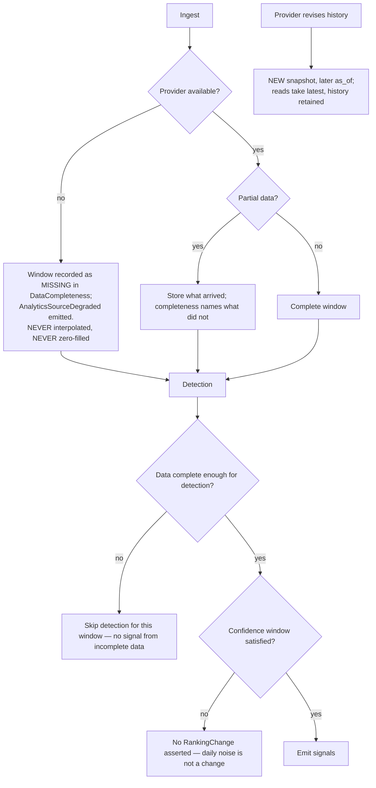

# Analytics Engine

> **Status:** v2.0 — complete. Stage 12 of 13. Bounded context: **Performance**.
> **Single responsibility: it measures outcomes.** It ingests external performance data and detects change. It proposes nothing (stage 9), scopes nothing (stage 10), and publishes nothing (stage 11).

## Overview

**Business purpose.** This is the only place the platform can answer "did it work?" — the question that renews contracts. It is also what converts a content tool into a content operating system: publication becomes the start of measurement rather than the end of the workflow, and measurement is what feeds Optimization and Refresh.

**Technical purpose.** Ingest search and traffic data for tracked live URLs, store it as an **immutable, completeness-qualified time-series**, detect **confidence-qualified** ranking changes and sustained decay, and emit signals the downstream engines act on.

**Design posture — epistemic honesty.** Third-party performance data is incomplete, delayed, sampled, and sometimes revised. Almost every rule in this engine is about **not lying** with it: a missing metric is `null` and never zero, a ranking change requires a confidence window before it is asserted, and attribution is qualified rather than claimed.

## Responsibilities

- URL registry: linking live URLs to articles and analytics properties.
- Scheduled ingestion from Search Console and GA4, with completeness metadata.
- Immutable snapshot storage and rollup maintenance.
- Confidence-qualified ranking-change detection.
- Sustained-decay detection with seasonality awareness.
- Emitting performance signals for Optimization and Refresh.
- Serving performance read models to dashboards.

## Non-responsibilities

| Not owned | Owner |
|---|---|
| Proposing improvements | `optimization-engine.md` |
| Scoping refresh | `refresh-engine.md` |
| Live URLs and publish state | `publishing-engine.md` |
| Provider mechanics for GSC and GA4 | `09-integrations/google-search-console.md`, `google-analytics.md` |
| **Any ADR-021 score category** | `review-engine.md`, `seo-engine.md` |
| **Platform operational metrics** (latency, cost, error rate) | `14-operations/monitoring.md` |
| Credentials and OAuth grants | `04-platform/settings.md`, Provider Layer |

**Two boundaries that are easy to lose:**

*Metrics are not Scores.* Impressions, clicks, position, and sessions are **measurements of the world**, not ADR-021 quality categories. They have no 0–100 normalization, no verdict, no confidence field in the contract's sense, and no producer entry in the registry. This engine produces **no score categories** — a fact worth stating plainly, because "analytics score" is a phrase that would otherwise creep in.

*"Analytics" here means customer content performance*, not system telemetry. They share vocabulary and nothing else; conflating them puts customer-facing measurement in the same code path as SLO monitoring.

## Inputs

| Input | Source | Validation |
|---|---|---|
| `ArticlePublished` / `ArticleUpdated` / `ContentUnpublished` | Stage 11 | Registers, marks, or stops tracking |
| GSC property data | Provider adapter | Window-qualified; completeness recorded |
| GA4 property data | Provider adapter | Window-qualified; completeness recorded |
| Property connections | `04-platform/settings.md` | OAuth grants held as references |
| Settling period, confidence parameters | Resolved settings (ADR-024) | Defaults: 90-day settling; confidence window per keyword volatility |

**Preconditions:** a live URL exists; an analytics property is connected. Without a property the URL is registered as `unconnected` and this is **surfaced**, not silently producing empty charts.

## Outputs

| Artifact | Detail |
|---|---|
| `UrlRegistryEntry` | Article ↔ live URL ↔ property binding, with tracking state |
| `PerformanceSnapshot[]` | **Immutable, append-only, partitioned**, with mandatory `DataCompleteness` |
| `performance_rollups` | Pre-aggregated weekly and monthly, rebuildable |
| `RankingChange[]` | Confidence-qualified position movements |
| `DecaySignal[]` | Sustained decline with type and severity |

**Score impact:** **produces none, consumes none** (ADR-021).

**Database impact:** the platform's highest-volume writes — `performance_snapshots` is partitioned by `(tenant_id, window_start)` from day one. No schema change.

## Workflow

```mermaid
sequenceDiagram
    participant SCHED as Ingestion scheduler
    participant ANA as Analytics Engine
    participant GSC as Search Console adapter
    participant GA as GA4 adapter
    participant PG as PostgreSQL
    participant OPT as Optimization / Refresh

    SCHED->>ANA: ingest(propertyId, window) [job]
    par per source
        ANA->>GSC: fetch window (paginated)
        GSC-->>ANA: rows or partial
        ANA->>GA: fetch window
        GA-->>ANA: rows or partial
    end
    ANA->>ANA: normalize to windows; build DataCompleteness
    ANA->>PG: bulk insert snapshots (idempotent on url+window+granularity+as_of)
    ANA->>PG: update rollups
    ANA->>ANA: RankingChangeDetector (confidence window)
    ANA->>ANA: DecayDetectionService (sustained trend vs baseline)
    ANA->>PG: BEGIN — changes + signals + outbox — COMMIT
    PG-->>OPT: RankingChanged / ContentDecayDetected
```

### Failure branches



**Compensation.** Snapshots are immutable and idempotent on `(url_id, window_start, granularity, as_of)`, so a retried or duplicated ingestion is a no-op. Rollups are **rebuildable by replay** from snapshots, so a projection bug is repaired by rebuild rather than data surgery.

## Domain rules

1. **A missing metric is `null` with a completeness record, never `0`.** Zero traffic and unknown traffic are different facts, and conflating them produces confidently wrong recommendations downstream.
2. Every snapshot carries `DataCompleteness` naming which sources reported, which are missing, and whether sampling applied — `NOT NULL`.
3. Snapshots are **immutable**. Providers revise history (Search Console backfills roughly three days); a revision is a **new snapshot** with a later `as_of`, and reads take the latest while history is retained.
4. Every metric is **window-qualified**. An unqualified number may not be stored or displayed.
5. A `RankingChange` is asserted **only** when its confidence window is satisfied — a minimum observation period and a volatility ceiling. Daily position noise is not a ranking change.
6. Position data is provider-averaged and sampled; positions are treated as **estimates**, and single-day movements never trigger action.
7. A `DecaySignal` requires a **sustained trend against a baseline**, not one bad window.
8. Decay detection is suppressed for content younger than the settling period (default 90 days) — new content has not earned a baseline.
9. Seasonality is acknowledged: year-over-year comparison is preferred where 12 months of history exists; otherwise the signal is emitted at **reduced confidence and labelled as such**.
10. Tracking stops on `ContentUnpublished`; historical snapshots are retained.
11. An orphaned URL pauses tracking and flags the entry — measuring a URL that no longer exists produces misleading declines.
12. Data is **never presented as more current than it is**; the `asOf` is surfaced in every response.

**State machine (tracking):** `unconnected → tracking → paused → stopped`.

**Idempotency:** ingestion keyed `(property, window, as_of)`; the unique constraint makes retries safe.

**Concurrency:** one ingestion job per property per window; detection runs after ingestion completes for that window.

## AI usage

| Task type | Purpose | Tier hint |
|---|---|---|
| `analytics.anomaly_explain` | Produce a human-readable summary of *why* a detected change may have occurred | Fast |

**Detection itself uses no AI.** Ranking-change detection, decay detection, seasonality comparison, and rollup computation are **statistical and deterministic** — they must be exact, reproducible, and auditable. A model must not be asked to decide whether a metric declined; arithmetic decides that.

The single AI task is explanatory garnish on an already-computed signal, and its absence degrades readability rather than correctness.

- **Prompt Engine:** versioned template; `prompt_version` recorded.
- **Context Builder:** supplies the computed signal, its supporting metrics, and any concurrent SERP drift. **Metric values are measured data**, never model output.
- **Memory:** not used — measurement must not be influenced by workspace preference, or it stops being measurement.
- **Model Router:** fast tier only.
- **AI Council:** not used.

## Scoring

Per **ADR-021**: **no categories produced, none consumed.**

Performance metrics are inputs to the Optimization and Refresh engines and appear in their Explainability Envelopes as evidence — but they are never expressed as Scores. The registry has no `performance` category, deliberately: a 0–100 normalization of traffic would hide the units, the window, and the completeness that make the number meaningful.

## Explainability

This engine produces measurements and detections rather than recommendations, so it emits no Explainability Envelope. It produces the **evidentiary basis** for every downstream one:

- Every `DecaySignal` carries `supportingMetrics` — the specific rollup windows and deltas that constitute the trend.
- Every `RankingChange` carries its `ConfidenceWindow`: observation days, volatility, and the `confident` boolean.
- Every snapshot carries `DataCompleteness`, so a downstream engine can decline to act on thin data.
- Change markers are recorded on the time-series when `ArticleUpdated` occurs, so a step change is attributable to a known event rather than mistaken for organic movement.

A user asking "why is this flagged as decaying?" receives the metric windows, the baseline, the trend, the completeness of each window, and whether year-over-year comparison was available.

## Events

Published through the transactional outbox in the state-changing transaction (ADR-020).

| Event | Producer | Consumers | Payload | Retry / DLQ |
|---|---|---|---|---|
| `UrlRegistered` | This engine | Ingestion scheduler, Read models | `{ urlId, articleId, url, projectId }` | Standard |
| `TrackingStarted` | This engine | Ingestion scheduler | `{ urlId, gscProperty, gaProperty, trackingSince }` | Standard |
| `PerformanceSnapshotRecorded` | This engine | Decay detection, Read models, Dashboards | `{ snapshotId, urlId, window, completeness }` — **metrics not inlined** | Standard |
| `RankingChanged` | This engine | **Optimization**, Notifications, Read models | `{ urlId, keyword, delta, direction, confidence }` | Standard |
| `ContentDecayDetected` | This engine | **Refresh**, Optimization, Notifications | `{ urlId, articleId, decayType, severity, supportingMetrics }` | **Critical** |
| `AnalyticsSourceDegraded` | This engine | Notifications, Observability, Read models | `{ provider, propertyRef, reason, affectedWindow }` | Standard |

**Consumed:** `ArticlePublished` → register and begin tracking; `ArticleUpdated` → record a change marker; `ContentUnpublished` → stop tracking, retain history; `PublishedContentOrphaned` → pause and flag; `ProjectArchived` / `WorkspaceArchived` → stop ingestion, retain history.

**Ordering:** per `urlId`. **Idempotency:** by `eventId` plus the snapshot unique constraint. **Payloads carry completeness and identifiers, never metric values** — performance data is competitively sensitive and events reach notification channels including email.

## Database impact

| Table | Operation |
|---|---|
| `url_registry` | Insert; state transitions |
| `performance_snapshots` | **Bulk insert, append-only, partitioned** — the platform's highest-volume write |
| `performance_rollups` | Upsert; rebuildable from snapshots |
| `ranking_changes`, `decay_signals` | Append-only insert |

**Constraints relied on:** `UNIQUE (url_id, window_start, granularity, as_of)`; `completeness NOT NULL`; `CHECK (window_end >= window_start)`.

**Indexes:** `(tenant_id, url_id, window_start DESC)` — the dominant read; **BRIN on `window_start`** for wide-range scans within a partition, roughly 1000× smaller than a B-tree on naturally ordered append-only data.

**Partitioning from day one** by `(tenant_id, window_start)`, monthly. Retrofitting partitioning on a 10¹⁰-row time-series is far more expensive than starting with it. **Dashboards read rollups, never raw partitions.** All queries run against a **replica**. No schema change.

## APIs

| Surface | Operation |
|---|---|
| REST | `GET /v1/analytics/urls` · `GET /v1/analytics/urls/{id}/performance?window=&granularity=` · `GET /v1/analytics/projects/{id}/summary` · `GET /v1/analytics/ranking-changes` · `POST /v1/analytics/properties` (connect) |
| Internal | `IngestionService.pull(property, window)` · `DecayDetectionService.evaluate(urlId)` · `RankingChangeDetector.detect(urlId, window)` |
| Streaming | None — analytics is dashboard-driven, not run-driven |
| Workers | Scheduled ingestion per property; decay sweep; rollup builder; change-marker consumer (BullMQ) |

**Every performance response includes `asOf` and completeness metadata.** A client cannot render a chart without knowing what is missing — this is enforced in the response contract, not left to the UI.

## Security

- Workspace isolation on registry, snapshots, and signals.
- **Connecting a property must prove control of it** — a property identifier alone grants no data access, since GSC property identifiers are guessable.
- OAuth grants are held as `CredentialRef` in the Provider Layer; this engine stores property identifiers only, never tokens.
- Performance data is competitively sensitive: event payloads carry completeness and identifiers only, never values.
- Permission: `analytics.read` to view; property connection requires `admin`.
- **No cross-tenant benchmarking**, and no aggregate that could expose another workspace's performance distribution.

## Performance

| Concern | Approach |
|---|---|
| Read path | **Rollups, not raw scans**; raw snapshots only for bounded detail windows |
| Write path | Bulk insert into the current partition; never row-by-row |
| Ingestion | Batched per property with provider pagination, scheduled off-peak, idempotent |
| Detection | Scheduled sweep over **rollups**, one pass per day — not per-snapshot evaluation |
| Replica | All analytical reads on a replica; the customer-facing path never contends with the write path |
| Timeouts | Per-property ingestion 300 s; detection sweep 600 s per workspace |
| Target | Ingestion lag **< 24 h**; dashboard p95 < 500 ms from rollups |

## Observability

- **Metrics:** `analytics_ingestion_runs_total{provider,result}`, `ingestion_lag_hours{provider}`, `snapshots_written_total`, `data_completeness_ratio{provider}`, `ranking_changes_detected_total{direction}`, `decay_signals_total{type,severity}`, `rollup_lag_seconds`.
- **Tracing:** one span per ingestion run per property and window.
- **Logging:** property, window, completeness, provider status — never metric values at debug volume.
- **Business KPIs:** tracked-URL coverage (published URLs actually being measured); decay-detection lead time versus refresh action; the correlation between `seo`/`aeo`/`geo` at publish and measured position, which is the only honest validation that those scores predict anything.
- **Alerts:** `ingestion_lag_hours` above 48 for an active property (**customers notice missing data before we do otherwise**); `data_completeness_ratio` dropping sharply; `ContentDecayDetected` DLQ entries; rollup lag above 2 hours.

## Cross references

- `02-domain-design/analytics.md` — aggregates, the epistemic rules, and lifecycle
- `publishing-engine.md` — `liveUrl` is the join key; tracking starts on `ArticlePublished`
- `optimization-engine.md` · `refresh-engine.md` — the consumers of every signal produced here
- `seo-engine.md` — live-URL scores measured against what this engine observes
- `09-integrations/google-search-console.md` · `google-analytics.md`
- `03-database/tables.md` §7 · `indexes.md` §7 · §9 (partitioning)
- `12-storage-platform/postgresql.md` — time-series partitioning and retention
- `14-operations/monitoring.md` — **system** telemetry, deliberately distinct from this engine
