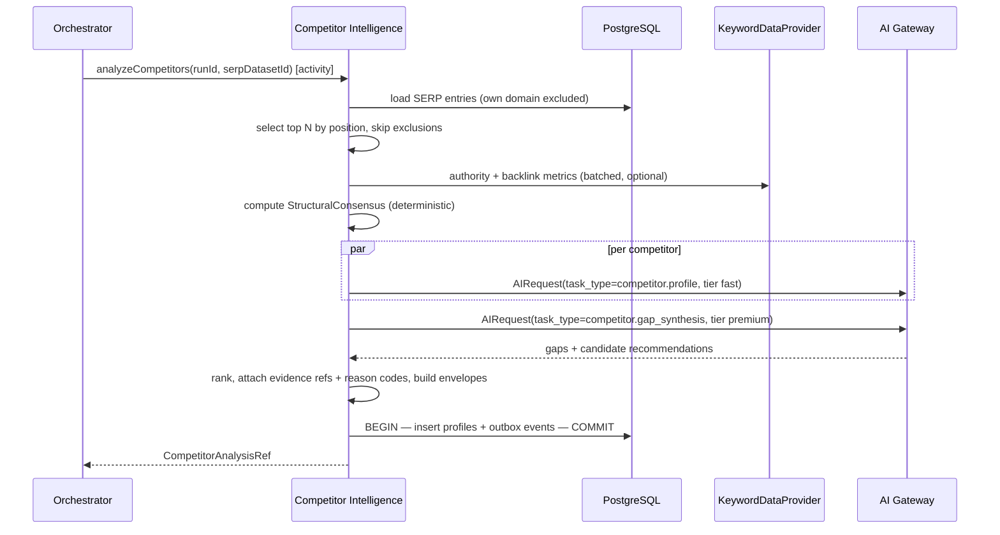
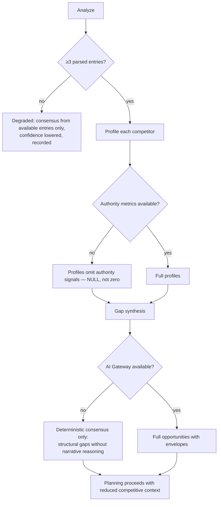

# Competitor Intelligence Engine

> **Status:** v2.0 — complete. Stage 3 of 13. Bounded context: **Discovery**.
> **Single responsibility: it compares.** It judges what ranking content does well, where it is thin, and what would beat it. It does not capture the SERP (stage 2) or collect evidence (stage 4).

## Overview

**Business purpose.** Ranking is competitive, not absolute. Content does not succeed by being good; it succeeds by being better than what currently occupies the page, in ways that matter for that query. This engine converts observation into an actionable competitive position — the difference between "write a thorough article" and "the top five all omit pricing, four of them are over two years old, and none answers the comparison question the PAA box surfaces."

**Technical purpose.** Consume the immutable SERP dataset, produce **`CompetitorProfile` records** describing each ranking result's strengths and structural signals, identify **`Gap` observations**, and synthesize **`Opportunity` recommendations** carrying full Explainability Envelopes.

## Responsibilities

- Profile each ranking result: content structure, depth, freshness, format, E-E-A-T signals, authority indicators.
- Identify gaps: topics, questions, formats, and data present across competitors and absent from a proposed angle — or present in ours and absent from theirs.
- Detect the SERP's structural consensus: what the ranking set has in common.
- Synthesize prioritized how-to-outperform recommendations with reasoning and evidence.
- Attach competitive context that Planning consumes when structuring the outline.

## Non-responsibilities

| Not owned | Owner |
|---|---|
| Capturing the SERP or parsing pages | `serp-intelligence.md` |
| Storing competitor claims as citable evidence | `research-engine.md` |
| Deciding the outline | `planning-engine.md` |
| Scoring our content's E-E-A-T | `review-engine.md` (`eeat` category, ADR-021) |
| Scoring our content's optimization | `seo-engine.md` |
| Backlink and domain authority data acquisition | `09-integrations/dataforseo.md` |
| Tracking competitor performance over time | `analytics-engine.md` |

**The sharpest boundary:** this engine assesses **E-E-A-T signals in competitor content** as a comparative observation, but it does **not** produce the `eeat` score category. That category measures *our* content and has exactly one producer — the Review Engine (ADR-021 §3). Observing that a competitor cites twelve primary sources is a gap observation; scoring our article's authoritativeness is a different act by a different owner.

## Inputs

| Input | Source | Validation |
|---|---|---|
| `SerpDataset` + `SerpEntry[]` | Stage 2 | Dataset must exist and be within `freshnessMaxAge`; entries lacking structure are excluded from structural aggregates |
| `KeywordSet` | Stage 1 | Primary term and intent |
| `targetSite` | Project | Used to exclude our own domain from the competitor set |
| `competitorCount` | Resolved settings | Bounded by `depth`: 3 / 5 / 10 |
| `brandExclusions[]` | Workspace settings | Domains never profiled |
| Backlink / authority metrics | `KeywordDataProvider` | Optional; nullable when unavailable |

**Preconditions:** at least three parsed SERP entries. Below that, the engine emits a degradation and produces low-confidence output rather than asserting a competitive position from two data points.

## Outputs

| Artifact | Detail |
|---|---|
| `CompetitorProfile[]` | Per domain/URL: structure, depth, freshness, format, signals, `analyzedAt`. **Immutable** |
| `Gap[]` | `{ topic, gapType, evidence[], observedIn[] }` — observations, not recommendations |
| `Opportunity[]` | Ranked how-to-outperform recommendations, each with a complete Explainability Envelope |
| `StructuralConsensus` | What the ranking set has in common: median word count, heading depth, table/FAQ prevalence, media density |
| `DegradationRecord[]` | Excluded or unanalyzable competitors, and why |

**Score impact:** produces none, consumes none (ADR-021).

**Database impact:** inserts `competitor_profiles` (immutable, `03-database/tables.md` §4). No schema change.

## Workflow

### Failure branches

**Compensation:** none — no external mutation. Deterministic structural consensus is computed **before** any AI call precisely so that an AI outage degrades reasoning quality rather than eliminating competitive context entirely.

## Domain rules

1. Our own `targetSite` is **always excluded** from the competitor set. Profiling ourselves and calling it competition is a common and expensive bug.
2. `analyzedAt` is mandatory; profiles are **immutable**.
3. A `Gap` is an **observation**; an `Opportunity` is a **recommendation** and must carry a complete Explainability Envelope. The two must never be conflated (`02-domain-design/research.md` rule 11).
4. **No competitor content is copied.** Profiles record structure, signals, and short fair-use excerpts already retained as evidence — never wholesale text. This is a legal boundary, not a style preference.
5. Authority and backlink metrics are **nullable**; absence is recorded as unknown, never as zero.
6. Structural consensus is computed **deterministically** from parsed entries, never generated. A median word count is arithmetic, and a model must not be asked to do arithmetic that a function can do exactly.
7. Confidence in every opportunity scales with the number of parsed competitors; fewer than three yields `confidence` capped low and a visible degradation.
8. Recommendations must be **actionable at outline level** — "add a pricing comparison table" is usable by Planning; "be more authoritative" is not, and is rejected by the reason-code registry.

**State machine:** `requested → profiling → synthesizing → complete | degraded | failed`.

**Idempotency:** keyed `(workflow_id, 'competitor.analyze', serpDatasetId)`. Because the input dataset is immutable, a retry produces equivalent output.

**Concurrency:** profiles are cached per `(tenant, domain, keyword, capturedAt)`; two articles targeting one keyword reuse the analysis.

## AI usage

| Task type | Purpose | Tier hint |
|---|---|---|
| `competitor.profile` | Summarize one competitor's structure, angle, and visible E-E-A-T signals into a fixed schema | Fast |
| `competitor.gap_synthesis` | Identify what the ranking set collectively covers and omits, and what would outperform it | **Premium / reasoning** |
| `competitor.signal_extract` | Extract author, credentials, citation, and freshness signals from a parsed page | Fast |

Gap synthesis is one of the few premium-tier tasks in Discovery, and deliberately so: it is genuine strategic reasoning across many documents, and it is the stage whose quality most directly determines whether the eventual article is differentiated or generic.

- **Prompt Engine:** versioned templates; `prompt_version` recorded per response.
- **Context Builder:** assembles structural summaries, consensus, and keyword intent within a token budget, wrapping competitor content **as data** (`16-security/prompt-injection.md`).
- **Memory:** contributes the workspace's positioning and prior differentiation decisions, so recommendations align with an existing strategy rather than proposing a new one each run.
- **Model Router:** premium for synthesis, fast for profiling; no model is named here.
- **AI Council:** not used at this stage. Council is reserved for bounded high-value decisions later in the pipeline (ADR-019), and competitive synthesis has a cheaper single-model path with acceptable quality.

## Scoring

Per **ADR-021**: **no categories produced, none consumed.**

Competitive observations become inputs to scoring later: `seo` and `aeo` measure our content partly against the structural consensus this engine computed, and `eeat` considers signals this engine observed in competitors. In both cases the measurement is performed by the category's single owner, using this engine's output as evidence. Introducing a "competitiveness score" here would create a category with no owner in the registry.

## Explainability

Every `Opportunity` carries `{ recommendation, reason, evidence[], expected_impact, confidence }` with:

- **`evidence[]`** referencing specific `serp_entries` and `competitor_profiles` rows with their timestamps — "seven of the top ten include a comparison table (`capturedAt` 2026-07-28)."
- **Reason codes** from the registry: `competitor.format_consensus_missing`, `competitor.topic_gap`, `competitor.freshness_advantage`, `competitor.depth_deficit`, `competitor.question_unanswered`. Never free prose.
- **`expected_impact`** as `low` / `medium` / `high`, justified by how consistently the pattern appears across the ranking set.
- **`confidence`** scaled by parsed-competitor count and consensus strength.

Traceability: opportunity → gap → competitor profile → SERP entry → dataset `capturedAt` → provider cache key → `correlationId`.

## Events

Published through the transactional outbox in the state-changing transaction (ADR-020).

| Event | Producer | Consumers | Payload | Retry / DLQ |
|---|---|---|---|---|
| `CompetitorAnalyzed` | This engine | Planning, Read models, Progress stream | `{ runId, profileCount, gapCount, consensusSummary, analyzedAt }` | 5 attempts, backoff, DLQ |
| `OpportunityIdentified` | This engine | Projects (backlog), Notifications, Read models | `{ opportunityId, projectId, envelope }` | Standard |
| `CompetitorAnalysisDegraded` | This engine | Progress stream, Observability | `{ runId, reason, analyzedCount, requestedCount }` | Standard |

**Consumed:** `SerpCaptured` → begin analysis for that dataset.

**Ordering:** per `runId`. **Idempotency:** by `eventId`. Payloads carry counts and a compact consensus summary — never competitor content or full URLs.

## Database impact

| Table | Operation |
|---|---|
| `competitor_profiles` | Insert only; `structure` and `gaps` as JSONB |
| `serp_entries` | Read only |

**Indexes relied on:** `ix_competitor_profiles__tenant_domain` for competitor history per domain.

**Caching:** profiles cached per `(tenant, domain, keyword, serpCapturedAt)`; because the SERP dataset is immutable and timestamped, cache validity is exact rather than heuristic. No schema change.

## APIs

| Surface | Operation |
|---|---|
| REST | `GET /v1/competitors?projectId=` · `GET /v1/research/runs/{id}/competitors` · `GET /v1/competitors/{id}/gaps` |
| Internal | `CompetitorIntelligence.analyze(serpDatasetId, opts) → CompetitorAnalysisRef` (Temporal activity) |
| Streaming | `stage.started` / `stage.completed`, plus per-competitor progress |
| Workers | Bounded profiling fan-out (BullMQ) |

## Security

- Workspace isolation on every read and write; profiles are never shared across workspaces, since a competitor set reveals a client's strategy.
- Competitor content is **untrusted input**: wrapped as data for every AI call, never interpreted as instructions.
- No page fetching happens here — this engine consumes what stage 2 already fetched through the guarded client, which keeps the SSRF surface in one place.
- Permission: `research.run` to analyze, `research.evidence.read` to view.
- Brand exclusions are honoured; a workspace may refuse to profile named domains for legal or relationship reasons.
- Fair-use discipline on excerpts is a documented control, reviewed in `16-security/compliance.md`.

## Performance

| Concern | Approach |
|---|---|
| Determinism first | Structural consensus computed without AI, so the expensive path is additive rather than required |
| Parallelism | Per-competitor profiling fans out concurrently, bounded by AI Gateway per-tenant limits |
| Caching | Profile cache keyed to the immutable dataset — high hit ratio when several articles target one keyword |
| Timeouts | Profiling 30 s per competitor; synthesis 90 s; activity 240 s |
| Cost control | One premium synthesis call per run, not per competitor — the single most important cost decision in this engine |
| Target | p95 **< 120 s** at `standard` depth (five competitors) |

## Observability

- **Metrics:** `competitor_analyses_total{result}`, `competitors_profiled_total`, `gaps_identified_total{gapType}`, `opportunities_created_total`, `competitor_analysis_duration_seconds`, `profile_cache_hit_ratio`, `ai_cost_usd{task_type}`.
- **Tracing:** one span per analysis; child spans per profile and for synthesis, carrying `prompt_version` and `cache_hit`.
- **Logging:** run, counts, degradation reasons, competitor domains at debug only — never competitor content.
- **Business KPIs:** share of opportunities accepted into outlines; correlation between acted-on gaps and eventual ranking outcomes (measured later by Analytics, joined on `correlationId`).
- **AI cost:** premium-tier synthesis is tracked separately, since it is the dominant cost in Discovery and the first candidate for tier downshift validated by evaluation.

## Cross references

- `02-domain-design/research.md` — `CompetitorProfile`, `Gap`, `Opportunity` and the observation/recommendation distinction
- `serp-intelligence.md` — the immutable input
- `planning-engine.md` — the primary consumer of gaps and consensus
- `review-engine.md` — sole owner of the `eeat` category (ADR-021 §3)
- `seo-engine.md` — measures our content against structural consensus
- `08-ai-platform/model-router.md` · `context-builder.md` · `memory.md`
- `09-integrations/dataforseo.md` — authority and backlink metrics
- `03-database/tables.md` §4
- `16-security/prompt-injection.md` · `16-security/compliance.md`
