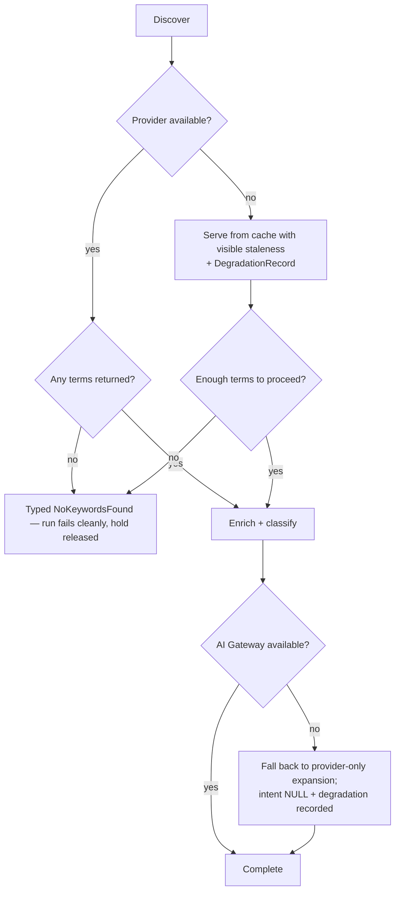

# Keyword Intelligence Engine

> **Status:** v2.0 — complete. Stage 1 of 13. Bounded context: **Discovery**.
> **Single responsibility: it discovers.** It finds what is worth writing about and ranks the opportunity. It does not observe the results page (stage 2), judge competitors (stage 3), or write anything.

## Overview

**Business purpose.** Every content investment starts with a bet: this topic, for this audience, is worth the cost of producing an article. Made badly, everything downstream is wasted — perfect execution on a keyword nobody searches, or one the workspace cannot realistically rank for, produces a beautiful asset with no return. This engine makes that bet explicit, evidenced, and reviewable.

**Technical purpose.** Turn a seed — a topic, a phrase, a brief, or a refresh signal — into a **scored keyword set** with one primary term and a bounded set of supporting terms, each carrying provider metrics with an `asOf` timestamp, and each opportunity carrying an Explainability Envelope.

## Responsibilities

- Seed interpretation: brief, explicit keyword, competitor domain, or `RefreshRecommended` signal.
- Expansion: related terms, long-tail variants, questions, and semantically adjacent terms.
- Metric enrichment from the keyword data provider: volume, difficulty, CPC, trend.
- Intent classification per term.
- Deduplication, canonicalization, and clustering into primary plus supporting.
- Opportunity ranking, with the reasoning attached.
- Cache management for keyword data, so the same term in the same locale is not purchased twice.

## Non-responsibilities

| Not owned | Owner |
|---|---|
| SERP capture and structural analysis | `serp-intelligence.md` |
| Competitor judgment | `competitor-intelligence.md` |
| Evidence, sources, provenance | `research-engine.md` |
| Intent as a *planning* decision (persona, angle) | `planning-engine.md` |
| Provider auth, rate limits, retries | `09-integrations/dataforseo.md` |
| Content quality scores | `review-engine.md`, `seo-engine.md` (ADR-021) |
| Whether an article gets created | `04-platform/projects.md`, orchestration |

**A note that prevents real drift:** keyword volume, difficulty, and CPC are **provider metrics, not ADR-021 Scores**. They are not 0–100 quality measures, they carry no verdict, and they are not comparable to `seo` or `readability`. This engine produces **no score categories at all**. Anything here that looked like a "keyword score" in v1 is an `Opportunity` ranking with an envelope, which is a different artifact governed by ADR-009.

## Inputs

| Input | Source | Validation |
|---|---|---|
| `ResearchScope.seedKeywords[]` | Brief, or explicit user input | 1–20 seeds, each 1–120 chars, trimmed, non-empty |
| `locale` | Resolved settings (project → workspace → org) | Must be a supported language/market pair |
| `projectId`, `tenantId`, `organizationId` | Tenant context | Project must be `active`; workspace not `suspended` |
| `depth` | Resolved settings | `shallow` \| `standard` \| `deep` — bounds expansion and provider spend |
| `excludeTerms[]` | Workspace settings | Optional brand-safety exclusions |
| `refreshSignal` | `RefreshRecommended` event | Optional; carries the prior keyword set for re-evaluation |

**Preconditions.** A credit hold exists for the run (`04-platform/credits.md`); the project has a `target_site` when competitor-derived expansion is requested.

**Ownership.** Inputs are read-only. This engine never mutates the brief, the project, or its settings.

## Outputs

| Artifact | Detail |
|---|---|
| `KeywordSet` | One primary `Keyword`, up to N supporting, `locale`, `asOf`. **Immutable once written** |
| `Keyword[]` | `{ term, locale, volume?, difficulty?, cpc?, intent?, asOf }` — **all metrics nullable** |
| `Opportunity[]` | Ranked recommendations, each with an Explainability Envelope |
| `DegradationRecord[]` | What was not gathered, and why |

**Score impact:** none produced. None consumed — this engine runs before any content exists to score.

**Database impact:** writes `keyword_sets` and `keywords` (immutable, `03-database/tables.md` §4). Reads the external-data cache. No schema change.

## Workflow

```mermaid
sequenceDiagram
    participant ORCH as Orchestrator
    participant KW as Keyword Intelligence
    participant CACHE as External-data cache
    participant PROV as KeywordDataProvider
    participant AIGW as AI Gateway
    participant PG as PostgreSQL

    ORCH->>KW: discoverKeywords(runId, scope) [activity]
    KW->>KW: normalize + canonicalize seeds
    KW->>AIGW: AIRequest(task_type=keyword.expand, tier hint fast)
    AIGW-->>KW: candidate terms
    KW->>CACHE: lookup (tenant, term, locale)
    CACHE-->>KW: hits (with freshness)
    KW->>PROV: fetch metrics for misses (batched)
    alt provider degraded
        PROV-->>KW: partial / error
        KW->>KW: record DegradationRecord; metrics stay NULL
    else ok
        PROV-->>KW: metrics
    end
    KW->>AIGW: AIRequest(task_type=keyword.intent_classify, batched)
    KW->>KW: dedupe, cluster, rank opportunities + envelopes
    KW->>PG: BEGIN — insert keyword_set + keywords + outbox event — COMMIT
    KW-->>ORCH: KeywordSetRef
```

### Failure branches



**Compensation.** Nothing external is mutated, so there is nothing to compensate. A failed activity is retried by Temporal; a permanently failed stage fails the run and releases the credit hold in full (`orchestration.md`).

## Domain rules

1. A `KeywordSet` has **exactly one primary** term. Ties are broken deterministically by opportunity rank, then lexically, so the same inputs always yield the same primary.
2. `asOf` is **mandatory** on every keyword and every set. A metric without a timestamp is invalid.
3. **A missing metric is `NULL`, never `0`** — unknown volume and zero volume are different facts (`02-domain-design/research.md` rule 10).
4. Supporting terms are bounded by `depth` (shallow 20, standard 60, deep 150). Bounds are policy from settings, not constants.
5. `excludeTerms` are applied **after** expansion and before ranking, and exclusions are recorded so the user can see what was removed.
6. Keyword sets are **immutable**. Re-running discovery produces a new set; comparing sets is how change is detected.
7. An `Opportunity` without a complete Explainability Envelope cannot be persisted.
8. The engine never proceeds with zero terms — it fails with `NoKeywordsFound` rather than emitting an empty set that downstream stages would treat as valid.

**State machine.** The engine is stateless; the artifact's lifecycle is `requested → expanding → enriching → classifying → complete | degraded | failed`, surfaced through run status.

**Concurrency and idempotency.** Idempotent on `(workflow_id, 'keyword.discover')`. A retry re-uses cached provider data and produces an identical set for identical inputs. Two concurrent runs on one project are permitted and produce independent sets.

## AI usage

All model interaction is an `AIRequest` through the **AI Gateway** (ADR-008). No provider SDK is imported anywhere in this engine.

| Task type | Purpose | Tier hint | Notes |
|---|---|---|---|
| `keyword.expand` | Generate semantically adjacent candidate terms the provider's related-terms API misses | Fast | High volume, batched |
| `keyword.intent_classify` | Classify intent per term | Fast | Batched; low-confidence results escalate once to Mid |
| `keyword.cluster` | Group terms into primary and supporting themes | Fast | Bounded by `depth` |

- **Prompt Engine** supplies versioned templates (`keyword.expand`, `keyword.intent_classify`, `keyword.cluster`); `prompt_version` is recorded on every response.
- **Context Builder** assembles brief, locale, project target site, and exclusions within a token budget. No evidence is available at this stage, so context is small and cheap.
- **Memory** contributes the workspace's prior keyword decisions — terms previously rejected are down-weighted rather than re-proposed.
- **Model Router** selects within the fast tier; this engine never names a model.

## Scoring

Per **ADR-021**: this engine **produces no score categories and consumes none.**

| Aspect | Position |
|---|---|
| Categories produced | None |
| Categories consumed | None |
| Provider metrics | Volume, difficulty, CPC, trend — **not** Scores; no verdict, no 0–100 normalization, not comparable to quality categories |
| Opportunity ranking | An ordering with an Explainability Envelope (ADR-009), deliberately not a `Score` |

Introducing a "keyword score" here would create a thirteenth category with a second producer and violate the contract's exclusivity rule.

## Explainability

Every `Opportunity` carries `{ recommendation, reason, evidence[], expected_impact, confidence }`. At this stage `evidence[]` references **provider observations** — the metric records with their `asOf` — rather than Evidence Bank items, which do not exist yet. Reason codes are drawn from the registry (`discovery.high_volume_low_difficulty`, `discovery.question_intent_gap`, `discovery.cluster_authority_fit`), never free prose.

Traceability: opportunity → keyword rows → provider response cache key → `correlationId` → the run. A user asking "why this keyword?" gets metrics, their timestamps, and the reason codes that ranked it.

## Events

All published through the transactional outbox in the state-changing transaction (ADR-020).

| Event | Producer | Consumers | Payload | Retry / DLQ |
|---|---|---|---|---|
| `KeywordResearchCompleted` | This engine | Planning, SERP Intelligence, Projects, Read models, Progress stream | `{ runId, keywordSetId, primaryTerm, supportingCount, locale, asOf }` | 5 attempts, backoff, DLQ |
| `OpportunityIdentified` | This engine | Projects (backlog), Notifications, Read models | `{ opportunityId, projectId, envelope }` | Standard |
| `KeywordResearchDegraded` | This engine | Progress stream, Observability, Notifications | `{ runId, provider, reason, impact }` | Standard |

**Consumed:** `RefreshRecommended` (Analytics) → scope a re-discovery run against the prior set.

**Ordering:** per `runId`. **Idempotency:** consumers dedupe by `eventId`. **Payloads carry counts and identifiers, never the term list** — a keyword set is competitively sensitive and events reach broader consumers than the tables do.

## Database impact

| Table | Operation |
|---|---|
| `keyword_sets` | Insert only |
| `keywords` | Bulk insert; **all metric columns nullable** |
| `research_runs` | Status update by the orchestrator, not here |

**Indexes relied on:** `ix_keywords__tenant_term_locale` — the cache-lookup index, and the highest-value index in Discovery because it is what prevents paying a provider twice for the same term.

**Caching:** external-data cache keyed `(tenant_id, provider, term, locale)`; keyword metrics TTL measured in **weeks** (they change slowly), with freshness surfaced to the user rather than hidden. No schema change.

## APIs

| Surface | Operation |
|---|---|
| REST | `GET /v1/keywords?term=&locale=` (cached lookup) · `GET /v1/research/runs/{id}/keywords` · `GET /v1/projects/{id}/opportunities` |
| Internal | `KeywordIntelligence.discover(scope) → KeywordSetRef` (Temporal activity) · `KeywordCache.lookup(term, locale)` |
| Streaming | `stage.started` / `stage.completed` on the run's SSE channel |
| Workers | Batched provider fetch fan-out (BullMQ), bounded by the provider limiter |

There is **no public endpoint that triggers discovery standalone with unbounded spend** — discovery runs inside a pipeline run with a credit hold, or as an explicitly budgeted research run.

## Security

- Workspace isolation: every read and write carries `tenant_id`; RLS enforces it. Keyword sets are never shared across workspaces, even within one organization.
- Cache keys are tenant-prefixed — a shared cache across tenants would leak which terms a competitor's agency is researching.
- Permission: `research.run` required to start discovery; `research.evidence.read` to view results (`04-platform/permissions.md`).
- Seeds are user input and are treated as data: they are template variables through the Prompt Engine, never concatenated into a prompt (`16-security/prompt-injection.md`).
- Provider credentials live in the Provider Layer; this engine never sees them.

## Performance

| Concern | Approach |
|---|---|
| Provider cost | Cache-first; batched lookups; per-provider limiter with per-tenant fair share |
| Parallelism | Expansion, enrichment, and classification fan out as bounded parallel jobs |
| Timeouts | Provider call 15 s; whole activity 180 s; exceeded → degrade, not fail |
| Back-pressure | Bounded by the provider limiter, not by worker count — adding workers does not increase provider throughput |
| Budget | AI calls capped by the run's remaining credit hold; fast tier keeps cost per run low |
| Target | p95 stage duration **< 90 s** at `standard` depth |

## Observability

- **Metrics:** `keyword_discovery_duration_seconds{depth}`, `keywords_discovered_total`, `keyword_cache_hit_ratio` (the dominant cost lever), `provider_calls_total{provider,result}`, `keyword_degradations_total{reason}`, `opportunities_created_total`, `ai_cost_usd{task_type}`.
- **Tracing:** one span per activity, child spans per provider batch and per AI call, carrying `task_type`, `prompt_version`, `cache_hit`.
- **Logging:** structured, with `runId`, `tenant_id`, `correlationId`, counts and degradations — never the term list.
- **Business KPIs:** opportunities accepted into a backlog, and articles produced per discovered opportunity.
- **AI cost:** attributed per `runId` and `articleId` through `ai_call_costs`, feeding cost-per-article.

## Cross references

- `02-domain-design/research.md` — `KeywordSet`, `Keyword`, `Opportunity` aggregates and their invariants
- `serp-intelligence.md` — the immediate consumer
- `planning-engine.md` — consumes the primary keyword and cluster hints
- `refresh-engine.md` — re-enters this engine through `RefreshRecommended`
- `09-integrations/dataforseo.md` — provider adapter, limits, response mapping
- `08-ai-platform/prompt-engine.md` · `context-builder.md` · `model-router.md`
- `03-database/tables.md` §4 · `03-database/indexes.md` §4.1
- `01-system-architecture/14-scoring-contract.md` — why this engine produces no scores
- `16-security/prompt-injection.md` — seed handling
