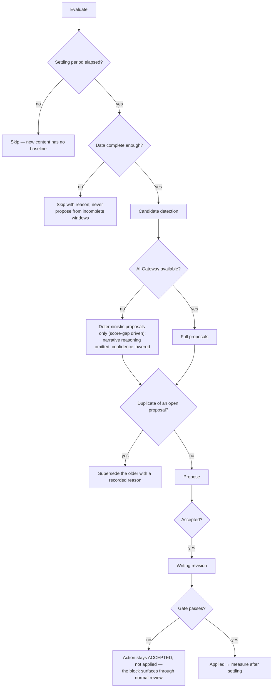

# Optimization Engine

> **Status:** v2.0 — complete. Stage 9 of 13. Bounded context: **Performance**.
> **Single responsibility: it recommends improvements.** It proposes targeted changes to content that still works but could work better. It does not measure performance (stage 12), scope re-research (stage 10), or apply changes itself.

## Overview

**Business purpose.** Most content value is realized after publication, not at it. A page ranking at position 8 with a weak title, or one whose competitors have added a comparison table, is an asset with recoverable upside — and recovering it is far cheaper than producing a new article. This engine is where measurement becomes action, and it is the main reason a customer keeps paying after their content is written.

**Technical purpose.** Consume performance signals, decay signals, and current quality scores; produce **`OptimizationAction` records** — specific, evidence-backed, human-decidable proposals — and measure their outcome after they are applied.

## Responsibilities

- Correlating performance signals with quality and optimization scores to identify recoverable upside.
- Proposing specific optimization actions with expected impact.
- Deduplicating proposals against open ones and superseding stale ones.
- Recording a measurement baseline when an action is accepted.
- Measuring the outcome after a settling period, with honest attribution.
- Feeding accepted actions to Writing as revision instructions.

## Non-responsibilities

| Not owned | Owner |
|---|---|
| Measuring performance | `analytics-engine.md` |
| Detecting decay | `analytics-engine.md` produces `DecaySignal`; this engine consumes it |
| Scoping a re-research cycle | `refresh-engine.md` |
| Producing any score category | `review-engine.md`, `seo-engine.md` (ADR-021) |
| Applying a change | `writing-engine.md` |
| Re-gating an optimized revision | `review-engine.md` |
| Human acceptance workflow | `04-platform/workflow.md` |

**The boundary with Refresh, precisely:** Optimization proposes a **targeted change** to content that still works — a better title, an added section, more internal links. Refresh scopes a **re-research cycle** for content whose underlying evidence has aged or whose topic has moved. A stale statistic is Refresh; a weak meta description is Optimization. When both apply, Refresh subsumes Optimization and open proposals are superseded.

## Inputs

| Input | Source | Validation |
|---|---|---|
| `PerformanceSnapshot[]`, `performance_rollups` | Stage 12 | Must carry `DataCompleteness`; incomplete windows lower confidence |
| `DecaySignal[]` | Stage 12 | Severity and supporting metrics |
| `RankingChange[]` | Stage 12 | Only confidence-qualified changes are acted on |
| `Score[]` — `seo`, `aeo`, `geo`, `accessibility`, `citation_quality` | Stages 7–8, live-URL subjects | Current status only |
| `StructuralConsensus` (refreshed) | Stage 2–3 | Optional; a re-capture may reveal the SERP moved |
| Settling period, automation policy | Resolved settings (ADR-024) | Default 90 days before an article is optimizable |

**Preconditions:** the article is `published` with a tracked live URL; tracking is active, not `paused` or `orphaned`.

## Outputs

| Artifact | Detail |
|---|---|
| `OptimizationAction[]` | Type, envelope, state, baseline, outcome |
| `RevisionInstruction` | Issued to Writing on acceptance |
| `MeasuredOutcome` | Metric deltas with explicit attribution qualification |

**Score impact:** **produces none, consumes many** (ADR-021). This is the engine most likely to be mistaken for a score producer, and it is not: it reads `seo`, `aeo`, `geo`, `accessibility`, and `citation_quality` on live-URL and article-version subjects, and proposes actions. Every category has exactly one producer, and none of them is this engine.

**Database impact:** inserts `optimization_actions`; reads snapshots, rollups, signals, and scores. No schema change.

## Workflow

```mermaid
sequenceDiagram
    participant SWEEP as Scheduled sweep
    participant OPT as Optimization Engine
    participant PG as PostgreSQL
    participant AIGW as AI Gateway
    participant WF as Workflow Service
    participant WR as Writing Engine
    participant RV as Review Engine

    SWEEP->>OPT: evaluate(urlId) [job]
    OPT->>PG: load rollups, decay signals, current scores
    OPT->>OPT: settling period elapsed? tracking active?
    OPT->>OPT: deterministic candidate detection (score gaps, consensus drift)
    OPT->>AIGW: AIRequest(task_type=optimization.propose, tier premium)
    AIGW-->>OPT: candidate actions + reasoning
    OPT->>OPT: dedupe vs open proposals; build envelopes with evidence
    OPT->>PG: BEGIN — insert actions + outbox(OptimizationProposed) — COMMIT
    OPT->>WF: create optimize task for a human
    WF-->>OPT: accept | reject
    alt accepted
        OPT->>PG: record MeasurementBaseline; state=accepted
        OPT->>WR: RevisionInstruction
        WR-->>RV: new revision → normal quality gate
        RV-->>OPT: gate passed → state=applied
        Note over OPT: settling period, then outcome measurement
        OPT->>OPT: measure vs baseline; qualify attribution
        OPT->>PG: state=measured + outcome
    else rejected
        OPT->>PG: state=rejected with reason
    end
```

### Failure branches



**Compensation.** An action is never auto-reverted. If an applied optimization measurably hurt performance, the outcome is recorded honestly and a **new** proposal may reverse it — as a fresh decision with its own evidence, not a silent rollback.

## Domain rules

1. Actions are **proposals**, never auto-applied. Acceptance is a human decision, or an explicitly configured workspace automation with its own audit trail.
2. Every action carries a complete **Explainability Envelope with non-empty `evidence[]`** — enforced by `CHECK` (`03-database/tables.md` §7).
3. At most **one `proposed` action per type per article**; a newer proposal supersedes the older with a recorded reason (partial unique index).
4. An accepted action is applied by Writing as a **new revision**, which re-enters the normal quality gate. Optimization never bypasses Review.
5. **`retire` and `merge` require elevated permission** and explicit confirmation — their consequence is unpublication or URL consolidation.
6. Outcomes are measured against the recorded baseline after the settling period, and `attributable` is **`false`** whenever confounders — a site migration, an algorithm update, a seasonal shift — cannot be excluded.
7. Proposals require complete-enough data; an incomplete metric window produces no proposal rather than a confident one.
8. Content younger than the settling period (default 90 days) is not optimizable — it has not yet earned a baseline.
9. When a `RefreshPlan` is `approved` or `running` for an article, open optimization proposals are **superseded** — refresh subsumes optimization.

**State machine:** `proposed → accepted → applied → measured`, with `rejected` and `superseded` as terminal alternatives.

**Idempotency:** keyed `(urlId, evaluationWindow)` for the sweep; proposals deduped by `(article_id, type)` among `proposed` rows.

**Concurrency:** one evaluation per URL at a time; acceptance is optimistic-concurrency protected.

## AI usage

| Task type | Purpose | Tier hint |
|---|---|---|
| `optimization.propose` | Synthesize performance, decay, and score gaps into ranked, actionable proposals | **Premium / reasoning** |
| `optimization.impact_estimate` | Estimate expected impact band from comparable historical actions | Fast |
| `optimization.instruction_compose` | Convert an accepted action into a precise revision instruction | Mid |

- **Prompt Engine:** versioned templates; `prompt_version` recorded.
- **Context Builder:** assembles rollups, decay signals, current scores, and refreshed SERP consensus within budget. **Metric values are measured data, not model output** — the model reasons over them, it never produces them.
- **Memory:** supplies previously rejected proposals so the same suggestion is not made repeatedly, and the workspace's optimization preferences.
- **Model Router:** premium for proposal synthesis — this is genuine cross-signal reasoning; fast and mid for the rest.
- **AI Council:** not used; a proposal is reversible and human-gated, so the cost is not justified.

## Scoring

Per **ADR-021**: **no categories produced.** Categories consumed: `seo`, `aeo`, `geo`, `accessibility`, `citation_quality`, and `publishing_readiness` for context.

The engine may reference score values and deltas in its recommendations — "`aeo` is 54 against a category median of 78" — but it **never recomputes, adjusts, or asserts** a score. Where an action targets a score gap, the explanation cites the score id, so the proposal is traceable to the exact measurement that motivated it.

## Explainability

Every action carries `{ recommendation, reason, evidence[], expected_impact, confidence }` with:

- **`evidence[]`** referencing performance rollups with their windows and `DataCompleteness`, decay signals, score ids, and refreshed SERP entries with `capturedAt`.
- **Reason codes** from the registry: `optimization.score_gap`, `optimization.consensus_drift`, `optimization.ctr_below_position_expectation`, `optimization.internal_links_sparse`, `optimization.answer_extractability_low`, `optimization.statistic_aged`.
- **`expected_impact`** justified by comparable historical outcomes where available, and explicitly marked as an estimate where not.
- **`confidence`** scaled by data completeness and the strength of the signal.

**Outcome honesty is part of explainability.** A measured outcome states `attributable: false` and names the confounders rather than claiming credit. A platform that claims every improvement is its own doing is not trustworthy about the ones that are.

## Events

Published through the transactional outbox in the state-changing transaction (ADR-020).

| Event | Producer | Consumers | Payload | Retry / DLQ |
|---|---|---|---|---|
| `OptimizationProposed` | This engine | **Workflow** (task), Notifications, Read models | `{ actionId, articleId, type, envelope }` | Standard |
| `OptimizationAccepted` | This engine | **Writing Engine**, Workflow, Read models | `{ actionId, articleId, type, acceptedBy }` | **Critical** |
| `OptimizationApplied` | This engine | Outcome measurement scheduler, Analytics | `{ actionId, articleId, revisionNumber, baseline }` | Standard |
| `OptimizationOutcomeMeasured` | This engine | Read models, Notifications, Memory | `{ actionId, metricDeltas, attributable }` | Standard |
| `OptimizationRejected` / `OptimizationSuperseded` | This engine | Memory, Read models | `{ actionId, reason }` | Standard |

**Consumed:** `ContentDecayDetected`, `RankingChanged`, `PerformanceSnapshotRecorded` → evaluate; `ScoreCalculated` (live URL) → re-evaluate against new scores; `RefreshRecommended` → supersede open proposals.

**Ordering:** per `articleId`. **Idempotency:** by `eventId` plus the partial unique index on proposed actions.

## Database impact

| Table | Operation |
|---|---|
| `optimization_actions` | Insert; state transitions; `envelope` `CHECK` enforced |
| `performance_rollups`, `decay_signals`, `ranking_changes` | Read only |
| `analyzer_reports` (scores) | Read only |

**Constraints relied on:** partial unique `(article_id, type) WHERE state = 'proposed'`; the non-empty-evidence envelope `CHECK`.

**Indexes:** `(tenant_id, state, detected_at)` on decay signals; `(tenant_id, url_id, window_start DESC)` on rollups.

**Caching:** comparable-outcome sets cached per `(tenant, actionType)` for impact estimation. Reads run against a **replica** — this engine is analytical and must never contend with the write path. No schema change.

## APIs

| Surface | Operation |
|---|---|
| REST | `GET /v1/optimizations` (filterable by state, project, article) · `GET /v1/optimizations/{id}` · `POST /v1/optimizations/{id}/accept` · `POST /v1/optimizations/{id}/reject` · `GET /v1/articles/{id}/optimizations` |
| Internal | `OptimizationEngine.evaluate(urlId) → OptimizationAction[]` (job) · `OutcomeMeasurementService.measure(actionId)` |
| Streaming | None — optimization is asynchronous and inbox-driven, not run-driven |
| Workers | Evaluation sweep; outcome measurement scheduler; supersession sweep (BullMQ) |

## Security

- Workspace isolation on all reads and writes; no cross-tenant benchmarking, and no aggregate that would expose another workspace's performance.
- **`retire` and `merge` require elevated permission** (`analytics.optimization.accept` plus `article.unpublish` for retire) and explicit confirmation.
- Acceptance and rejection are audit-logged with actor and reason.
- Event payloads carry identifiers and envelopes, **never metric values** — performance data is competitively sensitive and events reach notification channels including email.
- Automated acceptance, where a workspace enables it, is audit-logged identically to a human decision and is bounded to low-risk action types by policy.

## Performance

| Concern | Approach |
|---|---|
| Read path | Rollups, never raw snapshots; queries run on a replica |
| Sweep shape | Scheduled batch per workspace over candidate URLs, not per-snapshot evaluation |
| Cost | One premium call per evaluated URL, and only for URLs with a qualifying signal — not every tracked URL every day |
| Timeouts | Evaluation 120 s per URL; measurement 60 s |
| Back-pressure | Sweep concurrency capped per tenant so a 5,000-URL workspace cannot starve others |
| Target | Evaluation p95 **< 90 s** per URL |

## Observability

- **Metrics:** `optimizations_total{state,type}`, `optimization_acceptance_rate`, `optimization_evaluation_duration_seconds`, `optimizations_superseded_total`, `outcome_attributable_ratio`, `expected_vs_measured_impact` (histogram), `ai_cost_usd{task_type}`.
- **Tracing:** one span per evaluation; child spans for candidate detection and proposal synthesis.
- **Logging:** article, action id, type, reason codes, decision actor — never metric values at info level.
- **Business KPIs:** acceptance rate (a collapse toward zero means recommendations have stopped being useful), and **measured uplift on attributable outcomes** — the only honest proof the engine earns its cost.
- **Alerts:** `OptimizationAccepted` DLQ entries; acceptance rate falling below a floor; `expected_vs_measured_impact` diverging persistently, which means impact estimation needs recalibration.

## Cross references

- `02-domain-design/analytics.md` — `OptimizationAction` aggregate, outcome and attribution rules
- `analytics-engine.md` — the source of every signal consumed here
- `refresh-engine.md` — the sibling that subsumes this engine when evidence has aged
- `writing-engine.md` — applies accepted actions as revisions
- `review-engine.md` — re-gates every optimization revision
- `seo-engine.md` — the source of the live-URL scores most often driving proposals
- `01-system-architecture/14-scoring-contract.md` — why this engine produces no categories
- `04-platform/workflow.md` · `04-platform/settings.md`
- `03-database/tables.md` §7
