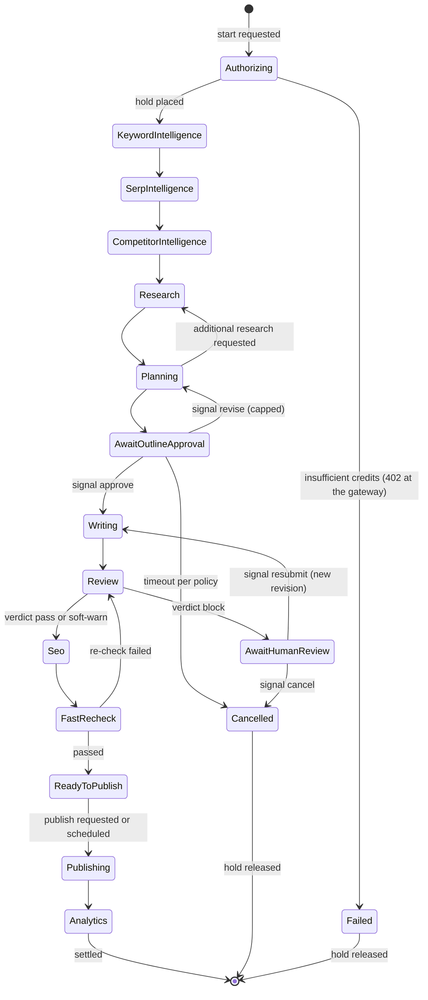
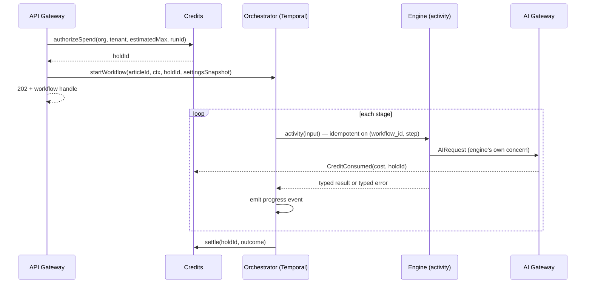
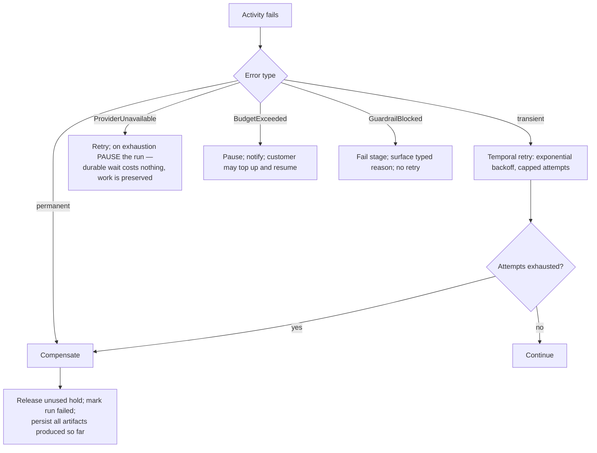

# Orchestration

> **Status:** v2.0 — complete. The control plane for the Content Platform.
> **Single responsibility: it coordinates.** It starts, sequences, pauses, resumes, retries, and compensates. **It performs no business work of any kind** — no measurement, no generation, no judgment, no scoring.

## Overview

**Business purpose.** A content run costs real money, spans minutes to days, and may wait on a human for a week. Customers pay before the work completes. Orchestration is what makes that commercially safe: a run survives deploys and crashes, a human wait costs nothing, a failure releases what was held, and no customer is ever charged for work that did not happen.

**Technical purpose.** Express the thirteen-stage pipeline as a **durable Temporal workflow** (ADR-004), invoke each engine as an idempotent activity, park on signals for human decisions, and own the credit hold lifecycle from authorization to settlement.

**Why a control plane exists at all.** Without one, sequencing lives in the engines — each knowing what comes next, each retrying its successor, each guessing at compensation. Run position becomes distributed across thirteen services and reconstructible from none of them. Centralizing coordination is what lets every engine be genuinely single-purpose.

## Responsibilities

- Defining and executing the pipeline workflow.
- Invoking engines as activities with per-stage retry policy and timeouts.
- Managing durable waits: outline approval, blocked-gate review.
- Processing signals: approve, revise, resubmit, cancel, override.
- Compensation on failure and cancellation.
- Owning the **credit hold lifecycle**: authorize → consume → settle or release.
- Tracking and exposing run state and progress.
- Enforcing per-stage budgets and the run's overall envelope.

## Non-responsibilities

| Not owned | Owner |
|---|---|
| **Any business decision whatsoever** | The engines |
| Producing or interpreting scores | `review-engine.md`, `seo-engine.md` (ADR-021) |
| Deciding whether content passes a gate | `review-engine.md` — orchestration routes on the verdict, never computes it |
| Human task creation, assignment, approval chains | `04-platform/workflow.md` |
| Credit pricing and the ledger | `04-platform/credits.md` — orchestration calls it, never writes ledger rows |
| Notification delivery | `04-platform/notifications.md` |
| Event bus mechanics | `13-event-platform/`, ADR-020 |
| Editorial workflow state | `04-platform/workflow.md` — distinct from execution workflow |

**The rule that keeps this honest:** if a code path here would need to *understand* an artifact — read a score, inspect a draft, evaluate coverage — it is business logic in the wrong place. Orchestration reads **verdicts and typed results**, never their contents.

## Inputs

| Input | Source | Validation |
|---|---|---|
| `articleId`, `projectId`, `TenantContext` | API Gateway (`202` + handle) | Workspace `active`; project not `paused`/`archived` |
| `runType` | Request | `full` \| `research_only` \| `refresh` \| `optimization_apply` |
| `holdId` | `04-platform/credits.md` | **Required** — no run starts without an authorized hold |
| Settings snapshot | `04-platform/settings.md` (ADR-024) | Resolved and **frozen at run start** |
| Prompt version pins | `08-ai-platform/prompt-engine.md` | Pinned at start so mid-run promotion cannot alter behaviour |
| Signals | Workflow service, human actions | `approve`, `revise`, `resubmit`, `cancel`, `override` |

## Outputs

| Artifact | Detail |
|---|---|
| `Run` | Durable workflow execution with queryable state |
| Progress events | Streamed to the client over SSE |
| `RunCompleted` / `RunFailed` / `RunCancelled` | Terminal outcomes |
| Settlement instruction | To Credits, on every terminal state |

**Score impact:** produces none, consumes none. It routes on the **verdict**, which is not a score value (ADR-021 §6).

**Database impact:** `research_runs` status; workflow state lives in **Temporal's own persistence**, a separate database from application data (`01-system-architecture/11-deployment-topology.md`).

## Workflow

### Activity invocation

### Failure and compensation

**Compensation policy, stage by stage:**

| Stage | On permanent failure |
|---|---|
| Discovery (1–3) | Release hold in full; no external effect to undo |
| Research (4) | Evidence already committed **remains** — it is knowledge, not run waste; release unused hold |
| Planning (5) | Outline versions retained; a future run resumes from them |
| Writing (6) | No partial revision exists — commit is atomic |
| Review (7) | Scores and reports retained; append-only |
| SEO (8) | Pre-optimization revision remains publishable |
| Publishing (11) | **No rollback.** Succeeded targets stay live; compensation is an explicit human `unpublish` |
| Analytics (12) | Idempotent; no compensation needed |

**Publishing is the asymmetry that shapes the whole design.** Everything before it is internal and reversible; publishing is external and is not. That is why the pipeline places every gate before it and why no automatic compensation touches a customer's live site.

## Domain rules

1. **No run starts without an authorized credit hold.** The gateway returns `402` before any provider spend occurs.
2. Settings and prompt versions are **snapshotted at run start**; a mid-run change never alters a running workflow's behaviour (ADR-024).
3. Every activity is **idempotent on `(workflow_id, step)`** — Temporal will retry, and a retry must produce exactly one effect.
4. **Human waits are durable timers, not polling.** A week-long approval wait costs zero compute.
5. Orchestration **never advances a pipeline from an event.** Events notify; signals advance. Run position lives in exactly one place.
6. Only one active run per article; a duplicate start returns the existing handle (idempotent).
7. **Every terminal state settles the hold** — success settles actual consumption, failure and cancellation release the unused remainder in full.
8. The revise loop and the resubmit loop are **capped by policy**; beyond the cap the run routes to a human decision rather than looping.
9. **Orchestration never inspects an artifact's contents.** It routes on verdicts and typed results only.
10. A workflow whose definition changes must remain **replay-deterministic** for in-flight runs — versioned workflow code, with replay tests in CI (`10-testing/integration-testing.md`).
11. Refresh runs execute the **complete pipeline**; no stage is skipped (`refresh-engine.md` rule 4).

**Idempotency:** workflow id is `run:{articleId}:{runType}:{idempotencyKey}`; activity ids are `(workflow_id, step)`.

**Concurrency:** stages are sequential by dependency; within a stage, engines fan out internally. Runs across articles are fully parallel, bounded by task-queue capacity and per-tenant fair scheduling.

## AI usage

**None.** Orchestration issues no `AIRequest`, holds no prompt, and names no model. Every AI interaction belongs to the engine performing the work.

This is a hard boundary. A control plane that reasoned about content would be non-deterministic, and Temporal workflow code **must be deterministic** to replay correctly — a model call inside workflow code would break resumption outright.

## Scoring

Per **ADR-021**: **no categories produced or consumed.**

Orchestration routes on the **`GateVerdict`** — a three-value enum — never on score values. It does not know what `readability` is, cannot compare a score against a threshold, and has no access to the threshold snapshot beyond passing it to the engine that applies it. Routing on a verdict rather than a number is what keeps the gate's authority in one place.

## Explainability

Orchestration produces no recommendations and therefore no envelope. It produces the **execution record** that makes every other explanation locatable in time:

- Run timeline: stage, start, end, outcome, retries.
- The settings snapshot and prompt version pins in force.
- Every signal received, with actor and timestamp.
- Every compensation performed, with reason.
- The credit hold lifecycle: authorized amount, consumed, settled.

Traceability: `correlationId` links the originating request to the workflow, to every activity, to every AI call, to every event, and to every artifact — the chain that answers "what happened to this run?" in one query (`14-operations/incident-response.md`).

## Events

Orchestration **consumes** signals and **emits** run-lifecycle events through the outbox (ADR-020). Progress events are transient — published to Redis pub/sub for streaming, not persisted as domain events, because run state is already durable in Temporal and duplicating it would create two sources of truth (`01-system-architecture/09-request-flow.md`).

| Emitted | Consumers | Payload | Retry / DLQ |
|---|---|---|---|
| `RunStarted` | Read models, Progress stream, Notifications | `{ runId, articleId, runType, holdId }` | Standard |
| `RunStageCompleted` | Progress stream, Read models | `{ runId, stage, durationMs, outcome }` | Standard (transient for streaming) |
| `RunPaused` | Notifications, Read models | `{ runId, reason, resumable }` | Critical |
| `RunResumed` | Progress stream | `{ runId }` | Standard |
| `RunCompleted` | Credits (settle), Articles, Notifications, Read models | `{ runId, articleId, outcome, stagesCompleted }` | **Critical** |
| `RunFailed` | **Credits (release)**, Notifications, Observability | `{ runId, stage, reason }` | **Critical** |
| `RunCancelled` | **Credits (release)**, Notifications | `{ runId, actor, reason }` | **Critical** |

**Consumed as signals** (not events): `approve`, `revise` (Planning); `resubmit`, `cancel`, `override` (Review); `publish`, `schedule` (Publishing). These arrive from `04-platform/workflow.md` and the API Gateway — **never from the event bus**, because a lost event would strand a paid run indefinitely.

**Consumed as events:** `WorkspaceSuspended` / `OrganizationSuspended` → cancel in-flight runs at the next durable checkpoint and release holds; `ProjectArchived` → block new runs, let in-flight complete.

## Database impact

| Store | Usage |
|---|---|
| **Temporal persistence** | Workflow state, history, timers — a **separate database** from application data, with its own scaling and backup profile |
| `research_runs` | Status, degradations (written by engines, read for run summary) |
| `credit_holds` | Read and settle via the Credits service; **never written directly** |
| `idempotency_keys` | Run-start deduplication at the gateway |

Orchestration owns **no application tables**. Workflow history is backed up on the same PITR policy as application data, because losing it means losing in-flight paid work (`14-operations/backup-recovery.md`).

## APIs

| Surface | Operation |
|---|---|
| REST | `POST /v1/articles/{id}/pipeline` (202 + handle, `Idempotency-Key` required) · `GET /v1/runs/{workflowId}` · `GET /v1/runs/{workflowId}/progress` (SSE) · `POST /v1/runs/{workflowId}/cancel` |
| Internal | `Orchestrator.start(articleId, ctx, holdId, snapshot)` · `.signal(workflowId, signal, payload)` · `.query(workflowId) → RunState` · `.terminate(workflowId, reason)` |
| Streaming | The run's SSE channel: `stage.started`, `stage.completed`, `approval.required`, `gate.blocked`, `run.completed`, `run.failed` — resumable via `Last-Event-ID` |
| Workers | Temporal workflow and activity workers, scaled per task queue |

## Security

- Runs execute under the `TenantContext` captured at start; **activities re-establish tenant context from the workflow input**, never from ambient state — a background activity running under the wrong tenant would be a cross-tenant write.
- Workers use the **same RLS-enforced database role** as request-path services; background work cannot bypass tenant isolation.
- Signals are authorized at the API boundary (`article.approve`, `article.review`) and re-checked at decision time.
- Cancellation requires `article.run_pipeline`; termination is platform-admin only and audit-logged.
- The settings snapshot is carried in workflow input, so a compromised settings write cannot retroactively weaken a running run's gates.
- Run identifiers and stage names appear in telemetry; **artifact contents never do**.

## Performance

| Concern | Approach |
|---|---|
| Human waits | **Zero compute** — durable timers, not polling. This is the single largest efficiency property of the design |
| Activity dispatch | p95 < 200 ms |
| Task queues | Partitioned per stage class, so a slow drafting queue never starves discovery |
| Fair scheduling | Round-robin across tenants, not FIFO — a 500-article agency batch interleaves with a single-article workspace |
| Back-pressure | Worker concurrency plus per-tenant caps; queues absorb spikes |
| Timeouts | Per activity as specified by each engine; whole workflow bounded by policy excluding human waits |
| Target | Pipeline **p50 < 8 min, p95 < 20 min** excluding human wait (`01-system-architecture/06-c4-context.md` NFRs) |

## Observability

- **Metrics:** `pipeline_runs_total{outcome}`, `pipeline_stage_duration_seconds{stage}`, `pipeline_active`, `pipeline_awaiting_human_seconds` (**tracked separately** — human wait is excluded from the duration SLO), `activity_retries_total{stage}`, `temporal_task_queue_backlog`, `runs_paused_total{reason}`, `holds_settled_total{outcome}`.
- **Tracing:** one trace per run spanning every stage; each activity is a span linked to the originating request by `correlationId`, and AI spans nest inside their engine's span.
- **Logging:** run id, stage, outcome, retry count, signal receipts, compensation actions — never artifact contents.
- **Business KPIs:** pipeline success rate (SLO ≥ 99%), time-to-first-published-article for a new workspace, and share of runs requiring human intervention.
- **Alerts:** task-queue backlog above threshold; runs paused beyond a policy window (**paid work is parked**); `RunFailed` or `RunCancelled` DLQ entries (a hold may not have been released — a billing-integrity issue); workflow replay non-determinism detected (**page** — a deploy broke in-flight runs).

## Cross references

- `01-system-architecture/07-c4-container.md` — the Orchestrator container and the request/execution plane split
- `01-system-architecture/09-request-flow.md` — the `202` + handle + SSE pattern and credit authorization
- `01-system-architecture/10-event-flow.md` — why events notify and signals advance (ADR-020)
- `01-system-architecture/13-adr-log.md` — ADR-004 (Temporal), ADR-011 (stage order)
- `04-platform/credits.md` — hold, consume, settle
- `04-platform/workflow.md` — the source of human signals; editorial versus execution workflow
- `04-platform/settings.md` — the snapshot frozen at run start (ADR-024)
- Every engine document in this folder — invoked here as activities
- `10-testing/integration-testing.md` — workflow replay and crash-resumption tests
- `14-operations/incident-response.md` — playbook P3 (stalled pipelines)
