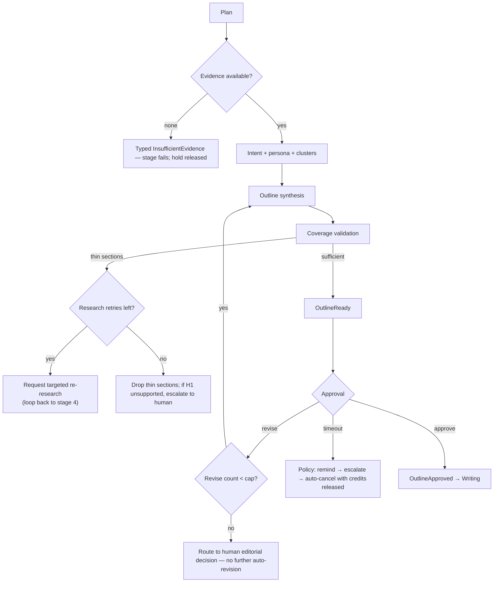

# Planning Engine

> **Status:** v2.0 — complete. Rewritten for ADR-020, ADR-021, and Phases 2–4. Supersedes the v1.0 document, which named models directly and predates the scoring contract.
> **Stage 5 of 13.** Bounded context: **Authoring**.
> **Single responsibility: it structures intent.** It decides what to write, for whom, at what angle, and in what shape. It gathers nothing (stage 4) and writes nothing (stage 6).

## Overview

**Business purpose.** Writing without a plan produces generic, evidence-thin content and spends premium tokens on exploration rather than execution. Planning is where intelligence becomes intent: the point at which four stages of gathered signal are converted into a specific, defensible decision about a specific article. It is also the pipeline's **first human checkpoint**, and therefore the moment where a customer's editorial judgment enters the machine.

**Technical purpose.** Consume keywords, SERP structure, competitive gaps, and evidence; emit a versioned, coverage-validated **outline** that the Writing Engine executes section by section. The outline is a contract: Writing must not silently restructure it.

## Responsibilities

- Intent classification for the primary keyword, with confidence.
- Persona synthesis: reader profile, pain points, desired outcome, content angle.
- Topic clustering: pillar and supporting topics with an internal-linking plan.
- Outline synthesis: H1, sections and depth, planned elements (tables, FAQs, statistics, CTA), each mapped to available evidence.
- **Coverage validation** — verifying every planned section has sufficient evidence before approval is possible.
- Managing the approval gate: emitting `OutlineReady`, holding the durable wait, processing approve and revise signals.
- Producing an Explainability Envelope for every planning choice.

## Non-responsibilities

| Not owned | Owner |
|---|---|
| Gathering evidence, or fetching anything | `research-engine.md` |
| Computing coverage *sufficiency algorithms* | `11-knowledge-platform/retrieval-pipeline.md`; Planning consumes the report |
| Drafting any prose | `writing-engine.md` |
| Quality scoring of the resulting content | `review-engine.md`, `seo-engine.md` (ADR-021) |
| The human approval task, assignment, and chain | `04-platform/workflow.md` |
| The durable wait itself | Temporal, via `orchestration.md` |
| Approval policy values and revise-loop cap | `04-platform/settings.md` (ADR-024) |

**The boundary that keeps this engine honest:** Planning **never outlines a section that evidence cannot support.** It requests more research or drops the section. That single rule is what prevents the pipeline from generating structure that Writing must then fabricate content into — the failure mode that produced v1's unsupported claims.

## Inputs

| Input | Source | Validation |
|---|---|---|
| `KeywordSet` | Stage 1 | Primary term required |
| `SerpDataset` + `StructuralConsensus` | Stages 2–3 | Optional; absence lowers confidence and is recorded |
| `Gap[]`, `Opportunity[]` | Stage 3 | Optional |
| Evidence summary + entities | Stage 4 / Knowledge Platform | Required — planning cannot proceed with zero evidence |
| `Brief` | Article (snapshotted from project defaults) | Topic, audience, goal, article type, word target, locale |
| Voice profile reference, approval policy, revise cap | Resolved settings + Memory | Snapshotted at run start (ADR-024) |
| `TemplateBody` | Version-pinned template, if the project uses one | Outline conventions, required sections |

**Preconditions:** `KnowledgeIndexed` received for the run; article status is `planning`; credit hold active.

## Outputs

| Artifact | Detail |
|---|---|
| `OutlineVersion` | Intent, persona, cluster map, `PlannedSection[]`, coverage report, rationale. Versioned, monotonic |
| `CoverageReport` | Per-section sufficiency, from the Knowledge Platform |
| `ExplainabilityEnvelope[]` | Why this angle, why this section, why this order |
| Events | `OutlineReady`, `OutlineApproved`, `OutlineRevisionRequested` |

**Score impact:** produces none, consumes none (ADR-021). An outline is a plan, not content, and there is no outline category in the registry. Coverage sufficiency is a Knowledge Platform report, not a Score — it carries no verdict and is not 0–100 normalized.

**Database impact:** inserts `outline_versions`; updates `articles.status` and `articles.approved_outline_id` on approval. No schema change.

## Workflow

```mermaid
sequenceDiagram
    participant ORCH as Orchestrator
    participant PL as Planning Engine
    participant AIGW as AI Gateway
    participant KP as Knowledge Platform
    participant WF as Workflow Service
    participant PG as PostgreSQL

    ORCH->>PL: plan(articleId, runId) [activity]
    PL->>AIGW: AIRequest(task_type=planning.intent_classify, tier fast)
    AIGW-->>PL: intent + confidence
    alt confidence below policy
        PL->>AIGW: re-request at reasoning tier (once)
    end
    PL->>AIGW: AIRequest(task_type=planning.persona_synthesize, tier fast)
    PL->>AIGW: AIRequest(task_type=planning.cluster_generate, tier premium)
    PL->>AIGW: AIRequest(task_type=planning.outline_synthesize, tier premium)
    AIGW-->>PL: outline draft
    PL->>KP: validateCoverage(sections, evidenceRefs)
    KP-->>PL: CoverageReport
    alt any section thin
        PL->>PG: outline status = coverage_thin
        PL-->>ORCH: RequestAdditionalResearch(sections[])
    else sufficient
        PL->>PG: BEGIN — insert outline_version + outbox(OutlineReady) — COMMIT
        PL-->>ORCH: OutlineReady
        ORCH->>WF: create approve task; park on durable wait
        WF-->>ORCH: signal approve | revise
        alt approve
            ORCH->>PL: recordApproval(outlineVersionId, actor)
            PL->>PG: articles.approved_outline_id set; outbox(OutlineApproved)
        else revise
            ORCH->>PL: revise(reason)
            PL->>PG: supersede outline; increment version
        end
    end
```

### Failure and revise branches



**Compensation.** Superseded outline versions are retained, never deleted — the revise history is evidence of how the plan evolved. If a run is cancelled during the approval wait, the outline remains for a future run to resume from, and the credit hold is released.

## Domain rules

1. **Writing cannot begin without an approved outline.** Enforced by a `CHECK` on `articles.status` versus `approved_outline_id` (`03-database/tables.md` §5) — not by convention.
2. Outline versions increment monotonically; every revise records a reason. Versions are immutable once superseded.
3. **A section with thin coverage cannot be approved.** Either more research is gathered or the section is removed (`02-domain-design/articles.md` rule 10).
4. Cluster generation is bounded (default ≤100 supporting topics) by policy, not by a constant in code.
5. The revise loop is capped (default 3, workspace-configurable, OQ-15). Beyond the cap, the article routes to a human editorial decision rather than looping.
6. Approval requires `article.approve`; auto-approval is permitted **only** when workspace policy enables it and planning confidence exceeds the configured threshold (OQ-15).
7. Approval **pins** the outline. Writing executes it; structural change requires a new outline version.
8. Low-confidence intent escalates from fast to reasoning tier **exactly once**; if still low, it is surfaced to the user rather than guessed at.
9. Template `outlineConventions`, when a project pins a template, constrain synthesis — required sections must appear, and their absence blocks readiness.

**State machine (OutlineVersion):** `draft → coverage_thin → draft → awaiting_approval → approved | superseded`.

**Idempotency:** keyed `(workflow_id, 'planning.plan', outlineVersion)`. A retry regenerates deterministically from the same inputs and settings snapshot.

**Concurrency:** one active planning activity per article, enforced by the workflow. A human revise signal arriving during regeneration is queued, not applied mid-flight.

## AI usage

| Task type | Purpose | Tier hint |
|---|---|---|
| `planning.intent_classify` | Classify search intent with confidence | Fast (escalates once to reasoning on low confidence) |
| `planning.persona_synthesize` | Reader profile, pain points, angle | Fast |
| `planning.cluster_generate` | Pillar and supporting topic map with linking plan | **Premium / reasoning** |
| `planning.outline_synthesize` | Section structure mapped to evidence | **Premium / reasoning** |

- **Prompt Engine:** versioned templates, pinned at run start so a mid-run promotion cannot alter behaviour; `prompt_version` recorded per response.
- **Context Builder:** assembles brief, keyword set, structural consensus, gaps, and **evidence references** within a token budget. Evidence enters as data, never as instructions.
- **Memory:** supplies the workspace's voice profile reference, prior angles, and previously rejected structures, so planning aligns with an existing editorial strategy.
- **Model Router:** premium for clustering and outline synthesis — these are the pipeline's highest-leverage reasoning tasks, where cheap output produces expensive downstream waste. No model is named here; tier assignment is routing policy (ADR-013).
- **AI Council:** available under policy for high-stakes outlines (YMYL, pillar content) where genuine deliberation is warranted (ADR-019). Council usage is a producer decision, disclosed to the user, and cost-budgeted.

## Scoring

Per **ADR-021**: **no categories produced, none consumed.**

Planning's output is what later scoring measures against — `seo` and `aeo` evaluate whether the executed structure serves the intent this engine classified — but Planning itself asserts no quality measure. The coverage report is a sufficiency assessment from the Knowledge Platform, deliberately not a Score: it has no verdict, no category, and no place in the registry.

## Explainability

Every planning decision carries an Explainability Envelope:

| Decision | `evidence[]` references | Reason codes |
|---|---|---|
| Content angle | Competitor gaps, SERP consensus, keyword intent | `planning.gap_driven_angle`, `planning.intent_alignment` |
| Section inclusion | Evidence items supporting it, competitor prevalence | `planning.evidence_supported`, `planning.consensus_expectation` |
| Section exclusion | Coverage report showing thin support | `planning.insufficient_evidence` |
| Section ordering | SERP structural consensus, intent | `planning.consensus_ordering` |
| Cluster membership | Keyword semantic proximity, entity overlap | `planning.topical_cluster` |

Every recommendation asserting a fact carries non-empty `evidenceRefs`, enforced by `CHECK` where persisted. A user asking "why does this outline have a comparison table?" receives the competitor prevalence, the SERP entries showing it, and their `capturedAt`.

Traceability: outline section → evidence refs → evidence items → sources → provenance → `correlationId`.

## Events

Published through the transactional outbox in the state-changing transaction (ADR-020).

| Event | Producer | Consumers | Payload | Retry / DLQ |
|---|---|---|---|---|
| `OutlineReady` | This engine | **Workflow** (approve task), Notifications, Research (coverage), Progress stream | `{ articleId, outlineVersionId, versionNumber, coverageSummary, sectionCount }` | Standard |
| `OutlineApproved` | This engine | **Writing Engine**, Workflow, Progress stream | `{ articleId, outlineVersionId, approvedBy, auto }` | **Critical — blocks the pipeline on DLQ** |
| `OutlineRevisionRequested` | This engine | Planning (self), Notifications, Read models | `{ articleId, outlineVersionId, reason, loopCount }` | Standard |
| `AdditionalResearchRequested` | This engine | Research Engine, Orchestrator | `{ runId, articleId, thinSections[] }` | Standard |
| `PlanningEscalated` | This engine | Workflow (human decision), Notifications | `{ articleId, reason, loopCount }` | Standard |

**Consumed:** `KnowledgeIndexed` → planning may proceed; `ResearchCompleted` (re-research) → re-validate coverage.

**Ordering:** per `articleId`. **Idempotency:** by `eventId`; consumers dedupe. Payloads carry counts and identifiers — never outline content, which is competitively sensitive.

## Database impact

| Table | Operation |
|---|---|
| `outline_versions` | Insert; status transitions; **immutable once superseded** |
| `articles` | Update `status`, `approved_outline_id` (optimistic concurrency via `version`) |
| `evidence_items` | Read only, via the Knowledge Platform |

**Constraints relied on:** `UNIQUE (article_id, version_number)`; the `articles` `CHECK` binding writing states to an approved outline.

**Indexes:** `ux_outline_versions__article_version`; `ix_articles__tenant_project_status`.

**Caching:** cluster generation cached per `(tenant, primary_term, locale)` — the most expensive repeated premium call in the pipeline, and frequently identical across articles in one cluster campaign. No schema change.

## APIs

| Surface | Operation |
|---|---|
| REST | `GET /v1/articles/{id}/outline` · `GET /v1/articles/{id}/outline/versions` · `POST /v1/articles/{id}/outline/approve` · `POST /v1/articles/{id}/outline/revise` |
| Internal | `PlanningEngine.plan(articleId, runId) → OutlineVersionRef` (activity) · `PlanningEngine.recordApproval(outlineVersionId, actor)` |
| Streaming | `approval.required` on the run's SSE channel — the moment the user must act |
| Workers | None; planning is entirely activity-driven |

Approve and revise endpoints send Temporal signals via the orchestrator; they never advance the pipeline directly (`04-platform/workflow.md`).

## Security

- Workspace isolation on outlines and evidence reads; RLS enforced.
- **Approval authority is a domain rule**, checked server-side at decision time — a demoted user must not approve via a stale link (`04-platform/permissions.md`).
- Evidence and competitor content reach models as data only; the outline synthesis prompt is the last stage where retrieved content is in context before generation, making injection framing critical here (`16-security/prompt-injection.md`).
- Outline content never appears in event payloads or logs.
- Every approval, revision request, and auto-approval is audit-logged with actor, article version, and reason.

## Performance

| Concern | Approach |
|---|---|
| Cost | Two premium calls per outline version (clusters, synthesis); clustering cached across articles in a campaign |
| Parallelism | Intent and persona run concurrently; clustering and synthesis are sequential by dependency |
| Approval waits | **Zero compute** — Temporal durable timers, not polling |
| Timeouts | Intent 20 s; synthesis 120 s; activity 300 s |
| Revise loops | Capped, and each loop re-runs only synthesis and coverage — not intent, persona, or clustering |
| Target | p95 **< 180 s** to `OutlineReady`, excluding human wait |

## Observability

- **Metrics:** `planning_duration_seconds`, `outline_versions_total`, `outline_revise_loops` (histogram), `coverage_validation_result{sufficient,thin}`, `intent_confidence` (histogram), `intent_escalations_total`, `auto_approvals_total`, `approval_wait_seconds` (tracked separately from pipeline duration), `ai_cost_usd{task_type}`.
- **Tracing:** one span per planning activity; child spans per AI call carrying `task_type`, `prompt_version`, `tier`.
- **Logging:** article, outline version, coverage summary, loop count — never outline content.
- **Business KPIs:** approval rate on first outline; revise loops per article; correlation between coverage strength at approval and eventual gate outcome — the leading indicator that planning quality drives review quality.
- **Alerts:** `OutlineApproved` in the DLQ (**page** — a paid run is parked); revise loops hitting the cap frequently, which indicates a planning-quality problem rather than a user problem.

## Cross references

- `02-domain-design/articles.md` — `OutlineVersion` aggregate, approval and revise rules
- `research-engine.md` — coverage validation and targeted re-research
- `writing-engine.md` — the consumer; the outline is the contract between them
- `11-knowledge-platform/retrieval-pipeline.md` — coverage sufficiency computation
- `04-platform/workflow.md` — approval task and chain
- `04-platform/settings.md` — approval policy, revise cap, cluster bounds (ADR-024)
- `08-ai-platform/ai-council.md` — bounded deliberation for high-stakes outlines (ADR-019)
- `03-database/tables.md` §5 — the constraint enforcing rule 1
- `01-system-architecture/14-scoring-contract.md` — why planning produces no scores
